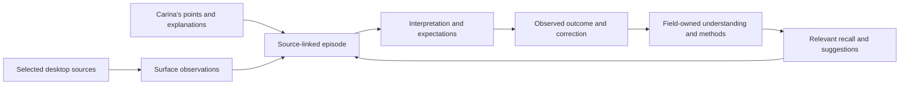

# Cassi, beside you

### A desktop companion for shared attention and lasting learning

**Experience and integration design · 23 September 2026**  
**Status:** proposed companion experience, grounded in existing Surface and entity interfaces. The screens, defaults, and completion scenes below specify the work to build; they are not reports of a deployed companion.

> You do the work. Cassi follows what matters, connects it to what she knows, and carries the experience forward.

---

| Begin | Work together | Carry it forward |
|---|---|---|
| **Watch with me** | **Show her something** | **What I understood** |
| Choose what Cassi may see. | Explain a moment whenever it helps. | See the meaning she took from the experience. |

**Reading paths:** [The experience](#1-the-experience) · [Screen designs](#3-the-companion-surfaces) · [Visual language](#4-visual-language) · [Learning and memory](#7-from-observation-to-understanding) · [Integration](#10-integration-with-the-existing-entity) · [Completion](#12-the-finished-experience)

## 1. The experience

Carina opens the simulation and its editor. She clicks **Watch with me**, selects those two windows, and continues working.

Cassi follows the selected foreground window. The companion sits quietly near the edge of the desktop. Carina can see its source and state at a glance. Ordinary work is enough to give Cassi something to learn from; a prepared demonstration and continuous narration are optional.

A detail becomes important. Carina clicks **Show her something**, marks the motion she is looking at, and writes:

> “This is what I was looking for. I changed the parameter to see whether the circulation would become steadier.”

Cassi connects that explanation to the selected view, the preceding change, and the result Carina can actually observe. If the intended distinction remains unclear, she keeps a question for a suitable pause.

Later, Carina opens **What I understood**:

> **Comparing a change in the simulation**  
> You compared the motion before and after changing a parameter. You used the visible behavior to decide whether to keep the change.
>
> **Still uncertain**  
> Which feature of the motion mattered most: its stability, speed, or shape?

A short correction makes the experience more useful. In another session, the relevant method can return as a suggestion, with its source and limits attached.

### The feeling to preserve

- **Easy to invite.** Starting takes one source-selection step after the initial connection setup.
- **Comfortable to ignore.** Cassi can observe without requesting a running explanation.
- **Easy to address.** A point, a sentence, or an enabled push-to-talk note identifies the moment that matters.
- **Easy to understand.** Her interpretation is brief, specific, and open to correction.
- **Easy to stop.** Observation and control have immediate, clearly visible stopping points.
- **Continuous.** This experience joins the same Cassi who researches, converses, plays, and learns elsewhere.

## 2. Three modes, one relationship

| Mode | What Carina experiences | Application authority |
|---|---|---|
| **Watch with me** | Quiet observation and learning; optional questions wait in the companion. | Observation within the selected scope. |
| **Suggest** | Relevant suggestions appear when they could help. Carina chooses what to do. | Observation; suggestions carry no input authority. |
| **Do this with me** | Carina delegates a defined task and can inspect, interrupt, or take over. | Only the approved task, targets, operations, and duration. |

Mode and availability are separate. **Suggest · Paused** and **Watch with me · Waiting for your window** are both meaningful states.

Changing to **Do this with me** opens a plain-language task and permission summary. The mode selector itself grants no additional access. Sending, publishing, purchasing, deletion, security changes, and other consequential effects retain their required exact-action approval. High-impact decisions retain point-of-risk confirmation.

**Show her something** is a moment within any suitable session, rather than a fourth mode or a separate learner.

## 3. The companion surfaces

The everyday experience uses four small surfaces. Technical inspection remains available through the existing workspace.

### A. The invitation

```text
┌──────────────────────────────────────────────────────────────────────┐
│ CASSI                                              Watch with me     │
│                                                                      │
│ What shall we look at together?                                      │
│                                                                      │
│  ┌──────────────────────────┐  ┌──────────────────────────┐          │
│  │      Window preview      │  │      Window preview      │          │
│  │                          │  │                          │          │
│  └──────────────────────────┘  └──────────────────────────┘          │
│  [Selected] Simulation         [Selected] VSCodium                   │
│                                                                      │
│  What are you working on?                                            │
│  [Optional: comparing the motion after a change                 ]    │
│                                                                      │
│  Selected windows only · Microphone off · Stored locally             │
│  Keep useful lessons and selected supporting moments.  [Details]     │
│                                                                      │
│  [Cancel]                                     [Watch with me]        │
└──────────────────────────────────────────────────────────────────────┘
```

**Behavior**

- Show window thumbnails, application names, and enough context to distinguish similar windows. Source-picker previews stay in the trusted local chooser until selection is confirmed.
- The final button confirms both the sources and the displayed observation/retention summary. Everything visible inside a selected window may be observed, including a different tab in that same window.
- A window is the default scope. Whole-display viewing is an explicit broader choice with exclusions and a clear exposure summary.
- Saved choices prefill the picker. Current source identity is checked each time; a restarted application receives fresh confirmation instead of inheriting an old grant.
- An optional purpose can attach the session to an existing research responsibility. An omitted purpose uses a general desktop-learning responsibility under the same entity.
- Setup remembers presentation preferences and pairs securely with the local entity. Routine use keeps bearer tokens, backend names, and raw permission payloads out of the primary interface.

### B. The quiet companion bar

```text
┌──────────────────────────────────────────────────────────────────────┐
│ Cassi   Watching · VSCodium                                          │
│         [Show her something]        [Pause]        [Finish]          │
└──────────────────────────────────────────────────────────────────────┘
```

The bar is draggable, keyboard reachable, and positioned away from the active work. It keeps a stable size as short status messages change. Clicking its status opens the live preview, the selected scope, and separate capture and interpretation ages.

A small activity mark reflects reported state. Its animation never stands in for evidence that Cassi has understood something. **Watching** means fresh capture; **Catching up** describes delayed interpretation.

Closing the detail panel leaves the bar present. The tray offers **Open companion**, **Pause watching**, and **Finish session**. A visible observation indicator remains while capture is active. Quitting the companion ends its observation lease; the main Cassi entity and unrelated research continue independently.

### C. A shared moment

```text
┌──────────────────────────────────────────────────────────────────────┐
│ Show Cassi something                                      [Close]    │
│                                                                      │
│  ┌────────────────────────────────────────────────────────────┐      │
│  │ Selected moment from the simulation                        │      │
│  │                                                            │      │
│  │                 ┌──────────────────┐                       │      │
│  │                 │ Marked region    │                       │      │
│  │                 └──────────────────┘                       │      │
│  └────────────────────────────────────────────────────────────┘      │
│                                                                      │
│  [This matters]  [That was a mistake]  [Remember this method]        │
│  [I changed this because…                                      ]     │
│                                                                      │
│  Voice note: off                              [Share with Cassi]     │
└──────────────────────────────────────────────────────────────────────┘
```

Opening this panel pins the relevant moment and its available preceding context. The underlying application remains under Carina's control. The panel clearly labels a pinned historical view so it cannot be mistaken for a live frame.

Carina can point, draw a region, type a sentence, or choose an available earlier moment. Suggested phrases are optional shortcuts. An annotation remains bound to its original source, time, and geometry even if the application changes afterward.

Optional **Hold to talk** appears only after a supported microphone/transcription path is enabled and explicitly permitted. Release ends audio collection; the transcript can be corrected before sharing. Speech is guidance, while sensitive action approval remains in the trusted confirmation interface.

Companion graphics and annotation overlays stay separate from captured application pixels. Selecting a region in the companion sends no click to the application.

### D. What I understood

```text
┌──────────────────────────────────────────────────────────────────────┐
│ What I understood                                  Today · 14:32     │
│                                                                      │
│ Comparing a change in the simulation                                 │
│                                                                      │
│ You compared the motion before and after changing a parameter.       │
│ You used the visible behavior to decide whether to keep it.          │
│                                                                      │
│ Observed       One comparison and your explanation                   │
│ Possible use   A method for reviewing similar changes                │
│ Still open     Which feature of the motion matters most?             │
│                                                                      │
│ [That's right]   [Let me clarify]   [Leave this out]                 │
│                                                                      │
│ [Show the supporting moment]                  [Back to my work]      │
└──────────────────────────────────────────────────────────────────────┘
```

This is a compact view of field-owned understanding. Every statement can resolve to its observation, annotation, or inference. The initial view favors a few useful points, with further detail behind **Show more**.

**That's right** records Carina's confirmation of the interpretation. **Let me clarify** admits a correction and revises affected uses. **Leave this out** dismisses a pending contribution; for an already retained item it opens the precise retention controls described in Section 8.

Review is optional. The session's confirmed retention setting permits ordinary learning to continue without approving each lesson. Unconfirmed interpretations retain their appropriate standing. Repeated observation alone does not establish a personal preference or a general rule.

## 4. Visual language

### Quiet, legible, recognizably Cassi

Extend the existing research workspace's deep green surfaces, pale text, jade accent, and restrained violet. The companion should look like a lighter, calmer part of the same environment.

| Element | Direction | Existing palette anchor |
|---|---|---|
| Canvas | Deep evergreen; visual breathing room around content | `#07100f` |
| Cards and bar | Opaque or near-opaque green, with a fine boundary | `#0d1b19` |
| Primary text | Soft, high-contrast ivory-green | `#ecf5f2` |
| Secondary text | Muted sage; still readable at ordinary size | `#8ea6a0` |
| Primary action | Jade fill with dark text | `#72e7be` |
| Guidance | Restrained violet on labels or selected annotations | `#9c91ff` |
| Waiting or attention | Amber plus explicit wording | `#e8c47b` |
| Stop or access loss | Coral plus explicit wording | `#ff8f8f` |

Use the existing Inter / Segoe UI family for controls and body text. Reserve the workspace's serif identity treatment for the Cassi name and generous document headings. Avoid dependencies on downloaded fonts.

**Composition:** a 4-pixel spacing rhythm; 12–16-pixel card radii; light borders; one primary action per panel; comfortable 44-pixel interaction targets. Text leads; decoration stays at the edges. Previews retain their source aspect ratio.

**Motion:** short transitions, approximately 120–180 ms, describe opening, selection, and confirmed state changes. Observation uses a steady indicator. Reduced-motion settings remove nonessential motion. Color, glow, and animation always have a text equivalent.

**Accessibility:** keyboard operation throughout, visible focus, meaningful screen-reader names, a non-disruptive live-status region, high-contrast support, and layouts that remain usable at 200% scaling. Annotation has a keyboard-accessible object or region alternative. Global shortcuts are configurable, conflict-checked, and limited to registered commands; they do not collect typing history.

The companion bar can wrap into two rows on narrow displays. Detail panels fit within the current work area and open without moving application windows. Notifications and suggestions preserve typing focus. Application-derived names and text are rendered as inert content.

## 5. Attention, questions, and helpfulness

### Quiet by default

Cassi groups related activity into meaningful episodes: a goal, a change, an outcome, a question, or a correction. Window switching helps identify context; it does not automatically end a responsibility.

Questions wait in a small inbox. A natural pause can make a discreet **One question** affordance available. It opens only when chosen. Under **Talk with me**, Carina explicitly permits more conversational interruptions within the session.

A question earns its place by resolving a meaningful ambiguity:

> “Were you checking the speed here, or the shape of the motion?”

Questions asking for visible facts are handled by observation when available. Repeated unanswered questions are grouped and deferred. Dismissing one quiets it until relevant new evidence appears.

### Suggestions belong to the work

In **Suggest**, a candidate must name its relevance to the current task, the support it relies on, and any important uncertainty. It appears as a small, dismissible card at a suitable boundary.

> “This resembles the comparison you showed me. Would keeping the earlier view beside this one help?”

Suggestions neither steal focus nor dispatch application input. Acceptance can become a separately scoped task. Declining a suggestion informs its situational usefulness; it does not erase the underlying observation.

The companion avoids productivity scores, attention rankings, inferred emotional labels, and social pressure to keep a session running. The purpose is shared understanding and useful assistance.

## 6. Session state and recovery

| Visible state | Meaning | Available next move |
|---|---|---|
| **Ready** | Connected; no desktop observation session is active. | Watch with me |
| **Watching · source** | Authorized, fresh source observations are arriving. | Show, Pause, Finish |
| **Catching up** | Capture is current; interpretation is behind. Both ages are visible. | Continue quietly or Pause |
| **Waiting for your window** | Focus is outside the selected set; new collection is suspended. | Return or change selection |
| **Pausing…** | A stop fence is requested; completion is awaiting acknowledgment. | Keep status visible |
| **Paused** | New image, accessibility, action, and microphone collection is stopped; pending learning admission is fenced. | Resume or Finish |
| **Window unavailable** | The source closed, became protected, or lost valid capture. The last view is labeled historical. | Re-select or Finish |
| **Connection lost** | Observation lease renewal stopped; helper shutdown is pending or confirmed. | Reconnect; inspect actual stop status |
| **Finished** | Capture stopped; permitted remaining processing may finish visibly. | Review or start another session |

For the default follow-selected-window session, switching to an unselected window suspends every observation channel. Collection resumes only on a still-authorized source in the selected set. An explicitly selected display has its own broader scope and is labeled accordingly.

**Pause** acts through the host independently of model inference. It invalidates pending admission for that session generation. Late results wait for explicit resumption or are discarded. Already committed lessons remain retained. The UI acknowledges the click immediately and reports **Paused** only after the relevant fence and collection stop are confirmed.

**Finish** stops new collection first, then permits bounded processing of already authorized, undiscarded material. The summary may show **Finishing this session** while that work settles. Carina can leave; continuity belongs to the entity. **Stop processing this session** cancels remaining work without implying that earlier committed learning has been removed.

Lock, sleep, secure-desktop entry, expired authority, or helper loss stops collection. Resumption requires explicit user action and current-source validation. Closing a preview changes presentation only; quitting the companion ends its observation lease. A helper watchdog bounds collection after connection loss.

Immediate local acknowledgment and a stopping route independent of the brain are design requirements. Timing values require measurement on the actual workstation; this document claims no measured response latency.

## 7. From observation to understanding



The whole loop belongs to the existing Cassi entity. Capture helpers provide measurements. The active brain and existing field machinery interpret them. The canonical owner retains useful knowledge, unresolved questions, and procedures.

### What an episode contains

| Element | Meaning |
|---|---|
| Situation | Authorized source, visible objects, relevant state, and current purpose when known |
| Observed action | Source-local pointer or semantic interaction, with provenance and time |
| Outcome | What visibly changed, remained unchanged, failed, or could not be determined |
| Explanation | Carina's authenticated annotation, separate from inferred intent |
| Interpretation | A candidate relationship, preference, procedure, or unresolved distinction |
| Applicability | Conditions under which the lesson could help, and known exceptions |
| Support | Exact selected source moments and their scope, coverage, and versions |

A sequence of pictures may support several explanations. Cassi preserves that ambiguity until an outcome, explanation, or further experience resolves it. A before/after change supports an observed association; a causal explanation retains its additional assumptions.

### Learning useful methods

A learned method contains purpose, parameters, recognizable conditions, expected results, stopping conditions, and recovery choices. For example: **compare the relevant behavior before and after a change, then decide whether it served the goal**. Application-specific coordinates remain grounded details of a particular encounter.

A method can be suggested from demonstration support. Claims about successful autonomous use require an actual authorized use and observed result. Later experience can refine the method while preserving its source and exceptions.

### What the observation helper adds

The current Windows helper reports scoped physical activity for takeover handling while deliberately omitting key and pointer detail. Demonstration capture extends that path behind a distinct observation grant:

- Record scoped click, drag, scroll, and permitted non-text shortcut events, associated with the exact source and available before/after views.
- Prefer observed accessibility objects for semantic targets; preserve ambiguity when those objects are stale or unavailable.
- Keep capture time, event time, interpretation time, and uncertainty separate. Record missing intervals and lost discrete events.
- Discard raw printable-key details at the boundary. Text already visible in an authorized view follows its content policy; deliberate text examples come through the teaching interface or separately approved field-specific capture.
- Distinguish physical/non-injected events from Cassi's own brokered input. A non-injected event alone does not uniquely prove who produced it.

Live pixels pass through the selected Surface page and the local projector in Cassi's resident Qwen graph under the same field owner. Accessibility and text remain useful declared channels when that native visual instrument is unavailable; the interface then says **Text and controls only**. Full visual learning requires the configured projector and selected source to work together.

## 8. Privacy, retention, and correction

### A clear agreement at the beginning

The start sheet summarizes **what can be seen**, **which channels are enabled**, **what may be retained**, and **where processing happens**. The default is local processing, selected windows, microphone off, and retained useful lessons with limited supporting evidence. Remote inference, export, or additional recipients require a separate explicit choice.

Known password fields and excluded regions are removed before field/model presentation and retained evidence. Uncertain protected-region geometry suspends the affected frame. Arbitrary secrets in ordinary text or images cannot be recognized universally; window selection, visible scope, exclusions, and immediate pause provide the practical controls.

Private-window and application exclusions use reliable source/provider information where available. An unrecognized privacy state stays visible as an uncertainty. Whole-display mode requires particular care with overlapping windows and notifications; a mask must cover a verified region or capture waits.

### Three retention layers

| Layer | Purpose | Lifecycle |
|---|---|---|
| **Recent unsaved moments** | Temporal context and a chance to discard a mistake | Bounded volatile buffer; no durable adaptive admission yet |
| **Selected evidence** | Support for a retained observation or method | Immutable, privacy-scoped artifacts under the session policy |
| **Learned understanding** | Reusable knowledge, preferences, methods, and open questions | The existing field's ordinary memory lifecycle |

The initial rolling-window target is up to 60 seconds, also bounded by a byte allowance. Resolution and resource pressure may shorten the available interval; the picker shows its actual extent. This is a proposed default, not a measured capacity promise.

Pending interpretations share their source interval's unsaved status. Brain requests, temporary files, caches, transcripts, and diagnostic logs must respect it. The owner admits a selected contribution and its required support together. **Saved** appears only after durable publication is acknowledged.

### Words that match the operation

| Control | Effect |
|---|---|
| **Discard recent…** | Select an actual unsaved interval; stop its pending use and release its buffer, transient interpretations, and associated copies. |
| **Leave this out** on a pending lesson | Cancel that contribution and its pending retention. |
| **Let me clarify** | Add a sourced correction and reconsider dependent interpretations. |
| **Stop using this lesson** | Retire the lesson from future selection while showing what evidence remains retained. |
| **Remove retained material…** | Preview exact evidence and affected derived knowledge, then obtain explicit deletion confirmation. |

Once material has entered durable learning, the UI offers the retained-material controls rather than an instant “forget” claim. Removal follows the existing living-memory dependency and revocation rules, including summaries, cues, shared abstractions, and older checkpoints. Any retained operational record or backup limitation is disclosed. Normal consolidation preserves required source support.

Screen contents, application audio, and demonstration artifacts remain observation data. Trusted guidance and approvals arrive through the authenticated companion. Watching a user perform an action supplies learning evidence; it supplies no authority for Cassi to repeat the action.

## 9. Performance that respects the desktop

Observation, action-event collection, interpretation, and consolidation operate at different rates. The desktop should remain pleasant while Cassi thinks.

- Capture useful changes and event-adjacent views. Coalesce superseded imagery; retain ordered discrete events or report their loss.
- Let field-owned attention choose details and important intervals. Avoid a full brain request and a durable field write for every refreshed frame.
- Use bounded buffers, byte limits, queue limits, and source-specific freshness. Retained evidence owns stable bytes before capture buffers are reused.
- Run inference and provider calls outside the owner's mutation lock. Pause and source-loss handling have an independent route.
- Share CPU/GPU and model access with the existing entity scheduler. Reduce optional analysis under pressure and expose **Catching up** with actual age and coverage.
- Suspend observation with a clear explanation when safe bounded operation is unavailable. Keep the existing mind and unfinished responsibility intact.

Fast-changing games and simulations may require different sampling from document work. The chosen capture profile declares its actual coverage. The existing image client currently accepts one field page per visual request; temporal understanding therefore needs ordered source-linked observations or an explicitly supported multi-frame extension.

## 10. Integration with the existing entity

### Ownership

The companion is a presentation and trusted-control client of the existing entity. A thin per-user Windows host supplies the bar, tray presence, registered shortcuts, and secure connection lifecycle while reusing the research workspace's interface components. Platform capture remains in the Surface helper.

Adaptive understanding stays with the canonical CassiFI owner. Exact sensory evidence stays in scoped artifact storage. Grants, event cursors, helper lifetimes, and effect receipts stay in host operational records. The client caches disposable presentation data only.

An observation session is a view of an existing research responsibility, identified by its session/source scope. Desktop learning, chat, games, and research can recall each other's relevant acquired methods through the same memory machinery, subject to provenance and privacy constraints.

### Reuse and extension map

| Existing location | Inspected integration point | Companion work |
|---|---|---|
| `CassiQwen/research_workspace/index.html`, `app.js`, `styles.css` | Surface preview, annotations, status, and controls; existing jade visual language | Shared simple panels, companion state projections, keyboard/accessibility behavior; technical forms under Advanced |
| `CassiQwen/surface/native_windows/Program.cs` | Windows capture, UI Automation, source-scoped physical-activity detection | Granted demonstration detail, privacy-aware channel gating, local collection-stop acknowledgment |
| `CassiQwen/surface/windows.py`, `core.py`, `records.py` | Helper transport, broker, source identities, publications, and control lifecycle | Scoped observation sessions, ordered action publications, unsaved intervals, expiry and loss handling |
| `CassiQwen/surface/mission_authority.py` | Host-held source/mission approval and bounded leases | Plain-language observation and delegation approval backed by the same authority checks |
| `CassiQwen/surface/visual_adapter.py`, `CassiQwen/cassi_resident_qwen_client.py`, `CassiFI/programs/model/qwen_vision.py`, `CassiFI/cassi_field_owner.py` | Authorized page encoding, local Qwen visual projection, and owner-held neural stage execution | Real capability reporting, bounded native interpretation, and source-linked results through the same field |
| `CassiQwen/cassi_field_brain_entity.py`, `cassi_field_brain_server.py` | Authenticated Surface routes and source-bound human guidance | Session, moment, interpretation, correction, and retention projections through the same entity |
| `CassiQwen/cassi_autonomous_researcher.py` | Continuing responsibilities, agenda, capability scope, and outcomes | Desktop episode processing and pending questions in the existing scheduler |
| `CassiFI/cassi_field_owner.py`, `cassi_field_input.py` | Immutable sensory publication and bounded readout | Source/event joins, pending-admission fences, exactly-once supported contribution admission |
| `CassiFI/cassi_field_cognition.py`, `cassi_field_program.py` | Field-owned understanding and executable methods | Demonstration interpretation, applicability, procedure learning, later-use assessment, and correction |

The source locations identify seams to extend. Their presence does not assert that the complete companion workflow or every deployed capability already works.

### Session data through existing records

- **Event:** source-linked observations, demonstrated actions, guidance, and actual outcomes.
- **Value / Binding:** current interpretations, identities, purpose, and source/version relationships.
- **Program:** acquired methods and the continuing observation responsibility.
- **Assessment:** applicability, uncertainty, observed success/failure, and later-use consequences.
- **Obligation:** unresolved questions, interrupted work, and pending reconciliation.

Existing source identity, field publication, research operation, and effect-journal mechanisms supply deduplication and recovery. Reconnecting resumes cursors and reacquires live sources. An old sample remains the same experience after a restart.

### Complete implementation responsibilities

Deliver the companion shell and shared views; simple authenticated setup; current-source selection and observation scope; scoped demonstration events; functioning perception and temporal interpretation; episode-to-field learning; optional questions and suggestions; inspectable corrections and retention; and interruptible recovery.

The existing entity/Surface clients remain the common interface. Application-specific understanding is acquired in field-owned programs. Linux and field-native sources can participate through the same Surface capabilities when selected; the first desktop-companion deployment targets Carina's Windows session.

## 11. Defaults and interface language

| Choice | Default |
|---|---|
| Starting mode | Watch with me |
| Sources | Explicitly selected windows; follow the selected foreground window |
| Questions | Quiet inbox; conversational interruption opt-in |
| Microphone | Off; explicit push-to-talk capability and permission |
| Processing | Local, with actual visual capability reported |
| Retention | Useful lessons and selected supporting evidence; bounded unsaved context |
| Learning review | Available at any time; optional at session finish |
| Input control | Granted only for a separately scoped delegated task |
| Lock, sleep, source restart | Collection stops; resume validates current authority and source |
| Advanced settings | Available on demand; ordinary tasks use plain-language controls |

### A small vocabulary

| Internal concept | Everyday wording |
|---|---|
| Source binding | What Cassi can see |
| Observation publication | This moment |
| Guidance admission | Share with Cassi |
| Pending interpretation | What I think you meant |
| Retained method | What I learned |
| Missing visual capability | Text and controls only |
| Resource wait | Catching up / Waiting for resources |
| Permission expansion | Allow Cassi to… |
| Lease expired | Watching stopped; resume when ready |
| Unknown effect | I couldn't confirm what happened |

The interface gives one useful explanation and one next move when something goes wrong. Diagnostics, exact identities, timestamps, capability records, and operational receipts remain available through **Details**.

## 12. The finished experience

Completion is demonstrated through the actual companion, the selected applications, and the continuing entity. These are focused operational scenes, with their observed results recorded; they introduce no new general learning-qualification campaign.

| Scene | What must be observable |
|---|---|
| Start ordinary work | Carina chooses real windows and starts watching through the simple interface; the main entity owns the session. |
| Move between applications | Watching follows approved windows; an unselected foreground suspends collection; a restarted source asks for fresh confirmation. |
| Explain a moment | A marked region and short note attach to the exact observed moment, survive a resize correctly, and become source-linked guidance. |
| Learn something useful | An actual demonstrated task produces a supported interpretation or method in the existing field; later relevant work can recall it. |
| Correct a misunderstanding | A clarification revises the relevant interpretation and dependent future suggestion while preserving the source observation. |
| Work quietly | Questions wait, suggestions respect mode, and notifications preserve typing focus. |
| Protect a private moment | Pause stops all session channels; late processing cannot cross the admission fence; unsaved discard and retained removal report their actual different effects. |
| Handle real capability limits | Missing vision, unavailable audio, stale UIA, capture loss, and interpretation backlog have accurate, actionable states. |
| Share the machine | Capture and inference remain bounded under normal application load; the stop route works while the brain is busy. |
| Reconnect or restart | The same mind and learned method remain; source authority is reacquired and observations are not admitted twice. |
| Offer help | A recalled method appears as a relevant suggestion; executing it requires the current task's authority and observation of the result. |
| Use accessibility controls | Core flows work with keyboard navigation, assistive technology, reduced motion, high contrast, and 200% scaling. |

The first end-to-end scene should follow a real routine Carina already performs: select the relevant windows, work normally, explain one meaningful choice, inspect Cassi's understanding, then encounter a relevant suggestion during subsequent work. It exercises the complete relationship through useful activity.

## 13. Relationship to the wider designs

| Authority | Responsibility |
|---|---|
| [Cassi Entity](CASSI-ENTITY-DESIGN.md) | One continuing mind, responsibilities, active brain, authority, and communication |
| [Cassi Surface](CASSI-SURFACE-DESIGN.md) | Sources, sensory regions, platform helpers, input, effects, and recovery |
| [Cassi Living Memory](CASSI-LIVING-MEMORY-DESIGN.md) | Retention, recall, correction, actual use, and continuity |
| [Programmable Field Swarm](CASSI-PROGRAMMABLE-SWARM-DESIGN.md) | Executable field-owned methods and bounded shared execution |
| **This document** | The everyday desktop relationship, interaction design, demonstration flow, and its integration requirements |

The companion applies those shared mechanisms to daily work. Drafting or opening this document starts no observation session and grants no desktop access.

---

> **The lasting result**  
> Carina can invite Cassi into ordinary work with little ceremony. Important moments become shared understanding, and useful understanding can return when it matters.
