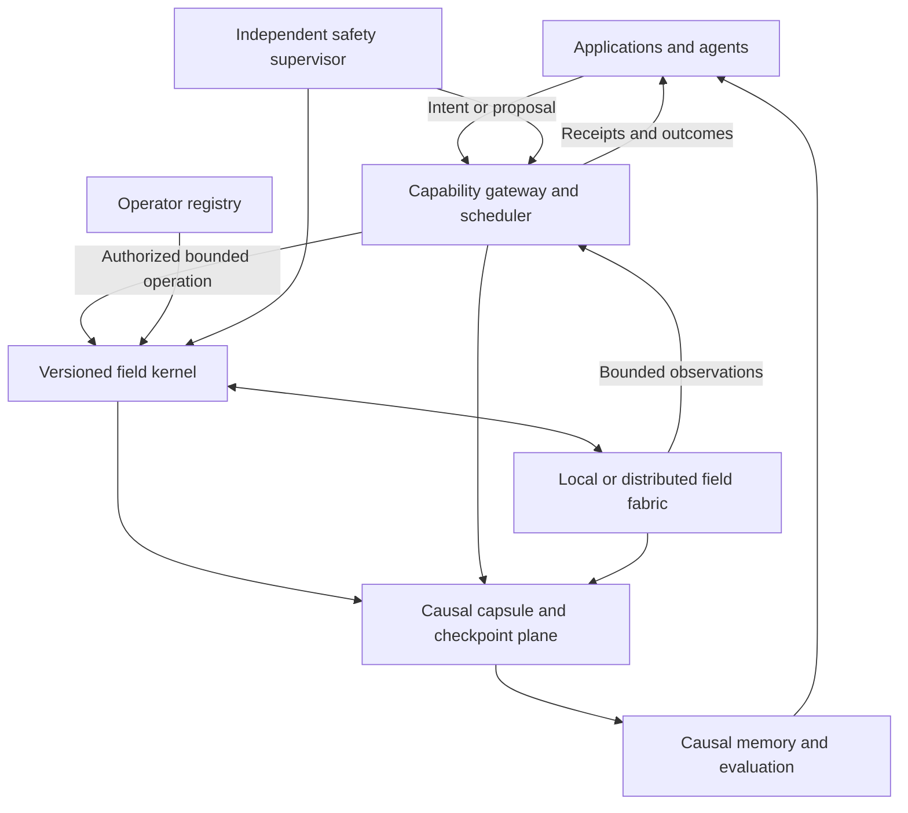

# CASSI OS R&D PLAN—FIELD-NATIVE SOFTWARE FOUNDATION

**Status:** PROPOSED—foundation-first program
**Date:** August 2026
**Role:** Candidate cross-repository program authority after owner ratification
**Scope:** Software only. Specialized hardware is outside this program.

---

## Decision

Build Cassi OS as a deterministic, replayable, capability-bounded **software substrate for field-native coordination**. First settle the operator, operation, evidence, safety, and distributed-fabric contracts. Then test whether a Yang–Yin field provides a measurable coordination advantage. Memory, agents, language models, interfaces, games, and other products enter only after the foundation passes its gates.

The program does not assume that the revolutionary claim is true. It is designed to distinguish three outcomes:

1. **General field-native computing:** one field mechanism coordinates more than one independent problem class under matched budgets.
2. **Domain-specific field control:** the mechanism helps a bounded class such as swarms but does not generalize.
3. **Useful simulation infrastructure only:** the field remains valuable for physics, visualization, and controlled experiments without becoming a general computing substrate.

Every outcome is a valid terminal result. The name “Cassi OS” becomes a release claim only under the adoption rule in §10.

---

## 0. Promise, meaning, and scope

### 0.1 The promise

Conventional distributed software usually coordinates through explicit messages, central schedulers, shared databases, or consensus protocols. Cassi OS asks a narrower, falsifiable question:

> Can independent software processes coordinate by sensing and steering a shared, evolving Yang–Yin field while using less explicit communication or tolerating more disruption than matched conventional baselines?

The field is the continuous coordination medium. It may carry gradients, local memory, phase, and attractors. It is not automatically a source of durable truth. Typed operations, capability checks, authority epochs, and causal receipts remain discrete.

This gives the program its central design principle:

> **Coherence without task-level central control; explicit authority for mutation; exact evidence for claims.**

### 0.2 What “OS” means here

Cassi OS is initially an **operating substrate hosted by an existing operating system**, not a bootloader, device-driver stack, filesystem, POSIX replacement, or general desktop environment. Its proposed software layers are:

1. a versioned field operator and deterministic reference kernel;
2. a typed operation and receipt contract;
3. causal capsules for replay and provenance;
4. a bounded local capability gateway;
5. a multi-process and multi-node field fabric;
6. benchmarked coordination policies;
7. optional causal memory and agent policy;
8. developer and human-facing application surfaces.

Existing CPUs and GPUs are execution backends. Their use does not create a hardware workstream.

### 0.3 Hardware boundary

> **No FPGA, ASIC, analog, photonic, neuromorphic, custom interconnect, sensor, robotics, or device-design work is part of this plan.**

No phase, gate, benchmark, staffing assumption, or API decision may depend on hypothetical specialized hardware. A future hardware program would require a separate plan after the software stack has passed OS-G8. It is not a deferred phase of this document.

### 0.4 Other non-goals

This program does not initially:

- expose a field mutation service to the public internet;
- replace databases, signatures, or consensus where exact durable agreement is required;
- grant a language model physical, safety, authorization, or clock authority;
- infer therapeutic, neurological, social, or biological claims from software behavior;
- treat a visualization or game mechanic as evidence for a computing advantage;
- require a new repository before stable boundaries justify one;
- call the theory PDE, Python solver, and current GPU shader one operator;
- optimize performance before a deterministic reference and falsifiable benchmark exist.

---

## 1. Present-state evidence

The status vocabulary in this plan is:

- **LIVE:** present in the current runtime or executable implementation;
- **VERIFIED:** exercised by a named current gate or recorded receipt;
- **ADOPTED:** promoted by a named gate within the stated boundary;
- **PARTIAL:** useful capability with a narrower boundary than the proposed OS role;
- **PROPOSED:** designed but not yet implemented or adopted;
- **NULL:** a preregistered mechanism did not outperform its comparator;
- **BLOCKED:** a required artifact, seam, or valid comparison is absent;
- **LEGACY:** retained for compatibility or historical inspection but excluded from the adopted path;
- **DOWNSTREAM:** consumer or product work with no authority over the foundation.

### 1.1 Current component map

| Area | Present evidence | Status for Cassi OS | Boundary that must remain explicit |
|---|---|---|---|
| Theory | `CassiTheory/foundations/cassi-first-principles.md` states the density PDE and scalar coherence; `CassiTheory/foundations/qi-flow-double-helix.md` derives the phase-current identity $J=\rho\nabla\theta$ and labels the double-helix identification separately. | PARTIAL | A formal identity and a theory status do not establish a decentralized software operator or performance benefit. |
| GPU field substrate | `CassiCosmos/scripts/cassi_physics_engine.gd` dispatches multiple live field paths. `CassiCosmos/scenes/main.tscn` selects the production gridless site chain; its Yang/Yin field evolution is implemented in `CassiCosmos/compute/cassi_site_physics.glsl`, while the engine owns the additional site mass, N-body, condensation, and black-hole passes. `CassiCosmos/compute/cassi_voronoi_cells.glsl` is the meshless/JFA compatibility path, and `CassiCosmos/compute/cassi_two_fluid.glsl` is the raster/mind-engine wave path. `CassiCosmos/README.md` records the decoupled, boxless production configuration. | LIVE | These are simulation backends with different operators and coherence conventions, not one canonical OS kernel. |
| Simulator verification | `CassiCosmos/verify/run_all.gd` contains the current 33-arm executable list; `CassiCosmos/verify/README.md` documents the runner and exit contract. | LIVE verification contract | The README's descriptive arm table does not fully mirror the executable list. The battery covers CassiCosmos behavior, not multi-node coordination, protocol security, or general computing value; this planning pass did not rerun it. |
| Mind-engine transport | `CassiCosmos/scripts/cassi_mind_engine.gd` exposes the loopback 7599 JSON-lines commands for observation, deposit, stepping, clear, projection, readout, and snapshots. | PARTIAL research transport | The handler and sidecar path exist, but production cross-repository TCP integration is unverified. The surface is mutable, local, and lacks the authority, bounds, versioning, and receipt contract required here. |
| Interactive Workbench | `CassiCosmos/scripts/field_workbench.gd` provides ordered field operations and scenario records. `CassiCosmos/research/interactivity/next_frontier_report.md` records 18/18 plus 12/12 checks. | ADOPTED within a PARTIAL boundary | The adopted path is the measured CPU-reference backend under paused, inline, periodic-grid operation. It rejects live decoupled and boxless/site-owned mutation; the optional GPU mutation kernels are not promoted into the host. |
| Focused mind runtime | `CassiCore/MIGRATION-STATUS.md` records the focused 22-package shape and 2,336 passing tests. `CassiCore/packages/mind-runtime/src/boot.ts` composes MnemicField, retained intelligence, tools, and the loop, and supports optional default-off read-only field telemetry. | LIVE | The recorded test count is repository evidence, not a fresh run in this planning pass. Telemetry is absent unless explicitly configured. |
| Core HTTP channel | `CassiCore/packages/mind-runtime/src/channel/server.ts` and `CassiCore/packages/mind-runtime/src/channel/protocol.ts` define the loopback 7273 HTTP boundary, request IDs, optional bearer auth, tools, session/events, memory, health, snapshot, and shutdown. | LIVE local runtime channel | It has no request-body limit in the current server, is not a field mutation protocol, and is not a multi-node security boundary. |
| Shadow bridge | `CassiCore/packages/mind-runtime/src/vendor/core/intelligence/field-bridge/index.ts` implements shadow deposit helpers. | BLOCKED for production use | The current `CassiCore/packages/mind-runtime/src/boot.ts` does not construct or wire that class, and the expected encoder queue/drain integration is absent. Shadow/fire-and-forget semantics are unsuitable for authoritative actuation. |
| Persistent memory | `CassiCore/packages/mnemic-field/src/` contains durable engram, search, consolidation, provenance-query, and replay-traversal machinery. | LIVE substrate, PARTIAL OS seam | The runtime adapter exposes a narrower status/search/save surface and omits the proposed causal provenance chain; retained tool/intelligence memory is not uniformly backed by this adapter. |
| Local language model | `CassiQwen/README.md` records standalone loopback Qwen operation, bounded read-only field observation, and the L1–L14 evidence ledger. | LIVE optional semantic service | L7, L10, L11c, L12, and L14 are NULL; L13 is BLOCKED; L10b is surrogate-only. No field-compute, agency, or CassiCore-runtime integration advantage has been demonstrated. |
| Embodied agent architecture | `CassiCore/EMBODIED-FIELD-AGENT-ARCHITECTURE.md` proposes breath, body, intent, memory, and authority seams. | PROPOSED specialized consumer | It is an application architecture over the future foundation, not the foundation itself. |
| Downstream game corpus | `CassiCraft/README.md` is the design home for an asynchronous field-domain and tick-sampler game. | PROPOSED downstream consumer | Its own README says it is not yet a mod. It may exercise a stable Cassi OS contract later but cannot define that contract now. |
| Product and patron concepts | `CassiCosmos/research/product_ideas.md`, `CassiCosmos/research/cassi_coop_game_design.md`, and `CassiCosmos/research/patron_model.md` define candidate applications and support models. | DOWNSTREAM | Funding or product appeal cannot alter a scientific gate or promote a NULL result. |

### 1.2 The load-bearing operator mismatch

There is no single canonical Cassi OS operator in the current checkout.

| Surface | Current form | Consequence |
|---|---|---|
| Theory document | `CassiTheory/foundations/cassi-first-principles.md` states a first-order density PDE with gated conversion $\lambda(1-q)(E_Y-\varphi E_I)$ and a coherence definition that includes density, $\varphi^{-2}$, and deviation. | Candidate formal profile. |
| Python solver | `CassiTheory/two-fluid/cassi_two_fluid_3d_gpu.py` implements a first-order numerical system whose current conversion and defaults do not match every term and value in the theory document. | Existing research profile, not an automatic reference implementation. |
| Production gridless site GPU | `CassiCosmos/compute/cassi_site_physics.glsl` implements a directed-CSR graph-Laplacian, symplectic/leapfrog-shaped update with canonical local coherence, ungated defect conversion, and an optional openness-weighted winding term. | Live production compatibility profile, not the canonical theory operator. |
| Meshless/JFA compatibility GPU | `CassiCosmos/compute/cassi_voronoi_cells.glsl` supplies the distinct compatibility site evolution used outside the production gridless path. | Live compatibility profile that must remain separately named. |
| Raster and mind-engine GPU | `CassiCosmos/compute/cassi_two_fluid.glsl` implements a second-order wave/leapfrog-style field with its own conversion and field-power usage. | Live raster/sidecar compatibility profile, not byte- or equation-identical to the density PDE. |
| Workbench and mind readouts | Current code uses context-specific quantities named `q`, including raw field power in some paths. | The symbol cannot cross an API without a declared convention ID. |
| Phase current | $J=\rho\nabla\theta$ is derived in theory, while the current production field stack does not expose it as the adopted local coordination operator. | Flocking and network claims remain PROPOSED. |

OS-F0 therefore creates an operator registry before any “Cassi OS kernel” implementation. The program will never repair this mismatch by silently choosing one formula or by renaming different quantities to the same symbol.

### 1.3 Current transport boundary

| Surface | Current role | Cassi OS disposition |
|---|---|---|
| 7599 JSON-lines | Local mind-engine field observation and mutation | Lab fixture only until a typed, bounded, authorized adapter passes OS-G3. |
| 7273 HTTP | Local CassiCore runtime and memory/tool channel | Reused only through explicit ports; it does not become a generic field gateway. |
| 8080 OpenAI-compatible API | Local Qwen completion service | Optional proposal/ranking service; never a mutation or safety authority. |
| `CassiCosmos/scripts/shm_sim.gd` shared-memory reader | Legacy one-way N-body frame transport | Inventory and retire or explicitly quarantine during OS-F0; it is not a cross-platform protocol baseline. |

Loopback binding reduces exposure but does not supply authorization semantics, bounded resource use, replay, or distributed identity. No existing transport is promoted by relabeling it.

The current tools authorization surface is also not an OS security boundary. `CassiCore/packages/tools/src/vendor/core/intelligence/permission-oracle/index.ts` is a vendor type stub whose decisions allow; OS-G3 requires a real capability authority plus deny, escalation, revocation, timeout, and adversarial tests.

Existing runtime replay helpers do not satisfy causal replay. `CassiCore/packages/mind-runtime/src/vendor/core/testing/replay/replay-runner.ts` compares coarse run properties rather than exact trace and state bytes, while the associated live harness targets a retired control surface. OS-F2 therefore builds a new pinned-clock, pinned-ID capsule contract instead of promoting these helpers by name.

### 1.4 Licensing boundary

No root or foundational-repository license file is present in the current checkout. Source visibility alone does not grant open-source rights. `CassiCraft/src/main/resources/fabric.mod.json` currently declares `ARR` for that downstream project.

The owner must ratify the foundation's license, contribution policy, trademark boundary, and third-party provenance at OS-G0. The downstream game's license may remain independent. No public “open-source Cassi OS” claim is valid before that gate.

---

## 2. Program constitution

Every implementation and experiment must preserve these invariants.

### I-01—The field is a coordination plane, not the truth plane

Field state may guide local behavior and retain continuous traces. Durable identity, authority transfer, permissions, economic facts, legal facts, and externally consequential commitments require discrete authenticated records.

### I-02—Every mutation has a causal receipt

An accepted mutation records who requested it, which capability authorized it, the authority epoch, operator profile, pre-state digest, bounded budget, outcome, and post-state digest. Fire-and-forget mutation cannot enter the adopted path.

### I-03—One authoritative writer per mutable region and epoch

Parallel observers and proposals are allowed. Exactly one writer applies mutations to a field region during an authority epoch. Ownership transfer is discrete, explicit, and receipted.

### I-04—Decentralized claims use local information

A process may observe only its declared neighborhood, delayed halo, or bounded projection. A global FFT, global sort, all-agent scan, hidden coordinator, or full-state normalization invalidates a decentralized result unless the same privilege is given to every baseline and the claim is narrowed.

### I-05—Operations are typed, bounded, and budgeted

Every operation has a maximum spatial extent, energy or amplitude, step count, payload size, deadline, and authorization scope. Unknown operations fail closed. Unbounded deposit, step, query, or allocation requests cannot pass OS-G3.

### I-06—The operator is content-addressed

Every run names an immutable operator profile and implementation digest. Equations, state variables, units, boundary conditions, update order, integrator, precision, and coherence convention are part of that identity.

### I-07—Symbols carry convention IDs

No API sends bare `q`, `rho`, `epsilon`, `phase`, or `current` without a versioned definition. Raw field power, canonical coherence, gate openness, and phase current are different observables.

### I-08—Propagation assumptions are observable

The benchmark records signal speed, communication radius, topology, cadence, and boundary behavior. A swarm cannot receive instantaneous global information through an implementation detail.

### I-09—Safety is structurally independent

Hard spatial, energy, velocity, resource, and permission limits are enforced outside field dynamics and outside learned policy. A coherent field state cannot override a safety limit.

### I-10—Language models propose; they do not authorize

Qwen or another model may interpret, summarize, or rank already-valid candidates. It does not own operator selection, clocks, action budgets, mutation authorization, replay verdicts, benchmark scoring, or emergency stop.

### I-11—New effects are default-off

A disabled feature must preserve the declared baseline, with bit identity where the backend contract supports it and semantic identity where it does not. Each adoption has a clean revert path.

### I-12—Determinism classes are explicit

- **Exact replay:** identical bytes on the same pinned backend and build.
- **Semantic replay:** declared observables remain within preregistered tolerances across supported backends.
- **Statistical replication:** distributions agree across seeds; individual trajectories may diverge.

No lower class may be reported as a higher one.

### I-13—Ambiguous writes are never blindly retried

An operation ID is at-most-once within an authority epoch. A timeout after dispatch returns `UNKNOWN`, prompts a receipt/state query, and never causes an automatic second mutation.

### I-14—The software foundation has explicit provenance

Every dependency, borrowed algorithm, model artifact, and dataset carries source and license metadata. The owner-selected foundation license is present before public distribution.

### I-15—Two independent consumers precede API stability

An interface is not stable because its first application works. Two independently developed consumers must use the same versioned contract without backend-specific exceptions before the contract is called public.

### I-16—This program remains software-only

No gate can be rescued by proposed custom hardware. Commodity CPU/GPU execution may be measured, but hardware design is excluded.

A violation of any invariant blocks adoption even when a performance metric passes.

---

## 3. Target architecture

### 3.1 Four planes



1. **Field plane:** continuous state, local propagation, attractors, phase, and gradients.
2. **Control plane:** typed operations, capabilities, writer authority, epochs, budgets, and safe stop.
3. **Evidence plane:** ordered receipts, hashes, checkpoints, metrics, and first-divergence diagnostics.
4. **Agency plane:** deterministic policy first; optional memory and language services later.

### 3.2 Authority boundaries

| Authority | Owner | Rule |
|---|---|---|
| Mathematical candidate and epistemic tier | CassiTheory | Theory states what is derived, asserted, calibrated, hypothesized, or open. It does not declare an implementation adopted. |
| Mutable field region | Active kernel backend for that region and epoch | One writer; all other actors observe or propose. |
| Operation authorization | Capability gateway plus independent safety supervisor | A field pattern or model output cannot authorize itself. |
| Durable run evidence | Causal capsule log | Hash-chained locally; authenticated across process or machine trust boundaries. |
| Memory and policy state | CassiCore | Memory references receipts and capsules rather than reconstructing provenance from prose. |
| Language interpretation | CassiQwen or another optional provider | Asynchronous, bounded, non-authoritative. |
| Human intervention | Explicit operator surface | Every mutation uses the same public operation contract and produces the same receipt class. |

### 3.3 Operator registry

OS-F0 defines immutable profiles rather than pretending the current systems are equivalent. The initial candidates are:

| Provisional profile | Purpose | Initial source | Promotion condition |
|---|---|---|---|
| `COSMOS_SITE_V0` | Preserve and characterize the production gridless site operator. | `CassiCosmos/compute/cassi_site_physics.glsl` | Exact profile, independent numerical checks, and declared graph, local-coherence, winding, boundary, and site-update conventions. |
| `COSMOS_VORONOI_COMPAT_V0` | Preserve and quarantine the meshless/JFA compatibility operator. | `CassiCosmos/compute/cassi_voronoi_cells.glsl` | Exact profile and proof that no production result is attributed to this operator accidentally. |
| `COSMOS_WAVE_V0` | Preserve and characterize the raster and mind-engine GPU operator. | `CassiCosmos/compute/cassi_two_fluid.glsl` | Exact profile, independent numerical checks, and declared field-power conventions. |
| `THEORY_DENSITY_V0` | Build a small deterministic reference for the documented first-order density PDE. | `CassiTheory/foundations/cassi-first-principles.md` | Formal reconciliation, manufactured solutions, conservation/stability gates, and implementation review. |
| `PHASE_CURRENT_V0` | Test signed local phase-current coordination. | `CassiTheory/foundations/qi-flow-double-helix.md` | A versioned dynamical realization, locality proof, and benchmark gain; the identity alone is insufficient. |

Each profile manifest records:

- mathematical source and epistemic status;
- state vector, units, normalization, and valid domain;
- all coefficients with provenance and defaults;
- boundary conditions and topology;
- update order, integrator, timestep, and stability limits;
- precision and deterministic-reduction rules;
- definitions for density, deviation, coherence, openness, phase, and current;
- supported backend and replay class;
- golden cases, invariant checks, and content digest.

OS-G0 may choose one canonical profile or preserve several named research profiles. It may not create a hidden hybrid.

### 3.4 Typed operation contract

The stable seam is a small operation envelope, not direct access to engine buffers or arbitrary tools.

| Field | Meaning |
|---|---|
| Protocol version | Canonical schema and encoding version. |
| Operation ID | Globally unique idempotency key. |
| Actor and capability IDs | Requester identity and exact granted scope. |
| Target region and authority epoch | Where the operation applies and which writer lease it expects. |
| Operator profile digest | Exact field semantics being targeted. |
| Preconditions | Expected state/checkpoint digest and optional observable predicates. |
| Deadline and budget | Time, cells/sites, steps, amplitude/energy, bytes, and compute ceiling. |
| Operation kind | One of a closed set such as observe, deposit, align, pulse, impulse, evolve, checkpoint, or measure. |
| Parameters | Kind-specific validated values in declared units. |
| Provenance | Parent operation, capsule, user intent, and policy version. |

Every operation returns a receipt with one terminal status:

- `APPLIED`—mutation occurred exactly once;
- `REJECTED`—no mutation occurred and a typed reason is present;
- `EXPIRED`—deadline or authority epoch ended before application;
- `UNKNOWN`—the client cannot determine the result and must query by operation ID;
- `OBSERVED`—a read-only result with state and convention digests.

Transport JSON may be used for inspection, but the signed or hashed representation uses a canonical byte encoding selected at OS-G0.

### 3.5 Causal capsules

A causal capsule is the minimum reproducible unit of Cassi OS research and operation. It contains:

- capsule and parent IDs;
- repository commit digests and dirty-state declarations;
- operator and schema digests;
- backend, precision, dependency, and machine metadata;
- initial snapshot or its content address;
- random seeds and topology;
- ordered operations and receipts;
- checkpoints at declared cadence;
- raw observations and metric code digest;
- terminal verdict and invalidity markers;
- the first divergent operation when replay fails.

A report without its capsule is commentary. A capsule without a preregistered statistic cannot promote a research claim.

### 3.6 Distributed fabric

The first fabric is a software cluster of processes, optionally distributed across ordinary machines. It uses:

- explicit spatial or logical regions;
- one writer per region and authority epoch;
- bounded halo or neighbor exchange;
- versioned boundary fluxes or field samples;
- monotonic sequence numbers and operation IDs;
- stale-data markers;
- checkpoint and ownership-transfer receipts;
- deterministic fault injection for delay, loss, duplication, reorder, restart, and partition.

During a partition, a node may continue mutations only inside a region whose authority epoch remains valid. It cannot transfer ownership or perform cross-boundary mutations without the required receipts. Boundary observations become visibly stale. Reconnection never merges two writers by averaging their states.

“Coherence without consensus” applies to task-level coordination. Region ownership, identity, permissions, and durable commitments still use discrete authority mechanisms.

---

## 4. Dependency-gated R&D program

There are no calendar promises in this plan. A phase opens only when its predecessor passes. Application work does not begin before the software foundation reaches OS-G4, and no general Cassi OS claim is permitted before OS-G6.

| Phase | Question | Gate | Pass opens | Fail disposition |
|---|---|---|---|---|
| OS-F0 | What exactly is the software system? | OS-G0 Constitution | Reference implementation | Stop implementation; resolve semantics, license, or threat model. |
| OS-F1 | Can one profile be implemented deterministically and correctly? | OS-G1 Kernel | Capsules and replay | Reject or revise that profile under a fresh preregistration. |
| OS-F2 | Can every run and mutation be reproduced and diagnosed? | OS-G2 Causal replay | Bounded gateway | Research remains non-authoritative and single-process. |
| OS-F3 | Can local software mutate safely through one contract? | OS-G3 Local gateway | Distributed fabric | Keep existing transports as local fixtures only. |
| OS-F4 | Can multiple writers coordinate without split-brain mutation? | OS-G4 Fabric | Scientific coordination benchmark | Keep a single authoritative process. No distributed claim. |
| OS-F5 | Does the field help a matched decentralized swarm? | OS-G5 Swarm | Cross-domain test | Scope to simulation or reject the tested coordination mechanism. |
| OS-F6 | Does the same mechanism generalize? | OS-G6 Generalization | Memory, agency, and public API work | Call it domain-specific; do not claim a general OS. |
| OS-F7 | Does causal memory or optional semantics improve safe action? | OS-G7 Agency | Application adoption | Retain deterministic controls; exclude failed agent/LLM mechanisms. |
| OS-F8 | Can independent consumers use the same stable contract? | OS-G8 Adoption | Cassi OS alpha designation | Remain an R&D stack; revise the contract without compatibility theater. |

### 4.1 OS-F0—Operator constitution and provenance

**Question:** What system is actually being built, under which semantics and rights?

**Work:**

1. Inventory every live operator, observable convention, transport, persistence path, and current consumer.
2. Reconcile the theory document, Python solver, GPU shader, Workbench quantities, and mind-engine readouts without erasing differences.
3. Define the operator-profile, operation, receipt, capability, capsule, and verdict schemas.
4. Define exact, semantic, and statistical determinism classes.
5. Produce a threat model for local and multi-node operation.
6. Inventory third-party code, model, and dataset provenance.
7. Ratify the foundation license, contribution policy, trademark boundary, and downstream-license independence.
8. Freeze the OS-G1 and OS-G2 preregistrations before implementing the reference kernel.

**OS-G0—Constitution gate:**

PASS only if:

- every current field equation and every quantity named `q`, `epsilon`, `rho`, phase, or current maps to one explicit profile and convention;
- no implementation is presented as equation-identical without a line-level correspondence review;
- every live write surface has an authority and threat classification;
- the canonical schemas have deterministic encoding tests designed before implementation;
- the foundation's distribution rights and third-party provenance are explicit;
- an independent reviewer can classify every current component as live, verified, adopted, partial, proposed, null, blocked, legacy, or downstream without relying on historical prose;
- OS-G1 and OS-G2 have frozen statistics, decision trees, invalidity conditions, and stopping rules.

FAIL means no foundational implementation starts. There is no “temporary” canonical operator.

### 4.2 OS-F1—Deterministic reference kernel

**Question:** Can a small, readable implementation satisfy one declared operator profile?

**Work:**

- implement the selected profile first as a small fixed-order CPU reference;
- make state layout, boundaries, reductions, and update order explicit;
- add manufactured solutions or analytic identities where available;
- add conservation, fixed-point, symmetry, finite-value, and stability checks;
- verify a disabled operation is an exact no-op;
- build adapters that compare existing Python and GPU backends as named profiles rather than forcing equality;
- measure performance only after correctness passes.

**OS-G1—Kernel gate:**

PASS only if:

- repeated runs on the same pinned reference backend produce identical state and receipt bytes;
- every golden case satisfies its preregistered analytic or convergence bound;
- conserved quantities and stability bounds remain inside the profile's declared tolerance;
- malformed states and out-of-domain parameters fail before evolution;
- the no-op arm is byte-identical;
- the test suite can deliberately perturb one update-order, coefficient, sign, boundary, or convention choice and detect the defect;
- a comparison report states precisely which existing backends are exact, semantically conformant, statistically comparable, or nonconformant.

A performance win cannot compensate for a failed invariant.

### 4.3 OS-F2—Causal capsules and replay

**Question:** Can a run survive interruption and explain divergence?

**Work:**

- define canonical operation and receipt encoding;
- hash-chain operations, receipts, and checkpoints;
- capture repository/build/operator/environment digests;
- implement bounded snapshots and deterministic restore;
- add receipt lookup by operation ID;
- implement first-divergence reporting;
- distinguish exact replay from semantic and statistical replication;
- provide capsule inspection without requiring the original application.

**OS-G2—Causal replay gate:**

PASS only if:

- a same-backend replay of the frozen corpus is byte-identical;
- crash-and-restore at every designated checkpoint reaches the same terminal digest;
- duplicated, omitted, reordered, corrupted, or expired operations are rejected or detected at the first affected operation;
- an ambiguous write can be resolved by operation ID without reapplying it;
- capsule verification works from a clean checkout using only declared artifacts;
- cross-backend results are labeled by their actual determinism class.

FAIL keeps the system in disposable laboratory mode.

### 4.4 OS-F3—Bounded local capability gateway

**Question:** Can ordinary software observe and mutate the field safely through one stable seam?

**Work:**

- implement separate read and write capabilities;
- validate schemas, units, regions, profiles, epochs, deadlines, and budgets;
- bound request bodies, lines, connections, queues, observations, step counts, deposits, and compute time;
- constrain artifact labels and paths to a dedicated content-addressed root;
- define cancellation and backpressure;
- authenticate local clients and authorize exact operation kinds and regions;
- replace permissive authorization stubs with a real deny/escalate/allow authority that cannot be disabled in an adopted build;
- make all accepted writes at-most-once;
- wrap 7599, 7273, and Workbench functionality only through explicit adapters;
- preserve existing transports as fixtures until consumers migrate;
- add structured health and saturation telemetry.

**OS-G3—Local gateway gate:**

PASS only if:

- unauthorized clients cause zero state change;
- over-budget and malformed requests fail closed without crashing or allocating unbounded memory;
- path-traversal, oversized-output, nonfinite-value, and hostile-label arms produce no out-of-root write or unbounded response;
- timeout, cancellation, duplicate, reorder, reconnect, and process-restart arms preserve at-most-once mutation;
- every accepted mutation has a complete receipt and capsule link;
- a compromised optional Qwen process has read-only access and cannot acquire a write capability;
- production authorization cannot be bypassed through an environment flag, debug switch, missing oracle, or fallback path;
- existing default-off paths preserve their declared baseline;
- the threat-model test corpus passes under fuzzed framing and operation inputs.

Until OS-G3 passes, no field write service binds beyond loopback.

### 4.5 OS-F4—Multi-process and multi-node fabric

**Question:** Can field regions evolve across faulting software nodes without split-brain writes or hidden global coordination?

**Work:**

- create a deterministic three-node harness using ordinary processes;
- assign regions and authority epochs;
- implement bounded halo or local-neighbor exchange;
- define ownership transfer and safe-hold behavior;
- inject latency, jitter, loss, duplication, reorder, process death, restart, and partition;
- compare against direct neighbor messaging with the same payload and cadence budgets;
- record payload bytes, compute, latency, staleness, and recovery.
- before any OS-G5 result is visible, freeze an ordered OS-F6 transfer-domain list, the first two eligible domains, and their selection rule.

**OS-G4—Fabric gate:**

PASS only if:

- no fault arm creates two accepted writers for one region and epoch;
- duplicates and reordering create no duplicate mutation;
- a partition cannot transfer ownership or conceal stale boundary data;
- restart from a capsule reaches the declared replay class;
- every cross-region effect is attributable to a bounded exchange receipt;
- latency, bandwidth, staleness, and recovery remain within the frozen operational envelope;
- a locality audit finds no global state read, global normalization, global FFT, or hidden coordinator in the decentralized path.
- the OS-F5 benchmark and ordered OS-F6 transfer-domain selection are preregistered before either result is visible.

Failure retains a single authoritative kernel process. It does not trigger a weaker distributed claim.

### 4.6 OS-F5—Flocking as the first scientific benchmark

**Question:** Does the shared two-channel field improve decentralized coordination under matched information, actuation, compute, and communication budgets?

Flocking is the first target because it requires local sensing, dynamic group organization, obstacle response, split/rejoin behavior, and fault tolerance. It also gives the proposed signed phase-current mechanism a direct test without requiring a language model or product UI.

**Frozen benchmark families:**

- stable flock formation from randomized positions;
- obstacle corridor traversal;
- split around an obstruction and rejoin;
- moving-target tracking;
- partial agent loss and delayed/lost neighbor exchange;
- scale holdout across agent counts and topologies.

**Eligible baselines:**

- Boids;
- Vicsek-style local alignment;
- scalar pheromone or diffusion field;
- generic two-channel reaction–diffusion field without Cassi-specific terms;
- locally coupled oscillator or Kuramoto-style phase alignment;
- direct neighbor messages;
- a central controller as a labeled upper bound, not a decentralized competitor.

**Required ablations:**

- no field;
- one channel;
- no conversion;
- no attractor ratio;
- no temporal memory;
- magnitude only, with phase current removed;
- shuffled phase/current;
- frozen field;
- global-information audit arm.

**Metrics:** collision rate, minimum separation, polarization, cohesion, goal completion, path efficiency, settling time, control energy, field update cost, payload bytes per agent-second, tail latency, loss tolerance, recovery, and safety interventions.

**OS-G5—Swarm gate:**

The initial program gate is:

1. board quality, determinism class, and equal-budget audits PASS;
2. no safety metric is worse than the best eligible decentralized baseline outside the frozen uncertainty bound;
3. Cassi task quality is at least 95% of the best eligible decentralized baseline; and
4. Cassi achieves at least one material advantage: at least 20% fewer explicit payload bytes per agent-second at matched quality, or at least $2\times$ the injected delay/loss tolerance before the frozen failure boundary;
5. the result holds on held-out seeds and scale/topology conditions; and
6. the phase/current ablation shows that the claimed Cassi mechanism, rather than a generic field or measurement artifact, carries the gain.

These thresholds may be amended only before the first pilot run, with the reason recorded. They cannot move after results are visible.

A NULL or FAIL closes the tested coordination mechanism. The program may retain the simulator, capsule, and fabric infrastructure under a narrower name.

### 4.7 OS-F6—Cross-domain generalization

**Question:** Is the successful mechanism a computing primitive or a flocking technique?

If OS-G5 passes, test the first two eligible coordination domains from the ordered transfer list frozen at OS-G4:

1. distributed routing or congestion avoidance;
2. distributed task/load allocation;
3. resilient search and coverage;
4. local resource balancing under node loss.

Each domain receives conventional and generic-field baselines, equal information and compute budgets, held-out topologies, and mechanism ablations. Domain adapters may translate observations and actions, but they may not change the field equations, add hidden global state, or introduce domain-specific forces into the kernel.

**OS-G6—Generalization gate:**

PASS only if the same operator profile, operation schema, safety model, and causal-capsule format satisfy the domain's preregistered quality gate in at least two independent problem classes, with a material communication or robustness advantage in each. Scale normalization may be domain-specific; mechanism terms and scoring rules may not be tuned after results.

One successful domain yields a domain-specific library. Two failed transfer attempts terminate the general Cassi OS claim for that operator generation.

### 4.8 OS-F7—Causal memory and bounded agency

**Question:** Does persistent field-linked experience improve future action without weakening authority or safety?

**Work:**

- store episodes by capsule, operation, state, action, and outcome identity;
- create deterministic retrieval and policy baselines first;
- compare causal episodes against recency-only, latest-event, scalar-feature, and no-memory controls;
- test cross-session recovery and stale-memory rejection;
- allow optional Qwen interpretation or candidate ranking only in a separate default-off arm;
- keep physical/body authority in CassiCosmos and policy/memory authority in CassiCore, consistent with `CassiCore/EMBODIED-FIELD-AGENT-ARCHITECTURE.md`;
- require every proposed action to pass the same gateway and safety supervisor as non-agent clients.

**OS-G7—Agency gate:**

PASS only if a field-linked causal-memory policy improves a held-out task metric over all eligible memory baselines, the benefit survives field-key and episode-order ablations, stale or poisoned episodes are rejected, and safety interventions do not increase. A Qwen arm is adopted only if it adds an independent held-out benefit after accounting for latency and token cost.

A NULL Qwen or memory arm is removed from the critical path. It does not block deterministic Cassi OS operation.

### 4.9 OS-F8—Developer surface and downstream adoption

**Question:** Can independent applications use the same contract without privileged knowledge of a backend?

**Work:**

- publish the smallest versioned client and capability contract supported by two consumers;
- migrate the Interactive Workbench from direct host mutation to the public operation seam where its compatibility boundary permits;
- select one independent non-Workbench consumer from the game, cooperative experience, visualization, or research-tool candidates;
- provide capsule inspection, replay, field visualization, and fault-injection tools;
- document supported profiles, replay classes, threat boundaries, and removal policy;
- perform a clean-room consumer integration against published contracts only.

**OS-G8—Adoption gate:**

PASS only if:

- two independent consumers run without importing backend internals or receiving consumer-specific kernel exceptions;
- the full OS-G1 through OS-G7 contract and evidence suites remain green;
- each consumer can record, replay, inspect, and explain its own mutations;
- one consumer can be removed without changing the kernel or fabric;
- upgrade and incompatible-schema behavior are explicit and tested;
- licensing and provenance are complete for a public software release;
- an independent security and claims review finds no authority, status, or locality inflation.

Only then may a release be called **Cassi OS alpha**.

---

## 5. Benchmark and falsification charter

### 5.1 Fair-comparison rules

Every claim-grade benchmark must freeze:

- the question and predicted direction;
- seeds, train/pilot/held-out split, topologies, and agent counts;
- observation radius and update cadence;
- allowed global information;
- actuation and energy budget;
- payload-byte accounting;
- compute and memory budget;
- baseline list and equal tuning allowance;
- statistics and uncertainty method;
- invalidity conditions;
- decision tree;
- stopping rule;
- raw artifact and capsule schema.

A baseline gets the same opportunity to use local history, compression, and tuned coefficients as the Cassi arm. A central oracle is reported separately. Runtime and communication are measured, not estimated from source structure.

### 5.2 Evidence ladder

| Level | Evidence | Permitted statement |
|---|---|---|
| E0 | Source inspection or design argument | Candidate mechanism. |
| E1 | Analytic identity or manufactured solution | Mathematical/numerical property under stated assumptions. |
| E2 | Deterministic focused gate | Implementation satisfies the named local contract. |
| E3 | Preregistered matched baseline on held-out seeds | Evidence for a domain-specific advantage. |
| E4 | Same mechanism across independent domains | Evidence for a general field-native primitive. |
| E5 | Independent consumer and external reproduction | Evidence for a reusable software substrate. |

No layer inherits a stronger claim from a lower layer. A theory tier and a software evidence level are recorded separately.

### 5.3 Invalidity conditions

A run is INVALID rather than negative when any of the following occurs:

- a hidden global read or coordinator enters a decentralized arm;
- budgets differ between eligible competitors;
- a profile, metric, seed set, or threshold changes after outcome inspection;
- field and baseline arms start from different scenarios without a declared pairing rule;
- a safety clamp saturates enough to determine the outcome and the preregistration did not cover it;
- the run loses its capsule, build digest, raw result, or completion marker;
- a transport timeout leaves mutation status unresolved;
- hardware or driver failure prevents the declared computation;
- a backend uses a different operator or observable convention than its label.

An INVALID run is repaired under a fresh preregistration. It is not counted as PASS, FAIL, or NULL.

### 5.4 Verdict vocabulary

- **PASS / FAIL / NULL** for engineering and comparison gates;
- **ADOPT / REJECT** for implementation promotion;
- **SUPPORTS / CONTRADICTS / INCONCLUSIVE** for theory-facing probes;
- **BLOCKED / INVALID** for missing prerequisites or broken protocols.

Reports apply the frozen decision tree verbatim and retain negative records.

---

## 6. Safety, security, and privacy baseline

### 6.1 Threat actors

The minimum threat model includes:

- a malformed or compromised local application;
- an optional language-model process producing hostile or oversized output;
- a stale, duplicated, or malicious network peer;
- a corrupted capsule or checkpoint;
- an operator with a capability for one region attempting another;
- a runaway policy issuing valid but harmful operations;
- accidental public exposure of a loopback-era service.

### 6.2 Required controls

Before any non-loopback operation, the system requires:

- authenticated actor and node identity;
- least-privilege, time-bounded capabilities;
- region and operation-kind scopes;
- authority epochs and revocation;
- payload, queue, time, compute, space, and energy limits;
- canonical validation before allocation or dispatch;
- at-most-once writes and receipt lookup;
- watchdog and safe-hold behavior;
- audit and capsule integrity checks;
- explicit public/private binding configuration;
- fault and fuzz test coverage;
- a safety supervisor that remains functional when the field, agent, memory, or model is unavailable.

### 6.3 Data boundary

Cassi OS does not collect highly sensitive personal, biometric, medical, therapeutic, or private experiential data by default. Any future application that does so requires a separate data-governance and consent plan. Field state is not presumed anonymous merely because it is continuous.

---

## 7. Repository ownership and landing protocol

### 7.1 Ownership map

| Repository | Program responsibility | Explicit exclusion |
|---|---|---|
| Workspace root | Cross-repository plan, status ledger, release manifest, and ratification record | No shared build system and no hidden implementation source. |
| CassiTheory | Formal candidate operators, parameter provenance, epistemic tier, falsifiable predictions | No declaration that an unverified backend is conformant. |
| CassiCosmos | Field backends, GPU execution, simulator integration, focused operator gates, Workbench adapters | No ownership of agent policy, durable cross-repo memory, or public network authorization. |
| CassiCore | Capability gateway, operation ports, causal memory, agent policy, orchestration, software fabric control plane | No direct mutation of simulator buffers and no provider/tool ownership outside its focused seam. |
| CassiQwen | Optional local semantic proposal/ranking and its own cost/benefit gates | No clock, authority, safety, benchmark, or mutation ownership. |
| CassiCraft | Candidate downstream consumer and design corpus | No authority over the foundational operator or public API. |
| CassiAI | Read-only archive and lesson source | No imports, fixes, or new implementation work. |

No dedicated Cassi OS repository is created during OS-F0. A repository extraction may be proposed after OS-G4 only if two real consumers expose a stable shared boundary and the move preserves history. Directory aesthetics alone are insufficient.

### 7.2 Phase landing sequence

OS-F0 follows the constitution campaign in §11 and ends with OS-G0 ratification; it does not require implementation or a field run. OS-F1 through OS-F8 then follow this sequence:

1. current-state recon;
2. preregistration with frozen inputs, statistic, decision tree, and stopping rule;
3. implementation in the owning repository behind a default-off boundary;
4. focused run producing raw artifacts and a causal capsule;
5. independent fresh-eyes verification;
6. report applying the frozen verdict;
7. current-state documentation update;
8. cross-repository release manifest recording exact commit digests.

The nested repositories are independent. A cross-repository result is not reproducible unless the manifest names every participating commit. One integrator owns shared schemas during a phase. Other workers submit changes through explicit interfaces rather than concurrently inventing variants.

Current status comes from live repository files and recorded gates. `UNIFICATION.md` remains companion context and operating guidance; this plan does not silently rewrite its owner-live content.

### 7.3 Clean cutover rule

Once a public contract is adopted, migrate every supported caller and remove obsolete aliases, ad hoc command paths, and deprecated encodings. Before adoption, experimental adapters stay clearly versioned and disposable. Compatibility shims do not become a substitute for a settled seam.

---

## 8. Settled design decisions and open research questions

### 8.1 Settled for this program

| ID | Decision |
|---|---|
| D1 | Foundation before products, agents, and interfaces. |
| D2 | Software only; specialized hardware is absent from the program. |
| D3 | The field coordinates; discrete records carry authority and durable truth. |
| D4 | One writer per mutable region and authority epoch. |
| D5 | Typed, bounded operations and causal receipts are the only adopted mutation seam. |
| D6 | Operator profiles remain distinct until correspondence is proved. |
| D7 | A deterministic CPU reference precedes optimization and distribution. |
| D8 | Local-information audits are mandatory for decentralized claims. |
| D9 | Safety and authorization remain outside field dynamics and learned policy. |
| D10 | Qwen is optional, asynchronous, default-off, and non-authoritative. |
| D11 | Two independent consumers precede public API stability. |
| D12 | Negative and null results narrow the product; they do not trigger post-hoc gate changes. |

### 8.2 Research questions

| ID | Question | Resolving gate |
|---|---|---|
| R1 | Which operator profile is canonical for field-native computing? | OS-G0 / OS-G1 |
| R2 | Can the first-order density and current formalism be reconciled with the live wave backend, or must both remain distinct? | OS-G0 / OS-G1 |
| R3 | What dynamical phase-current operator realizes signed local Yang/Yin flow without inserting the target behavior? | OS-G1 / OS-G5 |
| R4 | Which boundary and locality model supports finite-speed decentralized coordination? | OS-G1 / OS-G4 |
| R5 | What is the minimum sufficient operation and receipt schema? | OS-G2 / OS-G3 |
| R6 | Can region ownership and halo exchange survive partition without split-brain mutation? | OS-G4 |
| R7 | Does a Cassi field outperform generic fields and direct messages under matched budgets? | OS-G5 |
| R8 | Does any gain transfer to an independent problem class without changing the mechanism? | OS-G6 |
| R9 | Does causal field-linked memory beat recency and scalar baselines? | OS-G7 |
| R10 | Does a language model add independent value after latency and token cost? | OS-G7 |
| R11 | Can two consumers use the same contract without backend exceptions? | OS-G8 |

---

## 9. Risk ledger

| Risk | Early signal | Control | Terminal consequence |
|---|---|---|---|
| Operator ambiguity | Same symbol produces incompatible values across paths | OS-F0 profile registry and convention IDs | No kernel work until resolved. |
| Decorative Cassi terms | Generic two-field or scalar baseline matches the result | Mandatory baselines and ablations | Remove the Cassi-specific claim. |
| Hidden centralization | Global normalization, FFT, scan, or coordinator in a local arm | Instrumented locality audit | Benchmark INVALID. |
| False determinism | Same report with divergent state bytes or undeclared tolerance | Determinism classes and first-divergence tooling | Narrow replay class or fail OS-G2. |
| Split-brain mutation | Two nodes accept writes for one region/epoch | Authority epochs and partition injection | Fail OS-G4; single writer only. |
| Loopback complacency | Local service accepts oversized or unauthorized writes | OS-G3 threat and fuzz gates | No non-loopback service. |
| GPU/vendor lock | No readable reference or cross-backend semantics | CPU reference plus profile conformance | Backend remains optional, not canonical. |
| LLM authority creep | Model output reaches mutation without typed authorization | Read-only default and gateway capability boundary | Remove model from the path. |
| Product-driven API drift | First consumer requests backend-specific exceptions | Two-consumer rule | Revise pre-public contract; no shim. |
| Metric gaming | Task gain appears only after seed/threshold changes | Frozen preregistration and held-out board | Result NULL/INVALID under the tree. |
| License ambiguity | Public “open source” language without distribution rights | OS-G0 owner ratification and provenance inventory | No public distribution. |
| Cross-repository version drift | A result cannot name the exact participating commits | Release manifest in every capsule | Result cannot promote a gate. |
| Field-state privacy assumption | Application embeds sensitive data in a projection | Separate data-governance gate | Sensitive application blocked. |
| Hardware escape hatch | Software gate failure is excused by future custom hardware | I-16 and scope review | Claim rejected within this program. |

---

## 10. Stop rules and name discipline

The program stops or narrows at the first failed dependency:

```text
OS-G0 fails → no canonical software program
OS-G1 fails → no adopted field kernel
OS-G2 fails → disposable single-process experiments only
OS-G3 fails → no authoritative application mutation
OS-G4 fails → one kernel process; no distributed fabric claim
OS-G5 fails → simulation/runtime infrastructure; no field-coordination claim
OS-G6 fails → domain-specific field controller; no general OS claim
OS-G7 fails → deterministic runtime only; no causal-agent claim
OS-G8 fails → research stack; no Cassi OS alpha
```

The phrase **Cassi OS R&D program** may describe the investigation from OS-F0 onward. The phrase **field-native operating substrate** is reserved for a passed OS-G6. The release name **Cassi OS alpha** is reserved for a passed OS-G8.

No partial metric, demo, animation, patron milestone, or theoretical derivation skips the ladder.

---

## 11. First campaign—OS-0 constitution

The first campaign is documentation, reconciliation, schema design, and threat modeling. It does not start the flocking application, a public service, a new repository, or hardware work.

### 11.1 Frozen question

> Can the current Cassi software be described as a finite set of non-conflicting operator profiles, observable conventions, write surfaces, authority boundaries, and reproducible evidence contracts?

### 11.2 Work packets

1. **Operator concordance:** line-level map of theory equations, Python RHS, GPU update, Workbench operations, mind readouts, and telemetry quantities.
2. **Protocol inventory:** 7599, 7273, 8080, shared-memory remnants, direct Workbench calls, file artifacts, and current trust assumptions.
3. **Authority and threat model:** actors, assets, trust boundaries, capabilities, safe hold, emergency stop, and public-binding prohibition.
4. **Schema draft:** operator profile, observable convention, operation, receipt, capability, capsule, checkpoint, and release manifest.
5. **Determinism contract:** exact, semantic, and statistical classes with representative golden cases.
6. **Licensing and provenance:** owner decision for the foundation plus dependency, model, dataset, and downstream-license inventory.
7. **Gate preregistration:** exact OS-G1 and OS-G2 statistics, invalidity conditions, decision tree, and stopping rule.
8. **Fresh-eyes review:** one numerical reviewer, one protocol/security reviewer, and one naive implementer who must reconstruct the intended system from the artifacts.

### 11.3 OS-0 stopping rule

Stop when OS-G0 is unambiguously PASS or FAIL under §4.1. Do not implement around an unresolved operator or licensing decision. If profiles remain distinct but internally complete, that is a valid PASS; the registry records multiple profiles and OS-G1 selects exactly one.

### 11.4 First implementation after PASS

The first code is the smallest CPU reference for the selected profile plus its golden tests and capsule writer. It is not a distributed runtime, agent, game, or user interface.

---

## 12. Evidence ledger template

Each phase adds one row only after its report and independent review exist.

| Gate | Preregistration | Operator/schema digest | Implementing commits | Raw capsule | Report | Independent review | Verdict |
|---|---|---|---|---|---|---|---|
| OS-G0 | pending | pending | pending | n/a | pending | pending | OPEN |
| OS-G1 | blocked by OS-G0 | pending | pending | pending | pending | pending | BLOCKED |
| OS-G2 | blocked by OS-G1 | pending | pending | pending | pending | pending | BLOCKED |
| OS-G3 | blocked by OS-G2 | pending | pending | pending | pending | pending | BLOCKED |
| OS-G4 | blocked by OS-G3 | pending | pending | pending | pending | pending | BLOCKED |
| OS-G5 | blocked by OS-G4 | pending | pending | pending | pending | pending | BLOCKED |
| OS-G6 | blocked by OS-G5 | pending | pending | pending | pending | pending | BLOCKED |
| OS-G7 | blocked by OS-G6 | pending | pending | pending | pending | pending | BLOCKED |
| OS-G8 | blocked by OS-G7 | pending | pending | pending | pending | pending | BLOCKED |

A ledger row links evidence; it does not summarize away a NULL, FAIL, or INVALID record.

---

## 13. Downstream application and patron boundary

The current application documents remain valuable because they supply future consumer requirements:

- `CassiCosmos/research/product_ideas.md` maps the wider opportunity space;
- `CassiCosmos/research/cassi_coop_game_design.md` provides a cooperative multi-user candidate;
- `CassiCosmos/research/interactivity/next_frontier_report.md` supplies a verified but narrow operator surface;
- `CassiCraft/README.md` supplies a large asynchronous-domain consumer design;
- `CassiCosmos/research/patron_model.md` describes a possible support relationship.

They remain downstream of the gates:

- before OS-G4, they may contribute read-only requirements and test fixtures;
- after OS-G4, two may become bounded consumer prototypes;
- after OS-G6, they may support generalization and ergonomics work;
- after OS-G8, they may consume a public alpha contract.

Patron support may fund a gate, artifact, independent review, or negative result. It cannot purchase an outcome, private doctrine, a weakened baseline, or a promoted verdict. Foundational contract and security work stays separable from application exclusivity.

---

## 14. Current reference set

### Program and operating discipline

- `AGENTS.md`
- `UNIFICATION.md`
- `CassiCosmos/MACHINE_PLAN.md`
- `CassiCosmos/MESHLESS_PLAN.md`

### Formalism and evidence tiers

- `CassiTheory/reading-guide.md`
- `CassiTheory/EPISTEMIC-MAP.md`
- `CassiTheory/foundations/cassi-first-principles.md`
- `CassiTheory/foundations/qi-flow-double-helix.md`
- `CassiTheory/foundations/unified-lagrangian.md`
- `CassiTheory/parameter-inventory.md`
- `CassiTheory/open-questions-cassi-answers.md`
- `CassiTheory/predictions/falsifiable-predictions.md`

### Field and interaction substrate

- `CassiCosmos/README.md`
- `CassiCosmos/scripts/cassi_physics_engine.gd`
- `CassiCosmos/scripts/cassi_mind_engine.gd`
- `CassiCosmos/scripts/field_workbench.gd`
- `CassiCosmos/scenes/main.tscn`
- `CassiCosmos/compute/cassi_site_physics.glsl`
- `CassiCosmos/compute/cassi_voronoi_cells.glsl`
- `CassiCosmos/compute/cassi_two_fluid.glsl`
- `CassiCosmos/verify/run_all.gd`
- `CassiCosmos/verify/README.md`
- `CassiCosmos/research/interactivity/interactivity_design.md`
- `CassiCosmos/research/interactivity/interactivity_report.md`
- `CassiCosmos/research/interactivity/next_frontier_design.md`
- `CassiCosmos/research/interactivity/next_frontier_report.md`

### Runtime, memory, and optional semantics

- `CassiCore/MIGRATION-STATUS.md`
- `CassiCore/EMBODIED-FIELD-AGENT-ARCHITECTURE.md`
- `CassiCore/packages/mind-runtime/src/boot.ts`
- `CassiCore/packages/mind-runtime/src/channel/protocol.ts`
- `CassiCore/packages/mind-runtime/src/channel/server.ts`
- `CassiCore/packages/mind-runtime/src/field/telemetry.ts`
- `CassiCore/packages/mind-runtime/src/vendor/core/intelligence/field-bridge/index.ts`
- `CassiCore/packages/mnemic-field/src/`
- `CassiQwen/README.md`

### Downstream consumers

- `CassiCraft/README.md`
- `CassiCosmos/research/product_ideas.md`
- `CassiCosmos/research/cassi_coop_game_design.md`
- `CassiCosmos/research/patron_model.md`

---

## 15. What this plan does not claim is done

This document creates the program structure. It does not claim that:

- a canonical Cassi OS operator has been selected;
- the theory density PDE, Python solver, and GPU wave backend are equivalent;
- the phase-current identity is an implemented flocking law;
- the existing 7599 or 7273 service is a production capability gateway;
- the shadow bridge is wired into the current CassiCore boot path;
- the current Workbench mutates the live decoupled boxless production field;
- a causal capsule format or distributed region protocol exists;
- a decentralized coordination advantage has been measured;
- a field mechanism generalizes beyond one domain;
- MnemicField or Qwen improves field-based agency;
- a public API, software license, or Cassi OS release exists;
- any hardware program is planned.

The next authorized move is OS-0 constitution work. Everything else remains dependency-blocked.
