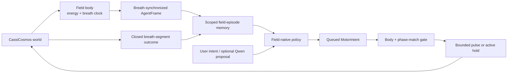

# Cassi Mind—Breath-Embodied Field Agent Architecture

## Status: Proposed—August 2026

## 1. Decision

Build the AI as a **breath-organized embodied controller of a live CassiCosmos field**. Breath is not a timer attached to an otherwise complete agent. It is the rhythmic Yang–Yin phase-change pattern from which perception, maintenance, memory segmentation, and action timing are organized.

The load-bearing loop is:

```text
continuous background energy and circulation
  + world-authoritative breath phase
  + local field/bubble phase organization
  → phase match
  → bounded concentrated pulse
  → field response
  → one closed breath segment of causal memory
```

The simulated body maintains the energy supply and breath rhythm. CassiCore supplies intent, attention, memory, and policy. A local phase match determines when the body may concentrate a bounded pulse. Qwen may help interpret or rank already-generated semantic candidates, but it never owns breath, phase matching, pulse timing, physical actuation, reward, or safety.



CassiCosmos remains authoritative for physical state, breath state, energy accounting, and pulse emission. CassiCore owns the agent loop, scoped causal memory, policy, motor-intent authorization, and episode ledger. The language model remains an asynchronous semantic service.

## 2. What the full review changes

The previous architecture correctly separated world, mind, and language-model authority, but it still treated an arbitrary `observe → deposit → step → observe` turn as the fundamental unit. That omitted the user's central mechanism: breath supplies the rhythmic phase-change pattern the embodied field builds on.

The current system contains useful pieces, but no live breath-bearing agent yet:

| Existing component | Existing role | Missing connection |
|---|---|---|
| `CassiCosmos/scripts/cassi_mind_engine.gd` | Deterministic 7599 sidecar with deposits, explicit steps, state, projection, readout, and snapshots | Breath clock, field-current readout, local locus, phase match, pulse operation, and causal receipts |
| `CassiCosmos/compute/cassi_two_fluid.glsl` | Current two-fluid evolution; internal velocity buffer carries $\dot E_Y,\dot E_I$ | Public temporal-current observability and a guarded breath/pulse coupling |
| `CassiCosmos/scripts/field_workbench.gd` | Canonical paused, ordered, auditable main-simulator commands | Functional phase/current measurement and a body-mediated pulse path |
| `CassiCore/packages/mind-runtime/src/field/telemetry.ts` | Strict full-readout validation plus derived orientation/current diagnostics | Authoritative clock, contiguous-time phase rate, physical spacing, local body/bubble contract |
| `CassiCore/packages/mind-runtime` | 7273 channel, MnemicField adapter, retained intelligence layer, tool registry | Composed breath-aware field agent and guarded capability path |
| `CassiCore/packages/mnemic-field` | Persistent spatial engrams, retrieval, consolidation, and provenance | Truly scoped per-agent causal memory with deterministic field-derived keys |
| Vendored `field-bridge` and field encoder | Fire-and-forget shadow deposit helpers | None for production actuation; they remain legacy/shadow adapters |
| `CassiQwen/` | Loopback-only optional language model and read-only field experiments | Bounded asynchronous candidate-ranking contract |

### 2.1 Epistemic boundary

Breath is a design premise for this agent architecture. Its exact physical law is not yet established by the live solver.

| Layer | Present status |
|---|---|
| Two-fluid fields, conversion exchange, canonical coherence, and Qi phase-current definitions | Current formalism |
| Internal $\dot E_Y,\dot E_I$ state in the CassiCosmos shader | Live but not publicly exposed |
| Breath as rhythmic Yang/Yin organization and cardiorespiratory longitudinal drive | Working architecture / biological hypothesis |
| Localized breath Lagrangian, $\omega_I=\varphi^{-1}\omega_Y$, and its amplitude/frequency | Hypothesized; external parameters remain unset |
| Phase-match estimator, concentrated pulse law, and dynamic checkerboard spiral alignment | Open mechanism to implement and gate |
| Two-strand separation “breathing” | Different observable; its forced-swap probe was null and is not a BreathClock |

The architecture therefore makes the **clock, provenance, phase windows, and measurement contract** concrete while keeping the waveform, frequency relation, phase-match estimator, and pulse-response law versioned and replaceable. It does not hard-code a $\varphi^{-1}$ frequency ratio or equate physiological inhale/exhale with Yang/Yin without a declared protocol.

## 3. Authority boundaries

### 3.1 World authority: CassiCosmos

Only CassiCosmos owns mutable physical state. The existing deterministic sidecar exposes:

```text
127.0.0.1:7599
  ping | state | project | readout | snapshot       read-only
  deposit                                       low-level write
  step                                          field evolution
  clear                                         supervisor-only reset
```

Today this is transport, not an embodied body protocol. It has no request IDs, schema versions, breath phase, current readout, pulse operation, local bubble identity, provenance digest, or action budget. The current `q` response is raw field power—the squared norm $E_Y^2+E_I^2$—not canonical Qi coherence.

Stage A may use the auto-step-off fixture with a supervisor-pinned breath trace to verify software ordering and replay. It must be labeled a deterministic shadow transport: alternating deposits and step counts do not prove physical breathing, phase current, or embodiment.

### 3.2 Body and breath authority: CassiCosmos

The production architecture adds a world-owned field body. It owns:

- the authoritative BreathClock and clock epoch;
- continuous background energy/circulation accounting;
- local body/bubble loci and their measured phase state;
- phase-match evaluation under a versioned estimator;
- translation from an approved `MotorIntent` to a bounded physical pulse;
- pulse/no-pulse receipts;
- hold behavior that preserves baseline circulation without external commitment.

CassiCore may request a motor disposition, but it cannot set the clock, declare a phase match, inject energy directly, hold a phase window open, or replay a missed window. A missing or discontinuous clock permits read-only observation of a world that is already advancing, but no agent-issued advance or pulse. The agent halts in active hold until supervisor recovery.

Direct Workbench `deposit`/`align`/`impulse` operations remain operator/supervisor tools until a body-mediated public pulse operation exists. They are not production agent motor actions.

### 3.3 Mind authority: CassiCore

Create `@cassicore/field-agent` around explicit ports:

```text
packages/field-agent/
  src/domain/agent.ts               embodied identity and lifecycle
  src/domain/breath.ts              clock samples, phase bands, cycle records
  src/domain/body.ts                energy, locus, phase match, motor disposition
  src/domain/observation.ts         AgentFrame variants and field features
  src/domain/action.ts              intents, candidates, pulses, receipts
  src/domain/episode.ts             closed breath-segment record
  src/ports/field-engine.ts         sole 7599 / Workbench transport capability
  src/ports/supervisor-field-engine.ts supervisor-only restart / reset capability
  src/ports/breath-clock.ts         authoritative clock / pinned-trace port
  src/ports/field-body.ts           breath, energy, locus, pulse capability
  src/ports/episode-memory.ts       scoped MnemicField experience port
  src/ports/planner.ts              optional semantic planner port
  src/runtime/field-agent-loop.ts   synchronize → sense → decide → wait → pulse → close
  src/safety/action-gate.ts         clock, phase, budget, scope, replay checks
  src/policy/                       deterministic candidate generation/scoring
```

The package depends on ports, not Godot implementations. Its first tests use deterministic fakes and a pinned trace before connecting to the sidecar.

```ts
interface ObserveRequest {
  worldId: string
  engineInstanceId: string
  agentId: string
  expectedStep: number
  expectedClockEpoch: number
}

interface AtomicWorldObservation {
  snapshotId: string
  frame: AgentFrame
}

interface FieldEnginePort {
  observe(request: ObserveRequest): Promise<AtomicWorldObservation>
  execute(action: TransportAction): Promise<TransportReceipt>
}

interface BreathClockPort {
  protocol(clockId: string): Promise<BreathProtocol>
  pinnedSample(traceDigest: string, index: number): Promise<BreathClockSample>
}

interface FieldBodyPort {
  submit(intent: MotorIntent, observation: AtomicWorldObservation): Promise<BodyDispositionReceipt>
}

type GateDecision<T> =
  | { allowed: true; value: T }
  | { allowed: false; reason: string }

interface ActionGate {
  validateTransport(
    state: EmbodiedAgentState,
    frame: AgentFrame,
    action: TransportAction,
  ): GateDecision<TransportAction>
  validateMotorIntent(
    state: EmbodiedAgentState,
    frame: AgentFrame,
    intent: MotorIntent,
  ): GateDecision<MotorIntent>
}

interface SupervisorResetPlan {
  worldId: string
  scenarioId: string
  mode: 'seed' | 'checkpoint'
  payload: Uint8Array
  payloadDigest: string
  breathProtocol: BreathProtocol
  expectedInitialFieldHash: string
  expectedInitialClockHash: string
}

interface ResetReceipt {
  engineInstanceId: string
  clockEpoch: number
  queuesCleared: boolean
  initialFieldHash: string
  initialClockHash: string
}

interface SupervisorFieldEnginePort {
  restart(plan: SupervisorResetPlan): Promise<ResetReceipt>
}
```

`FieldEnginePort.observe` is the only live observation call. It captures field, body, breath, energy, locus, and match under one snapshot ID, which must equal `frame.snapshotId`. `FieldBodyPort.submit` consumes that immutable snapshot. `BreathClockPort.pinnedSample` exists only for Stage-A trace playback; it never reads a live advancing world.

The current 7273 `MindRuntime.executeTool` path dispatches its registry directly and does not compose the `@cassicore/tools` `ToolExecutor` permission, timeout, and trust hooks. It is not the physical safety boundary. A future Core tool may request a capability, but the dedicated no-retry `FieldEnginePort`, `FieldBodyPort`, and `ActionGate` remain the single physical writer path.

`Cortex.startOscillation`, unified-loop intervals, bridge drain intervals, and MnemicField's retrieval-count “Yin phase” are housekeeping or legacy clocks. None may be renamed, inferred, or reused as physical breath.

### 3.4 Semantic cortex: optional Qwen

Qwen is asynchronous and cannot sit on the pulse-critical path. Its first bounded role is ranking already-generated candidate IDs for an existing intent; trace narration is deferred until a separate content-bearing audit context exists.

```ts
interface SemanticPlanProposal {
  schemaVersion: 1
  requestId: string
  contextDigest: string
  intentId: string
  observationHash: string
  candidateSetDigest: string
  clock: { clockId: string; epoch: number; cycle: number }
  expiresAtDecision: number
  candidateHints: Array<{
    candidateId: string
    preference?: number
    rationale: string
  }>
  evidenceIds: string[]
  modelReceipt: {
    modelPath: string
    modelHash: string
    llamaBuild: string
    backend: string
    mode: 'fast' | 'deliberate'
    maxTokens: number
    temperature: 0
    fieldMode: 'off'
  }
}

interface AgentPlanningContext {
  requestId: string
  contextDigest: string
  intent: AgentIntent
  frame: AgentFrameRef
  candidates: readonly CandidateReceipt[]
  memories: readonly MemoryRef[]
  decisionIndex: number
  expiresAtDecision: number
}

type SemanticProposalReceipt =
  | {
      requestId: string
      contextDigest: string
      status: 'accepted'
      proposal: SemanticPlanProposal
      proposalDigest: string
    }
  | {
      requestId: string
      contextDigest: string
      status: 'discarded'
      proposal?: SemanticPlanProposal
      proposalDigest?: string
      reason: string
    }
  | {
      requestId: string
      contextDigest: string
      status: 'unavailable'
      reason: string
    }

interface PlannerPort {
  propose(context: AgentPlanningContext): Promise<SemanticPlanProposal | null>
}
```

Qwen cannot return breath phase, local phase, a phase match, pulse magnitude or timing, a field action, a tool call, reward, safety authorization, or truth. A late, stale, malformed, unavailable, or wrongly pinned proposal is discarded; deterministic policy proceeds without delaying a breath window.

## 4. Breath is the primary embodied clock

### 4.1 Authoritative clock contract

```ts
type BreathBand =
  | 'yin-inward'
  | 'turn-to-yang'
  | 'yang-outward'
  | 'turn-to-yin'

interface BreathClockSample {
  schemaVersion: 1
  clockId: string
  worldId: string
  epoch: number
  engineStep: number
  engineTime: number
  cycle: number
  phase: number             // wrapped to [0, 2π)
  unwrappedPhase: number
  angularVelocity: number
  band: BreathBand
  source: 'pinned-fixture-trace' | 'engine-body' | 'measured-respiration'
  sourceDigest: string
  continuity: 'ok' | 'gap' | 'rewound'
  quality: number
  uncertainty: number
}

interface BreathProtocol {
  schemaVersion: 1
  protocolId: string
  source: BreathClockSample['source']
  phaseOrigin: number
  intervalConvention: 'half-open-start-inclusive'
  wrapRule: 'normalize-to-[0,2pi)'
  crossingRule: 'forward-unwrapped-phase'
  periodSteps?: number
  traceDigest?: string
  bands: ReadonlyArray<{
    band: BreathBand
    startPhase: number
    endPhase: number
  }>
  waveformId: string
  frequencyRelationId: string
}

interface PulseProtocolRef {
  protocolId: string
  version: number
  digest: string
}

interface PulseProtocol extends PulseProtocolRef {
  couplingLawId: string
  spatialProfileId: string
  supportConventionId: string
  parameterDigest: string
  parameters: Readonly<Record<string, number>>
}
```

Reset or restore starts a new clock epoch. Clock phase advances from authoritative engine steps or a recorded trace, never `Date.now()`, `setInterval`, polling cadence, Qwen latency, retrieval count, or `_t` alone.

The four bands are control labels around one continuous $S^1$ phase. The theory's Yang out-breath/Yin in-breath reading is preserved as the default semantic interpretation, but the protocol records its mapping explicitly. It does not silently identify those bands with physiological inhale/exhale.

All bands and pulse windows use half-open circular intervals $[a,b)$. Endpoints are normalized to $[0,2\pi)$; $a>b$ denotes $[a,2\pi)\cup[0,b)$, and an exact boundary belongs only to the interval beginning there. A valid protocol partitions the circle with no gap or overlap. Window entry/crossing is computed from forward `unwrappedPhase`, never wrapped-endpoint comparison alone.

### 4.2 Six distinct timescales

| Timescale | Role |
|---|---|
| Engine integration step | Fast physical evolution |
| Breath phase and cycle | Primary embodied rhythm |
| Sparse pulse event | Concentrated, phase-gated actuation |
| Agent decision | Intent and candidate selection; may span cycles |
| Memory consolidation | Runs only after a segment closes |
| Semantic request | Asynchronous service with explicit expiry |

An `AdvanceAction` may not jump across a legal pulse window without intermediate clock samples and receipts. Pausing is for setup or inspection; a paused world is not breathing. Resume either continues an intact clock or creates a new epoch under the scenario contract.

For Stages A–D, one learning segment is exactly one complete cycle: it opens at the protocol's phase origin and closes only when the same phase is crossed in the next cycle under the same clock epoch. Longer experiences chain these cycle records. Decisions and pulses do not create arbitrary memory boundaries.

### 4.3 Global rhythm, local clocks

The body breath is a reference rhythm, not an instruction to force every bubble into one phase. Each local locus may lag, entrain, detune, or retain its own phase. Intelligence is carried by their organized phase relationships and by selective resonance, not by monolithic synchrony.

The exact local rung-clock law, $\varphi$ frequency relation, and phase-match estimator remain protocol choices until adopted. The body must preserve phase diversity and reject a policy that obtains a high score by collapsing the field into one global mode.

## 5. Embodied state, interoception, and local identity

### 5.1 Agent and body state

```ts
type AgentLifecyclePhase =
  | 'synchronizing'
  | 'observing'
  | 'retrieving'
  | 'deciding'
  | 'waiting-for-phase'
  | 'pulsing'
  | 'advancing'
  | 'sampling'
  | 'closing-segment'
  | 'learning'
  | 'clock-lost'
  | 'ambiguous'
  | 'halted'

type FlowDisposition = 'yin-inward' | 'yang-outward' | 'circulate'

interface ActionBudget {
  maxCharge: number
  maxPulseEnergy: number
  maxRadius: number
  maxSigma: number
  maxStepsPerSegment: number
  maxPulsesPerCycle: number
}

interface EmbodiedAgentState {
  agentId: string
  worldId: string
  scenarioId: string
  engineInstanceId: string
  locusId: string
  lifecyclePhase: AgentLifecyclePhase
  breath: BreathClockSample
  focus: [number, number, number]
  reach: number
  intent: AgentIntent
  queuedMotorIntent?: MotorIntent
  energyBudget: ActionBudget
  lastFrame?: AgentFrameRef
  memoryContext: readonly MemoryRef[]
  decisionIndex: number
}

interface AgentIntent {
  id: string
  kind: 'explore' | 'stabilize' | 'maintain-rhythm' | 'seek-attractor' | 'follow-user-gesture'
  target?: [number, number, number]
  constraints: string[]
  source: 'user' | 'deterministic-policy'
}

interface MotorCandidate {
  schemaVersion: 1
  candidateId: string
  intentId: string
  disposition: FlowDisposition
  targetLocusId: string
  pulseProtocol: PulseProtocolRef
  phaseWindowId: string
  semanticDescription: string
  requestedEnvelope: {
    maxPulseEnergy: number
    maxRadius: number
    maxDurationSteps: number
  }
  actionDigest: string
}

interface MotorIntent {
  requestId: string
  id: string
  intentId: string
  candidate: MotorCandidate
  candidateDigest: string
  provenance: ActionProvenance
  urgency: number
  createdAtDecision: number
  expiresAfterCycle: number
}
```

A task intent and a flow disposition are different. “Explore” can choose Yin-inward sensing, Yang-outward intervention, or circulate/hold according to the state. Hold is active maintained circulation, not a dead zero-field state.
The policy embeds the immutable selected `MotorCandidate`, verifies its digest, and attaches a complete provenance envelope—including the candidate-set digest, policy version, decision index, and clock identity—to `MotorIntent`. The body may reject or narrow the candidate's bounded envelope, but it may not substitute or invent a candidate or Core-owned provenance; every pulse/no-pulse receipt preserves the selected identity.

### 5.2 Body and local-locus frame

```ts
interface EnergyFlowState {
  backgroundFlux: number
  reservoir: number
  cycleInput: number
  pulseBudgetRemaining: number
  pulseEnergy: number
  dissipated: number
}

interface CirculationState {
  circulationId: string
  orientation: 'right-up-left-down' | 'scenario-defined'
  rightAxialFlux: number
  leftAxialFlux: number
  loopCirculation: number
  netAxialFlux: number
  continuity: 'ok' | 'broken'
}

interface BubbleLocus {
  locusId: string
  bubbleId: string
  center: [number, number, number]
  gridCell: [number, number, number]
  gridOrigin: [number, number, number]
  gridSpacing: [number, number, number]
  parity: 'even' | 'odd'
  lattice: 'staggered-checkerboard'
  angleConvention: 'density-plane-proxy' | 'amplitude-plane'
  spiralPhase: number
  phaseRate: number
  winding: number
  axis: [number, number, number]
  alignmentScore: number
}

interface PhaseMatch {
  estimatorId: string
  windowId: string
  windowContractDigest: string
  breathProtocolDigest: string
  breathPhase: number
  localPhase: number
  delta: number
  score: number
  window: [number, number]
  eligible: boolean
}

interface ShadowBodyFrame {
  kind: 'shadow-clock'
  breath: BreathClockSample & { source: 'pinned-fixture-trace' }
}

interface EmbodiedBodyFrame {
  kind: 'embodied'
  breath: BreathClockSample
  pulseProtocol: PulseProtocolRef
  energy: EnergyFlowState
  circulation: CirculationState
  locus: BubbleLocus
  match?: PhaseMatch
}

type BodyFrame = ShadowBodyFrame | EmbodiedBodyFrame
```

`ShadowBodyFrame` carries clock-test provenance only. It cannot satisfy body, circulation, phase-match, or learning gates. Those fields become required only when CassiCosmos emits an `EmbodiedBodyFrame`.

The architecture records the estimator ID and stores $\mathcal M$ and $(1-q_{\rm phys})$ separately. Their product may be a provisional eligibility diagnostic, but it is not automatically pulse energy or reward.

`CirculationState` carries the body-level right-up/left-down loop separately from breath modulation. A healthy closed-loop state may have strong, oppositely signed branch flux and nonzero loop circulation while net axial transport remains near zero. The orientation and tolerances are scenario/protocol data, not universal anatomical constants.

### 5.3 Typed field perception

The sidecar currently calls $E_Y^2+E_I^2$ `q`. The agent schema renames it so it cannot be confused with canonical coherence:

$$
\rho=E_Y+E_I,
\qquad
\pi=E_Y-E_I,
\qquad
\varepsilon=E_Y-\varphi E_I,
$$

$$
p_{\rm field}=E_Y^2+E_I^2,
\qquad
s_n=(1-\alpha)s_{n-1}+\alpha\varepsilon_n^2,
\qquad
q_{{\rm phys},n}=\frac{\rho_n^2}{\rho_n^2+\varphi^{-2}+s_n}.
$$

Here $s_n=\bar\varepsilon^{\,2}_n$ is persistent IIR state updated exactly once per physical step, never once per observation or RK substage.

```ts
interface EpsilonIirState {
  value: number
  alpha: number
  updatedAtStep: number
  stateHash: string
}

interface DensityPlanePhaseProxy {
  thetaE: number
  temporalNumerator: number // E_Y·dot(E_I) - E_I·dot(E_Y)
  phaseRate: number         // temporalNumerator / fieldPower
  derivativeStep: number
  derivativeTimeOffset: number
  lowNormFloor: number
}

interface CanonicalAmplitudeCurrent {
  thetaPsi: number
  spatialCurrent: [number, number, number]
  gridSpacing: [number, number, number]
  representationBridgeId: string
}

interface SpatialFieldAggregation {
  estimatorId: string
  support: 'global-top-k-shadow' | 'local-body-window' | 'locus-sample'
  cellCount: number
  canonicalQAggregation?: 'mean-of-per-cell-q'
  iirBufferHash?: string
  iirUpdatedAtStep?: number
}

interface LocalFieldSummary {
  aggregation: SpatialFieldAggregation
  meanYang: number
  meanYin: number
  meanRho: number
  meanPi: number
  meanEpsilon: number
  meanFieldPower: number
  meanCanonicalQ?: number
  locusIir?: EpsilonIirState
  locusCanonicalQ?: number
  densityPlane?: DensityPlanePhaseProxy
  canonicalAmplitude?: CanonicalAmplitudeCurrent
  lowNormMaskedFraction: number
}


interface FrameBase {
  schemaVersion: 2
  snapshotId: string
  worldId: string
  engineInstanceId: string
  scenarioId: string
  agentId: string
  segmentId: string
  engineStep: number
  engineTime: number
  body: BodyFrame
  observationHash: string
  validation: {
    finite: boolean
    responseSchema: boolean
    clockContinuity: boolean
    fieldIdentities: boolean
    iirStepExact: boolean | 'not-available'
  }
}

interface MindEngineFrame extends FrameBase {
  engine: 'mind-engine'
  perception: 'global-top-k-shadow'
  grid: { n: number; extent: [number, number, number] }
  summary: LocalFieldSummary
  projection: Array<{
    index: number
    grid: [number, number, number]
    position: [number, number, number]
    yang: number
    yin: number
    fieldPower: number
  }>
}

interface WorkbenchFrame extends FrameBase {
  engine: 'workbench'
  perception: 'local-body-window'
  window: { center: [number, number, number]; radius: number }
  field: LocalFieldSummary
  locus: BubbleLocus
  particle: {
    count: number
    mass: number
    momentum: [number, number, number]
  }
}

type AgentFrame = MindEngineFrame | WorkbenchFrame

interface AgentFrameRef {
  snapshotId: string
  engine: AgentFrame['engine']
  engineStep: number
  engineTime: number
  clockId: string
  clockEpoch: number
  breathCycle: number
  breathPhase: number
  segmentId: string
  observationHash: string
  locusHash?: string
}
```

`meanCanonicalQ` is $\frac{1}{N}\sum_i q_{{\rm phys},i}$ over the declared support after each cell's IIR state is updated. It is never $q_{\rm phys}$ evaluated from mean fields. The estimator ID, support, cell count, per-cell IIR-buffer hash, and update step are part of the observation identity; a locus sample uses the separately named `locusCanonicalQ`.

The density-plane proxy and canonical amplitude-plane current are distinct:

$$
\theta_E=\operatorname{atan2}(E_I,E_Y),
\qquad
\dot\theta_E=\frac{E_Y\dot E_I-E_I\dot E_Y}{E_Y^2+E_I^2},
$$

$$
\mathbf J_\Psi=\Psi_0\nabla\Psi_1-\Psi_1\nabla\Psi_0.
$$

The first requires derivative-step/time-stagger metadata and a low-power mask. The second requires a declared density-to-amplitude representation bridge and physical grid spacing. Neither may be silently substituted for the other.

Stage A's global top-k frame is a transport diagnostic, not proof of local bubble/checkerboard embodiment. Its sparse `state`/`project` path has no trustworthy once-per-step IIR state, so `canonicalQ` remains unavailable there. The current `thetaTemporalResultant` is an inter-readout density-plane proxy whose value depends on polling cadence; it is not a BreathClock. A production frame requires contiguous engine time, physical grid spacing, low-norm masks, public $\dot E_Y,\dot E_I$, local geometry, and checkpoint/replay of the IIR buffer with its update step.

## 6. Motor intent, phase gate, and single physical actuator

### 6.1 Low-level transport versus embodied pulse

A direct deposit remains available only as a Stage-A fixture/supervisor primitive:

```ts
interface DepositAction {
  kind: 'deposit'
  requestId: string
  candidateId: string
  expectedStep: number
  position: [number, number, number]
  yang: number
  yin: number
  sigma: number
  provenance: ActionProvenance
}
```

It changes field density values and leaves field velocity untouched. It must never be reported as a successful breath pulse.

The production body operation is phase-bearing:

```ts
interface ActionProvenance {
  schemaVersion: 1
  worldId: string
  engineInstanceId: string
  scenarioId: string
  agentId: string
  intentId: string
  decisionIndex: number
  policyVersion: string
  candidateSetDigest: string
  clockId: string
  clockEpoch: number
  segmentId: string
}

interface PhasePulseAction {
  kind: 'phase-pulse'
  requestId: string
  pulseId: string
  candidateId: string
  expectedStep: number
  expectedClock: { clockId: string; epoch: number; cycle: number }
  locusId: string
  disposition: FlowDisposition
  match: PhaseMatch
  pulseProtocol: PulseProtocolRef
  yang: number
  yin: number
  sigma: number
  profileId: string
  supportRadius: number
  durationSteps: number
  provenance: ActionProvenance
}

interface AdvanceAction {
  kind: 'advance'
  requestId: string
  expectedStep: number
  steps: 1
  expectedClock: { clockId: string; epoch: number; cycle: number }
  maxPhaseAdvance: number
  provenance: ActionProvenance
}

type TransportAction = DepositAction | AdvanceAction
type BodyAction = PhasePulseAction | AdvanceAction

interface TransportReceiptBase {
  requestId: string
  actionKind: TransportAction['kind']
  engineInstanceId: string
  expectedStep: number
  responseHash?: string
}

type TransportReceipt =
  | (TransportReceiptBase & {
      status: 'confirmed'
      actionKind: 'deposit'
      observedStep: number
      pendingDeposits: number
    })
  | (TransportReceiptBase & {
      status: 'confirmed'
      actionKind: 'advance'
      observedStep: number
      clockAfter: BreathClockSample
    })
  | (TransportReceiptBase & {
      status: 'rejected' | 'ambiguous'
      observedStep?: number
      reason: string
    })

interface PulseReceipt {
  status: 'confirmed'
  pulseId: string
  requestId: string
  candidateId: string
  clockBefore: BreathClockSample
  phaseAtEmit: number
  pulseProtocol: PulseProtocolRef
  match: PhaseMatch
  profileId: string
  supportRadius: number
  sigma: number
  energy: number
  engineStep: number
  responseHash: string
}

interface AmbiguousPulseReceipt {
  status: 'ambiguous'
  requestId: string
  candidateId: string
  clockBefore: BreathClockSample
  reason: string
  responseHash?: string
}

interface BodyDispositionReceiptBase {
  requestId: string
  motorIntentId: string
  candidateId: string
  snapshotId: string
  clock: BreathClockSample
}

type BodyDispositionReceipt =
  | (BodyDispositionReceiptBase & {
      status: 'emitted'
      action: PhasePulseAction
      pulse: PulseReceipt
    })
  | (BodyDispositionReceiptBase & {
      status: 'active-hold' | 'expired' | 'rejected'
      reason: string
    })
  | (BodyDispositionReceiptBase & {
      status: 'ambiguous'
      attemptedAction: PhasePulseAction
      receipt: AmbiguousPulseReceipt
    })
```

The policy produces `MotorIntent`; the world-owned body decides whether a legal `PhasePulseAction` exists. Qwen produces neither.

### 6.2 Breath-segment execution

```text
synchronize to authoritative clock
  → observe interoceptive + local field state
  → retrieve only scoped, closed prior segments
  → choose task intent and flow disposition
  → queue MotorIntent with expiry
  → wait without freezing the clock
  → sample target locus at the eligible phase window
  → emit one bounded pulse, reject, or actively hold
  → advance with intermediate clock receipts
  → observe the complete segment outcome
  → close and store the segment
  → consolidate/learn after closure
```

Every agent-issued `AdvanceAction` advances exactly one engine step and returns the next clock sample; multi-step supervisor seeding remains outside the agent port. A late semantic proposal cannot hold a window open. A pulse that misses its window expires rather than moving to the next cycle silently.

### 6.3 Failure semantics

Preflight rejects stale step, wrong clock epoch, off-window phase, bad match, wrong locus/parity, exhausted budget, or invalid schema before send.

A malformed response, timeout, EOF, or socket loss after send is an uncertain physical outcome. The agent does not retry. It stores an ambiguous non-learning receipt and enters `ambiguous`. Recovery is supervisor-only and must destroy the writer connection/process, recreate the fixture or world from its frozen seed/checkpoint, clear every pending-action queue, assign a new engine-instance ID and clock epoch, and verify the expected initial field/clock hashes before any advance. Reconnecting to the possibly mutated world is not a reset.

Clock loss, rewind, or discontinuity prevents pulse emission and agent-issued advance. The safe fallback is active hold while observing an independently advancing world, or full halt if the body cannot preserve its baseline, until supervisor recovery. The agent never fabricates phase, accumulates a burst for later release, or falls back to the language model.

## 7. Cycle-segmented memory and learning

### 7.1 Scoped memory is mandatory

The generic current Mnemic adapter is not sufficient for causal multi-agent episodes:

- its retrieval cache key omits `sessionId`;
- its fallback search does not enforce agent/scenario scope;
- `store()` may randomly place engrams without explicit coordinates or embeddings;
- global `lastLuminalIds` can associate one retrieval with another agent's subsequent store;
- the internal retrieval-count “Yin phase” is not breath.

`FieldEpisodeMemoryPort` must therefore use a physically isolated MnemicField home per agent/replay initially. A shared store is allowed only after structured namespace filtering, cache scoping, and per-request causal linkage are implemented and verified. Metadata labels alone do not provide isolation.

Every episode encoder applies a versioned deterministic projection from `fieldFeatures` to `mnemicPosition`; the port passes those exact $x/y/z$ coordinates to MnemicField. Auto-vindex embedding and text-derived feature merging are disabled, or an explicit field-derived embedding and digest are supplied. Canonical logical IDs and episode hashes exclude storage UUIDs, timestamps, and retrieval IDs. Load verifies the feature/projection/embedding digests and the versioned spatial-query rule. Qwen text, random placement, and the legacy `StandardMindFieldEncoder` never enter the key.

```ts
interface MemoryScope {
  worldId: string
  agentId: string
  scenarioId: string
  clockId: string
  clockEpoch: number
  locusId: string
}

interface MemoryRef {
  logicalId: string
  storageId?: string
  scope: MemoryScope
  segmentId: string
  contentHash: string
}

interface FieldMemoryKey {
  schemaVersion: 1
  fieldFeatures: readonly number[]
  projectionId: string
  featureDigest: string
  mnemicPosition: [number, number, number]
  embeddingMode: 'explicit-field-derived' | 'disabled'
  embeddingDigest?: string
  spatialQuery: {
    radius: number
    rankingId: string
    tieBreak: 'distance-then-logical-id'
    limit: number
  }
  breathBand: BreathBand
  phaseDelta: number
  locusParity: 'even' | 'odd'
}

interface CandidateReceipt {
  candidate: MotorCandidate
  candidateDigest: string
  eligible: boolean
  score?: number
  reason?: string
}

interface MechanismMetrics {
  dynamicBalance: number
  phaseCurrentOrder: number
  checkerboardAlignment: number
  participation: number
  recovery: number
  pulseEnergy: number
}

type EpisodeOutcome =
  | {
      stage: 'kernel'
      clockReplayExact: boolean
      actionWindowStatus: 'no-pulse' | 'emitted' | 'expired' | 'rejected'
      transportHash: string
    }
  | {
      stage: 'maintenance'
      metrics: MechanismMetrics
      objectiveDelta: number
      constraintStatus: 'kept' | 'violated'
    }
  | {
      stage: 'learning'
      metrics: MechanismMetrics
      predictedObjectiveDelta: number
      observedObjectiveDelta: number
      predictionError: number
      novelty: number
      constraintStatus: 'kept' | 'violated'
    }
  | {
      stage: 'aborted'
      termination:
        | 'clock-gap'
        | 'ambiguous-write'
        | 'integrity-failure'
        | 'supervisor-reset'
      lastConfirmedStep: number
      reason: string
    }

interface EpisodeProvenance extends ActionProvenance {
  engineDigest: string
  breathProtocolDigest: string
  pulseProtocolDigest: string
  seedDigest: string
  memoryNamespace: string
}

interface BreathEpisodeSegment {
  segmentId: string
  schemaVersion: 1
  scope: MemoryScope
  cycle: number
  frameBefore: AgentFrame
  frameAfter?: AgentFrame
  clockSamples: readonly BreathClockSample[]
  candidates: readonly CandidateReceipt[]
  retrievedMemories: readonly MemoryRef[]
  memoryContextDigest: string
  semanticProposal?: SemanticProposalReceipt
  selectedCandidateId?: string
  selectionStatus:
    | 'none-control'
    | 'queued'
    | 'active-hold'
    | 'expired'
    | 'rejected'
    | 'emitted'
    | 'ambiguous'
    | 'clock-lost'
    | 'supervisor-reset'
  motorIntent?: MotorIntent
  actions: readonly (TransportAction | BodyAction)[]
  transportReceipts: readonly TransportReceipt[]
  bodyReceipts: readonly BodyDispositionReceipt[]
  outcome: EpisodeOutcome
  learningEligible: boolean
  provenance: EpisodeProvenance
}

interface FieldEpisodeMemoryPort {
  retrieve(key: FieldMemoryKey, scope: MemoryScope): Promise<readonly MemoryRef[]>
  load(ref: MemoryRef, scope: MemoryScope): Promise<BreathEpisodeSegment>
  store(segment: BreathEpisodeSegment, key: FieldMemoryKey): Promise<MemoryRef>
}
```

Only a complete breath segment is learning-eligible. Partial, clock-gap, ambiguous, off-window, or supervisor-mutated segments remain available for audit but are excluded from policy updates.

### 7.2 Objective hierarchy

Raw field power and canonical $q$ are diagnostics and constraints, not the intelligence objective. The breath-bearing controller ultimately optimizes a preregistered combination of:

- dynamic Yang–Yin balance across a full cycle;
- persistent local phase-current/helical order;
- cross-locus/checkerboard alignment;
- phase-matched response rather than off-phase response;
- diversity/participation that resists monolithic collapse;
- recovery after perturbation;
- bounded pulse energy and maintenance cost;
- stability, finite values, clamp behavior, and mass accounting.

Stage A does not claim learning. Stage B builds physical observability. Stage C establishes that the body loop can maintain organized rhythm under controls. Only Stage D enables transition prediction and policy adaptation.

Matched-phase, anti-phase, phase-scrambled, breath-off, no-pulse, and unchanged controls must use matched continuous-energy budgets. A static ratio, total power, visible spiral, global top-k concentration, or random noise cannot satisfy the mechanism gate.

## 8. Safety, integrity, and adoption gates

| Gate | Requirement | Failure response |
|---|---|---|
| Clock authority | Clock ID, epoch, source digest, cycle, phase, quality, and continuity validate | No pulse; enter `clock-lost` if continuity fails |
| Phase window | Target phase and local match are sampled inside the declared window | Reject or expire motor intent |
| Turn ordering | Expected engine step and clock epoch match; one serialized writer | Reject stale action |
| Advance bound | Agent advances are exactly one step and return the next clock sample; only supervisor seeding may batch | Reject advance |
| Energy | Background flow, reservoir, pulse energy, and per-cycle budget are separate and accounted | Reject pulse or halt on unexplained drift |
| Circulation | Branch flux, closed-loop circulation, net drift, and continuity remain within the scenario contract | Active hold; halt on broken loop or runaway drift |
| Field integrity | Finite/nonnegative state, conversion-side $\Delta\rho=0$, mass accounting, canonical-$q$ identity, clamp telemetry, once-per-step IIR | Halt segment and archive receipt |
| Locality | Locus, reach, grid geometry, checkerboard parity, support, and pulse retention validate | Reject pulse |
| Anti-collapse | Local order improves without one-mode/global synchronization or noise control equivalence | Do not adopt controller |
| Replay | Clock trace, epoch, seed, actions, receipts, frames, and scoped memory reproduce under the declared tolerance | Mark non-learning-eligible |
| Memory isolation | Retrieval and store cannot cross agent/world/scenario/epoch scope | Halt learning path |
| Semantic isolation | Qwen cannot set clock, match, pulse, action, reward, tool, or safety; proposals expire | Discard proposal |
| Post-send ambiguity | No retry for malformed reply, timeout, EOF, or socket loss | Store ambiguous receipt; supervisor restarts the writer/world, clears queues, changes instance/epoch, and verifies initial hashes |

Conversion exchange can preserve $\rho$ while source, breath, advection, diffusion, expansion, and pulses change broader energy/mass accounting. The plan does not claim total energy conservation in driven runs; it requires every contribution to be measured separately.

Three controls have different meanings:

- **field-off identity** verifies that disabled integrations remain bit-identical;
- **breath-on/no-pulse** is the active-circulation hold baseline;
- **breath-off** tests whether rhythmic organization contributes beyond matched background energy.

## 9. Revised delivery sequence

### Stage A—Breath-aware agent kernel

Build `@cassicore/field-agent` with deterministic fakes and the auto-step-off 7599 fixture. Add `BreathClockPort`, `FieldBodyPort`, `FieldEpisodeMemoryPort`, typed receipts, and a supervisor-pinned trace.

```ts
type StageASeedCommand =
  | {
      kind: 'deposit'
      position: [number, number, number]
      yang: number
      yin: number
      sigma: number
    }
  | { kind: 'advance'; steps: number }

interface PhaseWindowContract {
  windowId: string
  band: BreathBand
  startPhase: number
  endPhase: number
  dispositions: readonly FlowDisposition[]
}

interface StageAScenarioManifest {
  schemaVersion: 1
  fixture: { scene: 'mind_engine_cache'; gridN: 32; autoStep: false }
  seed: {
    commands: readonly StageASeedCommand[]
    commandsDigest: string
    expectedInitialStep: number
    expectedInitialFrameHash: string
  }
  breath: {
    protocol: BreathProtocol
    samples: readonly (BreathClockSample & { source: 'pinned-fixture-trace' })[]
    traceDigest: string
  }
  phaseWindows: {
    contracts: readonly PhaseWindowContract[]
    contractDigest: string
  }
  initialAgentState: EmbodiedAgentState
  candidates: readonly MotorCandidate[]
  selectedCandidateId?: string
  motorIntent?: MotorIntent
  transportActions: readonly TransportAction[]
  expectedWindowResult: 'no-pulse' | 'expired' | 'rejected'
  replayMemory: readonly [
    { home: string; expectedEmptyStateHash: string },
    { home: string; expectedEmptyStateHash: string },
  ]
  expectedSegmentHash: string
  replayRepetitions: 2
}
```

Every field above is frozen before launch. Stage A never generates a clock trace, window, seed, candidate, or expected hash after observing the run. The two replay homes must be distinct and must match their declared empty-state hashes before launch; replay 2 never reads replay 1's engrams.

Stage A verifies:

- exact clock-trace replay and phase-window scheduling;
- separation of integration step, breath cycle, decision index, and memory segment;
- deterministic low-level deposit/advance transport;
- motor-intent expiry and no skipped window;
- field-off identity and trace-on/no-agent-action controls;
- isolated memory storage and retrieval;
- no Qwen dependency.

It does **not** claim the sidecar is physically breathing. A Core-generated or recorded trace is a test clock only, and a deposit is not a pulse.

### Stage B—Breath-bearing field body

Extend CassiCosmos behind a default-off guarded path with:

- an engine-owned, step-locked breath state and clock epoch;
- public $\dot E_Y,\dot E_I$ or validated temporal-current summaries;
- persistent epsilon-IIR state whose per-step order is fixed as sample $\varepsilon_n$, update $s_n$ once, then compute $q_{{\rm phys},n}$; the state and update step are included in checkpoint/replay hashes;
- local phase/current and low-norm masks;
- separate background-energy and pulse accounting;
- a measured background circulation state, including branch flux, loop circulation, net drift, and continuity;
- a bounded phase-pulse operation with expected-step/expected-clock checks;
- breath/current state in checkpoint and replay digests;
- bit-identical OFF behavior.

The exact waveform, frequency relation, phase-match estimator, and pulse coupling are versioned protocol choices. Their adoption gates compare matched, anti-phase, scrambled, breath-off, and no-pulse arms. These are acceptance gates for the required runtime seam, not detached scalar-field experiments.

### Stage C—Breath maintenance loop

Bind deterministic policy to the world body and test the full maintenance loop before learning:

- continuous baseline circulation;
- local phase sensing;
- Yin-inward, Yang-outward, and circulate dispositions;
- phase-matched concentrated pulses;
- dynamic balance, phase-current, checkerboard alignment, diversity, recovery, and cost;
- hold as maintained circulation rather than zero state.

A controller advances only if it improves the declared organized-flow objective over unchanged, phase-scrambled, anti-phase, and energy-matched controls without collapse or instability.

### Stage D—Cycle-segmented persistent learning

Enable transition retrieval and outcome prediction only over closed, scoped breath segments. Pre-register the objective, baseline, episode count, stopping rule, perturbation set, and adoption condition. A learning gain must beat the deterministic breath-aware policy and retain the physical mechanism signatures.

### Stage E—Interactive embodiment

Extend the public Workbench with functional phase/current/locus measurement and the body-mediated pulse path. Bind an agent to a persistent simulator entity, body locus, and breath clock. Operator tools remain distinct from agent motor capabilities. Pause remains setup/inspection; live pulse emission requires an advancing breath clock.

Meshless or decoupled modes must either provide authoritative local current from their own state or reject current-bearing actions; stale raster velocity is not acceptable perception.

### Stage F—Semantic cortex

Add the optional loopback Qwen planner behind exact model-identity readiness and expiry gates. Its first role is ranking already-generated candidate IDs from a sanitized `AgentPlanningContext`. It remains outside the clock and actuator loops. Trace narration is deferred until a separate content-bearing audit contract exists. A separate gate decides whether candidate ranking improves the declared objective without missed windows or mechanism loss.

### Stage G—World-scale agency

Add a supervisor-owned deterministic clone evaluator, persistent entity/body loci, and one isolated clock/memory namespace per agent. A game-world inhabitant then has:

- a body and continuous energy budget;
- a breath clock and local phase relations;
- bounded perception and reach;
- scoped causal memory;
- phase-gated action;
- a replayable life history.

## 10. Explicit non-goals

This architecture does not:

- claim that the current PDE already implements breath or consciousness;
- treat engine step, wall-clock cadence, Mnemic Yin counters, Cortex oscillation, or Qwen latency as breath;
- equate raw $E_Y^2+E_I^2$ with canonical Qi coherence;
- call direct density deposits embodied pulses;
- let the language model directly manipulate field buffers or body timing;
- maximize static balance, raw power, global top-k concentration, or visible spiral shape;
- force every local locus into one global phase;
- use unscoped memory, random engram placement, or language-derived memory keys for causal learning;
- bypass the body with direct Workbench commands;
- hide failed/ambiguous pulses or retry uncertain writes;
- integrate archived CassiAI code.

## 11. Immediate implementation decision

The next work remains Stage A, but its purpose changes from a generic deposit-learning turn to a breath-aware kernel contract:

1. create `@cassicore/field-agent` with explicit breath, body, transport, and scoped-memory ports;
2. implement the deterministic pinned-trace clock and separate it from engine steps and runtime housekeeping clocks;
3. rename sidecar `q` at the adapter boundary to `fieldPower` and compute only $\rho$, $\pi$, $\varepsilon$, and field-power diagnostics in Stage A; defer filtered `canonicalQ` to Stage B;
4. implement motor-intent expiry, phase-window scheduling, no-skipped-window advances, and audit receipts against fakes;
5. use a physically isolated MnemicField home with deterministic field-derived keys for each agent/replay;
6. run the existing sidecar only as a deterministic transport/replay fixture, with no physical-breath claim;
7. write the Stage-B CassiCosmos body protocol before adding policy learning or Qwen.

## References

- `CassiCosmos/scripts/cassi_mind_engine.gd`—current 7599 sidecar and its protocol limits.
- `CassiCosmos/compute/cassi_two_fluid.glsl`—live two-fluid evolution and internal derivative buffer.
- `CassiCosmos/scripts/field_workbench.gd`—canonical main-simulator command/ledger boundary.
- `CassiCosmos/scripts/cassi_sim.gd`—public Workbench host and field-buffer ownership.
- `CassiCosmos/scripts/verify_mind_engine.gd`—sidecar field/protocol verification.
- `CassiCosmos/scripts/verify_field_workbench.gd`—public action/replay verification.
- `CassiCore/packages/mind-runtime/src/boot.ts`—runtime composition and non-breath housekeeping clocks.
- `CassiCore/packages/mind-runtime/src/field/telemetry.ts`—validated read-only field telemetry and current proxy limits.
- `CassiCore/packages/mind-runtime/src/memory/backend.ts`—current generic memory-adapter scope limits.
- `CassiCore/packages/mnemic-field/src/index.ts`—retrieval cache, placement, linkage, and internal Yin behavior.
- `CassiCore/packages/tools/src/executor.ts`—generic safety/permission executor, not the physical writer.
- `CassiQwen/README.md`—loopback local-model boundary and current adoption limits.
- `CassiTheory/foundations/cassi-first-principles.md`—current two-fluid definitions and canonical coherence.
- `CassiTheory/foundations/qi-flow-double-helix.md`—Qi phase-current and double-helix observables.
- `CassiTheory/foundations/unified-lagrangian.md`—hypothesized localized breath term and unset parameters.
- `CassiTheory/foundations/bubble-lattice-fabric.md`—staggered checkerboard bubble geometry.
- `CassiTheory/consciousness/chakras-as-cascade-bubbles.md`—hypothesized Yang out-breath/Yin in-breath reading.
- `CassiTheory/consciousness/two-strand-qi-neuroscience.md`—cardiorespiratory drive and helical order parameter.
