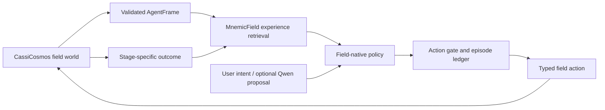

# Cassi Mind—Embodied Field Agent Architecture

## Status: Proposed—August 2026

## 1. Decision

Build the AI as an **embodied controller of a live CassiCosmos field**, not as a language model with a decorative field attachment and not as an autonomous writer to GPU buffers.

The agent has a bounded locus in the simulator, receives validated field observations, chooses auditable physical actions, steps the field through the existing engine, observes consequences, and stores causal episodes in MnemicField. Its intelligence is the growing closed loop:



CassiCosmos remains authoritative for physical state. CassiCore owns the agent loop, memory, policy, action authorization, and episode ledger. A local language model may supply an optional semantic plan or narration, but it never becomes the field substrate, direct actuator, reward oracle, or truth authority.

## 2. Why this is the correct pivot

The existing two-fluid PDE is a **canonical PDE** only in the engineering sense: it is the current, unmodified reference evolution used by the simulator and its verification paths. It is not a claim that the equation alone already implements a complete mind.

The required AI architecture is present only in pieces today:

| Existing component | Existing role | Missing connection |
|---|---|---|
| `CassiCosmos/scripts/cassi_mind_engine.gd` | Deterministic 7599 sidecar with queued deposits, explicit steps, state, projection, readout, and snapshots | Typed agent action gateway and episode contract |
| `CassiCosmos/scripts/field_workbench.gd` | Canonical paused, ordered, auditable main-simulator commands | Agent adapter that uses public Workbench commands rather than private buffers |
| `CassiCore/packages/mind-runtime` | 7273 loopback channel, MnemicField adapter, retained intelligence layer, tool registry | Composed field-agent runtime and guarded action execution |
| `CassiCore/packages/mnemic-field` | Persistent spatial engrams, retrieval, consolidation, and provenance | Explicit field-frame/action/outcome encoder |
| Vendored `field-bridge` | Deposit queue and permissive top-k projection parser | Production composition, strict response validation, and a single action owner |
| `CassiQwen/` | Loopback-only optional language model and read-only field observation experiments | Bounded planner/narrator contract with model identity and output validation |

The architecture below connects these pieces without inventing a second field, a second memory system, or a privileged back door into the simulator.

## 3. Authority boundaries

### 3.1 World authority: CassiCosmos

Only CassiCosmos owns mutable physical state. The first agent target is the deterministic mind-engine sidecar:

```text
127.0.0.1:7599
  ping | state | project | readout | snapshot       read-only
  deposit                                       physical write
  step                                          field evolution
  clear                                         supervisor-only reset
```

In the Stage-A auto-step-off fixture, a deposit is an explicit, charge-exact TSC scatter into queued Yang/Yin input and is flushed only by an agent-controlled `step`. The agent receives no `clear` capability. `readout` is checkpoint-only because it transfers the full field; routine perception uses `state` plus bounded `project(k)`.

Today, the 7599 protocol is transport rather than a complete agent contract: it has no request IDs, schema versions, provenance digest, action budget, or complete grid metadata in its replies. `FieldEnginePort` must therefore pin the fixture configuration, assign monotonic request IDs, validate finite payloads and positive step counts, enforce charge/power/coherence limits, validate reply identities and continuity, and create the immutable action receipt. Stage A uses this sidecar only as a deterministic shadow field; it does not mutate the rendered main `CassiSim` world.

The production-world adapter comes later through `CassiCosmos/scripts/cassi_sim.gd` public Workbench APIs:

```text
agent capability:       workbench_step | workbench_apply | workbench_measure
supervisor capability:  workbench_pause | workbench_resume | workbench_capture_checkpoint | workbench_restore_checkpoint | workbench_run_branch | workbench_replay
```

The agent may invoke only the agent-capability operations while a supervisor-controlled scenario is paused. A supervisor alone may pause, resume, capture, branch, restore, or replay a Workbench state; the agent can receive a recorded branch-evaluation outcome only through Stage E's isolated clone contract. It must never access `_workbench_write_buffers`, checkpoint internals, or raw GPU buffers.

### 3.2 Mind authority: CassiCore

Create a new `@cassicore/field-agent` package. It owns the agent's domain model and the only CassiCore write path to the field engine. It does not live inside vendored bridge code and does not turn MnemicField into an implicit field actuator.

```text
packages/field-agent/
  src/domain/agent.ts              embodied state and lifecycle
  src/domain/intent.ts             user and planner intent schema
  src/domain/observation.ts        AgentFrame variants and feature extraction
  src/domain/action.ts             typed candidate and approved actions
  src/domain/episode.ts            causal transition and provenance record
  src/ports/field-engine.ts        sole 7599 / Workbench capability port
  src/ports/memory.ts              MnemicField experience-store port
  src/ports/planner.ts             optional semantic planner port
  src/runtime/field-agent-loop.ts  observe → retrieve → decide → act → learn
  src/safety/action-gate.ts        limits, authorization, replay checks
  src/policy/                      deterministic candidate generation/scoring
```

The package depends on ports, not on a Godot implementation. It can be tested against a deterministic fake field engine before connecting to the live sidecar.

The current 7273 `MindRuntime.executeTool` route dispatches its registry directly and does not compose the `@cassicore/tools` `ToolExecutor` permission, timeout, and trust hooks. It is a host seam, not the agent's safety gate. The first agent action tool is internal until a guarded capability path composes those checks with `ActionGate`; no `FieldAction` may be routed through the current direct dispatcher. Likewise, existing `MindFieldTelemetry` is read-only and vendored `field-bridge` is not a composed agent loop.

### 3.3 Semantic authority: optional Qwen

Qwen is a bounded language cortex, never an actuator. Its first role is to explain a trace or rank **already generated** candidate descriptions for an existing `AgentIntent`.

It may return only a validated proposal:

```ts
interface SemanticPlanProposal {
  schemaVersion: 1
  intentId: string
  narration?: string
  candidateHints: Array<{
    candidateId: string
    preference?: number
    rationale: string
  }>
  evidenceIds: string[]
  modelReceipt: {
    modelPath: string
    llamaBuild: string
    temperature: 0
    mode: 'fast'
  }
}
```

It cannot return `FieldAction`, a raw deposit, a shell command, a tool call, a reward value, or an assertion that an action is safe. `@cassicore/field-agent` validates the plan against its own candidate set and discards unavailable, malformed, stale, or unpinned-model output.

The existing Core `createLlamaServerTransport` lacks CassiQwen's exact GGUF identity and readiness checks. The first Qwen adapter must use those checks before it is eligible for an opt-in planner role. Qwen-down is an unavailable planner, not an error that fabricates an action or stops the deterministic policy.

## 4. Embodied state

An agent is a participant with a bounded action locus, not a global actuator.

```ts
interface EmbodiedAgentState {
  agentId: string
  episodeId: string
  phase: 'idle' | 'observing' | 'deciding' | 'acting' | 'stepping' | 'learning' | 'halted'
  focus: { x: number; y: number; z: number }
  reach: number
  intent: AgentIntent
  energyBudget: ActionBudget
  lastFrame?: AgentFrameRef
  memoryContext: string[]
  turn: number
}

interface AgentIntent {
  id: string
  kind: 'explore' | 'stabilize' | 'seek-attractor' | 'follow-user-gesture'
  target?: { x: number; y: number; z: number }
  constraints: string[]
  source: 'user' | 'deterministic-policy'
}
```

Stage A's `project(k)` is a bounded global top-k observation; `focus` and `reach` bound only which actions are eligible. `reach`, charge budget, and exact step budget are scenario configuration, recorded in every episode. True local perception arrives in Stage C through the Workbench's centered-radius measurement contract. The first vertical slice keeps focus stationary; later stages can bind it to an interactive Workbench selection or a simulator entity.

## 5. Typed perception

Routine perception is compact, validated, and replayable:

```ts
interface FrameBase {
  schemaVersion: 1
  episodeId: string
  step: number
  time: number
  validation: {
    finite: boolean
    responseSchema: boolean
    continuity: boolean
  }
  observationHash: string
}

interface MindEngineFrame extends FrameBase {
  engine: 'mind-engine'
  perception: 'global-top-k'
  grid: { n: number; extent: [number, number, number] }
  summary: {
    meanYang: number
    meanYin: number
    maxEpsilonSquared: number
  }
  projection: Array<{
    index: number
    grid: [number, number, number]
    position: [number, number, number]
    yang: number
    yin: number
    q: number
  }>
  validation: FrameBase['validation'] & {
    projectionSorted: boolean
    projectedQIdentityChecked: boolean
    fullReadoutIdentitiesChecked?: boolean
  }
}

interface WorkbenchFrame extends FrameBase {
  engine: 'workbench'
  perception: 'aggregate-window'
  window: { center: [number, number, number]; radius: number }
  measure: {
    cellCount: number
    meanYang: number
    meanYin: number
    fieldIntensity: number
    qCoherence: number
    epsilon: number
    rho: number
    mass: number
    particleCount: number
    particleMass: number
    momentum: [number, number, number]
  }
}

type AgentFrame = MindEngineFrame | WorkbenchFrame

interface AgentFrameRef {
  engine: AgentFrame['engine']
  step: number
  time: number
  observationHash: string
}
```

The sidecar adapter builds `MindEngineFrame` from a global top-k response and strictly validates response shape, monotonic ordering, step/time continuity, and $q=E_Y^2+E_I^2$ for every projected cell. `state` and `project` do not carry per-cell epsilon-square data, so the epsilon identity is checked only at a full-readout checkpoint. The Workbench adapter builds `WorkbenchFrame` from an explicit center/radius measurement and validates its aggregate window and finite values. Neither path reuses the vendored permissive parser as its validator.

$$
q=E_Y^2+E_I^2,
\qquad
\epsilon^2=(E_Y-\varphi E_I)^2.
$$

Full `readout` arrays are allowed only at explicit checkpoints, where both $q$ and epsilon-square identities are validated and a content hash and byte count are recorded in the episode. They are not needed for every decision.

## 6. Typed action and the single actuator

```ts
interface DepositAction {
  kind: 'deposit'
  candidateId: string
  expectedStep: number
  position: [number, number, number]
  yang: number
  yin: number
  sigma: number
  provenance: ActionProvenance
}

interface AdvanceAction {
  kind: 'advance'
  expectedStep: number
  steps: number
  provenance: ActionProvenance
}

type FieldAction = DepositAction | AdvanceAction

type WorkbenchAction =
  | {
      kind: 'deposit'
      expectedStep: number
      center: [number, number, number]
      radius: number
      strength: number
      weighted: boolean
      provenance: ActionProvenance
    }
  | {
      kind: 'align'
      expectedStep: number
      center: [number, number, number]
      radius: number
      strength: number
      provenance: ActionProvenance
    }
  | {
      kind: 'impulse'
      expectedStep: number
      center: [number, number, number]
      radius: number
      impulse: [number, number, number]
      provenance: ActionProvenance
    }
  | {
      kind: 'advance'
      expectedStep: number
      steps: number
      provenance: ActionProvenance
    }

type AgentAction =
  | { engine: 'mind-engine'; action: FieldAction }
  | { engine: 'workbench'; action: WorkbenchAction }

interface MindEngineActuationReceipt {
  engine: 'mind-engine'
  requestId: string
  expectedStep: number
  responseHash?: string
  status: 'confirmed' | 'ambiguous'
}

interface WorkbenchActuationReceipt {
  engine: 'workbench'
  requestId: string
  ledgerId?: number // present only for queued physical commands
  expectedStep: number
  responseHash?: string
  status: 'confirmed' | 'ambiguous'
}

type AgentActuationReceipt = MindEngineActuationReceipt | WorkbenchActuationReceipt
```

A complete turn is serialized as:

```text
observe(step=s)
  → retrieve prior transitions
  → generate bounded candidates
  → choose one candidate
  → validate expectedStep=s and budget
  → deposit
  → advance exactly n steps
  → observe(step=s+n)
  → store causal episode
```

The `FieldEnginePort` is the only code allowed to emit 7599 writes. Before transmission it checks the expected step, pinned engine metadata, finite position and payload, focus/reach bounds, and per-turn/episode charge, power, coherence, and step budgets. It serializes requests, verifies returned continuity and identities, and converts each action into an immutable receipt. `deposit` and `advance` are intentionally separate because the engine's explicit step is the causal boundary.

The Workbench adapter applies the same external checks around public commands. Its existing ordered `{id, kind, args}` ledger is useful provenance, but it is not by itself the agent's versioned request/response or budget contract.

The Stage-A action vocabulary deliberately excludes `clear`, `snapshot` as a policy action, velocity changes, alignment, impulse, raw readout mutation, and every Workbench checkpoint, restore, branch, or replay control. A supervisor may reset an episode or request an archival snapshot; the agent cannot.

## 7. The intelligence loop

### 7.1 Deterministic first policy

The first policy is not a trained black box. It is a field-native causal learner:

1. Generate a small candidate set from the current `AgentFrame`, agent focus, intent, and budget; Stage A uses a global top-k frame, while Stage C uses an aggregate local window.
2. Retrieve similar prior `FieldEpisode` records from MnemicField using explicit field features and intent metadata.
3. When a transition predictor is available, score candidates by the declared objective; otherwise select the scenario's deterministic exploration candidate.
4. Execute the approved bounded turn.
5. Store the stage-appropriate `EpisodeOutcome`: an exploration metric in Stage A, prediction error and novelty only in the learning stage.

```ts
type EpisodeOutcome =
  | {
      stage: 'exploration'
      metric: {
        name: 'focus-weighted-top-k-q'
        before: number
        after: number
        delta: number
      }
      constraintStatus: 'kept' | 'violated'
    }
  | {
      stage: 'learning'
      objectiveDelta: number
      predictionError: number
      novelty: number
      constraintStatus: 'kept' | 'violated'
    }

interface FieldEpisode {
  id: string
  intent: AgentIntent
  frameBefore: AgentFrameRef
  candidates: CandidateReceipt[]
  selectedCandidateId: string
  actions: readonly AgentAction[] // ordered physical-action/advance turn
  actuation: readonly AgentActuationReceipt[]
  frameAfter: AgentFrameRef
  outcome: EpisodeOutcome
  provenance: EpisodeProvenance
}
```

Stage A records exploration without inventing a prediction or novelty score. In Stage B, the policy's state-action-outcome model grows through persistent episodes rather than becoming an arbitrary fixed $q$ maximizer. Each scenario supplies its own measurable objective, and a baseline policy is retained for comparison.

### 7.2 Memory encoding

After each accepted turn, an explicit `FieldEpisodeEncoder` stores a MnemicField engram with:

- an observation hash and selected compact field features;
- focus and target coordinates;
- intent and candidate identifiers;
- the ordered action sequence and matching engine receipts;
- before/after frame references;
- the stage-appropriate outcome and provenance.

MnemicField remains the durable memory substrate. No hidden deposit queue, automatic field encoder, or memory-to-engine drain is introduced. Retrieval is an input to the policy; memory does not directly cause actuation.

### 7.3 Optional semantic planning

Qwen receives an `AgentPlanningContext` with a user intent, validated compact `AgentFrame` features, selected memory excerpts, and the already-generated candidate IDs. Its output is a proposal that can influence narration or candidate ranking only after schema, model identity, and evidence-ID validation.

The deterministic policy remains the operational default. The Qwen planner is default-off until a field-off versus planner-on gate establishes a defined improvement without violating action or replay contracts.

## 8. Safety, integrity, and learning gates

The agent is not allowed to bypass physics in order to appear competent.

| Gate | Requirement | Failure response |
|---|---|---|
| Capability | Only `FieldEnginePort` may write; no `clear` or raw buffer access | Reject action; halt turn |
| Schema | Intent, candidate, and action preflight exactly; each response validates on receipt | Reject invalid action before send; on malformed response, timeout, EOF, or socket loss halt without retry, store an ambiguous non-learning receipt, and require supervisor reset |
| Turn ordering | `expectedStep` matches current engine step; one serialized writer | Reject stale action |
| Budget | Per-turn and per-episode charge, radius, sigma, and step limits | Reject action |
| Field integrity | finite values and projected q identity per turn; full q/epsilon identities at checkpoints; charge accounting and bounded power/coherence | Halt episode and archive receipt |
| Replay | Seed manifest, isolated memory, ordered actions, receipts, and before/after hashes persist; each repetition begins from a fresh field and memory state | Mark episode non-learning-eligible |
| Learning | comparison against a deterministic baseline with frozen objective | Do not adopt policy change |
| Semantic isolation | Qwen cannot emit actions or tools; model identity is pinned | Fall back to deterministic policy |

`mind_engine_cache.tscn` supplies the pinned auto-step-off, zero-state transport fixture. A Stage-A scenario adds a versioned, supervisor-only seed manifest—ordered initialization commands, initial step, and initial observation hash—before the agent receives a field capability. `FieldEnginePort` pins that metadata and adds the missing action receipt and enforcement layer. The canonical Workbench's G0–G7 and NF0–NF9 checks become mandatory before an agent controls the main simulator.

## 9. Delivery sequence

### Stage A—Agent kernel: first complete vertical slice

Build `@cassicore/field-agent` with a fake field-engine port and a typed 7599 adapter over the pinned `mind_engine_cache.tscn` fixture plus supervisor-only seed manifest. The harness applies and validates that manifest before granting the agent its field capability. Stage A is confined to that deterministic shadow sidecar, not the mutable main-simulator render state. Deliver one deterministic episode:

A `StageAScenarioManifest` is written before the fixture launches. It contains literal values, never candidate generation at run time:

```ts

type SupervisorSeedCommand =
  | {
      kind: 'deposit'
      position: [number, number, number]
      yang: number
      yin: number
      sigma: number
    }
  | { kind: 'advance'; steps: number }

interface StageAScenarioManifest {
  schemaVersion: 1
  fixture: { scene: 'mind_engine_cache'; gridN: 32; autoStep: false }
  seed: {
    commands: readonly SupervisorSeedCommand[]
    commandDigest: string
    expectedInitialStep: number
    expectedInitialFrameHash: string
  }
  intent: AgentIntent & { kind: 'explore' }
  focus: [number, number, number]
  reach: number
  budget: ActionBudget
  perception: { kind: 'global-top-k'; k: 8 }
  candidates: readonly [DepositAction, DepositAction, DepositAction]
  advance: AdvanceAction
  selection: {
    rule: 'candidateId-ascending'
    expectedCandidateId: string
  }
  outcomeMetric: { kind: 'focus-weighted-top-k-q' }
  memory: { isolatedHome: string; namespace: string }
  replay: {
    repetitions: 2
    requireExactActionReceipts: true
    requireExactFrameHashes: true
  }
}
```

Stage A uses the frozen `explore` intent and ascending candidate-ID selection, so it validates the complete turn without claiming a state-dependent target-seeking policy. Its post-turn outcome metric is $J(P;f,r)=\frac{\sum_{c\in P}q_c e^{-\lVert x_c-f\rVert^2/(2r^2)}}{\sum_{c\in P}q_c}$ for returned top-k projection $P$, frozen focus $f$, and declared reach $r$; it is zero when the denominator is zero. The manifest records the exact candidate deposits, selection and expected selection, one fixed advance count, and a fresh isolated MnemicField home for each replay. Stage B makes a predicted candidate-specific $\Delta J$ or another pre-registered objective the selection score.

```text
fixed seeded mind-engine state
  → MindEngineFrame(project k=8)
  → explore intent
  → three bounded deposit candidates
  → candidate-ID choice
  → exact step cadence
  → MindEngineFrame after
  → FieldEpisode stored in MnemicField
  → replayable receipt
```

Acceptance is not visual plausibility. It is a seed manifest and validated initial-frame hash, exact action provenance, valid field receipts, deterministic replay, a stored/retrievable causal episode, and a field-off/no-action control with no mutation. Stale-step and over-budget actions must be rejected before reaching the sidecar. Any uncertain post-send outcome—malformed response, timeout, EOF, or socket loss—is treated as a possibly queued action: the turn halts without retry, stores an ambiguous non-learning receipt, and awaits supervisor reset.

### Stage B—Persistent agent learning

Enable transition retrieval and outcome prediction over repeated fixed scenarios. Pre-register the objective, baseline, episode count, stopping rule, and adoption condition. A learning gain must beat a deterministic candidate policy, not merely change the field.

### Stage C—Interactive embodiment

An operator owns pause/resume. Once the scenario is paused, player gestures and the agent use the same public `deposit`/`align`/`impulse`, step, and measure operations; queued physical commands share the Workbench ledger, while every wrapper call receives its own receipt. Supervisor-owned checkpoint, restore, branch, and replay operations record and verify episodes; the agent receives no privileged command.

Stage C introduces separately versioned `WorkbenchFrame` and `WorkbenchAction` mappings. Workbench measurement is aggregate and its deposit uses a center/radius operation, so the adapter must not coerce a sidecar top-k point or `DepositAction` directly into a main-world command. It records the declared translation and both receipts as part of the episode.

### Stage D—Semantic cortex

Add the optional loopback Qwen planner behind its model-identity readiness gate. Its first live role is planning explanation and candidate ranking; it remains unable to write to the field. A separate gate decides whether it improves a declared agent objective.

### Stage E—World-scale agency

Add a supervisor-owned deterministic clone evaluator that accepts bounded candidate actions and returns outcome receipts without granting the agent capture, restore, branch, or replay capability. Then bind focus to a persistent simulator entity. This is the path toward game-universe inhabitants: every inhabitant has a locus, perception radius, memory history, action budget, and replayable causal trace.

## 10. Explicit non-goals

This architecture does not:

- claim that the current field PDE is already conscious;
- let a language model directly manipulate field buffers;
- replace CassiCore memory with a generic vector database;
- use Qwen output as truth, reward, safety authorization, or action code;
- make uncontrolled deposits or hide them in an encoder queue;
- treat a visually interesting field change as learning;
- integrate against archived CassiAI code.

## 11. Immediate implementation decision

The next work is **Stage A**, not another isolated PDE feature test:

1. create the `@cassicore/field-agent` package and its typed ports;
2. implement the deterministic sidecar adapter, action gate, and episode ledger;
3. make the bounded agent turn internal/test-harness callable; expose a Core tool only after a guarded capability path composes `ToolExecutor` and `ActionGate`;
4. apply and receipt the supervisor-only seed manifest, then run the fixed seeded vertical slice against the windowed mind-engine fixture;
5. verify replay, memory retrieval, and field-off identity before expanding the agent's policy or adding Qwen.

## References

- `CassiCosmos/scripts/cassi_mind_engine.gd`—7599 sidecar and field authority.
- `CassiCosmos/scripts/field_workbench.gd`—canonical main-simulator command/ledger boundary.
- `CassiCosmos/scripts/cassi_sim.gd`—public Workbench host APIs.
- `CassiCosmos/scripts/verify_mind_engine.gd`—sidecar field and protocol verification.
- `CassiCosmos/scripts/verify_field_workbench.gd`—public action/replay verification.
- `CassiCosmos/tools/field_steer.py`—existing bounded steering-loop precedent.
- `CassiCore/packages/mind-runtime/src/boot.ts`—runtime composition and current missing field-agent wiring.
- `CassiCore/packages/mind-runtime/src/field/telemetry.ts`—validated read-only field telemetry.
- `CassiCore/packages/mind-runtime/src/vendor/core/intelligence/field-bridge/index.ts`—bridge transport helpers.
- `CassiCore/packages/mnemic-field/src/types.ts`—persistent engram and retrieval types.
- `CassiCore/packages/tools/src/executor.ts`—safety/permission execution path to compose before live action.
- `CassiQwen/README.md`—loopback local-model boundary and current adoption limits.
