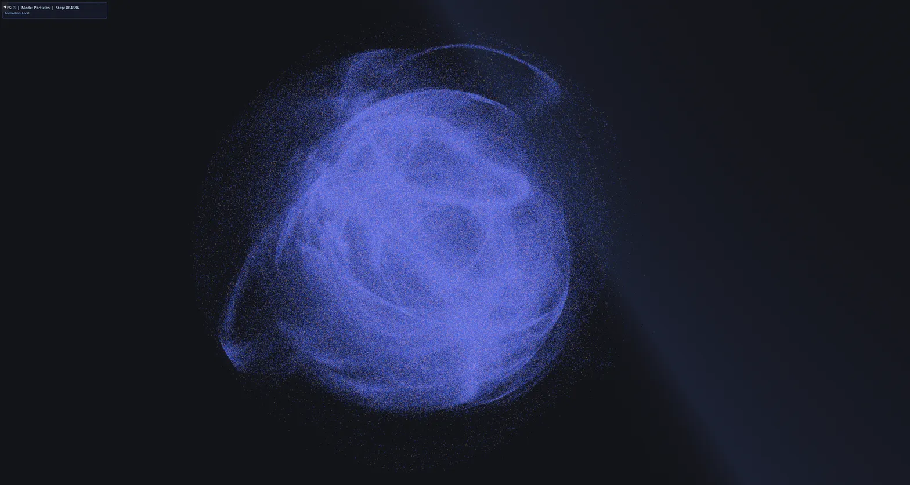
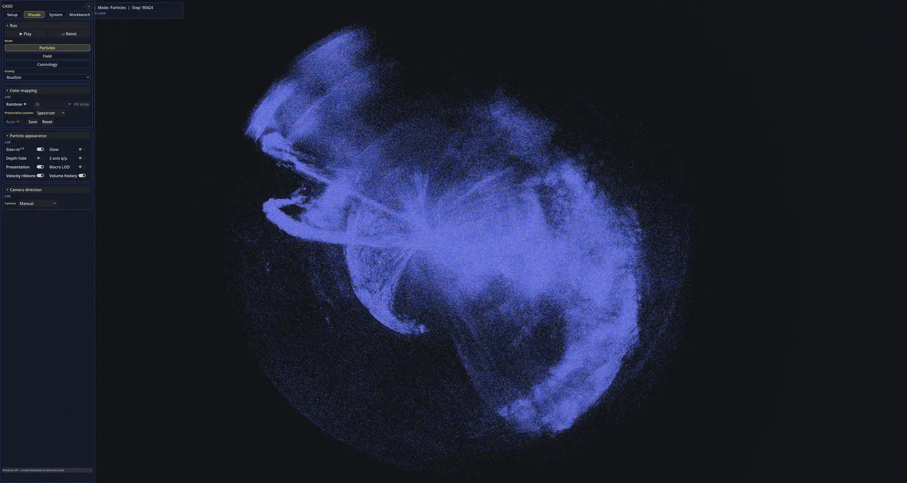
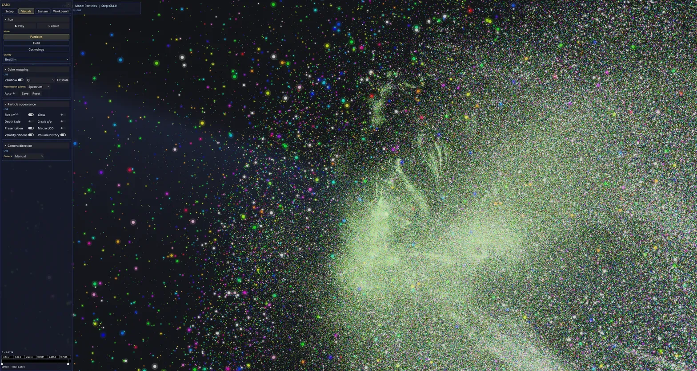

# CassiCosmos

**An interactive universe simulator for exploring how structure forms.**

CassiCosmos brings the ideas in CassiTheory into a live, explorable world.
Millions of particles move through two interacting fields, called Yang and
Yin. The particles influence the fields, and the fields help determine how
the particles move. What you see is computed as the simulation runs.

The question behind it is simple: **what kinds of structure can grow,
persist, or fall apart under these rules?** You choose the starting
conditions, let the system evolve, and examine what happens.

These are direct views from the running simulator:

  
  

Two views of the same blue field instance.

  

A separate particle view of the running simulator.

- **A world you can experiment with.** Start with clouds, rings, shells,
  spirals, or intertwined strands. Change their arrangement and initial
  motion, then watch how the same rules act on different beginnings.
- **A view beneath the particles.** Switch between individual particles and
  the underlying fields. Scientific colours expose the simulation's
  quantities; Observatory and Cinematic views make it easier to explore the
  luminous structures. Changing the appearance leaves the physics alone.

Cassi's long-term goal is to investigate whether field dynamics can support
both physical structure and intelligence. CassiCosmos provides the live
physics sandbox for that effort.

The simulator runs today; the proposed physics remains experimental.
Prepared starting shapes and astronomical-looking images do not, by
themselves, demonstrate realistic galaxies or spontaneous matter formation.

Open [`project.godot`](project.godot) in **Godot 4.7.1 .NET (Mono)** and press
**F5**. You need a GPU with compute-shader support; run the simulation in a
normal window.

- **WASD** to move, **right-drag** to look, **Space** to pause or resume.
- **Setup → Initial state** to choose a shape and initial motion.
- **Visuals → Appearance** to choose Scientific, Observatory, or Cinematic.

The default scene uses **2.5 million particles**. Lower **Setup → Compute
budget → Particles** if your hardware needs a lighter workload.

- [Technical guide](TECHNICAL_GUIDE.md) — configuration, controls, engine
  details, and measured performance.
- [Recording](RECORDING.md) — screenshots and movies.
- [Verification](verify/README.md) — how the running simulation is checked.
