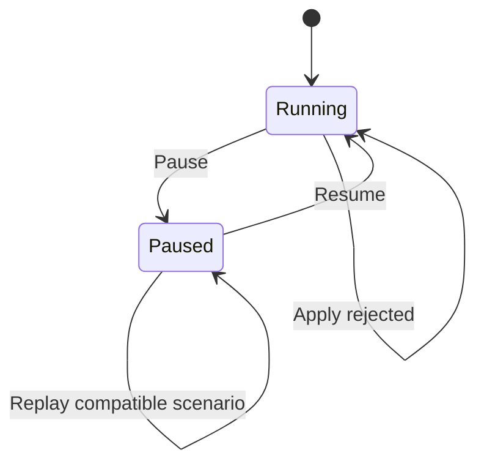

# Interactive Field Workbench—vertical-slice design

## Status: Implemented design target—August 2026

## 1. Purpose

The Interactive Field Workbench turns CassiCosmos into a manipulable field laboratory. The first vertical slice prioritizes explicit, reproducible operations over a broad collection of sliders. A user pauses the universe, selects a bounded region, applies one physically legible operation, measures its effect, advances fixed steps, and saves or replays the sequence.

The workbench is not a second solver and does not introduce a competing field model. It is an operation and provenance layer over the canonical CassiSim buffers.

## 2. Interaction categories

| Category | Examples | Mutates physics? | Recorded in physics ledger? |
|---|---|---:|---:|
| Initial state | seed, grid, particle profile, reinit | Yes, by reconstruction | No; captured in scenario baseline |
| Transport | pause, resume, step | Time/state machine | Recorded as scenario context |
| Field operation | deposit, align | Yes | Yes |
| Particle operation | impulse | Yes | Yes |
| View | lens, cursor, camera | No | No |
| Measurement | selected-region readout | No | No |

This separation prevents a color change or measurement from silently changing the universe and prevents a live intervention from being mistaken for a solver parameter.

## 3. Command model

A physics command is a dictionary with stable schema fields:

```text
schema_version
id                 sequential integer assigned by the workbench
op                 deposit | align | impulse
center             [x, y, z] in world coordinates
radius             positive world-space radius
parameters         operation-specific numeric values
requested_step     current paused step
applied_step       step at which the mutation occurred
status             applied | rejected
accounting         requested and measured deltas/invariants
```

Commands are ordered. IDs are deterministic ordinals, not timestamps or random UUIDs. Invalid commands are rejected before buffer mutation and return a diagnostic reason. View changes and measurements never enter this ledger.

### Deposit

The spherical deposit uses a compact smooth radial weight over grid-cell centers. Weights are normalized across selected cells so requested Yang and Yin totals remain meaningful at any radius. The operation updates EY and EI, then recomputes Q for changed cells.

### Align

Alignment moves each selected $(E_Y,E_I)$ pair toward the positive $E_Y=\phi E_I$ direction. It preserves the per-cell radius $\sqrt{E_Y^2+E_I^2}$; therefore it reorganizes existing field energy rather than injecting amplitude.

### Impulse

Impulse adds a constant velocity vector to every live particle in the selected sphere. Position and mass are unchanged. The ledger reports selected particle count and requested/measured momentum change.

## 4. Runtime state machine



Operations are paused-only in the first vertical slice. This gives a deterministic frame boundary and avoids mutating buffers during a GPU compute list. Decoupled mode is rejected because its worker thread owns a separate local RenderingDevice. A later GPU-native command queue can lift these restrictions only after its own pre-registration and ownership gates.

## 5. Coordinate and selection contract

The UI supplies a world-space center and radius. Grid membership uses cell-center coordinates derived from the current per-axis box extents and the simulator's x-major storage convention. Distances use periodic shortest displacement for the periodic grid. Particle selection uses world positions directly and excludes dead particles (`mass <= 0`).

The selected-region readout reports:

- selected grid-cell count;
- sums and means of EY and EI;
- $q=E_Y^2+E_I^2$;
- $\rho=E_Y+E_I$;
- $\epsilon=E_Y-\phi E_I$;
- live selected-particle count;
- selected mass and momentum.

## 6. Operator-rail experience

The workbench belongs in the existing viewport-first left operator rail as a dedicated **Workbench** tab. It uses existing Cassi UI components and theme tokens.

### Transport

- Pause
- Resume
- Step

The status line always reports running/paused, inline/decoupled ownership, current step, and the latest operation result.

### Region

- center X, Y, Z;
- radius;
- Measure button;
- selected-region numeric summary.

The first slice permits exact numeric center entry. A later slice can add a world-space cursor and raycast without changing the operation schema.

### Tool

- Deposit;
- Align;
- Impulse.

Only parameters relevant to the selected tool are interpreted. Apply is an explicit button; selecting a tool never mutates state.

### Scenario

- Save to a deterministic `user://` workbench path;
- Replay after schema/config/checksum validation;
- latest command ID and ledger length.

### Lens

- Qi: $q$;
- Balance: $\epsilon$;
- Density: $\rho$;
- Flow: selected field/particle velocity readout.

Lens choice is view-only. The existing physics color legend remains a data visualization, never UI chrome.

## 7. Scenario format

A scenario is versioned and includes:

- schema version;
- effective grid dimensions and extents;
- timestep, step count, and simulation time;
- exact baseline EY, EI, Q, positions, velocities, and masses as applicable;
- ordered commands;
- canonical checksum over fixed-key-order content.

Replay validates everything before mutating live buffers. The format does not rely on a timestamped survey or mind-engine snapshot because those are observational artifacts and omit workbench operation provenance.

## 8. Performance and safety boundaries

The first slice intentionally uses low-frequency paused CPU read-modify-write operations. Full-buffer readback stalls the global RenderingDevice, so the UI must not apply or measure continuously while dragging. There is no per-frame work when no command or measurement is requested.

The following remain out of scope for this slice:

- live brush strokes while physics is running;
- mutation of the decoupled worker's local buffers;
- undo after physics has advanced;
- cross-session replay across incompatible solver revisions;
- automatic causal explanations;
- claims that field imagery establishes a human mechanism.

## 9. Next program stages

1. GPU-native queued kernels for deposit, alignment, and impulse.
2. World-space cursor, raycast, and visible spherical brush.
3. Timeline checkpoints and counterfactual branches.
4. Editable initial-condition operation stacks and $\phi$-cascade primitives.
5. Presentation storyboards, annotations, and sonification.
6. Inverse design and standardized stability auditions.

Each stage inherits the command/provenance separation established here and receives its own frozen verification protocol before runs.
