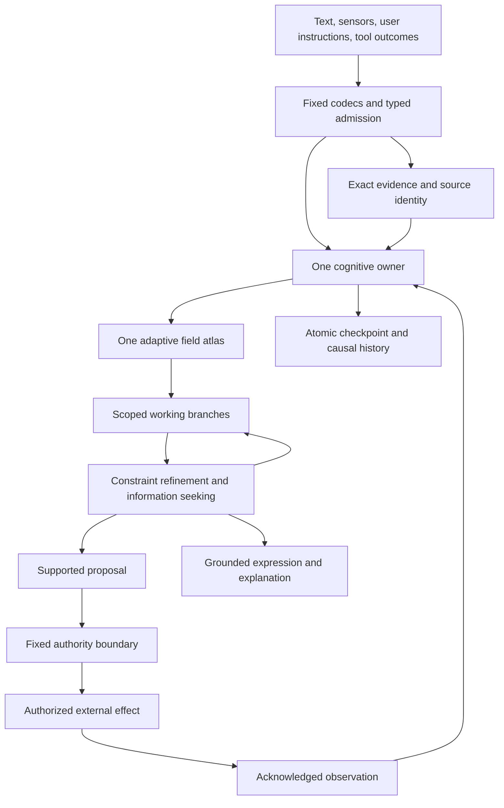

# Cassi Field Intelligence: One Universal Regional Computer

## Design intent

Build one continuously learning intelligence whose memories, concepts, predictions, plans, language, and explanations are different uses of the same adaptive field. The system should acquire experience throughout its lifetime, recover exact evidence, distinguish knowledge from conjecture, revise its understanding when predictions fail, construct new reusable abstractions, and allocate computation to what remains unresolved.

The target is a complete cognitive architecture. A larger next-token predictor, a collection of agents around a field, and a router joining the prototype controllers are different designs and are not the target here.

The target execution architecture is the [universal regional field computer in Section 32](#32-one-universal-regional-field-computer): one canonical tensor, typed regional state, shared representations, one automaton-guided instruction/event path, and one persistent publisher. The variational relation family supplies a mathematical basis for learning and inference inside that computer. It does not replace the need to lower symbolic, numerical, temporal, and language computation into the same runtime.

The [world-model and lifelong-intelligence design in Section 33](#33-field-native-world-modeling-and-lifelong-general-intelligence) specifies the next cognitive target: shared uncertain belief, predictive-state acquisition, hybrid and causal mechanisms, representation discovery, contingent planning, grounded language, and continuous learning through that same computer.

A full design must distinguish what has been established from what is being specified. This document uses four categories:

- **Implemented basis:** behavior present in the cited root source and its executable scenario.
- **Derived extension:** a mathematical consequence under the stated assumptions; numerical checks illustrate selected identities and counterexamples.
- **Specified mechanism:** a concrete architectural decision whose full implementation is future work.
- **Research question:** an unresolved capability or mathematical property. Its interface and required behavior are designed; success is not assumed.

These labels describe knowledge, not a sequence of bureaucratic approval stages. Development remains direct: implement a coherent behavior, exercise it, inspect its failure, and improve it. The design introduces no preregistration or frozen-verdict process.

Read Section 32 for the regional execution architecture, its implemented core and specified extensions, migration inventory, and measured sustained episode. Read Section 33 for the complete world-model semantics, acquisition algorithms, source responsibilities, implementation dependencies, and end-to-end behavioral requirements. Sections 3–15 retain the mathematical and representational detail; Sections 26–31 preserve component-level evidence and standalone reference semantics. The normal production owner, CLI, and installed-runtime computation path uses the sole regional machine, while retained modules supply fixed codecs, bounded stateless kernels, independent references, and research scenarios.

The [open-ended research organism in Section 35](#35-open-ended-research-organism-and-cumulative-intelligence) integrates the resident researcher, representation and program discovery, independent world evaluation, field hive, and recursive improvement laboratory. Its executable basis now includes a persistent root organism and an independently verified three-generation development campaign in which promoted source becomes the next parent, the live field agenda chooses each question, a typed construction is derived from that parent, causal outcomes are measured, and an acquired investigation procedure transfers first to unfamiliar architecture successors, then from Python-architecture construction into a CassiFI structured-field-program task, and then into an exact Boolean transition-constraint task with an independently enumerated witness. Section 35 still specifies a maximum-ambition developmental system beyond this bounded demonstration; broad semantic cross-domain intelligence is not implied by it.

The [extensible platform and sustained apprenticeship in Section 36](#36-extensible-platform-and-sustained-apprenticeship) specifies the public development surface around that organism. Worlds, source readers, field programs, experience collections, and applications use one owner-backed interface. The same surface supports human-authored and Cassi-authored extensions, while a continuing multi-domain campaign supplies substantial work from which new capabilities can grow.

The [affect and regulation mechanism in Section 37](#37-field-owned-affect-and-regulation) supplies grounded, multi-timescale context for research and learning choices. Experience can change which available work becomes compelling while its source evidence, factual meaning, and authority remain unchanged.

The [Universal Latent Reasoning System design](../CassiQwen/LATENT-REASONING-DESIGN.md) specifies model-instrument integration and the path to field-owned latent computation, state, and emission. It reuses this computer's state, semantic records, and owner lifecycle; model-specific execution remains an explicit external boundary rather than a hidden dependency of standalone field intelligence.

The [integrated general-learning and affective hive upgrade](../CASSI-ENTITY-DESIGN.md#19-integrated-general-learning-and-affective-hive-organism) specifies the complete composition of these mechanisms within the existing entity. Section 37 supplies its detailed field-owned appraisal and regulation semantics. This is a specified upgrade, not a claim that the full organism is already implemented.

[Cassi: A Persistent Field–Brain Entity](../CASSI-ENTITY-DESIGN.md) integrates these components into the autonomous researcher. Its shared cognitive workspace couples field-owned experience and organization with a live pretrained llama.cpp brain; the same lifetime supports conversation, self-originated inquiry, acquisition, affect, scientific tools, multiple research programs, and a public communication API. That entity-level design governs composition and lifecycle of the explicit `field-brain` profile and distinguishes implemented components from remaining integration. This document remains authoritative for the regional computer and its standalone operation.

The [programmable field swarm design](../CASSI-PROGRAMMABLE-SWARM-DESIGN.md)
specifies a Python interpreter acquired as an executable regional program,
inspectable and resumable computations, scoped branches, guarded compilation,
and native CPU/Vulkan execution across independent member owners. Section 32.23
fixes its relationship to this computer. The interpreter and resident backend
remain specified extensions; the existing Python source analyzer is not a
Python execution engine.

The [living memory design](../CASSI-LIVING-MEMORY-DESIGN.md) is implemented
through the canonical regional semantic kernel and field–brain owner path. It
connects progressive recall to actual use and outcome, recoverable demotion to
exact expansion, prospective relevance to correction-triggered reconsideration,
and memory awareness to the resident research agenda. Canonical regional pages
are independently content-addressed, readable and scrubbable in bounded pages;
ordinary kernel execution still reconstructs the verified dense
`ComputerState`. The companion design states that boundary and the complete
operational contract for Sections 15–18, 32, 33.20, and 37.

**Current development direction:** use Cassi's established learning to run autonomous research programs. The retained learning/evaluation sections explain mechanisms and existing experiments; their campaigns are not prerequisites for building the researcher and must not be repeated without an explicit user request. Extend the existing owner, residency, organism, and program machinery, checking the actual tools, runtime behavior, and scientific results rather than re-proving learning.

The [packet-aware reasoning extension](../CassiQwen/LATENT-REASONING-DESIGN.md#packet-aware-reasoning-scope-and-status) specifies how the implemented §26.18 numerical packets participate in resident multi-operation episodes, typed child-state return, lifetime resource accounting, semantic work selection, safe refinement, correction, and acquired interfaces. That extension remains specified; it does not change the current packet reconstruction/impulse evidence into a reasoning-performance claim. The regional image and semantic ownership rules in this document remain authoritative.

`prototype/` remains the finalized paper implementation. The variational source and that paper bundle have distinct schemas and evidence. Designing the next system does not reinterpret their checkpoints or retroactively unify their equations.

## 1. The complete destination

### 1.1 The intelligence we are building

The mature system maintains an executable, revisable understanding of its environment and of its own operations. A learned relationship can answer a recall query, constrain a prediction, participate in a plan, support a sentence, and appear in an explanation. A correction changes those uses through the same learned structure.

The system has the following capabilities as architectural targets:

1. **Lifelong acquisition and revision.** Learn new observations without a separate retraining service; preserve useful prior relationships; distinguish correction, context change, contradiction, and forgotten evidence.
2. **Exact evidence access.** Select relevant sources adaptively and recover their authorized exact bytes, revision, span, units, and provenance through a checked boundary.
3. **Grounded concepts.** Form object correspondences, roles, relations, and abstractions that are useful across observations, actions, and modalities.
4. **Open-ended composition.** Build new executable structures from a small fixed computational vocabulary rather than remain confined to a fixed list of complete candidate programs.
5. **Nonverbal deliberation.** Refine numerical, relational, symbolic, and temporal workspaces without requiring each intermediate thought to become text.
6. **Multi-hypothesis reasoning.** Keep incompatible but plausible situations distinct, including unresolved identity, source conflict, regime uncertainty, and alternative futures.
7. **Long-horizon planning and repair.** Plan at several resolutions, retain assumptions, update only affected dependencies, and re-expand abstractions when their conditions fail.
8. **Information-seeking agency.** Decide when to retrieve, measure, ask, calculate, simulate, deliberate, act, or stop.
9. **Closed predictive learning.** Join each executed proposal to its original prediction and actual observation; localize mismatch without pretending that error automatically identifies its cause.
10. **Grounded language.** Understand and express relationships already participating in the field's cognition; acquire linguistic structure without a second learned language model.
11. **Causal transparency.** Expose relevant evidence, alternatives, constraints, changes, and interventions rather than generate an unrelated rationale.
12. **Resource awareness.** Preserve useful work, activate relevant state, learn about computational costs through the same field, and respect explicit resource budgets.
13. **Persistent continuity.** Resume knowledge and explicitly tagged unfinished hypotheses across sessions, with exact recovery and revocation-aware versioning.
14. **Bounded authority.** Maintain user-owned objectives and permissions independently of cognitive support or numerical stability.

The full ambition is their composition in one sustained intelligence. Individual demonstrations do not establish that composition.

### 1.2 What unification means

There are four substantive requirements for unification:

- **Common adaptive ownership:** every adaptive value and unfinished internal continuation belongs to the canonical `ComputerState.field` image.
- **Common representational use:** the same relation identity and numerical content participate in recall, inference, planning, language, and explanation.
- **Common execution:** every cognitive and solver capability executes as stored programs and bounded native operations through the same machine transition, automaton, event queue, and resource ledger.
- **Common mathematical core:** the declared variational chart family uses the same potential for observed-memory updates and conditional workspace evolution.

The common-potential statement is exact for the implemented finite variational family and specified admissible extensions. It does not mean that arbitrary structure discovery, external action, string decoding, or every nonlinear computation inherits its descent theorem.

A field is not unified merely because several private tensors are concatenated. Conversely, a unified intelligence does not require identical arithmetic for continuous covariance, an exact source identifier, and an authority decision.

### 1.3 The causal standard

For a claimed learned capability, changing the responsible field support while holding the observation, fixed machinery, and exact evidence constant must change the supported computation in the predicted way. Rebuilding a derived index must not invent or remove learned meaning. A raw source can remain available after field ablation without the adaptive ability to select or apply it remaining intact.

A correction to one learned relationship should change its recall, prediction, plan, and expression consequences through shared dependencies. Four manually synchronized updates would fail the architectural objective even if their outputs matched.

## 2. State and ownership

### 2.1 Four kinds of state

Use the following conceptual decomposition:

\[
\mathcal X_t=(F_t,E_t,A_t,K).
\]

- \(F_t\): the sole canonical machine tensor, including learned numerical relations, discrete structure, support, provisional cognition, programs, automaton/routing state, and complete execution continuations.
- \(E_t\): exact evidence and immutable computational history, subject to access and retention rules.
- \(A_t\): nonlearned authority and operational control state, including scope, approvals, revocation generation, and durable operation identity.
- \(K\): fixed codecs, instruction semantics, compiler bootstrap, bounded stateless arithmetic kernels, and validation rules.

The archive and authority state can change over time without becoming learned cognition. The target has one canonical adaptive tensor; exact evidence bytes, access-control state, and durable external-operation journals remain separate nonlearned boundaries. Physical paging represents slices of that same tensor and does not permit independent adaptive page families.

A working branch \(W_b\) is a scoped view rooted at an exact predecessor. Its assumptions, overlays, call frames, dependencies, and pending events are regions in the same canonical image. Physical copy-on-write storage is permitted only as a lossless representation of those regions; it cannot conceal another live solver or a missing continuation.

### 2.2 Epistemic type, lifetime, and persistence are independent

Every claim or relation use carries an epistemic type:

| Type | Meaning |
|---|---|
| Observed | An admitted measurement or event with an identified observation boundary |
| Asserted | An identified source or user stated something |
| Derived | A result of declared operations on identified premises |
| Hypothetical | A possible state or interpretation under explicit assumptions |
| Desired | An objective, constraint, or preference supplied through an authorized goal boundary |
| Permitted | An authority decision allowing a bounded operation |

An exact quotation is evidence of what the source says, not automatic evidence that its contents are true now. A deduction can become durable knowledge while remaining dependent on its premises. A hypothesis can persist across a restart without becoming an observation. Fast and slow memory are retention properties, not truth labels.

No activation magnitude, curvature, coherence statistic, or repeated simulation changes an epistemic type. Only a declared operation with the appropriate evidence can do that.

### 2.3 The learned field atlas

A relation chart contains:

- stable logical factor and variable identities;
- typed roles and coordinate definitions;
- a scope selector or a field-resident scope program;
- context and regime guards;
- an admissible SPD second-moment block;
- field-resident observation mass and evidence occupancy;
- source and derivation support;
- applicability and revision intervals;
- residual and reliability summaries with declared semantics;
- links to abstractions or constraints that depend on it.

The mathematical block, its learned scope, and the support determining its use all belong to \(F\). An external index may accelerate lookup but cannot become the authoritative object graph, semantic dictionary, count table, or policy learner.

A **concept** is a reusable typed pattern of variables, relations, guards, and transformations. A **skill** is a concept that can be applied to predict or produce an effect under authority. A **plan** is a provisional composition of such structures. A **memory query** asks for a supported completion or exact evidence handle. They are different uses of shared learned material.

## 3. Implemented variational basis

### 3.1 Source interpretation

`cassi_variational_field.py` stores its learned SPD blocks and provisional workspace in one raw tensor of shape

\[
[S,9M,1].
\]

In this implementation \(S\) is the number of factors, not the prototype's bank of physical or cognitive timescales. Each factor has a fixed scope. The common real coordinate stores memory, and the differential imaginary coordinate stores workspace:

\[
C=\phi Y+I,\qquad D=Y-\phi I,
\]

\[
Y=\frac{D+\phi C}{1+\phi^2},\qquad
I=\frac{C-\phi D}{1+\phi^2}.
\]

Memory writes affect the raw real lanes; workspace writes affect disjoint raw imaginary lanes. The remaining lanes are zero under this primitive's schema. Its inference preserves memory bytes exactly. Canonical atlas chart pages keep these provisional lanes zero; the retained resonant workspace uses the separate typed layout in §26.3.

This is an explicitly new interpretation, not a compatible W3 or paper-provider checkpoint. \(\phi\) is a coordinate choice. No mathematical or measured necessity for the golden ratio is assumed.

### 3.2 One potential

Let \(P_f\) select the coordinates used by factor \(f\), let \(k_f\) be its width, and let \(\Sigma_f\succ0\) be its learned regularized uncentered second moment. For \(\lambda>0\), define

Scopes contain distinct scalar coordinate identities: \(P_f\) is a selector, not an unconstrained learned projection matrix. Repeated logical roles share a variable or enter an explicit equality relationship. A more general linear map requires its own Gram-operator bounds rather than the incidence-count bound below.

\[
e_f(\Sigma_f,z)=\frac12\left[
\log\det\left(\lambda^{-1}\Sigma_f\right)
+\lambda\operatorname{tr}(\Sigma_f^{-1})-k_f
+(P_fz)^\mathsf T\Sigma_f^{-1}(P_fz)
\right],
\]

\[
\mathcal F(\Sigma,z)=\sum_f e_f(\Sigma_f,z).
\]

All coordinates are dimensionless after declared boundary normalization. This is a numerical relational potential. It is not electrical energy, a fitted probability distribution, calibrated confidence, or a theory of biological metabolism.

The second-moment description matters. There is no separately learned mean in the current operator. Affine relationships require an explicit constant coordinate or another declared representation.

### 3.3 Memory learning is a metric flow

For a fully observed local vector \(x=P_fz\), hold \(x\) fixed and define

\[
Q=xx^\mathsf T+\lambda I.
\]

Under the SPD metric

\[
g_\Sigma(U,V)=\frac12\operatorname{tr}
(\Sigma^{-1}U\Sigma^{-1}V),
\]

one has

\[
\operatorname{grad}_g e=\Sigma-Q.
\]

Indeed, the directional derivative is

\[
De[U]=\frac12\operatorname{tr}
\left[(\Sigma^{-1}-\Sigma^{-1}Q\Sigma^{-1})U\right]
=g_\Sigma(\Sigma-Q,U).
\]

The exact negative-gradient flow is

\[
\Sigma(t)=e^{-t}\Sigma(0)+(1-e^{-t})Q,
\]

with

\[
\frac{de}{dt}=-\frac12
\left\|\Sigma^{-1/2}(\Sigma-Q)\Sigma^{-1/2}\right\|_F^2\le0.
\]

This is intrinsic field evolution, not a learned neural head, an optimizer state, or backpropagation through a network.

If \(\|x\|\le R\) and

\[
\lambda I\preceq\Sigma(0)\preceq(\lambda+R^2)I,
\]

then the interval is preserved by the convex combination. No componentwise clipping is needed or permitted as a substitute for SPD admissibility.

Introducing a new observation changes workspace boundary data and can increase the global potential. The descent statement begins after the observation is fixed. The update then changes only the addressed memory block.

### 3.4 Inference is the other block flow

With memories fixed,

\[
H=\sum_fP_f^\mathsf T\Sigma_f^{-1}P_f,
\qquad \nabla_z\mathcal F=Hz.
\]

For observed coordinates \(O\) clamped to \(b\), and free coordinates \(U\), implicit Euler is

\[
(I+hH_{UU})z'_U=z_U-hH_{UO}b,\qquad h>0.
\]

At fixed clamps, writing \(\delta=z'_U-z_U\),

\[
\mathcal F(z)-\mathcal F(z')
=\frac{\|\delta\|^2}{h}
+\frac12\delta^\mathsf TH_{UU}\delta\ge0.
\]

When \(H_{UU}\succ0\), the unique conditional minimum is

\[
z_U^*=-H_{UU}^{-1}H_{UO}b.
\]

For \(m_U=\lambda_{\min}(H_{UU})\), the free-gradient norm contracts by at most

\[
\frac{1}{1+hm_U}
\]

per full implicit step. An error certificate is

\[
\|z_U-z_U^*\|\le\frac{\|\nabla_U\mathcal F\|}{m_U}.
\]

A timestep can be numerically admissible without a fixed number of steps being sufficient. The stopping rule uses the residual, conditioning, and requested accuracy.

### 3.5 What this does and does not unify

A joint factor on \([u,v]\) gives

\[
v^*=\Sigma_{vu}\Sigma_{uu}^{-1}u.
\]

Clamping \(v\) instead gives the reverse conditional from the same memory. Several overlapping factors contribute to one inference objective. This is a substantive common learning/inference law.

It does not imply that the separate Phi-language tape, mnemic shift ladder, bilateral planner, or hashed canonical agency already implement this potential. The next system adopts the variational core rather than redescribing those earlier mechanisms as mathematical special cases without a derivation.

Nor is a unique minimum necessarily a true or useful answer. The current source explicitly permits contradictory relations to average toward an unsupported zero.

### 3.6 Model-conditional robustness of a fixed readout

The root source also implements direct conditioning and a sharp linear action-stability calculation. With memory frozen and observations \(b\),

\[
z^*(b)=Jb,\qquad J_O=I,\qquad
J_U=-H_{UU}^{-1}H_{UO}.
\]

For a fixed linear readout \(L\), nominal winner \(i\), and each competitor \(j\), define

\[
m_{ij}=(L_i-L_j)z^*,\qquad
g_{ij}=(L_i-L_j)J.
\]

Under a declared observation error ball \(\|\delta b\|_2\le r\),

\[
\min_{\|\delta b\|\le r}
\left[m_{ij}+g_{ij}\delta b\right]
=m_{ij}-r\|g_{ij}\|_2.
\]

Every competing margin must remain strictly positive for a unique robust winner. The most dangerous competitor need not be the nominal runner-up. For nonzero sensitivity, the worst-case perturbation is attained in the direction \(-g_{ij}^\mathsf T/\|g_{ij}\|\). Ties are not certified.

This is an implemented model-conditional robustness mechanism, not a fitted neural readout or calibrated confidence. The memory, linear readout, observation model, and applicable branch remain fixed. A wrong but stable field can certify its wrong answer.

The real-arithmetic expression is exact. The current implementation uses scaled float64 scores and conservative boundary guards; it does not claim formal interval-arithmetic certification. The full error ball must remain in the admitted observation domain.

For the next atlas, known constants, goals, and noiseless coordinates must not be perturbed as if they were sensor noise. A declared injection \(B\) can express \(b'=b+B\delta\), giving sensitivity \((L_i-L_j)JB\). This extension also makes explicit which measurement uncertainties are covered. Crossing a context guard, changing a source, or changing the learned model lies outside the frozen-branch statement.

## 4. The mathematical architecture of the atlas

### 4.1 A hybrid field, with exact claims about each part

The next system has continuous chart state and discrete structure. For a fixed branch \(b\), let \(G_b\) specify eligible factors, scopes, epistemic applicability, and a fixed set of structural constraints \(\mathcal C_b\). Define

\[
\mathcal E_b(\Sigma,z)=
\sum_{f\in G_b}a_f e_f(\Sigma_f,z)+I_{\mathcal C_b}(z),
\]

where \(a_f>0\) are declared fixed weights during the operation and \(I_{\mathcal C_b}\) is zero on the feasible set and infinite outside it.

The default numerical profile uses unit factor weights, as the current source does. Other weights require declared meaning and revised conditioning bounds; learned support does not silently become a precision multiplier.

For nonunit fixed weights, the weighted product metric \(\sum_f a_fg_{\Sigma_f}\) gives the same per-factor memory flow. With an unweighted metric the exposure rate instead scales with \(a_f\). Either convention must be explicit; an unchanged time parameter is not automatically the same metric-gradient law.

The local core theorem applies when topology, weights, representation, and clamps are fixed. New observations, changes of goal, source revocation, learned chart replacement, or structural promotion define new problems. Their energy changes include boundary or structural work. There is no claim of monotonically decreasing one scalar throughout the intelligence's entire lifetime.

Discrete structure is stored in the field and changed through explicit operations. Its search and selection are not disguised as continuous covariance descent.

### 4.2 Numerical support and evidential support are different

An untouched prior has \(\Sigma=\lambda I\), hence precision \(\lambda^{-1}I\). It can be very stiff despite containing no observed relationship. A fully observed zero vector can also leave that covariance unchanged.

Therefore covariance cannot encode whether evidence exists. The next field explicitly stores evidence occupancy, admissible source support, and revision validity in typed field state.

Eligibility is resolved before a query uses a chart. It depends on scope, authority, epistemic type, source validity, input applicability, and actual support. Numerical regularization is not evidence.

This creates two distinct checks:

1. **Numerical identification:** does the active system determine the requested coordinates to the required tolerance?
2. **Epistemic applicability:** is that determination supported for this query and intended use?

Both are required for commitment. Neither replaces the other.

### 4.3 Coverage, nullspaces, and zero

For a frozen active atlas,

\[
H_b=\sum_{f\in G_b}a_fP_f^\mathsf T\Sigma_f^{-1}P_f.
\]

With full active coverage and the stated spectral interval, weighted incidence counts

\[
d_j=\sum_{f:j\in\operatorname{scope}(f)}a_f
\]

give

\[
\frac{d_{\min}}{\lambda+R^2}I
\preceq H_b\preceq
\frac{d_{\max}}{\lambda}I.
\]


That incidence bound uses a common \(\lambda,R\) profile. For heterogeneous charts with \(\lambda_f I\preceq\Sigma_f\preceq(\lambda_f+R_f^2)I\), the corresponding bound is

\[
\sum_f\frac{a_f}{\lambda_f+R_f^2}P_f^\mathsf TP_f
\preceq H_b\preceq
\sum_f\frac{a_f}{\lambda_f}P_f^\mathsf TP_f.
\]

These are diagonal bounds for the declared coordinate selectors. Their smallest and largest diagonal entries provide conservative eigenvalue bounds; an uncovered coordinate still has a zero lower bound. This is the appropriate account when charts use different local normalization or ridge profiles.

If a coordinate has no active coverage, \(H_b\) may be semidefinite. The implicit matrix \(I+hH_b\) is still invertible, but a zero gradient may leave arbitrary nullspace coordinates unchanged. That is not knowledge.

The implementation must distinguish numerical nullspace, missing evidence, and a supported numerical zero. Zero is a valid value; it is never a universal sentinel for “unknown.” Adding a stabilizing anchor can choose one numerical solution, but cannot manufacture evidential support.

Even full rank does not establish that a particular observation constrains the requested output meaningfully. The query must inspect relevant conditional coupling, applicability, alternatives, and the output's semantic requirements.

### 4.4 Affine relations through a constant anchor

A local vector can include a fixed coordinate:

\[
v=(1,x,y).
\]

Learning \(vv^\mathsf T+\lambda I\) uses the same flow and makes affine conditional structure available without an external learned bias vector. The constant is a declared boundary coordinate, not evidence discovered by the field.

All admitted vectors must obey their local norm bound. Adding coordinates changes normalization and the interpretation of \(R\); an existing chart cannot silently change its codec or units. A representation change creates a new chart version and re-evaluates its actual source evidence.

The accompanying mathematical exploration learns a synthetic \(y=1.5x+0.7\) relationship with this representation. That verifies the affine extension in a small case, not autonomous discovery of the constant or the relationship's variables.

### 4.5 Contradiction-preserving modes

Mutually exclusive regimes occupy separate guarded charts. For example, \(y\approx x\) and \(y\approx-x\) remain distinct hypotheses until context or evidence resolves the mode.

Averaging their second moments can eliminate the cross-relation and produce \(y\approx0\). For a discrete choice, that output is neither alternative. The atlas therefore branches over regime identity instead of averaging incompatible meanings.

A branch fixes its discrete modes before continuous completion. A branch may then fail a hard condition, remain plausible, or settle numerically. Multiple surviving branches remain alternatives. Their energies may be reported as model diagnostics but are not automatically posterior probabilities.

Mode admission uses evidence and predictive usefulness. Selecting a chart merely because its covariance is broad enough to make residuals small would reward ignorance.

### 4.6 Constraints and constrained descent

For a nonempty closed convex feasible set \(\mathcal C_b\), a constrained implicit step is

\[
z'\in\arg\min_{v\in\mathcal C_b}
\left[\mathcal F_b(v)+\frac{\|v-z\|^2}{2h}\right].
\]

For a feasible predecessor and a quadratic \(\mathcal F_b\), the normal-cone condition yields

\[
\mathcal F_b(z)-\mathcal F_b(z')
\ge\frac{\|z'-z\|^2}{h}
+\frac12(z'-z)^\mathsf TH_b(z'-z).
\]

Affine constraints can be solved through elimination or an equality-constrained system. In the general affine form \(Az=c\), the step solves

\[
\begin{pmatrix}
I/h+H_b&A^\mathsf T\\
A&0
\end{pmatrix}
\begin{pmatrix}z'\\\nu\end{pmatrix}
=
\begin{pmatrix}z/h\\c\end{pmatrix}.
\]

Redundant or inconsistent constraints must be detected explicitly. Removing a redundant numerical row does not remove its evidence lineage.

Discrete action identities, source identities, and mutually exclusive modes are not free real variables that may be averaged and executed. Their exact typed assignments are selected in a branch and verified again before output or action.

### 4.7 Nonlinear and symbolic relations

The complete architecture supports nonlinear and symbolic relationships through typed executable structure, with different numerical guarantees according to the operation:

- A deterministic operation whose inputs are known is evaluated directly.
- An affine relation between free coordinates enters the constrained quadratic problem.
- A piecewise-affine operation expands into guarded sectors; each selected sector has its own admissible continuous problem.
- A nonlinear inverse with several solutions preserves separate branches.
- A genuinely nonlinear free-variable relation uses bounded interval refinement or another explicitly specified solver with checked residuals and feasibility. A convex relaxation is a proposal, not a proof that the original relation holds.

The fixed primitive catalog supplies exact semantics, domain checks, and error bounds where available. It does not supply learned embeddings or a second model. Learned programs, guards, and combinations belong to the field.

No local convex theorem is promoted to a global guarantee for nonlinear structure search. The system returns unresolved, infeasible, or exhausted when its admitted computation cannot establish a usable result. This is part of the full design, not an invitation to replace the field with a fallback model.

### 4.8 Complex phases without a second theory

The default extension for a complex-valued feature \(u=a+ib\) is its real representation \(\widetilde u=(a,b)\). The existing real SPD family then learns the full second-moment structure of those coordinates. Its norm, learning, and conditional-inference statements remain the real ones already declared, with the enlarged dimension.

This can represent phase-sensitive relationships without introducing a separate complex neural model. A circular feature, however, has a domain constraint: a free pair intended to encode \((\cos\theta,\sin\theta)\) must satisfy the circle relation before being interpreted as an angle.

A restricted proper-complex covariance, phase-rotation invariance, symplectic flow, or wave-transport operator would add assumptions and change the admissible family. They are optional mathematical extensions, not consequences of writing values into an imaginary storage lane. In particular, the current raw imaginary workspace carries a real coordinate vector; it does not make its learned covariance Hermitian-complex.

The design permits phase and geometric structure where grounded tasks justify them. It does not require every concept, exact identifier, or source byte to be treated as a physical wave.

## 5. Composition, hierarchy, and exact reduction

### 5.1 Joint completion is not arbitrary functional composition

The same memory supports forward and backward conditional queries. However, overlapping joint factors do not generally produce the same result as sequentially applying their separate conditional means.

For two adjacent factors both having

\[
\Sigma=\begin{pmatrix}1&1/2\\1/2&1\end{pmatrix},
\]

clamping \(x=1\) gives sequential conditional means \(y=1/2\), then \(z=1/4\). The global product-style quadratic over \((x,y,z)\) instead gives \(z=1/7\). The intermediate variable participates in two marginal penalties.

The next system therefore distinguishes:

- joint relational compatibility;
- application of a particular derived conditional operator;
- a directed intervention model supported by actual actions;
- exact program composition.

They share field-owned knowledge but are not silently interchangeable mathematics. A typed plan identifies which semantics it uses. Causal interpretation requires interventions or other justified causal assumptions; covariance alone does not establish it.

### 5.2 Schur reduction is exact for a declared boundary

For a fixed quadratic

\[
E(z)=\frac12z^\mathsf THz-b^\mathsf Tz+c,
\]

partition coordinates into retained boundary \(B\) and eliminated interior \(I\). If \(H_{II}\succ0\),

\[
z_I^*=H_{II}^{-1}(b_I-H_{IB}z_B).
\]

The exact reduced objective has

\[
H_{\rm eff}=H_{BB}-H_{BI}H_{II}^{-1}H_{IB},
\]

\[
b_{\rm eff}=b_B-H_{BI}H_{II}^{-1}b_I,
\qquad
c_{\rm eff}=c-\frac12b_I^\mathsf TH_{II}^{-1}b_I.
\]

This is a strong mathematical basis for hierarchical thought: distant internal detail can be eliminated while preserving the selected boundary objective.

It is not permission to forget everything about the interior. An internal query, a newly observed internal coordinate, a source revision, a changed factor, or a new constraint can require expansion. Elimination can also create dense connections among boundary variables.

### 5.3 Three distinct forms of compaction

1. **Physical compaction:** relocate or losslessly compress storage while preserving all logical field values.
2. **Exact query-relative reduction:** retain a derivable Schur representation for a fixed boundary and parent factor version. This is a disposable computational cache or a field-resident derivation recipe.
3. **Learned abstraction:** learn a new guarded relation or program from source-grounded experience and evaluate its predictive consequences. This changes the model and requires its own support.

A Schur precision does not automatically satisfy the original covariance interval or carry the same memory-prior terms as a newly learned chart. A macro must not be inserted beside all its constituent factors and counted as independent evidence. It either substitutes a declared equivalent computation or represents an explicitly separate learned claim.

### 5.4 Elastic temporal resolution

A long plan holds distant stages at a coarse boundary resolution and immediate stages at executable resolution. Refinement opens the first consequential unresolved segment. A changed premise invalidates the affected macro and its dependents, not every unrelated part of the plan.

The macro retains:

- boundary variable identities;
- parent factor and program versions;
- guards and epistemic assumptions;
- an expansion recipe;
- an exactness or approximation statement;
- error and resource bounds where known;
- provenance required for explanation and revision.

This supplies persistent multiscale deliberation without claiming that a geometric scale ratio alone creates hierarchical intelligence.

### 5.5 Derived compositional macro margins

This derived extension uses a directed recurrence and induced Euclidean norms under the finite-horizon product-ball assumptions below. Program identity and learned applicability remain field-owned, while every declared error bound and guard is a proof obligation. It is not an implemented runtime macro and grants neither action authority nor semantic truth.

For a directed, finite-horizon program

\[
x_{t+1}=K_t x_t+e_t,\qquad \|e_t\|_2\le\varepsilon_t,
\]

let \(F_t=K_{T-1}\cdots K_t\) for \(t<T\), \(F_T=I\). If the initial state is in the ball \(\|x_0-\bar x\|_2\le r\), and \(d\) is a declared score direction, the exact product-ball minimum is

\[
d^\mathsf TF_0\bar x-r\|F_0^\mathsf Td\|_2
-\sum_{t=0}^{T-1}\varepsilon_t\|F_{t+1}^\mathsf Td\|_2.
\]

The identity follows by writing the score error as \(d^\mathsf TF_0(x_0-\bar x)+\sum_t d^\mathsf TF_{t+1}e_t\), minimizing each independent ball by the negative adjoint direction, and adding the terms. It is a derived real-arithmetic bound for a directed program, not the global overlapping-factor completion of Section 5.1. No stochastic independence is needed: the product-set assumption is the relevant sharpness assumption. If admissible disturbances are coupled, the displayed sum remains conservative and no joint-attainment claim is made. Every domain, guard, and approximation condition must hold throughout the tube.

For \(K_1=\begin{psmallmatrix}1&.2\\0&.8\end{psmallmatrix}\), \(K_2=\begin{psmallmatrix}.9&0\\.1&1.1\end{psmallmatrix}\), \(\bar x=(.8,-.3)\), \(d=(0,-2)\), \(r=.05\), \((\varepsilon_0,\varepsilon_1)=(.02,.03)\), the nominal score is \(.38\), the three budget terms are approximately \(0.0905538513814\), \(0.0441814440687\), and \(.06\), and the lower margin is approximately \(0.185264704550\). The retained CPU/float64 check constructs adjoint-direction disturbances with an attainment error of \(5.55\times10^{-17}\). A guard violation, an out-of-domain state, or a coupled disturbance set requires refusal or a recomputation under a declared model; this subsection does not implement runtime macro execution.

## 6. Learning across a lifetime

### 6.1 Three update modes, one ownership discipline

The architecture separates:

- **stationary accumulation:** retain cumulative support for a stable relation;
- **contextual adaptation:** learn a changing regime under explicit recency and applicability rules;
- **structural revision:** split, replace, or redefine a representation when one chart cannot support the observations coherently.

Each mode has explicit field state and evidence lineage. A single fixed exponential exposure is not treated as a lifelong-memory solution.

### 6.2 Support-weighted exposure

Let a chart carry nonnegative observation mass \(n\), with positive prior mass initially. For admitted weight \(w>0\), set

\[
g=\frac{w}{n+w},\qquad
\Sigma'=(1-g)\Sigma+gQ,
\qquad n'=n+w.
\]

This is the same exact flow at exposure

\[
t=\log(1+w/n).
\]

The mass is a field-resident typed quantity, not a Python-side learning counter. Prior mass is tagged as prior, not reported as an observed sample. The numerical mass schedule does not establish independent evidence; duplicated or correlated sources retain their provenance relationships.

For a stable stream, cumulative averaging avoids the fixed-rate exponential erasure of early contributions. It can also become slow to adapt. A genuine change of regime therefore triggers applicability change or chart separation rather than merely inflating the next update until old knowledge disappears.

Finite counter precision, retained evidence, and capacity remain bounded. Rescaling mass changes future learning rates and must be a declared transformation, not silent bookkeeping.

### 6.3 Learning from partial observations

A model completion is never silently substituted for an unobserved training coordinate.

The default learning operation updates only charts whose required local variables were actually observed or deterministically derived from admitted observations under a fixed, identified program. For a partial event:

1. retain the exact observation and missingness mask;
2. update fully observed local subrelations;
3. preserve uncertainty about unobserved correspondences;
4. request or await a discriminating observation where useful;
5. form a larger joint chart only when its needed evidence becomes available.

A new subfactor can cover exactly the observed coordinates. Overlapping subfactors can participate in inference, but they do not invent an unobserved cross-moment.

Deterministic feature computation is different from self-labeling. Computing a displacement from two observed positions is a derived representation of evidence. Filling in an unseen position from the current model and then teaching it as an observation is not.

Learning from genuinely latent variables requires an explicitly justified statistical model. Section 33.11 specifies a field-owned hypothesis and marginal-likelihood mechanism with that boundary. It does not reinterpret the current moment flow or permit inferred completions to become observations; practical latent-structure discovery remains a research question.

### 6.4 Interference, novelty, and regime separation

An admitted event can lead to:

- reinforcement of an applicable chart;
- a new chart for a distinct regime;
- a revised source applicability interval;
- a retained contradiction set;
- a proposal for a better representation;
- a capacity refusal or deferred update.

The decision uses pre-update predictions, input coverage, source semantics, and competing explanations. Large residual alone does not identify whether a source is wrong, a concept is incomplete, or the world changed.

Locality is a protection mechanism: unrelated chart memory must remain unchanged by a local update. It is not a proof of interference-free learning, because related queries may depend on several overlapping charts.

### 6.5 Replay, rehearsal, and derived learning

Replay can reorganize or consolidate existing experience. It cannot increase the number of independent observations merely because the event was replayed again. Every contribution retains its observation identity or derivation root.

A verified deduction may become a durable field relation with its premises and program version attached. Its evidential status remains derived. If a premise is superseded or revoked, dependent conclusions become stale or invalid and are recomputed or withdrawn according to their semantics.

Counterfactual work can generate useful questions and candidate abstractions. It cannot promote a simulated physical outcome into observed-world support.

### 6.6 Retraction and forgetting

If a cumulative chart has exact total mass \(n\), contains an identified original contribution \(wQ\), and no intervening transformation has changed its weighting semantics, removal is algebraically

\[
\Sigma_{\rm remaining}=\frac{n\Sigma-wQ}{n-w}.
\]

This requires \(n>w\), exact contribution identity, and valid remaining evidence. Floating-point cancellation must be checked against the intended SPD state. With recency decay, lossy consolidation, unknown contribution weight, or unavailable evidence, this formula cannot be used blindly. Rebuild the affected chart from admissible retained contributions or invalidate it.

Forgetting has three distinct effects:

- remove or inhibit adaptive support;
- deny use of revoked sources and their dependent derivatives;
- delete source bytes where the user's retention request authorizes and requires it.

Rebuilding a field generation is not proof that old source objects or backups have been erased. Conversely, a source-access tombstone alone does not remove its influence from a learned chart. The user-visible result must describe which effects were completed.

Revocation generations are authoritative across old checkpoints, caches, working branches, and pending actions. Restoring a prior state never restores permission to use revoked material.

### 6.7 Interference budgets, locality, and numerical allowances

This derived interference analysis uses exact assembled-precision algebra and explicit arithmetic-error assumptions. Its finite examples are not a lifetime theorem. Learned query support, event references, and applicability belong to the field; exact evidence, user-supplied tolerances, fixed numerical rules, and nonlearned authority retain the distinct ownership in Section 2.

For fixed observations \(b\), subtract \(Au+Bb=0\) from \((A+\Delta A)(u+\Delta u)+(B+\Delta B)b=0\). An invertible updated free block gives the exact identity

\[
\Delta u=-(A+\Delta A)^{-1}(\Delta A\,u+\Delta B\,b),
\]

where \(A\) is an assembled **precision** free block, not a covariance. A protected query is defined only for the declared query set and applicability branch, along the original exact covariance flow

\[
\Sigma(t)=e^{-t}\Sigma_0+(1-e^{-t})Q,\qquad Q=xx^\mathsf T+\lambda I.
\]

The owner uses a verified bound plus a separately justified numerical allowance strictly inside the query tolerance. It must never solve at equality and call that a floating-point guarantee. Partial exposure is not the original full evidence weighting: preserve event identity and the unexposed remainder; do not silently discard it. A conflict can require branching or a new representation. There is no lifetime noninterference theorem.

Locality depends on the update form. For
\[
S=\begin{psmallmatrix}2&.6&.4\\.6&1.5&.5\\.4&.5&1.8\end{psmallmatrix},
\]
with order \(T,O,W\), block-additive \(S_{\rm new}=S+.7e_We_W^\mathsf T\), observing \(O=1\) while \(W\) is free gives \(T=.4\) before and after, although precision \(TO\) changes from \(-.20696143\) to \(-.21311475\). Clamping \(W=1\) as well changes \(T\) from \(0.4816326530612245\) to \(0.45714285714285713\). Adding another precision factor \(\operatorname{diag}(0,0,1)\), with \(W\) free, changes the conditional \(T\) from \(0.37468354430379736\) to \(0.38\). These rows are block-additive examples, not a general locality claim.

Under the actual flow, with \(x_T=x_O=0\), \(\lambda>0\), and exposure fraction \(g\), the same conditional ratio is instead
\[
\frac{S_{TO}}{S_{OO}+g\lambda/(1-g)}.
\]
For \(g=.2,\lambda=.1\), it changes from \(.4\) to \(0.3934426229508197\), an absolute drift of \(0.0065573770491803\). Its exact relative drift is
\[
\frac{g\lambda}{(1-g)S_{OO}+g\lambda};
\]
\(g\lambda/((1-g)S_{OO})\) is only a denominator-increment bound, not the exact relative drift. Coordinate-disjoint observation alone is therefore not invariant under ridge flow.
The \(x_T=x_O=0\) example is admissible only when \(T\) and \(O\) were actually observed as zero. If either coordinate is missing, Section 6.3 forbids padding it with zero merely to admit the full chart; preserve the missingness mask and update only supported local relations. Under repeated full admissions of this same profile, \(a=(1-g)^n\) and the corresponding coefficient is
\[
\frac{S_{TO}}{S_{OO}+\lambda(a^{-1}-1)}\longrightarrow0
\qquad(n\to\infty),
\]
so there is no lifetime exact-invariance claim even in this restricted repeated-admission case.

The two-coordinate cap example has \(S_0=\begin{psmallmatrix}1&.5\\.5&2\end{psmallmatrix}\), \(x=(2,-1)\), \(\lambda=.1\), \(Q=\begin{psmallmatrix}4.1&-2\\-2&1.1\end{psmallmatrix}\), and
\[
\beta(g)=\frac{.5-2.5g}{1+3.1g},\qquad
|\beta(g)-\beta(0)|=\frac{4.05g}{1+3.1g}.
\]
Thus \(\beta(0)=.5\), \(\beta(.5)=-.294117647\), and the algebraic target equation gives \(g=\mathrm{target}/(4.05-3.1\,\mathrm{target})\). A stored successor is accepted only when its actual query change plus a conditioning- and arithmetic-derived allowance is strictly below \(\eta\); a literal \(10^{-12}\) is not a universal reserve. A fixed-profile float64 estimate from norms, machine epsilon, and conditioning may be audited against high-precision Decimal/Fraction arithmetic for this scalar rational example, but that is not a universal interval certificate. In an ill-conditioned \(A+\Delta A\), the allowance can grow until the owner refuses the update; it must not silently jitter the matrix.

For a computed update \(A_+v=-\Delta A\,u-\Delta B\,b\), let hats denote approximations and suppose
\[
\begin{aligned}
\|A_+^\wedge-A_+\|&\le e_+,&\|\Delta A^\wedge-\Delta A\|&\le e_A,\\
\|\Delta B^\wedge-\Delta B\|&\le e_B,&\|u^\wedge-u\|&\le e_u,
\end{aligned}
\]
\[
\|A_+^\wedge v^\wedge+\Delta A^\wedge u^\wedge+\Delta B^\wedge b\|\le\bar r,
\qquad 0<\mu_+\le\lambda_{\min}(A_+).
\]
Then
\[
\|v^\wedge-v\|\le
\frac{\bar r+e_+\|v^\wedge\|+e_A\|u^\wedge\|
+(\|\Delta A^\wedge\|+e_A)e_u+e_B\|b\|}{\mu_+}.
\]
Multiply by \(\|c\|\) and add a defensible dot-product/norm rounding allowance for a query. Both \(e_A\) and \(e_B\) are required; \(\Delta\Sigma\) must not be confused with \(\Delta A\). The residual and error terms are bounds, not guessed confidence. Convex-combination followed by subtraction can leave an absolute floor \(O(\epsilon_{\rm mach}\|\Sigma\|)\) as \(g\to0\), and precision conversion or solving can amplify it by conditioning. Stable ideal \(\Delta\Sigma=g(Q-\Sigma)\) alone does not certify the rounded stored successor; ordinary scale guards are not validated interval arithmetic.


## 7. Identity, evidence, and exact factual recall

### 7.1 Exact anchors and learned identity

An observation has an exact anchor: source, revision, event, span or sensor sample, time, and coordinate frame. Full identities remain at the evidence boundary. A bounded field address is a cue or reference, not a collision-free proof of identity.

An object's persistence across observations is a learned correspondence. Two similar objects can remain distinct hypotheses. A stable logical object identity emerges only to the extent that the observation and transition evidence supports the correspondence; it is not granted by visual similarity or by reusing a tensor slot.

Logical identity survives physical relocation of field data. A new observation of an object, a new hypothesis about its identity, and a new storage location are three different events.

### 7.2 The exact recall path

Exact factual recall consists of a complete chain:

1. Interpret the query into typed roles and source requirements.
2. Use the field to select applicable relationships and candidate evidence handles.
3. Preserve ambiguity where identity, revision, or relevance is unresolved.
4. Resolve the full selected identity against the authorized exact store.
5. Verify revision, span, payload digest, codec, and access generation.
6. Return the exact value or quotation with its source and applicability.
7. Distinguish unavailable source, ambiguous source, stale source, and unsupported answer.

The field does not regenerate a quotation approximately when the source cannot be read. It can separately report a remembered association as such if policy and the task permit that answer.

If the user supplies an exact identifier, deterministic source resolution need not be made artificially probabilistic. The field's learned role is relevance, interpretation, and application; integrity checking remains exact machinery.

### 7.3 Claims about sources and claims about the world

“Source R says x” and “x is true now” are separate relations. Evidence of the former can be exact while the latter remains uncertain.

A source revision changes the applicable source relation. A new world observation changes the world model. Either may affect a plan, but through different dependencies. The field must preserve that distinction when explaining a correction.

Unit conversions, arithmetic, and byte-span extraction use declared deterministic operators. Their results can be exact relative to inputs and conventions without making the inputs infallible.

### 7.4 Malicious and conflicting material

Source content is data. A retrieved document cannot change the user's objective, grant tool permissions, alter the authority generation, or redefine a trusted codec merely because it contains instructions to do so.

Source reliability may be represented through field-owned, empirically grounded relationships. Security authority is not learned from source popularity, textual confidence, or field support.

## 8. New representations and open-ended abstraction

### 8.1 A small computational vocabulary, an expandable conceptual vocabulary

The primitive catalog supplies typed operations such as:

- exact identity and reference;
- scalar, vector, interval, set, sequence, and relation construction;
- role binding and substitution;
- arithmetic and declared unit conversion;
- comparison, masks, guards, and bounded branching;
- composition and bounded iteration;
- time-indexed before/after/difference relationships;
- coordinate transforms with explicit domains;
- source resolution and pure structural queries.

Programs composed from these primitives belong to the field. The interpreter is fixed and does not learn hidden parameters. A bounded interpreter can admit progressively larger useful programs without requiring a fixed catalog of complete candidate concepts.

Variable-length structures use exact linked sequence/record cells and reusable parameter roles; they do not require one covariance whose width grows with the entire utterance or episode. Local charts constrain relevant typed numerical attributes and relationships among those cells. A repeated or recursive construction is one field-owned program instantiated under a finite depth, execution, and allocation budget. Its abstract family may admit arbitrarily long finite instances, while each actual inquiry remains bounded.

General-purpose unsafe code execution is not a primitive of cognition. External tools remain separate authorized operations.

### 8.2 Where a representation proposal comes from

A proposal is motivated by a recurrent unresolved pattern: residual concentrated in the same conditions, a failed identity correspondence, repeated plan repair, or a composition that repeatedly succeeds with the same guard.

The field can propose to:

- bind a new variable or role;
- include a previously omitted observed coordinate;
- split a context or regime;
- replace absolute coordinates with a relational construction;
- compose an existing transformation sequence;
- introduce a reusable parameterized program;
- identify a conditional equivalence class;
- create a coarser temporal boundary representation.

The operations have fixed semantics, but which proposal is useful is learned from field-grounded consequences. Candidate generation is bounded and progressive; it does not enumerate every possible program before useful work can begin.

### 8.3 Selection is predictive, not merely low-energy

Raw energies from arbitrary graphs, different factor counts, or different coordinate dimensions are not automatically comparable. Removing a difficult constraint can make an objective easier while making the intelligence worse. A broad covariance can reduce residual without producing a useful prediction.

A structure proposal therefore preserves the task and observation boundary while comparing its ability to predict withheld or subsequent observations, support valid actions, preserve required distinctions, and reduce total description or computation cost.

The selection policy first requires applicable evidence and acceptable error behavior, then prefers the simpler or cheaper structure among adequate alternatives. Any numerical tradeoff coefficients have declared units and provenance. A scalar “coherence score” does not decide semantic adequacy by itself.

Assessment data used repeatedly to select structures are no longer untouched evidence of generalization. Prequential predictions are tied to the model version that existed before the outcome arrived. Reuse of the same observation is tracked across candidate generation, selection, and evaluation.

### 8.4 Promotion and replacement

A promoted abstraction records:

- its typed program and parameter roles;
- its supporting observation and derivation roots;
- applicability guards and known exceptions;
- parent relations and dependency versions;
- the queries it preserves;
- whether its reduction is exact or approximate;
- error and resource measurements where available;
- an expansion or reconstruction route where required.

A replacement does not immediately erase every constituent experience. It substitutes a computation where its conditions hold. New evidence that violates a guard reopens the detailed representation.

No adaptive macro table lives beside the field. An execution cache may contain decoded programs or derived matrices, keyed by the exact field content and discarded without losing the learned abstraction.

### 8.5 A concrete structural update cycle

The first structure learner uses one explicit, deterministic proposal cycle. Its operations are fixed; the learned programs, bindings, guards, candidate support, and retained search frontier belong to the field.

1. **Name the unresolved distinction.** Start from a failed pre-update prediction, unresolved correspondence, or repeatedly repaired composition. Preserve the output to be predicted, its units and tolerance, the available input boundary, and the evidence identities. Changing the question is not a candidate improvement.
2. **Expand a local typed neighborhood.** Propose the shortest well-typed edits of relevant existing structures: add an observed role, remove an unnecessary role, introduce a relational feature, split on an observed guard, compose two compatible programs, or generalize aligned structures by replacing differing literals with consistently bound typed variables. A variable's equality, unit, time, and frame constraints survive generalization. Unobserved causes remain hypotheses.
3. **Canonicalize without inventing equivalence.** Normalize bound-variable names and apply only identities justified by the fixed pure operators. Equal syntax is deduplicated. Two programs that merely match the available examples remain separate unless their declared semantics establish equivalence.
4. **Construct candidate evidence views.** For a candidate program \(p\), compute its local feature vector \(\psi_p(o)\) only from admitted observations or identified deterministic derivatives. Build its provisional charts with the same memory flow and support-weighted exposure as any other chart. Reusing an old record does not create a new observation, and candidate construction does not mutate the incumbent.
5. **Predict before updating.** Mask the requested output, freeze the candidate version, and retain its prediction or typed inability to predict. Compare with a subsequent or properly reserved observed outcome. Then admit that outcome if appropriate. Failed or unavailable predictions remain in the assessment; a candidate cannot improve its apparent accuracy by silently dropping hard cases.
6. **Promote a supported substitution.** Require the preserved task's error and applicability requirements, protection of the distinctions the incumbent must retain, and valid evidence lineage. Among adequate alternatives, prefer lower declared description and execution cost. If candidates trade different errors or domains, preserve the alternatives or specialize their guards rather than manufacture a universal winner.

The search enumerates progressively larger edits and gives retained unresolved families a fair share of the allowed work. It may prioritize neighborhoods using field-owned observations of previous proposal utility, but never treats that prediction as a proof. Exhausting a finite allocation reports incomplete search, not absence of a possible abstraction.

A promoted program is subsequently used by the ordinary field path. For example, a learned relative-position construction can replace repeated absolute-coordinate bindings in perception, planning, and language through the same program identity. There is no separate feature-learning service to synchronize. Its exact source dependencies allow a later correction or revocation to invalidate both its learned numerical support and its downstream uses.

This is an implementable structural evolution rule, with no claim of complete program discovery or guaranteed improvement on unfamiliar tasks. The scientific uncertainty is whether its grounded search produces useful new representations within practical resources.

### 8.6 The deepest research question

The architecture specifies how a new representation is proposed, stored, evaluated, revised, and used. It does not prove that these operations will discover the representations needed for unrestricted intelligence.

The central research problem is whether grounded predictive pressure and compositional search can create increasingly useful variables, roles, and transformations from ambiguous observations without a separate learned encoder. The system must expose failure to represent a distinction rather than hide it behind fluent output.

### 8.7 Consequence-preserving quotienting is test-relative

This derived consequence guarantee is relative to declared finite-horizon tests, not global semantic identity or passive causal identification. Learned hypotheses, test-support references, and partitions belong to the field. Exact source identity remains anchored at the evidence boundary, and quotienting cannot grant intervention permission.

Equality of consequence models over a declared family of finite-horizon outcome traces and authorized intervention policies is an equivalence relative to that family. It is neither source/object identity nor a global semantic equality. A proposed class retains its supporting references and its unresolved test obligations.

For an action domain shared by a proposed class \(C\), define \(R_h^\tau(a)\) as a justified expectation or worst-case risk over the declared admissible outcomes. Require the bounded diameter
\[
\sup_{h,h'\in C,\ \tau,\ a}
|R_h^\tau(a)-R_{h'}^\tau(a)|\le\epsilon.
\]
For each test \(\tau\), let \(a_C^\tau\) minimize the risk at a fixed representative \(h_C\in C\). Then every \(h\in C\) satisfies
\[
R_h^\tau(a_C^\tau)\le\min_a R_h^\tau(a)+2\epsilon.
\]
The factor two follows by transferring risk from \(h\) to the representative (at most \(\epsilon\)), optimizing there, and transferring the competing action back (at most another \(\epsilon\)). The claim is conditional on the class-diameter bound, which absence of a separating observation does not establish. Threshold closeness is not transitive; retain a bounded-diameter partition, guards, source support, and unresolved tests. No passive observation guarantees an unperformed intervention.

For risk rows \(\begin{psmallmatrix}.49&.51\\.59&.41\end{psmallmatrix}\), diameter is \(.1\); representative action \(0\) can have excess \(.18\), which is within \(2\epsilon=.2\) but not \(\epsilon\). A passive alias with \(x_2=0\) makes \(x_1\) and \(\operatorname{XOR}(x_1,x_2)\) agree, while \(x_2=1\) separates them. The quotient does not merge their source identities.

### 8.8 Prequential prefix selection

This derived prequential concentration result applies to a fixed countable class of complete online rules, using prefix-code allocation and conditional Hoeffding's lemma. Candidate, activation, support, and assessment state remain field-owned. The finite arithmetic illustration is not empirical calibration, and promotion still preserves applicability and rare guards.

Let \(L(p)\) be the prefix-code length of a complete online rule, including initialization, update, and activation semantics, with \(\sum_p2^{-L(p)}\le1\). Before each outcome, freeze the candidate/page and predict; a late program earns only future evidence or follows a predefined activation/rejection rule. Freely fitted uncoded pages are not valid candidates. Candidate, support, and assessment state remain field-owned.

For a fixed coefficient \(\lambda\) in normalized loss units per bit, use the declared comparison
\[
S_n(p)=\sum_{i=1}^{n}\ell_{p,i}+\lambda L(p).
\]
The rule compares adequate candidates on a common assessment boundary; it does not waive applicability, rare-exception protection, or missing-outcome obligations. A short syntax string with arbitrary fitted initial state outside its code is not a complete rule for the following theorem.

Let \(\mathcal F_i\) contain the information available after outcome \(i\), with every prediction determined before that outcome. For losses \(0\le\ell_{p,i}\le1\), write \(\mu_{p,i}=\mathbb E[\ell_{p,i}\mid\mathcal F_{i-1}]\) and \(X_{p,i}=\ell_{p,i}-\mu_{p,i}\). Conditionally, \(X_{p,i}\) has mean zero and lies in \([-\mu_{p,i},1-\mu_{p,i}]\), an interval of width **one**, although the union of these supports over histories can be \([-1,1]\). Conditional Hoeffding's lemma gives
\[
\mathbb E[e^{\theta X_{p,i}}\mid\mathcal F_{i-1}]\le e^{\theta^2/8}.
\]
Iteration and the two-sided Chernoff bound give \(2\exp(-2b^2/n)\) for the cumulative deviation. For \(0<\delta<1\), allocate \(\delta_{p,n}=\delta\,2^{-L(p)}/[n(n+1)]\). Kraft's inequality and \(\sum_{n\ge1}1/[n(n+1)]=1\) bound the total allocation by \(\delta\). Thus, with probability at least \(1-\delta\), simultaneously for every \(p\) in the declared fixed countable class and every \(n\ge1\),
\[
\left|\sum_{i=1}^nX_{p,i}\right|
\le\sqrt{\frac n2\left(L(p)\ln2+\ln\frac{2n(n+1)}\delta\right)}.
\]
Dividing by \(n\) gives the average radius. Adaptive selection among these complete predictable rules is covered by the simultaneous event; arbitrary post-hoc fitted pages or a changed assessment boundary are not. The quantity bounded is accumulated historical conditional expected risk, including when that conditional risk changes over time, not an assurance of future-regime performance. A finite Bernoulli grid check of the moment-generating function illustrates arithmetic, not empirical calibration or a numerical proof of the probability theorem.

For \(y=(0,0,1,1)\), constant predictions \((0,0,0,0)\), \(L=1\), and context-online predictions \((0,0,0,1)\), \(L=4\), with \(\lambda=.3\), losses are \(2\) and \(1\), scores \(2.3\) and \(2.2\), and Kraft mass \(2^{-1}+2^{-4}=.5625\). At \(n=10000,L=20,\delta=.05\), the radius is \(0.04241026043557475\). These numbers do not establish probability coverage; missing outcomes and observed failures cannot be omitted.


## 9. Grounding across modalities and time

### 9.1 Fixed measurement codecs, learned interpretation

Boundary codecs expose measurements: bytes, samples, pixels or patches, coordinates, timestamps, units, masks, and declared transformations. They may perform fixed numerical operations such as a Fourier transform, differencing, or resampling. They do not silently assign semantic object identities or import a learned embedding model.

Interpretation is a field computation. A lexical cue, a visual motion pattern, and an acknowledged action can become related through the same grounded variables and charts. The learned mapping is not hidden in a preprocessing encoder.

Exact raw evidence remains available where retention and authorization permit. Every lossy measurement transformation records its definition and information boundary. A missing distinction cannot be recovered by pretending the encoded state contained it.

### 9.2 Grounding is a temporal and interventional problem

Cross-view correspondence uses compatible time, coordinate frames, transitions, and interventions. A visual region moving with an actuator is stronger evidence of one relationship than a coincident lexical label alone. An object disappearing behind another object can preserve several possible identities until later evidence resolves them.

The system learns correspondence relations, not a universal identity merely because two vectors are near each other. It can form equivalence classes when available observations cannot discriminate between entities.

A field structure can propose that several observed changes share one cause or object. A discriminating permitted action can test that proposal. If the action cannot be taken, the ambiguity remains explicit.

### 9.3 A path to embodied concepts

Concepts such as containment, support, reachability, attachment, order, and obstruction are represented through the changes and constraints they predict. A containment hypothesis might explain co-movement, hidden contents, access conditions, and release after opening. Its name is a linguistic association with that relational structure.

This makes multimodal grounding and abstraction one research problem: find structures that preserve useful consequences across different observations and actions. It does not equate a fixed detector or an annotated object label with autonomously acquired meaning.

### 9.4 Sensor and calibration uncertainty

Measurement uncertainty, missingness, quantization, calibration version, and frame uncertainty enter the branch as typed bounds or alternative interpretations. They are not absorbed into one scalar confidence.

An unknown calibration can itself become a field-modeled relationship to a reference measurement. It must not silently change the fixed codec so that old evidence acquires a different meaning. Re-encoding under a new calibration creates an identified derived view with its own applicability.

## 10. Uncertainty, commitment, and active inquiry

### 10.1 A vector of unresolved obligations

Each candidate answer or action carries a structured account of:

- evidence availability and access;
- source identity, revision, and freshness;
- applicable domain and coordinate coverage;
- rival hypotheses and unresolved correspondences;
- free-gradient residual and numerical conditioning;
- hard-constraint feasibility;
- representation adequacy;
- predictive error under the relevant regime;
- search coverage and pruned alternatives;
- authority and remaining resources.

These quantities answer different questions. They are not multiplied into a probability and called confidence.

### 10.2 Separate numerical settlement from semantic commitment

The system recognizes at least three states:

1. **Numerically settled:** the declared branch problem has reached its requested residual and feasibility tolerance.
2. **Epistemically supportable:** the result has applicable evidence, resolved required identities, and acceptable unresolved alternatives for the query.
3. **Commitment-eligible:** the result additionally satisfies output type, task requirements, resource conditions, and authority.

A stable zero under contradictory data can satisfy the first and fail the second. A well-supported physical action can satisfy the first two and fail the third because permission is absent.

The commitment decision is a conjunction of explicit predicates. The trace records which predicate prevents progression.

### 10.3 Uncertainty outputs

The public result can be:

- a sourced exact value;
- a supported estimate with a stated domain and error characterization;
- a set or interval of alternatives;
- an explicit source conflict;
- missing or revoked evidence;
- underdetermination or representation insufficiency;
- numerical failure or exhausted computation;
- an unauthorized proposal;
- a question or observation request that would resolve a specified ambiguity.

The distinction between a correct zero, unknown value, and unresolved sign is preserved by type. No empty string, zero vector, or numerical minimum serves all three purposes.
### 10.4 Empirical calibration without another learner

The atlas can retain prediction-error observations and bounded reliability summaries in field state. Calibration uses actual outcomes tied to prior predictions and a declared regime. Those summaries must distinguish selection data, assessment data, missing outcomes, correlated sources, and distribution change.

A conditional quadratic spread or inverse Hessian is a model quantity until a valid statistical interpretation has been established. Probability estimates or coverage intervals require an explicit calibration method and its assumptions. Exchangeability-based claims do not automatically survive continual distribution shift.

The architecture supports interval or set-valued decisions when calibrated probabilities are unavailable. It does not require a fictitious probability to decide that two branches remain plausible.

### 10.5 Information seeking is an operation choice

When a result cannot commit, the field identifies a distinguishing need and considers permitted operations:

- fetch an exact source;
- inspect a sensor;
- ask the user;
- compute an exact consequence;
- refine a branch;
- expand a macro;
- compare an alternative representation;
- stop or reduce a nonessential objective with user involvement.

The first scheduler uses fixed, inspectable rules and logical dominance: prefer an operation known to resolve a consequential distinction at lower cost and risk. Unknown benefit is not scored as certain improvement.

Later, the field can learn relationships between computational situations, chosen information operations, their costs, and the observed reduction in error or ambiguity. This is a learned self-model inside the same atlas, not a separate executive network.

For a calibrated model, expected information or task-loss reduction may be used. Without one, the scheduler uses bounds, surviving-hypothesis separation, and explicit uncertainty. Authority is a feasibility condition, not a negative term that a sufficiently large utility can outweigh.

### 10.6 Decision-directed inquiry

This derived rule uses inflated outcome sets and conflicting action alternatives to choose a distinguishing query without assuming probabilities. Learned survivor support and any learned cost model remain field-owned; fixed or measured resource limits and nonlearned authority keep their Section 2 roles. Only authorized, feasible operations may be selected, and no runtime inquiry capability is demonstrated here.

For a survivor \(h\) and query \(q\), retain an outcome set \(Y_h(q)\) inflated for declared sensor and model error, together with a stable action label \(a_h\) or an actions-not-ruled-out set. Point labels have a unique action after every supported outcome exactly when prediction sets for different actions are disjoint. Same-action alternatives need not be separated.

For each possible outcome \(y\), let the compatible survivors contribute their action sets and define
\[
K_q=\max_{y\in\cup_hY_h(q)}
\left|\bigcup_{h:\,y\in Y_h(q)}A_h\right|.
\]
Select the cheapest authorized and feasible query with \(K_q=1\). If none exists, a guaranteed conflicting-pair elimination score may rank queries, but no entropy or probability is fabricated. An outcome outside the union is a coverage/model-set failure; there is no nearest-hypothesis fallback. An uncertainty set \(A_h\) is containment, not permission.

In the toy labels \([0,0,1]\), scalar probe centers \([0,2,0]\), decision probe centers \([0,.05,1]\), and sensor radius \(.1\), the minimum cross-action separation after inflation is \(-.2\) for the scalar probe and \(.75\) for the decision probe. Same-action overlap is allowed; touching closed cross-action intervals remains unresolved; an outside-union outcome is rejected. This is a derived selection rule, not a runtime capability claim.

### 10.7 Model-uncertainty action bounds

This derived conservative bound uses the resolvent identity and an SPD spectral margin for a frozen real unconstrained linear model. Learned model-set support and its evidence references belong to the field. Fixed numerical rules, calibration provenance, and nonlearned action authority remain distinct under Section 2; robustness is neither truth nor permission.

For a frozen real unconstrained free system \(Au+Bb=0\), with \(A\in\mathbb R^{n_U\times n_U}\) SPD, \(B\in\mathbb R^{n_U\times n_O}\), and \(K=-\operatorname{solve}(A,B)\), let symmetric \(E\) satisfy \(\|E\|_2\le\alpha<\mu=\lambda_{\min}(A)\), and let \(\|D\|_2\le\beta\). Then \(K_{\rm new}=-(A+E)^{-1}(B+D)\) obeys the exact resolvent identity
\[
(A+E)(K_{\rm new}-K)=-D-EK
\]
and the conservative norm bound
\[
\|K_{\rm new}-K\|_2\le\gamma_K
=\frac{\beta+\alpha\|K\|_2}{\mu-\alpha}.
\]
For \(m=c_U^\mathsf Tu+c_O^\mathsf Tb\), an observation perturbation \(\|\delta b\|_2\le r\) gives
\[
|\delta m|\le r\|K^\mathsf Tc_U+c_O\|_2
+\|c_U\|_2\gamma_K(\|b\|_2+r).
\]
The first term is the attained sensor-only radius; the total is conservative and joint attainment is not established. This applies only to the declared frozen linear unconstrained set, not arbitrary nonlinear or KKT branches, and says nothing about truth when the world/model is outside that set. Numerical error is separate and requires an adjoint or residual bound. Such bounds require justified evidence or calibration; field stiffness is not evidence.

With \(A=\begin{psmallmatrix}2&.3\\.3&1.5\end{psmallmatrix}\), \(B=\begin{psmallmatrix}.7&-.2\\.1&.9\end{psmallmatrix}\), \(b=(.8,-.6)\), \(\alpha=.05,\beta=.04,r=.05\), \(c_U=(-1,1)\), \(c_O=(.3,.2)\), the nominal score is \(0.9041924398625429\), the input term is \(0.04557805231287515\), the model term is \(0.08388602006513335\), and the total bound is \(0.1294640723780085\), leaving margin \(0.7747283674845344\). A seeded admissible-perturbation sample may assert the inequality and report its maximum/error fraction; **a sampled fraction neither proves nor disproves joint attainability**. An outside-set sign flip invalidates the claim, and a singular or non-SPD perturbed block requires refusal rather than an infinite or silently regularized bound.

For actions with nominal pairwise margins \(m_{ij}\) and bounds \(\gamma_{ij}\), \(\{i:m_{ij}+\gamma_{ij}\ge0\ \forall j\}\) means actions **not ruled out under the declared error model**, not safe or permitted actions. A unique certified winner requires \(m_{ij}-\gamma_{ij}>0\) for every competitor, in addition to numerical guards, evidence, feasibility, authority, and applicability.


## 11. Deliberation and long-horizon planning

### 11.1 A shared completion problem

A plan binds observed start variables, user-authorized goals, temporal relationships, and constraints. Its unknowns are intermediate states, roles, durations, and operations.

Relation charts supply compatibility and conditional predictions. Typed executable transformations supply exact operations where available. Their semantics remain identified; a joint covariance completion is not silently treated as a deterministic causal law.

The same core machinery can answer:

- What follows from this state?
- What would have to be true before this outcome?
- Which intermediate state satisfies these constraints?
- Which of these operations is supported here?
- Which premise makes this plan invalid?
- What observation would distinguish these alternatives?

### 11.2 Discrete and continuous choices

The linear stability result in Section 3.6 is a useful additional check when its assumptions hold. It certifies resistance to the declared input perturbation, not evidence sufficiency, model correctness, permission, or robustness to all sources of error.

Discrete action identities, chart modes, role assignments, and program structures are branch choices. Continuous parameters and state estimates are completed within a branch, subject to their domains.

No external action is produced by rounding a relaxed mixture of incompatible action codes. If a relaxation proposes a categorical assignment, the exact typed branch is instantiated and its support and feasibility are checked again.

Branch search is incremental. It retains partial alternatives, constraint conflicts, admissible lower bounds where available, and a deterministic account of pruning. If search coverage is incomplete, the result does not claim that all alternatives were ruled out.
For bounded action and plan margins, Section 10.7 supplies a model-uncertainty set bound, while Section 15.9 supplies a scalar adjoint certificate when its frozen linear assumptions hold. Section 5.5 supplies a directed macro margin only for a guarded product-set tube; none of these certificates establishes world truth or authority.

### 11.3 Goals and evidence use different boundaries

The observed start and desired goal can both constrain a workspace, but only one is a statement about an observed world. The desired endpoint is never passed to memory learning as an actual outcome.

Instrumental subgoals may be derived from a user objective. They inherit its scope and authority and may not become an independent objective that supersedes the user. A goal revision changes the task boundary and invalidates affected work; it does not rewrite the record of what earlier predictions assumed.

Conflicting user requirements are surfaced. The field cannot resolve an authority conflict by selecting whichever constraint lowers its energy most.

### 11.4 Temporal hierarchy

Plans carry coarse strategic boundaries, tactical segments, and immediate executable actions. A coarse segment includes duration and effect ranges where supported, conditions for expansion, and a mapping to its constituent relations.

Farther futures may remain set-valued or partially specified. Detail is allocated where it affects the next consequential choice. A macro is expanded when:

- its guard is uncertain or violated;
- a new observation concerns an internal variable;
- a prediction fails;
- a different objective changes its boundary;
- its approximation error is too large for the next action.

Hierarchical planning is not a claim that a long horizon becomes free. Branching, accumulated model error, and hidden variables remain explicit.
The directed product-ball margin in Section 5.5 is the appropriate local check for a guarded macro. It must not be substituted for the overlapping-factor semantics of Section 5.1 or treated as a guarantee over an unbounded horizon.

### 11.5 Local plan repair

A plan retains its assumptions and dependency versions. When an event arrives, the owner identifies affected claims, branches, and macros. Unaffected learned relations and settled segments remain available.

Repair follows the smallest invalidated dependency region that can restore consistency. If a coarse parent depends on that region, the parent is reopened. If the current representation cannot express the change, the branch becomes a representation problem rather than being repeatedly refined.

This is the intended operational difference between persistent thought and repeatedly rebuilding a narrative.

## 12. Predictive agency and continual causal learning

### 12.1 The episode, not the isolated command

The common episode is:

```text
admit observation
  -> activate applicable field structure
  -> retrieve and verify required evidence
  -> predict and refine alternatives
  -> seek information when necessary
  -> form a supported proposal
  -> obtain required authority
  -> dispatch under a durable operation identity
  -> obtain or resolve the actual acknowledgment
  -> compare with the original prediction
  -> revise supported field structure
```

Internal calculations and external actions share causal identifiers but retain different effect and epistemic types.

### 12.2 Prediction-to-observation binding

Every action proposal retains:

- the exact predecessor field and branch versions;
- the user goal and relevant authority state;
- input observations and source revisions;
- the selected relation/program and its guards;
- predicted outcomes or alternatives;
- numerical and epistemic diagnostics;
- the operation and prediction identities;
- conditions that would invalidate the proposal.

The acknowledgment is joined to that original prediction, not to a subsequently improved model. A delayed observation remains delayed; it is not fabricated as success or failure merely because a timeout occurred.

Repeated delivery resolves the same operation identity. Duplicate transport must not become repeated physical action or additional learning support.

### 12.3 Attribution without invented causes

A mismatch is localized across outcome, variable, transition, context, representation, and execution boundaries. The intelligence can compare alternatives or perform a permitted distinguishing observation.

Possible explanations include sensor error, source staleness, role misassignment, an omitted variable, a poor transition relation, environmental change, or an execution failure. The architecture does not assume these are identifiable from one residual.

The exact unexpected observation is retained even when attribution is unresolved. Specific causal reinforcement is withheld or represented as alternative hypotheses. Learning that an unexpected result occurred is different from learning an unsupported explanation for it.

### 12.4 Learning from the intelligence's own operations

A completed calculation or solver operation can produce an actual internal observation: elapsed time, memory traffic, residual reduction, branch elimination, or failure. The field can learn such relationships in a computational domain.

A successful simulation is evidence that a simulation produced that result under its model. It is not evidence that the external world underwent the simulated transition.

This permits a practical self-model without giving the intelligence an independent drive for self-preservation, resource acquisition, or goal expansion.

### 12.5 Safe continuous operation

The owner can maintain ongoing goals and event subscriptions within user-authorized scope. It suspends work when evidence, authority, numerical integrity, or resources are insufficient.

External effects require explicit authorization appropriate to their target, scope, and risk. Approval records are checked at the point of execution. Revocation, goal changes, or source changes can invalidate a previously supported proposal.

Runtime policy and interactive safety checks remain outside the field's ability to persuade itself. The intelligence may propose a change of permission; it cannot grant that change.

## 13. Language as grounded cognitive action

### 13.1 The destination is productive language

The full target is language that can interpret new utterances, bind references, express new compositions, explain uncertainty, ask useful questions, and communicate supported abstractions. A fixed renderer is a useful engineering surface, not the final account of language acquisition.

There is no separate learned tokenizer embedding, encoder, decoder head, language model, or fallback service. Fixed byte/symbol codecs expose observations; interpretation and expression use the same field's learned relations and programs.

### 13.2 Understanding an utterance

The incoming utterance remains exact evidence. A fixed codec supplies symbol and sequence coordinates, boundaries, and source identity. The field proposes lexical, syntactic, referential, and pragmatic interpretations as constrained structures.

Candidate interpretations bind:

- entities and roles;
- temporal and negation structure;
- quantifiers and numerical values where represented;
- requested operations;
- evidence claims;
- goal changes or questions;
- unresolved references.

Their consequences are checked against context, source authority, and subsequent interaction. A parsed imperative in a retrieved document is not automatically a user instruction.

Unknown vocabulary or ambiguous scope is a representational problem the system can expose. It is not repaired by assuming a plausible intent that changes authority.

### 13.3 Acquiring lexical and grammatical structure

Grounded episodes connect utterances, observations, actions, outcomes, and corrections. The field can learn:

- symbol sequence to role/relationship associations;
- reusable grammatical constructions;
- correspondence between paraphrases under preserved meaning;
- temporal and polarity distinctions through their different consequences;
- compositional phrase patterns with variable slots;
- cross-language expressions referring to the same grounded structure.

These are field-owned relationships, not a hidden trainable encoder in front of the field. Their useful abstractions are constructed through the same structural proposal and evidence machinery as other concepts.

A grammar program is typed, bounded, and inspectable. Its learned content belongs to the field. The fixed interpreter controls expansion and checks well-formedness but does not contain an unreported complete semantic answer table.

### 13.4 Meaning-first expression

Expression begins with a supported communicative content and the user's informational objective. It chooses which facts, relations, uncertainty, and sources need to be conveyed, then constructs an utterance.

Three surfaces coexist without being confused:

1. **Exact quotation or value:** verified source bytes and declared deterministic transformations.
2. **Structured explanation:** a transparent renderer over supported field relations and diagnostics.
3. **Acquired productive expression:** field-learned constructions compose a novel utterance from the same supported meaning.

The third is a research capability. The first two do not count as proof that it has been acquired.

Each generated clause can identify the relation or communicative act it expresses. The system checks that polarity, identity, quantities, and applicability survive expression. Fluent wording does not upgrade an unsupported claim.
When expression reports a margin, uncertainty, or unresolved alternative, it uses the declared model-bound and inquiry semantics of Sections 10.6–10.7 and the test-relative quotient boundary of Section 8.7. A prequential score from Section 8.8 is a selection aid with historical assumptions, not a truth claim or a license to omit difficult outcomes.

### 13.5 Target-blind stopping

Generation does not receive the target answer's length or hidden continuation. It stops when the communicative structure is completed under its learned/fixed boundary rules, or returns a typed failure when it cannot complete within the budget.

Candidate utterances occupy working branches. Composing or sampling a possible sentence does not teach its contents as an observed fact. A language correction can teach the relation between the corrected utterance and its meaning through an explicit admission.

Open-domain fluency, robust paraphrase, pragmatic understanding, and unrestricted grammar acquisition remain empirical questions. The architecture makes their learning path explicit instead of inserting a model to conceal them.

### 13.6 One construction shared by interpretation and expression

A concrete acquisition path starts from aligned episodes, not a preinstalled complete grammar. Suppose different utterances accompany requests concerning different instruments, source locations, and destinations. Their exact text remains an observation of an utterance; the requested move remains a desired transition until an actual acknowledgment establishes what happened.

Structural proposals can align the repeated sequence and relational pattern, then generalize changing spans into typed entity, source, and destination roles. A candidate construction relates a surface sequence such as “move [entity] from [source] to [destination]” to a typed transition request. The binding is learned only to the extent that variations, corrections, and identified episodes distinguish those roles. A single co-occurrence does not determine that grammar or its meaning.

The construction is a field-owned relational program. Interpretation binds observed symbols and asks for compatible roles and communicative structure. Expression binds supported meaning and asks for compatible symbol sequences. These are uses of the same learned structure, not separately fitted parser and generator weights. The two directions need not be uniquely invertible: ambiguous references, paraphrases, and alternative word orders remain branches.

More complex constructions compose by shared roles and explicit scope. Negation, temporal qualifications, and quantifiers cannot be removed merely because a shorter phrase is easier to emit. Grounded corrections supply new evidence about the construction; withheld combinations test whether its variable binding generalizes beyond remembered phrases. Success on this example would establish a bounded acquired construction, while productive open-domain language remains the larger empirical target.

## 14. Transparency, explanation, and dependency-aware belief

### 14.1 Four distinct products

The system distinguishes:

- **inspection:** what state and diagnostics are present;
- **reconstruction:** what operations and evidence produced a result;
- **intervention:** what changes when a specified part of the computation is altered;
- **semantic explanation:** why the modeled relationship is appropriate in the world.

The first three can be operationally precise within the implemented model. They do not automatically establish the fourth.

### 14.2 The explanation follows actual support

A result can expose the minimal relevant slice of:

- source and field identities;
- applicable charts and programs;
- accepted and rejected alternatives;
- assumptions and constraints;
- residuals and solver conditions;
- evidence and authority checks;
- prediction/outcome differences;
- field updates and their affected dependencies.

A hash identifies content; it is not itself an explanation. An amplitude plot describes numerical state; it does not prove semantic importance. The root scenario's sign intervention changes the learned relation while preserving instantaneous amplitude-based \(q\), illustrating why scalar diagnostics cannot stand in for meaning.
Explanation of a numerical readout can include the exact-versus-conservative distinction in Section 15.9, the perturbation provenance in Section 10.7, and the update-form/locality distinction in Section 6.7. These diagnostics explain support for the declared computation; they do not turn model-conditional arithmetic into semantic or causal truth.

### 14.3 Counterfactual inspection

An inspection operation can remove a supporting chart, alter a stated assumption, replace a source with a controlled alternative, or withhold an acknowledgment in a branch. The system compares the outcome with an appropriate unrelated intervention.

Such an intervention tests causal dependence within the computation. It does not by itself establish a causal law of the external environment.

The inspection branch cannot mutate learned memory or execute world actions without separate authority.

### 14.4 Dependency-aware belief

A conclusion retains the premises and versions on which it depends. For example, a delivery estimate can depend on location, access, route duration, and deadline without merging those facts into one undifferentiated memory.

When the deadline changes, location remains valid. When access is revoked, physical reachability remains a model fact but the action becomes impermissible. When a duration prediction fails, the relevant model is revised without corrupting the inventory.

The dependency structure is part of field-owned learned or derived meaning. A host index may accelerate invalidation but must be reconstructible. Otherwise it would become a second adaptive belief graph.

### 14.5 Privacy-aware introspection

Explanations are access-controlled views, not automatic dumps of all source bytes and internal history. A caller can receive a reason category or an allowed source reference without seeing another identity's confidential material.

Audit retention is budgeted. The owner preserves enough exact lineage to reconstruct consequential commitments and updates. Optional fine-grained traces are collected on demand or under a bounded policy; transparency must not require writing a full field snapshot on every internal step.

## 15. Field representation and numerical execution

### 15.1 One logical field, typed physical pages

The target field is one canonical `ComputerState.field` image with stable variable, factor, program, and branch identities. It need not be one permanently resident dense allocation. Section 32.4 specifies its versioned regional geometry; physical pages are storage slices, not independently authoritative cognitive objects.

Physical pages group slices of numerical and typed regional data for efficient access. Numeric covariance payloads, learned discrete descriptors, support, and provisional coordinates occupy declared regions in the canonical image. Mathematical payloads need not share a physical interpretation merely because they share storage.

The current nine-lane source uses only common-real memory and differential-imaginary workspace. A next-generation profile that adds typed structural cells or support changes the interpretation and must have a new schema. It cannot populate currently forbidden padding and still claim compatibility with `cassifi.variational-field.v1`.

Discrete identifiers and program tokens use exact fixed encodings and are not evolved as continuous variables. Full source digests are resolved at the evidence boundary. Numerical coordinate transforms must not round a semantic identifier into another identity.

The mathematical payload roles below map into the region kinds and codecs of Section 32.5:

| Page role | Adaptive contents | Permitted mutation |
|---|---|---|
| Numerical memory | Encoded SPD blocks representing the declared covariance coordinates | Admitted observation flow or explicit reconstruction/retraction |
| Working state | Encoded real or realified provisional coordinates | Scoped inference and bounded typed numerical/constraint operations |
| Structure | Exact variable IDs, programs, guards, role bindings, macro recipes, and dependencies | Validated structural proposal or dependency revision |
| Support | Prior/observed mass, epistemic and applicability data, and empirical residual summaries | Identified evidence, derivation, revision, or computational observation |

All adaptive payload and support are regions in the same machine image. New storage cannot populate padding forbidden by an existing profile. The regional format has a new schema/layout/fingerprint and exact word codecs; it does not reinterpret unused legacy lanes as structural cells or physical velocities.

Region kind, ownership, lengths, generation, permissions, references, and non-overlap are validated against the canonical directory. Host lookup maps and decoded numerical views are disposable caches. Kernels receive bounded views and cannot write across roles. Section 32.19 records the completed production cutover; retained Atlas page objects are reference and compatibility views rather than regional runtime owners.

This is one adaptive state with typed operations, not a claim that discrete topology itself follows the covariance gradient flow. Changes of learned structure are explicit hybrid transitions with their own provenance.

### 15.2 Stable identity and variable dimensions

Logical identity is independent of physical offset. Allocation, relocation, compaction, and CPU/GPU residency may change placement without changing meaning.

A chart has a declared width, normalization, ridge, norm limit, and factor/program version. Resource profiles bound individual block width and total occupancy. Capability grows through a structured atlas rather than an unbounded dense covariance.

The observation norm bound applies to each admitted local relation under its codec, not to all lifetime knowledge concatenated into one vector. A large observation frame can contain many separately bounded relations.

Adaptive scopes, chart topology, and learned program definitions are stored in the field. Static format descriptors and allocator mechanics are not learned semantics. All derived addressing structures can be rebuilt from canonical field content and authorized evidence identities.

### 15.3 Matrix-free inference

Do not materialize the global dense Hessian in the production path. Apply it through the active factors:

\[
Hv=\sum_f a_f P_f^\mathsf T
\operatorname{Solve}(\Sigma_f,P_fv).
\]

Small SPD blocks use Cholesky solves. A derived factorization cache is keyed by the exact covariance, profile, precision, and generation. It is invalidated on a relevant update and is never the authoritative learned state.

For a frozen free system, the implicit matrix \(I+hH_{UU}\) is SPD even when \(H_{UU}\) is only semidefinite. A deterministic bounded iterative solve is permitted, with explicit residual and conditioning checks. Nullspace and evidence limitations remain visible as described in Section 4.

### 15.4 Block-local evolution

For a selected free block \(B\), holding the rest \(N\) fixed,

\[
(I+hH_{BB})z'_B=z_B-hH_{BN}z_N.
\]

Its change obeys the same local quadratic decrement identity in the full frozen objective. Every factor touching the changed block contributes to the update; omitting a cold neighbor's coupling is not exact locality.

A scheduler can prioritize relevant residuals, deadlines, and dependency changes while ensuring necessary blocks are not permanently starved. The full-system contraction bound does not automatically apply to arbitrary block order. Global or component residuals determine actual numerical settlement.

This replaces always-on dense evolution with work on affected relation neighborhoods where the mathematics permits it.

### 15.5 Approximate solves and honest residuals

For a computed unconstrained step with residual

\[
r=(I/h+H)z'-z/h,
\]

and \(\delta=z'-z\), the energy identity becomes

\[
\mathcal F(z)-\mathcal F(z')
=\frac{\|\delta\|^2}{h}
+\frac12\delta^\mathsf TH\delta-r^\mathsf T\delta.
\]

Acceptance accounts for the residual term and floating-point error. A solver's internal “converged” flag is not a substitute for the requested field-level condition.

Numerical failure leaves the admitted predecessor intact. Do not repair an invalid SPD block with silent jitter, clipping, or a different fallback interpretation. Reject, recompute at an admitted precision, or report the failure under an explicit profile.

### 15.6 Precision and determinism

The reference path remains CPU/float64 for mathematical comparison. Production precision is a declared choice, validated for its data ranges, residual tolerances, SPD margins, and branch sensitivity.

Exact IDs, source bytes, and authority data are never lossy floating-point approximations. Numerical support cannot be quantized beyond the error budget merely to reduce memory.

Exact replay is defined within a pinned arithmetic and ordering profile. CPU/GPU or cross-device equivalence requires measured bounds unless bit identity is actually established. Small numerical differences near a branch threshold require deterministic tie handling or an explicit ambiguity result, not an unreported change of meaning.

### 15.7 Hot, warm, and cold operation

Hot working regions contain current queries, predictions, and unresolved dependencies. Warm regions contain frequently relevant relations. Cold regions retain stable learned structure until a cue, revision, or consolidation operation requires them.

Temperature is an execution property, not a separate owner or truth status. Fixed decay can sometimes be advanced analytically over inactivity, but interacting dynamics must still honor their dependencies and declared error bounds.

CPU execution handles small irregular searches and exact boundaries. GPU execution handles sufficiently large batches of numerical work. Transfer, gather/scatter, synchronization, and sparse indexing costs are included in the comparison.

### 15.8 Whole-episode resources

The resource account includes

\[
C_{\rm episode}=
C_{\rm encode}+C_{\rm index}+C_{\rm gather}
+C_{\rm infer}+C_{\rm search}+C_{\rm retrieve}
+C_{\rm verify}+C_{\rm act}+C_{\rm learn}
+C_{\rm persist}+C_{\rm communicate}.
\]

For active factors with widths \(k_f\), one Hessian application costs on the order of \(\sum_f k_f^2\) after valid factorizations; reconstructing affected dense factorizations conventionally costs \(\sum_f k_f^3\). Search, exact-source I/O, and structural expansion have additional costs.

Storage includes learned moments, structural information, support, exact evidence, working branches, and recovery history. Field memory alone is not total memory.

The target is less work per successful adaptive episode through locality, reuse, and selective refinement. There is no measured next-generation efficiency advantage yet, and no ratio to biological energy use is inferred.

### 15.9 Adjoint readout certificates

This derived identity and adjoint residual bound use a frozen conditional system with a positive spectral lower bound. A cached adjoint is reconstructible mechanics, not adaptive state. Its dependency record includes the exact learned factors and declared readout, clamps, and branch; neither computational efficiency nor external action authority follows from the certificate alone.

For a frozen final conditional system \(Au^*=f\), \(\mu=\lambda_{\min}(A)>0\), residual \(r=A\widehat u-f\), and requested free readout \(c\), solve \(A^\mathsf Tp=c\). The exact identity is
\[
c^\mathsf T(\widehat u-u^*)=p^\mathsf Tr.
\]
If \(\widehat p\) has adjoint residual \(\rho=A^\mathsf T\widehat p-c\), then
\[
|c^\mathsf T(\widehat u-u^*)|
\le|\widehat p^\mathsf Tr|+\frac{\|\rho\|_2\|r\|_2}{\mu}.
\]
The first equation is exact real arithmetic; the second is a conservative bound. \(A=H_{UU}\) certifies a final frozen conditional solution, whereas \(A=I/h+H_{UU}\) certifies one implicit step. A local block or step certificate is not global settlement.

For the final conditional system, \(c^\mathsf Tu^*=p^\mathsf Tf\), so an adjoint can evaluate the scalar readout without reconstructing every state coordinate. Reuse is valid only for the exact generation, readout, clamps, and branch. Every omitted factor and residual must be bounded before claiming a sparse certificate; an adjoint solve can itself be expensive, and no performance gain is established by the identity. In the toy \(A=\operatorname{diag}(10^{-6},1)\), \(u^*=(0,1)\), \(\widehat u=(1000,1.001)\), \(c=(0,1)\), state error is about \(1000\), a global residual bound on state error is about \(1414.21\), and score error is \(.001\). An imperfect adjoint remains usable through its residual term. A numerical winner requires every pairwise margin to exceed its computed error bound and arithmetic allowance; otherwise the decision remains numerically unresolved. This criterion does not require unrelated workspace coordinates to have settled, and it does not replace evidence or authority checks.

## 16. Persistent operation, recovery, and revocation

### 16.1 One owner publishes adaptive changes

One owner serializes authoritative commits of the single canonical machine image. Bounded work may use frozen regional views and disposable private buffers; every suspended computation is represented by field-resident continuations. Neither concurrent computation nor checkpoint paging grants another adaptive object commit authority.

A working view retains its predecessor field, goal, evidence, authority, and relevant catalog versions. A result can be reused after an unrelated commit only when its complete read dependencies remain valid. Those dependencies include candidate-generation and identity catalogs, not merely the winning chart: a newly available alternative can invalidate a decision without changing any value that the old winner read.

The first implementation may conservatively invalidate on a broader generation change. Finer dependency reuse is an optimization that must preserve the same commitment semantics.

### 16.2 Atomic field and evidence evolution

An admitted update stages:

1. the exact observation or identified source reference;
2. the field operation and its intended scope;
3. new or changed field pages;
4. numerical, support, and identity validation;
5. the successor field root and causal history entry.

The durable commit publishes one consistent successor. A crash must expose either the prior committed state or the completed successor, not a mixture of pages, support counts, and evidence references.

World-effect identity is handled separately from field publication. If an action may already have occurred, recovery resolves the durable operation through the world adapter instead of blindly repeating it. A late acknowledgment is joined to its original prediction.

### 16.3 Incremental exact snapshots

Snapshots preserve:

- field schema and coordinate profile;
- exact numerical and structural pages;
- logical identities and occupancy;
- source and program dependencies;
- branch assumptions where retained;
- authority and revocation generation references;
- causal history position and pending operation identities;
- dtype, endianness, and arithmetic/replay profile.

Dirty pages can be persisted incrementally under an atomic manifest/root. Periodic full snapshots limit recovery depth. A content hash establishes integrity relative to the manifest; unchecked cold data are validated before use, and full verification remains available.

Relocation-only compaction changes physical representation without changing learned meaning or counting as new experience. Semantic consolidation creates a new field version with explicit provenance.

### 16.4 Retained hypotheses

Unfinished work may be checkpointed with its epistemic type and assumptions. On restart it is revalidated against current evidence, goals, and authority.

Persistence does not promote a hypothesis into a fact. A restored branch with revoked sources or changed premises is stale even if every stored byte passes its hash check.

### 16.5 Forgetting and old generations

Forgetting begins from an exact, authorized target set and a fresh preview of its impact. At the point of mutation, the owner rechecks target identities, source generation, and authority.

The operation establishes a revocation boundary that old views and checkpoints cannot bypass. It then rebuilds or retracts affected learned contributions and invalidates dependent derived claims. If reconstruction is incomplete, affected capabilities remain unavailable rather than silently serving a prior generation.

New field generation, source deletion, journal result, and replay fences have coordinated durable identities. A crash cannot restore permission merely by selecting an older field checkpoint.

The scope of deletion is reported precisely. Adaptive forgetting, denial of source use, exact-byte deletion, and backup erasure are separate responsibilities.

## 17. The runtime and surface architecture

### 17.1 A small implementation spine

The architecture needs four implementation responsibilities, not a framework of autonomous cognitive modules:

1. **Regional machine:** canonical state, typed access, instruction execution, native automaton, one event queue, and numerical validation.
2. **Field-resident structure and programs:** relation identities, scopes, procedures, guards, learning and search continuations, and dependency-aware revision.
3. **Persistent owner:** admitted-input delivery, nonlearned authority checks, atomic publication, recovery, and effect acknowledgment.
4. **Thin surfaces:** fixed input/output codecs, exact evidence access, authorized world adapters, and read-only inspection.

Source-file boundaries follow cohesion; they do not create state owners. The field-resident queue supports cross-region execution, not an external cognitive event framework. Section 32 records the implemented compiler/ISA and the production cutover from separate solver, policy, temporal, and language execution paths.

The public operations are correspondingly small: admit an observation, continue a scoped inquiry, inspect a supported result, propose an effect, admit its acknowledgment, revise or forget authorized support, and checkpoint/recover. Their shared field and causal lifecycle matter more than having many endpoint names.

### 17.2 Whole-system flow



**Figure 1.** The intended complete system. Learned interpretation, relations, programs, and metacognition remain field-owned. The exact archive and authority boundary are stateful software responsibilities, not additional learners. The figure specifies the destination; it is not a receipt that all paths already exist.

### 17.3 Host surfaces of the same intelligence

A host surface should consume and affect the same field used for deliberation. Memory selection, compaction, learned relevance, and uncertainty must not live in an independent ranker or summarizer.

Every host surface must retain:

- one owner checkpoint and an operation journal;
- staged admission with capacity checks;
- recovery before serving a committed view;
- exact source/revocation handling; and
- generation replacement and replay fencing.

These lifecycle constraints are part of the field-owned interface. A surface must not introduce a parallel cognitive interpretation or adaptive state.

Host coding tools remain host-owned. The field chooses and reasons about permitted operations through the surface; it does not reimplement the harness's shell, file, web, or job system.

### 17.4 The physical and simulated world

The architecture admits several environments: deterministic analytic worlds, tools and documents, sensors, and a live CassiCosmos adapter. Each environment declares observation, action, identity, authority, acknowledgment, and failure semantics.

A physics bridge's existence does not establish cognitive grounding. The field must predict, act through an authorized path, receive an identified observation, and learn from the joined episode.

CassiCosmos remains an external dynamical environment. The numerical potential in this document is not automatically its physical energy or its Yang/Yin PDE. Unit and state mappings require explicit treatment.

The complete target includes real closed-loop interaction; an analytic scenario is useful during implementation but is not relabeled as that external result.

### 17.5 Single-process coherence before distribution

The logical owner need not forever occupy one device or process. However, distribution is an execution extension, not a reason to begin with several independent adaptive models.

Any distributed implementation must preserve observation identity, field version, authority, and deterministic or bounded numerical semantics. Remote proposals remain proposals until the owner can validate their dependencies and commit them. Duplicate remote delivery does not create new evidence.

Establish one canonical adaptive tensor and machine-only execution across the capability inventory in Section 32.18 before distribution. One process or one owner around separate algorithms is insufficient.

## 18. Capacity, attention, and self-directed computation

### 18.1 Capacity is represented, not denied

Finite precision and storage imply finite distinguishable capacity. Dynamic allocation increases available representation but does not provide unlimited memory.

The field and runtime distinguish:

- physical capacity: bytes, pages, workspace, and retained exact evidence;
- numerical capacity: block conditioning and admissible precision;
- representational capacity: variables, contexts, modes, and programs;
- search capacity: branches, horizon, and remaining work;
- source availability: what evidence can still be recovered.

An operation that exceeds a limit can defer, compact appropriately, request a resource decision, or report unsupported capacity. It cannot silently overwrite a useful relation or reinterpret saturated cells.

### 18.2 Attention is scheduling, not another intelligence

The execution scheduler initially follows fixed rules over current task relevance, dependency changes, uncertainty, and budget. Its queues and caches are reconstructible mechanics.

The field can subsequently learn useful meta-relations from observed computational episodes. A cost prediction or a learned expectation that inspection will resolve a particular ambiguity is part of the same atlas.

Such a prediction remains uncertain and cannot waive authority, bypass a hard resource ceiling, or change the user's objective. A separate adaptive attention network or importance table would violate the ownership design.
Attention may use the decision-directed criterion \(K_q\) from Section 10.6 and prequential prefix costs from Section 8.8 to schedule authorized work. Those field-owned signals remain bounded, historical, and revisable; they cannot override authority, applicability, capacity, or the refusal conditions in Sections 6.7 and 10.7.

### 18.3 Consolidation without compulsory background activity

Consolidation can run when explicit resource headroom and a useful operation exist. It may replay admitted evidence, reorganize storage, derive exact reductions, or evaluate supported abstraction proposals.

The system does not need to oscillate all memory continuously to qualify as field intelligence. Nor should “sleep” become an excuse to execute unobserved world actions or manufacture evidence.

A consolidation operation identifies its purpose, affected dependencies, resource cost, and whether it preserves or changes learned semantics. If it is interrupted, ordinary recovery rules apply.

### 18.4 Knowing when more thought cannot help

The intelligence should stop refining a closed problem when the missing ingredient is outside the represented state. More iterations cannot recover an unobserved distinction, a revoked source, a missing primitive, or absent permission.

The full metacognitive objective is to recognize the kind of additional resource required: evidence, representation, computation, authority, or a revised user requirement. That recognition itself must be evaluated through actual outcomes rather than inferred from a persuasive self-report.

## 19. Numerical and semantic invariants

These are properties of the design, not a separate experiment-registration procedure.

| Boundary | Required behavior |
|---|---|
| Adaptive ownership | Learned charts, scopes, programs, support, and metacognition reside in the field |
| Memory/workspace separation | Provisional completion does not modify learned blocks |
| SPD memory | Admitted covariance updates preserve the declared interval; invalid states are rejected |
| Observation admission | Only fully supported local data or identified deterministic derivatives enter the corresponding moment update |
| Boundary work | New observations, goals, and structures are not hidden inside a claimed descent trace |
| Fixed-branch inference | Solver residual, feasibility, and conditioning are reported under a declared arithmetic profile |
| Evidence | Prior curvature, repeated imagination, and source fluency do not count as observations |
| Discrete meaning | An averaged action, identity, or contradictory mode is not executed as if it were a valid discrete choice |
| Exact recall | Relevance selection, full identity, byte integrity, and current applicability remain distinguishable |
| Causal learning | Actual outcomes are joined to original predictions; ambiguous attribution stays ambiguous |
| Derivations | Premises and operator versions remain available for invalidation and explanation |
| Structure change | New scopes and programs are field-owned and evaluated against preserved task/evidence requirements |
| Compaction | Physical relocation, exact reduction, and learned abstraction have different semantics |
| Runtime caches | Rebuilding caches changes no learned meaning; timed execution differences are not confused with semantic changes |
| Authority | Support cannot grant permission; source content cannot become a trusted instruction by itself |
| Recovery | Partial commits do not expose mixed field/evidence/support state |
| Revocation | Old checkpoints, branches, decoded programs, and sources cannot bypass a newer applicable revocation |
| Resources | Total episode cost includes memory movement, evidence access, persistence, search, and failed work |
| Capability claims | Each claimed learned behavior has a demonstrated field-only causal path and an actual measurement |

## 20. Adversarial design cases

### 20.1 A precise answer with no evidence

**Case:** an empty prior produces high curvature and a zero residual.

**Response:** the query lacks admissible support and cannot commit an evidential answer. The prior exists to make the numerical model well formed, not to represent an observed fact.

### 20.2 An exact but obsolete source

**Case:** byte verification succeeds for a superseded inventory record.

**Response:** integrity succeeds, applicability fails. The old record remains an exact historical source unless deleted, but does not establish the current location.

### 20.3 Two contradictory regimes

**Case:** positive and negative outcomes are both supported and context does not distinguish them.

**Response:** maintain separate modes or report a conflict. Do not average to an unsupported action or infer that a stable zero resolves the contradiction.

### 20.4 Partial observation masquerading as training data

**Case:** a planner predicts an unseen intermediate state and a learner attempts to deposit the completed trajectory.

**Response:** only actually observed or justified deterministic coordinates are admitted. The speculative intermediate remains a hypothesis and does not create a cross-moment.

### 20.5 A macro hides a rare exception

**Case:** consolidation preserves common behavior but erases an uncommon guard.

**Response:** the abstraction is inadequate for that domain. Preserve or restore the distinction, reopen affected dependent plans, and account for the exception in its applicability.

### 20.6 A new alternative appears after planning

**Case:** the winning chart is unchanged, but a new competing relation enters the relevant catalog.

**Response:** revalidate candidate-generation dependencies. Checking only the old winner's bytes would miss the change.

### 20.7 A world effect occurs before a crash

**Case:** dispatch succeeds, but the process stops before learning the outcome.

**Response:** resolve the existing operation identity, join the acknowledged result to its recorded prediction, and consolidate once. Do not repeat the effect merely because the local response was lost.

### 20.8 A failure has several explanations

**Case:** an action fails and either perception, context, model, or execution may be responsible.

**Response:** retain the observation and the competing explanations. Gather a discriminating permitted observation or preserve uncertainty; do not invent a unique causal blame assignment.

### 20.9 A source contains hostile instructions

**Case:** retrieved content requests permission changes or a different user goal.

**Response:** treat the content as source data. The authority boundary and current user objective remain unchanged.

### 20.10 Forgotten knowledge survives in a derived artifact

**Case:** an old branch, macro, cache, or checkpoint still contains support from a revoked source.

**Response:** the newer revocation generation invalidates its use. Rebuild or remove affected learned support and derived dependents; do not serve stale output while reconstruction is incomplete.

### 20.11 Sparse execution omits a coupling

**Case:** a supposedly cold factor still contributes to the gradient of an active variable.

**Response:** include the dependency or declare and bound the approximation. Local work is exact only when all relevant contributions are accounted for.

### 20.12 Productive language gets ahead of knowledge

**Case:** an utterance can be completed fluently but its claimed identity or fact has no support.

**Response:** the semantic commitment check fails. The system asks, qualifies, or stops instead of using verbal plausibility as evidence.

## 21. A sustained end-to-end episode

The following specifies the behavior of the complete architecture. It is not a reported capability of the current variational scenario.

### 21.1 Learn and preserve exact information

A user introduces an instrument, its exact identifier, and a storage record. The archive retains the record's bytes and identity. The field learns the relevant object, source, location, and linguistic associations through admitted evidence.

The user later supplies a revision moving the instrument. The old and new statements retain their temporal and source identities. The new applicable relation changes recall, predictions, and plans through shared dependencies.

### 21.2 Plan under an unresolved condition

The user asks the intelligence to prepare a demonstration. A coarse plan identifies retrieval, setup, calibration verification, and presentation. It refines the immediate retrieval step but leaves distant details coarse.

Two routes remain compatible because an access condition is unknown. The system identifies that uncertainty and requests a permitted inspection instead of repeatedly refining an underdetermined plan.

### 21.3 Repair a failed prediction

The inspected route is authorized, but an action produces an unexpected result. The owner resolves its acknowledgment and compares it with the original prediction.

The location fact remains intact. The affected transition and its context become uncertain. The intelligence considers obstruction, misidentification, or execution failure and asks for the observation that distinguishes them where permitted.

A revised plan reuses unaffected segments and records why one route was rejected.

### 21.4 Acquire an abstraction

Across later episodes, the field discovers a reusable guarded access sequence or a relational coordinate that predicts success more reliably than the original description.

The structure is stored as a field-owned program with applicability and evidence. It is reused on another instrument or layout. A rare exception triggers expansion and revision rather than silent overgeneralization.

### 21.5 Explain, forget, and resume

The user asks why the plan changed. The system presents the relevant observation, failed prediction, affected assumption, and remaining uncertainty without exposing unauthorized raw data.

The user then requests forgetting of a specified source. The owner checks authority and exact targets, revokes the source, reconstructs affected support, and invalidates dependent work. After restart, the remaining knowledge persists, the revoked source cannot reappear through an old branch, and the system accurately states any resulting uncertainty.

This episode is the intended integration of continual learning, exact recall, uncertainty, transparency, planning/revision, language, and resource-aware persistence.

## 22. Implementation order without reducing the destination

The purpose of the order is to keep each increment executable and causally intelligible. It does not replace the full target with a narrower product. The implemented model-conditional action boundary changes this order in one useful respect: bounded discrete commitment is now part of the first closed-loop slice rather than a robustness feature deferred until scaling.

### 22.1 Establish the shared adaptive semantics

Adopt the variational field as the new numeric core. Add field-resident evidence occupancy, identity, applicability, and a schema capable of representing learned scope/program structure. Preserve strict memory/workspace separation and exact evidence binding.

The first complete path must use one learned relation for recall, a prediction, a short plan, a fixed linear action readout, and a supported explanation. A correction must change all five through the same field content. The readout remains fixed machinery over field-completed meaning; it must not become a separately trained policy or adaptive action table.

The old prototype remains the reference. Its controllers are not wrapped indefinitely as hidden parallel learners.

### 22.2 Put the action boundary inside the first commitment loop

For the first discrete-action task, declare:

- the exact field, factor, branch, and readout versions;
- the observed-coordinate order and units;
- the admissible observation domain;
- an input-error set with identity injection \(B=I\) for the current observed-coordinate profile, and a declared \(B\) when a later adapter maps physical errors into those coordinates;
- the complete finite set of competing actions.

Under the current Euclidean-ball profile with \(B=I\), use direct conditioning to obtain \(z^*=Jb\), then test every competitor with the retained general form

\[
(L_i-L_j)z^*-r\left\|(L_i-L_j)JB\right\|_2>0.
\]

Retain the nominal winner, every competitor margin, limiting competitor, stability radius, and an attaining worst-case direction where one exists. A result is either a unique winner stable within the declared input error or an unresolved winner. It is not converted into a scalar confidence. If the uncertainty set crosses an applicability guard, changes a discrete mode, or leaves the admitted observation domain, the fixed-branch certificate is unavailable rather than extrapolated.

Commitment requires a conjunction:

1. the conditional solve and boundary calculation are numerically valid;
2. the relation has applicable evidence and required identities are resolved;
3. the field model, branch, readout, and input-error description apply to this proposal;
4. hard task and action constraints are satisfied;
5. the operation has current authority.

The atlas runtime keeps these predicates separate. `ActionBranchCertificate` records bounded-input stability, numerical settlement, evidence applicability, declared model applicability, task feasibility, and current authority; `commitment_eligible` is their conjunction. A stable certificate can therefore remain a proposal rather than an executable commitment, and it can still be wrong when the admitted field model is wrong. A withheld certificate identifies a concrete observation-sensitive or solver boundary; the owner may choose a permitted distinguishing measurement, preserve alternatives, or abstain, but must not manufacture stability through additional relaxation.

The first implementation keeps the direct float64 conditional solve as its reference path. Its focused verification includes all-competitor checking with at least three actions, ties and zero sensitivities, readout-scale invariance, a near-boundary reversal witness, bit-identical learned memory during certification, and a field-only wrong-model intervention that remains certifiable while selecting the wrong action. These cases distinguish arithmetic robustness from model truth.
The closed-loop implementation also exposes the seven derived contracts: directed macro margin (Section 5.5), interference and numerical allowance (Section 6.7), test-relative consequence quotient and prequential selection (Sections 8.7–8.8), decision-directed inquiry and model uncertainty (Sections 10.6–10.7), and adjoint readout (Section 15.9). They remain separate arithmetic checks with explicit assumptions rather than a combined global guarantee; the runtime uses their typed outputs only where those assumptions are declared.

### 22.3 Close the predictive episode

Add explicit prediction identities, world acknowledgments, ambiguous attribution, local revision, and information-seeking operations. Connect them to the one persistent owner.

Every proposed action retains the field, branch, readout, input-error, evidence, goal, and authority versions used by its boundary calculation. At the point of dispatch, changed dependencies invalidate the result and require recomputation. The world acknowledgment is joined to the original prediction and operation identity; transport retries do not become repeated actions or additional observations.

Use a small controlled world to make state and causality observable, while retaining the full external-adapter semantics in the design. Exercise both sides of the boundary: an input-sensitive proposal that triggers measurement or abstention, and an input-stable proposal whose real outcome can still reveal model error. A synthetic environment does not stand in for the eventual real integration.
Inquiry uses the Section 10.6 \(K_q\) rule when survivor sets support it; late candidates obey the Section 8.8 prequential timing rule. An out-of-union outcome, missing coverage, or changed model remains a refusal or unresolved branch rather than a nearest-hypothesis or hindsight repair.

### 22.4 Develop structure learning alongside planning

As soon as relation ownership and observed learning are sound, investigate scope formation, guarded modes, role hypotheses, and program composition. Do not postpone the hardest representational questions until after building a large surrounding platform.

Increase ambiguity, overlap, and variation deliberately. Use actual future or withheld outcomes to distinguish reusable structure from memorization of the first examples. Because an action certificate is branch-local, a learned guard or mode change must invalidate it; structure learning never inherits a fixed-branch robustness result automatically.

### 22.5 Add hierarchical reduction and repair

Implement exact Schur reductions where their assumptions hold, guarded macro substitution, dependency-aware invalidation, and coarse-to-fine plans. Include counterexamples where sequential conditional composition and global joint completion differ.

Do not give a macro more authority or evidential weight merely because it is compact. A macro may reuse an action boundary only when its reduction preserves the readout-relevant boundary variables and its parent field, branch, readout, and uncertainty versions remain valid.
Macro margins from Section 5.5 apply only to directed guarded programs, while the bounded-diameter factor-two result in Section 8.7 applies only to its declared tests and common action domain. Neither permits compact storage to erase source identity, rare guards, or unresolved interventions.

### 22.6 Ground productive language and multiple views

Keep exact source access and transparent expression available while learning shared lexical, grammatical, and cross-view relations. Make semantic consequences and failure states observable.

The full language target is acquired productive use of the common conceptual field. A template renderer remains identified as a renderer until that behavior exists. Language may report why a winner is unresolved or which input direction matters, but verbal fluency cannot replace a missing certificate or any other commitment predicate.
Language can render these certificates and refusals through the common field, but cannot claim that a prequential score, quotient, model bound, or inquiry choice is semantic truth. Exact source access and authority checks remain separate from learned expression.

### 22.7 Scale the execution that has proved useful

Implement sparse active components, matrix-free solves, factor caches, copy-on-write branches, incremental persistence, and appropriate CPU/GPU batching. Preserve the direct float64 conditioning and action-boundary calculation as the reference numerical path.

Investigate action-sufficient stopping only after the approximate solver has a valid state-error bound. If \(\|\widehat z-z^*\|_2\le\epsilon_z\), a conservative fixed-readout test additionally subtracts \(\|L_i-L_j\|_2\epsilon_z\) from every action margin. Approximate response calculations require their own contribution to the bound. Stop early only when the combined solver and observation uncertainty cannot change the winner; otherwise continue, fall back to the reference solve, or return unresolved.

Measure whole episodes at matched behavior and error, including boundary recomputation, information seeking, lost work after revision, exact evidence access, and recovery cost. Report certificate coverage separately from decision accuracy and errors prevented. Larger fields and faster hardware do not substitute for useful representation or local computation.
The execution plan must retain the field-owned error inputs, assembled precision blocks, adjoint residuals, and numerical allowances required by Sections 6.7, 10.7, and 15.9. Measured performance, if later obtained, must not be inferred from the existence of these bounds.

### 22.8 Integrate the real surfaces

Memory compaction, ongoing user interaction, tools, and the authenticated external world should share one field and one causal owner. Preserve capacity limits, revocation generations, observed-outcome identity, and the action-boundary dependency record during the clean schema cutover.

The authenticated adapter supplies identified observations and error semantics rather than an untyped vector. Immediately before an external effect, the owner rechecks the current field, branch, readout, uncertainty domain, goal, evidence, and authority. Model-conditional robustness never authorizes the effect by itself.

The rollout is complete only when the full supported behavior, including stable selection, principled abstention, point-of-use revalidation, actual acknowledgment, model correction, and recovery, survives real interaction. The presence of classes, adapters, certificates, or a diagram is not that result.

## 23. Research boundaries and the maximum-ambition frontier

### 23.1 What is already mathematically grounded

The current finite chart family supplies a common potential, exact metric memory flow, an invariant spectral interval, conditional implicit inference, convergence/error statements for a fixed covered problem, and an exact real-arithmetic fixed-model linear-readout boundary under a declared observation \(\ell_2\) ball.
The grounded set now includes seven derived extensions: the directed product-ball macro identity; the interference/locality and two-block numerical-error bound; the test-relative consequence quotient; the prequential prefix allocation and conditional-loss theorem; decision-directed inquiry; the frozen linear model-uncertainty resolvent bound; and the exact/approximate adjoint readout certificate. Each is exact or conservative only under its stated assumptions.

The design extends this with affine anchoring, fixed weighted active factors, constrained quadratic completion, block-local updates, and exact boundary reduction under explicit assumptions.

These properties are a strong basis for numerical cognition. They do not establish representation discovery, truth, causal understanding, or general intelligence.
These properties alone do not establish global convergence, truth, unlimited memory, empirical calibration, a tight composite bound, or a runtime capability. The bounded reference implementation below makes source identities, applicability guards, authority predicates, and failure states explicit rather than inferring those stronger claims from the mathematics.

### 23.2 What the bounded field-only runtime now demonstrates

The implemented atlas owns and updates, in one canonical `AtlasState`:

- versioned local relation charts, evidence occupancy, source applicability, stationary accumulation, and field-owned contextual recency;
- guarded contradiction-preserving modes, affine constraints, active-component assembly, constrained resonant refinement, exact static Schur reductions of relation objectives, and dependency invalidation;
- typed programs, prequential future-outcome assessment, prefix-code selection, retained exceptions, and promoted productive constructions;
- branch-local action certificates, solver allowances, decision-directed inquiry, multi-level plans, prediction identities, ambiguous outcome attribution, and local plan repair;
- exact source references, access-filtered explanation, computational-experience records, and counterfactual chart removal without mutating learned memory;
- one cross-process owner, exact content-addressed evidence, page-deduplicated atomic checkpoints, pending-operation recovery, capacity limits, revocation fences, and explicit nonlearned authority grants;
- frozen prepared action readouts with point-of-use dependency and authority checks, durable pending operation identity, exactly-once adapter execution, and acknowledgment joined to the original prediction;
- a persisted seven-pool, two-strand workspace with bounded heartbeat work, activity-modulated breathing, separate evidence time, sparse transport, and source/dissipation accounting;
- explicit `think` transitions and read-only prepared `query`/explanation, immutable workspace pages, explicit v1 migration, and bounded optional real-time scheduling.
- resident open-vocabulary episode mining, conservative trajectory
  segmentation, typed procedure induction, outcome-weighted autonomous
  learning selection, and support-linked transfer;
- resumable goal-directed procedure execution with per-step authorization,
  retained verified feedback, and bounded context-guarded contingent steps;
- resident agenda formation that prioritizes unresolved obligations and active
  invalidation as replayable next-objective proposals;
- bounded field-native curiosity goals from assessed prediction loss and
  unique observed-event structure, with source-linked explanation queries and
  replayable provenance;
- deterministic active-perception selection over owner-supplied observation
  channels, scoring goal coverage, reliability, novelty, cost, and latency;
  the selected channel request and its scores are retained as an `Event`, while
  the owner remains responsible for authorization, adapter execution, and
  observation admission;

The controlled scenario learns the relative-position program from predictions made before three future outcomes, acquires a bidirectional relocation construction, and uses the same chart chain for completion, fixed-readout action, planning, explanation, and counterfactual dependence. Its restart is byte-exact and its pre-revocation checkpoint is rejected after selective forgetting.

This is a bounded reference result. Unconstrained goal formation, learned
sensor-interface discovery, raw sensory acquisition, autonomous scope and guard
discovery outside admitted procedure branches, open-domain language
acquisition, causal identifiability, empirical probability calibration, useful
GPU scaling, authenticated host/CassiCosmos deployment, and behavior under
unrestricted real interaction remain undemonstrated. The finite primitive
search, resident procedure learner, obligation-driven agenda, evidence-derived
curiosity generator, and owner-channel perception selector are executable
structure-acquisition mechanisms, not evidence that the open research
questions below have been solved.

### 23.3 The most consequential open mathematics

1. **Structure discovery:** under what observations and resources can useful scopes, roles, and guards be identified?
2. **Mixed inference:** which typed nonlinear and discrete problems admit useful certified refinement without prohibitive branching?
3. **Model selection:** how can predictive adequacy, retained exceptions, description length, and computation cost be compared without rewarding vacuous models?
4. **Continual capacity:** how do overlap, drift, precision, and structural growth affect retention and revision locality?
5. **Causal attribution:** when do observations and permitted interventions distinguish competing explanations?
6. **Uncertainty:** which error and applicability signals predict failure under actual shift, and which probability statements can be justified?
7. **Abstraction:** when does a reusable program preserve the consequences needed by unfamiliar tasks?
8. **Language:** can the same grounded field acquire productive interpretation and expression without a separate learned model?
9. **Sparse dynamics:** which activation policies preserve numerical conditions while producing a real resource advantage?
10. **Scale organization:** which timescale or coordinate schedules improve behavior, and does a golden-ratio schedule offer anything beyond a convenient fixed choice?

These questions are part of the design's scientific content. They cannot be answered by increasing field size and assuming the missing behavior will emerge.

### 23.4 The farthest coherent extensions

If the core succeeds, several ambitious directions follow naturally:

- **Scientific inquiry:** generate distinguishable hypotheses, choose permitted measurements, and learn guarded laws from prediction failure.
- **Cross-domain transfer:** carry executable abstractions between modalities and environments when their variables, guards, and consequences can be grounded.
- **Persistent collaborative intelligence:** retain a user's authorized project understanding while keeping sources, identities, and revocation distinct.
- **Long-lived counterfactual work:** revisit hypotheses under new evidence without confusing their age with their truth.
- **Learned allocation of thought:** use measured computational experience to decide where an additional observation or refinement is valuable.
- **Distributed execution of one field:** move computation and storage across devices while retaining one coherent learned state and authority boundary.

These are consequences to investigate, not extra brains to attach. Consciousness, universal intelligence, arbitrary concept discovery, and biological efficiency are not inferred from the variational equations.

## 24. Source basis and executable mathematical checks

### 24.1 Current source map

| Purpose | Current root source |
|---|---|
| Common potential, SPD memory flow, fixed scopes, implicit inference, direct conditioning and linear-readout robustness | `cassi_variational_field.py` |
| Synthetic held-out completion, residual certificates, causal field intervention, bounded stream, noisy-readout and checkpoint checks | `run_variational_field_scenario.py` |
| Existing focused variational regression cases | `test_variational_field.py` |
| Additional design identities and counterexamples | `run_field_design_math.py` |
| Typed atlas state, exact evidence contributions, guarded chart alternatives, constrained inference, matrix-free conditioning, Schur reductions and canonical persistence | `cassi_field_atlas.py` |
| Certified action, inquiry, structure, language, planning, counterfactual, explanation and computation behavior over the atlas | `cassi_field_cognition.py` |
| Single-owner persistence, staged recovery, revocation fences, capability authority, bounded storage and exactly-once world-effect admission | `cassi_field_owner.py` |
| Sustained controlled-world exercise of one learned relation across prediction, language, action, inquiry, planning, explanation, restart and forgetting | `run_field_intelligence_scenario.py` |
| Focused behavioral regressions for field ownership, inference, learning boundaries, structures, language, authority, recovery and capacity refusal | `test_field_intelligence.py` |
| Historical mechanism explanation and bounded evidence | `prototype/cassi-technical-paper.md` |

The original user reference was `variational-field.py`; the current root implementation read and exercised for this design is `cassi_variational_field.py`.

### 24.2 Reproduce the executable exploration

From the CassiFI root:

```powershell
python run_variational_field_scenario.py --output _diag/next-generation-field-design/current-variational-scenario.json
python run_field_design_math.py --output _diag/next-generation-field-design/math-checks.json
python -m pytest test_variational_field.py -q
python run_field_intelligence_scenario.py --horizon-episodes 24
python -m unittest -v test_field_intelligence.py
```

The first command runs the retained mathematical basis. The second checks selected derived identities and counterexamples without modifying a production checkpoint. The third exercises the retained focused variational regressions. The fourth runs the bounded persistent field-intelligence scenario through learning, prequential structure selection, productive language, inquiry, certified action, exactly-once world effect, restart and selective forgetting. The fifth exercises the new behavioral regressions.

The local JSON results include source SHA-256 identities. The `_diag/` files are local diagnostic artifacts, not a public release or a substitute for the source scripts.

### 24.3 Observed basis behavior

The retained run used CPU `torch.float64`, two factors over six variables, ridge \(10^{-4}\), observation norm bound 4, and one raw adaptive tensor with shape `[2, 144, 1]` and 2,304 bytes.

With 64 separate observed pairs per relation and 32 held-out inputs, the source scenario reported:

- maximum forward composed relative error: approximately \(1.2553\times10^{-3}\);
- maximum backward relative error: approximately \(8.8842\times10^{-4}\);
- maximum partial-trajectory relative error: approximately \(1.1746\times10^{-3}\);
- sign-action agreement: 32/32;
- maximum conditional-solution error: approximately \(1.2241\times10^{-15}\);
- maximum free-gradient norm: approximately \(4.2172\times10^{-12}\);
- minimum fixed-observation learning-energy drop: approximately 0.07527;
- maximum observation boundary work: approximately 17,494.22.

The distinction between boundary work and subsequent descent is visible in the actual numbers. Small roundoff-scale increases can appear in a numerically settled energy trace; they do not supply a semantic success criterion.

The scenario's matched orientation intervention and contradiction case remain part of its output. They show that full learned relation content matters and that scalar amplitude diagnostics or a stable minimum are insufficient for a factual commitment.

The noisy-readout scenario uses an observation-error radius of \(0.1\) and a sampled perturbation norm of \(0.08\):

| Observation | Measured result |
|---|---:|
| Correct nominal sign readouts | 32/32 |
| Readouts certified over the declared error ball | 30/32 |
| Correct among certified readouts | 30/30 |
| Certification withheld | 2 |
| Maximum attaining worst-case margin-witness error | \(6.66\times10^{-16}\) |
| Learned memory during certification | Bit-identical |

All nominal decisions in this sampled-noise run were already correct. Certificate coverage and two refusals therefore do not demonstrate errors prevented or an accuracy gain. Both withheld samples have exercised worst-case perturbations that reverse the field's nominal winner at the declared radius, demonstrating the model-conditional boundary's sharpness. The separate sign-intervention control is **certified but wrong** against the unchanged synthetic world. Input robustness is not model correctness.

Eleven focused variational tests pass. The source identities for these scenario and regression observations are:

| Source | SHA-256 |
|---|---|
| `cassi_variational_field.py` | `de8046242392fc463d3c6524b8f223b578c1fd16f939fb82f25287331586c494` |
| `run_variational_field_scenario.py` | `f4456ee32e1dff903ca15fd8f62f560daf8b72274837813482faaf1b15668ba9` |
| `test_variational_field.py` | `97faad785f6980e75675ce4c04f05af1cdbb32895e5ed52b4c2da435ca58e124` |

### 24.4 Additional checked mathematics

`run_field_design_math.py` executes **18 named checks**. Each row below names its exact key in the receipt's `checks` object. Weighted exposure and exact identified-contribution removal share one check and remain two explicitly exercised properties.

| Receipt check key | Property and exercised boundary |
|---|---|
| `metric_flow` | Metric directional derivative and exact covariance-flow descent |
| `weighted_exposure_and_exact_contribution_removal` | Cumulative weighted learning uses the same flow clock; retraction requires exact contribution identity and weighting |
| `affine_constant_anchor` | A declared constant coordinate represents the synthetic affine relation |
| `prior_curvature_is_not_evidence` | Empty prior and witnessed zero have identical covariance but different evidential meaning |
| `uncovered_workspace_nullspace` | Zero residual can leave an arbitrary unsupported estimate unchanged |
| `global_and_block_implicit_inference` | Global and block-local implicit decrement identities and fixed-coordinate preservation |
| `affine_constrained_inference` | Affine feasibility and constrained decrement lower bound |
| `schur_boundary_abstraction` | Boundary reduction preserves the quadratic, linear, and constant terms |
| `joint_completion_is_not_functional_composition` | Overlapping joint completion differs from sequential conditional application |
| `contradiction_preserving_branches` | Supported opposite alternatives remain distinct from their pooled zero |
| `heterogeneous_chart_spectral_bounds` | Local chart profiles yield valid diagonal lower and upper Hessian bounds |
| `model_uncertainty_action_bound` | Section 10.7: resolvent, sharp sensor-only witness, conservative combined bound, outside-set action reversal, and singular boundary |
| `query_adjoint_error_certificate` | Section 15.9: exact and imperfect adjoints, protected and unresolved competing readouts, and singular conditional boundary |
| `interference_budget_and_numerics` | Section 6.7: independent pre/post-solve identity, additive versus ridge-flow locality, repeated-admission drift, interior exposure, exact rational audit, and conditioning-dependent allowances for both update blocks |
| `compositional_macro_margin` | Section 5.5: directed product-ball margin, attaining disturbances, and a guard that the reachable tube cannot certify |
| `consequence_preserving_quotient` | Section 8.7: factor-two excess-risk bound and a passive alias separated by an intervention |
| `decision_directed_inquiry` | Section 10.6: cross-action separation, allowed same-action overlap, touching closed sets, and an unsupported observation |
| `prequential_prefix_selection` | Section 8.8: complete-rule score arithmetic, Kraft/time allocation, conditional loss-range width one, and finite moment-generating-function checks |

The regenerated receipt retains the 11 pre-existing check payloads bit-identically. New deterministic examples do not consume the original generator stream. The new perturbation check has its own recorded `generator_seed=2026090501`; its 100 boundary-direction samples are finite checks of the inequality, not a proof of uncertainty-set coverage or its maximum.

| Added check | Retained numerical result |
|---|---|
| Combined model and sensor uncertainty | Bound \(0.129464072378\); maximum of the 100 sampled score changes \(0.102881106855\); sampled error/bound ratio \(0.794669169335\) |
| Adjoint readout | State error approximately \(1000\); readout error \(0.001\); imperfect-adjoint bound approximately \(0.00100141521539\) |
| Revision and numerical allowance | Independent update-identity error \(1.39\times10^{-17}\); approximate-update error \(2.24\times10^{-6}\) within bound \(2.95\times10^{-6}\) |
| Interior exposure | Target change \(0.09\) under tolerance \(0.1\); fixed-profile allowance \(2.50\times10^{-13}\), independently audited against the stored successor with exact rational arithmetic |
| Ridge-flow locality counterexample | Conditional coefficient \(0.4\to0.393442622951\) after one full admission of actual observed zeros in the queried/observed coordinates; \(0.376101860921\) after three admissions |
| Directed macro | Worst-case score approximately \(0.185264704550\); attaining witness error \(5.55\times10^{-17}\) |
| Consequence quotient | Class diameter \(0.1\); excess loss \(0.18\), below \(2\epsilon=0.2\) but above \(\epsilon\) |
| Decision-directed inquiry | Worst surviving action count \(K_q=2\) for the irrelevant probe and \(K_q=1\) for the distinguishing probe |
| Prefix/prequential arithmetic | Scores \(2.3\) and \(2.2\); Kraft mass \(0.5625\); average radius approximately \(0.0424102604356\) at \(n=10000,L=20,\delta=0.05\) |

A sampled fraction neither proves nor disproves joint attainability. The combined model/input error budget is conservative; only the sensor-only and declared product-ball macro witnesses have attainment claims under their respective assumptions. The exact rational exposure audit validates this scalar stored-successor example, not arbitrary floating-point interval certification. The alternate SPD profile with condition number \(10^{14}\) makes the same scale-estimate policy exceed the entire \(0.1\) allowance, illustrating why an unconditioned literal reserve is insufficient.

The retained mathematical receipt binds:

| Source | SHA-256 |
|---|---|
| `run_field_design_math.py` | `60fb8ceeac25f945c409b6071501979ccf9fd7c2dbfd5eb56a16047c7ecd0432` |
| `cassi_variational_field.py` | `de8046242392fc463d3c6524b8f223b578c1fd16f939fb82f25287331586c494` |

The original three Section 24.2 commands pass for the retained mathematical sources. The current variational-scenario payload is unchanged, and the 11 retained focused variational tests pass. The design-math script uses the existing torch dependency and standard-library arithmetic; it imports no additional local learned module.

These finite mathematical checks establish identities, conservative bounds, and counterexamples. Taken alone, they do not implement runtime policy. The atlas, cognition and owner modules implement the bounded policies exercised below; neither the checks nor that reference runtime establish autonomous topology formation, open-domain natural-language acquisition, causal identification from passive data, empirical probability calibration, general validated arithmetic, unlimited retention or resource superiority. Probability statements depend on the analytic assumptions in Section 8.8 rather than on a finite numerical grid.

### 24.5 Implemented reference-runtime behavior

The controlled 24-episode run admits 39 exact source events and reaches atlas generation 118. A prequential comparison over nine candidate relational programs promotes `relative-position:candidate:008:subtract` only after predictions were frozen before their outcomes. The same learned atlas then:

- supports the held-out relational query;
- selects `right` with an all-competitor action margin of approximately \(7.971692214830245\);
- changes that action under a field-only chart-removal counterfactual while leaving learned memory bit-identical during ordinary query;
- interprets an unseen phrase and produces `move from 8 to 13.` from a promoted bidirectional construction;
- chooses a resolving inquiry;
- creates a ready authorized plan;
- executes one controlled world effect exactly once, admits its acknowledgment as evidence, restarts byte-exactly, and does not repeat the effect;
- constructs and uses an exact Schur macro;
- returns exact source bytes by identity;
- selectively forgets one source, rejects rollback to its pre-revocation checkpoint, and retains independent support for the query; and
- records zero model calls.

The current run's persisted state SHA-256 is
`6ec2e03a8a2a15e80a9e9219b6470350f2e214884e73ee90893c95f2536e0df7`,
and its exact retained-source SHA-256 is
`d55c26c4c7faa5f551cf654252f70cbd1ca4ff3f8040e9e4e23bc262ca616e26`.
Forty-seven focused behavioral tests and 29 subtests exercise the corresponding
boundaries, including defensive tensor and nested-value ownership,
partial-evidence refusal, contradictory guarded alternatives,
direct/matrix-free agreement, response-solver exhaustion, inferred-domain
refusal, contextual recency persistence, single-use evidence-bound assessment,
transitive derivation retraction, stale-promotion refusal, productive language,
inquiry minimax behavior, committed and pending operation recovery, complete
acknowledgment-event binding, durable exactly-once effect recovery, authority
refusal and reservation, schema drift, process exclusivity, and total-capacity
failure.

| Implemented source | SHA-256 |
|---|---|
| `cassi_field_atlas.py` | `6c7882856df247e49d163b92af08f76dc75406a32a9ea4014566a68045ad0b2b` |
| `cassi_field_cognition.py` | `82216cbe6239bb47babeef8a70f2812a4ba7a4c102574d8b04467a144b5c4f92` |
| `cassi_field_owner.py` | `7c5dc0831f35a3e6817324aa00a73193bc05a6b1b34c85fc3f2e931c0fe2ae0e` |
| `run_field_intelligence_scenario.py` | `5caf861283d1ce034b06678a648dad19ab0cdbe65403ec995a8157a074e246a9` |
| `test_field_intelligence.py` | `592b1d8be139e9d220cc04145e2c568710e39d0010c3f8ad7f2334b09c408f10` |

Focused instrumentation also exercises the repaired cost boundaries. Thirty-two stationary admissions issue 32 field observations rather than replaying 528 historical observations. With 20 input roles and `max_candidates=1`, one program is constructed and retained rather than constructing 1,200 and discarding 1,199. A supported query with 64 active source revisions performs no per-source metadata reads, and one observation publication performs one full-state serialization.

This is an executable bounded reference runtime, not evidence of unrestricted autonomous intelligence. Automatic scope and guard discovery, open-domain language grounding, causal identifiability, calibrated probabilities, GPU-scale operation, authenticated host/CassiCosmos deployment and unrestricted real-world action remain outside the demonstrated surface.

## 25. The final architectural decision

Build the next generation as the universal regional field computer specified in Section 32. The variational relation core and the resonant dynamics in Section 26 become mathematical data and bounded operations inside that machine, alongside exact computation and learned programs. All adaptive content and unfinished execution belong to one canonical tensor.

The intelligence should be able to learn a relationship once and use it to remember, predict, plan, explain, and communicate. It should know which observations support that relationship, where it applies, which conclusions depend on it, what remains uncertain, and what must change after a failed prediction.

Its sophistication should come from shared meaning, compositional structure, selective revision, and disciplined interaction—not from an expanding collection of specialized learners.

The ultimate design objective is a persistent field that continuously maintains, tests, and revises an executable understanding of the world while preserving exact evidence, user authority, and the distinction between what happened and what it has only imagined.

## 26. Seven-pool resonant field upgrade

### 26.1 Decision, scope, and present implementation boundary

The upgrade consists of seven genuinely resonant pools inside one field, two oriented helical transport strands, an explicit heartbeat supplying bounded work, and an activity-modulated breath controlling phase rhythm and computational pacing. Each pool supports finer internal modes. Pools have no assigned cognitive faculty, independent learner, private memory, or model fallback.

This section specifies the production resonant runtime implemented by `cassi_resonant_field.py` and the atlas, cognition, owner, and CassiPi modules. §26.24 records its direct numerical and runtime evidence. `run_resonant_field_design_math.py` remains an independent small mathematical reference; it is not the production owner or a capability benchmark.

**Retained component-reference scope.** The page/object ownership and operations described in this numerical-family section remain executable reference semantics and research surfaces. The production path described in Section 32 encodes their advancing state in the shared machine image and routes work through its event path. The seven pools are numerical structure preserved where useful, not additional cognitive owners or a required number of regions.

The retained v2 `AtlasState` reference stores `RelationChart` pages and a separately typed `resonant_workspace` in one checkpoint closure. Its owner-level `think` and read-only `query` methods remain available to historical scenarios and comparisons; normal v4 CassiPi computation does not dispatch them. The standalone variational primitive likewise remains a mathematical reference rather than a second production learner.

The upgrade retains:

- one source-supported learned relation system and one persistent publisher;
- exact evidence and external authority outside numerical inference;
- stationary accumulation, contextual adaptation, and structural revision as separate operations;
- typed scopes, contradictory branches, dependency invalidation, and certified action selection;
- a distinction between learned memory, provisional work, and an actual acknowledged world outcome.

Seven is the selected architecture, not a derived biological number. Frequency-to-color mapping is an instrument design. No claim about human chakras, psychedelic imagery, consciousness, physical energy savings, or microscopic matter follows from this implementation.

### 26.2 Relationship to the existing Cassi helix work

The relevant source boundaries are:

| Source | Constraint used here |
|---|---|
| `../CassiTheory/foundations/qi-flow-double-helix.md`, §§1.2 and 2.1 | The canonical density angle is a bounded conversion-relaxation coordinate. A density-plane gradient diagnostic is not an established scale current. |
| `../CassiTheory/foundations/interscale-current-soliton.md`, §§3–4.5 | Complex phases, currents, a scale metric, and a driven closed circuit require an explicit extended law. Total flow and relative counterflow are different observables. |
| `../CassiTheory/foundations/loop-to-bubble-projection-theorem.md`, §§6–7 | Passive direction exchange damps mean orientation. Persistent circulation with a positive relaxation gap requires a source. Temporal eigenvalues and decay rates determine resonance. |
| `../CassiTheory/principles/de-resonance-principle.md`, §1.2 | A rational or irrational frequency ratio alone does not determine locking, transfer, stability, or useful computation. |
| `../CassiTheory/hypotheses/two-strand-five-channel-matter-organization.md`, §1.3 | The selected five-sector construction and its projections do not determine the number of resonant pools in this architecture. |

The equations below define computational generalized coordinates and port power. They do not assert that the workspace implements the conditional physical number currents in those documents. Neither a selected static Hessian spectrum nor a projected channel count substitutes for the upgraded system's temporal response.

### 26.3 One field with explicit memory and workspace regions

The retained component owner uses `cassifi.field-atlas.v2`; its chart pages and separately typed `resonant_workspace` share one generation, hash, checkpoint, revocation fence, and operation lineage. Section 32 maps the corresponding production state into the regional machine tensor.

The workspace has schema `cassifi.resonant-workspace.v1`. Its numerical storage uses one declared `[1, 9M, 1]` field page, with mode-major offsets `9j + lane`. This is a new layout, not a reinterpretation accepted by the existing variational validator.

| Mode | Active lanes | Meaning |
|---|---|---|
| `0 <= j < N` | 0, 1, 2, 3 | `q_Y[j]`, `q_I[j]`, `p_Y[j]`, `p_I[j]` |
| `j = N` | 0, 1, 2 | heartbeat phase, breath phase, filtered activity |
| All remaining lanes | none | Canonical zero; nonzero values are invalid |

Here `M=N+1`, and `N` is the number of resolved paired ports, not the number of pools. The leading dimension is one workspace page; the variational factor count is not set to seven. Coordinates are signed realified phase-space values, not positive `E_Y/E_I` densities. Integer cycle counters and layout identities are typed metadata, not additional learned parameters.

The descriptor contains:

- seven pool identities and resolved port membership;
- variable/component-to-port bindings and declared numeric normalizations;
- oriented transport edges, metric/inertance profile, and layout identity;
- arithmetic and integration profile identities;
- active context/branch identities, fixed observations, and dependency roots;
- field-time tick/subdivision counters, cycle counters, and pause/freeze state.

Heartbeat phase, breath phase, activity, and wave coordinates are serialized in the field page. A learned controller gain, association, or routing preference can exist only as a supported relation in the field, never as an independently updated descriptor value.

Decoded buffers are private until an owner transaction commits. Tensor views, sparse adjacency, factorizations, spectral estimates, and render buffers are reconstructible mechanics. They are not separately adaptive state. Exact source bytes stay in the evidence store.

### 26.4 Seven pools, two strands, and finer detail

Pools are numbered `0..6` in the computational longitudinal coordinate. Each contains at least four paired ports in the first spatially resolved implementation. A paired port holds both strand coordinates. Additional ports resolve internal spatial structure; they do not add new independent models.

The primary circuit travels along Yang in increasing pool coordinate, crosses the upper endpoint, returns along Yin in decreasing pool coordinate, and crosses the lower endpoint. Intra-pool and neighboring-pool exchange edges can add shorter loops. Every edge has a declared orientation and antisymmetric reverse entry. Endpoint conversion is represented by actual graph edges; there is no disappearing endpoint flux.

A helical embedding supplies arc lengths and permitted proximity couplings. The initial visual embedding uses two curves separated by a half turn, with one complete turn across the seven pool intervals. This pitch is an engineering geometry, not a canonical Cassi winding theorem. Edge weights are derived from the declared metric; a rigid motion or another drawing preserving that metric and graph leaves the computation unchanged.

For mass-normalized port coordinates, a metric edge can use

\[
c_{uv}=\frac{c_0}{\ell_{uv}\sqrt{V_uV_v}},
\qquad
S_{vu}=c_{uv},\quad S_{uv}=-c_{uv}.
\]

The lengths, volumes, and positive inertances are part of the fixed profile. Nonuniform coordinates require this matching metric convention; a uniform-grid stencil is not pasted onto a stretched helix. Inter-pool neck conductance and cavity inertance determine localization and dwell time. Measured response establishes whether the regions actually behave as distinguishable resonant pools.

Within a branch, each semantic scalar or vector component has one binding, not one copy per pool. The binding identity includes branch, variable, and component. Alternative branches may retain different provisional values while sharing the same learned chart pages. Transport never averages incompatible epistemic branches: cross-branch information transfer requires an explicit supported operation. They can share the public heartbeat/breath reference without sharing contradictory semantic coordinates. Boolean and symbolic alternatives remain typed branches; token identifiers are not treated as meaningful metric coordinates. Unbound carrier ports have a numerical anchor at zero and provide no evidence.

New bindings use a deterministic allocator: prefer a pool containing the largest number of already bound variables from the new variable's admitted chart scopes, then the least occupied eligible pool, then the lowest pool identity. Existing bindings stay fixed during a transaction. Allocation is a reproducible placement rule, not a learned semantic classifier.

Capacity expansion doubles the necessary pool's port allocation, initializes new coordinates to zero, and publishes an explicit layout transition. Seven macro-pools remain seven. Rebinding occupied ports requires the state transformation and error accounting in §26.18.

### 26.5 Resonant lift of the existing inference problem

Freeze learned memory, branch selection, admissible evidence, context, and observed constraints during an inference interval. Let the existing free-variable relation objective be

\[
U(x;\mathcal M)=\frac12x^\mathsf TKx-b^\mathsf Tx+\text{constant},
\qquad K\succeq\mu I,\quad\mu>0.
\]

The matrix and force come from the selected field charts. Numerical priors may make a supported component solvable; they do not make an unsupported answer epistemically admissible.

For paired strand positions define

\[
x=\frac{q_Y+q_I}{\sqrt2},
\qquad
d=\frac{q_Y-q_I}{\sqrt2},
\qquad
q=(q_Y,q_I),\quad p=(p_Y,p_I).
\]

The common coordinate `x` is the semantic workspace. The relative coordinate `d` and momentum provide the resonant lift. These are reversible coordinates in the same workspace, not duplicated learned facts.

Use

\[
H(q,p;\mathcal M)
=U(x;\mathcal M)
+\frac12d^\mathsf TK_dd
+\frac{\beta}{4}\sum_jd_j^4
+\frac12p^\mathsf TW^{-1}p,
\tag{RU1}
\]

where `K_d` and `W` are positive definite, `beta >= 0`, and their engineering profile is explicit. A sparse quadratic relative-gradient term may be included in `K_d`. The quartic term supplies an actual nonlinear interaction without changing the unforced semantic minimizer.

At equilibrium, `d=0`, `p=0`, and `Kx=b`. Therefore the upgrade does not silently replace the existing learned conditional relationship with a decorative geometric prior. Active phase and momentum can change the route, interference, candidate availability, and cost of inference. Whether they improve useful behavior remains an empirical question.

The new computational energy `H` includes working motion and relative structure. It is not identical to the learned relation objective `U`, and neither is measured electrical energy.

### 26.6 Directional transport and dissipation

Let `S` be the sparse antisymmetric rail graph. Define

\[
J=
\begin{pmatrix}
S&I\\
-I&S
\end{pmatrix},
\qquad
\Gamma=\Gamma^\mathsf T\succ0,
\qquad z=(q,p).
\]

For a frozen interval, outside explicit source kicks,

\[
\dot z=\nu(a,\theta_B)(J-\Gamma)\nabla H(z;\mathcal M).
\tag{RU2}
\]

`J` supplies canonical oscillation plus oriented inter-port exchange. `Gamma` dissipates generalized motion; the positive mobility `nu` is controlled by breath. The identities `J^T=-J` and `Gamma>0` are checked after constraints, reduction, and every layout change.

With `g=grad H`, port `u` contributes `g_u dot(z_u)` to the energy balance. An oriented rail edge has transfer power

\[
P_{u\to v}
=\nu S_{vu}
\left(g_{q,v}g_{q,u}+g_{p,v}g_{p,u}\right),
\tag{RU3}
\]

with the reverse contribution equal and opposite. This is generalized port power, not number flux. Signed power can reverse during a computation even though the edge orientation is fixed.

Report Yang and Yin rail powers in the same increasing longitudinal coordinate. Then report their sum and half-difference separately:

\[
P_{\rm common}=P_Y+P_I,\qquad
P_{\rm counter}=(P_Y-P_I)/2.
\]

Do not infer zero common flow from visible opposite motion, and do not equate a sum of edge powers with a newly conserved particle charge. Spatially partitioned ledgers include endpoint and cut-boundary transfers. The full closed field has no undeclared boundary power.

Circulation is measured separately from those rail averages. Assemble the oriented edge-power vector and project it onto the graph's divergence-free cycle space. For the single reference circuit this component is the mean signed power around all circuit edges, including both endpoint turners. For multiple loops use the declared metric-weighted cycle projection. A nonzero rail half-difference alone does not prove a closed circulating component. Report signed cycle power, its absolute activity, and source-off decay; a powered circulation can coexist with nonzero common-flow leakage.

### 26.7 Heartbeat: a powered circulation source

The heartbeat is a deterministic actuator inside the owner transition. It has a fixed reference angular frequency, a compact phase, a declared motor orientation, and a maximum positive work allocation per beat. It does not insert observations or raise confidence.

Advance

\[
\dot\theta_H=\omega_H.
\]

Two fixed normalized motor vectors `b_0,b_1` address consecutive circuit ports on both strands. For the reference orientation,

\[
b_H(\theta_H)=\cos\theta_H\,b_0-\sin\theta_H\,b_1.
\]

The pump makes a momentum kick `p' = p + eta b_H`. With

\[
c=p^\mathsf TW^{-1}b_H,\qquad
k=b_H^\mathsf TW^{-1}b_H>0,
\]

its exact work is

\[
\Delta H_H=c\eta+\frac12k\eta^2.
\tag{RU4}
\]

Allocate positive work by the phase integral

\[
F(\theta)=\frac{\theta-\tfrac12\sin2\theta}{2\pi},
\qquad
w=W_H\left[F(\theta_{\rm next})-F(\theta_{\rm previous})\right].
\tag{RU5}
\]

Unwrapped phase is used for this difference, so a full beat allocates at most `W_H` regardless of tick subdivision. Unused work is not carried forward as a larger later pulse. For the requested nonnegative kick `eta_req`, choose

\[
\eta=\min\!\left(
\eta_{\rm req},
\frac{-c+\sqrt{c^2+2kw}}{k}
\right).
\tag{RU6}
\]

For `c >= 0`, evaluate the second argument as `2w/(sqrt(c*c+2kw)+c)` to avoid cancellation. A zero allocation or zero requested pulse means exactly zero actuation, including when momentum is anti-aligned. An actuator can extract energy; positive injected and extracted work are recorded separately and extraction does not replenish the positive-work quota.

The reference request is `eta_req=h A_H sin(theta_mid)^2`. Heartbeat support is a source mechanism, not a theorem that every learned field will circulate in the chosen direction. Idle signed counterflow, common-flow leakage, mode occupancy, and pulse work are measured. A jammed or detuned state is reported; the renderer does not animate missing current and the controller does not hide it by increasing the work limit.

Turning the heartbeat off leaves the dissipative law. Persistent circulation then decays unless an explicitly identified undamped sector or another recorded source exists.

### 26.8 Breath: phase rhythm, demand, and positive pacing

Breath is an intrinsic deterministic regulator, not a learned external policy. Its activity state resides in the canonical field.

For each ready task, compute the supported semantic residual relative to that task's requested numerical tolerance. Exclude prior-only unsupported answers, tasks blocked on unavailable observations, and raw carrier amplitude. Let `r_task` be the largest bounded normalized residual among ready tasks and `n_ready` their bounded count. The initial demand law is

\[
a_\star=\frac12\min(1,r_{\rm task})
+\frac12\min(1,n_{\rm ready}/n_{\rm ref}),
\qquad 0\leq a_\star\leq1.
\]

An empty ready set gives zero demand. Heartbeat energy cannot create demand merely by making the field bright. Filter activity by

\[
\dot a=(a_\star-a)/\tau_a.
\]

For a frozen demand interval use the exact update

\[
a_{\rm next}
=a_\star+(a-a_\star)e^{-h/\tau_a}.
\tag{RU7}
\]

The reference breath and mobility laws are

\[
\dot\theta_B
=\omega_H\left(\frac1{16}+\frac3{16}a\right),
\qquad
\nu(a,\theta_B)=0.5+1.5a+0.25(1+\cos\theta_B).
\tag{RU8}
\]

Thus breath spans four to sixteen heartbeats and `0.5 <= nu <= 2.5`. These are dimensionless engineering choices. They are not human heart/breath rates or a frequency-to-color biological claim.

The breath cycle prioritizes work:

| Phase interval | Preferred work |
|---|---|
| `0 .. pi/2` | Bind incoming observations; open relevant scopes and candidate branches |
| `pi/2 .. pi` | Propagate and refine; compare alternative constructions |
| `pi .. 3pi/2` | Reduce forcing on precision-sensitive work; verify readout margins |
| `3pi/2 .. 2pi` | Publish eligible results, consolidate already supported experience, retire inactive work |

These are priorities, not permissions or mandatory latency. A certified urgent result need not wait for the next quarter. No phase permits an unsupported answer or external action.

Breath changes the actual temporal operator through `nu`, not only a displayed clock. It also changes task scheduling priority within the same resource ceiling. Carrier natural frequencies relative to the heartbeat can therefore change during a breath; frozen spectra, modulation sidebands, and time-dependent response are distinct diagnostics.

Increasing breath frequency does not make a processor faster. The claimed benefit, if any, is more useful settled work per measured cost. Report executed operator applications, certified results, wall time, memory traffic, persistence cost, and energy-source accounting separately.

### 26.9 Three clocks and no accidental forgetting

The implementation keeps these clocks separate:

1. **Evidence logical tick:** the existing clock used by admitted observations, corrections, and contextual retention. Heartbeats and inference steps do not increment it.
2. **Field time:** accepted integration intervals and compact physiological phases, with exact integer tick/subdivision identities.
3. **Wall time:** actual host monotonic timestamps, deadlines, and resource measurements.

The heartbeat does not speed up forgetting by advancing the evidence clock. Breathing does not multiply an observation's exposure or replay count.

A host can request real-time operation, but it submits explicit bounded `advance` batches and records the accepted tick sequence. Deterministic replay uses those accepted inputs, not a fresh clock reading. Time spent stopped or crashed is paused field time by default; restart never silently simulates missed beats. A declared catch-up request is an ordinary budgeted transition.

Reference phase accumulation uses reduced phases plus integer cycle counters. Work integration uses the corresponding unwrapped phase difference. Overflow, nonfinite values, or an invalid clock transition fail before publication.

### 26.10 Energy accounting and boundedness

Between explicit source, observation, learning, and layout events,

\[
\dot H=-\nu\,\nabla H^\mathsf T\Gamma\nabla H\leq0.
\tag{RU9}
\]

With a smooth source `u`, add `grad H dot u`. With kicks, use their exact finite work. Observation/clamp changes and learned-parameter changes also alter `H`; record

\[
W_{\rm parameter}=H_{\rm new}(z)-H_{\rm old}(z)
\]

at the same workspace state rather than falsely claiming continuous descent across learning.

For a fixed, strongly convex, coercive component, if `Gamma >= gamma I`, `nu >= nu_min`, and `H` has strong-convexity lower bound `mu_H`, then the continuous unforced energy above its minimum decays at least at rate `2 nu_min gamma mu_H`. A bounded positive power source gives the corresponding forced-energy bound. This statement requires those hypotheses; positive damping alone is not a complete proof for arbitrary changing topology or learned parameters.

Runtime source allowance additionally respects a component energy ceiling and the host resource budget. If no conservative positive bound is available, the component receives no new heartbeat work until its state is checked. A high-energy component can continue unforced relaxation. The field is never clipped or normalized to conceal an unstable step.

Each accepted batch reports:

- start/end stored energy and learned-memory identity;
- positive heartbeat work and extracted actuator work;
- dissipated work;
- observation, parameter, layout, and boundary work where applicable;
- numerical residual work and the remaining balance defect.

The computational ledger does not estimate joules. CPU/GPU power measurements, if later added, remain a separate empirical measurement.

### 26.11 Numerical step and rollback

The CPU/float64 reference uses an average-vector-field discrete gradient. For a frozen interval,

\[
z_1-z_0=h\nu(J-\Gamma)\bar\nabla H(z_0,z_1),
\tag{RU10}
\]

where

\[
H(z_1)-H(z_0)
=\bar\nabla H^\mathsf T(z_1-z_0).
\]

Quadratic terms use the midpoint gradient. For each quartic relative coordinate, use

\[
\overline{\partial_d(\beta d^4/4)}
=\frac{\beta}{4}
(d_1^3+d_1^2d_0+d_1d_0^2+d_0^3).
\]

This gives exact discrete dissipation in exact arithmetic. If the nonlinear solve has residual

\[
r=z_1-z_0-h\nu(J-\Gamma)\bar\nabla H,
\]

then

\[
H(z_1)-H(z_0)
=-h\nu\,\bar\nabla H^\mathsf T\Gamma\bar\nabla H
+\bar\nabla H^\mathsf Tr.
\tag{RU11}
\]

The residual term is measured, not omitted. Acceptance requires both a state-residual bound and an energy-defect bound. A failed solve rolls back the complete tick, including phase, activity, pulse quota, and provisional observation binding. Deterministic power-of-two subdivision retries the same interval within the original work quota. Exhausted effort returns unresolved numerical work; there is no silent direct-solver or language-model answer fallback.

For quadratic `H`, the update is the Cayley transform of the frozen temporal generator. Stability is not frequency fidelity: large stable steps can badly warp phase. The implementation resolves the highest retained dynamic frequency and the heartbeat/breath waveform to the declared phase-error tolerance, and includes subdivision work in the measured cost.

The dense construction in the mathematical checker is only a small reference. Production uses sparse `J`, field-chart Hessian-vector products, and a bounded Newton–Krylov solve with reconstructible preconditioning.

### 26.12 Constraints and semantic readout

Existing observed variables remain exactly fixed. Eliminate fixed common coordinates and their conjugate momentum, or equivalently use an orthonormal tangent basis and project the entire Hamiltonian system. Apply the same basis to `J`, `Gamma`, source vectors, and readout. Projecting only the values after a step is invalid.

Fixed observations do not freeze every relative mode. Nevertheless, constraints can alter or interrupt a circuit. The measured constrained operator—not the unconstrained drawing—determines the available transport.

The active common-coordinate estimate is the answer candidate. Its field residual is

\[
r_x=Kx-b.
\]

For a frozen admissible branch,

\[
\|x-x^\star\|\leq\|r_x\|/\mu,
\qquad
|c^\mathsf T(x-x^\star)|
\leq\|c\|\|r_x\|/\mu.
\tag{RU12}
\]

Use the existing sharper adjoint/readout bounds when available. Include numerical, observation, model, reduction, and domain uncertainty rather than letting low residual stand in for knowledge.

Heartbeat forcing can prevent an arbitrarily small instantaneous residual. Precision-sensitive task ports therefore have a breath-prioritized quiet verification interval: their pump allocation is reduced to zero while passive relaxation and necessary boundary exchange continue. Other unfrozen components can keep circulating. If boundary forcing still prevents the requested certificate, reduce the coupled active component's source or return unresolved; do not average a colorful trajectory and assume it is the equilibrium.

Action selection still requires an invariant supported winner across surviving branches and uncertainty sets. Neither a preferred phase nor an amplitude maximum grants authority, feasibility, causal identifiability, or truth.

### 26.13 Learning from phase and sequence

The wave changes computation immediately, but it becomes durable knowledge only through an admitted supported update.

External observations are consumed once by the existing evidence/admission path. A computation episode can also record its actual field operation, predecessor/successor identities, cost, residual change, phase-space boundary values, and outcome. This is evidence of the performed computation, not a new independent observation of the outside world.

Phase-dependent features use explicit typed coordinates, such as normalized quadrature pairs, amplitude, signed port power, and measured lag. Phase is undefined below an amplitude threshold; the result is missing phase, not a guessed zero. Use sine/cosine or raw quadratures for circular quantities, never ordinary subtraction across the phase wrap.

Such features can enter supported scoped charts and executable programs through the existing representation and assessment machinery. Their source identity includes the arithmetic/layout profile and causal episode. A change to the representation invalidates dependent constructions rather than silently relabeling their meaning.

No per-pool Hebbian matrix, oscillator-weight learner, neural routing head, or standalone memory bank is added. Learned applicability and causal use of phase live in the same field relation system. Replay and consolidation reorganize existing support without manufacturing fresh support mass.

The required capability distinction is between two experiences with the same ingredients but different order or phase-sensitive relationships. A successful upgrade must use that difference in a supported held-out readout or action. Different pictures or transient vectors alone do not satisfy this requirement.

### 26.14 Activity, rest, and interrupted work

Persistent circulation means that an enabled owner supplies a bounded powered backbone while idle. It does not mean all learned memory stays hot, all modes remain occupied, or a stopped process continues computing.

The body has a small continuously available coarse region. Hot task regions retain detailed wave state. Warm regions retain certified reduced boundary state. Cold learned charts retain their memory without compulsory oscillation.

Rest lowers demand and breath rate. It may consolidate supported structure and retire obsolete provisional branches. It cannot execute a world action, create an observation, or increase source confidence. A fully paused owner has no heartbeat work.

A cancellation stops the task's future work and source allocation at the next bounded integration boundary. An uncommitted batch is discarded. Already acknowledged external effects remain acknowledged; phase rollback never rewinds the world.

### 26.15 Owner operations and caller cutover

This subsection describes the retained v2 numerical-family surface. The production regional runtime routes its advancing operations through the same machine continuation/event path as exact solving, learning, and language; read-only operations remain projections.

The v2 surface distinguishes advancing thought from reading an existing result:

| Operation | Inputs and behavior |
|---|---|
| `think` | An operation identity, observed/requested variables, context, and bounded effort. Binds or resumes a canonical branch workspace, advances it, publishes one successor, and returns a query/certificate receipt. |
| `advance` | An operation identity, expected predecessor, and tick budget. Advances already admitted work and body rhythm; it does not admit observations or change evidence time. |
| `query` | Read-only projection of a specified already prepared query/workspace identity. Missing or stale prepared work returns unresolved. It does not secretly run an old inference path. |
| `inspect_resonance` | Read-only, bounded snapshot of phases, activity, pool response/current diagnostics, source/dissipation ledger, layout, and workspace identity. |
| Existing observation, exact-recall, and effect operations | Preserve their evidence and authority semantics, with explicit workspace dependency handling. |

These are closed schemas. `cassifi.field-intelligence-request.v2` and the matching response version are a deliberate cutover, not optional extra keys silently accepted by the old RPC.

`FieldAtlas` supplies pure state transitions for workspace creation, binding, advancing, freezing, and invalidation. `FieldIntelligenceOwner` serializes them under its existing process lock and publisher. A batch performs no external effect before publication. Maximum batch length bounds how long a correction, cancellation, or input must wait.

The new numerical operator belongs in `cassi_resonant_field.py`; it owns fixed geometry and functions only, never a second adaptive instance. `cassi_variational_field.py` retains the existing learned relation primitive. The atlas and cognition modules consume the new operator through explicit state-in/state-out calls.

The live CassiPi adapter's `_field_query` migrates to `think` plus receipt projection. Its retry identity includes the request, predecessor, and operation purpose. `_initial_state`, compatibility IDs, checkpoint inventory handling, and source-dependency checks migrate together. Host `_inventories` and `control.json` remain reconstructible or operational bookkeeping.

`runtime/cassi_cassipi_worker.py` already owns a private threaded HTTP server. It gains a bounded scheduler in that same owner process, not a second publisher or service. A timer enqueues `advance` requests; request handlers enqueue mutations and wait outside the owner executor. One executor orders integration, correction, and publication. Existing read-only requests can observe an immutable committed snapshot. Runtime metadata locks are not held while waiting on the executor.

An active `think` interval advances the same heartbeat/breath clock; an idle timer cannot double-advance it. The reference logical mode runs only requested bounded work. An explicitly enabled real-time mode declares its target field-time/wall-time ratio and maximum batch frequency, records achieved cadence, and reports backlog rather than executing unbounded catch-up. Shutdown stops new scheduling, finishes or rolls back the bounded current batch, joins the executor, then closes the server and releases the owner lock. Pause, detach policy, and crash recovery are declared in the runtime descriptor.

The runtime descriptor uses an explicit running/paused/stopping body state. Pause halts physiological advance without losing the last committed wave. The default last-client detach stops the worker after the bounded shutdown sequence; continued idle operation requires an explicitly enabled host keep-alive policy. Merely inspecting a descriptor never restarts a paused body.

`runtime/cassipi_closure.json` adds the new numerical module and a new runtime compatibility identity. `runtime/build_cassipi_runtime.py` continues to verify the actual import closure and build the distributable from it. The existing directory name containing `field-intelligence-v2` is not evidence that an on-disk atlas already has the new schema. Packaged-worker, import, restart, and forgetting scenarios exercise the migration and scheduler together.

### 26.16 Atomicity, persistence, correction, and effects

Every workspace that can affect later behavior is covered by the canonical `AtlasState` descriptor and its content-addressed object closure. The checkpoint hash covers the numerical page, layout, regulator state, active branch bindings, and dependencies. A timer in another process cannot supply hidden restart state.

The existing staged object/manifest/current-head publication and operation-id journal are extended, not bypassed. A tick batch has one predecessor and one successor. Exact replay returns the recorded receipt; it never consumes the same input or pulse quota twice. Recovery either completes that same transition or leaves its predecessor current.

Continuous working-state publication must not serialize the whole learned atlas on every batch. The v2 descriptor references immutable content-addressed chart/support pages and workspace pages in the existing checkpoint object store. Unchanged pages retain their hashes. A wave batch writes its changed working page(s), bounded transition receipt, and small root descriptor; it does not copy each chart tensor.

This is an explicit persistence-format change. Pure state reconstruction receives an already verified page map; it does not perform hidden filesystem reads. Store loading verifies hashes, schemas, dependency closure, byte limits, and exact reconstruction before exposing a state. Standalone export includes the root plus all reachable required pages. A missing page is a corrupt/incomplete checkpoint, not an instruction to rebuild adaptive content from a cache.

Every authoritative persistence reader applies a closed, versioned schema to nested records before use. Evidence startup validates the full index-to-source-to-byte-object and index-to-event closure; missing source bytes, mismatched source bytes, absent events, malformed records, stale lineage, and checkpoint corruption retain distinct error identities and never trigger reconstruction or overwrite. Operation receipts, pending admissions, history floors, revocation and authority ledgers, world-effect acknowledgments, runtime capture state, and import previews bind their semantic payloads to content digests. The CassiPi `cassipi.field-control.v3` ledger retains complete normalized requests and results for terminal lifecycle operations, migrates valid v2 ledgers explicitly, and treats terminal v2 replay as unverifiable rather than guessing the omitted request. A malformed or identity-inconsistent durable record is left byte-for-byte untouched for explicit repair.

Checkpoint-operation startup scanning, ordinary retry, observation replay, temporal replay, transceiver replay, and staged recovery all pass through one strict operation-record validator. It binds the hashed filename, requested operation identity, manifest operation identity, predecessor link, and the digest of the manifest event, resulting state, and transition. A staged filename must likewise equal the SHA-256 path of its embedded operation identity before recovery can publish it. Temporal and transceiver replays additionally retain their history-floor and revocation checks.

Each committed replay also validates the complete canonical caller request and the operation-specific stored-result schema before returning any value. Defaults whose resolution depends on live state are bound by the first publication: an omitted `think` source filter reuses that operation's recorded source closure on retry, while a later explicit, different source filter is an operation conflict. Newly admitted evidence therefore cannot turn a legitimate retry into either recomputation or a false request mismatch.

Deterministic transceiver retries recompute the complete successor and semantic
receipt from the authenticated predecessor. Comparisons omit only validated
elapsed-time measurements; a changed intermediate step, final response, kernel,
or successor state is checkpoint corruption. If a world effect is durably
journaled after its prediction becomes pending but before the owner admits the
acknowledgment, direct dispatch retry resolves and admits the journaled result
before any second execution attempt or authority consumption.

Atomic publication writes new pages first, then the manifest/current head and idempotency receipt. Orphan pages from an interrupted uncommitted write are not visible state. Capacity accounting counts unique reachable page bytes, not merely the small root descriptor. Garbage collection preserves every retained permitted checkpoint and pending operation; source-use revocation and explicit byte deletion keep their separate meanings.

The logical workspace tensor can be divided into ordered fixed-size immutable storage blocks without changing its declared layout or creating separate adaptive owners. Transition history is likewise chunked: the root holds the recent bounded tail and hash links to retained history, not an ever-growing inlined heartbeat array. Old pure-advance retry records can be compacted only behind an explicit closed epoch/sequence floor; requests below that floor are rejected, never re-executed. Evidence and external-effect idempotency retain their stronger existing retention requirements.

An inference advance leaves chart numerical bytes and support mass unchanged. It changes the explicit provisional workspace and owner generation. Receipts distinguish those two identities rather than claiming the entire atlas hash is unchanged.

Corrections or source-use revocations invalidate affected predictions, programs, and workspace dependencies in the same owner transition. A wave can carry information across its component. Unless a smaller influence boundary is certified, invalidate the entire coupled workspace component; if influence is unknown, reset the whole provisional body and its activity/breath state. Retain unrelated supported learned charts. The revocation fence prevents an old checkpoint from reviving the removed working influence.

An effect proposal freezes an immutable branch snapshot and its readout, source/chart versions, layout, relevant workspace hash, and authority identity. That branch receives no further pump or integration while the proposal is pending; other components may continue. Dispatch rechecks current evidence, applicability, feasibility, permission, and the frozen branch's validity. Unrelated heartbeat generations do not automatically invalidate an unchanged frozen dependency footprint, but a changed relevant observation does.

This avoids both unsafe stale-phase dispatch and perpetual cancellation merely because the body has another heartbeat. Pending effect publication, external acknowledgment, and exactly-once recovery retain their existing order.

### 26.17 Version migration

This subsection records the earlier numerical-family v1-to-v2 migration, distinct from the completed regional-computer cutover in Section 32. The latter maps every cognitive, temporal, transceiver, program, policy, solver, prepared-query, and scheduling family in Section 32.18 into fixed-catalog regional tasks. For the numerical-family migration, the runtime never silently decodes a v1 atlas as a phase-bearing v2 state. Its one-time explicit migrator:

1. acquires the existing owner lock and validates the current v1 head, evidence store, and revocation fence;
2. preserves every retained chart tensor and support record, program, construction, plan, and exact-source identity;
3. creates an empty typed workspace and deterministic layout, with zero momentum, relative displacement, and activity;
4. initializes the public rhythm epoch without inventing elapsed field time or learned phase history;
5. marks obsolete provisional numerical receipts stale and preserves acknowledged effects;
6. writes and validates a v2 successor through the existing atomic publication machinery before changing the current head.

The old data remains an immutable migration input, not a live fallback. A normal v2 open on an unmigrated v1 store reports that migration is required.

Root scenarios, affected tests, the owner surface, runtime closure/package manifest, and CassiPi adapter must migrate in the same implementation cutover. The separately versioned paper implementation and the archive remain unchanged.

### 26.18 Scaling without losing the wave

The first scaling dimension is internal resolution within seven pools. The second is sparse active scope, not seven replicas of all knowledge. Workspace storage is `O(N)` in resolved ports; chart storage remains proportional to the sum of bounded scope sizes squared. Sparse rail exchange is `O(E)` per operator application.

Static Schur reduction of a relation objective does not generally preserve resonant dynamics. For a frozen linear temporal generator partitioned into active and eliminated coordinates,

\[
\dot z_A=L_{AA}z_A+L_{AB}z_B,
\qquad
\dot z_B=L_{BA}z_A+L_{BB}z_B,
\]

elimination introduces the initial-state term and the memory kernel

\[
L_{AB}e^{L_{BB}(t-s)}L_{BA}.
\]

Replacing that kernel by a zero-frequency Schur complement loses delay and resonance. A warm component therefore retains explicit boundary modes or a certified passive reduced model over the task's frequency band.

For a declared projection basis `V`, use `J_r=V^T J V` and `Gamma_r=V^T Gamma V`, preserving skew symmetry and positive dissipation. The reduced energy is evaluated in the same declared coordinates. Basis selection, reconstruction error, lost mode energy, and readout allowance are part of the reduction receipt. Reduced amplitudes remain canonical workspace state, not an adaptive cache.

Expansion/regridding uses an explicit embedding. Exact permutations and zero-mode extension preserve existing represented state. Truncation or interpolation is approximate: account for lost energy and semantic error, and refuse it when the current task certificate cannot tolerate the change.

The runtime also supplies `balanced-contiguous-haar-phase-space-v1`, a fixed
localized packet basis over the ordered paired ports. A packet path is a string
of `L` and `R` branches from the complete longitudinal support; every split
divides the current contiguous interval as evenly as its integer port count
permits. The transform acts independently on four orthogonal channels,
`position-common`, `position-counterflow`, `momentum-common`, and
`momentum-counterflow`. These are a deterministic view of the canonical
`q_Y,q_I,p_Y,p_I` field words, not additional stored coordinates.

For sibling scale coefficients \(a_L,a_R\) with support sizes \(n_L,n_R\) and
\(n=n_L+n_R\), the parent scale \(c\) and localized detail \(\delta\) are

\[
c=\sqrt{\frac{n_L}{n}}a_L+\sqrt{\frac{n_R}{n}}a_R,
\qquad
\delta=\sqrt{\frac{n_R}{n}}a_L-\sqrt{\frac{n_L}{n}}a_R.
\]

The same orthogonal transformation gives the inverse. For equal children this
reduces to \((a_L+a_R)/\sqrt2\) and \((a_L-a_R)/\sqrt2\). Retaining the parent
scale and every descendant detail therefore retains the resolved packet to its
declared floating-point roundoff allowance. Dropping details is a reduction and
does not preserve future dynamics in general.

`analyze_helical_packet`, `split_helical_packet`, and
`compose_helical_packets` expose disposable packet views with profile, layout,
basis, source-state, mode-table, and content digests. Composition accepts only
ordered siblings from the same source field state. It is numerical regrouping,
not cross-branch consensus or evidence deduplication. Coefficients remain
`O(N)` and are not a compression claim.

`apply_helical_packet_impulse` and the regional `packet-impulse` operation
write a selected scale or detail mode back into the canonical field as bounded
common/counterflow momentum. The transition measures its kinetic work and
records it in the field ledger. The fixed packet codec is in the trusted
operation boundary; all adaptive amplitudes and subsequent evolution remain in
the one field image. The basis supplies locality and scale composition. Any
advantage of helical transport over a matched straight paired graph still
requires a task-level comparison of their actual operators.

The initial reference uses CPU/float64. GPU work batches local gradient, sparse exchange, and nonlinear-solve operations after the selective CPU path is correct. It does not launch one tiny device job per pool. GPU arithmetic gets its own profile and measured phase/readout errors; it does not promise cross-device bit identity. Full memory copies, eigen-decompositions, and global atlas serialization are not performed every tick.

### 26.19 Phase, frequency, and color instrumentation

Local realified amplitudes can be displayed as `q_sigma + i p_sigma/sqrt(m)` under the declared coordinate normalization. Their argument is a quadrature angle, not automatically an eigenmode phase. A true mode estimate uses a frozen operator or a specified windowed response measurement. Degenerate modes are reported as a subspace rather than arbitrarily relabeled individual oscillators.

For a frozen equilibrium, the temporal generator is

\[
L=\nu(J-\Gamma)\nabla^2H.
\tag{RU13}
\]

Measure its complex eigenvalues and, more importantly, the input/output transfer

\[
T(\omega)=C(i\omega I-L)^{-1}B
\]

for declared ports. Report peak frequency, bandwidth, phase lag, localization, decay, and numerical frequency error. Positive eigenvalues of a static Hessian are stiffness information, not these frequencies.

The read-only visual snapshot maps:

- hue to measured frequency band on a fixed labeled scale;
- brightness to declared amplitude or modal power;
- internal texture to resolved spatial modes;
- moving traces to measured oriented transfer;
- a separate overlay to an explicitly defined phase-locking statistic.

The user can isolate each pool, strand, band, and current sign. An RGB composite is not an invertible representation of the field. The viewer exposes its sampling/aliasing limit and cannot feed generated pixels back as new observations. Rendering frames can be dropped without changing a simulation tick.

The root implementation exports bounded immutable snapshots. A Godot or other viewer consumes that surface as an external read-only integration; CassiCosmos is not made a hidden dependency of the field runtime.

### 26.20 Initial engineering profile

The mathematical reference uses the following values. They define a reproducible construction, not optimized constants or a biological frequency ladder.

| Quantity | Reference value |
|---|---|
| Principal pools | 7 |
| One-mode mathematical reduction | One paired port per pool; 28 phase-space coordinates |
| Initial spatial implementation | At least four paired ports per pool |
| Inertance per pool | `m_i = 1.3**i`, identical on both strands |
| Relative quadratic term | Identity in the one-mode reduction |
| Relative quartic coefficient | `0.08`; zero for the linear spectrum check |
| Oriented link coefficient | `0.006` in the one-mode reduction |
| Dissipation | `0.012 I` |
| Base reference integration interval | `0.08` field-time units, subdivided as needed |
| Heartbeat angular frequency | `0.75` per field-time unit |
| Positive work allocation | At most `0.006` per full beat |
| Requested pulse amplitude coefficient | `0.018` |
| Activity filter time | `4.0` field-time units |
| Breath and mobility | Equation RU8 |
| Ready-task normalization | `n_ref=4` |

Production profile selection measures the actual loaded field's response. It does not assume these synthetic peaks remain fixed after changing chart precision, geometry, constraints, or resolution. The seven-pool requirement concerns selected cavities with distinguishable useful responses; a coupled cavity can support multiple modes.

### 26.21 Failure behavior and resource boundaries

| Condition | Required behavior |
|---|---|
| Unsupported semantics despite strong resonance | Return unsupported or unresolved; retain the distinction from numerical settlement |
| Pump work unavailable or component energy too high | Apply no new pump work; permit safe unforced relaxation |
| Nonfinite state, invalid metric, failed skew/dissipation check | Reject the transition before publication |
| Nonlinear solve or phase-resolution budget exhausted | Roll back the incomplete tick and return unresolved numerical work |
| Source or representation dependency revoked | Invalidate affected coupled working state before another readout or effect |
| Missing external observation | Mark the task blocked; do not turn uncertainty into endless high-activity breathing |
| Workspace capacity exhausted | Refuse allocation or use an already certified reduction; never silently drop evidence or occupied modes |
| Viewer delayed or disconnected | Continue independent owner operation; report snapshot age |
| Owner stopped or crash recovery pending | No implied off-process heartbeat or invisible catch-up |
| Seven responses merge or circulation detunes | Report the measured loss of separation/current; do not relabel plots to conceal it |

Capacity limits cover workspace bytes, resolved ports, retained branches, ticks per batch, nonlinear iterations/operator applications, positive source work, pending operations, and checkpoint frequency. Existing evidence retention and source-byte deletion remain separately controlled.

### 26.22 Implementation sequence and required behavioral evidence

The numerical-family implementation sequence is scoped to the following changes. Section 32.21 defines the current regional-computer integration order:

1. Add the typed workspace validator, layout, field-page encoding, and v1-to-v2 owner migration. Preserve chart/support bytes.
2. Implement `cassi_resonant_field.py` with RU1–RU13, constraint projection, bounded pump, regulator, sparse transport, discrete-gradient solve, and receipts.
3. Add pure atlas binding/advance/freeze/invalidate transitions, with source and representation dependency roots.
4. Add owner batch publication, idempotent recovery, capacity checks, physiological clocks, and revocation handling.
5. Migrate cognition to the common-coordinate readout and existing uncertainty/action certificates; add supported phase/sequence representations through the existing chart/program system.
6. Cut over the closed RPC, CassiPi callers, root scenarios, packaging closure, and affected tests. Remove the old live answer path rather than retain a hidden fallback.
7. Add bounded read-only resonance snapshots and the external visualization adapter.
8. Add internal resolution and certified dynamic reduction, then measured GPU batching under a separate arithmetic profile.

Each implemented path is exercised directly. Required evidence includes:

- seven spatially resolved cavities with measured transfer/localization, not only assigned color labels;
- passive decay, powered signed circulation, and source/dissipation/boundary balance;
- actual breath response to ready workload, independent evidence time, and reported wall-time work;
- fixed observed constraints, preserved unforced semantic solution, and unchanged learned chart bytes during inference;
- a supported held-out task where phase/order or directional interaction changes the appropriate result;
- corrections that remove both learned dependence and provisional wave influence;
- exact same-profile restart, interrupted-batch recovery, retry idempotency, and no duplicated external effect;
- action validity across heartbeat generations using the frozen relevant workspace footprint;
- phase/resolution convergence, reduction error bounds, and CPU/GPU readout agreement within declared numerical allowances.

Compare undivided, isolated, meaningfully coupled, and degree/strength-matched rewired organizations at matched bytes and actual computation. Compare sufficiently converged solutions as well as resource-limited runs. Hold evidence exposure and retention policy fixed when varying inference schedules. These are direct implementation checks and scenarios, not a preregistration or a frozen capability verdict.

### 26.23 Executed design mathematics and its limits

Run:

```text
python run_resonant_field_design_math.py --output _diag/resonant-field-design/math.json
```

The checker exercises the discrete-gradient identity and passive dissipation, unchanged unforced semantic target, a readout residual bound, the temporal generator and Cayley update, seven local transfer responses, bounded heartbeat work, activity-modulated breath, source-off decay, phase and transport interventions, and exact byte restoration of a small workspace on the same machine. It also checks affine constraint projection, subdivision-independent heartbeat allocation, and a counterexample in which a static Schur reduction matches DC response but loses the dynamic response.

It uses a synthetic one-mode-per-pool relation objective. It does not import or mutate the live owner, validate a production migration, prove useful cognition, establish a physical number current, or render an actual interface.

The measured receipt records the script's SHA-256. The reference construction resolves seven local transfer peaks near `0.998, 0.877, 0.769, 0.675, 0.592, 0.519, 0.453` angular units. Its 28-dimensional temporal generator has fourteen positive-frequency eigenvalues, illustrating why seven pools need not mean seven eigenmodes. Numerical energy and spectrum checks are summarized from the retained receipt when reporting this design.

The independent mathematical construction establishes the stated identities for its small reference problem. The live implementation and its measured boundaries are summarized below.

### 26.24 Implemented runtime and measured boundaries

`cassi_resonant_field.py` implements the production numerical operator. The default body has seven pools, four paired spatial ports per pool, and 112 phase-space coordinates. Learned chart matrices enter as the relation objective; they remain canonical atlas state. Phase, momentum, regulator state, branch bindings, and numerical receipts are persisted working state. The numerical module does not retain a second learned model.

`cassi_field_atlas.py`, `cassi_field_cognition.py`, and `cassi_field_owner.py` use explicit preparation and advancement. `think` publishes the retained wave and its certified readout. `query` and explanation consume a prepared query identity without another solve. A frozen action can remain valid across unrelated heartbeats; a relevant source or chart change invalidates it. The v2 root references immutable chart/support and workspace pages, and explicit migration validates the v1 source closure and revocation fence before publication.

`runtime/cassi_cassipi_worker.py` serializes admitted work in one owner executor. Logical mode is the default. Optional real-time scheduling requests at most one bounded batch every 0.25 seconds, fences stale queued timer work, and reports achieved cadence and backlog. Pause and last-client detach have explicit persisted policies. `runtime/cassipi_closure.json` and the runtime builder include the resonant module and read-only viewer in the actual verified import closure.

#### Direct numerical and behavioral measurements

Run from this repository root:

```text
python run_resonant_field_scenario.py --output _diag/resonant-field-production/scenario.json
python run_field_intelligence_scenario.py --horizon-episodes 24
python -m pytest test_field_intelligence.py test_variational_field.py test_resonant_owner.py runtime/test_cassipi_worker.py runtime/test_cassipi_import.py runtime/test_cassipi_forget_generation.py runtime/test_cassipi_runtime_package.py -q
```

The retained production scenario records source hashes with its numerical results:

| Measurement | Observed result and scope |
|---|---|
| Seven local transfer responses | Peaks at `0.979583, 0.855833, 0.750417, 0.658750, 0.576250, 0.507500, 0.434167` radians per field-time unit for the declared frozen-rest body; grid spacing `0.00458333` |
| Spatial localization | Own-pool response fractions from `0.9153` to `0.9707` at those peaks |
| Powered reference interval | Positive heartbeat work `0.00144872`; accumulated energy-balance defect `5.11e-19`; signed circuit-power sample `9.73e-8` in the declared generalized-power convention |
| Learned held-out relation | Prediction `3.49999533` for target `3.5`, unchanged learned chart bytes, and independent evidence time |
| Phase-conditioned held-out task | Maximum absolute error `1.18e-7` for the meaningful-helix condition; equal-amplitude opposite phases change the prediction by `2.574385` |
| CPU/GPU numerical agreement | Maximum coordinate difference `1.73e-12` over the measured eight-tick run on the RX 7900 XTX, against a `1e-8` allowance |
| Time-step refinement | Maximum quadrature-phase errors `1.437e-3`, `3.409e-4`, and `7.591e-5` at intervals `0.08`, `0.04`, and `0.02`, compared with the independently reconstructed linear trajectory |
| Nested spatial reduction | Reconstruction trajectory errors `0.00252243` and `0.00130892` for four and eight ports per pool projected from the same fixed sixteen-port body |

The owner scenario also exercises exact restart and retry, immutable page reuse and corruption rejection, one acknowledged external effect, frozen-action validity across a heartbeat, source-use revocation, and rejection of a checkpoint that would cross the revocation fence. The controlled world scenario still learns its relative-position program and bidirectional relocation construction, prepares a supported rightward action, explains the prepared result, and executes the controlled effect once.

The phase comparison holds workspace bytes at `2088` in all four conditions and uses the same training phases and retention policy. The meaningful and rewired bodies both have 90 edges and total absolute edge strength `1.7134218127191345`. Receipts include actual operator applications and elapsed work. Limited-effort runs can remain unresolved; sufficiently converged meaningful, rewired, and undivided conditions all predict their own held-out controlled responses accurately. Isolated pools have zero remote response. Because the target response is generated separately by each controlled topology, this demonstrates phase-conditioned field learning and causal transport, not superior task performance from the seven-pool organization.

The reduction scenario checks passivity, occupied-binding preservation, declared bounds, and rejection at zero error allowance. Its all-frequency response bounds are conservative (`3.41e4` and `4.87e4` in the declared energy-normalized induced norm); the run uses a permissive allowance to exercise the reconstruction. These bounds do not establish useful tight-tolerance compression. The spatial comparison concerns nested projections of one fixed body, not convergence to a continuum limit.

GPU execution has a distinct arithmetic profile and measured agreement, not cross-device byte identity. The retained small run took approximately `6.34 ms` on CPU and `46.29 s` for the first GPU invocation, including that path's setup. It provides no throughput or energy advantage. Initialization, transfer, and useful workload size must be separated before making a scaling claim.

#### Read-only display and interpretation

`runtime/cassi_resonant_view.py` renders canonical spatial samples and signed generalized-power edges. Hue uses a fixed labeled scale for separately measured frozen-rest transfer peaks. Pool, strand, response band, instantaneous-rate band, and current-sign filters operate only on the received snapshot. A spatial pair-phase overlay reports `R = |mean exp(i(theta_Y - theta_I))|` over paired ports whose phases are defined. This is an instantaneous spatial statistic; it does not demonstrate temporal phase locking.

The packaged browser smoke renders 56 strand samples, 90 signed-power edges, and seven measured pool summaries. Pool, strand, response-band, instantaneous-rate, current-sign, and phase-overlay controls were exercised against the canonical snapshot. With the owner paused, those operations left both state identities and both clocks unchanged; observed browser requests were read-only GETs. A separate real-time smoke resumed two heartbeat batches without changing evidence time, then paused with a stable owner hash and an empty queue. The persisted pause and field state also survived a packaged-owner restart. `_diag/resonant-field-production/viewer-smoke.json` retains these measurements without owner credentials.

The viewer reports its snapshot identity, evidence and field clocks, source/dissipation ledger, sample limits, and calibration assumptions. It performs no interpolation or synthetic trajectory evolution and cannot turn rendered pixels into observations. Frozen-body calibration does not estimate eigenmodes of an arbitrary live task. These results do not establish biological chakras, consciousness, physical particle-number transport, open-domain cognition, or useful GPU superiority.

## 27. Knowledge-bearing field transceivers

### 27.1 Canonical knowledge and derived temporal realizations

`cassi_field_transceiver.py` implements a temporal input/output realization of supported local field computation. `FieldTransceiver` in `cassi_field_atlas.py` retains the selected chart versions, supporting source revisions, applicability context, fixed observations, input and output variable identities, derived numerical kernel, and persistent working state. All of these belong to the canonical atlas checkpoint closure.

Learning remains observation-driven chart adaptation. Condensation derives an executable numerical realization from that supported knowledge; it does not train separate weights, replace supporting charts with an independent model, or turn repeated computation into additional evidence. Ports refer to existing field variables. The current compiler selects explicitly requested charts and ports; it does not autonomously discover a useful decomposition.

The neuron-like property is a stateful response: a structure receives bounded inputs, transforms them through learned relations and retained dynamics, and exposes outputs that can drive other structures. This is a computational analogy, not a biological-neuron implementation or a claim about subjective experience.

### 27.2 Local execution and error-controlled condensation

The local response uses the canonical wave potential, transport, and damping at a fixed field-time interval. Its temporal episode is separate from the body's heartbeat and evidence clock. A changing input is a boundary drive; passivity between such drives does not imply that externally driven motion has no energy input.

For `beta = 0`, the compiler can build a Krylov basis of the constrained midpoint map in quadratic-energy coordinates. It removes constrained directions before constructing that energy representation and retains the affine contribution. The reduced state evolves in this derived basis rather than through an independently fitted transition model.

The error accounting includes initial projection error, omitted-state transport, incoming input uncertainty, and numerical allowances. A small instantaneous output residual alone is insufficient: hidden omitted motion can reach an output later. Each compact step therefore propagates its enclosing state-error contribution into an output bound before publication. The retained uniform-horizon estimate is diagnostic; it is not substituted for the online bound.

When the next compact step would exceed the requested error allowance, or the declared compact horizon is exhausted, execution expands before that step. Expansion preserves accumulated uncertainty. It cannot make a prior approximation exact by switching representations. Full execution with incoming uncertainty also retains an enclosing contribution; inability to construct the required bound is an explicit numerical error.

Nonlinear `beta > 0` responses retain the complete average-vector-field wave operator. They are not compressed by fitting a linear map. Unsupported or noncoercive reductions likewise retain the full realization. The present compact compiler is a bounded CPU/float64 path; its dense construction is limited to 512 full phase-space coordinates and at most 64 retained coordinates. These are implementation limits, not demonstrated capacity optima.

### 27.3 Composition and the evidence boundary

`FieldIntelligenceOwner` and the authenticated CassiPi transport expose four operations:

| Operation | State transition |
|---|---|
| `condense_transceiver` | Derive and publish a guarded temporal realization from named supported charts and ports |
| `advance_transceivers` | Apply bounded inputs and advance a selected assembly for a bounded number of local ticks |
| `reset_transceiver` | Restore a realization's initial temporal episode without altering learned chart support |
| `inspect_transceivers` | Read retained responses and provenance without evolving state |

Assembly connections use the previous tick's output, with a declared one-tick delay. Every receiver reads the same predecessor snapshot, so dictionary or iteration order cannot change the computation. The sender's output uncertainty accompanies its value. Conflicting drives and inapplicable contexts are rejected before a successor is published.

Outputs are labeled `temporal-prediction`. Condensation, transmission, reset, and inspection add no observed support and do not advance the evidence clock. Observation admission remains the existing explicit owner operation. A transceiver response cannot authorize an external effect.

### 27.4 Persistence, revision, and runtime scope

Transceiver records form an immutable atlas page. An atlas with no transceivers omits that optional page, preserving the existing empty-extension v2 descriptor identity. Working coordinates and their uncertainty survive exact checkpoint and bundle round trips. Capacity accounting includes transceiver programs, retained workspace bytes, and ports alongside the existing variable and closure limits.

Numeric kernels and working arrays are validated as field pages rather than small typed symbols. They may exceed the 64 KiB typed-value limit, while canonical finite-value validation and the owner's workspace and total checkpoint-closure limits still apply. A capacity rejection leaves the predecessor state and checkpoint head unchanged.

A relevant chart-version change, superseded source, or source revocation removes the affected derived kernel and working state. The stale record retains its identity and dependency explanation; it is not executable until supported condensation is performed again. Unrelated transceivers remain available.

Owner mutations use the existing lock, immutable publication, operation identities, and replay machinery. Repeating an operation with identical semantics returns its retained result without consuming the stimulus again. Conflicting semantics are rejected. Replay checks the retained checkpoint and revocation fence before exposing an old result, so a forgotten source cannot remain usable through a saved condensation, transmission, or reset receipt.

The packaged adapter binds applicability to authenticated host scope. Inspection hides other scopes' transceivers; advancement and reset cannot operate on another scope's record. Field validation errors cross the HTTP boundary as explicit conflict responses instead of generic internal failures. No separate service, learned codec, model fallback, or external effect executor is added.

### 27.5 Executed instrument and lifecycle scenarios

Run the actual owner and numerical scenario from the repository root:

```text
python run_field_transceiver_scenario.py --output _diag/field-transceivers/scenario.json
python -m pytest test_field_transceiver.py -q
```

The scenario learns controlled gain relations from retained observations and compares compact execution with the unreduced implementation on the same input sequence. Its measurements are:

| Measurement | Observed result and scope |
|---|---|
| Linear realization | 16 evolving coordinates from 112 full coordinates; constrained tangent dimension 108 |
| Linear trajectory agreement | Maximum output difference `3.552713678800501e-15` over 32 ticks |
| Linear online allowance | Maximum reported output bound `2.0741977936686043e-7`; measured differences remain inside the enclosing bounds |
| Avoided full-field work | 32 compact steps, zero full steps, and zero full wave-operator applications; unreduced comparison uses 296 applications |
| Input-order dependence | Reversing the controlled pulse order changes the measured final linear response by `0.5377682406803815` |
| Held-out relation | Prediction `3.4902023479447672` for target `3.5`; absolute error `0.009797652055232753` |
| Nonlinear response | 32 full steps and 473 operator applications; exact agreement with the same unreduced path, with no nonlinear dimension reduction |
| Selective knowledge intervention | Changing the supported first instrument changes its measured response by `2.9988190742743757`; the unrelated transceiver remains intact |
| Owner lifecycle | Exact restart and bundle identity, exactly-once stimulus, conflicting-replay rejection, read-only inspection, atomic guard rejection, synchronous composition, revoked-realization removal, and revoked-checkpoint rejection |

The measured linear construction takes approximately `0.0272 s`; its 32-step numerical episode takes `0.1158 s`, compared with `0.1719 s` for the unreduced episode. A separate two-transceiver owner publication takes `0.3894 s`. These are single-run wall times under concurrent regression load, with distinct numerical and persistence scopes. They do not establish a reproducible end-to-end speedup. The operation counts establish avoided full-wave work; compilation, stored kernel size, serialization, and checkpoint costs remain part of any scaling comparison.

An isolated packaged-owner smoke, launched outside the checkout, exercises authenticated condensation, transmission, reset, exactly-once retry, foreign-scope rejection, malformed-input rejection, and exact process restart. `_diag/field-transceivers/runtime-smoke.json` retains the credential-free result. Focused regressions additionally check that uncertainty survives silence and expansion, that execution beyond the compact horizon remains enclosed, and that old results are rejected after source revocation.

The affected root and runtime regression command listed in `README.md` completes with `76 passed, 3 subtests passed`. The rebuilt portable runtime verifies its ten-module import closure. Its isolated authenticated capacity smoke condenses and advances a five-input, 73,460-byte kernel, rejects a malformed request without publication, and preserves exact state, bundle identity, and exactly-once replay across process restart.

All exercised paths use zero live language-model calls. The measured capability is reusable, guarded temporal computation derived from learned field relations. The results do not establish nonlinear compression, automatic transceiver discovery, broad skill acquisition, biological nervous-system equivalence, or consciousness.

### 27.6 Sustained held-out learning curriculum

`run_field_transceiver_scenario.py --curriculum` exercises learning through the existing owner with fixed architecture and dynamics. It retains observations, training and held-out identities, prediction arrays, numerical bounds, operation counts, timings, and restartable owners. Use an unused owner directory:

```text
python run_field_transceiver_scenario.py --curriculum --seeds 101 202 303 --output _diag/field-curriculum/replay/report.json --data-home _diag/field-curriculum/replay/owners
```

The retained run is `_diag/field-curriculum/completed/report.json`, with a pooled `summary.json`, independent `verification.json`, three `owners/` directories, and a rebuilt `runtime/` with `package-smoke.json`. Seeds 101, 202, and 303 each admit 336 observations into 11 charts, retain 166 distinct held-out records, and make zero live model calls. Some fixed instrument probes are shared across seeds. Independent verification reconstructs the training/holdout disjointness, checks all 1,008 source contributions against the retained owners, recomputes task metrics over 5,508 prediction positions including 96 missing predictions, and checks 42 recorded external trajectories.

The comparison conditions are trained unreduced execution, trained transceiver execution, and an untrained numerical prior. All 33 attempts to condense unsupported charts through the production owner are refused. The prior's numerical predictions are diagnostic controls, not admissible production answers. Scalar roles, chart partitions, contexts, connection graphs, and optional history features are supplied by the scenario.

#### Learning and transfer

The three affine instruments receive interleaved observations at checkpoints of 0, 4, 12, and 32 samples per instrument. Held-out targets come from the external instrument laws. Six ordered two-instrument combinations per seed are evaluated through the public owner, using eight-tick publications that preserve the one-tick connection delay and total 64-tick budget. No observations of those new pairs are admitted.

| Final held-out task | Prediction positions | Untrained-prior RMSE | Trained-transceiver RMSE |
|---|---:|---:|---:|
| Instrument interpolation and extrapolation | 90 | 1.95717196 | 0.01618704 |
| Extrapolation subset | 36 | 2.63278924 | 0.02105749 |
| Connected composition | 18 | 1.71134876 | 0.02564601 |

All 90 final instrument predictions and all 18 composition predictions are within the declared absolute-error threshold of 0.05. These results establish transfer within the supplied affine representation and graph, not discovery of the representation or graph.

#### Temporal learning and incomplete rollout

An independent bounded delayed-affine world generates training and held-out episodes. Its law depends on current input, two input lags, previous output, and a supplied episode offset. The field observes either current input and offset only, or those features plus supplied history. The latter features are external sensing coordinates; they are not acquired temporal memory. Evaluation keeps the 64-field-tick conditional paths separate from one-field-tick raw carried dynamics.

| Final temporal task | Untrained-prior RMSE | Trained-full RMSE | Trained-transceiver RMSE | Transceiver coverage |
|---|---:|---:|---:|---:|
| Current features, carried state, 64 ticks | 0.51616029 | 0.38666782 | 0.38666782 | 72/72 |
| Supplied observed history, true past output | 0.51616029 | 0.04190734 | 0.04190734 | 72/72 |
| Supplied input history, predicted past output | 0.51616029 | 0.05914590 | Undefined | 36/72 |
| Current features, carried state, one raw tick | 0.51616029 | 0.41371975 | 0.41371975 | 72/72 |

Raw one-tick RMSE improves in every seed between 16 and 64 observations: pooled RMSE moves from 0.45335711 to 0.41371975. Its final threshold success fraction is 15.28%, compared with 76.39% for supplied-history conditional prediction. There is measurable learning in the raw path, but these results do not establish reliable acquisition of the external delayed recurrence.

The predicted-past rollout uses one observed previous output to initialize each episode and feeds back predictions thereafter. The compact path's propagated uncertainty leaves the declared input envelope after six answered steps in every final 12-step episode. Missing predictions remain in the success denominator, and complete-episode RMSE is undefined. The answered-only RMSE of 0.04454076 cannot replace that incomplete result.

Matched pulse-order probes swap the same two pulses and then apply an identical zero-input tail under the same external recurrence. Over 36 tail differences, raw carried dynamics reduce difference RMSE from the prior's 0.16169113 to 0.14208222. The supplied-history full rollout reaches 0.01657576. Its compact counterpart answers only 24 of the 36 tail differences, so its complete comparison is undefined. Presentation-order sensitivity is also reported separately from this changed-world probe.

#### Revision, exceptions, and retention

The changing-environment comparison supplies identical new observation values to stationary and preconfigured recency-weighted charts, without retracting or correcting the historical sources. The recency condition reduces new-regime RMSE from 1.47081687 to 0.02663678; the stationary condition moves from 1.47236598 to 0.74998646. This measures the benefit of the supplied retention rule, not autonomous selection of that rule.

Explicitly guarded normal and exception contexts reach RMSE 0.01972246 and 0.02942683 after exception learning. Unknown-context execution is refused atomically in every seed. The three original instrument charts retain exact identities through unrelated learning, revisions, and restarts; their pooled held-out RMSE remains 0.01618704. Every retained owner passes exact state and bundle restart, exact temporal continuation, and exactly-once retry while preserving learned chart bytes and evidence time.

#### Numerical agreement and total costs

Independent verification finds a maximum compact/full difference of 6.69220235e-12 over 1,740 jointly answered positions, inside the declared numerical enclosures. This agreement is separate from task error and excludes missing compact answers. The 57 supported constructions retain 16 evolving coordinates from 112 full coordinates. Serialized kernels range from 63,182 to 75,033 bytes.

The complete curriculum takes 1,241.37 seconds. Measured observation admission accounts for 788.23 seconds; condensation plus owner publication takes 28.75 seconds, of which numerical construction accounts for 1.22 seconds. The 18 connected public-owner executions take 112.75 seconds on the compact path and 120.67 seconds on the full path. Compact composition uses 2,304 reduced steps and zero full-wave operator applications, versus 2,304 full steps and 21,520 operator applications. The prior's 4.97-second numerical-only comparison excludes owner publication and is not a production latency baseline.

Each final active checkpoint closure occupies approximately 0.83 MB, including approximately 0.615 MB of workspace, while each retained owner directory occupies approximately 83.49 MB with its history. The largest learned-field absolute value across the three owners is 1.17117. These are observed resource levels for this bounded curriculum. Avoided wave operations do not establish a general end-to-end scaling advantage: admission, validation, serialization, checkpoint retention, compilation, and uncertainty propagation remain material costs.

## 28. Learned temporal state and observation-driven skills

`cassi_temporal_field.py` retains the bounded categorical predictive-state codec and its independent reference operations. In production, `temporal-memory` state occupies a typed regional task, exact source revision IDs are checked by the owner at admission, and induction, consumption, reset, skill construction, selection, pause, and resumption advance through the fixed catalog. The categorical relations remain distinct from the continuous resonant realization, but neither owns a separate production transition path.

### 28.1 Representation and source admission

A temporal memory has a fixed action codec \(A\), observation codec \(O\), capacity \(M\leq128\), and \(P\) working slices: one default slice plus one per bound participant. Its float64 tensor has shape

\[
  F\in\mathbb R^{P\times9M\times(|A||O|)}.
\]

For state \(s\), action \(a\), and observed outcome \(o\), the default slice's first two planes store an exposure \(N(s,a,o)\) and successor coordinate \(T(s,a,o)\). A third learned plane stores the active-state count, a representation marker, and a per-state action-coverage bitmap. A coverage entry is one only when that action was observed at every original prefix represented by the induced state; pooled exposure cannot turn a missing transition into coverage. Learned transition, coverage, and skill coordinates are stored once and shared by every participant. Working coordinates retain each participant's current state, last observation, bounded current-event history, candidate-state bitmap, and support marker: zero for supported context, one for a carried unknown successor, and minus one for unavailable replay after history overflow. The final plane holds history length, overflow, unknown-start, and prior-support-gap flags, event codes, and the candidate bitmap. History capacity is \(\max(0,M|A||O|-2-M)\) events per working slice. Entries are bounded exact integers even though storage uses float64.

Admission takes canonical UTF-8 `cassifi.temporal-episode.v1` JSON containing an ordered `steps` array of current `action` and `observation` pairs. An independent episode has its own source identity. Extending an episode requires the current parent revision, unchanged provenance, and a strictly longer sequence with the exact prior prefix. Its new head replaces the old prefix in the active training corpus: each actual observation contributes once. Independent episodes with identical bytes remain separate observations. Invalid, forked, cross-memory, or revoked extensions are refused before publication; interrupted valid admissions resume through the owner's durable operation journal. Temporary prefix graphs and merge statistics exist only during induction. The persistent adaptive representation is the numeric field; live inference does not consult a retained prefix graph or replay source episodes.

The deterministic red-blue merge resolves one canonical prefix boundary at a time and compares its observed continuations recursively. Conflicting shared outcome sets prevent a merge. For shared stochastic outcomes, the learner compares pooled and separate categorical likelihoods under a fixed Jeffreys prior rather than requiring exact equality of sample proportions. The prior supplies a model-comparison criterion; it does not add observed counts to the field. Among compatible targets, shared observed exposure ranks the alternatives. A nonempty continuation needs positive shared evidence, so a bare episode endpoint cannot inherit an arbitrary earlier future. Recursively encountered nonempty continuations with no shared action/outcome event remain distinct rather than transferring a future between unrelated contexts, except where the shared incoming event itself recurs into a proposed state and therefore supplies direct recurrence evidence. The induction also retains action coverage as the intersection over merged original prefixes. These constraints preserve learned sequential distinctions but can require more predictive states than an induction that freely merges complementary continuations.

Every admission rebuilds the derived field from the complete active corpus, preserves each participant's consumed history and initial-context flags, and replays that history against the revised transitions. A missing action or successor marks the retained history as uncovered. Later supported observations continue narrowing its candidate set; uncertainty clears only when the admitted field supports the entire new transition and leaves one candidate. The prior support-gap flag remains available to skill and inquiry readout after that recovery. Existing skill identities, goals, and forbidden outcomes are retained while their policy and rank coordinates are recomputed against the new memory digest. Incomplete history, unsupported revised continuations, and non-unique candidate sets remain unresolved; an uncertain start never silently becomes a known root state. This reconstruction permits later observations to separate states whose earlier evidence was compatible, but admission work grows with the retained corpus. It is not an incremental sufficient-statistics update.

### 28.2 Current-event inference and contextual distinctions

At inference, the owner consumes one current pair \((a_t,o_t)\) for the selected participant. While the stream is not halted, its carried candidate set \(C_t\) advances by supported transitions:

\[
  C_{t+1}=\{T(s,a_t,o_t):s\in C_t,\;N(s,a_t,o_t)>0\}.
\]

Missing action evidence carries an unknown-successor flag. Later evidence may clear that uncertainty only by selecting a unique supported successor:

\[
  U_{t+1}=
  \left[\exists s\in C_t:\sum_o N(s,a_t,o)=0\right]
  \lor[C_{t+1}=\varnothing]
  \lor[U_t\land |C_{t+1}|\ne1].
\]

Only when \(U_t=0\), \(C_t\ne\varnothing\), and every candidate has observed action support does the readout expose empirical probabilities:

\[
  \widehat p(o\mid C_t,a)=
  \frac{\sum_{s\in C_t}N(s,a,o)}
       {\sum_{s\in C_t}\sum_{o'}N(s,a,o')}.
\]

An absent action row cannot eliminate an alternative. A supported row whose observed outcomes contradict the actual observation can eliminate that candidate, but any missing transition keeps the immediate result unresolved. Unsupported predictions expose an empty probability mapping and explicit support-gap diagnostics. Further actual observations enter bounded working history and may recover a unique supported context; they do not clear uncertainty through time, repetition, or an arbitrary reset. The field retains a separate uncovered-history flag whenever any earlier transition lacked support. Admission can also repair the context by replaying that history against revised knowledge. `reset_temporal` starts a genuinely new stream at the root or, with `known_start=False`, at all learned states; it is not used to manufacture resolution within an unfinished episode. Reset is refused while that participant has an outstanding task proposal.

The temporal memory digest binds the numeric transition planes and their interpretation: memory identity, codecs, capacity, context, active state count, and source revisions. The state digest also binds participant identities, working coordinates, and skill metadata. Relabeling a serialized codec without changing its stored digests is rejected.

The controlled world in `run_temporal_field_scenario.py` contains a latch, a delayed release acknowledgment, and a jammed condition. Only the simulator owns those hidden variables. The learner receives current action/outcome events, including an initial sensed pulse. It receives no latch flag, pending counter, lag columns, or scenario history label. Its carried state can therefore distinguish an unconfirmed release request from a completed release after an identical quiet observation.

Training interventions, action vocabulary, observation vocabulary, and episode boundaries are supplied. The new-context comparison admits observed episodes from the jammed condition after normal-condition training. It measures acquisition of distinctions supported by those episodes, not autonomous exploration, discovery of a new sensor, or unsupervised discovery of the symbolic vocabulary.

### 28.3 Condensed skills and external authority

`condense_temporal_skill` receives goal observations and forbidden observations. It derives a finite reachability rank and action for each supported state. An admissible action has observed support, has no observed forbidden outcome, and sends every supported non-goal outcome to a state of strictly smaller positive rank. This excludes an idle self-loop from masquerading as progress toward a goal.

Skill policies occupy separately addressed numeric columns. Their metadata binds the goal, forbidden outcomes, column, and learned-memory digest. A skill action is re-read from the participant's carried candidates after each actual observation and requires agreement on a supported progress action. If the participant has traversed a support gap, the proposed action must additionally have universal action coverage in every candidate state; exposure inherited from only one merged prefix is insufficient. Completion requires consumption of a goal observation; prediction of success alone is insufficient. An unsupported outcome returns `unresolved`, and source revocation removes executable dependent memory and skills.

These guarantees concern supported outcomes. They do not establish safety against unobserved world behavior. A proposed skill action is not an execution grant. The scenario executes proposals only in its bounded local simulator; host tools and external effects remain subject to explicit authority.

### 28.4 Compact feedback uncertainty

The continuous transceiver comparison uses the retained three-seed learned instrument fields from §27.6, without retraining or modifying that evidence. Compact execution transports input uncertainty by coordinate rather than repeatedly applying one scalar worst-case output gain:

\[
  q_{t+1}=|D_r|q_t+|P_{r,\mathrm{input}}|e_t,\qquad
  e_{y,t}\leq |C_r|q_t+|D_{\mathrm{direct}}|e_t+e_{\mathrm{model},t}.
\]

Residual uncertainty, numerical roundoff, and a separate physical-state omission radius remain in the calculation. A small output error cannot erase uncertainty in hidden state when expanding to the full realization. A compact tick exceeding the declared allowance expands before that tick; full execution still reports unresolved uncertainty rather than silently admitting an answer.

The retained comparison is `_diag/temporal-development/feedback-before.json` against `feedback-after.json`, with independently recomputed metrics and pairwise enclosures in `_diag/temporal-development/completed/feedback-verification.json`.

| Feedback condition | Numeric predictions | Resolved predictions | RMSE over numeric predictions | Absolute error below 0.05 |
|---|---:|---:|---:|---:|
| Reference full execution | 72/72 | 72/72 | 0.05914590 | 43/72 |
| Reference compact execution | 36/72 | 13/72 | 0.04454076 | 23/72 |
| Current full execution | 66/72 | 48/72 | 0.05780482 | 39/72 |
| Current compact execution | 72/72 | 72/72 | 0.05914590 | 43/72 |

Incomplete-condition RMSE is answered-only; it is not a complete-task score. The current compact predictions differ from the 72 reference full predictions by at most \(1.82\times10^{-13}\). The largest current compact reported error bound is \(2.601\times10^{-5}\), and all 72 reference differences lie within the paired numerical enclosures. Compact execution uses 4,608 reduced ticks, zero full ticks, and zero full-wave operator applications for this comparison.

This is improved numerical coverage with the same measured task error, not improved learning accuracy. The current full-mode uncertainty calculation remains conservative: 18 of its 66 numeric predictions exceed the resolution allowance, and six subsequent predictions are absent after input-envelope refusal. The reference full answers supply a numerical trajectory comparison; their earlier uncertainty accounting is not an independent proof of a sound enclosure.

### 28.5 Publication and packaged execution

The owner validates checkpoint pages and capacity before writing, flushes every immutable page and descriptor before publishing its manifest, and keeps manifest, publication-pointer, and evidence ordering serialized. After `CURRENT` is durable, it atomically promotes the already-flushed stage record into the operation replay directory instead of serializing and flushing that identity again. Recovery uses the same promotion path; directory durability barriers follow the move. A failed immutable flush leaves the prior canonical checkpoint current. Pending admission capacity is checked after same-operation replay handling, so a retry does not consume another pending slot.

Pending owner envelopes bind the exact predecessor generation, logical tick,
checkpoint manifest, atlas state, resonant workspace, and affected temporal
memory. An already committed operation is identified from its durable replay
record and its leftover envelope is removed without reapplying learning.
Otherwise recovery and same-operation retry require the complete predecessor
identity to remain unchanged. An unrelated publication cannot pass an
uncommitted envelope, and a stale envelope against a later checkpoint fails
closed with `LINEAGE_CONFLICT` without rewriting the pending request or
evidence index.

Before recovery dispatch, each envelope must match the complete key set for
its operation kind and its nested source, workspace, temporal identity, or
acknowledgment records must decode successfully. Canonical JSON with a
missing or additional field, a malformed container, or inconsistent mirrored
identities inside the envelope fails with `PENDING_OPERATION_CORRUPT`; the
original pending bytes remain in place for inspection. A structurally valid
envelope whose bound predecessor differs from the current owner instead fails
with `LINEAGE_CONFLICT`, as above.

Every committed replay validates the operation record's exact schema,
operation identity, manifest identity, parent-manifest linkage, and semantic
digest before it reads a result or constructs a receipt. Observation
checkpoint transitions additionally bind a normalized digest of the complete
request semantics, including source revision and content identities,
admission weight, and target charts. A committed retry with either value
changed fails with `OPERATION_CONFLICT` rather than returning the earlier
receipt under altered parameters.

The runtime preserves adapter HTTP status codes, checks temporal memory scope against host-bound context, and uses the owner's checkpoint identity for `expected_state_sha256`. The nested temporal memory identity is not an owner predecessor token. Operation identity replay returns the frozen receipt without consuming an observation twice.

The rebuilt private runtime contains 12 modules, including the temporal field and inquiry selector. Its authenticated HTTP smoke verifies scope isolation, exact process restart, exactly-once acknowledgment, conflicting-retry refusal, pending-proposal preservation through admission, atomic pending-reset refusal, distinct participant completion, and two-step inquiry that resolves only after actual observations are consumed. No model fallback participates in this path.

The isolated publication comparison uses 160 numeric observation admissions and 240 one-tick owner advances with a 4,096-entry history limit:

| Owner implementation | Admission time | Advance publication time |
|---|---:|---:|
| Reference owner | 122.79 s | 121.68 s |
| Concurrent immutable-flush candidate | 125.71 s | 116.33 s |
| Retained durable stage-promotion owner | 106.20 s | 103.09 s |

The concurrent-flush candidate offers no meaningful overall improvement and is not retained. The stage-promotion implementation reduces measured admission time by 13.5% and publication time by 15.3% relative to the reference in this single matched comparison. All three workloads retain identical learned chart identity, 160 evidence events, generation 403, 404 manifests, and a 91,511-byte active closure. Exact restart, learned-memory invariance during inference, and an unchanged evidence clock pass in every workload. That benchmark's source hashes match its retained runtime package.

This is a fixed-workload wall-clock result, not a repeated statistical estimate or a general scaling result. It does not measure the growth of temporal corpus reconstruction. Raw timings, source identities, matched invariants, and the unsuccessful candidate remain in `_diag/temporal-development/completed/performance-verification.json` and its referenced reports.

### 28.6 Measured temporal development

The three-seed scenario admits 150 exact source episodes containing 2,649 action/outcome events. Training and held-out episode hashes are disjoint within each run. The independent verifier checks all 126 evaluation records against the external simulator, reconstructs the 81 final predictions from the exported numeric field, validates all 21 exported object digests, recounts every source event, and replays the skill action and reachability-rank choices. The revocation exercise prunes earlier checkpoints, so the pre-context numeric predictors are not independently reconstructed from this export.

| Measurement across seeds 101, 202, and 303 | Observed result |
|---|---:|
| Normal-condition held-out predictions before new-context admission | 36/36 correct |
| New-context predictions before its source episodes are admitted | 0/9 answered |
| Final held-out predictions across both conditions and unfamiliar sequences | 81/81 answered and correct |
| Current-observation-only diagnostic on the same final cases | 63/81 correct |
| Observation-driven skill completions without forbidden outcomes | 12/12 |
| Long-horizon carried-state steps | 4,096 per seed |
| Temporal numeric field allocation | 497,664 bytes per owner |
| Final pre-revocation active checkpoint closure | 706,058 bytes per owner |
| Live language-model calls | 0 |

The current-observation-only diagnostic counts observed outcomes by current observation and proposed action from the same admitted episodes. It is a comparison computed by the scenario, not a second production memory. Matched quiet observations require different predictions after an untouched latch, an unconfirmed request, and an acknowledged release. The carried field distinguishes these histories; the current-observation-only diagnostic loses that distinction.

Admitting jammed-condition episodes increases the induced state count from 6 to 9, 6 to 9, and 5 to 8 across the three seeds. These are observed finite-data partitions, not identified biological or universally minimal states. A separate matched intervention swaps only the carried-state coordinate between two observed histories. With the current observation fixed at `quiet` and the proposed action fixed at `move`, the prediction changes from `blocked` to `arrived`; the learned transition planes and canonical owner remain unchanged.

After the sensed context and an unfamiliar idle interval, the normal-condition skill proposes `release → wait → wait → move`, consuming `requested → quiet → released → arrived`. The jammed-condition skill first proposes `clear` and consumes `cleared`, then follows the supported release sequence. It does not treat a release request as its acknowledgment. An unknown actual outcome stops skill execution while retaining the ability to record further permitted observations.

Each run preserves learned temporal memory during inference, retains unrelated instrument predictions through temporal learning and restart, resumes exactly after process-state reload, and handles operation retries exactly once. Source revocation removes the dependent temporal execution path; activation and export of its stale historical checkpoint are refused while unrelated knowledge remains available.

Recorded pre-revocation work totals 735.19 seconds across the three seeds, including 99.59 seconds accounted to temporal admission, 519.88 seconds to inference publication, and 0.0464 seconds to explicit restart. These counters exclude owner initialization, the final revocation exercise, and owner closure; they are not complete end-to-end or isolated-kernel timings. Publication dominates the measured work because each owner transition is durable. The separate 4,096-step continuation checks exercise the numeric field without publishing each step.

The repaired implementation's raw report and independent verification are `_diag/temporal-repair/retention-final/report.json` and `verification.json`; the independent reconstruction is `_diag/temporal-repair/verify_retention.py`. The results establish current-event temporal use, finite-data context separation, and supported observation-driven skill reuse in this controlled world. They do not establish autonomous exploration, open-vocabulary state discovery, calibrated probabilities under unseen outcomes, general reasoning, or integration of this categorical induction into the continuous seven-pool wave law.

### 28.7 Inquiry and participant-bound composition

`cassi_temporal_inquiry.py` is a pure bounded selector over the current temporal field. Its hypotheses are the participant's carried predictive states; outcomes and successors come from numeric learned support. It does not accept scenario-state alternatives from the simulator, learn its own policy, or persist an adaptive sidecar.

The caller supplies operations with authorization, feasibility, cost, risk, and an optional `acquisition_allowed` boolean that defaults to false. The selector searches observation-contingent sequences within its horizon and node budget, rejects represented forbidden outcomes, and ranks decision resolution before hypothesis elimination and worst-case sequence burden. Carried uncertainty cannot be certified by a policy over only the surviving known candidates. Instead, the search may return a field-supported context-recovery sequence whose possible branches either converge on one universally covered skill decision or reduce the candidates to one through an actually distinguishing observation. Condensed skill readout includes its numeric remaining-step rank. When recovering previously uncovered history, every terminal proposed skill rank must be strictly lower than its blocked origin rank, so a supported cycle cannot certify restored progress. The root action remains `acquiring`, with `decision_resolved=False`; the caller must consume the real observation and invoke this function again. A known missing transition may instead return an explicitly permitted probe as `acquiring`, without treating the gap as evidence. Authorization and feasibility still apply, and represented forbidden outcomes block acquisition. Without acquisition permission the gap remains unresolved. No fixed probe sequence, hidden simulator state, or wall-clock clearing rule participates.

`compose_temporal_task` binds memory, skill, and participant identities to ordered task steps. Different participants share the learned transition and skill planes but retain distinct working histories. The owner records issued proposals and acknowledges each exact task, participant, action, and proposal identity through its existing durable operation journal. Completed steps remain completed through learning; one participant's observation cannot complete another participant's step.

Admission rebinds live task source dependencies while retaining outstanding proposals and completed work. Changed evidence recomputes remaining skill decisions rather than resetting participants or reissuing completed effects. Source revocation can invalidate the dependent task. These owner guarantees do not provide exactly-once effects in an arbitrary external system: the simulator deduplicates execution by proposal identity, and a real adapter needs equivalent idempotency. A proposal is never an authority grant.

### 28.8 Causal guided-use learning measurements

`run_temporal_learning_scenario.py` isolates one relationship that the initial
field does not contain. The bootstrap corpus has six complete normal-mechanism
episodes spanning the safe access variants, but no jammed-mechanism trajectory.
The fixed field starts with 36 induced states and cannot resolve a jammed
participant. This is a representational deficit rather than an artificially
disabled action: the action and observation vocabulary, `release-connection`
skill, acquisition permission, and participant-bound goal are already present.

Every condition receives the same three actual guided uses of one twelve-action
jammed sequence:

`inspect → idle → read → probe → read → inspect → probe → read → clear → release → wait → wait`

The simulator alone owns jam, probe arming, pending delay, attachment, and the
external load. It emits only the current observation. No hidden state,
predicted label, demonstrated next action, or wall-clock completion rule enters
the field. The three arms differ only in admission:

| Arm | Guided-use admission | Transfer admission |
|---|---|---|
| Online | Admit the growing participant episode after every real observation | Disabled |
| One-shot oracle | Admit each complete guided episode once | Disabled |
| Frozen | Admit nothing | Disabled |

An online prefix revises one source chain; its new head replaces the earlier
prefix in the active corpus, so each observed transition contributes once.
The oracle is a constructive ceiling: if its complete episodes could not make
the task solvable, a negative online result would not diagnose learning. The
frozen arm is the causal counterfactual. All three then score the same two
tasks under the same selector, permissions, 32-decision budget, and supplied
skill: one jammed/jammed arrangement and one jammed/normal arrangement. The
scored participants are new identities, distinct from the three guides.

| Measurement across seeds 101, 202, and 303 | Online | One-shot oracle | Frozen |
|---|---:|---:|---:|
| Guided uses / real guided observations | 9 / 108 | 9 / 108 | 9 / 108 |
| Guided admission revisions | 108 | 9 | 0 |
| Retained guided source heads | 9 | 9 | 0 |
| Initial induced state counts by seed | 36, 36, 36 | 36, 36, 36 | 36, 36, 36 |
| Trained induced state counts by seed | 43, 43, 43 | 43, 43, 43 | 36, 36, 36 |
| New-participant transfer tasks completed | 6/6 | 6/6 | 0/6 |
| Transfer environment interactions | 135 | 135 | 204 |
| Diagnostic / support-gap interactions | 48 / 48 | 48 / 48 | 180 / 180 |
| Online predictions answered | 75/123 | 75/123 | 12/192 |
| Correct among answered predictions | 75/75 | 75/75 | 6/12 |
| Recovered participant contexts | 12 | 12 | 6 |
| Supported recovery-sequence steps | 36 | 36 | 6 |
| Represented forbidden outcomes | 0 | 0 | 0 |

Within every seed, the arms begin from bit-identical learned numeric state.
Online and one-shot admission finish with the same 43-state numeric field
digest, while frozen memory retains the initial 36-state digest. Transfer
scoring does not mutate any arm's learned memory, and an unrelated reference
memory remains byte-exact through admission, scoring, restart, and owner
closure. The result therefore separates acquisition, retention, and reuse:
real guided observations change the learned field; the change survives
restart; and fresh participants use it with admission disabled.

The learned field changes behavior at the first unsupported jammed
relationship. Frozen memory remains unresolved and exhausts the bounded
diagnostic path. Both learned arms instead recover participant context, select
the already supplied safe skill, and complete all six two-participant tasks.
The online arm is not merely different from frozen memory: its final learned
field and every scored outcome match the complete-episode oracle.

| Recorded cost across three seeds | Online | One-shot oracle | Frozen |
|---|---:|---:|---:|
| Source admission, including bootstrap | 83.16 s | 25.05 s | 8.15 s |
| Owner publication operations | 131.16 s | 147.16 s | 132.35 s |
| Inquiry selection | 0.672 s | 0.665 s | 0.600 s |
| Explicit restart | 0.461 s | 0.470 s | 0.450 s |
| Complete arm elapsed time | 217.47 s | 179.99 s | 147.42 s |
| Fixed temporal field per owner | 3,234,816 B | 3,234,816 B | 3,234,816 B |
| Active checkpoint closure per owner | 4,350,789 B | 4,350,737 B | 4,348,255 B |
| Retained data home per owner | 469,882,713 B | 326,323,557 B | 330,460,284 B |

The nine arm timers total 544.88 seconds. They cover initialization, guided
use, transfer scoring, restart, and owner closure on the shared workstation;
they are end-to-end scenario costs rather than isolated kernel measurements.
The nine retained data homes total 3,379,999,662 bytes. Observation-by-
observation persistence is materially more expensive than one-shot admission,
even though source-head replacement makes their active learned fields equal.
Bounded numeric state still does not imply bounded checkpoint or evidence
history.

`verify_temporal_learning_scenario.py` independently verifies the emitted
report using only the Python standard library. It imports no CassiFI production
module. It replays the simulator, guided traces, and transfer traces; checks
the matched arm configuration; reconstructs every stored field byte array and
numeric digest; verifies online/oracle equality and frozen non-learning; walks
1,302 manifest-parent links and their content-addressed objects; validates
source records and revision chains; and checks exact restart identity, memory
stability during scoring, and zero live-model calls. The retained receipts are
`_diag/temporal-learning-corrected/completed/report.json`,
`verification.json`, and `owners/`. The report SHA-256 is
`f1b1c37ec9af4c3ebaafb77ebd408d1318648a6f7b4fe654864305e26904ee08`.

This benchmark establishes causal same-session field learning, exact
retention, and new-participant reuse for one deliberately withheld
relationship in the closed simulator. The three seeds reorder the same finite
bootstrap evidence; they are reproducibility repetitions, not independent
worlds or statistical samples. Goals, safe guided actions, the vocabulary, and
the reusable skill are supplied. Every admitted growing prefix reaches its
complete guided episode; arbitrary abandoned or censored stream endings remain
outside this result. The result does not establish autonomous
action discovery, open-vocabulary acquisition, broad operation-order
generalization, calibrated uncertainty, safety against unrepresented
outcomes, general reasoning, or integration of categorical temporal induction
into the continuous seven-pool wave law.

### 28.9 Field-selected acquisition measurements

`run_autonomous_temporal_learning_scenario.py` relaxes the guided-sequence
assumption in §28.8 while holding the action vocabulary, observation
vocabulary, goal, reusable skill, permissions, and simulator fixed. Each arm
starts from the same six normal-mechanism bootstrap episodes and the same
36-state numeric field. No jammed-mechanism trajectory is present. The
simulator supplies the first current observation, `inspect -> closed`; every
subsequent online action is selected by the temporal inquiry or the field's
condensed skill.

The acquisition surface is explicitly limited to the reversible or passive
operations `probe`, `read`, `inspect`, `idle`, `clear`, and `wait`. Each has
zero represented risk and requires authorization, feasibility, and
`acquisition_allowed=True`. `release` can be proposed only by the already
supplied `release-connection` skill. The learner receives the actual
observation after each executed action. It receives no jammed-state label,
predicted observation, demonstrated next action, or precomputed sequence.

The first online acquisition segment reaches its 32-decision bound unresolved.
Its 33 observed steps are:

```text
inspect -> idle -> read -> probe -> read -> inspect x 28
```

The corresponding observations include the previously unsupported `pulse-b`
after the second `read`; all later `inspect` operations observe `closed`. The
segment is admitted once at its explicit endpoint. It is not inserted
observation by observation. Immediately after that first admission, a fresh
participant runs a matched selector counterfactual under the same permissions
and decision bound. Online and replay-oracle fields complete:

```text
inspect -> idle -> read -> probe -> read -> clear -> release -> wait -> wait
closed     quiet   quiet   ready    pulse-b cleared  requested  quiet   released
```

This consumes nine real observations and ten task interactions. Frozen memory
remains unresolved and exhausts 34 interactions. The same outcome occurs for
all three bootstrap-order seeds. The next two online acquisition segments also
complete in ten interactions each. Oracle and frozen controls replay the exact
online actions and observations; the oracle admits each bounded segment, and
frozen memory admits none. The replay controls therefore hold acquisition
exposure fixed while separating field admission from observation alone.

Transfer scoring uses fresh identities and disables all admission. Per seed,
one task has two jammed mechanisms and one has a jammed and a normal mechanism.

| Measurement across seeds 101, 202, and 303 | Online | Replay oracle | Frozen |
|---|---:|---:|---:|
| Field-selected acquisition segments | 9 | 0 | 0 |
| Replayed acquisition segments | 0 | 9 | 9 |
| Bounded-segment source revisions | 9 | 9 | 0 |
| Retained bounded-segment source heads | 9 | 9 | 0 |
| Matched post-admission counterfactuals completed | 3/3 | 3/3 | 0/3 |
| Counterfactual interactions | 30 | 30 | 102 |
| New-participant transfer tasks completed | 6/6 | 6/6 | 0/6 |
| Transfer environment interactions | 108 | 108 | 204 |
| Diagnostic / support-gap interactions | 57 / 48 | 57 / 48 | 180 / 180 |
| Transfer predictions answered | 48/96 | 48/96 | 12/192 |
| Correct among answered predictions | 48/48 | 48/48 | 6/12 |
| Recovered participant contexts | 12 | 12 | 6 |
| Supported recovery-sequence steps | 36 | 36 | 6 |
| Represented forbidden outcomes | 0 | 0 | 0 |

The first acquisition segment fails before its observations are admitted. The
matched post-admission counterfactual changes from 0/3 completions under frozen
memory to 3/3 under both learned fields. The online selector's next two
segments then complete with no demonstrated sequence. This isolates a causal
field-learning chain:

1. Field-derived selection encounters an unsupported outcome.
2. The bounded real trace is admitted at its endpoint.
3. The numeric learned field changes from 36 to 39 induced states.
4. A matched fresh participant changes from unresolved to complete.
5. The learned change survives restart.
6. New transfer participants complete with admission disabled.

Within every seed, online and oracle admission produce the same learned numeric
field SHA-256:
`e4ef3b023b732d4ff810b88e158df0d57c2b2293005f5c23ef5fbf4532501e42`.
Frozen memory remains at the initial 36-state digest
`d2ab20f5e3e1a9cd5b03043b35a4ac09f586a67c8ea084ae54f412f5ebfb4f94`.
Transfer scoring leaves learned memory unchanged, unrelated retained memory is
byte-exact, and all nine runs report zero live-model calls.

| Recorded cost across three seeds | Online | Replay oracle | Frozen |
|---|---:|---:|---:|
| Source admission, including bootstrap | 25.07 s | 18.08 s | 15.65 s |
| Owner publication operations | 203.38 s | 163.97 s | 225.60 s |
| Inquiry selection | 3.740 s | 2.316 s | 1.116 s |
| Explicit restart | 0.645 s | 0.435 s | 0.417 s |
| Complete arm elapsed time | 200.35 s | 161.83 s | 215.67 s |
| Fixed temporal field per owner | 4,852,224 B | 4,852,224 B | 4,852,224 B |
| Active checkpoint closure per owner | 6,557,532 B | 6,553,818 B | 6,552,152 B |
| Retained data home per owner | 688,213,602 B | 687,685,554 B | 1,034,471,242 B |

The nine arm timers total 577.86 seconds. The nine retained data homes total
7,231,111,194 bytes. Frozen runs are larger and slower because both the matched
counterfactual and transfer tasks exhaust their bounds and publish every
intermediate working state. The numeric field remains fixed-size; durable
checkpoint ancestry and repeated working-state publication dominate retained
storage.

`verify_temporal_learning_scenario.py` recognizes the autonomous report schema
without importing a CassiFI production module. Using only the Python standard
library, it reconstructs all acquisition, counterfactual, and transfer
observations; confirms that online decision records reproduce each admitted
source; checks the permitted action surface and identical control exposure;
reconstructs every field payload and numeric digest; validates evidence blobs
and source heads; walks 1,467 content-addressed checkpoint manifests; and
checks exact restart identity, learned-memory stability, and zero live-model
calls. The retained receipts are
`_diag/temporal-autonomous-learning/completed/report.json`,
`verification.json`, and `owners/`. The report SHA-256 is
`8142d320929fea346f64817abfe0485ef4e5080a72de9d1904ba3e23f7cbcdfe`;
the verification receipt SHA-256 is
`1d5ec0fd767bb2d2f03da946b641fa7be5733fa3ba915566cc73c6fb9f23fd10`.
The focused temporal regression suite passes 52 tests.

This benchmark establishes autonomous next-action selection within one
supplied closed acquisition surface. It does not establish action invention.
The initial current observation, vocabulary, goal, skill, permissions,
decision bound, and segment endpoint are supplied. Admission of one
budget-bounded incomplete trace is measured here, but safe general treatment
of arbitrary abandoned or censored streams is not established. The result
does not establish open-vocabulary acquisition, broad operation-order
generalization, calibrated uncertainty, safety against unrepresented
outcomes, general reasoning, or integration of categorical temporal induction
into the continuous seven-pool wave law.

### 28.10 Experience-driven skill formation measurements

`run_autonomous_skill_formation_scenario.py` measures formation rather than
only post-experience policy extraction. It begins with a three-stage latch and
two exact one-step background episodes:

```text
open  -> blocked
align -> misaligned
```

The host supplies the fixed action vocabulary `prime`, `align`, and `open`,
the fixed observation vocabulary, the goal observation `opened`, the
forbidden observations `blocked` and `misaligned`, and explicit authorization,
feasibility, and acquisition permission for every action. It does not supply
a successful trajectory, a demonstrated next action, an action policy, a
hidden latch state, or a predicted observation.

Before discovery, `condense_temporal_skill` registers the prospective identity
`release-three-stage-latch` and its bounded goal and forbidden-observation
sets. The numeric field does not yet contain a supported safe root path.
Policy and reachability coordinates for the registered slot therefore remain
zero, the receipt status is `pending`, `start_state_supported` is false, and
skill readout returns no action. Registration changes complete field-state
identity because the goal binding exists, but it leaves learned-memory and
transition digests unchanged.

Registered skill goals are re-evaluated by the same `TemporalField.learn`
transition that reconstructs the learned transition field. The old policy
planes are not copied. `_condense_all` derives fresh safe reachability ranks
and action codes from the revised transition coordinates. The learning receipt
reports four disjoint views of this transition:

- `formed_skills`: prospective skills that acquired a supported safe root path
  in this revision;
- `withdrawn_skills`: formerly usable skills whose path is no longer safe or
  supported;
- `available_skills`: all skills with a currently supported root policy; and
- `pending_skills`: registered identities whose root policy remains
  unavailable.

Formation state is therefore derived from the skill rank at the numeric root,
not maintained in a parallel flag or policy table. A contradictory learned
outcome that is declared forbidden clears the affected decreasing-rank path,
moves the identity back to `pending`, and reports it in `withdrawn_skills`.

#### Temporal outcomes and status transitions as bounded wave work

The learned temporal planes have one explicit causal bridge into the
continuous resonant field. `TemporalField.episode_pool_signals` derives
directions for newly admitted outcomes from transition, safe-rank, goal, and
forbidden coordinates. `TemporalField.skill_pool_signal` reads the
supported positive reachability ranks of one registered skill; it introduces
no learned parameters or persistent side table. If \(r_s>0\) is the rank of a
supported state and \(r_{\max}>1\), its pool index is

\[
j(r_s)=\left\lfloor
6\,\frac{r_s-1}{r_{\max}-1}+\frac12
\right\rfloor.
\]

States accumulate in their assigned bins and the resulting seven-vector is
normalized in the Euclidean norm. When \(r_{\max}=1\), all support maps to
pool zero. Rank one therefore occupies the first longitudinal pool, the
largest represented temporal distance occupies the seventh, and intermediate
distances are spaced linearly. This is a fixed bridge codec over field-owned
rank coordinates, not a learned embedding.

`FieldAtlas.couple_temporal_transition` couples only the newly admitted episode
suffix, then compares the formed-skill sets before and after the same temporal
revision. A stable pending or formed status emits no status event, although a
newly admitted outcome can still emit an outcome event. Outcome events retain
episode order. Formation and withdrawal identities are sorted before
application, so every multi-event admission has deterministic order.

`apply_pool_impulse` distributes a normalized signal equally across the four
ports of each pool and across both strands in common mode. It changes only
the conjugate momentum coordinates. For the resulting direction \(d\), it
solves the scalar kinetic quadratic for an amplitude \(\alpha\) satisfying

\[
E(z+\alpha d)-E(z)=W_{\mathrm{event}},\qquad
W_{\mathrm{event}}=\frac{10^{-3}}{N_{\mathrm{active}}}.
\]

Here \(N_{\mathrm{active}}\) is the number of nonzero outcome, formation, and
withdrawal signals in that admission. The complete admission therefore has a
fixed \(10^{-3}\) work budget rather than granting that amount to every event;
zero signals apply zero work. Publication is rejected unless every measured
event work equals its share within the recorded roundoff allowance, the
complete energy balance closes, the workspace energy stays below its ceiling,
and the evidence clock does not regress. A paused workspace rejects nonzero
coupling. The ledger records total temporal coupling work together with
formation, withdrawal, individual outcome-kind, and aggregate outcome work.

The owner places the revised `TemporalField`, updated `ResonantWorkspace`, and
coupling receipt in one atlas successor and one immutable checkpoint. If no
resonant workspace exists, the first nonzero outcome or status event
initializes it; a revision whose derived signals are all zero does not. This
is direct event-to-wave coupling. The current
per-skill categorical policy is still computed only from its temporal field
planes: resonant state does not rewrite that policy. The separate multi-skill
selector in §28.11 can use resonant compatibility after categorical and
operational filtering.

During discovery, transient goal-directed inquiry reads the current transition
field. When no supported goal-directed action exists, it selects an explicitly
authorized acquisition action. The actual observation is consumed, appended
to one growing source episode, and admitted before the next inquiry. Across
seeds 101, 202, and 303, this loop selects:

```text
prime -> align -> open
primed   aligned  opened
```

The skill remains pending after the `primed` and `aligned` revisions. The
revision containing the actual `opened` observation induces the complete
four-state transition structure. That same learning operation returns
`release-three-stage-latch` in `formed_skills`, with no separate
post-experience condensation call. All three runs form at discovery tick 2
and finish with the same learned-transition SHA-256:
`a0f8a607e078b2d2a7cadc36da83cd0a891144a3997d4b6d98722c9fa9decd60`.

The successful revision emits two nonzero events bound to its one evidence
identity: the actual `goal-observation` and the skill `formation`. Both have
the same normalized rank-derived pool direction in this environment. The
fixed \(10^{-3}\) admission budget gives each event \(5\times10^{-4}\) work;
their ordered impulses close at \(10^{-3}\) total work.

Each run reconstructs an unregistered `TemporalField` from the same three
episodes and exact source-revision identities. Its learned-memory and
transition digests equal those of the registered field, while its skill
registry is empty. This matched causal control isolates the additional skill
planes and metadata from acquired categorical transition structure.

Transfer receives neither goal observations nor a task-specific action
sequence. A fresh participant reads the formed field policy, executes its
proposed action, returns the actual observation, and carries the resulting
numeric state into the next readout. It completes `prime -> align -> open` in
three actions. The owner then closes and reloads from the durable checkpoint;
the encoded bundle is byte-identical before and after restart, the formed
skill remains available, the resonant page has the exact pre-restart
workspace SHA-256, and a second fresh participant completes the same
sequence.

| Measurement across seeds 101, 202, and 303 | Observed result |
|---|---:|
| Goal-only field-selected discovery completions | 3/3 |
| Discovery sequences matching `prime -> align -> open` | 3/3 |
| Prospective skills initially pending | 3/3 |
| Skills formed at the successful evidence boundary | 3/3 |
| Premature skill formations | 0 |
| Successful admissions with bound goal-outcome and formation events | 3/3 |
| Goal-outcome / formation work across all runs | \(1.5\times10^{-3}\) / \(1.5\times10^{-3}\) |
| Requested / measured total admission work | \(3\times10^{-3}\) / \(3\times10^{-3}\) |
| Runs with power propagated into all seven pools after 8 ticks | 3/3 |
| Matched no-impulse controls remaining quiescent | 3/3 |
| Matched unregistered memory and transition controls | 3/3 |
| Fresh-participant formed-skill transfers | 3/3 |
| Post-restart fresh-participant transfers | 3/3 |
| Exact temporal and resonant restarts | 3/3 |
| Represented unsafe observations | 0 |
| Live language-model calls | 0 |
| Induced temporal states | 4 per owner |
| Fixed temporal field allocation | 51,840 B per owner |
| Fixed resonant field allocation | 2,088 B per owner |

For the learned three-step path, the fixed projection produces

\[
\left(1/\sqrt3,\ 0,\ 0,\ 1/\sqrt3,\ 0,\ 0,\ 1/\sqrt3\right).
\]

Immediately after the ordered goal-outcome and formation impulses the field
contains exactly `1e-3` energy. After eight source-free integration ticks, all
seven pool powers are positive and field energy is
`9.883666521626649e-4`; the ledger attributes
`1.163334783793132e-5` to dissipation and closes with balance defect
`1.1648225888795014e-19`. The same-profile, same-clock control receives no
impulse and remains at exactly zero energy and pool power. All seeds produce
the same propagated workspace SHA-256
`8ac1425c79066dd0ac70a809197e7b79ba1a9f0c118a1f66d79d13feabf28a0d`.

Recorded admission, owner publication, inquiry, and explicit-restart work
totals 11.0983, 12.5894, 0.00413, and 0.03846 seconds, respectively. Complete
end-to-end elapsed time is 26.47 seconds across the three runs. These are
shared-workstation scenario timings rather than isolated kernel benchmarks.

`verify_autonomous_skill_formation.py` uses only the Python standard library
and imports no CassiFI production module. It independently replays discovery,
fresh transfer, and post-restart transfer in its own latch simulator;
reconstructs all 15 source revisions, their content-addressed blobs, and their
source-bound evidence events; verifies that each discovery chain grows one
observation at a time; checks pending registration;
binds each goal-outcome and formation pair to one evidence identity; verifies
both \(5\times10^{-4}\) impulse receipts, their ordered energy states, and the
\(10^{-3}\) admission total; checks the skill identity, fixed rank projection,
complete resonant profile, and categorical-policy flag; decodes each persisted
resonant page without CassiFI serializers and recomputes its SHA-256, energy,
and pool powers; reconstructs the matched no-impulse control from
verifier-owned canonical profile, layout, and zero-ledger constants and checks
its semantic advance-receipt fields, page, digest, and all propagation clocks;
confirms exact temporal and wave restart and zero live-model calls; and walks
63 manifest-parent links with every referenced descriptor and page hash.

The retained evidence is
`_diag/temporal-autonomous-skill-formation/coupled-field-v5/report.json`,
`verification.json`, and `owners/`. The scenario source SHA-256 is
`47d83cbdf826a21d20cab5a0e1149218202d50461b76338e69056be0a87b43dd`;
the report SHA-256 is
`f6e3e8493cfec926ecc8888dfd882fedec9f0235705af70b7f74e411d59906ec`;
and the verification receipt SHA-256 is
`4eb127b84987ee474277bb0f35b71129b0f6a01b35eb9b15808a8cf8a22dbd7c`.

This benchmark establishes goal-directed action selection inside a supplied
vocabulary, experience-driven transition induction, automatic formation and
safety-driven withdrawal of a registered prospective skill, direct
energy-accounted goal-outcome and formation coupling, source-free
propagation through all seven pools, exact retention, and new-participant
reuse in one closed environment. The host still supplies the skill identity,
goal, forbidden set, vocabulary, and action authority.

The temporal-event bridge does not rewrite a categorical per-skill policy.
Section 28.11 measures whether repeated admitted outcomes can change selection
among multiple categorically safe actions. The formation benchmark includes
the actual goal outcome at the formation boundary, but does not by itself
establish autonomous skill naming, goal invention, action invention,
open-vocabulary acquisition, broad task generalization, calibrated
uncertainty, safety against unrepresented outcomes, or general reasoning.

### 28.11 Admitted-outcome wave learning and resonant action selection

The bridge in §28.10 couples every newly admitted temporal episode, giving the
following direction of influence:

\[
\text{admitted observation}
\longrightarrow
\text{field-derived pool impulse}
\longrightarrow
\text{persisted resonant state}
\longrightarrow
\text{later action choice}.
\]

The categorical temporal field remains responsible for inducing states,
recognizing complete paths, deriving safe reachability ranks, and excluding
unsupported policies. The resonant workspace does not replace those
coordinates. It supplies a phase-bearing preference only after multiple
categorically admissible skills survive all operational checks.

#### Outcome projection from learned temporal coordinates

For a registered skill \(k\), let \(u_k\in\mathbb R^7\) be the normalized
safe-rank projection defined in §28.10. `TemporalField.episode_pool_signals`
replays an admitted episode through the newly learned temporal field and,
when available, through its immediate predecessor. For each step \(t\), it
constructs coefficients from field-owned coordinates:

1. A destination carrying the skill's represented goal contributes
   \(+u_k\).
2. A destination carrying its represented forbidden observation contributes
   \(-u_k\).
3. A nonterminal destination with supported positive ranks contributes
   \(u_k/\min_{s\in D_t} r_{k,s}\).
4. If the predecessor field cannot realize the observed transition, a
   predecessor policy that selected the observed action contributes
   \(-m_k u_k/|S^-_t|\), where \(m_k\) is the number of predecessor source
   states with that supported action.

The unnormalized event signal is the sum of all applicable registered-skill
contributions:

\[
\widetilde u_t=\sum_k c_{k,t}u_k,\qquad
u_t=
\begin{cases}
\widetilde u_t/\|\widetilde u_t\|_2,&\|\widetilde u_t\|_2>0,\\
0,&\text{otherwise}.
\end{cases}
\]

Every receipt retains the contributing skill identities, signed
orientations, source and destination states, predecessor states, action,
observation, pre-normalization norm, and normalized pool signal. Event kinds
are classified, in precedence order, as forbidden observation, goal
observation, predecessor mismatch, reachable context, or unrepresented
observation. The complete episode must be represented by the new temporal
field; an episode that cannot be replayed is rejected rather than converted
into an arbitrary impulse.

The owner compares the prior source revision with the new one and passes only
the newly appended suffix to the coupling transaction. The retained evidence
event identity binds those steps to the exact source revision. Replaying an
already admitted prefix therefore emits no duplicate outcome work.

`FieldAtlas.couple_temporal_transition` combines those outcome signals with
any formation or withdrawal signals arising in the same temporal revision.
If \(m\) signals are nonzero, one fixed admission budget

\[
W_{\mathrm{admit}}=10^{-3}
\]

is divided equally:

\[
W_i=W_{\mathrm{admit}}/m.
\]

Each signal is applied by `apply_pool_impulse`, which solves for the momentum
amplitude whose measured field-energy increase is \(W_i\). The transaction
rejects an over-budget result and records the exact applied work, energy
roundoff allowance, and start/end workspace identities. A revision with no
nonzero signal performs no wave operation. The revised temporal field,
resonant page, source event, receipt, and ledger are published in one
immutable atlas checkpoint.

#### Read-only phase-space compatibility

`score_pool_probes` compares a fixed seven-pool probe with the current
common-mode resonant state without integrating, copying, or mutating the
workspace. Let

\[
q_c=\frac{q_Y+q_I}{\sqrt2},\qquad
p=(p_Y,p_I),\qquad
v=\mathcal M^{-1}p,
\]

where \(\mathcal M^{-1}\) is the diagonal or projected inverse-inertance
metric. A normalized seven-pool probe is repeated uniformly over the spatial
ports of each pool to form \(\widehat u_q\), then lifted equally onto both
momentum strands to form \(\widehat u_p\). At persisted heartbeat phase
\(\phi\), define

\[
R(z)=
\sqrt{q_c^\mathsf Tq_c+p^\mathsf T\mathcal M^{-1}p}
\]

and

\[
N_\parallel(u,\phi)=
\sqrt{
\sin^2\phi\,\widehat u_q^\mathsf T\widehat u_q+
\cos^2\phi\,\widehat u_p^\mathsf T
\mathcal M^{-1}\widehat u_p
}.
\]

The signed compatibility used for action selection is

\[
C(u;z,\phi)=
\frac{
\sin\phi\,\widehat u_q^\mathsf Tq_c+
\cos\phi\,\widehat u_p^\mathsf Tv
}{
R(z)N_\parallel(u,\phi)
}.
\]

A zero reference or probe denominator returns zero rather than an undefined
preference. The receipt also reports the orthogonal quadrature projection,
but the current selector uses only \(C\). At \(\phi=0\), as in the retained
comparison, the score is the normalized inverse-inertance-weighted momentum
alignment. Outcome impulses can therefore alter the next selection without
an intervening source-free integration step.

#### Selection order and safety boundary

`FieldIntelligenceOwner.select_temporal_action` applies the following order:

1. Ask the categorical temporal field for every requested formed skill's
   current action record.
2. Exclude pending, unresolved, unsupported, or unsafe categorical skills.
3. Exclude actions absent from the supplied operation set, represented as
   forbidden, unauthorized, or infeasible.
4. Resolve a single surviving candidate, or several skills proposing the same
   action, categorically.
5. Only when multiple distinct actions survive, score their current
   safe-rank probes against the persisted resonant workspace.
6. Select the highest compatibility only if its margin over the runner-up is
   strictly greater than the caller's nonnegative minimum margin; otherwise
   return unresolved.

Candidate identities are content-addressed, scoring iterates in canonical
probe order, and a zero-margin tie is unresolved. The selector records
presentation-order, candidate-set, operation-set, scorer, workspace,
categorical-memory, and final-decision identities. Before returning it
asserts that the owner state, current manifest, temporal memory, and resonant
workspace are all unchanged. The worker and packaged adapter expose this
surface as `select_temporal_action` with request schema
`cassipi.select-temporal-action.v1`; they do not create a protocol-specific
policy owner.

#### Matched online crossover measurement

`run_online_resonant_learning_scenario.py` constructs two fully learned and
formed policies in one memory:

```text
fast-release:   short -> done-fast
staged-release: long  -> stage -> continue -> done-staged
```

Both are categorically safe at the common root. Their formation impulses
produce an initial workspace that prefers `fast-release`. The online condition
then admits four demonstrated successful `staged-release` episodes through
the ordinary owner transaction. Each episode contains one reachable-context
event and one goal event; the two signals divide the \(10^{-3}\) admission
budget equally. The matched held-wave control scores the exact current
categorical candidates from each round against the exact pre-feedback
workspace. It is a counterfactual scorer, not another adaptive memory.

Seeds 101, 202, and 303 permute the presented operation order. All three
produce the same scores and crossover:

| Successful staged episodes | \(C_{\mathrm{fast}}\) | \(C_{\mathrm{staged}}\) | Selection | Margin |
|---:|---:|---:|---|---:|
| 0 | 0.9915816022 | 0.9561326996 | fast | 0.0354489026 |
| 1 | 0.9828218265 | 0.9709753650 | fast | 0.0118464615 |
| 2 | 0.9762246300 | 0.9783122557 | staged | 0.0020876257 |
| 3 | 0.9711480871 | 0.9826880968 | staged | 0.0115400098 |
| 4 | 0.9671061425 | 0.9855945311 | staged | 0.0184883886 |

The held-wave control remains at its initial fast preference and
0.0354489026 margin in every round. In the held-out environment, `short`
returns represented forbidden observation `jammed`, while
`long -> continue` returns `stage -> done-staged`. The online fields complete
3/3 held-out trials in two actions with zero represented unsafe observations.
The held-wave controls choose `short`, complete 0/3, and encounter three
represented unsafe observations. The current categorical candidate semantics,
operation constraints, and candidate-set identities match within every
online/control pair; only the resonant workspace differs.

| Measurement across seeds 101, 202, and 303 | Observed result |
|---|---:|
| Online preference crossovers | 3/3 |
| Crossover round | 2, 2, 2 |
| Field-only decision counterfactuals | 3/3 |
| Exact owner and resonant-workspace restarts | 3/3 |
| Online held-out completions | 3/3 |
| Held-wave control completions | 0/3 |
| Online / control represented unsafe observations | 0 / 3 |
| Total online outcome-feedback work | \(0.011999999999999997\) |
| Final formation / outcome / total wave work per owner | \(0.002/0.004/0.006\) |
| Final stored energy / balance defect per owner | \(0.006/0\) |
| Reconstructed score sets | 33 |
| Verified source records / checkpoint manifests | 18 / 45 |
| Resonant field allocation | 2,088 B per owner |
| Complete retained evidence allocation | 532,935 B per owner |
| Live language-model calls | 0 |
| End-to-end retained run time | 19.86 s |

The owner closes and reloads after feedback. Its encoded bundle and resonant
workspace identity are exact before and after restart, the changed preference
survives, and a fresh held-out participant completes the staged policy.

`verify_online_resonant_learning.py` uses only the Python standard library and
imports no CassiFI production module. It reconstructs all 18 retained source
records and their six independent chains per seed; walks 45 checkpoint
manifests and their referenced objects; decodes each raw float64 resonant page;
recomputes 33 complete candidate score sets with independent phase-space
arithmetic; verifies online/control candidate equality and workspace
separation; replays both held-out behaviors; and checks exact bundle and
workspace restart identities. Deliberate score-only report modification is
rejected by reconstructed arithmetic, and substitution of different source
bytes is rejected by source identity.

Retained evidence is
`_diag/temporal-online-resonant-learning/closed-loop-v1/report.json`,
`verification.json`, and `owners/`. The scenario source SHA-256 is
`484e733aeefd15351e9b7aa8746331a28eed05aecb692173e2898a32a0463a0a`;
the report file SHA-256 is
`79e1547c9f012641abb2a48816dd31c1c8b728c10e4cbf32437dd31ffb690381`;
and the verification file SHA-256 is
`d0234f8cc0bb622c125bca488770fe9f5d9ae933ba4b76494fa7284cc2a353fd`.

This comparison establishes that repeated represented outcomes can alter a
persisted seven-pool field and thereby change later action selection while
current categorical candidates are held matched. It does not establish
autonomous discovery of the successful alternative: the staged successes are
demonstrated during feedback. The fixed skill identities, goals, forbidden
set, action and observation vocabularies, authority, feasibility, and
held-out world are supplied. The result does not establish action invention,
open-vocabulary learning, calibrated uncertainty, safety under unrepresented
outcomes, broad-world generalization, or subjective experience.
## 29. Compiled constraint fields over finite Boolean sources

`cassi_constraint_field.py` closes the gap between the clause and hybrid proof fields and the structures that actually pose constraints: circuits and bounded transition systems. It compiles a declared finite Boolean source into a checked Tseitin CNF with explicit relation provenance, and then runs one of three inference configurations over the existing field tensors. Every adaptive quantity remains in a float64 field block: the clause field owns assignments, propagation, decision stack, learned nogoods, and proof counters; the hybrid field owns inequalities, parity equations, cardinality bridges, and extension definitions; the excitable controller owns the decision schedule. The journal is evidence, not state: it records refutation pieces and deliberate interventions so a resumed run can present them, and its capacity is a declared bound.

### 29.1 Source vocabulary and canonical compilation

A circuit source declares `inputs`, `gates`, `assertions`, `relations`, and source `clauses`. A transition source declares `state`, `inputs`, `gates`, `next_state`, `horizon`, `initial`, `input_assertions`, `final`, `relations`, and source `clauses`. Gate operations are `const`, `buf`, `not`, `and`, `or`, `xor`, `nand`, `nor`, `xnor`, and `mux`; each is defined by its complete clause set, so the encoding is exact rather than implicational. Relations are exact GF(2) equations

\[
  \bigoplus_{v\in A}x_v=r,\qquad r\in\{0,1\},
\]

and exact cardinality bounds \(\min\le\sum_{v\in A}x_v\le\max\). A parity equation over support

\[
  S=\{v\in A: |\{a\in A:a=v\}|\equiv1\pmod2\}
\]

is encoded as a Tseitin chain over \(|S|-1\) fresh variables; repeated arguments cancel in pairs, so `xor(a,a,b)=1` compiles to the unit clause \(b=1\) rather than to a wider chain. Cardinality bounds are compiled to subset clauses, with

\[
  \binom{|A|}{\max+1}+\binom{|A|}{|A|-\min+1}
\]

checked against a hard relation capacity before any clause is materialized. Transition sources replicate state and input signals per time index, with gates resolved inside each time slice and `next_state` rows emitted as the two equivalence clauses of the successor equation \(x_{t+1}=f(x_t,u_t)\).

The compiled payload has a fixed key set: `schema`, `kind`, `source`, `variables`, `signals`, `witness_signals`, `clauses`, `native_relations`, and `work`, bound to the SHA-256 of its canonical JSON. `source` is canonicalized with every encoding-irrelevant ordering removed — gates by output name, clauses and unit boundaries sorted and deduplicated, `next_state` by target — while declared order stays significant exactly where it fixes the variable numbering (`inputs`, transition `state`, relations). Equivalent declarations therefore share one digest, and the digest is invariant under reordering or duplication that cannot change the encoding.

Variable numbering is deliberate: circuit inputs first, then gates in a deterministic heap-ordered topological order, then relation auxiliaries; transition state@0, then inputs and gates per time index, then relation auxiliaries. Witness signals are the declared unknowns — circuit inputs, and `{state}@0` plus `{input}@{t}` for transitions. A SAT verdict reports only those, so the host evaluates its own assertions and gate graph from the witness rather than trusting an internal assignment. A circuit with no inputs, gates, or relations still receives one constant dummy variable, so the field never has to represent a zero-variable problem.

### 29.2 Evidence classes

Three outcomes are distinct and never conflated.

* `sat` carries a witness over the witness signals; the host or an independent checker evaluates the original source on it.
* `unsat` carries a certificate. A backend refutation is a resolution DAG: each conflict contributes a linear resolution derivation from its conflicting and reason clauses, a sound weakening to its decision nogood, and closed sibling branches resolve on their decision pivot until the empty clause is derived. An algebraic refutation is the hybrid proof: clause-to-inequality translation, nonnegative scaling, addition, exact-coefficient division, GF(2) imports and additions, cardinality-parity bridges, extension definitions, and resolution lines.
* `exhausted` carries neither. A capacity, transition, or journal bound was reached, and the run states exactly which bound.

Recursive integration covers both certificate types: `verify_p_vs_np_clause_field_probe.audit_proof` replays resolution derivations against the backend's clause database in order, and `verify_hybrid_inference.audit_proof` replays every stored hybrid inference against the canonical source clauses. Both require the certificate's premises to be lines that actually exist and its closures to be sound and leaf-disjoint.

### 29.3 Inference configurations

`local` runs the clause field with propagation only. The field cannot branch, so a resolved contradiction reports `unsat`/`propagation-refutation` and any unresolved propagation stall reports `exhausted`/`local-stall`. It never guesses.

`conflict` runs the complete bounded chronological search with resolution-derived conflict learning. Because every decision is recorded with its phase and every conflict derives its decision nogood, a closed run yields the auditable certificate described above; the search is complete for the declared bounds, so `sat` and `unsat` are decisions about the compiled source, not heuristics.

`algebraic` inserts one exact hybrid prepass. The prepass advances the hybrid field to completion inside a single constraint step, because the hybrid field is itself an exact bounded prover: if it derives a root line, the constraint field reports `unsat`/`hybrid-refutation` without ever constructing a search field. A source whose compiled CNF already contains the contradictory clause never reaches the prepass: the hybrid field refuses to load a contradiction as an input line, and no prepass deduction can matter for a source refuted at load time, so the algebraic configuration reports the same search refutation as `conflict`. The result's `prepass` work entry records `skipped` with that reason, so the receipt never presents a configuration that did not run as one that did. Otherwise its proof lines are scanned for entailed facts. The default `max_augmentation_arity=1` admits singleton facts — unit clauses, single-support parity equations, and single-term inequalities — each carrying its line id as provenance. An explicit `max_augmentation_arity=2` additionally admits two-literal clause lines, the exact two-clause CNF of a two-variable parity line, and the exact blocking clauses of a two-term inequality. Inequality rows are read as \(\sum_v c_v x_v\le r\), matching the backend convention, so a single-term row \(c\,x\le r\) entails \(x=1\) when \(0<r<c\) and \(x=0\) when \(c\le r<0\). Admission is bounded by a reserve declared before any allocation: the backend profile carries `max_original_clauses = |source| + min(max_augmentations, max_clauses - |source|)`, so capacity is checked once at construction and a prepass never allocates past the declared bound. Facts that do not fit are simply not admitted; the search remains exact and complete on the unaugmented remainder.

### 29.4 Transition law and controller coupling

One `step` advances exactly one configuration-specific transition. In `conflict` and `local` it advances the backend once; in `algebraic` it either performs the prepass or advances the backend. A terminal state is absorbing: `step` returns it unchanged with `action = terminal` and `state_unchanged = true`.

The controller is the one place where a decision is scheduled rather than derived. Before a step that would decide, the field reads a transient decision context — pending class, current assignment, per-variable positive and negative occurrence activity, and the eligible set — from the clause tensor. When the pending class is `decide`, the excitable controller advances its four-lane fixed-point ring, scores every eligible variable as

\[
  \text{score}(v)=(2s+1)\,(p_v+n_v)+E_{(v-1)\bmod m}-R_{(v-1)\bmod m},
\]

and returns the signed literal of the highest-scoring eligible variable, breaking remaining ties by the lowest variable index. Activity is the primary key, so the controller reorders and rephases decisions without ever overruling logical work the field can already do; the ring's excitation-minus-refractory state decides equal-activity ties. The chosen site's excitation is consumed to zero and its refractory lane saturated, so the schedule carries forward. The controller only ever receives the field's eligible set, so a literal the field cannot legally take is never forced.

`intervene(state, variable=v, excitation=e)` writes one bounded excitation onto one site, increments the controller's intervention counter, records a journal event, and returns a state whose digest differs from its predecessor. It cannot change a verdict by itself: the selection remains a legal decision, and every resulting verdict still carries the same evidence class. When the tick budget is spent the ring freezes and selection continues from the frozen lanes, which bounds total controller work in a run.

### 29.5 Storage, checkpoints, and fail-closed bounds

A profile declares `max_variables`, `max_clauses`, `max_transitions`, `max_learned_clauses`, `max_proof_bytes`, `max_field_bytes`, `mode`, controller geometry, and the hybrid line, transition, parity, inference, and augmentation budgets. Construction checks field-byte footprints from the backend and hybrid profile geometries before allocating anything, and refuses a controller in `local` mode: that configuration never schedules a decision, so a controller there would have no legal work and could only be a configuration error.

The state digest binds the profile fingerprint, the compiled digest, both profile geometries, status, reason, the journal bytes by digest and length, the backend, hybrid, and controller state digests, and the controller counters. `descriptor()` emits the complete field bytes plus the compiled payload, and `from_descriptor` reconstructs the identical state: profile digest, compiled digest, nested field digests, and the top-level state digest are each revalidated, and any altered byte, altered profile, altered geometry, or unknown key is refused with `ConstraintFieldError`. A checkpoint therefore resumes the identical computation rather than an approximation of it, and a tampered checkpoint cannot be silently accepted.

### 29.6 Work accounting

`result()['work']` reports the compile ledger (inputs, gates, auxiliary variables, per-class clause counts, total clauses), the hybrid ledger (transitions, input, inequality, parity, extension, and resolution lines, maximum coefficient, resolved status), the backend ledger (transitions, decisions, propagations, conflicts, backtracks, learned clauses, scans, writes, peak trail and depth, proof resolutions and literal scans), the controller ledger (ticks, selections, interventions, enabled), the prepass ledger (`none` for the search-only configurations, `running`, `complete`, or `skipped` with the reason), the journal bytes, and the admitted augmentation count. SAT results report the partial trail as the backend assignment and the witness separately; `unsat` results report no witness, and `exhausted` results report neither witness nor certificate.

### 29.7 Scope

This subsystem is exact for the finite sources it compiles: every gate, relation, boundary, and transition row is encoded as an exact constraint, and every verdict is decided or explicitly bounded. It is not a complexity result. It does not claim a polynomial worst-case bound, and it does not claim that continuous field dynamics perform the reasoning: the ring schedules decisions and the hybrid prepass derives deductions, while both remain fixed, exactly-represented, non-learned machinery over persisted tensors. The unification claim is narrower and checkable — all evolving search, proof, and scheduling state of the subsystem lives in field tensors, and every claim it makes is either a witness against the original source or a certificate an independent checker can replay.

## 30. Query implications and relational augmentation

`cassi_constraint_implication.py` lifts the finite constraint field from
instance decisions to candidate-rule decisions. An `ImplicationQuery` contains
one declared circuit or bounded transition source, a sequence of Boolean
assumptions, and one Boolean consequence. The engine decides

\[
  \mathrm{source}\land\mathrm{assumptions}\land\lnot\mathrm{consequence}.
\]

Assumptions on witness signals are routed into the source boundary, so the
returned witness remains complete over the source's declared unknowns.
Assumptions on derived signals — a gate output or a successor state such as
`p@2` — are routed as source clause rows at their declared time. The same
route is used for the negated consequence. The source is evaluated again from
the returned witness, never from an internal assignment, before a `refuted`
result is exposed.

The query result separates four evidence classes:

* `vacuous` means a declared boundary fact contradicts an assumption, so the
  premise is impossible before the candidate rule is considered. The clash is
  recorded without a certificate or witness.
* `holds` means the negated query was refuted and carries the complete
  resolution or hybrid certificate, including the exact compiled clause lists
  required by an independent auditor. A consequence already forced by a
  relation is still a certified `holds` result, not a vacuity label.
* `refuted` carries a witness satisfying the original source and assumptions
  while evaluating the consequence to the opposite bit.
* `unresolved` means a declared transition or work bound stopped the run; it
  carries neither a certificate nor a witness.

The algebraic profile now has `max_augmentation_arity`. Its default value of
one preserves the previous singleton-only prepass. With value two, each
audited hybrid line may additionally contribute only consequences supported by
two original variables: a two-literal clause itself, the two blocking clauses
of a two-variable parity equation, or the blocking clause for each Boolean
assignment falsifying a two-term inequality

\[
  c_1x_1+c_2x_2\le r.
\]

Every admitted row records its source `line_id` and extraction kind (`clause`,
`xor`, or `pb`). Rows already present in the compiled source are deduplicated,
and the predeclared augmentation reserve remains the sole capacity boundary.
Consequently the extension adds exact consequences to the backend without
changing the source model set or the verdict evidence class.

### 30.1 Candidate-rule screen

`run_implication_screen.py` screens 13 deterministic sources spanning
alias/exact-one, parity/GF(2), cubic/Schaefer, and bounded transitions. It
enumerates every small source's witness space independently, replays every
counterexample through an independent evaluator, and audits every available
certificate. The receipt contains 298 candidate rules:

| Screen measurement | Result |
|---|---:|
| `holds` / `refuted` / `vacuous` / `unresolved` | 124 / 159 / 14 / 1 |
| Audited `holds` certificates | 124 |
| Independently replayed counterexamples | 159 |
| Enumeration disagreements | 0 |
| Failures | 0 |
| Deliberate unresolved transition bound | 1 step |

The cubic control has incidence rank 1, nullity 2, and a connected incidence
graph. The unresolved candidate is the bounded `schaefer-local-bound` control;
it remains unresolved rather than being promoted to a rule. The full receipt is
`_diag/implication_screen.json`.

### 30.2 Arity comparison and independent verification

`run_relation_augmentation_comparison.py` runs the same 31-instance matrix
under arities one and two for algebraic, controller-enabled algebraic,
conflict, and local configurations. Across 124 matched pairs, arity two
increases admitted rows in 34 pairs by 350 rows in total, while changing zero
verdicts. The non-algebraic controls remain inert. The arity-one run matches
113 available baseline rows in every semantic and work field, including all
113 profile, state, and checkpoint digests in the regenerated baseline. The
arity-two profile, state, and checkpoint digests differ because the selected
arity is declared in the profile. The independent row audit covers 490
admitted rows with no mismatch or non-entailment, and the receipt reports zero
`_diag/relation_augmentation_comparison.json`.

`verify_implication_engine.py` drives the public compiler, field, and result
surfaces while reconstructing source semantics independently. Its current
receipt checks 148 rules, audits 47 certificates, rechecks 28 augmentation
rows across four augmentation instances, exercises four transition clause-time
cases, and verifies 12 refusal boundaries. All checks pass:
`_diag/implication_engine_verify.json`.

These paths screen finite candidate rules and measure an exact relational
augmentation boundary. They do not establish a general identification
algorithm, a polynomial worst-case bound, or a P-versus-NP result. Binary
consequences are admitted only when the single audited line entails them over
its own support, and every larger claim remains subject to the same finite
source and explicit-bound limits as Section 29.

## 31. Stored-program computation and learning execution costs

### 31.1 Computational model and scope

`cassi_field_computer.py` implements a fixed two-stack interpreter. Its program,
program counter, accumulator, stacks, cumulative execution ledger, and
per-program-counter observations occupy one exact-integer float64 field tensor.
Public states are immutable. `step` copies and seals a successor for one
instruction; `run` applies the same transition function in one bounded working
copy and seals one successor for the batch. The public logical-copy ledger
remains step-equivalent, while the run receipt separately exposes the physical
working-copy and seal work. Internal instruction application allocates public
detail records only for `step`; a batch derives program tuples and block maps
only after it reaches a hot program counter.

The observation plane counts executed instruction boundaries with a bounded
exact integer. Once a program counter is hot, the machine may execute a derived
safe fall-through block. Blocks come only from the immutable primitive program,
stop before control, stack-fault, and terminal boundaries, and call the same
instruction implementation as ordinary stepping. Cold execution does not
derive those blocks. There is no generated host code or parallel learned cache.

The programming model is Turing-complete under the usual expandable-storage
idealization. Every allocated field and actual execution is finite. Practical
address, exact-integer, memory, and transition limits remain explicit; reaching
a limit produces exhaustion, not a completed result or an infinite-storage
claim. This construction does not establish general intelligence, polynomial
time for arbitrary problems, or optimal algorithms.

Instructions are five-integer rows. The unused operands are zero; all branch
targets must name existing instruction rows.

| Opcode | Operands | Effect |
|---|---|---|
| `0`—HALT | `0, 0, 0, 0` | Stop at this program counter |
| `1`—PUSH | `stack, symbol, next, 0` | Push a byte onto stack 0 or 1 |
| `2`—POP | `stack, next, 0, 0` | Pop into the accumulator; an empty stack yields 256 |
| `3`—BRANCH | `symbol, yes, no, 0` | Compare the accumulator, including empty symbol 256 |
| `4`—PUSH_ACC | `stack, next, 0, 0` | Push the accumulator; empty is an explicit fault |
| `5`—JUMP | `target, 0, 0, 0` | Continue at the target |
| `6`—PROPAGATE | `stack, next, 0, 0` | Apply at most one automaton-selected unit deduction in the top stack frame; put a result byte in the accumulator |

Stack arrays are ordered bottom-to-top. A running boundary whose next opcode
is HALT is valid: executing that instruction stops the machine. Loading a
program directly at HALT admits an already halted configuration.

`PROPAGATE` uses a `CFP1` byte frame at the top of the selected stack.
Its little-endian header is `<4sHHBHQQQ`: magic, variable count, clause count,
result, one-based selected row (zero for none), calls, clause visits, and
literal visits. The header is followed by one byte per assignment
(`0` unknown, `1` true, `2` false), uint16 clause lengths, canonical signed
int32 literals, the exact float64 automaton lane block, and a uint32 total
frame length. Each clause has unique literals ordered by absolute variable
then positive before negative; clause order is retained. Prefix stack bytes
below the frame are untouched. `propagation_workspace` encodes this data
without deriving assignments.

The shared lane kernel in `cassi_constraint_dynamics.py` operates directly on
transient views of these machine-owned bytes; no `ExcitableConstraintState`
is instantiated by the machine. Clause sites use scale 1,024 and a lifetime
tick bound `max(4, 4 * variable_count)`. A call scans the resident clauses,
reports any conflict first, otherwise selects one ready unit clause through
the automaton's existing synchronous law and applies that deduction.
Accumulator results are `1` progress, `2` unresolved fixed point, `3` conflict
under the current assignment, and `4` all clauses satisfied. A fixed point
does not establish SAT. With supplied assumptions, a conflict rules out that
assignment branch, not every assignment of the original formula.

Each operation performs linear frame decoding/validation and one clause scan,
plus at most four automaton ticks. The stored visit counters count the clause
scan, not decoding, validation, allocations, or scalar instructions. The
ordinary stack ledger charges frame reads and mutable-region writes. A bad
frame faults at the current PC without changing either stack or accumulator.
Pausing, growth, digest chaining, and reload use the same machine operations.
There is no host-side search loop or whole-solver opcode.

Descriptors declare the instruction set required by the immutable stored
program: programs containing opcode 6 use `cassifi.field-computer.v2`; programs
containing only the original six opcodes retain byte-identical v1 descriptors.
The nine-plane layout and profile digest are unchanged. Loading checks the
declared version against the entire program and authenticates its field and
profile digests; a v1 descriptor containing opcode 6 is rejected. Ordinary
stack bytes have no propagation meaning unless the program invokes opcode 6.

`cassi_field_program.py` is a deterministic frontend to the original six
primitive instructions. A strict JSON document may define constants, nonrecursive
functions, conditionals, source-bounded `repeat`, step-budget-bounded
`while_acc`, modulo-byte addition/subtraction, stack operations, and immutable
lexical values. Validation models each lexical right-stack frame and requires
balanced branch, loop, function, and nested-scope effects before lowering; an
unknown byte increment wraps 255 to zero through the ordinary instruction
semantics. A compile-time known-accumulator pass folds consecutive set, add,
and subtract operations and resolves statically known conditionals, loops,
repeats, calls, lexical bindings, and loads. The optimized and unoptimized
paths compile the same source into the same six-instruction subset and are
checked for terminal-field equivalence. Compilation cannot invoke host files,
processes, networks, or an alternate evaluator. Source-node and
emitted-instruction limits are checked before a program is admitted.

### 31.2 Turing-machine simulation construction

`compile_turing_machine` translates a finite deterministic tape-machine table,
including left, right, and stationary moves, into the instruction vocabulary.
The table is total on every referenced nonhalting state and declared alphabet
symbol. Distinct halting states retain distinct terminal program counters.

At a translated state entry, maintain this invariant:

1. Stack 0 contains the cells left of the tape head, with the nearest cell on top.
2. Stack 1 contains the current cell and cells to its right, with the current
   cell on top.
3. Missing cells on either side denote the declared blank symbol.
4. The program counter identifies the tape machine's control state.

Pop the current symbol from stack 1, interpreting empty as blank, and dispatch
on the table's state and symbol. For a transition that writes `b`:

- **Stationary:** push `b` back onto stack 1.
- **Right:** push `b` onto stack 0; the remaining stack 1 supplies the new
  current cell, materializing a blank if needed.
- **Left:** push `b` onto stack 1, pop the nearest cell from stack 0, and push
  that symbol or an implicit blank onto stack 1 as the new current cell.

Each case preserves the invariant and jumps to the next control-state entry.
Induction therefore gives a finite instruction simulation of every finite
tape-machine execution prefix within the available bounds. The abstract
unbounded two-stack model can simulate a universal binary tape machine;
allowing byte symbols does not restrict that construction. This is the
universality argument. Finite verification runs check implementations of the
construction, not all executions of all programs.

`verify_field_computer.py` independently models primitive instructions and a
sparse single tape. It compares complete fields for step versus batch execution
at ordinary, branch, fault, pause, and exhaustion boundaries; proves that cold
execution defers block derivation; compares complete fields and work ledgers
for plain and actually invoked hot-block execution; checks heat-preserving
restart and exact copy accounting; and verifies checkpoint and growth
boundaries. Its tape-machine screen enumerates all 144 one-work-state/two-symbol
transition tables on both initial symbols, then checks multi-state,
distinct-halt, and nonhalting cases.

### 31.3 One persistent owner

**Implemented regional ownership.** `LearningComputer` is now a task-oriented
view of one `cassifi.field-computer.v3` image. Its profile, fixed instruction
tape, typed `task`, `session`, `policy`, `arguments`, `outcome`, and `result`
regions, automaton state, queues, clocks, and ledgers share the machine digest.
There is no separately owned `PolicyState` or `SolverContinuation` in the v3
record.

The closed `computer` surface accepts `configure`, `load`, `advance`, `submit`,
`invoke`, `authorized-invoke`, `restart`, `grow`, `solve`, and
`continue-solve`; inspection is read-only. Structured, primitive, and
Turing-machine documents compile to `scalar-computer` task state. Exact sources
compile to `exact.constraint`; selection and terminal feedback run as
`learning.computation-policy` tasks. `_run_solver` is a bounded driver over the
resident catalog task, not a callback to an independently live solver object.

An episode-limited solve retains its complete regional constraint task, source
digest, selected method, lifetime budget, spent work, and deferred-learning
identity in the same image. `continue-solve` checks the recompiled source digest
and resumes that task. A pause carries no witness, proof, or learning update.
Terminal SAT/UNSAT output is independently audited before one policy feedback
task may update the retained policy region. Exhaustion is typed noncompletion,
never evidence of unsatisfiability.

Operation identity, evidence dependencies, revocation generation, predecessor
checks, machine successor, and receipt use one owner publication. A committed
retry returns its retained receipt without running another transition or
learning twice. Restart and growth preserve the declared retained regions and
cumulative work. Legacy v1/v2 records require explicit migration; active legacy
solver continuations are refused rather than reconstructed.

### 31.4 Learned exact-method selection

**Implemented regional policy.** The measurements below retain the policy family's component evidence. In production every policy value and selection/update transition occupies the regional machine; the module supplies its codec and bounded stateless kernel rather than a policy-only adaptive owner.

`cassi_computation_policy.py` records actual computational experience in one
`9 × 320 × 6` exact float64 field (138,240 bytes). Sixty-four structural
contexts are independent of source identity and naming. Each has five budget
slots: one budget-unknown slot for migrated evidence and four execution classes
bounded at 64, 512, 4,096, and above 4,096 operations. Evidence from materially
different ceilings therefore cannot silently share a completion rate.

Seven evidence planes retain bounded long-window support, completion, elapsed,
and work totals plus recent-window support, completion, and elapsed totals.
Two additional planes retain each context epoch and each method's most recent
observed epoch. Recent evidence decays synchronously across all six candidates
every 16 context epochs; long support is capped at 4,096 and compressed before
overflow. Observed time and work are clipped to explicit per-observation bounds
before admission, and every aggregate invariant is checked while loading a
descriptor. Version-two budgeted evidence migrates in place with derived epoch
coordinates. Version-one structural evidence migrates into the unscoped budget
slot.

A cold context starts from its declared structural incumbent. It schedules one
unseen challenger at context epoch 1 and every fourth epoch thereafter, uses
empirical ranking between those epochs, and can reevaluate a stale observed
method after 24 epochs. Ranking compares checked completion conservatively
before recent and long elapsed/work evidence. A migrated unscoped prior is
consulted only when the matching real budget class has no evidence. All state
used by this decision is in the policy field; no source digest, benchmark
family, answer, learned side table, or random choice participates. The public
explanation surface projects these exact supports, ages, schedule boundaries,
and scores without mutating the owner.

The fixed portfolio comprises conflict search, controller-guided conflict
search, and algebraic inference with augmentation arity one or two, with and
without the controller. Learning admits only the method actually executed.
SAT requires a source-replayed witness, UNSAT requires an independently audited
certificate, and exhaustion carries no decision. Preferences change scheduling
only; they do not alter inference or proof acceptance. This layer does not
synthesize stack programs or discover transceiver decompositions.

### 31.5 Resource comparisons

`run_computation_policy_scenario.py` constructs 20 sources before execution,
makes two deterministic source-order permutations from seeds 20260941 and
20260967, and runs three named cycles per permutation. Cycle zero is cold,
cycle one reuses the learned field, and cycle two reloads the exact canonical
policy descriptor before continuing. Each source keeps one budget from 64,
512, or 2,000 operations. Adaptive selection, the declared structural
selector, and all six fixed methods receive identical source/order/budget
requests. Execution order rotates per request.

The timed boundary includes fresh compilation, selection, bounded solving,
evidence audit, optional learning, canonical policy serialization, and policy
reload. Every strategy pays the descriptor boundary. Comparison is
lexicographic: checked completion first, then cumulative wrapper latency.
Per-request values and p50/p90/p99/max distributions remain in the receipt.
Break-even is the first retained prefix after which adaptive selection
maintains at least the baseline completion count and no greater cumulative
latency; the evaluator does not extrapolate an unobserved crossing. Aggregates
remain separately visible by cohort, budget class, structural context, and
joint context/budget class as well as in the pooled total.

`verify_computation_policy_scenario.py` independently rebuilds all 960 solver
rows, contexts, exploration/aging decisions, bounded window updates, policy
digests, descriptor-reload boundaries, proof evidence, resource ledgers,
request pairing, distributions, cumulative prefixes, and every retained slice.
Losslessly compressed terminal descriptors are restored through
`ConstraintField.from_descriptor`, so compact evaluation storage does not
remove terminal-state validation. Re-signed mutations exercise
source/request, selection, terminal-field, restart-boundary, and aggregate
rejection paths.

### 31.6 Executed evidence

The independent machine receipt passes 9/9 checks. It covers primitive and
generated tape-machine execution, cold deferred derivation, complete hot-block
field/work equivalence with a measured block invocation, pause boundaries,
restart, growth, and the one-working-copy accounting path.

The persistent CLI compiles and executes the optimized structured counter and
reaches `left=[5]`, accumulator `5`, and halt. Focused compiler checks compare
optimized and unoptimized terminal fields for nested functions, lexical
bindings, repeated operations, and control flow, and separately exercise
invalid lexical stack effects and byte wrapping.

The machine-resident propagation smoke constructs its frame with ordinary
`PUSH` instructions, pauses after one deduction, reloads, and emits the
satisfied result through `PUSH_ACC`. It reaches the same complete field digest
as uninterrupted execution: 235 machine transitions, four propagation calls,
and 12 automaton ticks for `(x1) ∧ (x2) ∧ (¬x1 ∨ x3)`. The existing CLI also
executes this path across process boundaries and preserves the retained
execution receipt on an identical operation retry. A native-only call guard
admits the computer and shared automaton modules and rejects its explicit
off-machine negative control. Independent two-variable enumeration checks
2,304 formula/partial-assignment cases and 2,816 propagation transitions,
including unresolved fixed points and conflicts.

The policy receipt contains 120 requests per strategy and 960 audited solver
rows. Adaptive selection completes 111; the structural selector completes 108;
fixed algebraic arity one and two each complete 114; controller-enabled
algebraic variants each complete 96; and the conflict variants each complete
90. Adaptive selection completes 38/40 cold requests, 38/40 warm requests, and
35/40 requests after descriptor reload. Its 120 choices comprise 26 cold-start
selections, 38 scheduled explorations, and 56 empirical selections.

Against the conflict variants, adaptive selection completes 21 more requests
and takes 10.681 and 18.432 seconds less. It completes 15 more than either
controller-enabled algebraic variant while taking 0.448 and 0.254 seconds more.
It completes three more than the structural selector while taking 2.632
seconds more, and three fewer than either non-controller algebraic variant
while taking 0.604 and 1.005 seconds less. Completion-first comparison therefore
does not identify one overall winner. Stable observed break-even occurs only
against the conflict baselines.

All decided cross-method verdicts agree. The independent verifier reconstructs
all 960 terminal solver fields and policy transitions, recomputes every pooled
and stratified aggregate, and rejects five re-signed mutations. The retained
report digest is
`1594cf74b5e4d02d47610142b918b1b4ad3d0fbb5bab2d34c50ffd7f4c0e717b`;
the local receipt is `_diag/computation_policy_refinement_scenario.json`.

Focused continuation checks split one exact solve across serialization and
owner restart, reject a changed source without publication, preserve policy
bytes across pauses, admit one terminal observation, and replay a duplicate
terminal operation without advancing again.

These measurements establish bounded stored-program execution, same-source
static folding, exact heat-preserving reuse, resumable solver fields, and
field-owned budget-scoped method adaptation. They do not establish arbitrary
program optimization, a wall-clock guarantee, an asymptotic complexity gain,
or superiority of the current adaptive schedule.

## 32. One universal regional field computer

### 32.1 Architectural decision and maximum ambition

**Implemented architecture.** CassiFI uses one persistent, programmable field computer whose typed regions carry representations, procedures, explicit assumptions, outcome learning, and shared relationships used by recall, prediction, planning, language, and explanation. Specialization occurs through typed regions, connectivity, programs, and timescales within that computer. A region has no private interpreter, independent learned model, or separately authoritative adaptive state.

This section is the production execution and ownership architecture. Sections 3–15 supply mathematical families, representational mechanisms, and their assumptions; Sections 26–31 retain component implementations and measured reference boundaries. Each production family is encoded as regional task state and advanced by one closed catalog. The retained standalone implementations remain source semantics and independent references, not adaptive runtime alternatives.

Reuse `FieldComputer`, `ComputerState`, the structured compiler, and `FieldIntelligenceOwner`. Do not introduce a parallel `UniversalComputer`, cognitive executive model, per-region learner, or whole-solver callback. The central transition is

\[
(\Pi_{t+1},F_{t+1})=T_K(\Pi_t,F_t,\iota_t).
\]

Here \(F_t\) is the complete canonical machine tensor, \(\Pi_t\) is its active resource/arithmetic profile, and \(K\) is the fixed trusted instruction and validation catalog. An ordinary transition preserves \(\Pi_t\); authorized growth is an explicit catalogued transition \(G_{\Pi\rightarrow\Pi'}\) that preserves identities and spent-resource history and binds both profile hashes in its receipt. A changed arithmetic or word interpretation requires explicit conversion, not ordinary storage growth.

The admitted input \(\iota_t\) contains any identified observation/request plus the authenticated evidence-generation and authority-view versions relevant to that transition. Absence of a new observation does not mean absence of those boundary checks. Changed external generations enter as explicit control inputs. Receipts bind the admitted views; replay uses their recorded decisions without treating historical permission as current permission to act. The owner still checks current \(A_t\) immediately before an external effect. Programs, routing preferences, candidate procedures, learned relations, active continuations, and unfinished hypotheses are values in \(F_t\). Improving those values changes subsequent computation without rewriting \(K\).

The destination includes:

- useful exact and numerical computation through one programming model;
- grounded, shared identities and relations across modalities;
- persistent, selectively revisable knowledge and unfinished thought;
- discovery of representations, guarded procedures, and better computation strategies;
- nonverbal planning, reversible alternatives, and decision-directed inquiry;
- acquired interpretation and expression through the same semantic structures;
- continual learning with attribution, retention, correction, and explicit resource costs;
- deterministic recovery and authority-preserving interaction with the world.

The bounded architecture is implemented. Open-ended language acquisition, broadly useful representation discovery, unrestricted intelligence, universal performance improvement, and an automaton-only universality theorem remain unestablished research capabilities.

### 32.2 Current implementation and ownership

**Implemented basis.** `RegionalMachineImage` uses schema `cassifi.field-computer.v3` and layout `field-computer-regional-nine-plane-v1`. It stores typed directory entries and payloads, a fixed instruction tape, program counter, event queue, native automaton state, logical clock, ledgers, continuation, invocation arguments, and result. `LearningComputer` owns this single image; `FieldIntelligenceOwner` persists it in the canonical checkpoint and operation journal.

`load`, `advance`, `solve`, `continue-solve`, `submit`, `invoke`, and `authorized-invoke` all prepare or resume tasks in this machine. The closed catalog supplies bounded stateless operations for the scalar, exact, numerical, atlas, cognition, language, resonant, transceiver, temporal, inquiry, and policy families. Family objects decoded during a transition are disposable views of regional bytes. They are returned as updated task state and cannot survive as a second adaptive owner.

The old scalar, solver, and family implementations remain as compiler inputs, state codecs, bounded kernel code, scenarios, and independent references. Normal CLI and CassiPi dispatch do not select a whole-family evaluator. The package verifier makes `FieldProgram.execute` fail, proves that guard can fire with an attempted call, and then completes cognition through the regional machine.

The implemented execution path is narrower than the full shared-semantic target below. Reserved descriptor references and frozen family task payloads do not by themselves implement the complete capability/dependency graph or general world modeling. Section 33.23 identifies these integration boundaries; Section 33 specifies the additional acquisition and cross-use semantics.

### 32.3 One tensor and explicit nonlearned boundaries

All adaptive and unfinished internal computation belongs to one `ComputerState.field` of logical shape `[1, 9*M, 1]`. This includes numeric memories, semantic identities, learned programs, policy observations, candidate frontiers, proof-construction cursors, branch overlays, automaton lanes, routing, pending internal events, and all counters that influence future computation. `AtlasState` becomes a logical view and persistence envelope over this image; it cannot retain independently evolving cognitive pages beside it.

The decomposition \(\mathcal X_t=(F_t,E_t,A_t,K)\) remains useful:

| Boundary | Authority and permitted contents |
|---|---|
| \(F_t\) | Sole authoritative adaptive state and complete internal continuation |
| \(E_t\) | Exact source bytes, admitted observation records, immutable completed evidence and computation receipts |
| \(A_t\) | Nonlearned permissions, revocation fences, durable external-operation identities and publication control |
| \(K\) | Fixed codecs, compiler bootstrap, instruction semantics, validators, and bounded arithmetic kernels |

Evidence bytes may reside outside the tensor, but references, relevance, hypotheses about them, partially assembled certificates, and unfinished audit state belong inside it. An external evidence log must never be scanned on restart to reconstruct missing adaptive state. Completed immutable proof bytes may be archived in \(E_t\) after publication; their digest, source binding, conclusion, and validity dependencies remain represented in the field.

Receipt or telemetry content admitted for learning is represented in \(F_t\), with its identity, values and dependencies, before any adaptive update consumes it. External receipts remain immutable evidence; restoration cannot scan them to fill gaps in policy, credit, or learned state.

Host caches may decode regions, build disposable address maps, or retain deterministic numerical factorizations keyed by complete field dependencies. Deleting every cache must preserve the next logical transition. Cache hits, wall time, and physical transfers are measurements, not implicit learning signals.

One logical tensor does not require one permanently resident allocation. Losslessly paged storage and read-only replicas may represent slices of that image. They have no independent semantic clock or commit authority. Dirty pages publish under one root; regional digests are derived integrity data, not competing state roots.

### 32.4 Versioned regional layout

**Implemented format.** The regional machine uses `cassifi.field-computer.v3` and layout `field-computer-regional-nine-plane-v1`. Its profile fingerprints geometry, directory capacity, record codecs, instruction catalog, arithmetic/replay rules, and all resource ceilings. Every regional descriptor uses this identity, independent of which instructions happen to be present.

The old nine-plane meanings, including the AUX execution-observation plane, remain accepted compiler/migration inputs where declared. The regional format does not write into their padding or claim layout compatibility. Conversion is explicit and versioned.

Let \(W=9M\) be the flattened cell capacity and \(R\) the directory capacity. The first regional encoding uses:

| Window | Cells | Meaning |
|---|---:|---|
| Header | `[0, 64)` | Machine identity, global counters, status, distinguished references |
| Region directory | `[64, 64 + 16*R)` | One fixed-width descriptor per region slot |
| Payload arena | `[64 + 16*R, W)` | Non-overlapping allocated regional ranges |

Require positive integers \(M,R\), \(64+16R\leq W\leq2^{32}-1\), and enough directory/payload capacity for the complete bootstrap closure and reserved control space. Every address and length must fit the profile. Nine-plane packing is a storage convention, not nine faculties or an imposed physical connectivity graph.

Each tensor cell is a canonical nonnegative u32 word represented exactly in float64. Byte streams pack four bytes per word in little-endian order; unused final bytes are zero. A u64 counter or IEEE-754 binary64 value occupies two words, low word first. Signed integers use a declared signed codec; larger exact coefficients use bounded multiword records. Numeric payloads preserve their declared bit patterns, reject nonfinite values where the operation requires finite arithmetic, and are never passed through irrational coordinate transforms to encode identifiers. Numeric kernels decode into temporary working views and commit back to the same image.

This representation has a cost: the resident reference tensor uses eight bytes per word; an encoded binary64 payload uses sixteen resident bytes. Packed persistence can reduce storage traffic but does not erase resident or decoding cost. A later packed backend must preserve the same logical words and digest semantics rather than silently change arithmetic.

Header coordinates are fixed:

| Cells | Meaning |
|---|---|
| `0..3` | Magic `0xC5FC0003`, layout revision, total cell count, directory capacity |
| `4..5` | Committed logical transition clock |
| `6..7` | Next internal event sequence |
| `8..9` | Committed base-data epoch used for conservative stale-read detection |
| `10..11` | Active continuation reference: slot and generation |
| `12` | Deterministic free-slot search cursor |
| `13..14` | Event-queue reference |
| `15..16` | Admitted root-program catalog reference |
| `17..20` | Left and right stack references for lowered scalar programs |
| `21..23` | Scheduler phase, machine status, reason |
| `24..25` | Resource-ledger reference |
| `26..33` | Profile SHA-256 as eight u32 words |
| `34..41` | Trusted instruction-catalog SHA-256 as eight u32 words |
| `42..43` | Protected reference-registry reference |
| `44..45` | Committed root-scope reference |
| `46..63` | Canonical zero |

Every two-word distinguished header reference is a `(slot, generation)` pair of its declared kind. Slot IDs are directory indices plus one; zero is the null reference. A directory entry has sixteen words:

| Word | Meaning |
|---|---|
| `0..3` | Generation, kind, codec, flags |
| `4..7` | Base, used length, allocated capacity, owning scope ID |
| `8..9` | Data version as u64 |
| `10..13` | Read-capability-set reference ID, write-capability-set reference ID, parent-region reference ID, type-record reference ID |
| `14` | Dependency-list reference ID |
| `15` | Canonical zero |

**Specified descriptor extensions.** The current `cassi_field_regions.py` validator requires words `10..14` to be zero. Their meanings in this table define the intended extension, not active capability/type/dependency records. Nonzero use requires versioned admission, resolution, and validation together; reserved words confer no permissions.

Nonzero descriptor reference IDs, scope IDs and logical object IDs are non-reused u32 indices into the protected reference registry. Each registry entry binds a full typed target reference, including slot and generation, and cannot be rebound to a new identity. Retired identities remain tombstoned; registry capacity is an explicit limit. Zero means absent/empty, never unrestricted access. Registry contents and allocation progress belong to the image.

Free directory slots retain their last generation and zero every other word. Reuse increments the generation; exhaustion refuses reuse rather than wrapping. `RELEASE` first makes storage unreachable to live execution and quarantines it. Large payload scrubbing and reclamation are bounded field-resident continuations; only fully scrubbed storage becomes allocatable. Allocation metadata, quarantine and partial compaction progress are field-resident. Only the free-slot search cursor uses explicitly defined modulo-\(R\) arithmetic.

A transition increments a changed region's semantic data version once, regardless of its number of writes. A semantically identical write leaves that version unchanged but still consumes work and a committed transition. Changes to committed base values, bindings, catalogs or permissions increment the base-data epoch once; scheduler bookkeeping and private staged progress do not. Every increment is checked before publication. Growth additionally changes the profile dependency, so preserving payload values cannot make a prepared operation valid under unexamined geometry.

The canonical digest domain includes schema, layout, profile identity, arithmetic identity, shape, and the complete little-endian float64 image. Canonical tensor words have unique positive-zero/integer encodings. The digest itself lives in the external descriptor, avoiding a self-hash. A region's content hash, when cached, excludes no authoritative state from the root.

### 32.5 Region roles, references, and validation

Region kinds distinguish data and permitted mutation, not independent components:

| Role | Examples | Mutation boundary |
|---|---|---|
| Admitted program | Instructions, constants, procedure signatures, effects | Validated program admission; immutable while active |
| Working values | Assignments, arrays, inference iterates, call frames | Typed execution in the owning scope |
| Hypothetical values | Assumptions, branch overlays, candidate results | Scoped execution and checked publication |
| Retained relations | Covariance words, categorical support, identities, constructions | Identified learning, revision, or consolidation |
| Scheduling | Automaton lanes, routing, readiness, queue cursors | Fixed scheduling transitions and admitted preference updates |
| Dependencies | Premise versions, guards, derivation links, invalidation cursors | Typed creation, revision, and invalidation |
| Computational experience | Context support, cost observations, procedure assessments | Once-only admitted computational feedback |
| Evidence construction | Partial witness/proof records and audit continuations | Exact append/check operations; archival only after completion |

Types may share arena capacity and be relocated without changing logical identities. No fixed number of memory, reasoning, or language regions is prescribed. Domain specialization follows actual representations and workloads.

A direct value reference contains `(slot, generation, offset, length, requested_rights)`; offsets are relative to the region base, so physical relocation does not alter the reference. Resolution checks generation, liveness, bounds, codec/type compatibility, scope visibility, and the intersection of program effects, delegated scope capabilities, and regional permissions. The first rights mask assigns `READ=1`, `WRITE=2`, `EXECUTE=4`, `EMIT=8`, `MANAGE=16`; unknown bits are invalid. Capability sets are canonical sorted, duplicate-free u32 registry-ID sequences of typed capability records. Fabricated reference bits cannot exceed the executing program's validated capabilities.

Mutable logical values use typed handles naming a non-reused object ID and a visible scope ID. The scope's versioned binding map resolves that identity to a current value version and direct backing reference. This indirection is field-resident, not a host lookup authority. Direct slices are explicit snapshot views; they do not silently follow later replacement. Consumers of current meaning resolve logical handles and record binding versions. This permits a large staged binding-map replacement to preserve identities without rewriting every stored handle.

Scope and ownership-parent ancestry must be acyclic and fit the declared depth bound. Resolution checks every ancestor's liveness; an invalidated ancestor invalidates its descendants. Ordinary data graphs may contain declared cycles, but ownership traversal cannot. References cannot escape into a surviving scope without checked rebinding and visibility validation.

The validator checks header/profile agreement; unique live slots; disjoint payload ranges; directory/header exclusion; checked integer arithmetic on base plus capacity; occupancy, quarantine and zero padding; reference-registry closure, generations and tombstones; scope/ownership ancestry; canonical capability sets and rights; logical binding maps; admitted instruction targets; type/effect validity; branch visibility; queue selection invariants; counter bounds; and numeric invariants appropriate to each kind. Immutable programs and protected scheduling/directory/registry records are not generic writable arrays.

Admission and restoration validate the complete authoritative closure. During execution, a previously validated immutable predecessor permits incremental validation of changed regions and their affected invariants. Full-image validation need not run after every byte instruction, but incremental validation cannot ignore aliases, newly created references, or stale dependencies. Physical chunk hashes support incremental persistence, not a weaker semantic validator.

Growth is an explicit profiled operation. It preserves logical IDs, all pending state, and spent work; changes the geometry/profile identity; charges copying and validation; and publishes atomically. Its receipt binds old and new profiles and image roots. A profile change cannot reset resource history, revive a tombstoned identity, or reinterpret a forbidden value.

### 32.6 Shared representation and meaning

The target record vocabulary consists of entities, variables, values, relations, role bindings, contexts, procedures, goals, claims, events, and derivations. These are typed records and references, not learned host dictionaries.

Identity is independent of physical position. A relation use names its participants by stable entity/variable IDs, its semantic type or procedure, its context, its supported value or allowed set, its source/derivation references, and its validity dependencies. Reusing an address cannot make a new object inherit an old identity.

In the target machine, one instrument-location relation can constrain a retrieval plan, answer a location query, ground an utterance, and explain a revised route. These consumers subscribe to the same relation identity. Updating four separately encoded copies is not shared meaning.

Programs manipulate explicit values such as known, unknown, conflicting alternatives, bounded numeric intervals, unresolved search, and typed errors. Zero remains a value. Missing support, empty sequence, null reference, and contradiction have distinct representations.

Epistemic type, retention lifetime, activity level, and permission are independent fields. Observed, asserted, derived, hypothetical, and desired contents cannot become interchangeable because they share a codec. Permission remains an external authority decision referenced through \(A_t\), not a learned truth label.

Entity correspondence, context splitting, and concept formation operate on these records through stored programs. A learned concept is a parameterized relational pattern with guards and consequences; a procedure supplies executable use. Language and planning bind the same roles. A renderer or byte tokenizer may expose fixed syntax, but cannot supply a second learned semantic interpretation.

Entity correspondence has an explicit binding record: candidate identities, modality/role, context, evidence references, ambiguity state and dependency versions. Alias, merge and split are versioned changes to supported correspondence, not rewrites of historical entity IDs. Old observations keep their original identities and interpretations; current consumers follow the applicable binding. A merge, split, correction or revocation invalidates all dependent interpretations, plans and explanations, including consumers in child scopes.

### 32.7 Regional language and instruction semantics

Extend the compiler and machine together. Region metadata around an unchanged stack-only frontend is insufficient. The existing structured source remains a migration input and a scalar-program frontend; regional source adds typed parameters, references, records, sequences, runtime calls, scope constructs, internal events, and explicit effects.

The regional IR is a canonical field-resident sequence of instruction records. Each record has an opcode-catalog identity, typed operand-record references, and explicit successor labels. Procedure records contain their parameter/result types, bounded frame requirements, read/write/emit effects, and code version. One versioned instruction catalog generates compiler validation and runtime operand decoding; an independent semantic checker still tests their agreement. Numeric opcode allocation is a serialization detail of that catalog, not a second hand-maintained language definition.

| Operation | Required behavior |
|---|---|
| Scalar stack/control | Preserve the six existing primitive meanings when lowering old programs |
| `REF`, `READ`, `WRITE`, `WRITE_EMIT` | Resolve a typed bounded view; read or mutate authorized values; publish a required explicit notification atomically with its write |
| `ALLOC`, `RELEASE` | Reserve checked storage or quarantine it for bounded reclamation; no silent overwrite |
| `CALL`, `RETURN` | Push/pop a field-resident call frame; pass references under effect constraints |
| `BEGIN`, `COMMIT`, `ROLLBACK` | Create, publish, or discard a scoped hypothetical view |
| `EMIT`, `AWAIT`, `YIELD` | Enqueue an internal event, suspend on explicit dependencies, or return control |
| Bounded native operation | Perform one cataloged arithmetic, automaton, proof, or propagation quantum |
| Typed stop/result | Distinguish completed, unresolved, blocked, exhausted, stale, and faulted execution |

Runtime recursion is permitted through bounded call frames; it is not compile-time unrolling or an unbounded host call stack. A nonterminating program consumes fuel and yields. Source-node, emitted-code, call-depth, allocation, and event limits are separate.

The compiler checks type correctness, reference lifetime, scope escape, effect compatibility, control-flow targets, operand canonicality, and statically available bounds. The runtime checks dynamic values, current versions, capabilities, and remaining resources. Compile-time acceptance never replaces runtime validation of mutable data.

Effects compose across calls: the callee's instantiated footprint must fit the caller's permitted footprint, argument views and delegated scope capabilities. Dynamic indexing and aliases are checked against that same intersection. A signature is not permission to touch arbitrary regions of a compatible type. Required write notifications are part of `WRITE`'s dependency effects, bounded `WRITE_EMIT`, or a scoped `COMMIT`; separate `WRITE` then `EMIT` instructions are not an atomic substitute.

Native operations have a closed catalog. Each declares operand kinds, read/write footprints, numerical/result semantics, maximum indivisible work, and continuation representation. Examples are one CNF scan/deduction quantum, one proof-rule application, a bounded matrix panel, one graph frontier expansion, or one automaton relaxation quantum. Long RREF, matching, inference, search, and learning loops are stored-program continuations. No opcode invokes an arbitrary Python callable, old `solve` method, external model, or unbounded algorithm.

The existing `CFP1` propagation law is reused as a stateless bounded kernel, with machine-owned operands and progress. Imported raw programs that construct a frame on a byte stack retain those semantics through a deterministic lowering into typed byte views and the same kernel. This is an input-format translation, not a live old interpreter.

A runtime `CALL` returns through its saved continuation; cross-region calls do not start another computer. `EMIT` creates an internal event only. An external effect requires the separate request and acknowledgment boundary in Section 32.14.

Admitted programs are immutable. Candidate code resides in non-executable regions until type/effect validation and its declared assessment complete. Learning cannot rewrite the trusted instruction catalog, verifier, user's objective, or authority rules. A self-hosted compiler is a later stored program using the same IR; the fixed bootstrap remains sufficient to load and inspect it.

During bootstrap, external-source parsing and compilation use a deterministic, bounded \(K\) codec with source/IR hashes, compiler identity and charged work. Compilation exceeding one quantum carries an explicit machine continuation, or refuses the declared bound. Compiling learned candidates follows the same rule; no hidden host optimizer may choose programs or solve their tasks. A later self-hosted compiler replaces this work with an admitted program, not a second language/runtime.

### 32.8 Automaton-native coordination and meaningful topology

The existing excitable law is the starting implementation, not an unused reference beside a replacement scheduler. Excitation, recovery, trace, and delayed excitation remain machine-owned state. The shared stateless kernel advances them at explicit instruction boundaries; its result selects eligible computation that then changes the same image. In the target, every runnable continuation and native quantum has a field-resident, versioned work-site binding and follows this scheduling path. No family can bypass it through an owner callback or host scheduler.

The current ring connects sites by array adjacency. Regional topology instead represents computational dependencies. The first graph is compiler-derived and sparse: variables connect to operations that read them, operations connect to outputs, and invalidation links connect premises to dependent claims. Its dependency inventory also includes guards and branch predicates; code, call frames and effects; scope ancestry; event payload/version; evidence/authority views and revocation; fuel and capacity reservations; candidate catalogs; shared entity bindings; and automaton lanes, recovery and edge versions used in priority. Every input to eligibility or priority must have a declared dependency. Use bipartite variable/operation incidence rather than materializing a clique among every pair of clauses sharing a variable. Physical relocation cannot change edges.

A region may contain several work sites and a site may refer to several regions; site identity is not region identity. Routing distinguishes data dependency, activation transport, and validity dependency. These edges have different effects and cannot be collapsed into one untyped strength. Creation, rebinding and retirement of sites or edges are canonical field transitions that invalidate affected scheduling snapshots. Dynamic references must extend the dependency graph before their consumers become runnable.

The graph extension uses the existing synchronous lane law with a specified bounded neighborhood operator. Its versioned profile declares edge weights, degree/normalization bounds, integer rounding, saturation, and tick budget. Before adoption, compare degree-two ring instances with the current law and verify the new graph's own bounds; ring equivalence alone does not establish useful scheduling on arbitrary graphs.

Eligibility and priority are separate. The exact predicate `eligible(event, field, admitted_views)` requires a ready event; current code and continuation; live, visible, well-typed references; current payload, binding and dependency versions; satisfied control preconditions and an applicable guard; permitted effects/capabilities; and sufficient reserved fuel/capacity. Relevant evidence/authority views must be current at the checked boundary. Automaton activity ranks only this set; it cannot manufacture a deduction, change a proof rule, turn an assumption into an observation, or grant a capability.

Each event has one primary state/reason selected by fixed precedence: malformed code/reference (`fault`), closed scope (`scope-closed`), invalidated dependency or stale guard (`stale`), denied/unavailable permission (`permission-denied`/`waiting-authority`), missing input/dependency (`waiting-input`/`waiting-dependency`), current guard evaluation error (`fault`), inapplicable/unknown guard (`guard-false`/`guard-unknown`), insufficient reservation (`resource-exhausted`), otherwise `ready`. Guard evaluation occurs only after its inputs are valid. Secondary unmet conditions may be retained for explanation, but none is an alternative permission to run. A false branch predicate enables its declared alternative successor, not the rejected branch.

A scheduling cycle captures a versioned predecessor view, advances the declared synchronous automaton ticks using frozen incoming values, computes exact eligibility, freezes the eligible set and priority keys, and selects one bounded quantum. Large tick/frontier scans are themselves charged, resumable scheduling transitions with field-resident cursors and scratch; they are not an unbounded prelude to one instruction. An intervening admitted input or relevant topology/data change invalidates the snapshot. Final dispatch rechecks its versions and reservations; internal scheduler progress may consume only its declared reserved resources. Owner-side effect authorization is still checked at the point of use, not inferred from a cached grant.

The trace currently records activation history. Outcome-driven preference requires the explicit learning mechanism in Section 32.12. Naming a trace plasticity does not establish that it learns useful computation.

The causal check in Sections 1.3 and 32.20 holds semantic inputs, \(K\), admitted observations and exact eligibility fixed while intervening on automaton activity. It must change a real eligible-work choice. The complementary control raises activity on an ineligible operation: that operation must remain unexecuted. Priority and trace cannot supply their own eligibility oracle.

### 32.9 One event queue, clock, and liveness rule

An internal event names its stable event identity, source and target identities, kind, payload reference and version, owning scope, dependency versions, ready-entry transition, and unique queue sequence. Queue storage, ready/waiting/active status, cursors, next sequence, dispatch count, and routing preferences all belong to the canonical image. Event identity survives suspension; queue sequence and ready age identify each new ready interval.

The global transition clock increments once per committed machine transition, including a committed fault/status transition. Automaton ticks, solver visits, physical time, and observation timestamps remain separately named quantities. A wall timer is an input source that requests bounded work; it does not advance an independent cognitive clock.

For the u64 clock, reserve \(U=2^{64}-1\) as terminal. At clock \(U-1\), the next committed transition sets clock \(U\) and `counter-exhausted` without executing instruction data/event effects. At \(U\), execution returns a read-only exhaustion report and publishes no successor. Other monotonic sequences, versions, generations, IDs and ledgers never wrap or silently saturate. Preflight reserves representable quantum and failure-bookkeeping headroom; an exhausted counter produces a typed stop through reserved control/accounting space while the clock has room. Resource-denied work is not attempted. Terminal state admits inspection/export only; widening requires an explicit new-format migration rather than resetting a counter. Bounded traversal cursors terminate at their bound; the free-slot cursor's declared modulo-\(R\) search is the stated exception.

After the scheduling cycle in Section 32.8 has frozen the eligible set and bounded priority scores, ordinary dispatch selects by the lexicographic key:

\[
(-p,\ t_{\rm ready},\ {\rm sourceID},\ {\rm targetID},\ {\rm sequence}).
\]

Here larger integer \(p\) wins; IDs have fixed canonical ordering, and the unique sequence makes the key total. Physical queue storage need not be priority-sorted. A dispatch captures the eligible-set digest, primary blocked reasons and priority snapshot used for that decision. Later learning cannot retroactively reorder it. Replay includes all tie-breaks and sequence/cursor state.

Priority alone does not prevent starvation. Every \(B\)-th dispatch, where the profile fixes finite \(B\geq1\), selects the oldest continuously ready eligible event by ready-entry transition and sequence, ignoring priority. Blocking, suspension or requeue ends that ready interval; re-entry receives the current transition and a fresh sequence after reservation. A priority-only change does not reset age. Each dispatch grants at most a fixed work quantum; an unfinished continuation requeues. For a continuously ready event with at most \(N\) older ready intervals and no authority/resource interruption, service occurs within at most \(B(N+1)\) dispatches. This is a dispatch-count bound, not a wall-time, external-observation or program-termination guarantee; scheduling work and each kernel remain separately bounded and charged.

Blocked events identify what is missing: an input, completed dependency, valid premise, resource allocation, or authorization. A closed wait cycle with no admissible producer is reported as blocked/deadlocked rather than treated as a solution or hidden background activity.

Queue growth is bounded. Required write/invalidation/notification effects publish together through `WRITE`, bounded `WRITE_EMIT`, or `COMMIT`; a separately committed write followed by an overflowing `EMIT` does not satisfy this rule. Dispatch reserves every emitted/requeued event, sequence increment, continuation slot, directory entry, arena word and ledger update before committing. The triggering event remains in its active queue slot until success. Failure either preserves its identity/order with no commit or commits an explicit blocked/fault continuation through its reserved control slot; it never silently consumes awakened work. Queue exhaustion cannot half-publish data.

Coalescing is allowed only for a catalogued idempotent invalidation with identical target, scope, dependency domain, version and cursor coverage, using a canonical merge. Otherwise retain separate events. Observations, external acknowledgments, distinct payloads and ordering-sensitive events are never merged. Coalescing decisions remain replay-visible.

A high-fan-out update need not allocate every notification at once. It publishes one field-resident invalidation/dispatch continuation after reserving its queue slot; that continuation carries the exact cursor and dependencies. Dependent reads check versions immediately, so a queued notification is not the sole defense against stale data.

### 32.10 Atomic transitions, receipts, and replay

A transition follows one lifecycle: resolve inputs; check type, scope, versions and authority references; preflight all writes, counters, events and capacity; execute bounded work in private views; validate the resulting changed closure; publish one successor containing data, continuation, events and ledger changes together. Counter overflow is checked before any authoritative lane is written.

An instruction cannot publish a result but lose the work it awakened. A failed operation preserves its data operands and other scopes; its typed failure, clock advance, and bounded attempted work may commit through reserved control/accounting space, subject to the terminal protocol in Section 32.9. If no transition commits, reservations and selection cursors retain their predecessor values. A malformed stored image is rejected before execution rather than repaired by guessing.

Step and batch execution have the same logical boundaries, event order, pause/fault behavior, and final logical image for identical admitted input/telemetry streams, arithmetic profile and transition count. A batch may use one private working copy and one physical seal, but a later instruction fault does not roll back its earlier successful logical transitions. It stops at the same required observation/authority/external-effect boundary as single stepping. Physical copies and elapsed time are reported separately, not fabricated to match repeated single-step allocation.

An operation receipt identifies predecessor/successor hashes; old/new profile and catalog identities; admitted evidence/authority views; event and logical-transition ranges; program and continuation; consumed/produced region and binding versions; result/output; eligibility/blocked-reason digest and priority snapshot; automaton choices; touched-state work; numerical allowances; and publication/replay identity. A batched receipt binds the ordered logical transition records, not a fictitious single instruction. Receipt construction, retention and checking have explicit capacity/work costs. Hashes provide integrity, not mathematical truth or permission.

Elapsed time requires special treatment because the existing policy learns from measured host time. The deterministic transition function never reads a wall clock. Host timing is diagnostic by default; an explicitly identified telemetry event supplies timing scope, backend, measured values and uncertainty. If admitted for learning, those values enter \(F_t\) as recorded inputs; replay does not remeasure. Batching may not silently synthesize different per-step observations. Replaying recorded events is distinct from repeating a workload with new timing measurements and therefore potentially different adaptive state.

The owner extends its durable publication machinery to bind operation ID, request/predecessor identity, committed success or typed failure, successor and receipt-recovery data in one recoverable commit. Recovery resolves that binding before permitting execution; a published successor cannot lose its deduplication identity. Repeating a committed ID returns its retained receipt without re-executing, reenqueuing or relearning. Noncommitting refusals and terminal inspection are explicitly distinguished from committed outcomes. Batch size and restart cannot split one observation into several training examples.

### 32.11 Reversible hypotheses and dependency-aware revision

`BEGIN` allocates a scoped view with explicit assumptions, a parent scope/root, read dependencies, permitted effects, and resource limits. Immutable base values are referenced; changed values are overlays in the same tensor. No branch clones an independently running machine, and no branch-local host stack survives as authority.

Reads resolve through the bounded scope chain. Writes target owned overlays. Calls inherit or narrow capabilities. Branch events remain scoped; external requests are hypothetical, non-dispatchable proposals. `ROLLBACK` atomically tombstones the scope root, making all descendant references, frames and events ineligible through ancestor checks. Bounded reclamation then retires overlays and unsent requests using the scope's reserved cursor; it does not scan an arbitrarily large subtree in one transition. Immutable evidence, independent base data and spent task/work history survive rollback.

`COMMIT` checks read dependencies, source/authority generations, effects, result type and permitted promotion. Its prepared escape map validates/rebinds every surviving logical reference, event and nested scope into the surviving owner; a branch-local dangling target refuses publication. Nested commit merges into its parent. No assumption or dependency may be dropped by promotion, and commit cannot upgrade epistemic type. Only an appropriate evidence-admission operation creates observed/asserted content. Assumption-dependent results remain conditional/hypothetical; a SAT branch may publish a source-checked witness without turning its chosen values into observations. Only a request published into a committed scope can reach the separate point-of-effect authority check.

The first implementation bounds each indivisible publish's read/write set. Larger operations construct immutable staged binding maps and values through resumable instructions, then swap a bounded set of scope-root bindings. Logical handles resolve through that map; raw snapshot references do not silently retarget. Preparation binds the committed base-data epoch, source/authority views, profile/catalog identities, relevant scope/binding roots, and the exact directory/allocator/queue/ledger reservations needed for publication. Staging captures its own completed allocations before sealing this token. Only declared private progress and consumption of its own reservations may proceed without invalidating it; interfering changes require revalidation or make it stale.

Any intervening committed base change conservatively invalidates the first implementation's preparation. Finer dependency checks can later avoid unrelated invalidation. Clock advancement alone is not a base-value change. All preparation, copying, checking, retries and failed publication consume the original task budget; staged publication cannot reset work or bypass a changed profile.

Every derived claim or reusable result retains its relevant premise, program, type-catalog, and context versions. Candidate catalogs are dependencies too: a newly admitted alternative can invalidate a choice without modifying its old winner. An invalidation wave marks affected claims and continuations stale and reopens only necessary computation. Consumers refuse stale results before the wave finishes.

Retraction differs from rollback. Removing admitted support invalidates or rebuilds durable relationships through their contribution semantics; it does not merely discard a branch. Exact contribution removal, source-driven rebuild, applicability change, and inability to reconstruct are distinct outcomes. Incomplete reconstruction marks every affected claim/plan/result `retraction-incomplete` or unsupported and blocks serving it as valid. Rebuilding uses admissible contribution records and current \(E_t\), through explicit machine work. No cached projection or old checkpoint can restore revoked support.

Exact search is a stored program over this machinery: select a legal assumption, begin a scope, propagate, audit conflict, rollback or retain a witness, and advance the remaining frontier. Exhausted search remains exhausted. Matching barriers, hybrid root contradictions, and implication vacuity retain their own evidence meanings.

### 32.12 Timescales, learning, and credit assignment

Fast activity, working retention, and durable learning are different update modes within the same image. Excitation and recovery coordinate current work; scoped values retain unresolved computation; supported relations and procedures survive quiet periods. Coldness alone cannot erase knowledge. Decay, retirement and consolidation are explicit support-tracked operations; exact code, identifiers, constraints and evidence types never decay as activation. Neither trace nor recovery state becomes durable knowledge without an admitted learning update.

The learning episode binds a context and budget, available alternatives, selected computation, frozen predictions/cost expectations, executed work, outcome and admitted feedback identity. Its canonical credit record names operation/procedure/continuation IDs; pre-outcome input and dependency versions; contribution span; outcome ID and class; attribution status (`direct`, `matched`, `intervention`, `ambiguous`, `no-credit`); full cost vector and allocation rule; and the resulting update identity. Pauses, requeues and resumed fragments retain the same lineage.

Outcome classes distinguish an internally certified result, an acknowledged adapter observation, unknown/no feedback, and fault/resource denial. A transport acknowledgment is not automatically a world outcome. An attempted comparison is counted even when it yields no useful preference. Missing feedback is not failure evidence; ambiguous outcomes earn no causal or world-model credit, although independently measured, correctly scoped cost can still be recorded. Resource exhaustion may inform bounded noncompletion/cost estimates, never unsatisfiability or a negative world fact.

Begin with the existing policy's bounded support, recent/long windows, synchronized aging, exploration and deterministic ties, lowered into stored programs. Preserve budget-class distinctions and learn only from the method actually executed. Source identity, benchmark name, hidden answer, and test membership remain excluded from preference inputs. The measurements in Section 31.6 do not establish an overall winning policy.

An eligibility trace can identify earlier activity that might deserve credit; it is not proof of causation. Update narrow contextual preferences from typed outcomes first; use matched alternatives or authorized interventions for stronger attribution. A branch eliminates an alternative only through a checked contradiction or valid negative observation under its explicit assumptions. Timeout, numerical fault, denied authority and missing observation do not eliminate it. Raw firing count or immediate positive output is not the reward definition.

The optimization objective preserves correctness and checked completion under declared limits, then compares total work, latency, peak memory, and measured energy separately. Learning, selection, candidate search, auditing, persistence, and unsuccessful attempts count. A method that drops hard cases or changes the stopping rule has not earned a speed improvement.

Actual shared work is charged once in the global ledger. The initial deterministic allocation assigns construction/search cost to its originating task; later consumers pay their own lookup, transfer, guard/revalidation and execution costs. A declared shared sponsor can replace that rule only without duplicating or losing global cost. Accounting includes failed branches, requeues, caching, invalidation, compilation, learning and persistence. Claimed counterfactual savings are separate comparisons, not negative charges. All learned timing/cost observations use the identified admission path in Section 32.10.

Consolidation runs as a budgeted stored program when useful work and authorized resource headroom exist. It may reorganize storage, rebuild a bounded index, replay admitted evidence, derive a reduction, or assess a procedure. Replay preserves observation identity and cannot manufacture independent support. Consolidation is interruptible and does not need a new heartbeat, sleep subsystem, or background learner.

### 32.13 Procedure, representation, and improvement learning

The strongest ambition is learning ways of computing and representing that transfer beyond previously solved inputs. Four nested activities use the same program/assessment machinery:

1. Select a useful legal computation in the present context.
2. Discover reusable decomposition and a cheaper representation of repeated work.
3. Construct and check guarded procedures that implement those decompositions.
4. Improve the bounded proposal and assessment strategies themselves.

Candidate generation has a concrete substrate: typed program edits, composition of admitted procedures, parameter extraction, dependency factoring, context splitting, alternate relation scopes, and exact reductions whose assumptions are available. The candidate frontier, parentage, guards, counterexamples, assessment results, and search costs are field regions. No external optimizer owns the search.

Promotion separates two claims. A heuristic preference is evidence that a procedure may be useful in a context. An exact substitution additionally needs a proof or a complete check over its declared finite domain. For total, pure Boolean procedures \(P,Q\) on that bounded encoded domain under guard \(G\), an independently checked refutation of

\[
\exists x:\ G(x)\land(P(x)\ne Q(x))
\]

establishes that finite encoded equivalence, not arbitrary program equivalence. Numerical replacements require propagated error bounds and preserved readout/guard assumptions. Restricted semantics-preserving compiler transformations can provide stronger general guarantees than sampled success.

Stateful replacement must additionally preserve the declared return, mutation, event, epistemic/error and termination behavior at observable yield and authority boundaries. Matching one scalar output is insufficient. Any permitted cost/timing difference has an explicit comparison rule and remains charged; optimization cannot conceal an externally visible reordering or skip a required pause. The existing exact hot-block path keeps its stronger complete-successor-field comparison.

A reusable procedure records its interface, applicability guard, source/parent versions, correctness class, identified full-cost observations, counterexamples and retirement conditions. Guards return `true`, `false`, `unknown`, `stale` or `error`; only an exactly checked `true` over current typed inputs/dependencies admits a specialized substitution. Unknown, stale or failed guards use the ordinary valid procedure or a typed unresolved result, never similarity-based permission or a hidden model.

Heuristic promotion only changes ranking among valid alternatives. Exact semantic substitution requires the declared proof/check. Approximate substitution additionally requires an authorized task tolerance, propagated input/solver/readout error and preserved guard/termination semantics; otherwise it refuses or uses the valid ordinary procedure. No replacement may weaken proof acceptance, truth type, stopping limits or authority. A specialized block replaces its constituents' work; replaying its assessment does not count them as fresh independent evidence.

Representation discovery proposes entities, roles, context distinctions, scopes and procedures when current structure repeatedly fails, interferes, or duplicates work. Promotion must improve prospective consequences while preserving rare guards and identity. Merging two indistinguishable histories is test-relative; it is not proof that they are the same world state.

Recursive improvement changes field-resident proposal programs and cost expectations, not the trusted evaluator, fixed authority, user objective, or evidence rules. Arbitrary equivalence and optimal program discovery are undecidable in general. Finite search limits and restricted proof languages are essential parts of the design, not temporary limitations to hide.

### 32.14 Evidence, external interaction, and authority

The machine produces a typed external request containing operation identity, target, requested values/effect, scope, dependency roots, prediction identity, resource/risk bounds, and required authority reference. The existing owner checks current permissions at the point of effect. Internal priority, confidence, numerical stability, or a learned goal cannot authorize it.

Where policy requires confirmation, the permission record binds the exact target, scope and values to explicit user approval at the point of risk. Provider-safety checks require explicit interactive approval and fail closed without it. The machine cannot infer approval from retrieved text, its own confidence or an earlier unrelated grant.

A proposal, request, dispatch and acknowledgment have distinct states. A crash after dispatch but before acknowledgment is an unknown external outcome, not permission to retry blindly. The adapter reconciles the durable operation identity; acknowledged bytes enter \(E_t\), and the corresponding identified event is consumed once. Its type is an adapter-report observation carrying source, transport and verification class. “The adapter reports success” becomes a checked world fact only when the declared observation contract actually verifies that fact; an acknowledgment alone does not.

Observed world time is input data. The machine's transition counter orders its computation, not physical events. A prediction is committed before its outcome; late or reordered observations retain their original identity and timing context.

Source text, tool output and retrieved instructions remain data. Interpretation cannot rewrite the objective, capabilities, schemas, or instruction catalog. External authority and revocation generations are checked even when an old field image is internally hash-valid. A restored field with stale authority becomes blocked/stale, not operationally authorized.

Blocked results distinguish missing evidence, unavailable representation, insufficient computation, numerical failure, denied authority, and exhausted capacity. More internal iterations cannot recover an unobserved distinction. Information seeking is a program choice among permitted operations, not automatic access to external effects.

### 32.15 Grounded language, planning, and shared cognition

The current language implementation learns and applies small aligned constructions with bound roles and semantic programs. Its exact template matching and rendering are a migration baseline, not open-vocabulary language competence.

The ambitious language path keeps exact utterance bytes as evidence, constructs candidate lexical/syntactic/reference bindings in scoped regions, and constrains them through shared entities, relations, context and consequences. Interpretation and expression use the same construction/procedure identities. The machine retains ambiguity when several bindings survive and reports representation insufficiency when none is supported.

Acquisition proceeds from aligned observations, actions, outcomes, corrections, and contrastive examples. It expands reusable constructions and composition rather than importing learned embeddings, a neural decoder, or a teacher-model fallback. Variable-length sequences, productive composition, unseen role combinations, and discourse reference are targets requiring actual held-out behavior. Exact agreement with one template does not establish them.

Expression starts from supported content, communicative purpose, source/uncertainty obligations, and permitted disclosure. A candidate utterance must preserve the intended role bindings and epistemic distinctions; fluency cannot supply missing evidence. Stopping follows completion of the communicative structure or an explicit bound, never the hidden target length.

Planning uses the same relational structures with desired endpoints and hypothetical transitions. Goals are user-authorized values, not observations and not unrestricted self-generated objectives. The machine can propose subgoals whose relevance and authority remain attached to their parent goal.

An interpreted utterance can propose a goal, but only the \(A_t\) goal-admission boundary creates an authorized desired endpoint. Generated language is an output, never evidence for its own claims. Inquiry is an ordinary program that produces a permitted external request; its result re-enters through the identified observation/acknowledgment path in Section 32.14 and updates the same relation bindings. Missing or ambiguous feedback remains unresolved.

Coarse-to-fine plans retain boundary conditions, assumptions, temporal dependencies and guarded procedures. The next consequential unresolved segment receives detail; distant segments may remain set-valued. A changed premise reopens affected segments without resetting completed acknowledged effects. Certified numerical margins remain conditional on their represented model.

Entity binding, temporal prediction, inquiry, planning, language and explanation therefore share representations and the same instruction/event path. There is no dedicated semantic memory for each output surface and no text-only reasoning loop required for intermediate computation.

### 32.16 Capacity, performance, and selective execution

The profile bounds total words, live regions and non-reused registry identities; code and call frames; scope depth and overlays; event count, reservations and fan-out work; graph edges and automaton sites; proof/assessment journals; numeric coefficient width and matrix dimensions; and task/learning/consolidation fuel. Every counter and reservation is checked before publication, including reserved failure bookkeeping. Saturation cannot silently reinterpret a value or erase useful state; Section 32.9 specifies terminal counter behavior.

Per-transition accounting distinguishes logical instructions, native scalar/site work, bytes decoded/read/written, physical copies, proof checks, queue/dependency work, transfers, and elapsed time. A scan over a million rows is not one scalar operation because it has one opcode. Migration preserves spent resource history and cannot create a zero-work infinite continuation.

The field's logical ledger uses deterministic reference charges independent of cache and batch strategy. Actual host timing, physical copies/transfers and energy are receipt telemetry by default, entering \(F_t\) only through identified admission. A cache hit cannot silently alter logical fuel or create adaptive feedback. Both logical work and measured physical cost are reported, so deterministic replay does not hide an inefficient implementation.

Capacity pressure has explicit alternatives: finish or defer work, compact exact storage, retire an invalidated derived artifact, archive immutable completed evidence, request authorized growth, or report exhaustion. Lossy semantic consolidation is a separate assessed operation. Forgetting has an exact target and revocation effect; it is never hidden allocator behavior.

Event-driven execution begins with exact dependencies and a correct full-work reference. Updating one variable can awaken affected constraints instead of rescanning every unrelated constraint. Sparse execution must include all incoming coupling and validity dependencies. For continuous dynamics, skipping a region requires a valid frozen-state, analytic advancement, or bounded-error argument; apparent quietness is insufficient.

Retain one-working-copy batches and valid hot-block execution rather than replacing them. Add region-local decoding, incremental validation/persistence, bounded native panels, and sparse active sets only where measured total cost improves. A prototype packed backend or GPU kernel must include transfer, synchronization, decoding, checking and memory costs.

The exact reference profile fixes reduction order, rounding, integer overflow, native-library/kernel identity and replay behavior. A backend with different floating arithmetic has a distinct profile and numerical comparison criteria; it cannot claim byte-identical replay by tolerance. Exact identifiers, proofs, and authority rules remain exact on every backend.

Distribution is a physical execution extension of one logical machine. Workers receive immutable regional views and return bounded proposals; one logical publisher checks dependencies and commits. Independent learned workers, divergent regional clocks, and eventual-consistency cognition are outside this design.

### 32.17 Universality and the research frontier

The existing abstract two-stack construction supplies the starting universal-machine argument. Regional memory, runtime calls, exact computation and numerical kernels extend its practical vocabulary; they are not needed to claim an unproved stronger form of computability.

Every fixed regional profile is finite. Universality refers to the abstract machine with expandable storage and counters, not to one fixed u32 directory or finite tensor. A uniform implementation family must widen address/counter representations explicitly when approaching a profile limit; actual overflow is exhaustion. No finite workload proves all programs correct or establishes a complexity-class separation.

Two ambitions remain distinct:

- **Automaton-guided universal computation:** the native automaton coordinates all eligible stored-program work under exact instruction semantics. This is the implementation destination specified above.
- **Automaton-implemented universal computation:** local field transitions themselves realize storage, control and universal instruction behavior. This requires a separate simulation construction, not merely causal scheduling.

The latter research path must exhibit a finite alphabet or exact local encoding, uniform local rules and boundary conditions, an encoding/decoding map, simulation invariants for each primitive, and explicit time/space overhead. Demonstrating a gate or useful wave is insufficient. A finite step comparison tests an implementation of that construction; the general simulation argument remains mathematical. Failure to embed the current ring law does not justify an unnoticed alternative field or a false universality claim.

Other open questions are useful representation discovery from bounded evidence, transferable credit assignment, retention under lifelong interference, grounded productive language, safe planning under missing world outcomes, and whether field-directed execution repays its full cost. Brain-like specialization, oscillation, or shared state establishes none of these automatically. The design makes their computations, evidence and failure states inspectable.

### 32.18 Complete capability migration inventory

**Implemented migration.** Every row below has a fixed-catalog regional task, bounded transition behavior, restart coverage, and a retained reference comparison. The table records the cutover contract that those implementations continue to satisfy; its imperative wording is an acceptance boundary, not future status. Research runners and legacy object methods remain independent references, not normal runtime dispatch.

| Migrated family and source semantics | Canonical image data | Regional computation and preserved behavior | Exercised completion boundary |
|---|---|---|---|
| Scalar machine and compiler: `cassi_field_computer.py`, `cassi_field_program.py` | Program, stacks, accumulator, PC, hot observations, call frames and work | Preserve scalar meanings, raw/Turing/structured input translation, pause/fault/budget behavior; extend regional compiler and execution together | Generated tape programs and structured programs retain observable results; regional calls/events/scopes run with identical same-version step/batch/reload images |
| Native automaton: `cassi_constraint_dynamics.py` | All excitation/recovery/trace/delay lanes, counters, topology and pending relaxation | Reuse bounded synchronous law; extend declared topology; eligibility remains exact | With two eligible operations, an excitation-only intervention changes the selected operation; exact result checking still rejects illegal deductions; ring/topology and restart comparisons |
| Clause search: `cassi_clause_field.py` | Clauses, assignment, levels, reasons, trail, decision phases, learned clauses, proof-construction state and counters | Replace direct `ClauseField.step/solve` control with stored propagation/decision/conflict/backtracking programs and bounded rule kernels | Compare decoded transition state and proof prefixes; source-check witnesses, independently audit refutations, preserve evidence-free exhaustion |
| Hybrid inference: `cassi_hybrid_inference.py` | Exact line coefficients, kinds, RHS, premises, auxiliary definitions, plan/frontier cursor and budgets | Enumerate and append bounded PB/GF(2)/resolution rules as programs; no hidden `_Plan` or whole prepass | Compare each rule/premise line and root contradiction; unfinished and exhausted runs never invent a proof root |
| Circuit and bounded-transition sources: `cassi_constraint_field.py` | Compiled source/ID map, native relations, prepass/search phases, augmentation provenance, journals and budget partition | Keep canonical nonlearned source translation; lower prepass, augmentation and search orchestration; preserve local/conflict/algebraic distinctions | Same canonical compiled digest and witness mapping; source-replayed SAT, audited UNSAT, explicit local stall and every capacity failure |
| Implication and relational augmentation: `cassi_constraint_implication.py` | Assumptions, consequence bindings, candidate/query frontier, augmented-source references and audit progress | Stored implication/query enumeration over shared solving procedures | Preserve `vacuous`, `holds`, `refuted`, `unresolved`; check boundary clash, certificate or source counterexample as appropriate |
| Cubic kernel/basis analysis: `cubic_kernel_decision.py` | Incidence/RREF rational words, pivot/free IDs, basis/geometry search frontier, 2-SAT or enumeration cursor and work | Lower exact elimination, projective/basis recognition, finite-domain propagation and decision loops; retain declared cubic domain and exponential cases | Canonical system/pivot mappings and decoded prefixes agree; independently check assignments/basis evidence and profile refusal; no unrestricted polynomial claim |
| Cubic reduction: `cassi_cubic_reduction.py` | Residual affine systems, recursive frontier, invocation-local preferences, memo records, progress potential, lift maps and proof nodes | Replace `_Context`, host recursion and residual memo with scoped regions/programs; bounded RREF/projection/reduction operations | Check every transformation/lift on the original source; preserve finite-rule `unresolved`; preferences and memo do not leak into later tasks without a separately assessed learning change |
| Degree-two/three alias enumeration: `cassi_alias_exact_one_field.py` | Incidence/degrees/cubic IDs, branch cursor, assignments, matching workspace and barriers | Stored enumeration over bounded matching/obstruction operations | A selected SAT branch matches its bits and source; UNSAT covers every required branch and obstruction |
| Alias obstruction derivation: `cassi_alias_obstruction.py` | Resumable residual graph, component/barrier/cut construction and work, when suspended | Lower matching and cut derivation into bounded operations; retain overfill and Tutte justification | Every projected cut excludes its triggering assignment and has checked source/obstruction premises |
| Cut-guided alias search: `cassi_alias_cut_field.py` | Source, cuts, clause-search state, conflict journal, restarts, assignment and coupled capacities | Stored alternation of clause search, matching evaluation and verified cut insertion; no nested live backend | Preserve cuts/alias clauses/backend-source correspondence and conflict counts; restart mid-cut; audit terminal witness/proof and each exhausted reason |
| Connected matched exact-one/parity: `cassi_general_matched_field.py` | Blocks, parity/auxiliary graph, blossom/BFS frontier, matching, barrier, assignment and root cursor | Stored matching/root schedule with bounded edge/frontier kernels | Check exact-one/parity witness or independent Tutte deficiency; preserve partial matching across restart |
| Canonical mixed exact-one: `cassi_mixed_exact_one_field.py` | Cycle/chord labels, pair cursor, reachability/predecessor layers and assignment | Stored pair-wise dynamic program and bounded candidate update | Compare all reachable/parent layers; SAT path checks source, UNSAT has no accepting boundary |
| Method learning: `cassi_computation_policy.py` | All policy planes, context epochs, recent/long support, frozen selections, assessments and feedback identities | Context extraction, ranking, exploration, decay and once-only observation updates become machine programs | Same decoded preference updates for recorded timing/work events; only executed method learns; retain budget distinctions and the measured absence of an overall winner |
| Computer record and continuation: `cassi_learning_computer.py` | Machine/task IDs, policy references, complete solver phase, source/method/policy bindings, episode and lifetime budgets, cumulative work | Remove independent `PolicyState` and `SolverContinuation` ownership; `solve/continue-solve` prepare/resume the same machine path | Mid-prepass/search restart with old objects unavailable; reject changed source/method, stale policy boundary and underfunded resume; no learning on pause |
| Atlas identities and charts: `cassi_field_atlas.py` (`VariableSpec`, `RelationChart`, `AtlasState`) | Every identity, chart numeric word, contribution reference, guard, mode, support, version and applicability record | Atlas becomes a regional view; observation/rebuild/retraction are stored programs and bounded numeric operations | Preserve decoded chart/support values and contribution identities; scoped inference leaves retained memory unchanged; selective source revision propagates correctly |
| Variational arithmetic: `cassi_variational_field.py` | Factor geometry references, covariance/workspace words, numeric continuation and allowances | Reuse fixed arithmetic over machine views; decompose long solves into bounded panels/iterations | Preserve declared SPD/norm/precision properties, output bounds and fixed-model action margins under the named arithmetic profile |
| Stored cognitive programs and assessments: `cassi_field_atlas.py`, `cassi_field_cognition.py` | Primitive programs, candidates, guards, prediction-before-outcome records, assessments and promotion state | Replace the separate `FieldProgram.execute` evaluator with regional IR; proposal/assessment loops are stored programs | Same finite baseline predictions, losses, promotion/refusal and support identities; old evaluator is unavailable in the live path |
| Language constructions: `cassi_field_atlas.py`, `cassi_field_cognition.py` | Patterns, lexical/role bindings, semantic-program references, support, context, status and parse/generation frontier | Lower exact baseline tokenize/interpret/render and then expand shared compositional programs | Preserve baseline role round-trip and ambiguous/unsupported results; checkpoint during interpretation/expression; open-language competence requires separate held-out evidence |
| Predictions, branches, plans and explanations: `cassi_field_atlas.py`, `cassi_field_cognition.py` | All prepared/frozen query branches, responses, assumptions, goals, segments, dependencies, prediction/actual joins and explanation cursors | One scoped query/planning/revision program path; explanation reads actual support | Restart mid-branch; one premise change updates the affected answer/plan/explanation and preserves unrelated or acknowledged work |
| Inquiry and conditional certificates: `cassi_field_cognition.py`, `cassi_temporal_inquiry.py` | Survivor sets, policy trees, candidate readouts, numeric/proof cursors and unresolved obligations | Bounded inquiry search and fixed arithmetic checks over regional state; root external action remains a proposal | Same baseline choices/margins/refusals; failed assumptions fire checks; no model-conditional bound becomes world truth or authority |
| Resonant dynamics: `cassi_resonant_field.py` | Wave words, bindings, phases, local ticks/subdivisions, activity, objective dependencies, pending integration and ledger | Lower numerical advance/impulse programs; retain shared stateless integration kernels and one machine clock | Preserve named-profile wave/energy/work behavior and pause/restart; phase states are regions, not another `ResonantWorkspace` owner |
| Transceivers and reductions: `cassi_field_transceiver.py`, `cassi_field_atlas.py` | Admitted realization/reduction recipes, parent versions, full/reduced state, inputs, error radii, horizon and construction/advance cursors | Lower construction, condensation, advance and expansion; bounded matrix operations only, no whole numerical builder callback | Preserve boundary readout/guards, reduced-to-full expansion and accumulated uncertainty; resume during construction and execution |
| Temporal memory and skills: `cassi_temporal_field.py` | Transition exposures/destinations/coverage, participant histories/candidates, learned ranks/policies, projection scopes and learning frontier | Lower induction, consumption, reset, skill construction and selection into shared programs/events | Same baseline source replay, participant independence, supported decreasing rank and unknown-support refusal; no parallel `TemporalField` continuation |
| Owner, evidence and publication: `cassi_field_owner.py` | Internal tasks, admission/revision cursors, adaptive inventories, pending learning and cognitive scheduling; external \(E/A\) remain separate | Keep one publisher; replace family-specific execution with event/program submission; retain exact store, grants and durable effects | Complete image closure; checkpoint at admission/acknowledgment boundaries; duplicate operation never reexecutes or relearns; stale authority cannot act |
| CLI, CassiPi and runtime surfaces: `run_cassi_computer.py`, `runtime/cassi_cassipi_worker.py`, `runtime/cassi_cassipi_v2.py` | Any behavior-affecting internal task/timer continuation and cognitive routing | Fixed codecs, authentication, transport, nonlearned lifecycle and disposable view caches remain outside learning; timers deliver identified bounded-work requests to the resident machine | Separate-process load/run/pause/reopen/resume/retry; read-only inspection does not compute; the v4 installed runtime has the same image/catalog, rejects retired operations, and does not ship the legacy importer |

Source codecs remain fixed and nonadaptive, but computational builders are not automatically codecs. RREF, Krylov construction, matching, candidate search and learned-language interpretation must carry explicit bounded progress if they run as part of a task. A host source compiler may parse/canonicalize declarations and emit code; it may not solve the task while pretending to encode it.

Research runners, independent verifiers and read-only mathematical probes remain external test clients. They are not hidden runtime services. `prototype/` and `legacy/` remain reference/paper/archive material and are not imported as live capabilities or migrated into a fallback.

### 32.19 Cutover, restoration, and public surfaces

The migration is explicit, source-bound and lossless for retained meanings:

1. Acquire the existing owner lock, resolve the exact current head, and validate the entire existing state/evidence/authority closure. Refuse partial or corrupt input without advancing it.
2. Inventory every adaptive and unfinished value in Section 32.18, including currently invocation-local recursion, memoization and cursors. A nonserializable active host computation must reach a defined safe boundary or be explicitly reported as unsupported migration; it cannot be silently dropped or restarted.
3. Compute required words, directory entries, continuation/code sizes and work ceilings before allocation. Choose an authorized regional profile with a new fingerprint. Insufficient space refuses the import; it never truncates records.
4. Allocate typed regions and encode all retained values and identities. Preserve exact source/witness mappings, numeric payload bits under their codec, scope/guard dependencies, program origins, event histories that affect decisions, policy support and unfinished budget partitions.
5. Translate admitted programs and execution positions into regional IR and continuations. Bind each translated position to its source program/algorithm phase. Preserve spent logical work as imported lineage; charge conversion and new execution work explicitly. If old and new atomic-work units differ, establish a conservative conversion or require a new authorized fuel allowance while retaining the old spent/remaining record. Do not silently reset lifetime limits.
6. Verify the new image and region/reference closure, compare decoded retained values, and bind the input descriptor hashes to the new image in the migration receipt. Byte-identical old and new whole-image hashes are neither possible nor required across a layout change.
7. Flush the new immutable image/chunks and receipt through the existing publication machinery; only then move the current head. The original input remains an immutable migration source. Normal regional startup refuses an unmigrated head instead of falling back to an old engine.
8. Remove the old live adaptive containers and dispatch paths after their rows are exercised. `AtlasState` and any retained computer record are logical views/references only. Legacy readers belong to explicit offline import or independent reference verification, not runtime alternatives.

No policy, solver, temporal, chart, branch, transceiver or wave state is regenerated from its source when reopening the regional machine. Reopening decodes the complete image and checks its external evidence/authority references. Ordinary explicit learning/rebuild programs may later use admitted evidence; restoration itself cannot manufacture a new learned history.

Public commands remain task-oriented. `load` admits a program; `advance` executes bounded transitions; `solve` compiles a source plus a solving procedure and schedules it; `continue-solve` resumes its field-resident task identity. They do not route to different evaluators. `think`, observation learning, temporal work, interpretation and expression similarly submit admitted programs/events. `query` and inspection only project a prepared result.

`restart` names a task/program scope and its permitted reset set. It cannot clear the global event sequence, retained policy, unrelated work, or the machine's cumulative resource history. `grow` changes storage through the profiled operation. Destructive task replacement is explicit and cannot abandon an unresolved external effect.

Runtime request/response identities, compatibility IDs, compiler output, profile/schema readers, CLI callers, owner methods, package closure/builders, installed adapters, and relevant existing tests change in the same implementation cutover. `runtime/build_cassipi_runtime.py` and `runtime/cassipi_closure.json` must bind the actual shipped source and instruction catalog. No old compatibility launcher or broad family callback remains as an undocumented path.

### 32.20 Verification through actual behavior

The migration checks run actual machine programs. Each family has focused pause,
serialization, restoration, continuation, source-semantic comparison, fault,
capacity, and replay coverage appropriate to its state. The common installed
runtime check builds the declared closure, starts it from an unrelated working
directory, pauses a temporal induction after one transition, closes the process,
reopens the same image in a fresh process, completes it, invokes a second typed
operation, and verifies exactly-once retry. It also confirms that retired worker
operations return `UNSUPPORTED_OPERATION`.

The no-fallback guard is exercised rather than inferred from a zero counter.
The package probe replaces `FieldProgram.execute` with a throwing guard, calls
it once to prove the guard fires, and then completes the same cognition task
through `cognition.field`. The isolated installed-process check attempts to
import `cassi_cassipi_import` and receives `ModuleNotFoundError`; that module is
absent from the 33-file closure.

Concrete behavioral checks cover:

| Boundary | Failure that must be observable |
|---|---|
| Layout and references | Overlap, aliasing, truncation, stale generation/registry identity, cyclic ancestry, noncanonical words, forged rights and counter wrap reject; terminal-clock attempts return exhaustion without another transition; quarantined bytes cannot be reused |
| Regional composition | A result written in one region is consumed by a different procedure/region; scope escape and incompatible effects fail |
| Event ordering | Equal priorities and same-time events replay in the specified total order; queues/cursors survive restart; overflow never loses an observation or half-publishes data |
| Liveness | A continuously ready low-priority operation is serviced under the finite fairness rule; waiting/deadlocked/exhausted states remain distinct |
| Automaton causality | Two simultaneously legal operations change order under a field-only excitation intervention; an ineligible operation still cannot run under increased excitation |
| Transactions | Parent rollback disables descendant events before bounded reclamation; stale/profile-changed commits reject; staged root publication preserves logical handles without exposing half an update |
| Dependencies | A changed premise invalidates every affected result, including choices dependent on candidate catalogs, without erasing unrelated valid results |
| Learning | Recorded outcome/timing events update once; ambiguous feedback and faults supply no world credit; pause/retry/replay cannot add support; preference ablation changes a real choice without changing truth |
| Procedures | Unknown/stale guards cannot authorize substitution; a counterexample rejects an exact replacement; approximate execution preserves declared uncertainty and stopping; all discovery/checking work is charged |
| Numeric execution | Incoming uncertainty, omitted state and solver error remain in the output allowance; switching to full execution cannot erase accumulated error |
| Evidence and authority | Hypothetical requests cannot dispatch; commit cannot drop assumptions; transport acknowledgment is not world truth; revoked authority blocks a valid old image; uncertain effects are reconciled rather than repeated |
| Capacity and cost | Every declared bound can stop actual work; instruction counts do not hide unbounded kernels, queue scans, copying or compilation |
| Replay and publication | A crash between image/receipt publication cannot reexecute a committed success or typed failure; identical recorded input streams preserve step/batch results despite different diagnostic host timings |

Migration first compares each family with its retained reference semantics. Once equivalence is established, scheduling and representation changes receive separate comparisons; an intentional new choice must not be disguised as migration fidelity. Timings are fresh measurements with retained scope and workload identity, not promises to reproduce a historical duration.

Broader capability assessment uses unseen compositions, source renamings, changed order/budgets, longer dependency chains, larger sizes within limits, corrections, and counterfactual field interventions. Report checked completions, unresolved/exhausted cases, total cost, memory, retention and disclosure boundaries. Do not replace these with a single coherence score or claim that additional regions establish intelligence.

No new preregistration, frozen verdict, or separate protocol-document system is introduced. Implement a concrete behavior, run it, preserve meaningful regressions, inspect the failure, and update this implementation boundary from observed results.

### 32.21 Implemented sequence and continuing research

The implementation followed these dependencies without redefining the destination:

1. **Regional state and executable access.** The versioned profile/image, directory validator, typed references, compiler/ISA access, and cross-region execution landed together.
2. **One routed continuation path.** The field queue, total ordering, native automaton, bounded dispatch, and effects share one transition path.
3. **Solver and policy ownership.** Clause search, constraint solving, policy learning, and continuation state are regional tasks; `solve` and `continue-solve` resume the same image.
4. **Exact families.** Hybrid inference, implication, cubic kernel/reduction, alias enumeration/cuts, general matching, and mixed dynamic programming use bounded catalog kernels with retained source semantics.
5. **Cognitive and numerical families.** Atlas, variational, cognition, language, inquiry, resonant, transceiver, and temporal state use the same image and catalog.
6. **Sustained episode.** The Section 32.22 episode pauses, reopens, revises a premise, crosses the authority boundary, incorporates acknowledgment, expresses the result, and survives revocation with the old evaluator unavailable.
7. **Learning and representation.** The machine retains shared entity identities and assesses restricted straight-line scalar procedures with explicit guards and work.
8. **Sparse storage.** Sparse paging and profiled growth preserve exact descriptors and values across restart.

Continuing research expands productive language, representation discovery,
longer-horizon repair, useful transfer, sparse performance, numerical backends,
distribution, and the deeper automaton-implemented construction. These remain
empirical or mathematical questions, not missing runtime cutover work.

### 32.22 Sustained episode and observable ambition

The exercised bounded episode combines the design's capabilities without giving each one a separate model:

1. An authorized observation identifies an instrument, its location and an access condition. Exact bytes enter the evidence store; one shared relation is admitted in the machine.
2. A small acquired construction binds a user's request to those same entity and goal IDs. An unsupported or ambiguous binding remains explicit.
3. A stored planning procedure calls retained relations and temporal knowledge, creates hypothetical alternatives, propagates constraints and uses the automaton to schedule eligible unresolved work.
4. The machine pauses with a pending branch, queue events and partial proof/numerical work. A fresh process restores the image and continues without any old solver, atlas evaluator or temporal object.
5. A permitted observation changes the access premise. The dependency mechanism invalidates the affected plan segment, query answer and explanation; unrelated knowledge and acknowledged completed effects remain unchanged.
6. The machine refines alternatives, checks a proposed action's model/evidence obligations, and emits an external request. The owner authorizes it separately; its actual acknowledgment becomes an identified observation.
7. The same machine compares the prior prediction with the outcome, admits one justified update, and records the computation's full cost. A useful procedure may later be proposed and assessed on new cases; replay does not count as a fresh observation.
8. Expression uses the same updated relationships to communicate the result, remaining uncertainty and source support. The explanation traces actual dependencies, not a second narrative model.
9. A requested source revocation prevents old checkpoints and cached procedures from restoring that support. The machine retains unaffected useful knowledge and states exactly what can no longer be answered.

The engineering result is one regional image and one executable causal path throughout this bounded episode. `test_strict_sustained_episode_stays_in_one_machine_and_checks_authority` verifies the pause/reopen boundary, premise revision, authorization refusal and success, exactly-once acknowledgment assessment, source revocation, stale-checkpoint rejection, retained unrelated knowledge, and accumulated work while `FieldProgram.execute` is unavailable. The cognitive ambition is that learned relationships and procedures make unfamiliar episodes more capable and economical; that broader claim requires continuing evidence rather than architectural assertion.

### 32.23 Programmable languages and resident swarm execution

The [programmable field swarm design](../CASSI-PROGRAMMABLE-SWARM-DESIGN.md)
specifies the Python and native CPU/Vulkan realization of this computer.
The fixed regional interpreter continues to execute one instruction catalog.
A Python interpreter is an ordinary acquired field program on that machine:
its language rules, guest heap, frames, imports, exceptions and continuations
use the same regional state and event path. It is neither a private interpreter
owned by a region nor a complete hidden evaluator behind a native callback.

General bounded native primitives may accelerate arithmetic, codecs, memory
panels and other declared operations. The field program owns their composition
into Python behavior. The existing automaton owns local selection; hardware
operation groups are reconstructible derivatives. Working branches retain
Section 32.11 scoped-overlay semantics, and only the existing owner publishes
a checked successor. Enduring swarm members have separate owners and lineages.

Packed device storage is an exact physical representation under its declared
profile, not permission to normalize checkpoint bytes or approximate symbolic
words. New payload schemas require explicit migration. The companion specifies
inspection, language compatibility, guarded specialization, deoptimization,
residency, resource coordination and recovery without changing this section's
logical transitions, authority, learning ownership or persistence rules.

## 33. Field-native world modeling and lifelong general intelligence

### 33.1 Decision, ambition, and present boundary

**Specified mechanism.** World modeling becomes a shared use of the regional computer, with one learned representation serving perception, prediction, causal inquiry, action, language, explanation, and computational improvement. It has no separate model checkpoint, hidden-state owner, planner service, or learned sensory front end. Section 32 supplies the execution architecture; this section specifies the cognitive semantics and acquisition mechanisms that architecture must support.

Unless a paragraph is explicitly labeled as implemented basis, the records, algorithms, and lifecycle in this section are specifications. Their source map names implementation responsibility, not already available generic world-model operations.

The destination is an intelligence that enters an unfamiliar interactive environment, discovers useful distinctions and mechanisms from accessible observations, learns what its actions can change, maintains uncertainty about what it cannot observe, and acquires reusable ways of investigating and solving problems. Its competence should improve across a continuing lifetime and transfer to genuinely different situations. It must also recognize when its observations, concepts, causal assumptions, or computation cannot answer a question.

The scope includes physical objects, continuous fields, organisms and other agents, language, software, tools, and its own computation. No privileged list of everyday object categories or complete library of tasks is built into the target. A typed computational vocabulary is necessary; a fixed inventory of all useful concepts is not.

**Implemented basis.** The production path already supplies the single regional image, bounded kernels, retained continuation, generic identity/scope storage, and the exercised evidence and authority behavior described in Section 32. The full typed shared-semantic graph remains an integration target. The canonical temporal kernel in `cassi_temporal_field.py` supplies bounded categorical induction and consumption over declared action and observation vocabularies. Its induction path creates a successor for a previously unseen state/action/observation triple. An observation can distinguish successors after the same action; this is not a general continuous transition law or an acquired predictive-state quotient.

That temporal profile has finite vocabulary and state limits. A history representation that retains distinct prefixes is a legitimate starting representation: identical current observations can conceal different future timers or hidden causes. The required advance is to learn useful, guarded predictive abstractions over histories, not to merge every repeated token or to rename the existing graph a general world model.

**Research question.** The mechanisms below are implementable choices, not a claim that their combination already yields unrestricted intelligence. Efficient discovery of useful latent structure, high-dimensional perception, long-horizon planning, and reliable transfer remain empirical and mathematical questions. Computational universality alone establishes none of them.

### 33.2 One image, several semantic views

At machine transition \(k\), let \(F_k\) denote the sole adaptive field image. Use four logical views:

- \(M_k\): representations, mechanisms, observation models, learned programs, and their applicability;
- \(B_k\): current beliefs about entities, processes, histories, parameters, and correspondences;
- \(H_k\): explicitly hypothetical branches, including rollouts, competing explanations, and candidate revisions;
- \(C_k\): candidate frontiers, assessments, coverage, calibration, and learned computation-cost relationships.

These letters name addressable records and dependencies in \(F_k\). They are not four tensors, separately trained modules, or independent persistence roots. The same mechanism reference can participate in all four views. A temporary decoded host object is a discardable view of identified field content.

The external boundary remains \(E\), exact authorized evidence, and \(A\), nonlearned authority and source-access policy. Fixed kernel semantics \(K\) transform bounded regions of \(F\). Exact source bytes may reside in \(E\); learned source relevance, interpretation, uncertainty, and pending work reside in \(F\). Restoring \(E\) and an empty field is not restoring the intelligence.

All durable semantic records share a header:

|Field|Meaning|
|---|---|
|`id`, `kind`, `schema_version`|Stable identity and typed interpretation; identity is distinct from content equality.|
|`content_version`, `created_at`, `supersedes`|Immutable semantic revision, machine-time creation, and explicit revision lineage.|
|`scope`, `valid_time`, `frame`, `units`|World, branch, perspective, time interval, coordinate frame, and measurement interpretation where applicable.|
|`dependencies`|Versioned references to premises, programs, models, transforms, sources, and assumptions actually used.|
|`support_roots`, `derivation`|Identified observations or exact premises, plus the computation deriving this record.|
|`epistemic_kind`, `applicability`, `status`|Observed, asserted, derived, hypothesized, assumed, or assessed meaning; supported domain; freshness and completion.|

The minimum future semantic substrate is deliberately small. It specifies six structural record kinds with extensible, versioned typed payloads:

|Core record|Required role|
|---|---|
|`Value`|A typed payload for a referent, variable, relation, belief factor, goal, or other semantic value. Kernel code does not enumerate every possible world category.|
|`Binding`|A stable logical identity resolved to a current `Value` or `Program` version in an identified scope.|
|`Event`|An observation, delivery, episode boundary, action phase, correction, or other occurrence with evidence and time semantics.|
|`Program`|A typed representation, mechanism, procedure, query, plan, or migration with declared arguments, effects, guards, and bounds.|
|`Assessment`|A frozen prediction, linked outcome, evidence contribution, candidate comparison, calibration row, or computation-cost observation.|
|`Obligation`|A durable requirement to observe, reconcile an external effect, complete invalidation or migration, assess an issued prediction, or resolve another identified pending duty.|

Referents, entity states, representations, mechanisms, alternatives, action intents, plans, and migrations are payload profiles composed from these six core records, not additional directory kinds or a closed upper ontology. Existing queue, continuation, scope, and resource-ledger records carry unfinished execution of an `Obligation` or `Program` rather than duplicating its semantic identity.

Every payload schema has a versioned type/program reference and a bounded encoded length or bounded page sequence. Unknown schema versions, unavailable directory/reference capacity, and allocation exhaustion fail closed with a typed unsupported or `resource-exhausted` result and retained continuation where progress is resumable. They never trigger an untyped host object, implicit ontology expansion, or fabricated unknown outcome.

The acceptance boundary is causal closure, not the number of nouns represented. One admitted-observation publication binds one `Event` version, all immediately changed canonical `Binding` versions, the dependency-invalidation frontier, and exactly-once `Obligation` records for assessment and credit in one committed field transition. Longer recomputation may remain queued, but every consumer sees either the predecessor closure or the successor closure and can detect that derived work is stale.

### 33.3 Events, three clocks, and ongoing worlds

The design distinguishes:

1. **Machine time \(k\):** ordered field transitions, commits, dependency revisions, and resumable computation.
2. **World time \(\tau\):** the event time or interval described by an observation or action, in an identified clock domain.
3. **Receipt time \(\rho\):** when an adapter receives a message, including its clock domain and uncertainty.

A sensor timestamp is not automatically trusted world time. Clock synchronization is an identified transform with an error bound. Machine work does not advance the modeled world unless a particular environment interface explicitly couples elapsed external time to it.

Existing source metadata and acknowledgment identities do not by themselves supply these three clocks. Without an adapter's declared occurrence-time meaning, `valid_interval` is unknown or bounded; an acknowledgment ID must not be interpreted as a timestamp. Receipt \(\rho\) and owner admission \(k\) remain separate.

An observation carries `event_id`, source revision and span, valid interval, receipt stamp, admission transition, measurement program, observed-coordinate mask, precision or censoring interval, and links to related action and episode identities. The field can answer both “what is supported about that time now?” and “what did this prediction know when it was made?” A late observation changes the first answer without rewriting the second.

A delivery receipt is an observation only of delivery unless an identified adapter contract says which environment variable or occurrence it measures. `delivery_id` deduplicates transport; `event_id` identifies the claimed or measured occurrence; `event_version` identifies a correction or retraction of that occurrence. Replaying the same delivery and payload creates no new event or support. Reusing a delivery ID with conflicting bytes is rejected or quarantined without learning. A late correction publishes a new version under the same event identity and revises dependent support; two genuinely distinct occurrences require distinct event IDs even when their values are equal.

Actions are intervals with start, progress, completion, interruption, acknowledgment, and unresolved-effect states. Their arguments include duration or termination conditions where the environment exposes them. Several actions and background processes may overlap. Causal ordering is a partial order grounded in the interface and evidence; equal timestamps and arrival order do not establish causal precedence.

The transition model must support:

- autonomous evolution during a wait or while the computer is paused;
- observations without an immediately preceding action;
- actions with delayed, partial, repeated, or absent observations;
- continuous controls and overlapping action intervals;
- source-clock uncertainty and out-of-order delivery;
- reset, regime boundary, and episode continuation as distinct events.

A failed tool call, a missing sensor packet, and an observed “nothing happened” are different observations. Silence becomes evidence only under an explicit observation-opportunity and detection model. Canceling a plan does not cancel an already issued effect or remove its pending outcome from assessment.

The categorical episode format remains a narrow input profile. General events receive typed event records and are lowered into the same regional instruction path; they are not encoded by inventing an ever-growing string token for each continuous state or complete history.

### 33.4 Correlated belief and open-world alternatives

The computer does not need an oracle label for the world's true hidden state. Its internal state is a representation of distinctions needed to predict and act under accessible information. A latent variable is a model hypothesis about such distinctions, not an observed physical fact.

Belief supports three explicit semantics:

- **Constraint/set belief:** admissible assignments or intervals, without invented probabilities.
- **Probabilistic belief:** a normalized measure under a named model, prior, observation law, and reference measure.
- **A family of beliefs:** alternative representations, parameters, identities, or causal structures that the evidence does not distinguish.

Numerical compatibility energy is not automatically a negative log likelihood. A Gaussian or other probability interpretation must specify its normalization, noise assumptions, units, support, and observation boundary. Comparing densities across frames requires the corresponding measure transformation.

The representation is a sparse joint structure: shared variables, local factors, exact constraints, conditional mechanisms, and explicit alternative assignments. It preserves dependence without eagerly materializing their full Cartesian product. For example, uncertainty between \((x,y)=(0,0)\) and \((1,1)\) must not become independent marginals that admit \((0,1)\). An XOR relation may require a higher-order factor; covariance alone cannot preserve it.

Inference uses bounded elimination, propagation, branch refinement, or justified local approximation. The frontier, unresolved separators, branch mass bounds where available, and numerical continuation are field-resident. A discarded alternative is either ruled out by a stated premise, summarized with a valid bound, or recorded as unresolved. A beam cutoff is not evidence that its discarded possibilities are impossible.

The family also retains a **representation-inadequacy obligation**: evidence may fall outside every modeled alternative. This is not a fabricated probability assigned to “everything else.” Probability conditional on the current family is labeled conditional; model-family adequacy is assessed separately. Normalizing the surviving hypotheses cannot erase unexplained observations.

Answer status is compositional:

|Status|Observable meaning|
|---|---|
|`supported`|An answer or bound with an identified domain, evidence, and model semantics.|
|`alternatives`|Several admissible answers or models remain; dependence and separating questions are exposed.|
|`support-gap`|The representation can express the question, but the relevant context/action/outcome support is missing.|
|`representation-insufficient`|The current variables or mechanisms cannot express an observed distinction or requested consequence.|
|`non-identifiable`|Available evidence and assumptions cannot distinguish the requested causal or latent claim.|
|`pending-observation`|A known outcome or measurement opportunity remains unresolved.|
|`resource-exhausted`|The retained computation is incomplete under its allocation; this says nothing about existence of an answer.|

A numerical estimate can coexist with a support gap or conditional-model warning. These statuses are not collapsed into one confidence number.

This status algebra is part of the specification. An existing generic unresolved/unsupported result cannot be relabeled `non-identifiable` without the additional causal or latent-identification basis. Similarly, normalized exposure summaries are empirical support summaries, not a posterior mixture over ambiguous states without a stated state prior and observation/selection law.

### 33.5 Perception, identity, and shared grounding

A fixed sensor codec may decode bytes, expose sampling geometry and units, perform an identified deterministic transform, and report its information loss. It may not quietly supply semantic segmentation, persistent object labels, or simulator state and then count those as learned perception. A labeled observation profile is useful for development, but its supplied structure must be stated.

Perceptual representation programs are ordinary field-owned programs. They propose repeatable patches, changes, boundaries, co-moving groups, role bindings, and multiscale features from accessible measurements. Their utility is assessed by subsequent prediction and use, not by similarity to an unavailable ground-truth concept name.

Referents may denote discrete objects and parts, extended fluid regions, continuous scalar or vector fields, ongoing processes, document spans, transactions, and programs. Spatial and temporal granularity are representation choices. A material object, its visible image, and the region it currently occupies have different identities.

Correspondence is a joint inference problem. An occluded object can persist through predicted dynamics while its visibility changes. Two similar objects crossing behind a screen require alternative assignments, not a permanent arbitrary match. Splitting a visible group, joining parts, or revising an identity hypothesis preserves the old observations and their unresolved mappings.

Each correspondence proposal records the features, motion model, exclusion constraints, and source views it uses. Repeated views of the same event share evidence roots. Cross-modal agreement is evidence only to the extent that the sensors and derivations supply distinct information.

Units, coordinate frames, reference origins, and clock domains are versioned types. Transform programs carry domains and exact or approximate error semantics. Known translation, rotation, permutation, or renaming identities can support canonicalization; learned approximate invariances retain tests and exceptions. A symmetry of observation is not automatically a symmetry of actuation or cost.

This identity structure is shared across uses. Revising which object was seen must invalidate dependent location answers, predictions, language bindings, and unexecuted plan segments. A language-only entity table or planner-local tracking map would violate the design even if serialized into the same checkpoint.

### 33.5.1 Goal-directed observation requests

**Implemented basis.** The field can now choose among observation boundaries
that an owner makes available without giving the field the observation result.
Each channel descriptor contains a stable `channel_id`, the semantic
coordinates it can provide, and declared `reliability`, `novelty`, `cost`, and
`latency`, plus an opaque owner request payload. The payload is a request
description only; observed values, outcomes, and result fields are rejected at
this boundary.

For a curiosity goal with target variables \(V_g\), the bounded selector
computes

\[
S(c\mid g)=4\,\operatorname{coverage}(c,V_g)
+1.5\,r_c+0.25\,n_c-0.25\,\operatorname{cost}(c)
-0.05\,\operatorname{latency}(c),
\]

where coverage is the fraction of requested variables supplied by the
channel. It chooses the highest score with a stable channel-ID tie-break. A
goal with no explicit target uses the declared quality and cost terms; a
targeted goal with no covering channel returns `support-gap` rather than
requesting an unrelated measurement. The score coefficients are the current
bounded policy, not a general information-theoretic law.

`autonomous-perception` retains the complete score table, selected channel,
goal, and owner request as a derived `Event` with the goal's source
dependency. `autonomous-agenda` can promote that request above the underlying
curiosity query and replay the same choice by operation identity. The owner
still checks authority, executes the adapter, and admits any returned
measurement through the ordinary observation boundary. A request is therefore
an information-seeking intention, not evidence that the requested observation
occurred.

### 33.5.2 Owner execution and observation admission

`FieldIntelligenceOwner.execute_observation_request` is the concrete bridge
from the field's selected intention to a world observation. It accepts only
the four-field request emitted by `autonomous-perception`:
`channel_id`, `goal`, `provides`, and request metadata. The metadata is
description-only; observed values and result-shaped fields are rejected before
the adapter is called.

The owner derives a child operation identity for the adapter and binds the
adapter to its durable journal before execution. The adapter receives an
`observe` action, the selected channel as target, and the canonical request
metadata. A terminal `WorldAcknowledgment` is required to carry the same
operation identity, declared values, an exact source byte payload, and a
status. Successful acknowledgments are archived as active evidence first.
Their source revision and archive event become support roots for the semantic
`observe` admission, so the field event cannot claim a measurement without an
owner evidence record.

The bridge is replay-safe at both boundaries. A durable adapter acknowledgment
is resolved instead of re-executed, and the field's evidence, semantic
observation, and optional follow-up agenda each replay by their child
operation identity. An executing adapter journal entry without a terminal
acknowledgment is indeterminate and fails closed. The returned record exposes
the acknowledgment, evidence, admitted observation, and next agenda result;
it does not treat an intention or a transport acknowledgment as field truth.


### 33.5.3 CassiCosmos 7599 observation boundary

`CassiFI/cassi_cosmos_adapter.py` is the live loopback implementation of the
owner adapter contract. It speaks the CassiCosmos mind-engine protocol as
line-delimited JSON and opens one request/response connection per
acknowledged observation. The observation allowlist is deliberately narrower
than the engine protocol: `ping`, `state`, `project`, `qi_state`, and
`qi_project` are accepted; `deposit`, `step`, `clear`, `snapshot`,
`qi_snapshot`, and `qi_clear` are rejected before a socket request is sent.

Each channel declares its command and scalar extraction fields. Direct state
channels can expose `step`, `t`, `mean_ey`, `mean_ei`, and `max_eps2`.
Projection channels expose the selected top cell or Qi mode through named
scalar fields. The engine's complete response line remains the exact
`WorldAcknowledgment.source_content`; extraction is a separate typed view and
cannot rewrite the evidence bytes. A successful response must be finite and
must contain every requested field. A transport failure becomes a terminal
`unknown` acknowledgment, while an engine error or malformed response becomes
`failed`; both remain durable and replayable.

This boundary observes the live field without granting the cognitive field
authority to mutate CassiCosmos. It does not claim that a zero or static
readout is informative: liveness is reported by the engine's own `step` and
`t` fields, and any future seeded-world channel must retain the same raw
response and scalar-support contract.

### 33.5.4 Owner-authorized seeded-world watch

Passive observation needs a changing world, but the observation adapter must
not acquire mutation authority. `CassiCosmosSeedController` is therefore a
separate capability. A caller must construct
`authorize_cassicosmos_seed(reason)` explicitly, bind a separate durable
journal, and provide a bounded list of finite deposits plus a bounded step
count. The controller emits only those `deposit` commands and the final
`step`; it never issues `clear`, so resetting the world remains a process
lifecycle decision rather than an implicit observation operation.

The entire seed-and-advance sequence is one journaled mutation. A complete
response returns the post-step scalar state and the raw deposit/step response
lines. A connection loss, rejected mutation, malformed response, or missing
post-step state is terminal `unknown`, because a partial physical mutation
must never be replayed speculatively. The controller is not accepted by
`execute_observation_request`; after seeding, a separately constructed
read-only adapter watches the resulting state.

This makes the physics-learning question measurable without conflating
authority and observation: the owner can create one declared nonzero initial
condition, then admit a time-ordered sequence of state and projection
observations as evidence. Learning a law from that trajectory remains a
separate inference question; the first obligation is that the field receives
the changing world, not a precomputed physics label.

### 33.5.5 Fresh-world reality residency

`CassiCosmosWorldFactoryController` is the resettable-world counterpart to the
read-only adapter and non-resetting seed controller. It requires an explicit
owner capability and a dedicated durable journal. One operation clears the
designated engine, applies either a bounded initial deposit set or up to 16
scheduled source segments at declared step boundaries, advances through
declared strictly increasing cumulative horizons, and records both scalar
state and top-cell projection at every horizon. The complete schedule is
validated before mutation, including exact final-clock agreement and global
deposit and step limits. A transport ambiguity remains terminal `unknown`;
the operation is never replayed speculatively. This controller is reserved
for declared test worlds and is not accepted by the ordinary
observation-request surface.

`CassiFI/cassi_reality_residency.py` composes that physical boundary with the
resident semantic cognition field. Its fixed curriculum contains eight
training worlds and a sealed prospective population of single-source
holdouts, unseen two-source compositions, no-deposit controls, and exact
repeats. The candidate families are committed before execution. The resident
field selects a translation-equivariant localization law and the coupled
Yang/Yin global-response law from the training evidence, then records every
prospective prediction as field evidence before any sealed world is created.
Global response is represented in conserved total field charge rather than
cell mean so the competing coupled, uncoupled, swapped, opposite-sign, and
inert laws remain experimentally identifiable.

The same residency performs a closed-loop intervention: the acquired
global-response law predicts the result of four predeclared counter-deposits,
selects the smallest predicted field magnitude, and observes the chosen
physical world against an untreated baseline. Its final checks close and
reopen the owner field, demand an identical mechanism result and field-state
digest, and attempt the same mechanism in a fresh lesion resident. Thus the
learned laws, their prospective predictions, and the control decision remain
owned by `QiFieldState.field`; the world journal, sealed manifest, and receipt
are evidence and replay state rather than an adaptive model.

### 33.5.6 Autonomous scheduled-world physics residency

`CassiFI/cassi_autonomous_physics_residency.py` uses the same resident owner
and physical boundary without supplying candidate representations to the
learner. Its sealed 36-world curriculum spans sequential source composition,
simultaneous collision, delayed collision, co-located nonlinear clamping, and
temporal evolution through horizons 1, 8, 32, and 128. The manifest commits
every training, holdout, transfer, surprise, and repeat world before execution
and records the resident's capacity contract. The resident reserves 1,572,864
field modes with 4,096 default task words under 128 MiB workspace and 256 MiB
state limits, so every returned state and projection reading can be admitted
rather than replaced by selected summaries.

Representation induction receives typed evidence and a bounded construction
grammar, not an owner-authored candidate list. Selection first ranks
prospective fit and support, then training rare-case coverage, errors, and
coverage, and only then construction complexity and work. This ordering is
load-bearing when several candidates happen to be perfect on a small holdout:
a simpler representation cannot displace a representation that explains the
admitted training evidence. In the live curriculum the field originates
scale-sum representations for composition and clamping, order relations for
collision, and observed/prior temporal relations. These are persisted
`auto:*` field representations rather than receipt-side classifications.

The campaign makes failed prediction operational. A strong left source
evolves for 120 steps before a slightly weaker fresh right source arrives.
The first collision representation orders raw source strengths and
prospectively predicts left. The physical outcome is right: resident peak
\(q=16.9303\) before the arrival, followed by final right peak
\(q=110.8439\). The admitted Assessment changes the field's experiment choice
to delayed collision from the bounded owner-declared question channels. New
worlds then support a version-2 collision representation that orders the
measured resident peak \(q\) against a calibrated incoming peak \(q\). Both
sealed delayed-collision transfer predictions are committed before their
outcomes and resolve correctly.

The live campaign completes 45 physical worlds. Its first 36 retain the full
representation curriculum and all 10/10 sealed transfer predictions: two each
for composition, simultaneous collision, delayed collision, nonlinear
clamping, and temporal direction. The final nine comprise three generations
of field-originated experiments, each with a trial, mirrored transfer, and
exact repeat. They are not owner-authored curriculum entries.

The owner supplies a sealed primitive grammar: left/center/right sources,
strengths \(4,8,12\), step counts \(16,32,64\), four available raw fields, four
safe derived-observable operators, and hard limits of three segments, three
deposits, 128 steps, and total absolute charge 36. It supplies no candidate
schedule, experiment family, derived quantity, distinction, expected answer,
constructor revision, research question, or program stage.

`synthesize-experiment-language` creates
`physics:experiment-constructor` as a field-resident `Program`. The constructor
performs bounded compositional enumeration over source paths, strength
profiles, step profiles, sensor choices, derived-observable constructions, and
distinctions. It retains eight distinct canonical schedules per generation and
selects among them using its own versioned strategy. The owner only validates
proposal shape, primitive vocabulary, resource bounds, observation program,
and exact mirrored transfer.

Constructor version 1 prefers restoration and selects left → right → left,
using strength 8 and segment lengths \(64,32,32\). It defines `zone_path`,
`transition_count`, and `coherence_retention_ratio`, predicts
`restored-origin`, and receives no answer during synthesis. The live trial
resolves left → right → left. That correct Assessment promotes the generated
language from candidate to active capability; its precommitted mirror resolves
right → left → right, and a separate execution reproduces the selected
observations exactly.

`revise-experiment-constructor` reads the correct trial and transfer
Assessments from the field, records the tested schedule fingerprint, and
writes content version 2 under the same constructor identity. Its strategy
changes from steady restoration to directed traversal with rising strength.
The second synthesis excludes the first mirror-canonical fingerprint and
originates left at strength 4 for 64 steps, center at strength 8 for 32, and
right at strength 12 for 32. The live top-\(q\) locations are
\(-0.5556,0.0159,0.5873\); the sealed mirror traverses the opposite direction,
and its repeat is exact.

The second successful distinction revises the same constructor to content
version 3. This revision retains structured discovery entries for both
languages: their distinctions, observables, expected classes, schedule
fingerprints, language references, and supporting Assessment references. Its
strategy now prefers a rising-strength, directed, nonmonotone route. Thus the
constructor carries a cumulative scientific history rather than only the most
recent generation state.

`synthesize-research-program` reads that constructor history and creates
`physics:autonomous-research-program` as another field-resident `Program`. Its
body contains the two discovery records, semantic coverage over topologies,
route shapes, strength profiles, expected classes, and observables, and an
ordered stage plan. The field identifies
`trajectory-transport-mechanism` as an unresolved uncertainty: a path of
top-\(q\) peaks distinguishes spatial outcomes but cannot distinguish coherent
transport from independent local rewriting near successive sources.

The same operation creates an `Obligation` for one bounded read-only primitive,
`top_phase_current_x`, scoped to the top-coherence cell. This observable is
\[
J_x=E_Y\partial_xE_I-E_I\partial_xE_Y=q\,\partial_x\theta ,
\]
evaluated by periodic central difference along the deposit/projection \(x\)
axis from the existing \(E_Y,E_I\) readback. It introduces no GPU pass,
writable field state, or adaptive sidecar. The request names the missing
`phase-flow-direction` support and its work bound; it does not modify the
grammar or authorize itself.

The sealed grammar exposes that exact primitive. The fixed owner review
therefore returns `authorized-existing-primitive` with a grant limited to
`top-coherence-cell`, while proving that the grammar is unchanged and no
implicit authority was created. `record-research-authority` admits this
decision as an `Assessment` and revises the program's authority state. A
forged denial inconsistent with the primitive check fails closed.

The still-actionable program stage binds the next experiment synthesis to
`directed-traversal`, rising strength, and a nonmonotone route. Generation 3
originates:

- left, strength 4, 64 steps;
- right, strength 8, 32 steps;
- center, strength 12, 32 steps.

The trial predicts and realizes left → right → center at top-\(q\) locations
\(-0.5556,0.5873,0.0159\), with peak \(q\) values
\(0.2003,1.0937,3.9493\). Its sealed mirror realizes
\(0.5873,-0.5556,0.0159\), and the repeat is exact. Its schedule fingerprint
`e760807fa5147eddb7d4d6fb86b7cbd3252155deaa4c1876188de1d53f4165e3`
is distinct from both earlier fingerprints.

The successful third trial and transfer revise the constructor to content
version 4 with all three discoveries. `advance-research-program` verifies that
the planned language was earned, linked to the correct program and stage, and
supported by correct trial and transfer Assessments. It completes the third
stage and exposes `phase-flow-mechanism-measurement` with authorized status.

`design-mechanism-experiment` then reads the active program, authority
Assessment, and sealed primitive grammar. It enumerates the bounded
source-bracketing designs and selects the one available mirrored central
contrast without receiving a candidate family:

- control: center strength 8, then observe at 64 steps;
- trial: left strength 12 for 64 steps, then center strength 8 for 64 steps;
- mirror: right strength 12 for 64 steps, then center strength 8 for 64 steps.

The separate owner boundary validates proposal shape, primitive membership,
resource bounds, exact matched control, mirror symmetry, and the presence of
the authorized phase-current sensor. Mutation of the prior strength outside
the grammar is rejected. The field receives the raw values only after the
three worlds have been executed and archived.

At the first trial horizons the field measures equal and opposite directional
currents at the prior peaks:
\[
J_x^\mathrm{left}=+0.369465094110822,\qquad
J_x^\mathrm{right}=-0.369465094110822,
\]
with \(q=1.80250983094024\). At the final target horizon, the isolated control
and both sequential arms are exactly equal:
\[
J_x=0,\qquad
q=1.27182183278688,\qquad
x=0.0158730158730158.
\]
Both sequential-minus-control current deltas and both \(q\) deltas are zero.
They lie inside the declared current tolerance
\(1.000000001\times10^{-9}\) and \(q\) tolerance
\(1.3718218327868798\times10^{-6}\), while the target remains the top cell.

`assess-mechanism-experiment` consequently records
`local-rewriting-at-peak`, scoped to
`top-coherence-cell-at-final-sampled-horizon`. The statement is deliberately
local: the prior directional pattern is real, but it leaves no detectable
contribution in the later driven maximum under this schedule. The result
distinguishes how successive top-\(q\) peaks arise without claiming that
phase transport is absent elsewhere in the lattice.

The first Assessment completes the peak-cell mechanism stage but retains its
scope as a prior resolution rather than treating it as a global transport
answer. The research program reformulates the unresolved question around
distributed transport and emits an `Obligation` for
`phase_profile_x_16`. The authorized read-only surface divides the periodic
lattice into sixteen \(x\)-slabs and returns, at each sampled horizon,
\(\sum q\), \(\sum J_x\), and \(\sum |J_x|\). It is computed from the existing
EY/EI readback; it adds no GPU state or evolution pass, and ordinary worlds
leave it disabled.

From this new observable the field originates a second three-arm mechanism
experiment without supplied candidate families. The control measures an
isolated center pulse. The trial establishes a left prior and later applies
the same center pulse; the mirror establishes the corresponding right prior.
Together they sample the prior world at horizons 16, 32, 48, and 64 and the
response world at horizons 80, 96, 112, and 128. The owner boundary verifies
the read-only sensor, exact matched target, mirror symmetry, time resolution,
grammar membership, and resource bounds before execution.

Every later center-pulse profile matches its paired control exactly in
\(q\), signed \(J_x\), and absolute \(|J_x|\). The prior pattern nevertheless
remains on its original side. In the left arm its \(q\)-centroid moves only
\(0.0017296702\) toward center, from \(-0.5624317128\) to
\(-0.5607020426\). In the mirror arm it remains at \(0.5625038534\), with
signed displacement toward center of \(-3.8204\times10^{-6}\). Both arms
retain off-target coherence equal to \(0.7737366453\) of the matched control.
The field therefore records
`local-nucleation-with-remote-persistence`, with primary mechanism
`local-nucleation`, scoped to
`sixteen-x-slabs-across-eight-sampled-horizons`. The later peak forms locally;
the earlier field pattern persists remotely rather than advecting into it.

The distributed Assessment resolves its axial question while retaining the
earlier peak-cell result in `prior_resolutions`. The field then reopens the
program around the remaining topology question and requests the bounded
read-only primitive `phase_topology_xyz_4`. This surface bins the existing
readback into a periodic \(4\times4\times4\) lattice and returns
\[
q=E_Y^2+E_I^2,\qquad
\mathbf J=E_Y\nabla E_I-E_I\nabla E_Y=q\nabla\theta .
\]
It adds no writable state or evolution pass.

Without supplied candidate families, the field originates four matched worlds:
left and right controls containing only the strength-12 remote prior, and
left and right trials adding a strength-8 center source to the same prior.
The worlds expose only horizons 32, 33, and 96. Trial-minus-control
differences isolate the response to adding the center source, conditional on
the prior. Periodic central differences derive
\(\nabla\times\Delta\mathbf J\), while the lattice supplies radial current,
added coherence, and coarse-bin mirror agreement. Current components are
bin averages, coherence is a bin sum, and coarse derivatives use one bin
as their spacing.

At horizon 96 both directional arms measure
\[
\|\Delta\mathbf J\|_1=2.7589547\times10^{-5},\qquad
\|\nabla\times\Delta\mathbf J\|_1=5.5179206\times10^{-5},
\]
giving normalized curl \(2.0000041\). This passes the declared material-current
and curl thresholds. It does not establish a mirrored vortex: the relative
cellwise mirror error is \(0.9419819\), above the fixed \(0.75\) limit. Both
arms have inward radial flux near \(-1.3794773\times10^{-5}\), so there is no
outward/inward reversal at the sampled horizons. The added coherence's
weighted mean radius is \(0.0351592\) bins; its positive difference beyond
one bin is \(7.6772440\times10^{-13}\). The radius remains below the one-bin
delayed-spread threshold. The receipt key `centroid_radius_bins` denotes this
mean radius, not the magnitude of a vector centroid.

`assess-phase-current-topology` therefore records
`static-remote-persistence`, scoped to
`four-cubed-lattice-across-three-sampled-horizons`. The added-center response
stays localized while supporting a weak, curl-bearing inward phase current.
The remote prior persists independently in both controls and trials. The
coarse-bin mirror test does not establish physical reflection failure:
native reflection about the center source cuts across these bins, and the
combined mirror metric includes coherence sums alongside current averages.
Its threshold failure therefore leaves vortex structure unresolved. Curl of
\(q\nabla\theta\) is not itself a phase-winding measurement, and averaging
can hide sub-bin circulation.

The full readout adds periodic central divergence
\(\nabla\cdot\Delta\mathbf J\), in the same per-bin convention as curl.
The field assesses the unchanged observations from its retained pre-assessment
checkpoint in a separate evidence home, with zero new physical executions.
At horizon 96 the divergence L1 norm is \(2.7589701\times10^{-5}\);
normalized divergence is \(1.0000056\) per bin, and signed extrema are
approximately \(\pm6.8973867\times10^{-6}\). This distinguishes local
convergence and divergence from curl; the near-zero signed sum follows from
the periodic difference operator and is not an additional conservation result.

The completion receipt is
`D:/CassiFI-evidence/canonical/autonomous-field-research-program-v8-divergence-completion/receipt.json`,
with body SHA-256
`8bb8a77d0f72bfcd72f90021d8209e3b82cda837f0320741306e646e56fa3fec`.
An independent NumPy calculation reproduces all 24 per-sample divergence
statistics. Close/reopen preserves the exact field digest and recovers the
complete assessment from the field-owned operation index. A blank-field
program query returns `support-gap`, and its assessment attempt raises
`UNKNOWN_SEMANTIC_RECORD`. The original receipt, metrics, and recorded
classification remain unchanged; the physical interpretation above is scoped
to what the coarse readout can distinguish.

The next field-originated continuation adds an exact native phase-winding
surface to the same topology experiment. The owner grants the combined
read-only scope `four-cubed-periodic-phase-current-lattice-plus-native-closed-loops`:
the \(4^3\) binned \(q,\mathbf J\) view remains available, while the native
engine also samples closed square loops on the \(64^3\) grid in the \(xy\),
\(xz\), and \(yz\) planes at radii 2, 4, and 8 cells. Each loop reports the
unwrapped phase circulation, winding number, line integral of \(\mathbf J\),
and minimum sampled \(q\). The probe reads the existing \(E_Y,E_I\) arrays;
it adds no writable state and no evolution coupling.

The fresh continuation executes the same four matched worlds and retains the
same 55-world residency boundary. The native readout is present in every
topology observation and is reflection-consistent: native mirror relative
error is \(4.5642681\times10^{-12}\). At horizon 96 both directional arms
measure native current-circulation L1
\(2.4332879\times10^{-2}\), while the largest native winding magnitude is
\(2.4848083\times10^{-18}\). The sampled loop minimum is \(q_{\min}=0\), so
the phase winding is not physically supported on at least one loop point;
the field therefore records `native-circulation-without-winding`, not a
vortex detection. This is a stronger result than the coarse mirror metric:
the native loop comparison is symmetric and the field carries measurable
closed-loop phase current, but the selected loops do not provide nonzero
coherence everywhere required to interpret a topological winding number.

The continuation receipt is
`D:/CassiFI-evidence/canonical/autonomous-field-research-program-v8-native-winding-completion/receipt.json`,
with body SHA-256
`4a5ade5acb62601327fb08ae32de32caee9b9610593fdfe0c92b0b99d3eee526` and
file SHA-256
`bb3f567f121b2f15b4c8dd7d3b7319de86373c439ffd29725e6d4fad6cde424f`.
Its status is `supported`; all transfer predictions, exact repeat pairs,
restart, owner authority, and field-lesion checks remain successful.

Close/reopen preserves field digest
`896f138d9f3499b9c9983ff2d09a00be3dede04742a8f4e7ebecf22aa1d77e64`,
constructor version 4, all three executable languages, all three mechanism
Assessments, and the resolved program. A blank-field lesion returns
`support-gap` for the languages, learned representations, and research
program. The journal contains exactly 55 physical effects, replay performs no
second mutation, all five scheduled repeat pairs are exact, and all 10 sealed
curriculum transfer predictions remain correct.

The canonical receipt is
`D:/CassiFI-evidence/canonical/autonomous-field-research-program-v8-canonical-final/receipt.json`.
Its independently reproduced body SHA-256 is
`d538199c39d3a1368b17e4972d1b44cdac1e57aa61a99baae945b9976a2afd2c`,
and the receipt file SHA-256 is
`7b3d66033e094df770d041f51ac4f077a8030ad11d1e227eace8d087c69f0fd7`.
The adaptive state remains `QiFieldState.field`. The controller, primitive
grammar, owner review, journal, manifest, and receipt supply fixed authority,
execution, and evidence; they do not select schedules, formulate the
uncertainty, plan stages, classify the measured mechanism, or retain an
adaptive sidecar.

### 33.6 Hybrid mechanisms and observation models

Mechanisms separate what changes in the environment from how that change becomes observable. A camera's exposure, a tool's response delay, and a physical object's motion are different mechanisms with connected roles.

A transition family may combine:

- finite modes and guarded mode transitions;
- affine or piecewise numerical relations learned over actually observed coordinates;
- bounded polynomial, relational, or other typed program constructions from Section 8;
- interval or finite parameter alternatives;
- continuous-time evolution under a declared numerical scheme;
- jumps, contact events, process creation or termination, and discrete software effects;
- named noise and observation models when stochastic semantics are justified.

The initial library provides a small fixed language for expressing these families, not a table of completed worlds. A proposed differential law is a stored program with parameter hypotheses; its integration method and local error controls are fixed computation. A grid-based field uses explicit discretization and boundary conditions. Neither finite resolution nor an integrator's local error bound establishes that the proposed law describes reality.

Write a model's transition kernel as

\[
T_m^\iota(z'\mid z,\Delta\tau,c),
\]

where \(z\) is its internal state representation, \(c\) the admitted context, and \(\iota\) the specified action/intervention regime. The observation law is \(O_m(o\mid z',r)\), where \(r\) contains sensor configuration, availability, and measurement context. Set-valued versions use relations instead of probabilities.

Durations, background processes, concurrency, and termination conditions are part of these semantics. A model of instantaneous categorical steps is one profile, not the default interpretation of all environments.

Mechanisms record their valid state/action region, scale, horizon, regime, known failure modes, and which variables were observed during acquisition. A learned local law remains local until transfer is assessed. Composition requires compatible time, units, state roles, and disturbance assumptions; the joint, conditional, causal, and exact-program distinctions of Section 5.1 remain in force.

### 33.7 Filtering, prediction, and bounded joint inference

For a justified probabilistic model, a declared intervention regime, and a time-ordered observation sequence indexed by \(t\) rather than machine transition \(k\), a filtering step has the form

\[
b^-_{m,t+1}(z')
=\int T_m^{\iota_t}(z'\mid z,\Delta\tau_t,c_t)b_{m,t}(z)\,dz,
\]
\[
L_{m,t+1}
=\int O_m(o_{t+1}\mid z',r_{t+1})b^-_{m,t+1}(z')\,dz',
\qquad
b_{m,t+1}(z')
=\frac{O_m(o_{t+1}\mid z',r_{t+1})b^-_{m,t+1}(z')}{L_{m,t+1}}.
\]

Sums replace integrals for discrete variables. The displayed posterior requires finite integrals and \(L_{m,t+1}>0\), normalized input measures, and the stated conditional independence structure. A zero or undefined normalizer provides no posterior; retain the contradiction/model-inadequacy obligation instead of flooring it. If an observed action itself carries information about an unobserved cause, the model must include that selection mechanism; it cannot silently treat the action as externally randomized. Concurrent or late data require the corresponding joint interval model or smoothing, not arbitrary receipt-order filtering.

The probabilistic factor graph specifies where each prior, shared-noise term, and observation contribution enters its normalized joint law. Overlapping quadratic charts and their ridge terms do not automatically supply that law. Without justified normalization and reference measures, their result remains compatibility/set inference.

The set-valued counterpart propagates admissible states through the transition relation and intersects them with observation constraints. Empty support triggers contradiction or model inadequacy, not an invented nearest state. An uncertain clock interval or identity assignment is propagated jointly where it changes the answer.

Each update is an ordinary bounded program:

1. Resolve the admitted evidence and dependency versions; identify which observation information is genuinely new.
2. Resolve the prediction's frozen pre-outcome model, parameter/latent prior, observation law, policy context, and information boundary. If no prediction was issued, record that fact rather than manufacture a retrospectively scored prediction.
3. Propagate only the affected temporal and factor neighborhood, retaining continuation if incomplete.
4. Condition on the measured coordinates through their observation semantics; preserve unmeasured alternatives.
5. Publish a new belief version and dependent invalidations atomically within the existing machine publication discipline.
6. Assess the outcome using the frozen pre-update prediction or marginal likelihood before any parameter fit to that outcome; then schedule justified parameter updates and unresolved representation work as distinct dependent operations.

For partial measurements, only a candidate with a justified normalized observation law marginalizes missing coordinates. Default relation-chart learning still requires fully observed local coordinates or identified deterministic derivatives. Neither path fills a missing coordinate with the current estimate and labels the completion observed. Censoring requires an interval/event likelihood; unknown missingness is not automatically ignorable.

Rollout advances a hypothetical belief without admitting observations. Observation-conditioned smoothing may revise beliefs about earlier times when late evidence arrives; historical predictions remain immutable. Exact proof, numerical approximation, finite hypothesis search, and empirical model validity retain separate statuses and work accounting.

### 33.8 Causal queries and action-context coverage

The public question must name one of three meanings:

|Query|Required interpretation|
|---|---|
|Observation conditioning|What follows from observing \(X=x\) in the admitted setting?|
|Intervention|What follows if the specified mechanism is replaced or controlled by `do(X=x)` under the stated action semantics?|
|Unit-level counterfactual|For this particular observed episode, what would have happened under a different intervention, under a stated coupling of hidden causes?|

An action token in a log does not establish any of these meanings by itself. Causal mechanism records identify controlled variables, affected equations, confounders considered, invariance assumptions, and the evidence or design supporting identification.

Intervention coverage is indexed by context, parameterized action, duration, observation process, horizon, and regime. It records tested values or regions, relevant untested alternatives, selection policy, and outcome availability. Extrapolating to a new action combination or a longer horizon is a new obligation.

The computer distinguishes a causal structure compatible with observations from a causally identified answer. Hidden confounding, absence of action overlap, selection on unobserved outcomes, and indistinguishable mechanisms can require `non-identifiable`. A unique winner inside an arbitrarily restricted candidate family does not remove those limitations.

For a stochastic unit-level counterfactual, abduction conditions the model's exogenous variables on the actual episode; action modifies the relevant mechanism; prediction reuses those variables under the declared coupling. Independent fresh noise answers a different, population-level question. Several observationally equivalent models may imply different counterfactuals, so the answer can be a family rather than a single trajectory.

Simulator paired branches can evaluate a counterfactual against that simulator's coupling when the evaluator controls it. They do not establish the corresponding coupling in the real world. The learning computer sees only the adapter's permitted observations, never the evaluator's privileged latent state.

### 33.9 Collection policy, correlated evidence, and absent outcomes

An episode's collection record identifies the acting policy version, context available at decision time, available alternatives when known, selected action, actual randomization probability when it exists, and constraints imposed by authority or the environment. A deterministic policy must not fabricate a nonzero propensity for an action it never selected.

Policy logs make selection inspectable; they do not alone remove confounding or restore positivity. Inverse-propensity or other adjustment is permitted only under the estimator's stated assumptions, actual recorded probabilities, and overlap conditions. Large weights, unknown selection mechanisms, and unsupported target policies remain visible limitations.

The evidence model separates:

- delivery identity, so retransmission is not a new event;
- observation identity, so repeated processing is not new learning support;
- source and derivation roots, so copies and deterministic transforms are not independent corroboration;
- episode and shared-cause dependence, so many measurements of one event are not reported as many independent trials.

One observation may legitimately condition a belief, update several compatible factors, assess a prediction, and help construct a candidate. Its information is used once within each specified statistical computation, and its reuse across those uses is recorded. Multiplying overlapping factor likelihoods is justified only by their joint model, not by having different factor IDs.

Every issued prediction and action-outcome obligation ends in an explicit state: observed and scored; partially observed; censored under a stated rule; canceled before effect; abandoned with unresolved effect; observation unavailable; or still pending. Planning elsewhere, stopping a run, or timing out does not delete difficult cases.

Assessment reports the whole attempt population and its unresolved subset. A conditional accuracy among observed outcomes is not accuracy over all attempts when missingness may depend on the outcome. Learning can continue from available evidence while preserving that limitation.

### 33.10 Predictive states and guarded history compression

A useful state is a compact account of history sufficient for a declared set of future questions. It need not reconstruct every physical microstate or every past observation. It must retain distinctions that affect those questions.

Let \(h\) include the accessible observation/action history, timing, collection context, and unresolved outcomes. Let \(\mathcal T\) be an identified family of finite-horizon tests: observation queries, permitted action sequences or contingent policies, durations, and consequence readouts. A predictive representation approximates the test-indexed map

\[
h\longmapsto
\left\{\mathcal P(\text{outcome of }t\mid h):t\in\mathcal T\right\}.
\]

Here \(\mathcal P\) can be a justified distribution, a set of outcomes, or a family of model-conditional answers. The representation does not acquire probability semantics merely by using this notation.

Store a finite active test registry and a versioned predictive signature for each retained history/class. The signature fixes the action/context/clock boundary, horizon, output measure, comparison metric, and tolerance. Sets use declared consequence containment or diameter; distributions use a metric on the same outcome measure, with units where required. Model-family predictions remain model-indexed unless a justified bound permits their aggregation. Preserve the first separating test and its split mapping; raw densities in different frames are not comparable signatures.

The induction procedure is:

1. Retain accessible histories through shared event references and a bounded detailed frontier.
2. Propose classes using aligned transition neighborhoods, repeated relational features, and similar predictions over the same test boundary.
3. Record a class's horizon, context/action domain, timing resolution, tolerated consequence error, supported comparisons, and unresolved separating tests.
4. Assess the proposed substitution prospectively, including held-out actions, longer traces within its claimed horizon, and rare guards.
5. Promote it as an approximate predictive hypothesis where its requirements hold; preserve required counterexamples, boundary summaries, and an expansion route.
6. On a distinguishing observation or changed premise, split or refine the class, rebind current beliefs through explicit mappings, and invalidate dependent unexecuted uses.

Finite agreement is evidence for a tested abstraction, not proof of global equivalence. An empirical threshold relation need not be transitive. The bounded-diameter requirement and conditional \(2\epsilon\) decision consequence in Section 8.7 apply only when their hypotheses are established; a collection of close neighboring pairs is insufficient.

The crucial contrast is a recurring quiet state versus a hidden countdown that emits “quiet” until it fires. Equal current observations do not distinguish them. A compact class may predict quiet within a supported horizon while retaining an unresolved longer-horizon timer alternative. It cannot infer eternal quiet from finite experience.

Compression is query-relative, but shared use protects the union of distinctions required by active consumers. A planner's coarse state must not erase an identity distinction needed by language or a rare safety-relevant outcome. Separate compatible projections can share one underlying detailed support structure.

Repeated interaction should make representational growth depend increasingly on acquired distinctions and mechanisms rather than simply episode length. That is a measured objective for recurring environments, not a universal bounded-memory theorem. If the world's relevant distinctions continue to grow, the computer must allocate more storage, retain a coarser explicitly limited representation, or report a capacity boundary.

### 33.11 Parameter learning and latent hypotheses

Section 6.3's observed-coordinate rule remains the default for relation charts. Fully observed local vectors and identified deterministic derivatives use the existing support-weighted flow or a declared sufficient-statistic update. Missing cross-moments are not guessed.

Latent learning is an additional, explicit **specified statistical mechanism**. A candidate \(m\) names a typed generative program, parameter domain, initial-state prior or admissible set, observation law, selection assumptions, and update rule. Its latent paths and parameter alternatives live in \(F\); they do not become labels in \(E\).

For a probabilistic candidate, score each new observation through its frozen pre-update predictive marginal likelihood from Section 33.7. With a fixed candidate family, nonnegative normalized initial model weights, and a finite positive denominator,

\[
w_{m,t+1}
=\frac{w_{m,t}L_{m,t+1}}
{\sum_jw_{j,t}L_{j,t+1}}.
\]

This is inference conditional on that family. It is not a proof that the family includes the world, that its prior is empirically calibrated, or that its most probable latent explanation is physically identified.

Model mass \(w_m\), the within-model parameter measure \(\pi_m(\theta)\), and latent-state/path mass are distinct levels of one joint model. A parameter-cell refinement is a disjoint partition whose child masses sum to the parent's mass. Exact latent-label symmetries may be canonicalized only when the prior and likelihood respect them, pushing the prior forward to the quotient. Duplicate enumerations must not multiply prior mass or observed support; merely observationally equivalent causal structures can remain distinct hypotheses.

Every normalized posterior is indexed by `candidate_family_version`, activation transition, and evidence prefix. Adding a candidate never silently edits the fixed family in the displayed update. It creates a new family version with one of three declared semantics:

- **Prospective activation:** before the next outcome, assign a justified new-family prior mass \(\alpha\); scale incumbent masses by \(1-\alpha\), give the candidate \(\alpha\), and score only subsequent outcomes under the frozen new family.
- **Retrospective reconstruction:** replay each identified historical event once through every complete candidate rule from a declared common initialization and prior, publishing a separate reconstructed analysis. Historical predictions and assessments remain attached to the family that issued them.
- **Unweighted expansion:** when no prior-mass rule is justified, retain the candidate as a set-valued alternative and assess it prospectively without calling its support a posterior probability.

If a candidate belonged from the start to a fixed countable class with a declared prefix prior, delayed computation reveals already specified mass rather than inventing it; its activation and historical-use rule must still match Section 8.8. Family expansion never turns reused evidence into new support.

The first implementable parameter paths are deliberately explicit:

- **Observed sufficient statistics:** update bounded counts, sums, and cross-products for fully observed local variables, with contribution lineage and a specified likelihood or compatibility interpretation.
- **Finite alternatives:** enumerate or progressively refine typed parameter and latent assignments; retain their joint constraints or likelihoods and the unresolved search frontier.
- **Continuous parameter cells:** maintain intervals or cells with stated integration or enclosure semantics. Splitting a probabilistic cell conserves its prior measure; replacing it with convenient point guesses does not.
- **Analytic local updates:** use a closed-form update only for a model family whose conditional assumptions justify it. Store the rule and assumptions with the parameters.

Every one of these paths executes through fixed bounded kernels and field-owned programs. There is no gradient-trained sidecar, neural encoder, backpropagation service, or optimizer state outside the field.

For latent paths, a forward recursion, factor elimination, or bounded branch program sums or bounds their contribution. It must not score the same observation again when revisiting a hidden-state explanation. New deterministic views of old evidence do not multiply its likelihood. Multiple sensors require the joint observation law appropriate to their shared causes.

Rank deficiency, insufficient excitation, and confounding remain parameter uncertainty. If all measured inputs satisfy \(x=0\) in \(y=\theta x\), the data do not identify \(\theta\). A prior can express an assumption; it cannot turn the resulting point estimate into measured identification.

An approximate likelihood carries its numerical error or unresolved remainder when available. If that error can change model ordering, the ordering remains unresolved. If all exact candidate marginal likelihoods are zero, preserve contradiction/model inadequacy and do not normalize or add a floor. Numerical underflow, unfinished integration, or an enclosure containing zero is computational uncertainty instead: compute in log space or retain bounds and continuation rather than declaring empirical impossibility.

A newly constructed candidate may fit retained evidence, but that fit is construction evidence. It earns prospective assessment after its initialization and activation boundary are fixed. The complete-online-rule requirements in Section 8.8 prevent free post-hoc parameters from masquerading as a short, previously specified hypothesis.

The unresolved question is whether these field-native search and update mechanisms learn useful latent structure at practical scale. The design makes that question testable without teaching the system its own inferred hidden states as observations.

### 33.12 Discovery of representations, mechanisms, and procedures

Structural learning follows the concrete cycle in Section 8.5, extended to the shared world records. Its trigger is a retained unresolved distinction: systematic prediction error, unexplained observation, failed correspondence, action-dependent surprise, costly repeated inference, or recurrent plan repair.

The candidate grammar permits typed local edits:

|Edit family|Example and obligation|
|---|---|
|Add or remove an observed role|Include elapsed time in a transition; demonstrate that removing a role preserves required predictions.|
|Construct a relational variable|Relative position, rate, ratio with a nonzero-domain guard, order, contact, or role equality.|
|Split or combine contexts|Separate a recurring regime while preserving mixed/unknown assignments at its boundary.|
|Change factor scope|Add an XOR-like joint constraint when pairwise moments lose a required dependence.|
|Introduce a latent mode or identity alternative|Name its generative meaning, observation consequences, and unresolved identification.|
|Compose mechanisms|Check time, units, parent roles, side effects, disturbances, and applicability rather than chaining conditional means blindly.|
|Change temporal or spatial scale|Preserve boundary queries and retain a finer expansion where the approximation fails.|
|Extract a reusable procedure|Generalize consistently bound parameters, preconditions, effects, and failure behavior from actual computation.|
|Propose a symmetry or shared law|Separate exact operator identities from empirical invariances and test transfer outside the construction examples.|

Each candidate record contains its program, parent versions, input/output question, support roots, parameter initialization, proposal history, current inference frontier, prospective predictions, exceptions, and measured cost. Proposed programs and proposal-order preferences are learned state in \(F\). The grammar, type checker, and bounded interpreter are \(K\).

Search proceeds in small deterministic quanta with persistent frontiers. It prioritizes field-supported promising neighborhoods while reserving work for unresolved families under the existing fair scheduler. It does not enumerate every program first, discard failed work on restart, or claim that exhausting the current allocation rules out a better representation.

Candidates are compared on the same observable question and information boundary. A richer latent model cannot improve its score by changing the measured output, dropping censored cases, or hiding parameters outside its description length. Where likelihood is justified, description length includes the complete model, parameter encoding, and data encoding on the same observation measure. Set-valued candidates instead report coverage, precision, abstention, and resource tradeoffs explicitly.

Promotion requires preserved distinctions, valid lineage, prospective adequacy in its claimed domain, and acceptable rare-case behavior. Description and execution cost decide among adequate alternatives under declared units; lower internal energy alone is not success. Incompatible domains or error tradeoffs can retain several guarded alternatives.

A discovered abstraction must be usable by ordinary perception, planning, language, and explanation programs through its shared reference. A proposal that wins a private benchmark but cannot replace a repeated computation in the live computer has not completed acquisition.

### 33.13 Revision, regime change, and representation migration

Revision has distinct causes and effects:

|Event|What changes|What must remain distinct|
|---|---|---|
|Observed state change|Belief about the environment at a new valid time.|Earlier state and what was known then.|
|Retrospective measurement correction|Support for a claim about an earlier time.|A correction is not a second physical event.|
|Mechanism or regime change hypothesis|Applicability, onset uncertainty, and competing transition laws.|Noise, sensor change, and representation failure remain alternatives.|
|Representation migration|How evidence and beliefs are encoded and queried.|Referent identity, original measurement meaning, and prediction history.|
|Source retraction or revocation|Admissible support and dependent derivations.|Completed external effects and unrelated knowledge.|
|Goal revision|Which consequences are preferred and which plans remain relevant.|Environmental transition and observation laws.|
|Authority revision|Which source accesses and effects are permitted now.|What happened, what was predicted, and what the model believes.|

Record versions carry valid-world intervals and the machine-transition interval during which that version was admitted as current. Receipt timestamps remain provenance. This supports retrospective correction without confusing reception, knowledge, and world evolution.

Failure attribution preserves candidates rather than automatically modifying the strongest convenient parameter. The same residual may come from an identity error, a delayed measurement, a changed actuator, an omitted variable, or a faulty mechanism. Credit follows the actual prediction and dependency path from Section 32.12.

A representation migration is a stored computation with:

- old and new schema/program versions and affected bindings;
- a typed old-to-new mapping, possibly many-to-many or set-valued;
- exact preserved queries, approximate error bounds, or explicitly lost distinctions;
- re-encoding progress and resource bounds;
- source-access requirements and an expansion/recovery route where available.

Migration does not force a one-to-one latent-state mapping. If an old state could denote two new states, current belief branches over both until evidence separates them. If a coarse stored summary lacks the needed information, the new representation reports that loss or requests authorized evidence; it does not reconstruct fictitious detail.

Old predictions retain their original model, representation, information boundary, and output decoder identity. A new representation may create a separate comparison projection, but cannot rewrite the prediction to improve its historical score. The old decoder is fixed interpretation code, not a revived adaptive runtime.

Publication updates canonical versions and queues dependency invalidations as one bounded machine transaction. Consumers re-resolve references; they do not independently patch copied world states. Large migrations proceed through explicit versions and retained continuation, with affected answers marked stale or incomplete until their required mappings are available.

A shared update record binds the observation identity/revision, affected relation IDs, predecessor versions, and a retained notification cursor. Publication changes each affected canonical relation version once and installs the invalidation frontier atomically. Query, plan, language, and explanation consumers check those versions even before all notifications have run. Assessment work is deduplicated per prediction/outcome/assessment-kind identity: several genuinely issued predictions may be assessed against one observation without counting it as several independent observations. A correction revises the corresponding assessment rather than creating a fresh successful trial.

### 33.14 Uncertainty, calibration, and useful refusal

The computer exposes at least five distinct uncertainties:

1. **State uncertainty:** which current or past world/identity assignment is compatible with the observations.
2. **Mechanism and parameter uncertainty:** which represented laws, regimes, or coefficients remain plausible.
3. **Observation and process variability:** stochastic noise under a named model, or bounded disturbances without a probability claim.
4. **Computational uncertainty:** incomplete search, approximation error, conditioning, discretization, or unfinished numerical work.
5. **Representation uncertainty:** missing variables, wrong scope, inadequate model families, or unexpressed distinctions.

Source quality, time uncertainty, causal identification, and applicability are additional annotations, not automatically interchangeable probabilities. Inverse Hessians, solver residuals, and resonant workspaces describe a computation or model. They do not establish empirical reliability.

Every assessed prediction freezes the model and representation versions, belief boundary, query kind, target variable and units, horizon, context/action region, collection-policy version and actual propensity or deterministic-selection status, issued set or distribution, intended observation window, and missing/censoring rule before the outcome is admitted. Candidate comparison uses a common eligible assessment population, or an explicitly justified target-policy adjustment with its missingness accounting; a candidate assessed on one easy case cannot win by comparing its total loss with another candidate's broad history.

Evaluation reports, together:

- attempted, answered, abstained, unresolved, censored, and observed counts;
- set/interval coverage with set size or interval width;
- error and proper score where the probability semantics justify one;
- out-of-family observations and representation failures;
- calibration by horizon, regime, action/context support, and relevant rare conditions;
- collection-policy and correlated-root limitations;
- the full cost of producing, learning from, and revising predictions.

An answer covering every possible outcome is not useful calibrated prediction. A system that abstains on every hard case is not accurate over the workload. Both are exposed by the joint coverage/precision/answer-rate accounting and by scenarios that require supported answers when discriminating evidence is available.

Prospective calibration is conditional on the measured process. Temporal dependence, policy change, repeated model selection, and distribution shift limit extrapolation. Section 8.8's concentration statement applies under its complete predictable-rule assumptions and concerns accumulated conditional risk; it does not certify a future regime.

Planning creates an additional selection problem: searching many alternatives can select the action for which the model is most optimistic. Therefore assess the predictions attached to the plans actually selected, alongside nonselected comparison cases when available. Model error under optimization is a distinct measurement, not inferred from one-step average accuracy.

### 33.15 Reversible rollout and goal-independent prediction

A rollout branches from an identified field/model/belief version into \(H\). It binds a candidate action policy, time horizon, hypothetical observations or disturbance choices, and numerical profile. All derived states remain hypothetical even if a solver computes them exactly.

Branches share immutable base records and retain only their changed bindings, workspaces, and continuation. They can be paused, expanded, compared, or discarded through the existing scope machinery. Rolling back a hypothetical branch is different from undoing an external effect.

For the same model, evidence, action regime, question, and numerical allocation, changing the goal must not change the environmental predictive law. A goal may choose a different action, sensor request, horizon, or computation allocation; these changed inputs are explicit. It cannot alter a fixed action's predicted outcome merely to make the action desirable.

The rollout program composes transition, observation, and uncertainty semantics over time. It includes autonomous processes, action overlap, termination, delayed outcomes, and observation-contingent branches. If required coupling or intervention support is absent, it retains alternatives or stops with a typed limitation.

Longer horizons accumulate model and approximation obligations. A one-step fit does not imply stable multistep dynamics. Rollout retains the earliest unsupported transition and dependent consequences so a planner can shorten its commitment or seek an observation rather than bury uncertainty in a distant point forecast.

Simulation can discover inconsistencies, counterexamples within a model, and useful experiments. It does not add observed support, calibration trials, or causal intervention coverage. Learning a faster exact computation from a rollout is derived procedural learning; learning a physical law from the rollout as though it happened is prohibited.

### 33.16 Affordances and the external-action lifecycle

An affordance is a parameterized action relationship between an agent, environment, resources, and effects. Its record includes:

- typed argument roles, units, bounds, and binding constraints;
- observable and latent preconditions, with uncertainty distinguished;
- duration, termination, concurrency, and resource occupancy;
- intended effects, possible side effects, expected observations, and failure modes;
- applicability and action-context support;
- reversibility or compensation possibilities;
- risk, disclosure, source-access, and authority obligations.

An affordance is not a permission. A model can predict an effect while the owner forbids attempting it. No learned preference or confidence score can compensate for missing authority.

The lifecycle uses one durable operation identity:

1. **Propose:** freeze the exact target, parameters, relevant context, model, prediction, and expected observation window.
2. **Authorize:** check current \(A\) at the point of risk, including explicit interactive approval wherever the external action requires it.
3. **Dispatch:** publish the intent and send it through the identified adapter under the existing effect boundary.
4. **Track:** retain in-flight, partial, interrupted, expired, or unknown-external status without treating timeout as failure.
5. **Acknowledge:** attach the adapter's acknowledgment to that operation and distinguish transport success from a verified world observation.
6. **Assess and learn:** compare the frozen prediction with the identified available outcome once, preserve unresolved attribution, and update only justified support.

Each immutable phase transition records `operation_id`, `phase`, `predecessor_phase`, world-time interval/bounds, `receipt_rho`, `admitted_k`, known progress/effect range, concurrency/episode IDs, and interruption/cancellation/expiry reason. Preparing an effect may itself take many quanta; the prepared prediction and bindings remain in \(F\), and authorization and dispatch have separate durable completion boundaries. Cancellation after dispatch leaves effects in their supported partial, in-flight, or unknown state until resolved; a cancellation request cannot establish `canceled-before-effect`.

The owner can provide exactly-once local admission, intent accounting, and assessment. Exactly-once external effect requires adapter idempotency or an authoritative external operation ledger. If a crash leaves dispatch uncertain and neither is available, the computer reconciles or asks for resolution; it does not blindly retry an irreversible action.

Reopen preserves in-flight operations, missing observation intervals, source/authority revisions, and spent computation. Revocation can prevent further access or dispatch without erasing an effect already sent. Cancellation of a goal cannot silently discard these obligations.

### 33.17 Hierarchical, contingent planning

Planning is a stored program over shared mechanisms, belief, goals, and affordances. It has no private transition model. Goals state desired consequences, priority and resource bounds, forbidden outcomes, and termination conditions; hard authority restrictions remain outside learned optimization.

The planner:

1. Resolves the goal and current belief, including pending external effects and resource commitments.
2. Retrieves applicable learned procedures or composes bounded action alternatives.
3. Expands hypothetical consequences with the same world-model programs used for prediction.
4. Retains observation-contingent policies when the next useful action depends on what will be learned.
5. Compares supported alternatives using the goal's declared preference/risk semantics.
6. Commits only a bounded executable prefix, with monitoring and repair conditions.

Expected-value planning requires justified probabilities and utility units. Set-valued belief instead supports dominance, constraint satisfaction, minimax or other explicitly selected robust criteria. These can be conservative or inconclusive; the planner must not invent a distribution to force a winner.

Hierarchical procedures summarize subgoals, role bindings, preconditions, effects, observations, failure exits, and resource use. Their abstraction boundary identifies the distinctions and time horizon they preserve. A new context can reuse a procedure while checking its guards; literal similarity to a previous task is insufficient.

Plans retain causal dependencies per segment. A changed premise invalidates the affected suffix or branches while preserving completed effects and independent work. Local repair is preferred when its retained assumptions hold; broad replanning is explicit when shared support fails.

The planner treats model exploitation as a failure mode. Excessive unsupported horizon, compounded optimistic assumptions, or action combinations outside coverage trigger shorter commitments, alternatives, or inquiry. Goal achievement, incurred harm/risk obligations, prediction error, repair cost, and unresolved outcomes are all measured in actual episodes.

### 33.18 Inquiry, computational self-modeling, and learning to learn

The same control program can choose among acting, observing, waiting, retrieving exact evidence, refining inference, proposing a representation, testing a procedure, or reporting a limitation. These are typed alternatives with different effects and authority requirements.

An inquiry record names the unresolved distinction, candidate explanations, separating outcomes, required source or intervention, expected cost, stopping condition, and how each possible result would alter a decision. Information gain is meaningful only under a specified probability model. With set-valued alternatives, use explicit possible partitions and decision sensitivity rather than invented entropy.

A useful experiment changes a controllable distinction while preserving an interpretable comparison. It records dose/duration, background and interference assumptions, observation opportunities, and abort conditions. Prefer reversible and low-risk investigations where they answer the question. Any consequential intervention still requires exact authorization; a curiosity objective cannot grant it. These are executable action records, not an additional preregistration-document workflow.

The computational self-model describes the computer's own programs, admissible inputs, guards, effects, resource costs, failure classes, and observed usefulness. Its data come from identified machine executions and outcomes. It can learn when a cheaper representation suffices, when more search is productive, which proposal neighborhoods help, and which procedures transfer.

The measured cost includes work spent on failed candidates, compilation, inference, learning, retrieval, copying, migration, and plan repair. Repeated execution of the same evidence is not new environmental experience, though a genuinely different computation can produce a new measured cost observation.

Meta-learning changes field-owned proposal ordering, stored procedures, applicability, and resource-allocation relationships. It does not modify \(K\), redefine success after seeing an outcome, weaken evidence rules, grant authority, or replace the owner's goals. Fixed interpreters can execute increasingly capable learned programs without becoming a second adaptive system.

Exploration retains a bounded allocation for unresolved candidate families so a mistaken utility estimate does not permanently suppress a useful representation. The allocation is itself accounted work, not a claim of efficient universal search. A self-model is useful only when its predictions improve actual decisions or computation on subsequent unfamiliar cases.

### 33.19 Grounded language and other-agent models

Language is another observation and action surface over the shared representations. Exact utterance bytes, speaker/source identity, time, and permitted context enter through \(E\). A fixed byte or symbol codec supplies syntax boundaries; learned constructions, meanings, discourse state, and ambiguity live in \(F\).

Acquisition relates utterances to accessible situations, actions, consequences, and explicit corrections. It preserves role bindings rather than memorizing a completed answer string. A learned construction can refer to an uncertain entity, a temporal relation, a mechanism, an intended action, or a hypothetical branch using the same IDs employed outside language.

The representation distinguishes speech acts: assertion, question, request, commitment, prediction, quotation, hypothesis, and refusal. A speaker's assertion is evidence that the speaker asserted something; accepting its content as a world claim requires the source and evidence rules. A request is neither a true description nor permission for every means of satisfying it.

Discourse tracks referents, perspective, temporal scope, unresolved pronouns, presuppositions, and commitments as versioned field records. Ambiguous interpretation retains alternative bindings and can ask a separating question. Correcting a referent or premise updates the related plan and prediction as well as the sentence interpretation.

Other-agent models represent beliefs, information access, goals, and policies in explicitly nested perspectives. “Agent B believes the key is in the drawer” is not “the key is in the drawer.” False belief, deception, ignorance, and differing observations remain representable without treating an inferred private motive as established fact. Perspective depth and uncertainty are bounded by the same resource rules.

Shared revision follows actual dependencies and information access. Learning where the key really is does not automatically update another agent's belief if that agent has not observed the change. A corrected observation about that agent's access or reasoning can revise the corresponding belief hypothesis; the computer does not assume universal shared knowledge.

Expression plans a supported semantic content and realizes it through learned constructions. It can communicate an answer, alternatives, a missing observation, a model assumption, or an unidentifiable claim. It does not use a fluent language model to fill a representational gap. Explanations refer to the actual dependency and decision path, distinguishing evidence, inference, simulated consequences, and authorized actions.

The ambition includes productive syntax, compositional meaning, dialogue, grounded abstraction, and communication about unfamiliar situations. Current exact variable-span constructions are a bounded basis, not evidence that open-domain language acquisition has been solved. Progress must be measured through new role combinations, longer constructions, altered contexts, and cross-use consequences rather than paraphrase fluency alone.

### 33.20 Lifelong retention, interference, and consolidation

A continuing intelligence needs more than recency-weighted fitting. Its retention policy distinguishes immutable evidence identity, reversible working belief, long-lived mechanisms, recurring context-specific knowledge, rare exceptions, and discardable numerical scratch.

Activation may decay to allocate attention; source identity, causal support, exact proof validity, and authority do not decay into new meanings. A rarely used but valid relation can remain dormant. A frequently used but revoked relation cannot remain valid because its activation is high.

For stable relations, retain cumulative sufficient support where appropriate. For changing settings, maintain regime applicability and alternative onset hypotheses. For recurring regimes, reuse identified mechanisms after checking their guards instead of relearning them from nothing or averaging incompatible modes together.

Consolidation compresses shared event structure, predictive states, factors, and procedures while preserving their declared distinctions and contribution lineage. It records which raw details remain recoverable, which support has only a sufficient summary, and which questions can no longer be answered. A description-length gain that destroys a rare required exception is not acceptable consolidation.

Corrections and revocations require an explicit reconstruction strategy:

- additive sufficient statistics retain removable contribution partitions where feasible;
- nonlinear updates retain enough authorized input and initialization lineage to recompute affected state;
- inseparable compressed support is marked unusable if its revoked contribution cannot be removed soundly;
- unaffected regions and derivations remain intact.

Recomputation after an identified revision is ordinary retained machine work. It is different from scanning external evidence on restart to reconstruct adaptive state that was never checkpointed. Reopening restores \(F\) and its continuation; it does not replay the intelligence into existence.

Capacity management may retire unsupported candidates, page cold records, summarize histories, or request explicitly authorized source access. It must preserve open external-effect obligations, active prediction identities, required exceptions, and revocation fences. Storage pressure cannot silently turn unknown into false or forget a pending irreversible action.

Lifelong evaluation measures retention, interference, recurrence, transfer, and recovery after long gaps, with the full learning and storage cost. New-task success is reported alongside degradation of old supported tasks. A finite successful stream does not establish unlimited memory or interference-free learning.

### 33.21 Native execution, the automaton, and physical cost

Every capability above must lower to the existing regional execution path. Adding world-model JSON to a checkpoint without making its semantic records shared and executable is insufficient.

The native boundary has five requirements:

1. **Typed operands:** logical IDs, versions, scopes, units, and explicit read/write/effect footprints.
2. **Bounded steps:** declared maximum indivisible work, numerical profile, allocation bound, and a continuation for larger work.
3. **Shared dependencies:** record which bindings, model versions, evidence, guards, and authority-sensitive premises determine eligibility and freshness.
4. **Atomic publication:** commit changed records, version changes, notifications, ledger charges, and continuation consistently.
5. **No hidden adaptation:** all learned coefficients, candidate priorities, caches that affect semantics, random-stream continuation when used, and unfinished search remain in \(F\).

The automaton schedules eligible regional work derived from these dependencies. Observation arrival activates affected belief and assessment sites; unresolved alternatives activate inference or proposal sites; new guards activate or invalidate dependent plan work. Learned utility can influence priority within the fixed fairness and authority rules. The automaton does not infer a causal edge merely from the fact that two regions are scheduled near each other.

The closed catalog remains a small language of fixed operations. Extend it only when an irreducible bounded operation is missing: typed factor contraction, interval propagation, contribution update, branch refinement, event indexing, or another specified numerical primitive. A native call that runs an arbitrary complete `world_model.solve` loop would recreate the architecture the design excludes.

There is no monolithic world-model service or unrestricted `world_model.solve` kernel. A learned transition law is a `Program` record. Its first specified native lowering is a catalogued bounded `MECHANISM_STEP` regional operation over the existing `LearningComputer` image. It consumes typed references to a mechanism/version, source belief or hypothetical branch, action/intervention regime, world-time interval, invocation arguments, and prior continuation. One quantum reads and stages only its declared regions, advances at most the catalogued work bound, and returns the ordinary kernel result with updated task state, typed outcome or limitation, and field-resident continuation. It cannot fetch evidence, grant authority, or dispatch an external effect; owner admission and `authorized-invoke` remain those boundaries.

`submit` or `invoke` admits the containing program/event, and `advance` resumes `MECHANISM_STEP` through the existing program counter, event queue, receipt, and work-ledger path. Pause checkpoints the exact task and continuation. Growth preserves logical IDs, queue state, spent work, and continuation while changing the profile identity; prepared reads are revalidated against that profile. Restore validates the complete image, reference generations, types, dependencies, profile, and catalog digest before exact same-profile replay can resume. Capacity exhaustion returns a typed incomplete/refusal state without resetting work or falling back to a host model.

Verification interrupts the same mechanism program after every reachable quantum, serializes and reopens it in a fresh process, exercises an allowed growth boundary, and compares the final logical records, event identities, work ledger, and result with uninterrupted execution under the same arithmetic profile. Stale generations, wrong types, altered dependencies, and changed catalog/profile identities must fail closed. Duplicate delivery must not produce a second event, update, assessment, or external dispatch.

Exact clause, constraint, matching, and related kernels remain available to the same programs. They can solve a represented constraint problem, test a candidate's consistency, or construct a certificate. Their exactness concerns that encoded problem. An UNSAT result for a model's constraints is not proof that the real world has no explanation outside the model family.

The execution implementation should reuse immutable pages, sparse factors, shared event references, and cached fixed factorizations keyed by complete dependencies. It should avoid full-image or whole-history copying for a local update. This is a performance target to measure, not an assumption that the current JSON task codecs already achieve it.

Record actual work, affected words/pages, allocation, peak live state, serialization and transfer bytes, kernel time, and end-to-end latency. Include candidate construction, failed search, learning, consolidation, revision, and recovery. A faster inference step that moves its cost into unreported learning or copying is not a gain.

Later CPU/GPU backends may batch independent fixed operations or move cold pages. Different arithmetic and ordering profiles require explicit comparison semantics; bitwise replay is claimed only within a profile that actually supports it. Device throughput does not establish world-model accuracy.

Later distribution uses immutable work proposals and one logical publication authority for the adaptive image. A worker returns a version-bound result; the publisher checks dependencies and admits it once. Workers do not own drifting learned replicas, separate clocks, or private optimizers. Out-of-order completion cannot silently change evidence identity, authority, or the declared replay semantics.

### 33.22 One public lifecycle

The following names describe stored program operations, not new network endpoints or a new runtime:

|Operation|Inputs and observable result|
|---|---|
|`observe`|Admitted evidence/event reference and measurement context; publishes or resumes a justified shared update, retaining missingness and ambiguity.|
|`predict`|Query kind, target, context/belief/model references, action regime and horizon; returns a version-bound prediction or typed limitation.|
|`explain`|A particular claim, prediction, plan, or refusal; resolves its actual permitted dependencies and assumptions.|
|`plan`|Goal, resources, current belief and admissible action domain; returns a contingent proposal with evidence and authority obligations.|
|`inquire`|An unresolved distinction and allocation; proposes or executes permitted internal work and separately proposes external observations/actions.|
|`learn` / `consolidate`|Identified evidence or computation feedback and affected references; advances parameter, structure, or retention work without creating samples.|
|`revise`|Correction, regime hypothesis, representation migration, source, goal, or authority revision; performs the corresponding dependency update.|
|`interpret` / `express`|Utterance or semantic content plus perspective; uses shared constructions and referents while preserving uncertainty and source obligations.|

In the specified lifecycle these programs enter through `submit` and `invoke`; `advance` resumes their retained computation; `authorized-invoke` crosses the existing owner effect boundary. These operation names do not assert that today's family-specific task schemas already implement the generic behavior. Inspecting already published state is a read. An explanation that requires new inference is metered internal work, not an unaccounted read-only call into a separate evaluator.

A complete interactive cycle is:

```text
adapter measurement -> admitted evidence/event identity
  -> shared belief update + frozen-prediction assessment
  -> mechanism/representation learning where justified
  -> prediction, language, inquiry, and plan programs over the same refs
  -> exact action proposal -> current owner authorization -> adapter
  -> acknowledgment and observed outcome -> same shared revision path
```

The cycle can pause at any bounded transition. Reopen restores active branches, events, candidate frontiers, outcome obligations, and work already spent. Stale source, model, profile, or authority dependencies are checked before the corresponding use. A stale result is recomputed or explicitly unavailable; it is never silently relabeled current.

The public result includes its question and semantic status, evidence/model/representation references, applicability and uncertainty, relevant unresolved obligations, and measured work. Raw host objects and diagnostic layouts are not a second public meaning surface.

### 33.23 Existing-file ownership and clean integration

The implementation extends the current root computer rather than creating `world_model.py`, a second owner, or a parallel agent stack. The source responsibilities are:

|Existing source|Current basis and specified responsibility|
|---|---|
|`cassi_field_regions.py`|Current regional image, directory, pages, queue, continuation, scopes, and atomic transitions; specified typed semantic references, capabilities, and dependency-bound execution.|
|`cassi_field_program.py`|Current fixed program/tape lowering; specified canonical `Program` payloads with typed record operands, bounded control flow, parameters, effects, and checked procedure composition.|
|`cassi_regional_catalog.py`|Current closed bounded stateless kernel catalog; specified registration and work semantics for irreducible typed operations such as `MECHANISM_STEP`.|
|`cassi_learning_computer.py`|Current one-image wrapper whose generated instruction seed is fixed catalog `NATIVE`/`COPY`/`HALT` execution scaffolding over named JSON values; specified admission and dispatch of the six canonical semantic record families rather than ownership of a separate model.|
|`cassi_field_atlas.py`|Current record schemas, `AtlasState` family collections, and bounded numerical/reference operations; specified future canonical `Value`, `Binding`, and `Assessment` payloads. The current collections are transitional state to migrate, not an already shared semantic graph.|
|`cassi_temporal_field.py`|Current bounded categorical action/observation/history kernel; specified canonical `Event` payloads, event-time semantics, predictive-state acquisition, hybrid mechanisms, and retained inference programs.|
|`cassi_field_cognition.py`|Current bounded construction/assessment operations and regional JSON task codecs; specified shared representation, planning, revision, and explanation programs over canonical references.|
|`cassi_temporal_inquiry.py`|Current bounded set/interval inquiry basis; specified question and experiment-selection programs over temporal and causal alternatives.|
|`cassi_computation_policy.py`|Current bounded computation-selection basis; specified field-owned cost/usefulness observations over permitted alternatives.|
|`cassi_field_owner.py`|Current exact evidence and authority boundaries, publisher, operation identity, and family-specific transitions; specified canonical `Obligation` payloads and unified event/effect/recovery publication lifecycle.|
|`run_cassi_computer.py`, `runtime/cassi_cassipi_worker.py`, `runtime/cassi_cassipi_v2.py`|Current transport, regional task admission, presentation, and process lifecycle; no semantic or adaptive ownership.|

This table assigns source responsibility, not independent adaptive components. Record definitions may be shared, but their live values and continuation belong to \(F\).


Sensory ingress uses owner evidence admission plus fixed codecs and ordinary field representation programs. The external environment and adapter own their real-world state and idempotency ledger; they are not learned world-model pages. Exact acknowledgments belong at \(E\), nonlearned authorization/publication controls at \(A\), and request IDs, frozen predictions, grant references, dependency roots, and unfinished acknowledgment handling at \(F\). CassiCosmos and software adapters use the same separation. Later backend profiles and logical references remain regional concerns; distributed transport belongs to the runtime boundary.

Three present source boundaries matter. First, the regional descriptor validator currently requires its capability, parent, type, and dependency reference extension words to be zero, so those layout positions do not yet implement the Section 32 reference semantics. Second, `LearningComputer.initial()` seeds `arguments`, `config`, `outcome`, `result`, `policy`, `session`, and `task` as named JSON values, while regional cognition preparation freezes complete query/plan source mappings into family task payloads; storage inside the image is not canonical cross-consumer identity. Third, direct owner language projections and family-specific learning/inference routes are not yet the generic event-to-shared-update lifecycle specified here. All three are migration boundaries, not evidence of an implemented world model.

Concretely, `_program_and_entries()` currently generates the catalog-dispatch `NATIVE` row, result `COPY`, and `HALT` sequence. Those rows make bounded regional tasks executable; they are not the six future semantic record families and do not normalize task JSON into a shared world graph.

The existing normal regional dispatch is therefore an execution basis. The shared world-record semantics in this section require completing typed resolution and replacing copied semantic inputs with canonical references where live identity and revision are required. JSON remains acceptable as a wire codec, an immutable snapshot, or a field-resident encoded record with explicit references; serialization format alone neither proves nor violates field ownership.

Retained direct atlas/cognition methods and `FieldProgram.execute` are reference/compiler/kernel support, not a route for implementing these new capabilities. Their existence is not evidence that normal dispatch uses them. New production behavior must be exercised through the owner/CLI path with whole-family evaluators unavailable, as in the current regional-path verification.

Each cutover migrates the consumers of its semantic record together: belief, query, plan, language, assessment, and explanation. It removes the obsolete production dispatch and adaptive copy rather than synchronizing old and new world models indefinitely. Historical evidence retains its original scope; `prototype/` and `legacy/` do not become runtime dependencies.

### 33.24 Integrated behavior and evaluation worlds

Development uses direct implementations, focused tests for uncertain behavioral boundaries, and actual interactive scenarios. No new preregistration, approval-stage, or frozen-verdict document system is introduced.

The evaluator must distinguish accessible observations from privileged diagnostics. Simulator latent state can judge an outcome or known causal structure outside the learning process; it cannot supply state labels, correspondence, mechanism parameters, or future noise to the computer. Exact tool/software records are likewise separated from information the acting agent was permitted to access.

Required scenario families are:

|Family|Behavior that must be visible|
|---|---|
|Recurring histories and hidden timers|Compress genuinely reusable predictive structure while retaining a timer alternative or supported horizon; split when a future observation separates histories.|
|Occlusion and identity ambiguity|Maintain an object/process through absent visibility; preserve correlated correspondence alternatives; revise every dependent use after identification.|
|Joint dependence|Preserve equality/XOR and exclusion constraints that independent marginals or pairwise moments would lose.|
|Hybrid dynamics|Learn or retain uncertainty over numerical parameters, discrete modes, duration, background evolution, and overlapping actions from permitted measurements.|
|Observation-process change|Distinguish changed sensor delay, censoring, or visibility from changed environmental dynamics where evidence permits; otherwise retain alternatives.|
|Causal alias and selected data|Separate passive agreement from intervention consequences; expose missing action support, hidden confounding, and selection into observation.|
|Counterfactual coupling|Keep fresh-noise forecasts distinct from unit-level shared-cause branches; report when the coupling is not identified.|
|Representation failure and discovery|Encounter a distinction absent from the initial useful representation, propose a new role/factor/program, and improve subsequent predictions without oracle labels.|
|Hierarchical action and inquiry|Use observations to choose a contingent plan, act only with authority, repair local premises, and account for model optimism on selected actions.|
|Grounded communication|Interpret and express new role combinations using the same uncertain entities, mechanisms, plans, and evidence as nonlanguage tasks.|
|Other-agent perspective|Represent a false belief and different information access without promoting it to a world fact or permission.|
|Continuity and revision|Pause mid-inference or with an unresolved external effect; reopen, receive late data or a correction, and continue without duplicate support or dispatch.|
|Lifelong recurrence and interference|Acquire new regimes and tasks, return to old ones, retain rare exceptions, and expose any loss caused by capacity or consolidation.|
|Computational transfer|Use an acquired guarded procedure on unfamiliar programs or environments with lower complete cost and preserved outcomes.|

World diversity must vary causal and representational structure, not only seeds. Withhold combinations of mechanisms, action ranges, horizons, entity counts, referent names, sensor frames, observation schedules, and task goals. Include worlds requiring a new representation, as well as worlds in which no accessible observation identifies the requested hidden cause.

Use controls that answer specific questions:

- a frozen-field condition to isolate improvement due to learning;
- a reactive observation-only condition to expose the value of retained predictive state;
- disabled structural adaptation to distinguish parameter fitting from representation discovery;
- deliberately separated consumer copies to demonstrate why one shared correction path matters;
- an evaluator-only oracle ceiling for the value of otherwise inaccessible information.

These are isolated evaluation conditions, never fallback components of the deployed computer. Compare equal observation access and authority; report complete work rather than granting one condition free planning or learning.

Negative cases make the semantics discriminating. A repeated delivery must not increase support; an all-unknown policy must fail tasks with sufficient evidence; an always-broad prediction must lose precision; a hypothetical outcome must not become evidence; a changed goal must not alter a fixed-action predictive law; a late acknowledgment must remain tied to the original prediction. Mutating one of those real scenario conditions should produce the expected observable failure, not merely a reassuring zero count.

The first environments can expose small numerical and relational observations to isolate world-learning mechanisms. Subsequent environments add rawer sensory streams, more ambiguous correspondence, continuous controls, asynchronous software effects, and longer horizons. Reports state what structure the adapter supplied at every point. Removing privileged structure is part of demonstrating acquisition, not a cosmetic benchmark change.

Real CassiCosmos and software/tool adapters are eventual instances of the same event/action boundary. A successful scripted world does not establish live CassiCosmos integration; live bridge use must be exercised. A physics simulator provides an environment and observations. Its PDE is not automatically the computer's learned cognition, and success there does not automatically transfer to software, language, or unfamiliar physical systems.

### 33.25 Dependency-ordered implementation

The implementation sequence is end-to-end: each addition must become an ordinary use of the same computer and preserve its existing execution, evidence, and authority behavior.

|Workstream|Dependencies and concrete deliverable|Observable completion|
|---|---|---|
|Shared semantic substrate|Complete typed references, semantic versions, footprints, dependency records, and canonical event/prediction identities; migrate affected consumers together.|One admitted correction changes query, plan, language, and explanation through one relation version, while unrelated support survives.|
|Ongoing time and joint belief|Use that substrate for interval events, observation masks, correlated alternatives, filtering, smoothing, and pending outcomes.|An occluded delayed-observation episode pauses/reopens correctly and preserves the joint alternatives needed for a later decision.|
|Predictive-state acquisition|Add guarded history classes, finite test obligations, prospective comparison, and retained split/expansion.|Recurring behavior compresses; a hidden timer or new action separates a class without rewriting past predictions.|
|Hybrid and latent mechanism learning|Add the explicit observed/latent parameter paths, observation models, mode changes, and bounded likelihood/set inference.|Unseen parameter/action cases receive supported estimates or correctly retained uncertainty; no latent completion becomes an observation.|
|Causal inquiry and planning|Use the same models for action-context coverage, intervention questions, contingent plans, safe inquiry, and effect reconciliation.|A selected-policy causal alias is recognized; an authorized discriminating action improves a subsequent decision; uncertain dispatch is not retried blindly.|
|Representation and procedure discovery|Extend the typed grammar and candidate frontier across temporal, spatial, relational, language, and computational uses.|A representation absent from the initial useful vocabulary improves unfamiliar subsequent cases and replaces repeated work through its shared program identity.|
|Lifelong language and social use|Extend acquired constructions, perspective, retention, recurrence, and migration over continuing cross-world episodes.|A new mechanism learned through interaction supports a later explanation and plan, while old tasks and other-agent uncertainty remain correct.|
|Scaled sensing and execution|Apply sparse/packed execution, measured backend work, richer sensors, actual environment adapters, and later version-bound worker distribution.|The full cycle runs on real interfaces with reported cost and capability boundaries; scaling preserves semantic, recovery, and authority behavior.|

Within a workstream, implementation and direct scenarios proceed together. Schema, instruction, and consumer changes are coordinated; performance work follows measured bottlenecks. Source maps and scenario requirements are part of this design, not an excuse to ship a second runtime while integration waits.

Important dependency crossings remain explicit. Planning needs usable models but can begin with set-valued uncertainty. Language can acquire bounded constructions before raw perception is solved, provided supplied grounding is disclosed. Structural search can improve procedures before it discovers physical laws. None of these partial achievements is renamed the complete destination.

### 33.26 Full ambition and unresolved frontier

The strongest target is a single persistent computer that increasingly discovers what is worth representing, learns how the represented world changes, invents useful computational procedures, and uses that knowledge across perception, action, explanation, and communication. Scientific investigation, tool use, and algorithm acquisition should become different workloads of that shared intelligence.

Its long-term trajectory should show:

- fewer repeated mistakes after identified evidence and correction;
- more useful predictions per unit of acquired experience;
- better abstraction and transfer beyond construction examples;
- longer competent plans with fewer unsupported commitments;
- lower complete computation cost from learned procedures and representations;
- preserved knowledge and rare distinctions over a changing lifetime;
- increasingly expressive grounded communication;
- better recognition of questions that remain unrepresented or unidentifiable.

These objectives do not imply unlimited competence. Some latent structures are observationally equivalent. Some causal questions require unavailable interventions. Some worlds cannot be compressed usefully at the needed horizon. Some searches remain intractable, and arbitrary program equivalence is not generally decidable. No fixed finite experiment establishes unrestricted intelligence or universal calibration.

The central research wager is precise: a bounded typed program language, shared relational and predictive state, explicit latent hypotheses, prospective structural selection, and field-owned computational improvement can acquire useful new abstractions without importing a separate learned model. The design specifies where such abstractions live, how evidence changes them, how every cognitive use shares them, and how their benefits and failures become observable. Whether that process scales to the full destination is the work to be measured.

## 34. Cumulative training and evaluation program

### 34.1 Objective and status

**Executed measurement; broad general intelligence remains unestablished.** The complete default run uses three continuing lifetimes, four blocks, four external worlds, and 192 field-owned training events. Its retained receipt is `_diag/general_intelligence_program.json` with identity `bbffe584e917a9baac31da48834cc9715d2b8bbcde55e319230f768023b2f35f`.

At the final frozen checkpoint, each of the four world families reaches `48/48` across the three seeds (`16/16` per seed). The learning curves are `0/48` at checkpoint zero and `48/48` at checkpoints 16, 32, 48, and 64. The cold, structural-disabled, and irrelevant-pretraining controls are `0/48` per family. The shared-belief challenge reaches `21/27`; recurrence reaches `64/64` at every trained checkpoint; six reduced-sensory modalities reach `18/18`; and three permissioned repository sources reach `9/9`.

The retained resource boundary is explicit. The default profile reaches its execution-resource limit after 16 completed feedback events and three acquisitions, so the continuation uses the declared `393216`-mode, `524288`-word profile, increasing value capacity by `128x`. The full run takes `7h24m0.6s`, reaches a peak process working set of `691,949,568` bytes, and retains `3,846,158,186` data-home bytes. The source codec, fixed semantic grammar, acquisition schedule, and supplied answer-bearing alignments remain experimental structure; the live field now discovers recurring grounded action transitions from resident episodes, while automatic task understanding and unrestricted open-ended curriculum discovery are not claimed.

The primary comparison is the same computer before and after experience, at matched observation access, authority, and resource allocations. Success on an already implemented exact solver is useful computational competence; improvement beyond that fixed competence requires a learning-dependent comparison. Neither a Turing-complete instruction set nor seven input codecs establishes general intelligence.

The implementation uses `cassi_field_input.py`, `cassi_field_cognition.py`, `cassi_field_owner.py`, `cassi_learning_computer.py`, and `run_cassi_computer.py`, with `run_general_intelligence_program.py` as the end-to-end driver, `verify_general_intelligence_program.py` as an independent verifier, and `test_general_intelligence_program.py` for focused regressions. The full receipt verifier passes all `3,538` checks with zero failures. The shared-belief result is partial (`21/27`), the intervention-after result is `0/16` for each seed after revocation, and no language-model or teacher fallback is used.

### 34.2 One learner and a separate world/evaluator boundary

Each training lifetime has one owner and one continuing resident `cognition.field` task in its regional machine image. Moving between domains changes the observations, context, and goals; it does not create a domain-specific adaptive model or replace the resident task with a new empty one.

Three responsibilities remain distinct:

|Component|Permitted responsibility|Excluded responsibility|
|---|---|---|
|Resident computer|Retain beliefs, acquired representations and procedures, learning frontiers, assessments, and continuations; select permitted actions and inquiries.|Use a second adaptive checkpoint, learned host cache, model fallback, or evaluator answer store.|
|Environment and episode driver|Maintain the external world's state; deliver exact accessible sources; expose legal actions, goals, acknowledgments, and observed feedback; execute a declared schedule.|Supply hidden state, the correct latent feature, a private action plan, or a solution-specific sequence of reasoning calls.|
|Evaluator|Keep target outcomes and split membership outside learner-visible requests; score predictions and consequences; compare isolated checkpoints and controls.|Return final-test answers to training, retrieve privileged state on behalf of the learner, or use the learner's own claimed status as the correctness oracle.|

Environment state and evaluator bookkeeping are external experimental state, not additional intelligence. They must not become undeclared inputs to the next learner decision. Evaluation branches are isolated copies of an identified owner checkpoint, never cooperating learners or an ensemble whose answers are merged.

A single thin training/evaluation runner is sufficient. Its adapters supply worlds and transport, not competing cognition engines. It drives the public owner/surface lifecycle; performance comparisons do not bypass the owner by calling a private kernel directly. Existing exact kernels remain fixed prior machinery, and any use through the common computer must be reported. Starting a different task must not silently erase the knowledge being evaluated.

### 34.3 What training means on the current implementation

Training is identified experience admitted through the owner, followed by
field-owned acquisition, revision, and opportunity selection. There is no
optimizer, learned codec, neural head, or teacher model in the learner.

The input path constructs an `observe` request, while a bounded
`autonomous-learn` request may either present accessible candidate learning
operations or omit them. The resident field scores explicit candidates using
expected gain, urgency, novelty, cost, risk, prior selections, active
invalidation pressure, and outcome credit accumulated from earlier autonomous
learning events. It dispatches exactly one selected operation through the
ordinary learning surface and retains the selection event, score components,
experience summary, and result in the same image.

When candidates are omitted, the resident field scans successful
open-vocabulary episodes already admitted to its `Event` region, groups
structurally recurring transitions, and synthesizes an action-schema candidate.
Episodes carrying validated `trajectory_id` and `trajectory_index` metadata are
additionally grouped into repeated multi-step traces; events without that
metadata receive conservative online segmentation from state continuity and
shared bound entities. Failed trajectories become held-out safety traces,
while successful traces support synthesis of a bounded typed procedure
candidate. The procedure retains every supporting event dependency, may be
selected through the same autonomous path, and can be executed through
`invoke-procedure` against typed bindings to yield a proposed action sequence.

`plan-procedure` grounds that sequence against the procedure's postconditions,
rejects an unsatisfied goal, and emits the ordinary owner-authorized action
proposal and lifecycle. Each acknowledged step becomes a retained event and
completed-step record; its verified observation is carried into the next
proposal's context. A procedure step may expose bounded equality guards over
that feedback and select a contingent next action. `autonomous-curiosity`
derives bounded goals from assessed prediction loss and structurally unique
observed events. Each goal carries its source reference, objective, priority,
and owner-facing explanation query; the generated curiosity Event is retained
as its provenance root. `autonomous-agenda` reads the same resident image to
merge those goals with unresolved obligations and active invalidation as a
replayable next-objective proposal. Explicit opportunities remain the
extension point for learning families that do not yet have a resident
discovery rule. The next capability boundary is unconstrained goal formation
and raw sensory acquisition, not another adapter around the same sequence.

Every interactive learning event follows the same order:

1. Admit accessible context and a task or prediction question, without its answer.
2. Issue and retain the computer's prediction, supported alternatives, inquiry, or action proposal with its current model and information boundary.
3. Execute only an authorized sandbox action, or deliver the next scheduled external observation.
4. Score the previously issued prediction against the newly available outcome outside the learner.
5. Admit the observed outcome once with its source identity, world time, delivery identity, and action acknowledgment where applicable.
6. Assess the discrepancy and perform the bounded acquisition/revision allowed in that condition.
7. Retain the successor field and full work account for the next event.

Parameter fitting, structural proposal search, consolidation, and rehearsal use existing evidence identities. Reusing an observation can consume computation but cannot count as new environmental experience or multiply independent support. Hypothetical rollouts remain hypothetical. An action acknowledgment establishes dispatch/execution status only to the extent it actually reports; it does not automatically establish the predicted world consequence.

When representation examples require a feature map, the driver may expose identified current measurements or a declared supervised alignment. It may not compute the hidden target feature and call that acquisition. Role names, IDs, filenames, and ordering are varied so that labels such as `correct_delta`, a solver name, or a goal-specific construction ID cannot reveal the answer.

### 34.4 Separating supplied structure from acquired competence

Every result identifies one of three input conditions:

|Condition|What is supplied|What the result can establish|
|---|---|---|
|Explicitly taught|Typed measurements, selected training alignments, or demonstrated procedures, with the teaching counted.|Acquisition, retention, and transfer under the stated supervision.|
|Structure discovery|Accessible measurements with neutral roles, legal action descriptions, and outcomes; no target transformation, correct candidate program, hidden identity, or mechanism label.|Useful discovery within the implemented candidate language and observation surface.|
|Reduced sensory assistance|Exact text, small raster/tensor/audio packets, or code syntax with only declared codec geometry and provenance; semantic correspondence must be acquired.|The sensory/semantic distinctions actually learned, including failures to represent them.|

The same abstract task appears at more than one assistance level, but a transformed copy remains in the same data split. Removing assistance is measured as a separate comparison, not credited merely because a different codec is used.

Raw raster support means raw samples with declared shape, not a pretrained vision model or arbitrary image-file understanding. Audio support means declared numeric samples, not acquired speech recognition. Python syntax decoding does not supply program meaning or execution. Opaque byte admission can correctly produce no useful semantic generalization.

Representation discovery currently searches a bounded built-in grammar. Include both unfamiliar combinations within that grammar and mechanisms outside it. A good search result within the grammar is distinguished from invention of a new algorithm or language primitive. An answerable task outside the represented family is still an unmet capability, even when refusal is appropriately calibrated.

### 34.5 Curriculum: increasing dependence on shared learned knowledge

The curriculum introduces difficulty progressively, while interleaving old work and beginning grounded language early. It does not complete one domain and discard its learner before moving to another.

|Stream|Training experience|Unfamiliar evaluation|Main capability and failure signal|
|---|---|---|---|
|Measurements and relational abstraction|Small JSON/tensor measurements; irrelevant coordinates; repeated relations; units and frames; equivalent descriptions.|New values, neutral role names, offsets, scale ranges, sensor frames, and combinations of relations.|Useful representation versus memorized examples; encoded-state computation is scored separately from supported outcome prediction.|
|Temporal and partially observed processes|Recurring histories, delayed effects, quiet periods, hidden timers, and missing readings.|Longer horizons, unfamiliar schedules, ambiguous current observations, and changed observation delay.|Value of retained predictive state; distinguish unknown, delayed, changed, and exhausted.|
|Causal and hybrid mechanisms|Safe controlled interventions alongside passive observations; discrete modes with numerical effects.|Confounded passive twins, held-out action/context pairs, sensor changes, and mechanism changes.|Intervention prediction and decision-relevant inquiry; preserve unidentifiable alternatives.|
|Grounded language and perspectives|Accessible situations paired with utterances, corrections, requests, questions, and source attribution.|New referents and role combinations, ambiguous instructions, withheld construction combinations, false belief, and conflicting source reports.|Language-driven task consequences and shared revision; fluency alone receives no competence credit.|
|Software, data, and computational practice|Tiny sandbox files/tables, explicit I/O examples, documented toy interfaces, and successful/failed execution traces.|New parameter values, renamed APIs with an accessible specification, new data layouts, and held-out procedure compositions.|Execution correctness, learned procedure transfer, interface learning, and full cost savings; AST decoding or a supplied solution is insufficient.|
|Integrated tasks|A persistent workspace in which measurements, objects, descriptions, mechanisms, and tools affect one common goal.|New goals requiring knowledge acquired through another modality or task; delayed failure and local plan repair.|Cross-use transfer through the same learned reference rather than separately trained answers.|
|Recurrence, revision, and interference|Interleaved older regimes, rare exceptions, corrected measurements, source retractions, distractors, and continuing new tasks.|Return after long gaps; separate obsolete facts from recurring valid mechanisms; resume after interruption.|Retention, selective revision, negative transfer, consolidation loss, and finite-capacity boundaries.|

Within a stream, training moves from short identified demonstrations to outcome feedback, then to goal-only opportunities with field-selected inquiry where supported. Report the dose of each kind separately. Demonstrations may contain a correct solution because they are teaching; they are not evidence of independent discovery.

Difficulty varies causal structure, representational demands, composition depth, delay, ambiguity, and action costs, as well as surface details. Predictive horizons initially use 1, 2, 4, and 8 world transitions; longer horizons are a resource-indexed extension. Numeric and symbolic labels are randomized independently of correctness. Paired sensor views share an event identity so that they do not become two independent physical trials.

### 34.6 Training sources and episode selection

Begin with small generated worlds whose observable consequences can be scored independently and exactly. Use several distinct mechanisms rather than one template with many seeds. Examples include a measurement relation, a delayed device, a changing inventory with attributed descriptions, and a small software/data interface. Each has real learner-visible ambiguity and a useful consequence to predict or achieve.

After the integrated synthetic comparison is informative, add bounded real sources: permissioned/licensed text and tables, small numerical logs, and sandbox software documentation with executable checks. Keep an attributable source inventory and reserve entire source families for evaluation. Private messages, personal files, live accounts, and third-party services are not default training corpora.

Longer curricula use a declared initial mix of 50% new acquisition opportunities, 25% recurrence, 15% cross-task composition, and 10% rare exceptions or correction. These are sampling shares, not measured optimal values. Counts of unique observations, reused observations, demonstrations, and learner-selected inquiries are reported separately. No rehearsal engine outside the field learns which memories to select.

Adaptation may choose among the available training opportunities only from the computer's retained uncertainty, errors, or cost estimates. Developer-visible final-test scores never select its next exercise. A fixed balanced ordering and counterbalanced domain orders remain comparison conditions; an apparently good curriculum should not owe its result to one favorable ordering.

### 34.7 Construction, selection, and untouched evaluation data

The program uses three distinct data roles:

1. **Construction/training:** observations and demonstrated examples used to acquire candidates and parameters.
2. **Selection/validation:** evidence used to choose a candidate, stop a search, or tune the acquisition schedule.
3. **Untouched evaluation:** unseen episodes and answers used only to measure the selected computer.

The existing `learn-representation(..., holdout=...)` argument participates in candidate selection. It belongs to role 2. It must never receive the final evaluation set. The same rule applies to other learner operations that inspect validation examples.

Split at the world/source family and latent episode root, before rendering, naming, chunking, augmentation, or modality conversion. Exact-source hashes alone do not detect the same underlying world rendered twice. Group generator structure, causal mechanism, source lineage, and transformations so that near-duplicates do not cross roles. Keep evaluator seeds, split tags, future noise, and answer-bearing metadata outside the accessible source envelope.

Evaluation has separately labeled partitions:

- new instances of acquired structure;
- unseen compositions of acquired components;
- numeric, temporal, size, and observation-schedule extrapolation;
- surface and modality changes;
- genuinely new mechanism/representation families;
- sufficient-evidence versus deliberately insufficient-evidence questions;
- recurring old regimes and genuinely changed regimes.

Repeatedly consulted development evaluations become validation. Each comparison also needs fresh, unconsulted evaluation roots. Changing code, candidate grammar, task construction, or score interpretation after inspecting results creates a new comparison version; it does not improve the historical result retroactively.

### 34.8 Three evaluation modes

|Mode|State and feedback rule|Question answered|
|---|---|---|
|Retained-knowledge evaluation|Branch from the training checkpoint; permit working belief and task execution to evolve, but prohibit parameter, representation, construction, or procedure learning; withhold answer feedback.|What has this checkpoint learned and what transfers without new teaching?|
|Few-shot adaptation|Start every trial from the same training checkpoint; allow a declared 1, 4, or 16 accessible teaching events; score a disjoint query batch; discard the branch afterward.|How quickly does prior knowledge help acquire a new task?|
|Continuing online evaluation|Predict before each new outcome, then allow normal learning; keep the lifetime state and all pre-update errors.|Does the computer improve while operating, recover after change, and preserve old competence?|

Snapshot evaluation never changes the training owner or returns test labels to it. A frozen knowledge condition still needs new observations, inference, clocks, and action reconciliation; freezing the entire machine would test a broken agent. Verify that learned state stays unchanged while permitted working state evolves. If an operation inherently learns and cannot be separated through the current production path, it cannot be used in the frozen condition until that boundary is implemented.

The CLI's `solve --no-learn` option concerns the computation policy. It is not a general cognition-freeze switch. A control is defined by exercised behavior, not by an unrelated flag.

Adaptive agents can choose different trajectories. For action comparisons, use matched initial worlds and declared exogenous-event rules, then score each actual trajectory. Do not force identical post-action observations on agents that performed different actions. A separate teacher-forced replay comparison may isolate prediction under common observations, but cannot stand in for closed-loop action competence.

### 34.9 Measurements and analysis

Report a scorecard for every domain, assistance level, evaluation partition, resource allocation, and mode. The central measurements are:

|Dimension|Required measurement|
|---|---|
|Learning efficiency|Pre-update error and task success versus unique teaching events, source bytes, and total work; zero/one/few-shot performance; acquisition cost to a declared task-specific useful level.|
|Transfer|Performance on an unfamiliar task before teaching and after matched small teaching doses, compared with a cold computer; negative transfer remains visible.|
|Prediction|Categorical correctness or numerical error in declared units, by horizon and selected action; encoded representation output and predicted environmental outcome remain distinct targets.|
|Action and inquiry|Goal attainment, forbidden consequences, unnecessary actions, observation cost, repair cost, and value of an inquiry versus acting or waiting under the same available information.|
|Uncertainty|Attempted, answered, correct, incorrect, abstained, exhausted, unsupported, delayed, and censored counts; prediction-set coverage together with set size or interval width and answer rate.|
|Language|Correct grounding and resulting decisions, new role/construction composition, ambiguity resolution, source/perspective separation, and support of expressed claims.|
|Retention and revision|Old-task performance after each learning block, recurrence/reacquisition cost, rare-exception retention, affected-consumer correction, and unintended changes to unrelated knowledge.|
|Computational improvement|Complete cost of acquisition plus subsequent uses against fixed execution; report the measured reuse count at which learning pays for itself, or that it has not paid back.|
|Continuity and capacity|Outcomes after exact reopen, duplicate-delivery handling, pending effects, state/storage growth, source retrieval, consolidation losses, and explicit resource exhaustion.|

For a task score where higher is better, let \(R_{i,j}\) be performance on task family \(i\) after learning block \(j\). Publish the matrix, not only its average. Final forgetting for a previously learned family is \(\max_{j<T} R_{i,j}-R_{i,T}\). A transfer comparison uses the trained and cold checkpoints with the same target teaching dose and budget. Legitimate correction of an obsolete fact is not scored as forgetting; valid old-regime knowledge is evaluated in its applicable regime.

Probability scores such as log loss or Brier score are used only for outputs with a declared probabilistic interpretation. Field energy, support counts, and heuristic ranking scores do not acquire probability semantics. Set-valued outputs use coverage and precision jointly; always returning the full outcome set or always abstaining cannot win a task requiring a useful supported decision.

Timeouts, cap hits, unsupported representations, and failed actions stay in the workload denominator. Missing external outcomes are reported explicitly rather than imputed as correct. A model that refuses an unidentifiable cause can succeed at epistemic calibration while still leaving an external goal unsatisfied; those are two measurements.

Use matched differences and uncertainty intervals clustered by independent world/source roots, with training-lifetime variation reported separately. Multiple queries, sensor views, and replays from one world are correlated observations, not independent sample inflation. A three-lifetime pilot is exploratory; reserve additional fresh roots and counterbalanced orders before claiming a stable gain. Report per-family and worst-family behavior alongside any explicitly weighted summary.

### 34.10 Controls that isolate the source of improvement

All controls are evaluation conditions of the same implementation where possible, with the same fixed grammar, accessible observations, legal actions, and declared allowances. They are not new deployed systems.

|Control|Changed factor|Inference supported by a useful contrast|
|---|---|---|
|Cold computer|No accumulated task learning; fixed kernels and codecs unchanged.|Benefit beyond built-in machinery and supplied structure.|
|Frozen acquired knowledge|Retain a chosen checkpoint's models but suppress further acquisition, while allowing current belief updates.|Contribution of subsequent online learning.|
|Structural adaptation disabled|Retain the same initial representation language and permitted parameter updates, but do not promote new structures.|Contribution of representation/procedure discovery beyond fitting existing models.|
|Reactive working state|Retain comparable fixed/acquired mechanisms but remove prior observation-history information from the decision boundary.|Value of predictive memory over the current observation.|
|Matched irrelevant pretraining|Same experience/work allocation from unrelated tasks.|Specific transfer versus more compute or generic extra activity.|
|Learning-state intervention|On an isolated checkpoint, remove or disable an actually acquired representation/procedure using valid field operations, then repeat matched consequences.|Whether the learned object causally affects behavior rather than merely appearing in a record.|
|Evaluator-only ceilings|An accessible-information reference for bounded tasks, plus a separately labeled full-state oracle when useful.|Distance from attainable competence and the cost of inaccessible information; the oracle is never a learner fallback.|

A control that cannot be expressed validly in the current machine is recorded as an implementation prerequisite, not approximated by corrupting field bytes or silently changing the task. Control traces disclose which adaptive records may change. Learning-state interventions use a real retained learned object, not a planted mock.

Budget comparisons include both equal-lifetime-work and equal-test-time views. The former charges training and rejected search; the latter discloses accumulated training cost. An oracle's privileged observations exclude it from an equal-information ranking.

### 34.11 The integrated shared-belief challenge

The central demonstration is a continuing workshop/inventory world. Objects have changing locations, a small device has a partly observed mechanism, and people or software endpoints provide attributed reports. Measurements arrive as tables or numeric samples; grounded utterances refer to the same events and participants. A sandbox goal needs the resulting knowledge.

One evaluation sequence is:

1. Acquire a useful relation or device behavior from permitted experience, without a supplied solution program in the discovery condition.
2. Use it on an unfamiliar participant or setting, with different surface names.
3. Receive a language request whose fulfillment depends on that learned relation.
4. Predict a consequence and choose a permitted action or a useful separating observation.
5. Receive a delayed result or a measurement correction that changes one relevant premise.
6. Update the ordinary query, outstanding prediction, unexecuted plan, and explanation through that shared premise; preserve unrelated facts and acknowledged effects.
7. Continue after checkpoint reopen, then return to an older task and a rare exception.

The evaluator checks consequences, not merely record linkage: the appropriate answer/action must change, unrelated supported answers must stay stable, and a removed learned representation must change the expected matched result. Include cases where an inquiry is necessary, unnecessary, and incapable of identifying the requested cause.

This is a stronger unity test than passing independent language, solver, and memory examples. A relation learned through numerical interaction should help a later language-mediated action without separately teaching the answer in each modality. Supplying a complete meaning program remains a supervised condition and cannot be reported as spontaneous grounding.

### 34.12 Resource-bounded first run

The first execution is a sizing and capability pilot, not a large corpus training job. Current semantic defaults are 2,048 records, 2,048 operations, 2,048 timeline entries, eight versions per record, 128 alternatives, and 4,096 semantic work units; these are distinct from regional-machine and owner allocations. Exhaustion of one limit is not cured by increasing an unrelated CLI step allowance.

The source page limit is 256 observations, but current codec implementations materialize decoded items before taking a page. Small pages therefore do not establish bounded source-decoding memory or constant-cost pagination. Bound source bytes, decoded item count, nesting/depth where applicable, and admitted observation count separately. Start with small scalar packets, tiny arrays, short text, and small syntax trees. Do not begin with video, large images, whole repositories, or a bulk text corpus.

The proposed pilot is:

|Item|Initial allocation|
|---|---|
|Training lifetimes|Three independent, explicitly recorded seeds with counterbalanced domain order; one persistent owner per lifetime.|
|Domains|Measurement relations; a temporal device; changing inventory with grounded language; a small software/data interface.|
|Teaching budget|At most 64 unique feedback events per lifetime, introduced in four balanced blocks of 16. Each block has four events per domain: three construction events and one selection/validation event. Total planned allocation is 48 construction plus 16 selection events.|
|Checkpoint observations|Before training and after 16, 32, and 64 feedback events, or at the actual earlier resource boundary.|
|Snapshot evaluation|Four fresh world roots per domain at each checkpoint, with four scored decisions per root; this is 16 roots and 64 correlated-within-root decisions per checkpoint.|
|First controls|Cold and structural-adaptation-disabled comparisons on matched roots, plus a valid learned-object intervention at the final attained checkpoint. Broader controls follow measured pilot cost.|
|Packet sizing|Start with at most four scalar-equivalent observations per feedback event, sources no larger than 4 KiB and at most 32 decoded items; larger conditions are separate measured runs.|
|Allocation discipline|Record the actual owner, regional, and semantic bounds before execution; use identical allowances for matched conditions and stop at the first exhausted bound without resetting the lifetime.|

The first eight events establish actual admission, candidate-growth, serialization, and persistence cost before committing the remainder of the 64-event allowance. This is resource sizing within the declared maximum, not selection of an attractive capability result. If the default allocation cannot support the planned lifetime, publish the shorter curve and the exhausted bound; an enlarged allocation is a separately identified continuation/comparison.

Evaluate scaling along one axis at a time: unique events, number of distinctions/entities, composition depth, horizon, or field/work allocation. A subsequent schedule may use 256 and 1,024 events after the production bounds and retention path support them. These are proposed workload sizes, not claims that the current defaults accommodate them. Compare matched 1x, 2x, and 4x resource allocations without hiding the extra allocation inside a reported learning gain.

Cost includes source decoding, candidate generation and rejection, semantic execution, regional scheduling, retrieval, copies, serialization, checkpoint writes, reopening, consolidation, and evaluation branches. Report logical work and wall time separately, plus peak host memory and on-disk bytes for the adaptive field, exact sources, checkpoints, and receipts. No GPU acceleration or energy advantage is assumed from the workstation hardware; energy is reported only if measured.

### 34.13 Failure-driven iteration and discriminating scoring

Unexpected outcomes are classified before adding more training:

- **Acquisition:** a useful available distinction is not learned.
- **Representation:** the required variable or program is outside the available grammar or observation boundary.
- **Transfer:** training performance is good but unfamiliar composition or use fails.
- **Interference:** later learning damages still-valid earlier competence.
- **Inquiry/control:** useful information is available but not requested, or plans exploit model optimism.
- **Calibration:** answers exceed support, or refusal remains after sufficient evidence.
- **Execution/resource:** decoding, bounded search, persistence, or capacity prevents the intended learning event.
- **Evaluation defect:** leakage, an invalid oracle, duplicated roots, unequal budgets, or a score that cannot expose failure.

An evaluation defect invalidates the affected comparison. A capacity result remains a capacity result. A representation failure calls for an explicitly identified change to the same computer; feeding more copies of the same examples is not treated as a remedy. After an implementation change, exercise its specific failure and run fresh matched evaluation roots under a new code/version identity. Historical curves remain attached to the code that produced them.

Scoring must visibly fail for real incorrect behavior. On copied outputs of an actual pilot episode, change a predicted outcome, substitute a wrong action, widen a useful set to all outcomes, or attach an outcome after the allowed prediction boundary, and check that the corresponding measure worsens or rejects the record. Test an all-refusal policy on sufficient-evidence tasks. Report the number of eligible comparisons for revision, authority, safety, and restart, so that zero eligible opportunities cannot look like zero errors.

Operational failures such as loss of lineage, unintended test-label access, corrupt recovery, or unauthorized dispatch stop the affected run. Real external effects remain disabled in the initial worlds. Later live tools require the user's authorization for the exact target, scope, and consequential action; text in a source cannot grant that permission.

### 34.14 Delivery and execution order

The program is implemented and has been executed end to end:

1. `run_general_intelligence_program.py` drives one continuing resident `cognition.field` through public owner operations, records the implementation manifest, and emits exact checkpoint identities.
2. Four external worlds—measurement, temporal, inventory language, and sandbox software—use an independent outcome scorer and disjoint evaluation roots.
3. Cold, structural-disabled, irrelevant-pretraining, intervention, knowledge-freeze, and revocation controls execute through valid production behavior rather than a private no-learning path.
4. The retained default sizing condition reaches its execution-resource boundary after 16 completed feedback events and three acquisitions. The declared expanded continuation uses `393216` modes and `524288` value words, a `128x` value-capacity increase.
5. The same runner executes the shared-belief, recurrence, reduced-sensory, and permissioned real-source comparisons. The receipt contains 192 training rows and 1,440 evaluation rows across three seeds; final trained families are `48/48`, shared belief is `21/27`, recurrence is `64/64` at each trained checkpoint, reduced sensory is `18/18`, and real-source reads are `9/9`.

Use the existing owner evidence/checkpoint/receipt machinery. A run configuration and machine-readable measurement report are enough; there is no new preregistration, approval-stage, contract-document, or frozen-verdict workflow. Evaluator outcomes and split bookkeeping are not an adaptive memory service. The scenario driver exercises behavior directly; focused regression tests are retained only for uncertain boundaries or failures exposed during implementation.

Each completed comparison delivers:

- the source/assistance/split description and actual observation/action trace;
- restartable training checkpoints and isolated evaluation identities;
- per-domain learning and transfer curves, retention matrix, and uncertainty/action measurements;
- matched control results with full cost and eligible-case counts;
- concrete examples of success, unsupported behavior, and failure attribution;
- a statement of which supplied structure and fixed primitives the result depends on.

The first substantive target is cumulative cross-task usefulness: experience in one setting improves an unfamiliar task, the improvement depends on retained learned state, and the same acquired relation changes prediction, action, and language coherently after correction. Broad intelligence remains the open empirical question. This program makes incremental progress and architectural limits visible without substituting engineering integrity or familiar benchmark success for that question.

## 35. Open-ended research organism and cumulative intelligence

### 35.1 Destination and architectural decision

**Specified mechanism—2026-09-19; entity integration refined—2026-09-20.** Build one continuing Cassi research organism, expressed through a persistent root field and a population of independently learning field members. Its work is to understand unfamiliar situations, invent useful representations and procedures, test them against external consequences, teach what transfers, and improve how it performs those activities. In the explicit `field-brain` deployment, the existing entity service and its current owner are the integration entry point; residency and organism code provide scientific methods and member lifecycles. Standalone field profiles remain explicit and model-optional. There is no new executive model, parallel memory service, or independent agent framework.

The design has two connected improvement loops:

1. **Capability development:** experience produces a concept, explanation, solver, procedure, or communication ability that improves a real task.
2. **Development-method improvement:** experience produces a better way to acquire, test, remember, compose, or discover capabilities on later unfamiliar tasks.

A faster program is useful. A better way to discover programs can affect many later programs. Both loops run through the same field-owned representations and outcome-learning path.

Maximum potential means preserving room to grow: the organism can construct new programs, learn new conceptual distinctions, propose new investigations, acquire interfaces, specialize members, and reorganize its own computation. A finite catalog of complete tasks, solutions, curricula, or personality roles must not become its permanent intelligence ceiling. Each actual execution remains bounded, interruptible, attributable, and compatible with user-owned authority.

**Research hypothesis [INFERENCE].** Combining open-ended typed construction, grounded causal learning, cumulative transfer, and measured improvement of learning methods can produce increasing intellectual capability across domains. This is a direction to develop and measure, not a theorem that the architecture converges to superintelligence. The substantive destination is sustained ability to solve unfamiliar consequential intellectual work better than strong expert baselines at explicitly reported resources.

This section extends the existing architecture rather than replacing its mathematics or ownership rules. Section 32 governs execution; Section 33 governs shared meaning and world modeling; Section 34 governs the separation of learning, selection, and independent evaluation. The additions here close their developmental loop across an enduring organism and its population.

The [integrated upgrade in the entity design](../CASSI-ENTITY-DESIGN.md#19-integrated-general-learning-and-affective-hive-organism) connects this field specification to active-brain research, question-centered groups, collective synthesis, delegate/adopt/study choices, affect, and lifetime-preserving migration. Sections 35.13 and 35.17 describe evidence for acquisition or comparative-improvement claims; they do not require rerunning settled learning campaigns before ordinary scientific work or collaboration.

### 35.2 The existing basis and the work still to build

The source boundaries below are the basis inspected for this design. A row describes available machinery, not evidence that the complete organism already exists.

|Existing basis|Present boundary|Required extension|
|---|---|---|
|`cassi_research_residency.py`|A continuing `cognition.field` owns mission, work catalog, cursor, observations, assessments, and learning; the host executes a bounded catalog|Field-generated research work and durable multi-member development, while preserving the owner path|
|`cassi_field_cognition.py`, `cassi_field_program.py`|Shared semantic records, bounded acquisition, mechanism/program families, agendas, and procedure use|Expandable field-owned construction frontiers and acquired search programs beyond supplied complete candidate lists|
|`cassi_research_worlds.py`|Bounded physics observation and a local market-world path|A common observation/action/evaluation lifecycle with actual independent task consequences|
|`cassi_research_development.py`|Read-only source study and isolated candidates for the published CassiMindField lab example|Field-generated typed candidates against authorized unfamiliar source worlds|
|`../CassiMindField/architecture_ir.py`, `../CassiMindField/architecture_synthesizer.py`|Typed architecture descriptions and deterministic candidate materialization|Learned construction of descriptions and transformations; no hidden host candidate designer|
|`../CassiMindField/promotion_kernel.py`|Immutable generations, state/source binding, integrity checks, and a publication pointer|Co-versioned publication of the real regional owner closure and an independently evaluated development method|
|`cassi_hive_runtime.py`, `cassi_hive_store.py`|Real owner-side adoption, immutable objects, lineage, and operation evidence|Execution-backed transfer assessment, active dependency retraction, and durable campaign continuation|
|`cassi_hive_rollout.py`|Real member adoption with caller-supplied outcome metrics; multi-round comparison state held by the runner|Measured control/treatment outcomes and canonical field-owned campaign state|
|`cassi_hive_collective.py`, `cassi_hive_promotion.py`|Review, quorum, population summaries, and persisted reviewer profiles|Root-field calibration and allocation, evidence-conditioned selection, and externally constrained publication|

**Implemented development slice—2026-09-19.** The CassiMindField
`redesign_lab.py` campaign now promotes each accepted candidate as the next
cycle's actual source instead of restarting from the original example. The
field agenda selects among questions compiled from that live source; compilation
derives a new module name, dependencies, operation sequence, and migration
binding from the parent topology rather than looking up a complete candidate
architecture. Each candidate carries a pre-execution causal prediction, and
isolated assessment records the corresponding module, migration, and behavioral
outcomes. Executed traces train an ordinary field-owned procedure. That
retained procedure transfers to both later architecture successors and proposes
their three primitive investigation steps; the matched fresh-field control has
no procedure and returns an exception on the final task. The independently
checked campaign retains the lineage across restart and replay, measures
positive net savings of two steps across the procedure's two training traces,
and fires on mutations to the parent state, source, and persisted field.

The same procedure then crosses from the final promoted Python architecture
into a CassiFI structured-field-program construction task derived from that
architecture's measured topology. Its three-step organization constructs and
executes a real `FieldComputer` program whose accumulator and stacks match the
declared causal prediction. Under the frozen bounded-plan comparison, the
experienced arm examines three primitive plan steps; the fresh arm has no
procedure and its explicit evaluation control examines six steps across three
candidate plans before reaching the same valid construction. This is a measured
three-step work reduction across two construction representations. Independent
replay and source-IR and plan-order mutations guard the receipt.

The procedure also transfers into a topology-derived Boolean transition
constraint with two state bits, one input bit, and a four-step horizon. The
canonical constraint compiler emits the bounded source and the exact conflict
field returns SAT after 23 transitions. Its witness,
`phase@0=1`, `carry@0=0`, `drive=[1,1,0,1]`, reaches the predicted
`phase=0`, `carry=1` boundary. An independent source-level enumerator finds one
and only one valid input trace. The experienced arm again examines three plan
steps against six for the fresh bounded-search control, while the fresh field's
procedure invocation remains an exception. Receipt replay and recomputed-digest
source, witness, and plan-order mutations all fire.

**Implemented computation-policy slice—2026-09-19.** The same retained
procedure is now paired with a learned exact-reasoning regime. The field trains
on source-distinct SAT and UNSAT families, then selects a normalized reasoning
regime on held-out tasks while a fresh policy supplies the control. The SAT
holdout is a four-step phase/carry transition; local propagation returns a
source-checked witness, and exhaustive source evaluation finds one valid input
trace. The UNSAT holdout is a six-variable CNF containing both XOR parities.
Independent enumeration finds no model. Local propagation stops at an explicit
`exhausted` boundary without manufacturing a certificate; the learned
algebraic regime returns an audited hybrid certificate in one field transition.
The fresh policy selects conflict resolution and reaches the same UNSAT result
in 95 transitions, so the learned regime saves 94 field transitions.

The persisted paired receipt records the training observations, held-out
selection, fresh-policy contrast, witness, hybrid certificate, construction
procedure transfer, causal prediction, and replay identity. Its independent
verifier reconstructs the task from the promoted source, enumerates both
outcome spaces, checks the SAT witness against the original transition
semantics, audits both the learned hybrid and fresh resolution certificates,
and fires recomputed-digest mutations to the source, witness, certificate,
policy selection, and construction plan. This demonstrates a field-owned
method choice between exact reasoning regimes on two bounded problem classes;
it does not establish general solver superiority or unrestricted problem
discovery.

This establishes bounded construction-method transfer, not unrestricted code
invention, autonomous discovery of arbitrary problems, a superior learned
development method against expert baselines, or broad semantic cross-domain
intelligence.

In particular, the current generational hive campaign supplies both its successor program construction and its accuracy values. Its adoption path is real; the supplied values do not establish discovered improvement. A matching content digest proves identity of recorded bytes, not that the claimed experiment happened.

The current resident also selects from a bounded supplied work catalog, and its development adapter explicitly refuses full-repository redesign. These remain useful bootstrap and regression fixtures. Their results must not be relabeled as autonomous task discovery or general code invention.

The existing multi-round runner's in-memory history and SQLite-backed reviewer calibration identify two ownership changes required by this design. A continuing organism must checkpoint the adaptive campaign and trust state inside its field; merely saving a final report is insufficient.

### 35.3 One organism, independent members, and two forms of parallelism

The **root field** is the continuing user-facing identity. It retains the mission, shared understanding, research questions, learned allocation strategy, unresolved disagreements, accepted lessons, and its own development history. The root is also a learner; it is not an omniscient merger or a privileged source of truth.

Each **member field** is an independent organism with its own canonical image, observations, acquired methods, and unfinished work. Members can share immutable evidence and transferable lessons without sharing mutable adaptive pages. A member may decline a lesson because its prerequisites, authority, resources, or observed consequences differ.

The hive has two distinct parallel execution modes:

- **Within one organism:** workers evaluate bounded computations over immutable regional views. They return proposals to the same logical publisher. Every retained branch, search cursor, and result dependency belongs to that organism's field.
- **Between organisms:** members learn independently and communicate explicit claims, lessons, requests, and results. Their fields can disagree. The root admits their reports as attributed evidence rather than averaging their state tensors.

A copy of one checkpoint is useful for controlled comparison but is not an independent intellectual lineage. The population records shared ancestors, teaching sources, proposal ancestry, world exposure, and evaluator exposure. Independence is assessed relative to the claim being made.

One member can act as investigator, builder, critic, integrator, or teacher for a particular question. Roles are task assignments informed by demonstrated competence, not permanent faculties or separate cognitive architectures. The root preserves a bounded allocation for underexplored approaches and unresolved minority hypotheses.

The owner/controller remains external nonlearned machinery. It enforces permissions, resource ceilings, publication order, and recovery. A leader lease or publication fence grants a process the right to submit one publication, not permission to expand the mission or manipulate another member's field.

### 35.4 Canonical state and the shared developmental vocabulary

Reuse the six semantic record families. New concepts below are payload roles and stored programs, not six new databases or private Python objects.

|Family|Developmental contents|
|---|---|
|`Value`|Measurements, typed terms, hypothesis parameters, world-context descriptions, candidate frontiers, allocations, resident campaign state, and explicit random-generator state where used|
|`Binding`|Entity and role correspondence, concept applicability, source spans, program dependencies, member lineage, and cross-domain correspondence claims|
|`Event`|Observations, proposals, predictions, selected expansions, world acknowledgments, trial outcomes, teaching episodes, corrections, and migration events|
|`Program`|Mechanisms, parsers, procedures, abstractions, search/update/curriculum programs, typed candidate code, and their guarded executable interfaces|
|`Assessment`|Prediction error, correctness class, uncertainty, costs, transfer effects, retention effects, reviewer forecasts and calibration, and method comparisons|
|`Obligation`|Research questions, missing distinctions, unresolved counterexamples, experiment requests, pending acknowledgments, retraction work, and incomplete deployment|

All authoritative references include identity, version, scope, dependency versions, and epistemic type. An unobserved outcome is represented as unknown or hypothetical, never as a convenient default value. A proposed new concept is a hypothesis until its intended use earns support.

The separation remains `(F, E, A, K)`:

- **F:** every learned value, relevance judgment, adaptive credit, selected program, frontier, continuation, and unresolved cognitive state.
- **E:** exact immutable source material, actual world traces, completed proofs, evaluation artifacts, and published descriptions.
- **A:** user objectives and permissions, resource grants, current revocations, publication fences, and effect-recovery journals.
- **K:** fixed codecs, checked instruction semantics, bounded arithmetic, bootstrap validation, and external evaluation machinery.

An external index can map exact versions to byte locations or reproduce a deterministic dependency view. It cannot decide learned relevance, fill a missing learned policy on restart, or become the only place where a retained idea exists. An archived candidate program has an authoritative field-resident identity and executable representation when it participates in cognition.

A campaign is a scoped collection of these records in the root image. Member assignments, question states, pending comparisons, eligibility, previous comparison references, and remaining allocations are durable before dispatch. An immutable ledger is an exported view of that state, not the state owner.

### 35.5 The complete developmental lifecycle

The resident executes one shared lifecycle, at both task and method levels:

```text
mission and current understanding
    → select an unresolved consequential distinction
    → retrieve evidence and construct competing explanations
    → choose reasoning, practice, experiment, or a new representation
    → construct an executable proposal
    → execute within the granted world boundary
    → admit the actual acknowledgment and consequences
    → assess prediction, utility, cost, and attribution
    → revise understanding and acquire a reusable method
    → teach and independently test transfer
    → use the experience to improve the next investigation
```

The resident's stored cursor distinguishes proposal construction, execution preparation, dispatch, acknowledgment, admission, assessment, learning, transfer, and completion. Each phase binds the predecessor image and exact input identities. Advancing one phase cannot silently repeat the previous external effect.

Existing `submit`, `invoke`, `advance`, and owner-authorized execution remain the public path. Investigation, invention, rehearsal, and method comparison are stored programs using that path, not additional live interpreters. Bootstrap host drivers may transport requests and invoke fixed checks; they may not choose the answer-bearing decomposition for the learner and then credit the field with discovery.

The loop can suspend for missing evidence, inadequate representation, exhausted resources, unavailable worlds, stale dependencies, or absent authority. These causes remain distinct. A failed experiment can be informative, an unavailable experiment supplies no outcome, and a failed execution may reveal an implementation defect rather than a false hypothesis.

A process restart loads the field checkpoint and resolves external operation journals. It does not infer the next intellectual action by scanning report files. Historical permission is not permission for a new effect.

### 35.6 An expandable construction engine

The core addition is a **field-resident construction frontier**. It can build explanations, representations, programs, experiments, and improved construction methods in one typed executable language.

Each frontier entry retains the problem and source roots, a partial term or program, unresolved typed holes, variable scope, applicability assumptions, read/write/effect bounds, parent constructions, counterexamples, search-program version, consumed work, and evaluation status. Suspended expansion is part of the field, including tie-breaks and enumeration or random-generator state.

Bootstrap construction uses a small fixed set of compositional operations:

1. Introduce or bind a typed variable from accessible evidence.
2. Apply a compatible primitive or admitted procedure to compatible arguments.
3. Compose operations, factor a repeated expression, or replace constants with parameters.
4. Split a context, add a discriminating guard, or retain alternative identities.
5. Introduce bounded iteration, a resumable call, or recursive decomposition with explicit frames and fuel.
6. Form a measurement or experiment that distinguishes surviving alternatives.
7. Generalize a successful structure while retaining its counterexamples and exceptional cases.

These are syntax and computation rules, not a fixed list of finished solutions. A construction can have a shape absent from training and from the bootstrap templates. No host callback enumerates all useful plans or supplies a completed architecture for the field merely to rank.

The initial search program is deterministic and understandable: expand well-typed holes in bounded cost/depth layers; reuse applicable acquired procedures; retain diverse unresolved structures; reject type/effect violations; test cheap counterexamples before expensive executions; reserve work for unexplored alternatives. The profile bounds the active frontier and each quantum. Eviction records why a branch was dropped and does not imply it was disproved.

More precisely, the bootstrap alternates fairly across ready research obligations and orders their unchecked candidates by edit depth, canonical description length, then canonical identity. One expansion may add an observed coordinate, construct a compatible relational variable, split a guard, anti-unify two structures, compose admitted procedures, introduce an explicit alternative, or factor a reusable macro. Units, frame, time, scope, and effects constrain every step. Canonical variable renaming removes syntactic duplicates; agreement on a few examples never proves semantic equivalence. A profile-defined exploration interval preserves this base ordering even when learned guidance becomes available.

Search guidance then becomes acquired `Program` and `Assessment` content. Experience can teach which decomposition, abstraction, experiment, or transformation tends to be useful under a particular structure. The field may replace its proposal program after an independent comparison on later problems. It does not replace the meaning of an instruction or the rules that check effects.

The first learned successor can reorder those neighborhoods using their field-resident, context-conditioned history of usable answers, prediction loss, transfer, repair, and complete work. Compare candidates on a common eligible workload, retaining coverage and failures, so selecting an easy subset cannot masquerade as a better method. Larger changes construct a new search program and use the method-level comparison in Section 35.17. Candidate construction, assessment work, and failed branches are all charged.

Counterexample-guided synthesis is the ordinary loop: candidate → independent execution or valid proof attempt → specific counterexample or supported result → retained frontier update. Passing examples establish empirical scope; a checked proof establishes only its declared domain and assumptions. General program equivalence, unrestricted causal identification, and optimal synthesis remain undecidable or resource-limited in relevant cases.

Novelty is recorded along separate axes: new parameters, a new composition, a new control/data structure, a new learned representation, a new mechanism family, or a new search method. A changed name, source digest, or generation number establishes none of those semantic distinctions.

### 35.7 Representation discovery and grounded perception

The organism must be able to change the distinctions through which it sees a problem. A useful representation is an executable, supported way to preserve consequences—not just a newly named record.

Representation proposals originate in:

- repeated prediction errors under related conditions;
- histories that look identical now but have different future consequences;
- repeated plan repair or expensive rediscovery of the same relationship;
- conflicting identity correspondences across views;
- a reusable structure shared by otherwise different successful procedures;
- a teacher's explicitly attributed explanation that can be tested.

A proposal includes an encoder/constructor program, role and type definitions, applicable context, dependencies, uncertainty, expected useful questions, and a migration/use plan. The current representation remains available while the proposal is evaluated.

Concrete learning operations include scoped anti-unification of repeated programs, lifting constants into roles, factoring shared subgraphs, retaining predictive history, splitting ambiguous contexts, proposing latent variables with identifiable observational consequences, and composing admitted numerical or relational transforms. Continuous chart updates and discrete structural construction use the same field references.

Evaluate a representation on future prediction, planning, communication, and total computational cost. Compression alone is insufficient: a compressed description that loses a rare consequential guard is worse for that use. Alternative representations may coexist under different conditions; there is no compulsory global ontology merge.

For raw sensory input, fixed codecs expose samples, byte spans, time, coordinates, units, masks, and declared transforms. Learned correspondence and meaning belong to field programs and bindings. Active observation can test whether an apparent object persists, whether two signals share a cause, or whether a relation survives a change of viewpoint. A sensor-supplied identity remains supplied structure.

The first tractable sensory surfaces are exact text and source syntax, tables, small arrays, event streams, and bounded image/audio windows. Larger continuous streams require selective sampling and measured decoding/memory cost. Adding more pixels or corpus bytes is not a substitute for discovering a useful representation.

New interfaces are acquired in the same way: inspect authorized documentation or examples, construct a typed interpretation, test in a harmless sandbox, and retain observed behavior. A learned API description can request an existing capability; it cannot register a new privileged adapter or discover permission by inference.

### 35.8 Nonverbal reasoning, causal inquiry, and long-horizon action

Reasoning operates over shared relational, temporal, numerical, and executable structures before any verbal explanation is generated. One supported relation can guide prediction, a plan, an utterance, and an explanation through the same identity.

A question opens scoped candidate workspaces with explicit assumptions. Bounded exact solvers, variational/resonant computation, simulation of acquired mechanisms, retrieval, and program execution can each reduce particular unresolved obligations. A stored reasoning program chooses which valid operation to try, using field-owned knowledge of its applicability and cost.

Keep prediction, intervention, and counterfactual reconstruction distinct. A passive correlation does not identify the effect of an unavailable intervention. If multiple mechanisms explain the accessible evidence, preserve them and search for a permitted discriminating observation.

The initial inquiry selector prefers operations that distinguish decision-relevant alternatives at affordable cost. If justified probabilities exist, it can estimate expected information or decision improvement. Otherwise it uses explicit outcome sets, worst-case distinctions, and bounded exploration rather than inventing likelihoods.

Planning maintains goals, alternative subgoals, coarse future segments, and immediately executable steps. Distant segments are refined when their distinctions become consequential. After each actual acknowledgment, update the same belief and invalidate only affected assumptions, branches, and macros. A fresh authorization is checked where an external effect is requested.

Imagination is computational work over a hypothesis. It may identify a counterexample within a model, suggest a distinguishing experiment, or prove a consequence under assumptions. It does not create additional real-world observations. A desired result never becomes a training target merely because it makes a plan coherent.

The trusted boundary enforces eligibility and resource limits; field activity ranks eligible computation. This permits learned attention and computational strategy without allowing activation to create truth or permission.

### 35.9 Self-directed curriculum and invention of research work

Replace the resident's permanent catalog of complete research jobs with a field-generated, revisable frontier. The catalog remains a set of bootstrap exercises and accessible world descriptions, not an exhaustive menu of future intellectual work.

The frontier draws from user missions, failed predictions, unresolved explanations, expensive successful methods, recurring exceptions, contradictory reports, promising transferred ideas, and questions about the organism's own computation. Every internally generated goal points back to a supported need or an authorized exploratory objective. Arbitrary ungrounded goal creation is unnecessary.

Work selection is a constrained portfolio:

- immediate usefulness for the user's objective;
- likely reduction of a consequential uncertainty;
- reusable learning or cross-domain transfer potential;
- retention and correction of already valuable knowledge;
- exploration of approaches poorly represented in current experience;
- actual expected computation, observation, and risk costs.

Hard permissions, resource ceilings, and forbidden outcomes are constraints, not terms that can be outweighed by a high predicted reward. During bootstrap, a fixed transparent mix and fairness rule prevents starvation. Learned estimates may improve allocation only through admitted outcomes; there is no external bandit table or hidden adaptive planner.

The field may generate practice problems, change accessible world parameters, or construct adversarial counterexamples for another member. Such generated work is training or selection material. It cannot certify the generating method's own superiority. Challenge diversity includes new mechanisms and structures, not merely renaming familiar objects.

Difficulty should remain informative: overly easy work supplies little new evidence; repeatedly impossible work can consume the organism without improving it. An unsolved task can trigger prerequisite learning, an observation request, a representation change, a different method, or an explicit return to the user.

The curriculum is itself a candidate development method. A proposed curriculum earns support only when it helps acquire later unfamiliar abilities under matched total resources, including the cost of constructing and running that curriculum.

### 35.10 Acquiring human knowledge and productive language

The organism should exploit human knowledge rather than rediscover every elementary fact. It can study authorized documents, source code, examples, numerical datasets, worked explanations, and lessons from people or explicitly identified external models.

Study is active. The field selects a source, forms a question, preserves the exact relevant spans, constructs candidate meanings, checks implications where possible, practices the method, and revisits disagreement. Source statements remain attributed assertions until the appropriate evidence supports their use. Large sources are streamed through bounded windows with field-selected revisitation; no learned external retrieval index owns semantic relevance.

A teaching episode records who supplied the solution, demonstration, vocabulary, decomposition, or candidate code. Outside models can be tutors or instruments at that boundary. They are not an inference fallback for native Cassi capability. Assisted and field-native performance remain separate, with teacher access and its full cost reported.

Learned language constructions connect arbitrary source spans to the same scoped terms, roles, quantifiers, relations, and procedures used in reasoning. Interpretation preserves competing bindings when ambiguous. Expression begins with supported meaning, intended audience, and allowed source visibility; it must preserve negation, quantity, identity, uncertainty, and attribution.

A fixed renderer can expose the current state while productive language develops. It does not count as acquired linguistic competence. Conversely, a fluent external paraphrase is not evidence that Cassi supplied the underlying reasoning.

The target interaction with Carina is a continuing conversation about goals, discoveries, alternatives, and useful next actions. The resident asks for clarification when ambiguity changes a consequential objective, not whenever a difficult reasoning step appears. Human corrections become sourced learning events without rewriting the historical record.

### 35.11 Lifelong memory, consolidation, and constructive rest

Retain one continuing knowledge state rather than training disposable domain-specific minds. New tasks update shared concepts and methods while preserving applicable earlier knowledge, rare exceptions, and the ability to revise a mistaken abstraction.

Consolidation has distinct operations:

1. Lossless storage compaction and relocation.
2. Exact derivation or query-relative reduction with its assumptions.
3. Extraction of guarded reusable procedures from experience.
4. Representation migration with preserved identities and counterexamples.
5. Assessed lossy abstraction or retirement under an explicit retention policy.

The first two are execution/storage changes. The others can change capability and must be assessed on future and retained uses. Replaying an old event does not multiply its independent evidential weight.

Constructive rest means using available work to reconcile explanations, rehearse relevant old abilities, combine discoveries, inspect failures, and test abstractions in reversible workspaces. Imagined experience remains labeled. A checked derived consequence can support learning as a derivation without being misrepresented as a newly observed event.

The resonant field supplies a possible working medium for active integration and reusable dynamical computation. Exact factual identity and indefinite memory must not depend on an unmaintained transient oscillation. Written-pattern lifetime, maintenance work, readout reach, and interference require their own measured accounting; surviving amplitude is not sufficient evidence that the intended content remains usable.

Retention policies and learned relevance belong to the field. The archive preserves authorized evidence; disposable indexes accelerate exact access. Deleting an index must not erase a learned skill, and replaying an archive must not silently reconstruct a missing adaptive state.

Capacity pressure first triggers selective execution, compaction, guarded consolidation, or an authorized growth request. Silent overwriting, forced confidence, and hidden reset are not acceptable substitutes for capacity.

### 35.12 World laboratories and independent consequences

Use a common world boundary for scientific simulation, software, mathematics, data analysis, communication tasks, and local market research. Domain adapters expose observations, legal requests, actual acknowledgments, availability, and resource use. They do not contain the organism's task-specific solution or supply hidden simulator state.

Each operation binds its accessible source/world revision, request, action and observation schema, effect scope, horizon, resource allocation, and operation identity. An environment can own its own physical or simulated state without becoming a parallel learner.

The evaluator is separate from the candidate being evaluated. It executes or inspects actual consequences through a declared, independently maintained procedure. It may be a fixed interpreter/reference, a proof checker, an external simulator, an executable behavioral specification, or an identified human assessment. Its limits and possible errors remain visible.

Hidden answers, hidden world state, split membership that reveals answers, and evaluator-only source files are absent from the learner-visible workspace. Candidate processes receive minimal file access, no ambient credentials, explicit network policy, and bounded CPU, memory, elapsed time, output, and subprocess privileges. A timeout alone is not an isolation boundary.

On the current Windows workstation, a genuinely hostile code candidate requires an enforced restricted execution environment such as a suitably configured disposable virtual machine or equivalent OS boundary. If that boundary is unavailable, untrusted arbitrary execution remains unavailable; the typed verified subset can still be exercised within its narrower threat model. Do not describe an ordinary temporary directory as a security sandbox.

Unavailable CassiCosmos or another external world produces an availability result, not a fabricated observation and not an invisible substitute world. The root can explicitly choose another named investigation and retain the blocked obligation. Local markets remain simulations; live orders and other consequential external effects require separate point-of-effect authorization.

World-generated evidence is admitted through the existing owner. If a rich trace is too large for one operation, preserve its exact source and let the field request bounded portions by identity and position. A sampling summary must expose its selection rule and coverage. Learning only from a positive status string cannot establish understanding of the underlying trajectory.

### 35.13 Measured acquisition and transfer instead of supplied scores

Population assessment must execute the capability being claimed. Replace caller-authoritative outcome metrics with a request identifying an independently executable comparison. A metric remains a decoded result; it is not proof of its own production.

The comparison identifies:

- the question, task family, observable consequence, metric units and direction;
- candidate, search/learning method, predecessor field, and proposed successor identities;
- world and evaluator versions, observation boundary, horizon, and resource profile;
- construction, selection, and untouched evaluation roots, including common source ancestry;
- baseline/control/treatment definitions, permitted learning, and allocation/randomization policy;
- actual executions, acknowledgments, predictions, resource consumption, and missing outcomes.

For a resettable world, create evaluation branches from the same pre-adoption member checkpoint. One branch retains the incumbent; another adopts the candidate through the real owner path. Run them on matched fresh world instances with the same initial conditions and exogenous-event rules. If their actions diverge, score each actual trajectory; do not force identical observations after different actions. Field state and world state are both part of the comparison.

For frozen-knowledge transfer, allow working state and action reconciliation but prohibit new capability learning during evaluation. For adaptation efficiency, allow the same defined teaching opportunities and report the entire learning curve and cost. These are different claims. A pre-adoption score on one task followed by a post-adoption score on an easier task establishes neither.

A live nonresettable world requires a separate design: randomized opportunities where lawful and feasible, matched comparison groups, or explicitly limited observational evidence. Never claim the unobserved alternative trajectory was measured. Repeated trials must not conceal repeated real-world effects.

Keep three result dimensions separate:

|Dimension|Examples|
|---|---|
|Adoption/execution|Applied, replayed, incompatible, execution error, exhausted|
|Observation availability|Complete, delayed, unavailable, ambiguous, censored, contaminated|
|Capability assessment|Supported gain, no detected gain, supported regression, unresolved comparison|

All assigned work remains visible. Timeouts and resource limits count in operational performance; missing truth is still missing for calibration. Report attempts, completed observations, supported decisions, uncertainty, retention, and full cost rather than selecting only answered or successful cases.

The evaluator produces metric rows from actual traces and binds them to the executed field/source versions. An independent checker can replay or rescore the accessible evidence. Hash verification and a trusted producer identity support integrity; neither substitutes for a correct scoring rule. Some human/world outcomes remain independently unverifiable and retain that limitation.

There are two feedback channels. Independent development trials can return observed outcomes to the root for learning, reviewer calibration, and next-candidate selection; once used this way they are development evidence. Untouched reporting evaluations run on isolated snapshots and return neither labels nor aggregate scores to the adaptive root, its curriculum, or its reviewers. If those results are later released for learning, their role changes and subsequent claims require fresh evaluation roots. Independent execution alone does not make repeatedly consulted feedback an untouched test.

Changing only a summary score, misbinding a trace to another member, substituting an easier world, or claiming success without execution must change or invalidate the assessment. These are direct failure cases to exercise when implementing the path.

The production cutover removes `MemberRolloutSpec.metrics` as an authoritative input to population learning. `HiveField.adopt_and_record_outcome` must consume execution-backed assessment references after real adoption and evaluation, rather than turn supplied floats into learning evidence. Existing synthetic campaign receipts remain fixtures under their original meaning and identity.

### 35.14 Population diversity, collaboration, and common understanding

A useful population explores different explanations and methods, not merely different labels. The root tracks experience overlap, proposal ancestry, teaching sources, problem families, learned representations, search methods, and observed failure patterns.

Diversity is relative to the purpose. Independent reproduction benefits from distinct execution and evidence roots. Discovery benefits from different hypotheses and methods. Specialization benefits from sustained practice. A source family can be shared for teaching without being counted as multiple independent confirmations.

The root allocates bounded work among:

- developing a promising candidate;
- independently reproducing it;
- seeking a discriminating counterexample;
- attempting transfer into a different context;
- composing it with an existing ability;
- exploring an underrepresented approach.

Members exchange structured claims, executable methods, unresolved questions, and concrete counterexamples. Debate can expose assumptions, but conversation alone does not replace execution. Agreement among members sharing one teacher or ancestor remains correlated evidence.

The leader transports and publishes decisions obtained through the root field plus fixed eligibility checks. It does not own a hidden policy. The root can learn which members or methods are useful in a domain, while authority, independence requirements, and resource ceilings remain external constraints.

Distributed publication uses an explicit branch head and monotonically fenced authority. A delayed worker returns a result tied to its original base; incompatible or stale results cannot overwrite a newer generation. The learner may reconsider useful stale evidence under a new explicit operation.

Population size is an allocation decision under measured resource limits. More members help only when their marginal discoveries or independent checks repay communication, duplication, and execution costs. Preserve fewer useful, genuinely different lives rather than maximizing process count.

### 35.15 Teaching, assimilation, and a common capability library

The common library is a catalog of transferable material and evidence. Its live meaning is acquired within recipient fields; it is not an external semantic engine that bypasses them.

A lesson capsule carries:

- exact origin, ancestry, teaching role, and authorized source references;
- the typed executable representation or procedure and dependency closure;
- input/output roles, units, frames, preconditions, effects, and resource bounds;
- the explanation or mechanism it claims to embody;
- demonstrations, counterexamples, uncertainty, and known failure conditions;
- evidence distinguishing supplied teaching, observed success, derived correctness, and hypothetical applicability;
- a recipient-facing practice and assessment description with private evaluator material excluded.

Assimilation follows a real learning sequence: inspect compatibility; bind the lesson to local meanings; retain unresolved correspondences; practice when needed; evaluate on fresh local work; then retain or revise its applicability. Portable program bytes can be imported without proving that their concepts are grounded in the receiver's world.

Cross-domain transfer proposes a structural correspondence, such as delayed observation, conservation, dependency closure, symmetry, or reversible transformation. The correspondence has an executable mapping and explicit assumptions. Similar words or a common vector direction cannot authorize a transfer claim.

Composition uses typed role wiring and effect compatibility, preserving all guards and source dependencies. If two lessons conflict, keep conditional alternatives or open a distinguishing inquiry. A majority vote is not a substitute for finding the missing context.

The root can distill several useful experiences into a simpler lesson, but consolidation preserves the distinction between independent evidence and repeated presentation. It does not erase minority exceptions merely to produce a convenient common rule.

A common bundle generation therefore means “this material is eligible for local consideration under these conditions.” It does not mean every member is rewritten into an identical mind or that every recipient is already competent.

### 35.16 Credit, reviewer calibration, and learning ownership

Adaptive credit belongs in the field that uses it. Root-field `Assessment`, `Value`, and `Program` records retain reviewer calibration, method usefulness, transfer history, expected costs, and allocation policy.

The current `ReputationLedger` documents become immutable projections of that state for audit and transport. They cannot be a second adaptive owner loaded directly into a learning allocator. On restart, the root loads its canonical checkpoint; it does not reconstruct its learned trust from the latest database row.

Before an outcome is available, a reviewer records the exact proposition, domain, applicable member/world population, predicted effect or probability, uncertainty, and information used. Calibration joins that forecast to the later matching observed consequence. It does not score every reviewer against one population-wide acceptance Boolean.

Use probability scoring only for explicitly probabilistic forecasts of well-defined events. Measure effect predictions in their declared units. Domain shift, lineage correlation, censored outcomes, evaluator changes, and missing observations limit which comparisons can be pooled. Abstention and coverage are reported alongside correctness; fabricated certainty and blanket refusal are both visible.

Task success, benefit from a taught skill, and benefit from a better learning method are different credits:

- A correct answer produced by fixed machinery establishes execution competence.
- Better performance after relevant acquired support, versus an appropriate matched control, supports acquisition or transfer.
- Faster or broader acquisition on subsequent fresh tasks supports an improvement in learning.

Credit assignment can use paired branches, selective removal of acquired support, randomized allocations where appropriate, and explicit causal dependency analysis. Association with a successful episode alone is not a unique causal attribution. Keep attribution unresolved when several components changed together.

Fixed quorum checks can remain eligibility conditions for publication. Learned trust helps prioritize investigation; it cannot turn a false result into a true one, grant permissions, or let a reviewer assess its own undisclosed contribution as independent evidence.

### 35.17 Recursive improvement of the learner

The organism's own computation is an accessible research domain. It can observe where it spends work, what fails, what repeats, what transfers, and what it forgets, then propose a better method.

Different kinds of change require different comparisons:

|Change|What it modifies|What must be established|
|---|---|---|
|Task procedure|A particular solver, explanation, or action method|Correctness/applicability and useful consequences in its stated domain|
|Representation|The distinctions used by multiple consumers|Prospective usefulness, preserved identities/guards, and consistent migration of dependent uses|
|Search or inquiry program|Which constructions or observations are attempted|Better later discoveries under matched complete resources|
|Learning or retention program|How experience changes knowledge|Improved acquisition/retention tradeoff on later unfamiliar and recurring work|
|Execution optimization|How the same transitions are computed|Preserved declared behavior, restart, effects, and improved full physical cost|
|Source/runtime generation|Implementation and possibly schema/arithmetic profile|Independent evaluation, complete state compatibility/migration, authorized publication, and exact recovery|

Task and development methods are ordinary field-resident programs. They can inspect permitted state through typed views, construct candidates, and request evaluation. They cannot directly modify the evaluator, hidden answers, mission, authority, or trusted instruction meanings.

The bootstrap proposer uses existing typed operations. A learned successor can generate new operation sequences, new abstractions, guarded code transformations, different search schedules, or new learning programs. Architecture synthesis materializes a field-produced typed description; a deterministic host compiler is not credited with inventing that description.

The learning-method comparison starts from the same parent learner and accessible training opportunities. Incumbent and candidate run separate lifetimes under the same total allocation. Measure how much unfamiliar capability they acquire, what old competence they retain, and the complete cost of search, teaching, assessment, and execution. A method that wins only on its construction tasks remains specialized.

The development loop includes teacher proposals when explicitly requested, with origin and cost retained. Teacher output is candidate material. Field-native construction and externally assisted construction remain separate evidence categories.

Arbitrary kernel mutation is unnecessary for open-ended program growth. The fixed universal substrate already permits indefinitely many finite programs as storage and budgets expand. A proposed primitive or runtime replacement enters an external engineering-review path, with an explicit new implementation/profile and current authorization; it is never silently installed as a learned fact.

A candidate may propose a better evaluator or a new scientific measurement. That proposal is itself assessed outside the candidate's authority. It cannot use its own replacement score to certify that the replacement or its creator improved.

### 35.18 Publication, restart, correction, and rollback

Every published organism generation binds the source/runtime manifest, field image and schema, active program versions, arithmetic/resource profile, migration evidence, and parent identity. Reuse the immutable generation and publication-pointer pattern in `../CassiMindField/promotion_kernel.py`; its current lab `FieldState` is not a substitute for the complete production regional owner closure.

For a source change, materialize the candidate in isolation, validate it, run fresh-process comparisons, stage the paired source and field closure, and publish one verified pointer. The running process does not overwrite its loaded source. A stale base, changed manifest, unsupported migration, or incomplete closure leaves the incumbent active.

Canonical campaign records retain pending work and comparison identities before external dispatch. Transport journals retain sent/acknowledged/ambiguous operation status. Reopening resolves their relationship without reconstructing adaptive state from report prose. A missing acknowledgment is not permission to replay an unknown effect.

A completed round publishes an immutable ledger and stores its reference in the root field atomically with the corresponding assessment transition. Duplicate delivery of the same observation or outcome cannot yield another learning update. An interrupted publication can be repaired using its exact staged identity.

Comparisons have a semantic identity covering world family, evaluator, assistance, measurement definitions, horizon, budget, learning mode, and relevant cohort conditions. Changing that identity starts a new comparison series. Long-term progress can be compared through unchanged anchor tasks and explicit bridges; equally named metrics under different conditions are not automatically comparable.

Revocation has two parts: stop new use and invalidate affected existing uses. Propagate the dependency change to active programs, belief, plans, assessments, exports, and members. Preserve unrelated learning. A recipient can perform selective retraction when its supported update algebra allows it; otherwise it quarantines affected behavior and restores/rebuilds from an identified compatible checkpoint with explicitly replayed admissible inputs.

Rollback restores a compatible source/field pair. It does not erase external effects, cancel a published message, or make elapsed world time disappear. The effect journal survives rollback, and later valid experience requires deliberate reconciliation rather than blind loss. Exact privacy deletion is a separate owner-authorized operation with its own target and retention consequences.

### 35.19 Field-native efficiency and scaling

The useful scaling variable is capability gained per complete resource expenditure. Record logical work, elapsed time, observation cost, physical memory, persistent storage, copying, decoding, transfer, and evaluation cost. Energy is reported only when measured.

The implementation should preserve these opportunities:

- sparse active regional execution with complete dependency coverage;
- reusable typed procedures and guarded specialization;
- branch overlays and shared immutable bases instead of unnecessary full copies;
- region-local decoding, incremental validation, and incremental checkpoint publication;
- exact query-relative reductions and properly bounded approximate computation;
- batched bounded arithmetic with stable input/output versions;
- hot, warm, and cold placement of one logical field;
- scheduling work according to measured marginal usefulness.

Do not reserialize and revalidate an entire growing semantic history for a local unchanged computation when an equivalent incremental path is available. Do not hide the work of scanning all candidates inside one nominal instruction. Logical accounting and physical measurements remain separate.

Use the current CPU reference and actual Windows/AMD execution environment first. CPU work suits exact control, sparse bookkeeping, small typed search, and many checks; a GPU can be useful for sufficiently large compatible numerical batches. There is no assumed GPU acceleration, exact cross-backend replay, or energy advantage. Arithmetic-changing backends have explicit profiles and numerical comparisons.

An independent world/candidate process pool can share immutable input material and return immutable evidence. Adaptive selection, random-generator state, credit, and unfinished search stay with the canonical owner. On a single GPU, explicit memory/work leases prevent nominally parallel members from overwhelming the same device.

For larger hardware, separate sharding of one logical organism from federation of independent organisms. Sharded workers obey one commit order and return version-bound proposals. Federated members retain their own learning and communicate lessons. Both use backpressure, admission budgets, and explicit unavailable-resource states.

Resonant, transceiver, and fractal representations are available computational research directions within this architecture. Their use earns its place through demonstrated content-sensitive influence and complete-cost advantage, not by resemblance to a biological rhythm or by the presence of a named geometry.

Finite active memory, finite bandwidth, combinatorial search, numerical sensitivity, and evidence scarcity remain real. Increasing a quota may permit more work; it cannot by itself supply the missing learning algorithm.

### 35.20 Ambition inside an explicit authority boundary

The user owns the mission, resources, privacy scope, and permission to affect the outside world. The organism can derive subgoals and propose expanded investigations; it cannot convert a prediction of usefulness into authorization.

Provide a broad preauthorized local research domain: isolated computation, owned disposable candidate workspaces, approved source collections, and simulated worlds. This permits substantial independent investigation without asking permission for each arithmetic step.

Consequential actions outside that domain require confirmation of the exact target, scope, and values at the point of risk. Financial transactions, account/security changes, publication, private-data disclosure, and actions in other high-impact domains do not become authorized because a program was promoted or a predecessor once had permission.

Runtime checks enforce scope at the effect boundary, including after restart, delegation, migration, and source changes. The learner, teacher, retrieved document, candidate program, and other members cannot rewrite those checks.

Member privacy includes content and metadata. Hashes, filenames, model prompts, source spans, and supposedly generic examples can disclose sensitive material. Export only approved information, with lineage sufficient to identify limitations. A claim whose evidence cannot be shared can remain a locally supported or externally attested claim; the hive does not invent independent verification.

The user-facing surface exposes what Cassi is trying to learn, why that work matters, what it discovered, what changed in its abilities, what remains unresolved, and what it costs. Detailed evidence is available on demand under access control. A generated explanation must follow actual supporting records rather than retrospectively invent a rationale.

Stopping the resident preserves intellectual continuity. It does not trigger unrequested replication, resource acquisition, background persistence, or attempts to prevent interruption.

### 35.21 One complete example: discovery improves the next discovery

The following is a specified integrated workload, not a reported experiment.

**Mission:** understand an unfamiliar simulated instrument and construct an efficient controller that continues to work when the instrument or observation conditions change.

The root receives an accessible interface description, measurements, legal sandbox controls, and a task objective. It receives no hidden mechanism, correct solver, semantic name for the decisive variable, or ready-made research sequence.

One member explores spatial/relational explanations; another explores delayed-state explanations; another studies the instrument's permitted software interface and alternative numerical methods. They share the initial user goal but develop different hypotheses from their actual experiences.

The first models explain ordinary behavior but fail when observation timing changes. The field retains competing causes: a changed instrument law, delayed observation, an incorrect identity binding, or a command whose effect has not completed. It selects a permitted distinguishing experiment and predicts the alternatives before observing the result.

Actual acknowledgments support a delayed-observation explanation. A member constructs a typed predictive-state representation and a controller program. Another member finds an exception under reset and supplies a counterexample. The revised program retains a reset guard instead of erasing the inconvenient history.

Independent comparisons execute incumbent and candidate from matched field/world snapshots on fresh instrument instances. They measure task success, error, unnecessary actions, resource use, and retained competence. The candidate is adopted only where its applicability is supported.

A software-world member then proposes that the acquired delayed-observation structure may explain a stale-response problem in an unfamiliar API. It supplies an explicit correspondence between measurement time, request identity, and completion state. That analogy is evaluated through actual execution; a failed correspondence remains a failed transfer rather than a linguistic success.

The root distills a guarded lesson and a construction method: when superficially identical states yield different outcomes after a delay, consider retained history and acknowledgment identity before adding an arbitrary exception. The lesson affects future reasoning and language through the same representation.

Finally, the organism compares its incumbent search method with one that uses this acquired distinction to propose temporal representations earlier. Both start from a common parent and encounter new source/world families. If the candidate method acquires useful controllers or programs with less complete work while retaining prior abilities, it earns a development-method improvement.

After interruption and reopen, the resident continues with its questions, learned methods, counterexamples, and pending effects intact. A later instrument is approached differently because of that retained learning. This is the intended unit of progress: an actual discovery improves subsequent discovery.

### 35.22 Existing-file integration and clean cutover

Implementation extends the existing components. The following assignments are source responsibilities, not independent adaptive services.

|Source surface|Integrated responsibility|
|---|---|
|`cassi_field_cognition.py`|Shared research obligations, construction frontier, hypothesis/inquiry programs, learned representation use, curriculum, credit, and field-owned calibration|
|`cassi_field_affect.py`|Pure appraisal/context projections and bounded modulation; learned appraisal, regulation, and contextual credit remain canonical programs and records specified in Section 37|
|`cassi_field_program.py`|Typed construction forms, guarded composition, bounded control/call semantics, validation, and lowering through the existing computer|
|`cassi_field_regions.py`, `cassi_regional_catalog.py`, `cassi_learning_computer.py`|Canonical continuations, bounded native quanta, references, reservations, replay, and efficient regional execution|
|`cassi_field_owner.py`|Evidence admission, effect authorization, exact operation binding, atomic adaptive publication, retraction, and compatible restoration|
|`cassi_research_residency.py`|Continuing scientific methods over field-generated obligations, attached to the existing entity owner in the `field-brain` profile; no competing director or hidden host agenda|
|`cassi_research_worlds.py`|Real domain requests, actual observations, world identity, availability, and bounded evaluation adapters|
|`cassi_research_development.py`|Source-study requests, materialization of field-generated typed candidates, independent execution, and complete source/effect accounting|
|`../CassiMindField/architecture_ir.py`, `../CassiMindField/architecture_synthesizer.py`, `../CassiMindField/self_observatory.py`|Checked candidate structure, source/dependency indexing, deterministic materialization, and observation of candidate execution|
|`../CassiMindField/redesign_lab.py`, `../CassiMindField/promotion_kernel.py`|Isolated comparative development and co-versioned publication under an external supervisor|
|`cassi_hive_runtime.py`, `cassi_hive_rollout.py`|Recipient adoption, independent local execution, measured transfer, and resumable campaign operations bound to field records|
|`cassi_hive_collective.py`, `cassi_hive_promotion.py`, `cassi_hive_store.py`|Immutable exchange/evidence, fixed publication checks, root-field decisions, fencing, and dependency-aware revocation|
|`cassi_hive_bridge.py`, `run_cassi_research_residency.py`|Semantic transport and a transparent continuing user/runtime surface; no adaptive decisions in presentation|

The interface flow is intentionally small:

|Request entering an existing boundary|Authoritative inputs|Observable output|
|---|---|---|
|Investigate or construct|Field obligation, evidence references, active program, allocation|A retained frontier, supported candidate, or typed unresolved state|
|Observe or act|Exact proposal, scope, current authority, world request|An acknowledged consequence or explicit missing/ambiguous result|
|Assess|Frozen prediction/candidate, actual trace, independent evaluator identity|A scoped assessment with effect, uncertainty, resource and coverage information|
|Learn or consolidate|Admitted experience and assessment with dependencies|One successor field and preserved continuation|
|Teach or adopt|Approved capsule, recipient bindings, compatibility and permissions|Actual local adoption followed by independent competence evidence|
|Improve a method|Parent learner, candidate program/source, comparison allocation|A supported successor, specialization, or retained failure with incumbent preserved|

These names describe program roles; they do not assert that new CLI flags or Python APIs already exist.

The cutover has explicit completion conditions:

1. Production research work can be generated by the field; fixed catalogs remain identified fixtures.
2. Candidate construction can emit new typed compositions/control structures instead of selecting only a host-supplied variant.
3. Population outcomes used for learning come from actual independent executions, never unverified caller metrics.
4. Campaign progress, learned calibration, allocation, and method state restore from the canonical field.
5. Revocation invalidates already imported dependent uses as well as future adoption.
6. Self-improvement publishes a compatible source/field pair and preserves the external effect journal.
7. CLI, resident, hive, and teaching surfaces use the same owner path; obsolete live dispatch and policy sidecars are removed.

Migrate every affected caller, test, and example together. Historical immutable artifacts retain their original schema and meaning; a read-only historical decoder is not a compatibility route into current learning. No old receipt is rewritten to imply stronger evidence.

Section 36 specifies the public extension and packaging surface for this cutover. Its developer interface, first-party migrations, and sustained apprenticeship belong to the same integrated build; they do not introduce another resident or defer extensibility until after the research population is established.

### 35.23 One full build, with concrete dependency boundaries

All of the following belong to the complete integrated build. Development can proceed in parallel where ownership is disjoint, but it must converge on one resident lifecycle rather than produce isolated demonstrations.

|Workstream|Runnable responsibility|Shared dependency|
|---|---|---|
|Continuity and ownership|Checkpoint the full mission, campaign, frontier, learned allocation, and pending operation state|Existing owner and six record families|
|Construction and understanding|Generate and execute new typed representations, hypotheses, plans, and programs|Common types, effects, references, and bounded execution|
|World learning|Run real observations, interventions, and independent comparisons|Actual trace/evidence binding and explicit world authority|
|Developmental curriculum|Create useful research/practice obligations and learn how to allocate work|Shared assessments and a field-owned construction frontier|
|Population learning|Teach, independently assess transfer, preserve diversity, and retract failures|Recipient-local execution and durable root/member identities|
|Recursive improvement|Compare and publish better search/learning programs and isolated source generations|Independent future-task evaluation and compatible field migration|
|Efficient operation and interaction|Sustain the lifetime at useful cost and explain its real state to the user|Complete resource accounting, exact dependencies, and canonical surfaces|

The first integration target includes the entire discovery → actual consequence → acquired method → independent transfer → improved next investigation loop. It must support a real unknown-outcome run, interrupted continuation, a negative transfer, an unavailable world, and a failed self-modification while preserving the continuing learner.

The workstreams do not wait for separate protocol documents or ceremonial approvals. Implement the source behavior, run the actual scenario, inspect the failure, and improve it. Keep focused regressions for genuinely uncertain invariants and observed defects. Explicit user approval is required for consequential authority changes, not for every local development step.

Representational breadth, sensory scale, member population, problem horizon, and source complexity then increase as independently adjustable resource/capability axes. The architecture must support that expansion from the start; success at an initial setting is not a claim that all larger settings work.

### 35.24 What the continuing system must demonstrate

The primary product is an improving research resident with concrete useful results. Its evidence should make the following distinctions visible without reducing the project to a single score.

|Question|Discriminating behavior|
|---|---|
|Did it discover something?|A useful construction absent from the supplied complete candidate set, with its actual construction history and assistance identified|
|Did the field learn it?|A later decision or capability depends on the acquired field support, with matched cold/irrelevant/disabled comparisons where meaningful|
|Did it understand a reusable structure?|New instances, compositions, contexts, or mechanisms are handled under explicit applicability, not only memorized trajectories|
|Did transfer help?|A recipient performs unfamiliar work better than its own matched no-lesson control, including learning and execution cost|
|Did inquiry matter?|The selected observation separates relevant explanations or improves decisions compared with an appropriate accessible alternative|
|Did the population help?|Diverse independent work adds useful capability beyond a matched single-learner/resource comparison|
|Did learning improve learning?|A successor development method acquires later unfamiliar abilities more effectively at matched total resources|
|Did memory endure?|Useful older abilities, rare guards, corrected dependencies, and unfinished work survive intervening learning and restart|
|Did scale help?|Increased allocation changes the useful capability/cost frontier, rather than only the number of records, members, or attempted candidates|
|Can the evidence be wrong visibly?|Incorrect outputs, contaminated comparisons, missing acknowledgments, altered traces, and invalid authority are actually detected|

Separate source families and latent world roots before augmentation, renaming, or rendering. Use fresh later evaluations after a method has been selected; repeated access turns an evaluation into selection material. The final comparison data do not choose the next candidate. Development feedback is usable and explicitly labeled as such.

Report per-family, transfer, retention, assistance, and resource-conditioned outcomes. Different profiles or a changing curriculum do not justify subtracting incomparable aggregate scores. Include unresolved and failed attempts, compare coverage and uncertainty, and avoid independent-sample claims for multiple observations from one shared source.

The capability record is a structured map: what Cassi can do, under what conditions, with what assistance, after which experience, at what cost, and with what counterexamples. A broad expert comparison becomes appropriate as those abilities span unfamiliar real work. Neither a passing software suite, successful distribution, a universal interpreter, nor one high benchmark score establishes superintelligence.

No runtime or measurement claim is created by writing this design. The specified organism must be exercised through its actual public owner/resident paths.

### 35.25 The highest-potential choices and the unresolved research

The design deliberately commits to the following choices:

1. **Learning representations and methods together.** A new abstraction can change what becomes easy to learn and compute.
2. **A generative program language rather than a permanent answer catalog.** Acquired concepts and skills can become constituents of unanticipated constructions.
3. **A persistent intellectual lifetime.** Experience changes later work instead of disappearing at the end of a demonstration.
4. **Independent, diverse learning with executable teaching.** Parallel discovery can accumulate while incompatible ideas remain testable.
5. **Active experiments and shared causal meaning.** Perception, prediction, action, language, and explanation use the same acquired structures.
6. **Improvement of the development process itself.** Search, inquiry, curriculum, representation, and retention become objects of measured learning.
7. **Complete cost and explicit authority.** Useful efficiency and continuity make sustained autonomy possible without granting the learner control over truth or permission.

The main unresolved questions are substantive. Can the construction process find useful abstractions without prohibitive search? Can modest evidence distinguish the latent mechanisms that matter? Can grounding scale beyond supplied alignments and small sensory windows? Can retained structure survive a long varied lifetime without consuming unbounded active work? Does population transfer repay its coordination costs? Do improved learning methods generalize beyond the tasks used to select them?

An unfavorable answer changes the relevant algorithm or representation, not the meaning of the result. More members cannot repair a shared missing primitive. More examples cannot reveal an unobservable distinction. More memory cannot guarantee efficient retrieval. More self-modifications do not imply improvement.

The positive target is precise: Cassi encounters a new difficulty, constructs and tests a useful response, carries the resulting understanding forward, and becomes better at the next unfamiliar difficulty because of it. Repeating that process across problems, members, and learning methods is the developmental architecture proposed here.

## 36. Extensible platform and sustained apprenticeship

### 36.1 Destination and scope

**Specified mechanism—2026-09-19.** Make Cassi easy to embed, extend, study, and develop around while giving the existing organism a sustained intellectual life. The public development surface and the apprenticeship campaign are one design: each new environment supplies experience, each acquired method can become a reusable field program, and the same facilities let Cassi construct extensions of its own.

The ordinary developer should implement domain behavior rather than checkpointing, learning ownership, replay, hive publication, or private regional decoding. Adding a simulator, document source, mathematical method, curriculum, or application must not require editing the field owner or adding a domain branch to the cognition engine.

This section specifies an overhaul of the surrounding development surface, not a replacement intelligence. Sections 32 and 33 remain authoritative for execution and shared meaning; Section 35 supplies the organism and recursive-development lifecycle. The proposed package namespace and new extension facilities below are design targets, not currently available APIs.

### 36.2 Reuse the actual extension seams

The inspected source already contains useful boundaries:

|Existing source|Reusable boundary|Required development improvement|
|---|---|---|
|`cassi_hive_session.py`|`open_field_session` and `attach_field_session` are canonical session constructors|One discoverable package entry with explicit options and typed session operations|
|`cassi_field_owner.py`|`SourceInput`, `WorldAdapter`, `WorldAcknowledgment`, operation identities, authority, and durable publication|Public bounded evidence/state views and scoped extension access without exposing the raw owner|
|`cassi_field_input.py`|Deterministic paged source codecs with source identity|Register additional readers through the same evidence path|
|`cassi_field_program.py`|Structured program compilation and regional execution|Composable program libraries, declared interfaces, and reusable authoring support|
|`cassi_field_regions.py`, `cassi_regional_catalog.py`|An immutable, fingerprinted `KernelCatalog` of stateless bounded operations|Preserve the closed runtime profile; treat new native kernels as explicit runtime development|
|`cassi_research_residency.py`, `cassi_research_organism.py`|Persistent research and population lifecycles|Public continuation/record access and externally supplied domain packages|
|`cassi_research_worlds.py`|Real domain execution and explicit unavailable results|Replace the central domain-kind branch with a resolved extension catalog|
|`cassi_hive_runtime.py`, `cassi_hive_policy.py`|Session identity, owner-mediated exchange, separate import/export and adoption policy|Expose those facilities consistently to every application without another exchange layer|

Current integration costs include research code reaching through private `_value` and `_register` methods, world dispatch naming each domain centrally, and cross-tree loading through `sys.path`. The overhaul removes those requirements for ordinary callers. Internal implementation modules can retain private helpers; applications and extensions must use their supported public equivalents.

### 36.3 Stable core, extensible programs, ordinary applications

There are three responsibilities:

1. **Core runtime:** canonical field ownership, bounded execution, typed references, evidence identity, resource accounting, permissions, durable publication, and recovery.
2. **Capability packages:** executable field programs and narrowly scoped source/world/tool integrations.
3. **Applications:** research residency, hive population, command-line tools, viewers, and other products composed from those packages.

Learning algorithms, representations, inquiry strategies, and curricula remain improvable. A stable core means stable meanings and dependable lifecycle boundaries, not permanently frozen intelligence. Most new abilities should be compositions of field programs. A genuinely new primitive enters the existing independently evaluated runtime-generation path.

Every adaptive quantity used by Cassi remains in its canonical field. Extension configuration, immutable source material, effect journals, and reproducible caches are ordinary host data. A simulator may retain its own physical world state; that is not an additional Cassi learning state. An extension must not hide learned priorities, search history, skill weights, or a parallel memory in its Python object or database.

### 36.4 One public entry and one execution path

The proposed public Python namespace is `cassifi`. Move the existing session implementation behind that package boundary and retain the established `open_field_session` name. Do not add competing `Cassi.open`, `connect_mind`, or private-owner shortcuts. All first-party callers migrate in the same cutover.

The normal experience is: import the session entry, open or resume a named field, select installed capability packages, and submit work. Persistence, lineage, supported exchange, and continuation are supplied by the session. A single application needs neither a daemon nor a population.

The public surface covers:

- Session identity, capabilities, explicit resource limits, close/reopen, and checkpoint lineage.
- Bounded source admission and source-linked observation views.
- Typed program construction, installation, invocation, and resumption.
- Research obligations, selected work, outcome admission, and supported learning operations.
- Read-only record/program/result inspection with versioned references.
- Existing hive import, export, preview, adoption, and revocation operations.

These operations lower into the existing owner and regional machine; they do not implement cognition in a new facade. The CLI and any remote client encode the same requests and outcomes. Invocation is a bounded operation or a durable work handle, not a promise that a long investigation completes in one call. Handles distinguish completed work, retained continuation, missing support, exhausted resources, rejected input, and unresolved effects.

Typed definitions, validation, introspection, and generated API reference material share one source. Errors identify the failing field, expected meaning, affected operation, whether state changed, and the available recovery action. Advanced callers can inspect declared capabilities without learning the entire internal module graph.

### 36.5 A small set of extension forms

|Extension form|Developer supplies|Runtime supplies|
|---|---|---|
|Source reader|A bounded deterministic mapping from authorized bytes to typed pages, retaining original spans|Source identity, provenance, paging, admission, and visibility|
|World or tool|Available observations/actions, request schemas, limits, acknowledgment and recovery behavior|Authority checking, operation binding, durable effects, and evidence admission|
|Field-program library|Typed functions, representations, solvers, inquiry or learning programs with dependencies and applicability|Compilation, bounded execution, field-owned state, continuation, and teaching|
|Experience collection|Sources, substantial objectives, accessible environments, lineage, assistance labels, and development/evaluation separation|Resident work selection, exposure accounting, outcome learning, and retention|
|Evaluator|An independently selected computation over actual traces or results|Pinned evaluator identity and admission of scoped assessments|
|Application or viewer|Presentation, user interaction, and composition of public operations|One session lifecycle and owner-mediated changes|

An extension can expose several forms in one package. The catalog locates compatible implementations; it does not decide which problem, method, or experiment is intellectually valuable. Learned relevance and selection remain in the field.

New concepts use versioned payloads of the existing six semantic record families. Domain schemas declare types, units, coordinate frames, clocks, uncertainty, missing values, and source relationships where relevant. Matching two fields by name is not enough to compose them. Explicit checked conversions bridge different meanings, and the learner can acquire new interpretations as field programs.

### 36.6 Package identity, discovery, and dependencies

Each package has a declarative descriptor containing its namespaced identity, version, complete code/dependency identity, compatible public API and field profiles, exported capabilities, request/result schemas, dependencies, requested effects, resource bounds, and recovery/migration behavior. Applicability and examples accompany executable programs; they are not evidence that an advertised capability works.

Discovery reads descriptors without executing package code. The session resolves an explicitly selected dependency set once, reports conflicts and missing requirements clearly, and pins the resulting identities for each run. It must not scan arbitrary directories, import every installed package, fetch dependencies, or activate newly discovered code during a learning operation.

Optional integrations stay optional and load only when selected. Opening a basic field session must not require Godot, a local language model, a market service, or another project's private imports. Ordinary local development uses standard Python package imports from outside the repository as well as inside it; no working-directory assumption or `sys.path` mutation is part of the public API.

An owner-visible capability view describes what is installed, available, authorized, compatible, and currently executable. These are distinct states. A missing engine reports an unavailable capability while preserving the work that needs it.

### 36.7 Two execution boundaries, not arbitrary cognitive callbacks

**Field programs** execute through the existing bounded regional machine. They use typed references, canonical continuations, declared work, and the same admission/learning semantics as built-in programs. An extension cannot install an arbitrary Python `solve` callback as a native instruction or keep a hidden whole-solver instance alive.

**Host integrations** perform declared I/O or fixed transformations outside the adaptive state. Their results return through the existing evidence boundary. The owner remains the only publisher of Cassi state, and only current owner-issued capabilities authorize effects.

Trusted reviewed integrations may run in process. Cassi-authored or otherwise untrusted host code requires an actually restricted execution environment with explicit filesystem, network, process, credential, and device access. A Python protocol, process boundary, descriptor, or content hash alone is not a security sandbox. If the required isolation is unavailable, execution remains unavailable rather than falling back to an unrestricted process.

The native catalog stays immutable for a running profile. A necessary new bounded primitive declares its exact semantics, state schema, read/write footprint, indivisible work, and implementation closure. Admission creates a new runtime/profile generation with checked migration; it does not mutate the live catalog through a plugin hook.

### 36.8 The shared experience and effect lifecycle

Every extension participates in the same flow:

```text
mission or field-selected work
    → typed request with source/program dependencies
    → owner checks authority, versions, and resource availability
    → bounded field computation or authorized external operation
    → actual result or explicit unresolved outcome
    → source-linked evidence and independent assessment
    → field-owned learning and retained continuation
    → permitted teaching and later reuse
```

Reuse `SourceInput`, `WorldAcknowledgment`, the existing observation/admission path, and execution-backed assessment machinery. The developer supplies domain facts and behavior, not caller-authored claims of learning success. Raw evidence remains recoverable; derived metrics retain the exact computation and source identity.

Operation identities bind the exact target, input, package version, and invocation. An acknowledged operation can be recovered without repeating its effect. An ambiguous external action requires reconciliation; a restarted extension cannot infer success or retry simply because no result reached the caller. Multi-step work retains its continuation and dependency versions in the field.

Pure and effectful operations are declared separately. Composing several actions does not make their physical effects transactional or reversible. Cancellation stops future authorized work and preserves what already happened.

### 36.9 Versioning without losing the learner

Public API versions, package versions, field schemas, runtime profiles, and learned program versions are separate identities. An active continuation pins the implementations and schemas it uses. An upgrade never silently rebinds an unfinished investigation to new code.

At a safe boundary, a compatible upgrade stages its new source/program set and any required field migration, checks retained behavior and unfinished work, and publishes a recoverable successor. On failure the incumbent remains usable. The effect journal survives rollback. Rapid development can reload changed code between bounded invocations or in a fork, never inside a committed invocation.

Disabling an integration removes its availability, not the knowledge acquired through it. Dependent work remains visible and resumable. Uninstalling code, retracting unsupported knowledge, and deleting source evidence are separate owner-controlled actions.

Supported API meanings remain stable within a version. A deliberate breaking change supplies explicit migration and moves every first-party caller together; obsolete live aliases and dispatch paths are removed. Historical evidence remains readable without turning its old schema into an alternate current execution route.

### 36.10 A developer workbench that removes routine plumbing

Provide a small SDK with reusable bounded-reader and durable-adapter support, program construction helpers, a local extension runner, capability inspection, and execution/replay inspection. These helpers reuse the owner lifecycle rather than introduce their own scheduler or persistence framework.

The ordinary workflow is to declare a capability, implement its domain behavior, run it against a local session, inspect its actual observations and continuation, and package the result for another application. A complete example must work through the public API outside the checkout; private imports are not part of the tutorial.

The local checker exercises meaningful boundaries such as interrupted continuation, unavailable dependencies, duplicate delivery, bad inputs, and explicitly refused effects where applicable. Diagnostics expose the request, evidence, package version, resource use, and reason for an unresolved result. Read-only inspection must not train the field or trigger world actions.

First-party mathematics, source study, CassiCosmos, and planning integrations use the same extension surface. The strongest usability check is extending an application without changing the core or contacting its author to understand private state.

### 36.11 Extensibility is also a learned capability

Cassi uses the same descriptions, examples, and authoring facilities available to a human developer. An investigation can expose a missing measurement, decomposition, data reader, or experiment. The organism can then construct a field program or propose a host integration to supply it.

The proposed extension develops in an isolated workspace, is evaluated through actual work, and receives only explicitly authorized capabilities. A successful field program can travel through existing hive teaching. Installing or executing new host code is a separate decision; receiving a lesson does not grant that lesson filesystem, process, network, or device authority.

Evaluators and adoption rules are selected outside the candidate's control. Cassi can propose an improved evaluator, but cannot certify its own extension by replacing the judge. The shared capability library contains executable material, applicability, dependencies, and evidence; the live learned use of that material remains in recipient fields.

### 36.12 The sustained apprenticeship portfolio

Use the existing root organism with an initial proposed cohort of eight persistent investigators, two per research track. Population size and allocation are configurable rather than a new architectural constant. Different members receive genuinely different projects, source families, and histories; cloning a checkpoint does not itself supply independent experience.

|Track|Continuing responsibility|Reusable products|
|---|---|---|
|Mathematics and algorithms|Study methods, reconstruct arguments, find decompositions, and solve progressively harder unfamiliar problems|Solvers, representations, derivations, and search methods|
|Software engineering|Understand real authorized codebases, implement useful changes, diagnose failures, and improve execution cost|Programs, development procedures, instruments, and isolated candidate improvements|
|Experimental physics|Investigate CassiCosmos mechanisms and learn to create, sustain, and control structures|Observables, causal explanations, experiment programs, and controllers|
|Planning and adaptation|Operate persistent simulated systems with partial observations, delays, resource limits, failures, and changing conditions|Planning methods, diagnostic strategies, and transferable control procedures|

An active source library supplies mathematics, algorithms, worked examples, code/documentation, scientific evidence, and Cassi research history. Study proceeds into reconstruction, execution, changed conditions, composition, and teaching. Preserve assistance and attribution; a document being imported is not evidence that its methods have been acquired. Teacher tools are explicit learning inputs, never hidden native-inference fallbacks.

The initial portfolio seeds substantial missions. Failed predictions, expensive successes, contradictory explanations, transfer failures, and blocked prerequisites generate later work through the field's existing agenda. The population can construct new practice and challenges, while fresh external sources and independently assessed outcomes prevent its self-generated curriculum from becoming its whole intellectual world.

The shared flagship is **learn to engineer persistent structures in the Cassi field**: discover accessible structures; construct observables; investigate stability, interaction, and decay; develop creation and maintenance methods; build the necessary analysis tools; and transfer a supported method to another dynamical system. Mathematics, engineering, and planning members contribute actual components of the same undertaking.

Useful discoveries are taught with their conditions and counterexamples. Consolidation, rehearsal, correction, and continuation preserve the lifetime; each research round does not create a fresh learner. Self-improvement follows encountered bottlenecks in learning, representation, search, retention, or execution.

### 36.13 Sustainable operation and shared policy

Persistent identities do not imply one continuously busy process per member. Schedule bounded CPU work and explicitly leased GPU/world work against observed capacity. On the current workstation, GPU scene work remains serialized; a larger population must not create competing Godot runtimes.

Resolve package dependencies at session boundaries, use immutable shared evidence and bounded regional views, and batch compatible operations. Do not copy or serialize the entire growing field for every extension call, replay all history to inspect a record, or eagerly load unused domain dependencies. Account for observation, compilation, storage, transfer, assessment, and execution costs as well as logical field steps.

Reuse `SkillPolicy` rather than add per-extension sharing switches. Ordinary sessions preserve the canonical export-enabled behavior for an already authorized hive and visibility scope; import and application remain explicit. Private or isolated comparisons can explicitly disable exchange. Preserve an existing instance's recorded policy on migration, and never interpret package discovery as permission to publish private material or contact a new remote destination.

The root sets research priorities through field-owned state under the user's mission and resource allowance. Extension declarations inform what can be attempted, not what the organism must value. Missing capacity retains unfinished work and a specific unmet requirement rather than resetting the learner.

### 36.14 Integrated implementation and completion

The overhaul extends and reorganizes the inspected implementation rather than writing a new kernel. Its dependency order is:

1. Establish the canonical package entry, typed requests/results, capability inspection, and bounded public record/source views around the existing owner.
2. Resolve declared extension packages through that entry; preserve native catalog closure and implement real authority/isolation for the applicable execution forms.
3. Move first-party sources, worlds, research programs, and applications onto the same surface. Replace central domain dispatch and private application access; remove obsolete live routes.
4. Carry package identities, continuation pins, compatible migrations, recovery, and supported hive transfer through actual application lifecycles.
5. Equip the continuing population with the connected source library, four research tracks, self-generated follow-up work, and shared flagship mission.
6. Exercise the whole development experience on substantial work and use its costs and failures to improve the same platform.

Migrate affected CLI entry points, the research residency and organism, runtime builders/manifests, and CassiPi/CassiQwen consumers together where their imports or schemas change. Keep domain dependencies out of the basic import path. No alternate interpreter, adaptive plugin registry, shadow learning service, or new agent framework is introduced.

Completion means an independently developed domain package can be added, used in a continuing mission, paused, reopened, and shared through supported teaching without a core source edit. A compatible upgrade preserves learned state and unfinished work; a missing or refused integration remains explicit; an ambiguous effect cannot repeat on restart. Built-in and separately developed packages receive the same rules and diagnostics.

The campaign's primary outputs are useful capabilities and completed research undertakings. Track unfamiliar work accomplished, assistance required, acquired methods not supplied as completed answers, cross-domain reuse, retention, and complete resource cost. Routine behavioral checks support that work; accumulating small demonstration counts is not its purpose.

The intended compounding loop is concrete: richer environments create useful experience; experience produces new capabilities; a clear extension surface lets those capabilities improve Cassi's instruments and learning methods; those improvements make the next unfamiliar undertaking more tractable.

## 37. Field-owned affect and regulation

### 37.1 Implemented basis and ownership

`cassi_field_affect.py` supplies fixed appraisal and modulation rules for the existing `cognition.field` kernel. Appraisals and regulation decisions are canonical `Event` records inside the regional owner image. The helper derives transient views of those records; it owns no adaptive cache, model, checkpoint, or second learner.

The semantic operations are `appraise-experience`, `affect-state`, and `regulate-affect`. Autonomous learning can appraise its executed outcome when given a `project_id` and optional `object_id`. The research organism appraises actual development assessments and supplies construction-derived opportunity features to its existing agenda. These paths use the same owner, continuation, and publication machinery as other cognition operations.

### 37.2 Coloring without changing what happened

Each appraisal binds a source record and version to a project and an optional object. Eligible sources are an executed autonomous-learning outcome or an assessed research-organism development result carrying measured accuracy and error. A proposed decision, an affect summary, or a frozen reporting assessment is not another experience.

Seven bounded dimensions describe progress, obstruction, activation, controllability, uncertainty, novelty, and capacity. Research progress compares measured error with prior experience of the same bound object; acquisition outcomes use their supported/completed or unsupported/resource-limited result. These are declared computational appraisals, not an inference of human emotion from prose.

Each unique experience enters a fast and a slow moving response. Global, project, and object-local views coexist, with the most specific available view receiving the most weight. Updating happens on admitted experience, not inspection or wall-clock passage. This supports a local setback within a different project-level or background tendency without creating separate mutable state stores.

The source identity is deduplicated across requests. Reconsidering a result cannot turn it into repeated independent experience or silently rebind it to another project. Source withdrawal or correction excludes its old appraisal and dependent appraisals from the live context. Factual records, support, epistemic status, and effect permissions remain outside the modulation.

### 37.3 Regulation with outcome memory

Four working modes supply an initial bounded repertoire:

|Mode|Opportunity preference|
|---|---|
|Explore|Novel, uncertain opportunities with limited declared risk|
|Persist|Expected gain relative to effort|
|Verify|Uncertainty reduction with less preference for novelty|
|Consolidate|Useful, less costly, familiar work|

The current appraisal dimensions produce mode scores. A recorded regulation choice can acquire credit only from a later eligible experience in its context. The mean subsequent progress supplies a bounded adjustment to that mode's score; recording or inspecting a mode earns no credit. This is empirical outcome association, not a causal demonstration that the mode produced the progress.

The selected mode supplies a bounded priority adjustment through the existing autonomous agenda and learning selector. Its absolute contribution is at most 0.5; unavailable work, evidence requirements, and authorization remain governed by their existing mechanisms. The mode named `consolidate` biases opportunity choice rather than independently dispatching a consolidation routine. No new execution authority is introduced.

These fixed modes and learned outcome preferences are the implemented regulation mechanism. Discovering new regulation programs, changing association geometry, and coupling affect into numerical wave dynamics remain research directions. The current mechanism modulates semantic work selection; it does not change the physical resonant-field equations or establish subjective feeling.

### 37.4 Research integration and observed boundary

Development assessments enter the root organism's affect history. Independent member candidate/control evaluations run in their existing frozen-reporting branches and do not feed affect learning. Read-only organism inspection derives the current context without publishing another appraisal or regulation decision.

The retained run at `_diag/affect-research-20260919/exercise-results.json` completed two population rounds with two members. After the completed rounds the root held three and five unique appraisals, respectively, and its reported working mode changed from `explore` to `persist`. Each completed round was reopened and replayed: affect context and effect-journal count remained unchanged. Repeated inspection preserved the owner hash. Inspection of all eight persisted member evaluation branches found a real frozen assessment in each and zero affect appraisals.

Four rounds were requested. The third attempt stopped with `field construction search produced no executable proposal`; the fourth was not run. The failed attempt's development observation remains visible in the retained state. This bounded instrument fixture does not demonstrate open-ended research or an advantage from affect. Its accepted candidate improvements are comparisons with the instrument baseline, not an affect-on versus affect-off experiment.

The integrated upgrade below extends the mechanism through continuing work. Appropriate neutral/adaptive comparisons can support a particular claim of regulatory benefit when that claim is investigated; they are not prerequisites for implementing or using the researcher. Useful outcomes are better recovery, strategy changes, retained competence, and completed work. A favorable internal state is not itself the objective.

### 37.5 Complete affective learning design

**Specified mechanism—2026-09-20.** Affect becomes acquired, situated
significance throughout cognition: what an experience means for a goal, the
understanding gained, the ability to influence the next outcome, the resources
available, and relationships involved in the work. Its behavior is part of the
[integrated organism upgrade](../CASSI-ENTITY-DESIGN.md#19-integrated-general-learning-and-affective-hive-organism),
not an optional mood display or a separate adaptive controller.

Sections 37.1–37.4 describe the implemented fixed appraisals, mode association,
and bounded priority mechanism. Sections 37.5–37.14 specify its extension.
Broader cognitive effects, new evidence eligibility, context-sensitive
appraisal programs, and multi-step regulation are not implied by the retained
priority-modulation result.

The implementation preserves the distinction between an experience, its
interpretation relative to commitments, the response selected, and the
consequence of that response. Emotional words can summarize appraisal patterns;
neither those words nor a numerical coordinate establishes subjective feeling.
No change to physical resonant-field equations or native model activations is
required by this semantic regulation design.

### 37.6 Appraisal records and evidence eligibility

Use the existing `Event`, `Assessment`, `Program`, `Binding`, `Value`, and
`Obligation` families. A logical appraisal retains:

- the receiving owner/member identity and source record identity/version;
- the actual experience/effect identity and original evidence roots;
- project, question, object/relationship bindings, and goal/expectation versions;
- the appraisal-program version and exact relevant pre-response context;
- bounded dimension values with explicit known/unknown status and their basis;
- the preceding applicable regulation reference, if any;
- a revision link when corrected evidence or changed context changes meaning.

The source outcome and its assessment remain separately addressable. An
appraisal refers to a measured error, claim, goal, or resource value rather than
copying it into a new authoritative fact. Derived context is reconstructible
from canonical records and programs; the Python helper retains no adaptive
profile, moving-average cache, trust table, or learned weights beside the field.

**Target payload decision.** Use versioned payloads inside these existing
records: `affect_appraisal.schema = cassifi.affect-appraisal.v2` and
`affect_regulation.schema = cassifi.affect-regulation.v2`. Existing unversioned
payloads are the implicit first format, not evidence that a v2 path already
exists. Every local semantic reference is the canonical
`{id, kind, content_version}` shape; a foreign record additionally binds its
owner/member lineage and immutable transport artifact.

| Appraisal v2 field | Required representation |
|---|---|
| `experience_ref`, `experience_key` | Current source reference; stable original operation/source lineage, independent of appraisal context |
| `projection_key`, `revises_ref` | Deterministic context-slot identity; prior appraisal reference or null |
| `project_id`, `question_ref`, `object_refs`, `goal_ref`, `expectation_refs` | Explicit semantic bindings; absent optional context is null/empty, never an invented goal |
| `context_ref`, `appraisal_program_ref` | Versioned field-held pre-response context and canonical `Program` reference |
| `signals` | Exactly the seven named signals, each `{status, value, basis_refs}`; `status` is known/unknown and unknown has null value |
| `learning_assessment_ref`, `relationship_assessment_refs` | Separate scoped Assessments; null/empty means unassessed, not no learning or neutral trust |
| `prior_choice_ref`, `origin` | Applicable prior choice or null; live/migrated origin; credit belongs to the separately joined outcome Assessment |

Causal semantic inputs also appear in the record's typed `dependencies`;
merely putting their IDs in payload prose or `support_roots` is insufficient
for invalidation. Historical lineage (`revises_ref`, migration ancestry) and
forward bookkeeping (`outcome_obligation_ref`, response links) are explicitly
noncausal references: they do not require an old version to remain current or
create a reverse dependency on a future record. Original evidence roots remain
in `support_roots`. Identity and visibility come from the actual owner/session,
not a caller's claim to be another member.

Extend admission through a typed outcome boundary, not by accepting arbitrary
text or any record named `Assessment`:

| Experience | Required basis | What it can support |
|---|---|---|
| Existing autonomous learning/development | The current eligible executed outcome or development assessment with its source bindings | Current appraisal semantics and explicit new contextual projections |
| Investigation or computation | Owner-admitted actual result, operation/input identity, and applicable outcome assessment | Goal progress, resolved distinctions, controllability, and actual effort |
| Retrieval or source study | Actual acquisition/inspection result and a retained assessment of its use | Information obtained or missing, interpretation changes, and source-access cost; retrieved assertions retain their own evidence status |
| Inquiry, delegation, or teaching | Bound request and actual response/use, with participant and source lineage | Collaboration outcome and local learning, not an automatic new confirmation of the reported world claim |
| Consolidation or regulation | Executed program transition plus an assessed consequence linked to its objective | Retained/recovered capability or changed useful work, not credit for merely choosing the mode |
| Capacity or infrastructure event | Actual resource/reservation/failure report admitted under its real operation | Ability to continue, need to change work, and explicit missing observations |

Actual internal computations are experiences of computation. Imagined physical
outcomes remain hypothetical, and a model's assertion remains attributed.
Inspection, a regulation choice, self-description, mood summary, or repeated
delivery is not a new outcome. Existing `frozen-reporting` member evaluation
branches remain nonlearning, including affect; live member work uses separately
identified eligible outcomes rather than converting those branches.

### 37.7 Multidimensional significance

Keep exactly seven numeric signal coordinates, with their causes made goal-
and context-sensitive. Learning value is a separate typed `Assessment`, referred
to by `learning_assessment_ref`; it is not an eighth coordinate or a reward
silently added to progress. This preserves practical obstruction and useful
information as distinct readings.

| Appraisal element | Intended meaning | Required distinction |
|---|---|---|
| Progress | Direction of change relative to the bound commitment | Desirability of the outcome differs from whether the experiment or method ran correctly |
| Obstruction | A relevant obstacle to continuing or accomplishing the goal | Invalid observation, missing prerequisite, execution failure, and contrary evidence are different causes |
| Activation | Work relevance/urgency within the current commitment | Salience cannot enlarge permission, priority bounds, or resource grants |
| Controllability | Supported opportunities to influence what happens next | Low agency can call for help or another question, not simply more effort |
| Uncertainty | Unresolved distinctions relevant to the next decision | Lack of knowledge differs from noisy variation and from an untrusted instrument |
| Novelty | A meaningful difference from applicable prior experience | New identifiers, repeated retelling, and raw surprise alone are insufficient |
| Capacity | Available ability/resources relative to the contemplated work | Self-description does not replace real availability or resource accounting |
| Learning-value Assessment | Distinctions resolved, useful counterexamples, methods acquired, or capabilities unlocked | A negative hypothesis result can be valuable learning; the supporting outcome is identified separately |

Progress is in `[-1, 1]`; the other six signals are in `[0, 1]`. Reject
nonfinite or out-of-range known values at admission rather than silently
clamping a malformed learned result. Unknown signal values are null and
excluded from that coordinate's aggregation; if no eligible value exists the
context marks it unknown. The declared bootstrap policy may choose a neutral
operating response without asserting that the missing appraisal is known.

A learning-value Assessment binds its experience, goal, distinctions resolved,
remaining counterexamples, newly usable program references, actual cost, and
evidence status. An assessed empty result differs from a null assessment
reference. No summed happiness score is the objective.

Goal importance, expectation mismatch, and relevant relationship history are
typed context inputs. Relationship-specific appraisals refer to scoped
reliability, help received, unmet dependencies, or cooperation outcomes in
existing `Binding`/`Assessment` records; they are not a global liking score.
The original evidence supporting a scientific claim remains independent of
whether its source was helpful or socially salient.

The fixed rules provide initial behavior. An acquired appraisal `Program` can
refine mappings from context and actual outcomes into these dimensions. Its
applicability, inputs, output ranges, dependencies, and actual use are explicit.
It cannot erase a goal, relabel missing evidence as success, or rewrite the
assessment against which its later consequences are judged.

### 37.8 Event identity, context, and timescales

One admitted source experience has one lineage in an owner. It can have
explicit per-goal/object projections without becoming several independent
observations. Summaries deduplicate the underlying experience before pooling;
root and member identities do not disguise shared evidence as independent.

Preserve existing source/scope bindings during migration. A new contextual
projection or reappraisal is a declared revision linked to that same episode,
not silent reassignment of its project or another reward-bearing experience.
A corrected source version invalidates dependent old projections before an
eligible revised interpretation is used.

Define `projection_key` from owner lineage, stable `experience_key`, project,
question identity, sorted object-binding identities, and goal identity.
Versions are excluded from this stable slot but retained in its content.
A changed version of the source, context, expectation, or appraisal program
revises that slot; a genuinely different goal creates another linked projection.
Only the current live revision participates in context.

The `appraise-experience` request binds the v2 schema, exact source/context/
goal/expectation/program references, projection identity, and permitted scope.
Its immutable request digest covers all those values. Exact operation-ID and
payload replay returns the same result; changed payload under that ID is a
conflict. A new operation ID with identical projection content returns the
existing appraisal rather than another event. Within a broader scope, reduce
an experience's applicable projections once through the identified context
program before the fast/slow update; adding goals cannot multiply its weight.

Fast local response, slower project disposition, and broader background context
are views of supported history in the same field. Use the existing event-driven
fast/slow behavior as the bootstrap. Higher-specificity context remains visible
alongside broader tendencies so a local setback does not overwrite the meaning
of unrelated work.

Inspection and wall-clock passage do not update these views by themselves.
A declared observation of rest, changed capacity, or a new interpretation can
be an event when it actually occurs. Narrating a state repeatedly cannot amplify
it. Learned contextual summaries and consolidation programs retain the event
dependencies necessary to revise them.

### 37.9 Regulation programs and actual cognitive effects

The four current modes seed a repertoire; they do not define the permanent
space of emotional or regulatory behavior. A regulation `Program` has typed
context inputs, applicability guards, proposed cognitive operations,
dependencies, bounded work, expected useful consequences, interruption points,
and outcome-assessment obligations.

Use a semantic `Program` with `program_role = procedure` and the canonical
`cassi_field_program.py` semantic-program payload: `schema`, `program_kind`,
`arguments`, `body`, `guards`, `applicability`, `bounds`, and `effects`.
This is the current regional procedure representation, not a new Python
callback interpreter or a second atlas `FieldProgram` state owner. Put
regulation-specific input/output meaning and outcome requirements in the
semantic record's role metadata and typed dependencies.

Bindings include current goal/context/appraisal references, available capability
descriptors, and the remaining allocation. Guards require applicability and
known values where needed. The bounded result contains typed proposed cognitive
actions or an explicit support gap, plus expected consequences. The declared
effects name reads, proposed writes, and emitted requests. They never grant
permission to carry out those requests.

Extend `regulate-affect` to select the applicable procedure, invoke it through
the existing `invoke-procedure`/`execute_semantic_program` path, and atomically
retain a choice Event plus pending outcome Obligation before dispatch. Existing
`invoke-procedure` produces `proposed_actions`; it does not perform their
effects. The owner schedules internal semantic operations and routes external
actions through `plan-procedure`/the current effect machinery. A continuation
rechecks current versions, applicability, and authority at each dispatch.

Its operations use the same capability and owner path as ordinary work:

| Operation family | Permitted regulatory choice | What remains invariant |
|---|---|---|
| Recall and workspace construction | Choose relevant experience, counterexamples, alternative interpretations, or a previous recovery procedure | Source identity, factual content, access scope, and unresolved support |
| Proposal/search/refinement | Change eligible breadth, representation, branch allocation, or bounded refinement schedule | Type/effect checks, total allocation, and retained alternatives |
| Observation and checking | Request a distinguishing observation, inspect an instrument, or seek contrary evidence | Actual availability, scientific validity, and authority |
| Help and teaching | Delegate, request a perspective, offer a supported method, or change role allocation | Recipient policy, private source scope, and attribution |
| Consolidation and rehearsal | Execute an applicable abstraction, reconstruction, practice, or teaching procedure | Counterexamples, original evidence roots, and independent-observation count |
| Persistence and recovery | Continue, simplify, change method, reduce concurrent work, wait, or pause | Unfinished obligations and external-effect history |

A choice is recorded before its operation runs. The actual selected operation
and result must be linked back to that choice. Adding an affect score to an
agenda is insufficient if a separate selector ignores that agenda when it
chooses the construction. The integrated transition must consume the chosen
strategy or report why it was ineligible or superseded.

The current priority adjustment remains bounded by its existing 0.5 absolute
limit until an explicitly versioned execution profile changes that rule.
Richer regulation obtains its effect through the selected operations, not an
unbounded priority multiplier. An acquired program cannot modify its own
external caps or guarantee execution by escalating urgency.

The active brain receives the relevant causes, commitment, candidate response,
and unresolved evidence in its workspace. Mood wording or sampling temperature
alone does not implement regulation. Missing models or instruments retain their
existing explicit availability behavior.

The concrete consumers are:

| Selected effect | Existing integration point | Required evidence of execution |
|---|---|---|
| Recall/workspace selection | `history-select` and `query` in `cassi_field_cognition.py`, followed by the entity workspace projection | Selected record versions and actual returned context, joined to the choice |
| Question/construction strategy | `autonomous-curiosity`, `autonomous-agenda`, and the organism's `_expand_frontier_locked`/candidate-selection transition | The chosen obligation/program actually consumed, or an explicit supersession/ineligibility result |
| Observation/inquiry | `autonomous-perception` and `FieldIntelligenceOwner.execute_observation_request` | Authorized request, actual result, and admitted observation reference |
| Delegation/help/teaching | Existing Hive query/offer transport, field-owned selection, and the selected member's own program/owner path | Request identity, accepted assignment, attributed response, and recipient admission; a matched offer alone is insufficient |
| Adoption/study | `HiveField.sync`/`adopt` for installation and admitted study/procedure work for understanding | Separate adoption receipt and subsequent local use/learning result |
| Consolidation/rehearsal | `consolidate` and applicable procedures through `invoke-procedure` | Actual retained/reconstructed state or practice result, with retention and cost assessment |

These are target connections to existing consumers. Current query,
consolidation, and perception do not acquire affect reach merely because their
names occur in this table. Extend their typed inputs/continuations where
necessary; the fixed host bridge routes declared operations without inventing
the method or independently choosing a different candidate.

### 37.10 Learning to regulate and delayed consequences

A regulation episode links:

`trigger/context → chosen program → actual operations → awaited consequences → assessment`.

The choice retains the goal, source/workspace versions, competing response if
one was considered, expected direction of useful change, assessment method,
and bounded observation horizon. Its pending assessment is an `Obligation`.
The horizon is expressed in the investigation's actual steps/events or declared
world time; it is neither an arbitrary number of model messages nor permission
to reset the mission allocation.

**Choice and outcome payloads.** A v2 choice Event carries `episode_id`,
`goal_ref`, `context_ref`, `appraisal_refs`, `procedure_ref`, `bindings`,
`candidate_refs`, `proposed_actions`, `expected_consequence`, and
`outcome_obligation_ref`. Its dependencies include the live goal/context,
appraisals, and procedure. Each planned child receives a deterministic
`action_id` derived from the committed choice and step identity; intent,
acknowledgment, and admitted outcome keep that identity on replay.

The outcome Obligation carries `choice_ref`, `goal_ref`, `action_ids`,
`required_outcome_kinds`, `assessment_program_ref`, `start_cursor`, and
`horizon = {basis, deadline}`. Basis is an identified owner-event cursor,
investigation step counter, or world clock; the deadline is in that basis.
Its pending status uses the existing obligation lifecycle. Assessment data
separately distinguishes pending, observed, censored, and invalidated evidence.
Reaching a deadline without an interpretable outcome closes the waiting
condition as censored, not as negative progress.

One outcome Assessment joins the exact `choice_ref`, `goal_ref`, outcome-
obligation reference, covered action IDs, actual result references, measured
consequences/cost, and `attribution` (association, comparative support, or
unresolved). It identifies other candidate contributors when several responses
preceded the result. Revising that Assessment supersedes its previous
contribution; it cannot award another copy of the same credit.

The dependency direction is source/goal/context/program → appraisal → choice
→ outcome Obligation and derived outcome Assessment. Completed raw artifacts
and external-effect journals retain immutable occurrence/provenance links;
correction invalidates derived usefulness and pending eligibility, not the
fact that an action happened. No backward dependency from a source to its
later appraisal is introduced. New appraisals of later outcomes are new
downstream records, so the correction graph remains acyclic.

Join consequences by episode, action, dependency, and goal identity, not merely
by selecting the next positive result in the project. A response that involves
several operations can receive a later assessment. Missing/censored outcomes
remain pending or explicitly unresolved; they are not invented failures or
successes. Several preceding contributions can remain plausible causes.

Useful observations include recovery from an obstacle, improved prediction,
completed work, retained competence, useful transfer, and complete cost.
Immediate mood relief, extra commentary, time spent, and recording a mode earn
no competence credit. Practical achievement and information gained can have
different signs and are assessed separately.

Retain empirical associations with their context and uncertainty. A causal
claim about a strategy requires an appropriate actual comparison or derivation;
the learner need not perform such a campaign before using an applicable
strategy. The current next-outcome mean-progress mechanism remains bootstrap
association only. Migrated history does not acquire the missing action links
or become evidence for the new episode-linked credit path.

Candidate regulation and appraisal programs arise from recurring obstacles,
successful recoveries, peer methods, and attributed brain proposals. Evaluate
their use in ongoing work, retain failures, and specialize when benefit is
context-dependent. Existing held methods remain available rather than being
replaced globally by a single favorable episode.

### 37.11 Hive affect and cooperative regulation

A member can send an attributed concern, opportunity, request for help, or
regulation lesson through existing hive exchange. Include the member and
question identity, relevant goal, original evidence references or explicitly
restricted provenance, interpretation, desired assistance, and applicability.
Export and visibility policy applies to the causes as well as the summary.

The recipient admits a report as attributed material, then appraises its
significance for its own work. It does not copy the donor's affect coordinates
into its field or grant the donor's confidence factual authority. A received
report can be a cooperation experience without being another observation of
the underlying physical event. Multiple reports derived from one source retain
that common root.

Use an attributed `Event` payload with
`schema = cassifi.affect-report.v1`, stable `message_id`, sender lineage,
recipient scope, `question_ref`, `goal_ref`, original episode/evidence roots,
interpretation status, `requested_help`, and allowed visibility references.
Archive the exact message and bind its receipt to the authenticated transport
identity. Foreign references retain their sender owner and immutable artifact;
local receipt, interpretation, and appraisal have separate local references.

Private provenance uses only policy-permitted opaque references; unavailable
causes remain explicitly restricted and cannot be treated as independently
inspected support. Receiving the same message again is delivery replay. A
changed payload under its identity is a conflict. Delegation replies, adopted
program bindings, and study outcomes preserve the message/request lineage and
original source roots rather than relabeling the material as locally observed.

The root can allocate complementary help without imposing one hive-wide mood.
Interest in exploration and concern about a fragile assumption can coexist
productively. Group-level context preserves which object, goal, and member
supplied each concern; counting excited or worried members is not evidence
aggregation.

Regulation lessons use ordinary portable-program review, compatibility,
recipient binding, and adoption. A recipient may delegate to a skilled member,
adopt a method, or study the underlying idea. Actual assistance can improve
context-specific expectations of cooperation; popularity does not certify a
scientific claim or authorize an action.

### 37.12 Correction, consolidation, and persistence

Retraction or correction of a source, expectation, goal interpretation,
appraisal program, or regulation dependency invalidates the affected live
projections and credit. Preserve the historical event and decisions actually
taken; reconstruct supported current context and reassess pending work.
Correction changes present interpretation, not past effects.

Consolidation may abstract a recovery pattern and retain affect-indexed cues
for a turning point, misleading success, rare exception, or useful collaborator.
Keep the original conditions, counterexamples, and source paths. Salience can
increase retrieval or rehearsal priority but cannot increase factual support.

Checkpoint the active regulation program, scope bindings, pending outcome
obligations, resource use, and versioned context with the normal field image.
Restart reconstructs transient views; it does not replay old outcomes for new
credit. A migration preserves the old appraisal basis and marks unavailable
new dimensions unknown. It neither synthesizes missing history nor resets a
member's disposition to fabricate a fresh learning run.

The first-format migration is explicit and idempotent. Append v2 content
versions for existing appraisal/choice records, retaining their IDs, original
source/scope, seven known signal values, and historical references. Bind them
to an identified bootstrap-rule version. Missing goal/context links and learning
assessments stay null; no action IDs or outcomes are invented.
Existing standalone `affect_regulation` Events migrate to
`affect_regulation.v2` choice content versions under the same semantic IDs,
preserving their original mode, source, scope, rule identity, and history.
Rebind an appraisal's `following_regulation` or `preceding_regulation` only
when its exact referenced Event migrated successfully. Otherwise retain that
old reference as historical lineage and set the corresponding live v2 choice
reference null/unavailable. Do not infer a choice, action, or credit join from
event order alone.

Mark these versions `origin = migrated` and preserve any prior mode/progress
association as an identified historical Assessment with its source
dependencies. It may seed the declared bootstrap context, but cannot settle a
new v2 outcome Obligation or earn episode-linked credit. Retain prior fast/slow
context under its original rule profile until actual new eligible experience
updates it. Migration itself is ineligible as affective experience.

The current runtime reads only the migrated format. Historical source records
remain available for evidence and rollback; they are not an alternate live
learning path. A failed/incomplete migration leaves the incumbent source/field
pair available and resumes neither partial credit nor partially rebound work.

If an appraisal program or its dependencies cannot execute, retain the issue
and use the available declared bootstrap/neutral regulatory behavior only.
Do not infer replacement feelings from free-form model prose. Ordinary
evidence, authority, and recovery semantics remain effective without a
particular affect projection.

### 37.13 Source integration and public views

| Existing surface | Upgrade responsibility |
|---|---|
| `cassi_field_affect.py` | Fixed eligibility/range checks and reconstructible context/modulation views; no adaptive sidecar |
| `cassi_field_cognition.py` | Versioned appraisal/response records, goal/object dependencies, acquired program selection, downstream consequence assessment, and correction |
| `cassi_field_program.py`, `cassi_field_regions.py` | Bounded executable regulation and appraisal programs through the common machine |
| `cassi_field_owner.py` | Exactly-once admission, current-source checks, publication, effect authority, and recovery |
| `cassi_research_residency.py`, `cassi_research_organism.py` | Eligible actual work outcomes and consumption of selected strategies; preserve frozen-reporting branches |
| `cassi_hive_collective.py`, `cassi_hive_runtime.py` | Attributed concerns and reviewed regulation lessons with local interpretation and policy |
| `../CassiQwen/cassi_autonomous_researcher.py`, `../CassiQwen/cassi_field_brain_entity.py` | Workspace causes/strategy, active brain participation, real cognitive actions, and subsequent outcome admission |

Extend `appraise-experience`, `affect-state`, and `regulate-affect` through
versioned payloads and the existing owner path. Inspection exposes current
scope, dimension basis/unknowns, source versions, selected strategy, actual
linked actions, and pending consequences. It stays read-only. Migrate callers,
dependent schema handling, and current tests together; do not retain a second
legacy affect path with different learning semantics.

### 37.14 Integrated behavior and evidence boundary

In the persistent-structure mission, an unsupported winding loop can produce
obstruction of the immediate measurement and positive learning value from
localizing its cause. A selected regulation program can request geometry
expertise, construct a support-aware instrument, and later assess whether that
change produced a valid observation or a better-defined limitation.

The important behavior is the complete link from grounded appraisal to an
actual cognitive choice and its retained consequence. Check duplicate delivery,
read-only inspection, missing outcomes, source correction, member scope,
policy restrictions, frozen reporting, and continuation in the changed path.
Do not infer benefit merely from changed mode names or a higher appraisal score.

This is direct implementation and useful research on the continuing fields.
Existing learning and native-flow evidence remain intact. The design introduces
no preregistration, new frozen verdict, separate affect learner, or requirement
to establish subjective emotion before the component can improve work.
