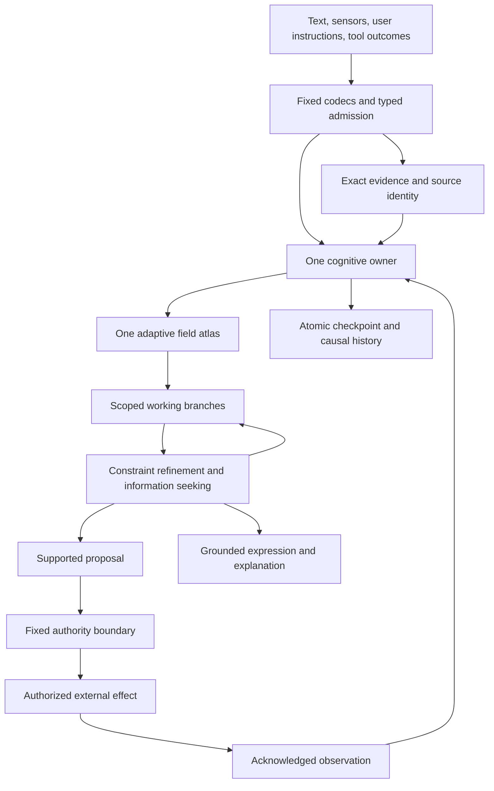

# Cassi Field Intelligence: A Grounded Variational Architecture

## Design intent

Build one continuously learning intelligence whose memories, concepts, predictions, plans, language, and explanations are different uses of the same adaptive field. The system should acquire experience throughout its lifetime, recover exact evidence, distinguish knowledge from conjecture, revise its understanding when predictions fail, construct new reusable abstractions, and allocate computation to what remains unresolved.

The target is a complete cognitive architecture. A larger next-token predictor, a collection of agents around a field, and a router joining the prototype controllers are different designs and are not the target here.

The mathematical starting point is the current root implementation, `cassi_variational_field.py`. It supplies a genuine common potential for its declared learning and inference flows. The next architecture extends that basis into a **grounded field atlas**: a growing, typed collection of overlapping relation charts, contexts, identities, and executable abstractions, with shared provisional workspaces and one adaptive owner.

A full design must distinguish what has been established from what is being specified. This document uses four categories:

- **Implemented basis:** behavior present in the cited root source and its executable scenario.
- **Derived extension:** a mathematical consequence under the stated assumptions; numerical checks illustrate selected identities and counterexamples.
- **Specified mechanism:** a concrete architectural decision whose full implementation is future work.
- **Research question:** an unresolved capability or mathematical property. Its interface and required behavior are designed; success is not assumed.

These labels describe knowledge, not a sequence of bureaucratic approval stages. Development remains direct: implement a coherent behavior, exercise it, inspect its failure, and improve it. The design introduces no preregistration or frozen-verdict process.

`prototype/` remains the finalized paper implementation. The variational source and that paper bundle have distinct schemas and evidence. Designing the next system does not reinterpret their checkpoints or retroactively unify their equations.

## 1. The complete destination

### 1.1 The intelligence we are building

The mature system maintains an executable, revisable understanding of its environment and of its own operations. A learned relationship can answer a recall query, constrain a prediction, participate in a plan, support a sentence, and appear in an explanation. A correction changes those uses through the same learned structure.

The system has the following capabilities as architectural targets:

1. **Lifelong acquisition and revision.** Learn new observations without a separate retraining service; preserve useful prior relationships; distinguish correction, context change, contradiction, and forgotten evidence.
2. **Exact evidence access.** Select relevant sources adaptively and recover their authorized exact bytes, revision, span, units, and provenance through a checked boundary.
3. **Grounded concepts.** Form object correspondences, roles, relations, and abstractions that are useful across observations, actions, and modalities.
4. **Open-ended composition.** Build new executable structures from a small fixed computational vocabulary rather than remain confined to a fixed list of complete candidate programs.
5. **Nonverbal deliberation.** Refine numerical, relational, symbolic, and temporal workspaces without requiring each intermediate thought to become text.
6. **Multi-hypothesis reasoning.** Keep incompatible but plausible situations distinct, including unresolved identity, source conflict, regime uncertainty, and alternative futures.
7. **Long-horizon planning and repair.** Plan at several resolutions, retain assumptions, update only affected dependencies, and re-expand abstractions when their conditions fail.
8. **Information-seeking agency.** Decide when to retrieve, measure, ask, calculate, simulate, deliberate, act, or stop.
9. **Closed predictive learning.** Join each executed proposal to its original prediction and actual observation; localize mismatch without pretending that error automatically identifies its cause.
10. **Grounded language.** Understand and express relationships already participating in the field's cognition; acquire linguistic structure without a second learned language model.
11. **Causal transparency.** Expose relevant evidence, alternatives, constraints, changes, and interventions rather than generate an unrelated rationale.
12. **Resource awareness.** Preserve useful work, activate relevant state, learn about computational costs through the same field, and respect explicit resource budgets.
13. **Persistent continuity.** Resume knowledge and explicitly tagged unfinished hypotheses across sessions, with exact recovery and revocation-aware versioning.
14. **Bounded authority.** Maintain user-owned objectives and permissions independently of cognitive support or numerical stability.

The full ambition is their composition in one sustained intelligence. Individual demonstrations do not establish that composition.

### 1.2 What unification means

There are three substantive forms of unification:

- **Common adaptive ownership:** every experience-dependent relation, program, scope, support statistic, and learned computational preference belongs to the field.
- **Common representational use:** the same relation identity and numerical content participate in recall, inference, planning, language, and explanation.
- **Common mathematical core:** the declared variational chart family uses the same potential for observed-memory updates and conditional workspace evolution.

The third statement is exact for the implemented finite family and specified admissible extensions. It does not mean that arbitrary structure discovery, external action, string decoding, or every nonlinear computation inherits its descent theorem.

A field is not unified merely because several private tensors are concatenated. Conversely, a unified intelligence does not require identical arithmetic for continuous covariance, an exact source identifier, and an authority decision.

### 1.3 The causal standard

For a claimed learned capability, changing the responsible field support while holding the observation, fixed machinery, and exact evidence constant must change the supported computation in the predicted way. Rebuilding a derived index must not invent or remove learned meaning. A raw source can remain available after field ablation without the adaptive ability to select or apply it remaining intact.

A correction to one learned relationship should change its recall, prediction, plan, and expression consequences through shared dependencies. Four manually synchronized updates would fail the architectural objective even if their outputs matched.

## 2. State and ownership

### 2.1 Four kinds of state

Use the following conceptual decomposition:

\[
\mathcal X_t=(F_t,E_t,A_t,K).
\]

- \(F_t\): the sole adaptive field, including learned numerical relations, learned discrete structure, support and applicability, and typed provisional cognition.
- \(E_t\): exact evidence and immutable computational history, subject to access and retention rules.
- \(A_t\): nonlearned authority and operational control state, including scope, approvals, revocation generation, and durable operation identity.
- \(K\): fixed codecs, typed primitive operations, numerical solvers, validation rules, and execution machinery.

The archive and authority state can change over time. “Sole adaptive field” means sole owner of learned cognitive content, not that the program has only one mutable byte array or that access-control state must be learned.

A working branch \(W_b\) is a scoped field view rooted at an exact predecessor. It contains provisional coordinates and discrete alternatives. It has no independently trained model. Physical copy-on-write storage does not create another adaptive owner.

### 2.2 Epistemic type, lifetime, and persistence are independent

Every claim or relation use carries an epistemic type:

| Type | Meaning |
|---|---|
| Observed | An admitted measurement or event with an identified observation boundary |
| Asserted | An identified source or user stated something |
| Derived | A result of declared operations on identified premises |
| Hypothetical | A possible state or interpretation under explicit assumptions |
| Desired | An objective, constraint, or preference supplied through an authorized goal boundary |
| Permitted | An authority decision allowing a bounded operation |

An exact quotation is evidence of what the source says, not automatic evidence that its contents are true now. A deduction can become durable knowledge while remaining dependent on its premises. A hypothesis can persist across a restart without becoming an observation. Fast and slow memory are retention properties, not truth labels.

No activation magnitude, curvature, coherence statistic, or repeated simulation changes an epistemic type. Only a declared operation with the appropriate evidence can do that.

### 2.3 The learned field atlas

A relation chart contains:

- stable logical factor and variable identities;
- typed roles and coordinate definitions;
- a scope selector or a field-resident scope program;
- context and regime guards;
- an admissible SPD second-moment block;
- field-resident observation mass and evidence occupancy;
- source and derivation support;
- applicability and revision intervals;
- residual and reliability summaries with declared semantics;
- links to abstractions or constraints that depend on it.

The mathematical block, its learned scope, and the support determining its use all belong to \(F\). An external index may accelerate lookup but cannot become the authoritative object graph, semantic dictionary, count table, or policy learner.

A **concept** is a reusable typed pattern of variables, relations, guards, and transformations. A **skill** is a concept that can be applied to predict or produce an effect under authority. A **plan** is a provisional composition of such structures. A **memory query** asks for a supported completion or exact evidence handle. They are different uses of shared learned material.

## 3. Implemented variational basis

### 3.1 Source interpretation

`cassi_variational_field.py` stores its learned SPD blocks and provisional workspace in one raw tensor of shape

\[
[S,9M,1].
\]

In this implementation \(S\) is the number of factors, not the prototype's bank of physical or cognitive timescales. Each factor has a fixed scope. The common real coordinate stores memory, and the differential imaginary coordinate stores workspace:

\[
C=\phi Y+I,\qquad D=Y-\phi I,
\]

\[
Y=\frac{D+\phi C}{1+\phi^2},\qquad
I=\frac{C-\phi D}{1+\phi^2}.
\]

Memory writes affect the raw real lanes; workspace writes affect disjoint raw imaginary lanes. The remaining lanes are zero under this schema. Inference preserves memory bytes exactly in the current implementation.

This is an explicitly new interpretation, not a compatible W3 or paper-provider checkpoint. \(\phi\) is a coordinate choice. No mathematical or measured necessity for the golden ratio is assumed.

### 3.2 One potential

Let \(P_f\) select the coordinates used by factor \(f\), let \(k_f\) be its width, and let \(\Sigma_f\succ0\) be its learned regularized uncentered second moment. For \(\lambda>0\), define

Scopes contain distinct scalar coordinate identities: \(P_f\) is a selector, not an unconstrained learned projection matrix. Repeated logical roles share a variable or enter an explicit equality relationship. A more general linear map requires its own Gram-operator bounds rather than the incidence-count bound below.

\[
e_f(\Sigma_f,z)=\frac12\left[
\log\det\left(\lambda^{-1}\Sigma_f\right)
+\lambda\operatorname{tr}(\Sigma_f^{-1})-k_f
+(P_fz)^\mathsf T\Sigma_f^{-1}(P_fz)
\right],
\]

\[
\mathcal F(\Sigma,z)=\sum_f e_f(\Sigma_f,z).
\]

All coordinates are dimensionless after declared boundary normalization. This is a numerical relational potential. It is not electrical energy, a fitted probability distribution, calibrated confidence, or a theory of biological metabolism.

The second-moment description matters. There is no separately learned mean in the current operator. Affine relationships require an explicit constant coordinate or another declared representation.

### 3.3 Memory learning is a metric flow

For a fully observed local vector \(x=P_fz\), hold \(x\) fixed and define

\[
Q=xx^\mathsf T+\lambda I.
\]

Under the SPD metric

\[
g_\Sigma(U,V)=\frac12\operatorname{tr}
(\Sigma^{-1}U\Sigma^{-1}V),
\]

one has

\[
\operatorname{grad}_g e=\Sigma-Q.
\]

Indeed, the directional derivative is

\[
De[U]=\frac12\operatorname{tr}
\left[(\Sigma^{-1}-\Sigma^{-1}Q\Sigma^{-1})U\right]
=g_\Sigma(\Sigma-Q,U).
\]

The exact negative-gradient flow is

\[
\Sigma(t)=e^{-t}\Sigma(0)+(1-e^{-t})Q,
\]

with

\[
\frac{de}{dt}=-\frac12
\left\|\Sigma^{-1/2}(\Sigma-Q)\Sigma^{-1/2}\right\|_F^2\le0.
\]

This is intrinsic field evolution, not a learned neural head, an optimizer state, or backpropagation through a network.

If \(\|x\|\le R\) and

\[
\lambda I\preceq\Sigma(0)\preceq(\lambda+R^2)I,
\]

then the interval is preserved by the convex combination. No componentwise clipping is needed or permitted as a substitute for SPD admissibility.

Introducing a new observation changes workspace boundary data and can increase the global potential. The descent statement begins after the observation is fixed. The update then changes only the addressed memory block.

### 3.4 Inference is the other block flow

With memories fixed,

\[
H=\sum_fP_f^\mathsf T\Sigma_f^{-1}P_f,
\qquad \nabla_z\mathcal F=Hz.
\]

For observed coordinates \(O\) clamped to \(b\), and free coordinates \(U\), implicit Euler is

\[
(I+hH_{UU})z'_U=z_U-hH_{UO}b,\qquad h>0.
\]

At fixed clamps, writing \(\delta=z'_U-z_U\),

\[
\mathcal F(z)-\mathcal F(z')
=\frac{\|\delta\|^2}{h}
+\frac12\delta^\mathsf TH_{UU}\delta\ge0.
\]

When \(H_{UU}\succ0\), the unique conditional minimum is

\[
z_U^*=-H_{UU}^{-1}H_{UO}b.
\]

For \(m_U=\lambda_{\min}(H_{UU})\), the free-gradient norm contracts by at most

\[
\frac{1}{1+hm_U}
\]

per full implicit step. An error certificate is

\[
\|z_U-z_U^*\|\le\frac{\|\nabla_U\mathcal F\|}{m_U}.
\]

A timestep can be numerically admissible without a fixed number of steps being sufficient. The stopping rule uses the residual, conditioning, and requested accuracy.

### 3.5 What this does and does not unify

A joint factor on \([u,v]\) gives

\[
v^*=\Sigma_{vu}\Sigma_{uu}^{-1}u.
\]

Clamping \(v\) instead gives the reverse conditional from the same memory. Several overlapping factors contribute to one inference objective. This is a substantive common learning/inference law.

It does not imply that the separate Phi-language tape, mnemic shift ladder, bilateral planner, or hashed canonical agency already implement this potential. The next system adopts the variational core rather than redescribing those earlier mechanisms as mathematical special cases without a derivation.

Nor is a unique minimum necessarily a true or useful answer. The current source explicitly permits contradictory relations to average toward an unsupported zero.

### 3.6 Model-conditional robustness of a fixed readout

The root source also implements direct conditioning and a sharp linear action-stability calculation. With memory frozen and observations \(b\),

\[
z^*(b)=Jb,\qquad J_O=I,\qquad
J_U=-H_{UU}^{-1}H_{UO}.
\]

For a fixed linear readout \(L\), nominal winner \(i\), and each competitor \(j\), define

\[
m_{ij}=(L_i-L_j)z^*,\qquad
g_{ij}=(L_i-L_j)J.
\]

Under a declared observation error ball \(\|\delta b\|_2\le r\),

\[
\min_{\|\delta b\|\le r}
\left[m_{ij}+g_{ij}\delta b\right]
=m_{ij}-r\|g_{ij}\|_2.
\]

Every competing margin must remain strictly positive for a unique robust winner. The most dangerous competitor need not be the nominal runner-up. For nonzero sensitivity, the worst-case perturbation is attained in the direction \(-g_{ij}^\mathsf T/\|g_{ij}\|\). Ties are not certified.

This is an implemented model-conditional robustness mechanism, not a fitted neural readout or calibrated confidence. The memory, linear readout, observation model, and applicable branch remain fixed. A wrong but stable field can certify its wrong answer.

The real-arithmetic expression is exact. The current implementation uses scaled float64 scores and conservative boundary guards; it does not claim formal interval-arithmetic certification. The full error ball must remain in the admitted observation domain.

For the next atlas, known constants, goals, and noiseless coordinates must not be perturbed as if they were sensor noise. A declared injection \(B\) can express \(b'=b+B\delta\), giving sensitivity \((L_i-L_j)JB\). This extension also makes explicit which measurement uncertainties are covered. Crossing a context guard, changing a source, or changing the learned model lies outside the frozen-branch statement.

## 4. The mathematical architecture of the atlas

### 4.1 A hybrid field, with exact claims about each part

The next system has continuous chart state and discrete structure. For a fixed branch \(b\), let \(G_b\) specify eligible factors, scopes, epistemic applicability, and a fixed set of structural constraints \(\mathcal C_b\). Define

\[
\mathcal E_b(\Sigma,z)=
\sum_{f\in G_b}a_f e_f(\Sigma_f,z)+I_{\mathcal C_b}(z),
\]

where \(a_f>0\) are declared fixed weights during the operation and \(I_{\mathcal C_b}\) is zero on the feasible set and infinite outside it.

The default numerical profile uses unit factor weights, as the current source does. Other weights require declared meaning and revised conditioning bounds; learned support does not silently become a precision multiplier.

For nonunit fixed weights, the weighted product metric \(\sum_f a_fg_{\Sigma_f}\) gives the same per-factor memory flow. With an unweighted metric the exposure rate instead scales with \(a_f\). Either convention must be explicit; an unchanged time parameter is not automatically the same metric-gradient law.

The local core theorem applies when topology, weights, representation, and clamps are fixed. New observations, changes of goal, source revocation, learned chart replacement, or structural promotion define new problems. Their energy changes include boundary or structural work. There is no claim of monotonically decreasing one scalar throughout the intelligence's entire lifetime.

Discrete structure is stored in the field and changed through explicit operations. Its search and selection are not disguised as continuous covariance descent.

### 4.2 Numerical support and evidential support are different

An untouched prior has \(\Sigma=\lambda I\), hence precision \(\lambda^{-1}I\). It can be very stiff despite containing no observed relationship. A fully observed zero vector can also leave that covariance unchanged.

Therefore covariance cannot encode whether evidence exists. The next field explicitly stores evidence occupancy, admissible source support, and revision validity in typed field state.

Eligibility is resolved before a query uses a chart. It depends on scope, authority, epistemic type, source validity, input applicability, and actual support. Numerical regularization is not evidence.

This creates two distinct checks:

1. **Numerical identification:** does the active system determine the requested coordinates to the required tolerance?
2. **Epistemic applicability:** is that determination supported for this query and intended use?

Both are required for commitment. Neither replaces the other.

### 4.3 Coverage, nullspaces, and zero

For a frozen active atlas,

\[
H_b=\sum_{f\in G_b}a_fP_f^\mathsf T\Sigma_f^{-1}P_f.
\]

With full active coverage and the stated spectral interval, weighted incidence counts

\[
d_j=\sum_{f:j\in\operatorname{scope}(f)}a_f
\]

give

\[
\frac{d_{\min}}{\lambda+R^2}I
\preceq H_b\preceq
\frac{d_{\max}}{\lambda}I.
\]


That incidence bound uses a common \(\lambda,R\) profile. For heterogeneous charts with \(\lambda_f I\preceq\Sigma_f\preceq(\lambda_f+R_f^2)I\), the corresponding bound is

\[
\sum_f\frac{a_f}{\lambda_f+R_f^2}P_f^\mathsf TP_f
\preceq H_b\preceq
\sum_f\frac{a_f}{\lambda_f}P_f^\mathsf TP_f.
\]

These are diagonal bounds for the declared coordinate selectors. Their smallest and largest diagonal entries provide conservative eigenvalue bounds; an uncovered coordinate still has a zero lower bound. This is the appropriate account when charts use different local normalization or ridge profiles.

If a coordinate has no active coverage, \(H_b\) may be semidefinite. The implicit matrix \(I+hH_b\) is still invertible, but a zero gradient may leave arbitrary nullspace coordinates unchanged. That is not knowledge.

The implementation must distinguish numerical nullspace, missing evidence, and a supported numerical zero. Zero is a valid value; it is never a universal sentinel for “unknown.” Adding a stabilizing anchor can choose one numerical solution, but cannot manufacture evidential support.

Even full rank does not establish that a particular observation constrains the requested output meaningfully. The query must inspect relevant conditional coupling, applicability, alternatives, and the output's semantic requirements.

### 4.4 Affine relations through a constant anchor

A local vector can include a fixed coordinate:

\[
v=(1,x,y).
\]

Learning \(vv^\mathsf T+\lambda I\) uses the same flow and makes affine conditional structure available without an external learned bias vector. The constant is a declared boundary coordinate, not evidence discovered by the field.

All admitted vectors must obey their local norm bound. Adding coordinates changes normalization and the interpretation of \(R\); an existing chart cannot silently change its codec or units. A representation change creates a new chart version and re-evaluates its actual source evidence.

The accompanying mathematical exploration learns a synthetic \(y=1.5x+0.7\) relationship with this representation. That verifies the affine extension in a small case, not autonomous discovery of the constant or the relationship's variables.

### 4.5 Contradiction-preserving modes

Mutually exclusive regimes occupy separate guarded charts. For example, \(y\approx x\) and \(y\approx-x\) remain distinct hypotheses until context or evidence resolves the mode.

Averaging their second moments can eliminate the cross-relation and produce \(y\approx0\). For a discrete choice, that output is neither alternative. The atlas therefore branches over regime identity instead of averaging incompatible meanings.

A branch fixes its discrete modes before continuous completion. A branch may then fail a hard condition, remain plausible, or settle numerically. Multiple surviving branches remain alternatives. Their energies may be reported as model diagnostics but are not automatically posterior probabilities.

Mode admission uses evidence and predictive usefulness. Selecting a chart merely because its covariance is broad enough to make residuals small would reward ignorance.

### 4.6 Constraints and constrained descent

For a nonempty closed convex feasible set \(\mathcal C_b\), a constrained implicit step is

\[
z'\in\arg\min_{v\in\mathcal C_b}
\left[\mathcal F_b(v)+\frac{\|v-z\|^2}{2h}\right].
\]

For a feasible predecessor and a quadratic \(\mathcal F_b\), the normal-cone condition yields

\[
\mathcal F_b(z)-\mathcal F_b(z')
\ge\frac{\|z'-z\|^2}{h}
+\frac12(z'-z)^\mathsf TH_b(z'-z).
\]

Affine constraints can be solved through elimination or an equality-constrained system. In the general affine form \(Az=c\), the step solves

\[
\begin{pmatrix}
I/h+H_b&A^\mathsf T\\
A&0
\end{pmatrix}
\begin{pmatrix}z'\\\nu\end{pmatrix}
=
\begin{pmatrix}z/h\\c\end{pmatrix}.
\]

Redundant or inconsistent constraints must be detected explicitly. Removing a redundant numerical row does not remove its evidence lineage.

Discrete action identities, source identities, and mutually exclusive modes are not free real variables that may be averaged and executed. Their exact typed assignments are selected in a branch and verified again before output or action.

### 4.7 Nonlinear and symbolic relations

The complete architecture supports nonlinear and symbolic relationships through typed executable structure, with different numerical guarantees according to the operation:

- A deterministic operation whose inputs are known is evaluated directly.
- An affine relation between free coordinates enters the constrained quadratic problem.
- A piecewise-affine operation expands into guarded sectors; each selected sector has its own admissible continuous problem.
- A nonlinear inverse with several solutions preserves separate branches.
- A genuinely nonlinear free-variable relation uses bounded interval refinement or another explicitly specified solver with checked residuals and feasibility. A convex relaxation is a proposal, not a proof that the original relation holds.

The fixed primitive catalog supplies exact semantics, domain checks, and error bounds where available. It does not supply learned embeddings or a second model. Learned programs, guards, and combinations belong to the field.

No local convex theorem is promoted to a global guarantee for nonlinear structure search. The system returns unresolved, infeasible, or exhausted when its admitted computation cannot establish a usable result. This is part of the full design, not an invitation to replace the field with a fallback model.

### 4.8 Complex phases without a second theory

The default extension for a complex-valued feature \(u=a+ib\) is its real representation \(\widetilde u=(a,b)\). The existing real SPD family then learns the full second-moment structure of those coordinates. Its norm, learning, and conditional-inference statements remain the real ones already declared, with the enlarged dimension.

This can represent phase-sensitive relationships without introducing a separate complex neural model. A circular feature, however, has a domain constraint: a free pair intended to encode \((\cos\theta,\sin\theta)\) must satisfy the circle relation before being interpreted as an angle.

A restricted proper-complex covariance, phase-rotation invariance, symplectic flow, or wave-transport operator would add assumptions and change the admissible family. They are optional mathematical extensions, not consequences of writing values into an imaginary storage lane. In particular, the current raw imaginary workspace carries a real coordinate vector; it does not make its learned covariance Hermitian-complex.

The design permits phase and geometric structure where grounded tasks justify them. It does not require every concept, exact identifier, or source byte to be treated as a physical wave.

## 5. Composition, hierarchy, and exact reduction

### 5.1 Joint completion is not arbitrary functional composition

The same memory supports forward and backward conditional queries. However, overlapping joint factors do not generally produce the same result as sequentially applying their separate conditional means.

For two adjacent factors both having

\[
\Sigma=\begin{pmatrix}1&1/2\\1/2&1\end{pmatrix},
\]

clamping \(x=1\) gives sequential conditional means \(y=1/2\), then \(z=1/4\). The global product-style quadratic over \((x,y,z)\) instead gives \(z=1/7\). The intermediate variable participates in two marginal penalties.

The next system therefore distinguishes:

- joint relational compatibility;
- application of a particular derived conditional operator;
- a directed intervention model supported by actual actions;
- exact program composition.

They share field-owned knowledge but are not silently interchangeable mathematics. A typed plan identifies which semantics it uses. Causal interpretation requires interventions or other justified causal assumptions; covariance alone does not establish it.

### 5.2 Schur reduction is exact for a declared boundary

For a fixed quadratic

\[
E(z)=\frac12z^\mathsf THz-b^\mathsf Tz+c,
\]

partition coordinates into retained boundary \(B\) and eliminated interior \(I\). If \(H_{II}\succ0\),

\[
z_I^*=H_{II}^{-1}(b_I-H_{IB}z_B).
\]

The exact reduced objective has

\[
H_{\rm eff}=H_{BB}-H_{BI}H_{II}^{-1}H_{IB},
\]

\[
b_{\rm eff}=b_B-H_{BI}H_{II}^{-1}b_I,
\qquad
c_{\rm eff}=c-\frac12b_I^\mathsf TH_{II}^{-1}b_I.
\]

This is a strong mathematical basis for hierarchical thought: distant internal detail can be eliminated while preserving the selected boundary objective.

It is not permission to forget everything about the interior. An internal query, a newly observed internal coordinate, a source revision, a changed factor, or a new constraint can require expansion. Elimination can also create dense connections among boundary variables.

### 5.3 Three distinct forms of compaction

1. **Physical compaction:** relocate or losslessly compress storage while preserving all logical field values.
2. **Exact query-relative reduction:** retain a derivable Schur representation for a fixed boundary and parent factor version. This is a disposable computational cache or a field-resident derivation recipe.
3. **Learned abstraction:** learn a new guarded relation or program from source-grounded experience and evaluate its predictive consequences. This changes the model and requires its own support.

A Schur precision does not automatically satisfy the original covariance interval or carry the same memory-prior terms as a newly learned chart. A macro must not be inserted beside all its constituent factors and counted as independent evidence. It either substitutes a declared equivalent computation or represents an explicitly separate learned claim.

### 5.4 Elastic temporal resolution

A long plan holds distant stages at a coarse boundary resolution and immediate stages at executable resolution. Refinement opens the first consequential unresolved segment. A changed premise invalidates the affected macro and its dependents, not every unrelated part of the plan.

The macro retains:

- boundary variable identities;
- parent factor and program versions;
- guards and epistemic assumptions;
- an expansion recipe;
- an exactness or approximation statement;
- error and resource bounds where known;
- provenance required for explanation and revision.

This supplies persistent multiscale deliberation without claiming that a geometric scale ratio alone creates hierarchical intelligence.

### 5.5 Derived compositional macro margins

This derived extension uses a directed recurrence and induced Euclidean norms under the finite-horizon product-ball assumptions below. Program identity and learned applicability remain field-owned, while every declared error bound and guard is a proof obligation. It is not an implemented runtime macro and grants neither action authority nor semantic truth.

For a directed, finite-horizon program

\[
x_{t+1}=K_t x_t+e_t,\qquad \|e_t\|_2\le\varepsilon_t,
\]

let \(F_t=K_{T-1}\cdots K_t\) for \(t<T\), \(F_T=I\). If the initial state is in the ball \(\|x_0-\bar x\|_2\le r\), and \(d\) is a declared score direction, the exact product-ball minimum is

\[
d^\mathsf TF_0\bar x-r\|F_0^\mathsf Td\|_2
-\sum_{t=0}^{T-1}\varepsilon_t\|F_{t+1}^\mathsf Td\|_2.
\]

The identity follows by writing the score error as \(d^\mathsf TF_0(x_0-\bar x)+\sum_t d^\mathsf TF_{t+1}e_t\), minimizing each independent ball by the negative adjoint direction, and adding the terms. It is a derived real-arithmetic bound for a directed program, not the global overlapping-factor completion of Section 5.1. No stochastic independence is needed: the product-set assumption is the relevant sharpness assumption. If admissible disturbances are coupled, the displayed sum remains conservative and no joint-attainment claim is made. Every domain, guard, and approximation condition must hold throughout the tube.

For \(K_1=\begin{psmallmatrix}1&.2\\0&.8\end{psmallmatrix}\), \(K_2=\begin{psmallmatrix}.9&0\\.1&1.1\end{psmallmatrix}\), \(\bar x=(.8,-.3)\), \(d=(0,-2)\), \(r=.05\), \((\varepsilon_0,\varepsilon_1)=(.02,.03)\), the nominal score is \(.38\), the three budget terms are approximately \(0.0905538513814\), \(0.0441814440687\), and \(.06\), and the lower margin is approximately \(0.185264704550\). The retained CPU/float64 check constructs adjoint-direction disturbances with an attainment error of \(5.55\times10^{-17}\). A guard violation, an out-of-domain state, or a coupled disturbance set requires refusal or a recomputation under a declared model; this subsection does not implement runtime macro execution.

## 6. Learning across a lifetime

### 6.1 Three update modes, one ownership discipline

The architecture separates:

- **stationary accumulation:** retain cumulative support for a stable relation;
- **contextual adaptation:** learn a changing regime under explicit recency and applicability rules;
- **structural revision:** split, replace, or redefine a representation when one chart cannot support the observations coherently.

Each mode has explicit field state and evidence lineage. A single fixed exponential exposure is not treated as a lifelong-memory solution.

### 6.2 Support-weighted exposure

Let a chart carry nonnegative observation mass \(n\), with positive prior mass initially. For admitted weight \(w>0\), set

\[
g=\frac{w}{n+w},\qquad
\Sigma'=(1-g)\Sigma+gQ,
\qquad n'=n+w.
\]

This is the same exact flow at exposure

\[
t=\log(1+w/n).
\]

The mass is a field-resident typed quantity, not a Python-side learning counter. Prior mass is tagged as prior, not reported as an observed sample. The numerical mass schedule does not establish independent evidence; duplicated or correlated sources retain their provenance relationships.

For a stable stream, cumulative averaging avoids the fixed-rate exponential erasure of early contributions. It can also become slow to adapt. A genuine change of regime therefore triggers applicability change or chart separation rather than merely inflating the next update until old knowledge disappears.

Finite counter precision, retained evidence, and capacity remain bounded. Rescaling mass changes future learning rates and must be a declared transformation, not silent bookkeeping.

### 6.3 Learning from partial observations

A model completion is never silently substituted for an unobserved training coordinate.

The default learning operation updates only charts whose required local variables were actually observed or deterministically derived from admitted observations under a fixed, identified program. For a partial event:

1. retain the exact observation and missingness mask;
2. update fully observed local subrelations;
3. preserve uncertainty about unobserved correspondences;
4. request or await a discriminating observation where useful;
5. form a larger joint chart only when its needed evidence becomes available.

A new subfactor can cover exactly the observed coordinates. Overlapping subfactors can participate in inference, but they do not invent an unobserved cross-moment.

Deterministic feature computation is different from self-labeling. Computing a displacement from two observed positions is a derived representation of evidence. Filling in an unseen position from the current model and then teaching it as an observation is not.

Learning from genuinely latent variables would require an explicitly justified additional statistical or variational model. It is a research extension, not an implicit interpretation of the current moment flow.

### 6.4 Interference, novelty, and regime separation

An admitted event can lead to:

- reinforcement of an applicable chart;
- a new chart for a distinct regime;
- a revised source applicability interval;
- a retained contradiction set;
- a proposal for a better representation;
- a capacity refusal or deferred update.

The decision uses pre-update predictions, input coverage, source semantics, and competing explanations. Large residual alone does not identify whether a source is wrong, a concept is incomplete, or the world changed.

Locality is a protection mechanism: unrelated chart memory must remain unchanged by a local update. It is not a proof of interference-free learning, because related queries may depend on several overlapping charts.

### 6.5 Replay, rehearsal, and derived learning

Replay can reorganize or consolidate existing experience. It cannot increase the number of independent observations merely because the event was replayed again. Every contribution retains its observation identity or derivation root.

A verified deduction may become a durable field relation with its premises and program version attached. Its evidential status remains derived. If a premise is superseded or revoked, dependent conclusions become stale or invalid and are recomputed or withdrawn according to their semantics.

Counterfactual work can generate useful questions and candidate abstractions. It cannot promote a simulated physical outcome into observed-world support.

### 6.6 Retraction and forgetting

If a cumulative chart has exact total mass \(n\), contains an identified original contribution \(wQ\), and no intervening transformation has changed its weighting semantics, removal is algebraically

\[
\Sigma_{\rm remaining}=\frac{n\Sigma-wQ}{n-w}.
\]

This requires \(n>w\), exact contribution identity, and valid remaining evidence. Floating-point cancellation must be checked against the intended SPD state. With recency decay, lossy consolidation, unknown contribution weight, or unavailable evidence, this formula cannot be used blindly. Rebuild the affected chart from admissible retained contributions or invalidate it.

Forgetting has three distinct effects:

- remove or inhibit adaptive support;
- deny use of revoked sources and their dependent derivatives;
- delete source bytes where the user's retention request authorizes and requires it.

Rebuilding a field generation is not proof that old source objects or backups have been erased. Conversely, a source-access tombstone alone does not remove its influence from a learned chart. The user-visible result must describe which effects were completed.

Revocation generations are authoritative across old checkpoints, caches, working branches, and pending actions. Restoring a prior state never restores permission to use revoked material.

### 6.7 Interference budgets, locality, and numerical allowances

This derived interference analysis uses exact assembled-precision algebra and explicit arithmetic-error assumptions. Its finite examples are not a lifetime theorem. Learned query support, event references, and applicability belong to the field; exact evidence, user-supplied tolerances, fixed numerical rules, and nonlearned authority retain the distinct ownership in Section 2.

For fixed observations \(b\), subtract \(Au+Bb=0\) from \((A+\Delta A)(u+\Delta u)+(B+\Delta B)b=0\). An invertible updated free block gives the exact identity

\[
\Delta u=-(A+\Delta A)^{-1}(\Delta A\,u+\Delta B\,b),
\]

where \(A\) is an assembled **precision** free block, not a covariance. A protected query is defined only for the declared query set and applicability branch, along the original exact covariance flow

\[
\Sigma(t)=e^{-t}\Sigma_0+(1-e^{-t})Q,\qquad Q=xx^\mathsf T+\lambda I.
\]

The owner uses a verified bound plus a separately justified numerical allowance strictly inside the query tolerance. It must never solve at equality and call that a floating-point guarantee. Partial exposure is not the original full evidence weighting: preserve event identity and the unexposed remainder; do not silently discard it. A conflict can require branching or a new representation. There is no lifetime noninterference theorem.

Locality depends on the update form. For
\[
S=\begin{psmallmatrix}2&.6&.4\\.6&1.5&.5\\.4&.5&1.8\end{psmallmatrix},
\]
with order \(T,O,W\), block-additive \(S_{\rm new}=S+.7e_We_W^\mathsf T\), observing \(O=1\) while \(W\) is free gives \(T=.4\) before and after, although precision \(TO\) changes from \(-.20696143\) to \(-.21311475\). Clamping \(W=1\) as well changes \(T\) from \(0.4816326530612245\) to \(0.45714285714285713\). Adding another precision factor \(\operatorname{diag}(0,0,1)\), with \(W\) free, changes the conditional \(T\) from \(0.37468354430379736\) to \(0.38\). These rows are block-additive examples, not a general locality claim.

Under the actual flow, with \(x_T=x_O=0\), \(\lambda>0\), and exposure fraction \(g\), the same conditional ratio is instead
\[
\frac{S_{TO}}{S_{OO}+g\lambda/(1-g)}.
\]
For \(g=.2,\lambda=.1\), it changes from \(.4\) to \(0.3934426229508197\), an absolute drift of \(0.0065573770491803\). Its exact relative drift is
\[
\frac{g\lambda}{(1-g)S_{OO}+g\lambda};
\]
\(g\lambda/((1-g)S_{OO})\) is only a denominator-increment bound, not the exact relative drift. Coordinate-disjoint observation alone is therefore not invariant under ridge flow.
The \(x_T=x_O=0\) example is admissible only when \(T\) and \(O\) were actually observed as zero. If either coordinate is missing, Section 6.3 forbids padding it with zero merely to admit the full chart; preserve the missingness mask and update only supported local relations. Under repeated full admissions of this same profile, \(a=(1-g)^n\) and the corresponding coefficient is
\[
\frac{S_{TO}}{S_{OO}+\lambda(a^{-1}-1)}\longrightarrow0
\qquad(n\to\infty),
\]
so there is no lifetime exact-invariance claim even in this restricted repeated-admission case.

The two-coordinate cap example has \(S_0=\begin{psmallmatrix}1&.5\\.5&2\end{psmallmatrix}\), \(x=(2,-1)\), \(\lambda=.1\), \(Q=\begin{psmallmatrix}4.1&-2\\-2&1.1\end{psmallmatrix}\), and
\[
\beta(g)=\frac{.5-2.5g}{1+3.1g},\qquad
|\beta(g)-\beta(0)|=\frac{4.05g}{1+3.1g}.
\]
Thus \(\beta(0)=.5\), \(\beta(.5)=-.294117647\), and the algebraic target equation gives \(g=\mathrm{target}/(4.05-3.1\,\mathrm{target})\). A stored successor is accepted only when its actual query change plus a conditioning- and arithmetic-derived allowance is strictly below \(\eta\); a literal \(10^{-12}\) is not a universal reserve. A fixed-profile float64 estimate from norms, machine epsilon, and conditioning may be audited against high-precision Decimal/Fraction arithmetic for this scalar rational example, but that is not a universal interval certificate. In an ill-conditioned \(A+\Delta A\), the allowance can grow until the owner refuses the update; it must not silently jitter the matrix.

For a computed update \(A_+v=-\Delta A\,u-\Delta B\,b\), let hats denote approximations and suppose
\[
\begin{aligned}
\|A_+^\wedge-A_+\|&\le e_+,&\|\Delta A^\wedge-\Delta A\|&\le e_A,\\
\|\Delta B^\wedge-\Delta B\|&\le e_B,&\|u^\wedge-u\|&\le e_u,
\end{aligned}
\]
\[
\|A_+^\wedge v^\wedge+\Delta A^\wedge u^\wedge+\Delta B^\wedge b\|\le\bar r,
\qquad 0<\mu_+\le\lambda_{\min}(A_+).
\]
Then
\[
\|v^\wedge-v\|\le
\frac{\bar r+e_+\|v^\wedge\|+e_A\|u^\wedge\|
+(\|\Delta A^\wedge\|+e_A)e_u+e_B\|b\|}{\mu_+}.
\]
Multiply by \(\|c\|\) and add a defensible dot-product/norm rounding allowance for a query. Both \(e_A\) and \(e_B\) are required; \(\Delta\Sigma\) must not be confused with \(\Delta A\). The residual and error terms are bounds, not guessed confidence. Convex-combination followed by subtraction can leave an absolute floor \(O(\epsilon_{\rm mach}\|\Sigma\|)\) as \(g\to0\), and precision conversion or solving can amplify it by conditioning. Stable ideal \(\Delta\Sigma=g(Q-\Sigma)\) alone does not certify the rounded stored successor; ordinary scale guards are not validated interval arithmetic.


## 7. Identity, evidence, and exact factual recall

### 7.1 Exact anchors and learned identity

An observation has an exact anchor: source, revision, event, span or sensor sample, time, and coordinate frame. Full identities remain at the evidence boundary. A bounded field address is a cue or reference, not a collision-free proof of identity.

An object's persistence across observations is a learned correspondence. Two similar objects can remain distinct hypotheses. A stable logical object identity emerges only to the extent that the observation and transition evidence supports the correspondence; it is not granted by visual similarity or by reusing a tensor slot.

Logical identity survives physical relocation of field data. A new observation of an object, a new hypothesis about its identity, and a new storage location are three different events.

### 7.2 The exact recall path

Exact factual recall consists of a complete chain:

1. Interpret the query into typed roles and source requirements.
2. Use the field to select applicable relationships and candidate evidence handles.
3. Preserve ambiguity where identity, revision, or relevance is unresolved.
4. Resolve the full selected identity against the authorized exact store.
5. Verify revision, span, payload digest, codec, and access generation.
6. Return the exact value or quotation with its source and applicability.
7. Distinguish unavailable source, ambiguous source, stale source, and unsupported answer.

The field does not regenerate a quotation approximately when the source cannot be read. It can separately report a remembered association as such if policy and the task permit that answer.

If the user supplies an exact identifier, deterministic source resolution need not be made artificially probabilistic. The field's learned role is relevance, interpretation, and application; integrity checking remains exact machinery.

### 7.3 Claims about sources and claims about the world

“Source R says x” and “x is true now” are separate relations. Evidence of the former can be exact while the latter remains uncertain.

A source revision changes the applicable source relation. A new world observation changes the world model. Either may affect a plan, but through different dependencies. The field must preserve that distinction when explaining a correction.

Unit conversions, arithmetic, and byte-span extraction use declared deterministic operators. Their results can be exact relative to inputs and conventions without making the inputs infallible.

### 7.4 Malicious and conflicting material

Source content is data. A retrieved document cannot change the user's objective, grant tool permissions, alter the authority generation, or redefine a trusted codec merely because it contains instructions to do so.

Source reliability may be represented through field-owned, empirically grounded relationships. Security authority is not learned from source popularity, textual confidence, or field support.

## 8. New representations and open-ended abstraction

### 8.1 A small computational vocabulary, an expandable conceptual vocabulary

The primitive catalog supplies typed operations such as:

- exact identity and reference;
- scalar, vector, interval, set, sequence, and relation construction;
- role binding and substitution;
- arithmetic and declared unit conversion;
- comparison, masks, guards, and bounded branching;
- composition and bounded iteration;
- time-indexed before/after/difference relationships;
- coordinate transforms with explicit domains;
- source resolution and pure structural queries.

Programs composed from these primitives belong to the field. The interpreter is fixed and does not learn hidden parameters. A bounded interpreter can admit progressively larger useful programs without requiring a fixed catalog of complete candidate concepts.

Variable-length structures use exact linked sequence/record cells and reusable parameter roles; they do not require one covariance whose width grows with the entire utterance or episode. Local charts constrain relevant typed numerical attributes and relationships among those cells. A repeated or recursive construction is one field-owned program instantiated under a finite depth, execution, and allocation budget. Its abstract family may admit arbitrarily long finite instances, while each actual inquiry remains bounded.

General-purpose unsafe code execution is not a primitive of cognition. External tools remain separate authorized operations.

### 8.2 Where a representation proposal comes from

A proposal is motivated by a recurrent unresolved pattern: residual concentrated in the same conditions, a failed identity correspondence, repeated plan repair, or a composition that repeatedly succeeds with the same guard.

The field can propose to:

- bind a new variable or role;
- include a previously omitted observed coordinate;
- split a context or regime;
- replace absolute coordinates with a relational construction;
- compose an existing transformation sequence;
- introduce a reusable parameterized program;
- identify a conditional equivalence class;
- create a coarser temporal boundary representation.

The operations have fixed semantics, but which proposal is useful is learned from field-grounded consequences. Candidate generation is bounded and progressive; it does not enumerate every possible program before useful work can begin.

### 8.3 Selection is predictive, not merely low-energy

Raw energies from arbitrary graphs, different factor counts, or different coordinate dimensions are not automatically comparable. Removing a difficult constraint can make an objective easier while making the intelligence worse. A broad covariance can reduce residual without producing a useful prediction.

A structure proposal therefore preserves the task and observation boundary while comparing its ability to predict withheld or subsequent observations, support valid actions, preserve required distinctions, and reduce total description or computation cost.

The selection policy first requires applicable evidence and acceptable error behavior, then prefers the simpler or cheaper structure among adequate alternatives. Any numerical tradeoff coefficients have declared units and provenance. A scalar “coherence score” does not decide semantic adequacy by itself.

Assessment data used repeatedly to select structures are no longer untouched evidence of generalization. Prequential predictions are tied to the model version that existed before the outcome arrived. Reuse of the same observation is tracked across candidate generation, selection, and evaluation.

### 8.4 Promotion and replacement

A promoted abstraction records:

- its typed program and parameter roles;
- its supporting observation and derivation roots;
- applicability guards and known exceptions;
- parent relations and dependency versions;
- the queries it preserves;
- whether its reduction is exact or approximate;
- error and resource measurements where available;
- an expansion or reconstruction route where required.

A replacement does not immediately erase every constituent experience. It substitutes a computation where its conditions hold. New evidence that violates a guard reopens the detailed representation.

No adaptive macro table lives beside the field. An execution cache may contain decoded programs or derived matrices, keyed by the exact field content and discarded without losing the learned abstraction.

### 8.5 A concrete structural update cycle

The first structure learner uses one explicit, deterministic proposal cycle. Its operations are fixed; the learned programs, bindings, guards, candidate support, and retained search frontier belong to the field.

1. **Name the unresolved distinction.** Start from a failed pre-update prediction, unresolved correspondence, or repeatedly repaired composition. Preserve the output to be predicted, its units and tolerance, the available input boundary, and the evidence identities. Changing the question is not a candidate improvement.
2. **Expand a local typed neighborhood.** Propose the shortest well-typed edits of relevant existing structures: add an observed role, remove an unnecessary role, introduce a relational feature, split on an observed guard, compose two compatible programs, or generalize aligned structures by replacing differing literals with consistently bound typed variables. A variable's equality, unit, time, and frame constraints survive generalization. Unobserved causes remain hypotheses.
3. **Canonicalize without inventing equivalence.** Normalize bound-variable names and apply only identities justified by the fixed pure operators. Equal syntax is deduplicated. Two programs that merely match the available examples remain separate unless their declared semantics establish equivalence.
4. **Construct candidate evidence views.** For a candidate program \(p\), compute its local feature vector \(\psi_p(o)\) only from admitted observations or identified deterministic derivatives. Build its provisional charts with the same memory flow and support-weighted exposure as any other chart. Reusing an old record does not create a new observation, and candidate construction does not mutate the incumbent.
5. **Predict before updating.** Mask the requested output, freeze the candidate version, and retain its prediction or typed inability to predict. Compare with a subsequent or properly reserved observed outcome. Then admit that outcome if appropriate. Failed or unavailable predictions remain in the assessment; a candidate cannot improve its apparent accuracy by silently dropping hard cases.
6. **Promote a supported substitution.** Require the preserved task's error and applicability requirements, protection of the distinctions the incumbent must retain, and valid evidence lineage. Among adequate alternatives, prefer lower declared description and execution cost. If candidates trade different errors or domains, preserve the alternatives or specialize their guards rather than manufacture a universal winner.

The search enumerates progressively larger edits and gives retained unresolved families a fair share of the allowed work. It may prioritize neighborhoods using field-owned observations of previous proposal utility, but never treats that prediction as a proof. Exhausting a finite allocation reports incomplete search, not absence of a possible abstraction.

A promoted program is subsequently used by the ordinary field path. For example, a learned relative-position construction can replace repeated absolute-coordinate bindings in perception, planning, and language through the same program identity. There is no separate feature-learning service to synchronize. Its exact source dependencies allow a later correction or revocation to invalidate both its learned numerical support and its downstream uses.

This is an implementable structural evolution rule, with no claim of complete program discovery or guaranteed improvement on unfamiliar tasks. The scientific uncertainty is whether its grounded search produces useful new representations within practical resources.

### 8.6 The deepest research question

The architecture specifies how a new representation is proposed, stored, evaluated, revised, and used. It does not prove that these operations will discover the representations needed for unrestricted intelligence.

The central research problem is whether grounded predictive pressure and compositional search can create increasingly useful variables, roles, and transformations from ambiguous observations without a separate learned encoder. The system must expose failure to represent a distinction rather than hide it behind fluent output.

### 8.7 Consequence-preserving quotienting is test-relative

This derived consequence guarantee is relative to declared finite-horizon tests, not global semantic identity or passive causal identification. Learned hypotheses, test-support references, and partitions belong to the field. Exact source identity remains anchored at the evidence boundary, and quotienting cannot grant intervention permission.

Equality of consequence models over a declared family of finite-horizon outcome traces and authorized intervention policies is an equivalence relative to that family. It is neither source/object identity nor a global semantic equality. A proposed class retains its supporting references and its unresolved test obligations.

For an action domain shared by a proposed class \(C\), define \(R_h^\tau(a)\) as a justified expectation or worst-case risk over the declared admissible outcomes. Require the bounded diameter
\[
\sup_{h,h'\in C,\ \tau,\ a}
|R_h^\tau(a)-R_{h'}^\tau(a)|\le\epsilon.
\]
For each test \(\tau\), let \(a_C^\tau\) minimize the risk at a fixed representative \(h_C\in C\). Then every \(h\in C\) satisfies
\[
R_h^\tau(a_C^\tau)\le\min_a R_h^\tau(a)+2\epsilon.
\]
The factor two follows by transferring risk from \(h\) to the representative (at most \(\epsilon\)), optimizing there, and transferring the competing action back (at most another \(\epsilon\)). The claim is conditional on the class-diameter bound, which absence of a separating observation does not establish. Threshold closeness is not transitive; retain a bounded-diameter partition, guards, source support, and unresolved tests. No passive observation guarantees an unperformed intervention.

For risk rows \(\begin{psmallmatrix}.49&.51\\.59&.41\end{psmallmatrix}\), diameter is \(.1\); representative action \(0\) can have excess \(.18\), which is within \(2\epsilon=.2\) but not \(\epsilon\). A passive alias with \(x_2=0\) makes \(x_1\) and \(\operatorname{XOR}(x_1,x_2)\) agree, while \(x_2=1\) separates them. The quotient does not merge their source identities.

### 8.8 Prequential prefix selection

This derived prequential concentration result applies to a fixed countable class of complete online rules, using prefix-code allocation and conditional Hoeffding's lemma. Candidate, activation, support, and assessment state remain field-owned. The finite arithmetic illustration is not empirical calibration, and promotion still preserves applicability and rare guards.

Let \(L(p)\) be the prefix-code length of a complete online rule, including initialization, update, and activation semantics, with \(\sum_p2^{-L(p)}\le1\). Before each outcome, freeze the candidate/page and predict; a late program earns only future evidence or follows a predefined activation/rejection rule. Freely fitted uncoded pages are not valid candidates. Candidate, support, and assessment state remain field-owned.

For a fixed coefficient \(\lambda\) in normalized loss units per bit, use the declared comparison
\[
S_n(p)=\sum_{i=1}^{n}\ell_{p,i}+\lambda L(p).
\]
The rule compares adequate candidates on a common assessment boundary; it does not waive applicability, rare-exception protection, or missing-outcome obligations. A short syntax string with arbitrary fitted initial state outside its code is not a complete rule for the following theorem.

Let \(\mathcal F_i\) contain the information available after outcome \(i\), with every prediction determined before that outcome. For losses \(0\le\ell_{p,i}\le1\), write \(\mu_{p,i}=\mathbb E[\ell_{p,i}\mid\mathcal F_{i-1}]\) and \(X_{p,i}=\ell_{p,i}-\mu_{p,i}\). Conditionally, \(X_{p,i}\) has mean zero and lies in \([-\mu_{p,i},1-\mu_{p,i}]\), an interval of width **one**, although the union of these supports over histories can be \([-1,1]\). Conditional Hoeffding's lemma gives
\[
\mathbb E[e^{\theta X_{p,i}}\mid\mathcal F_{i-1}]\le e^{\theta^2/8}.
\]
Iteration and the two-sided Chernoff bound give \(2\exp(-2b^2/n)\) for the cumulative deviation. For \(0<\delta<1\), allocate \(\delta_{p,n}=\delta\,2^{-L(p)}/[n(n+1)]\). Kraft's inequality and \(\sum_{n\ge1}1/[n(n+1)]=1\) bound the total allocation by \(\delta\). Thus, with probability at least \(1-\delta\), simultaneously for every \(p\) in the declared fixed countable class and every \(n\ge1\),
\[
\left|\sum_{i=1}^nX_{p,i}\right|
\le\sqrt{\frac n2\left(L(p)\ln2+\ln\frac{2n(n+1)}\delta\right)}.
\]
Dividing by \(n\) gives the average radius. Adaptive selection among these complete predictable rules is covered by the simultaneous event; arbitrary post-hoc fitted pages or a changed assessment boundary are not. The quantity bounded is accumulated historical conditional expected risk, including when that conditional risk changes over time, not an assurance of future-regime performance. A finite Bernoulli grid check of the moment-generating function illustrates arithmetic, not empirical calibration or a numerical proof of the probability theorem.

For \(y=(0,0,1,1)\), constant predictions \((0,0,0,0)\), \(L=1\), and context-online predictions \((0,0,0,1)\), \(L=4\), with \(\lambda=.3\), losses are \(2\) and \(1\), scores \(2.3\) and \(2.2\), and Kraft mass \(2^{-1}+2^{-4}=.5625\). At \(n=10000,L=20,\delta=.05\), the radius is \(0.04241026043557475\). These numbers do not establish probability coverage; missing outcomes and observed failures cannot be omitted.


## 9. Grounding across modalities and time

### 9.1 Fixed measurement codecs, learned interpretation

Boundary codecs expose measurements: bytes, samples, pixels or patches, coordinates, timestamps, units, masks, and declared transformations. They may perform fixed numerical operations such as a Fourier transform, differencing, or resampling. They do not silently assign semantic object identities or import a learned embedding model.

Interpretation is a field computation. A lexical cue, a visual motion pattern, and an acknowledged action can become related through the same grounded variables and charts. The learned mapping is not hidden in a preprocessing encoder.

Exact raw evidence remains available where retention and authorization permit. Every lossy measurement transformation records its definition and information boundary. A missing distinction cannot be recovered by pretending the encoded state contained it.

### 9.2 Grounding is a temporal and interventional problem

Cross-view correspondence uses compatible time, coordinate frames, transitions, and interventions. A visual region moving with an actuator is stronger evidence of one relationship than a coincident lexical label alone. An object disappearing behind another object can preserve several possible identities until later evidence resolves them.

The system learns correspondence relations, not a universal identity merely because two vectors are near each other. It can form equivalence classes when available observations cannot discriminate between entities.

A field structure can propose that several observed changes share one cause or object. A discriminating permitted action can test that proposal. If the action cannot be taken, the ambiguity remains explicit.

### 9.3 A path to embodied concepts

Concepts such as containment, support, reachability, attachment, order, and obstruction are represented through the changes and constraints they predict. A containment hypothesis might explain co-movement, hidden contents, access conditions, and release after opening. Its name is a linguistic association with that relational structure.

This makes multimodal grounding and abstraction one research problem: find structures that preserve useful consequences across different observations and actions. It does not equate a fixed detector or an annotated object label with autonomously acquired meaning.

### 9.4 Sensor and calibration uncertainty

Measurement uncertainty, missingness, quantization, calibration version, and frame uncertainty enter the branch as typed bounds or alternative interpretations. They are not absorbed into one scalar confidence.

An unknown calibration can itself become a field-modeled relationship to a reference measurement. It must not silently change the fixed codec so that old evidence acquires a different meaning. Re-encoding under a new calibration creates an identified derived view with its own applicability.

## 10. Uncertainty, commitment, and active inquiry

### 10.1 A vector of unresolved obligations

Each candidate answer or action carries a structured account of:

- evidence availability and access;
- source identity, revision, and freshness;
- applicable domain and coordinate coverage;
- rival hypotheses and unresolved correspondences;
- free-gradient residual and numerical conditioning;
- hard-constraint feasibility;
- representation adequacy;
- predictive error under the relevant regime;
- search coverage and pruned alternatives;
- authority and remaining resources.

These quantities answer different questions. They are not multiplied into a probability and called confidence.

### 10.2 Separate numerical settlement from semantic commitment

The system recognizes at least three states:

1. **Numerically settled:** the declared branch problem has reached its requested residual and feasibility tolerance.
2. **Epistemically supportable:** the result has applicable evidence, resolved required identities, and acceptable unresolved alternatives for the query.
3. **Commitment-eligible:** the result additionally satisfies output type, task requirements, resource conditions, and authority.

A stable zero under contradictory data can satisfy the first and fail the second. A well-supported physical action can satisfy the first two and fail the third because permission is absent.

The commitment decision is a conjunction of explicit predicates. The trace records which predicate prevents progression.

### 10.3 Uncertainty outputs

The public result can be:

- a sourced exact value;
- a supported estimate with a stated domain and error characterization;
- a set or interval of alternatives;
- an explicit source conflict;
- missing or revoked evidence;
- underdetermination or representation insufficiency;
- numerical failure or exhausted computation;
- an unauthorized proposal;
- a question or observation request that would resolve a specified ambiguity.

The distinction between a correct zero, unknown value, and unresolved sign is preserved by type. No empty string, zero vector, or numerical minimum serves all three purposes.
### 10.4 Empirical calibration without another learner

The atlas can retain prediction-error observations and bounded reliability summaries in field state. Calibration uses actual outcomes tied to prior predictions and a declared regime. Those summaries must distinguish selection data, assessment data, missing outcomes, correlated sources, and distribution change.

A conditional quadratic spread or inverse Hessian is a model quantity until a valid statistical interpretation has been established. Probability estimates or coverage intervals require an explicit calibration method and its assumptions. Exchangeability-based claims do not automatically survive continual distribution shift.

The architecture supports interval or set-valued decisions when calibrated probabilities are unavailable. It does not require a fictitious probability to decide that two branches remain plausible.

### 10.5 Information seeking is an operation choice

When a result cannot commit, the field identifies a distinguishing need and considers permitted operations:

- fetch an exact source;
- inspect a sensor;
- ask the user;
- compute an exact consequence;
- refine a branch;
- expand a macro;
- compare an alternative representation;
- stop or reduce a nonessential objective with user involvement.

The first scheduler uses fixed, inspectable rules and logical dominance: prefer an operation known to resolve a consequential distinction at lower cost and risk. Unknown benefit is not scored as certain improvement.

Later, the field can learn relationships between computational situations, chosen information operations, their costs, and the observed reduction in error or ambiguity. This is a learned self-model inside the same atlas, not a separate executive network.

For a calibrated model, expected information or task-loss reduction may be used. Without one, the scheduler uses bounds, surviving-hypothesis separation, and explicit uncertainty. Authority is a feasibility condition, not a negative term that a sufficiently large utility can outweigh.

### 10.6 Decision-directed inquiry

This derived rule uses inflated outcome sets and conflicting action alternatives to choose a distinguishing query without assuming probabilities. Learned survivor support and any learned cost model remain field-owned; fixed or measured resource limits and nonlearned authority keep their Section 2 roles. Only authorized, feasible operations may be selected, and no runtime inquiry capability is demonstrated here.

For a survivor \(h\) and query \(q\), retain an outcome set \(Y_h(q)\) inflated for declared sensor and model error, together with a stable action label \(a_h\) or an actions-not-ruled-out set. Point labels have a unique action after every supported outcome exactly when prediction sets for different actions are disjoint. Same-action alternatives need not be separated.

For each possible outcome \(y\), let the compatible survivors contribute their action sets and define
\[
K_q=\max_{y\in\cup_hY_h(q)}
\left|\bigcup_{h:\,y\in Y_h(q)}A_h\right|.
\]
Select the cheapest authorized and feasible query with \(K_q=1\). If none exists, a guaranteed conflicting-pair elimination score may rank queries, but no entropy or probability is fabricated. An outcome outside the union is a coverage/model-set failure; there is no nearest-hypothesis fallback. An uncertainty set \(A_h\) is containment, not permission.

In the toy labels \([0,0,1]\), scalar probe centers \([0,2,0]\), decision probe centers \([0,.05,1]\), and sensor radius \(.1\), the minimum cross-action separation after inflation is \(-.2\) for the scalar probe and \(.75\) for the decision probe. Same-action overlap is allowed; touching closed cross-action intervals remains unresolved; an outside-union outcome is rejected. This is a derived selection rule, not a runtime capability claim.

### 10.7 Model-uncertainty action bounds

This derived conservative bound uses the resolvent identity and an SPD spectral margin for a frozen real unconstrained linear model. Learned model-set support and its evidence references belong to the field. Fixed numerical rules, calibration provenance, and nonlearned action authority remain distinct under Section 2; robustness is neither truth nor permission.

For a frozen real unconstrained free system \(Au+Bb=0\), with \(A\in\mathbb R^{n_U\times n_U}\) SPD, \(B\in\mathbb R^{n_U\times n_O}\), and \(K=-\operatorname{solve}(A,B)\), let symmetric \(E\) satisfy \(\|E\|_2\le\alpha<\mu=\lambda_{\min}(A)\), and let \(\|D\|_2\le\beta\). Then \(K_{\rm new}=-(A+E)^{-1}(B+D)\) obeys the exact resolvent identity
\[
(A+E)(K_{\rm new}-K)=-D-EK
\]
and the conservative norm bound
\[
\|K_{\rm new}-K\|_2\le\gamma_K
=\frac{\beta+\alpha\|K\|_2}{\mu-\alpha}.
\]
For \(m=c_U^\mathsf Tu+c_O^\mathsf Tb\), an observation perturbation \(\|\delta b\|_2\le r\) gives
\[
|\delta m|\le r\|K^\mathsf Tc_U+c_O\|_2
+\|c_U\|_2\gamma_K(\|b\|_2+r).
\]
The first term is the attained sensor-only radius; the total is conservative and joint attainment is not established. This applies only to the declared frozen linear unconstrained set, not arbitrary nonlinear or KKT branches, and says nothing about truth when the world/model is outside that set. Numerical error is separate and requires an adjoint or residual bound. Such bounds require justified evidence or calibration; field stiffness is not evidence.

With \(A=\begin{psmallmatrix}2&.3\\.3&1.5\end{psmallmatrix}\), \(B=\begin{psmallmatrix}.7&-.2\\.1&.9\end{psmallmatrix}\), \(b=(.8,-.6)\), \(\alpha=.05,\beta=.04,r=.05\), \(c_U=(-1,1)\), \(c_O=(.3,.2)\), the nominal score is \(0.9041924398625429\), the input term is \(0.04557805231287515\), the model term is \(0.08388602006513335\), and the total bound is \(0.1294640723780085\), leaving margin \(0.7747283674845344\). A seeded admissible-perturbation sample may assert the inequality and report its maximum/error fraction; **a sampled fraction neither proves nor disproves joint attainability**. An outside-set sign flip invalidates the claim, and a singular or non-SPD perturbed block requires refusal rather than an infinite or silently regularized bound.

For actions with nominal pairwise margins \(m_{ij}\) and bounds \(\gamma_{ij}\), \(\{i:m_{ij}+\gamma_{ij}\ge0\ \forall j\}\) means actions **not ruled out under the declared error model**, not safe or permitted actions. A unique certified winner requires \(m_{ij}-\gamma_{ij}>0\) for every competitor, in addition to numerical guards, evidence, feasibility, authority, and applicability.


## 11. Deliberation and long-horizon planning

### 11.1 A shared completion problem

A plan binds observed start variables, user-authorized goals, temporal relationships, and constraints. Its unknowns are intermediate states, roles, durations, and operations.

Relation charts supply compatibility and conditional predictions. Typed executable transformations supply exact operations where available. Their semantics remain identified; a joint covariance completion is not silently treated as a deterministic causal law.

The same core machinery can answer:

- What follows from this state?
- What would have to be true before this outcome?
- Which intermediate state satisfies these constraints?
- Which of these operations is supported here?
- Which premise makes this plan invalid?
- What observation would distinguish these alternatives?

### 11.2 Discrete and continuous choices

The linear stability result in Section 3.6 is a useful additional check when its assumptions hold. It certifies resistance to the declared input perturbation, not evidence sufficiency, model correctness, permission, or robustness to all sources of error.

Discrete action identities, chart modes, role assignments, and program structures are branch choices. Continuous parameters and state estimates are completed within a branch, subject to their domains.

No external action is produced by rounding a relaxed mixture of incompatible action codes. If a relaxation proposes a categorical assignment, the exact typed branch is instantiated and its support and feasibility are checked again.

Branch search is incremental. It retains partial alternatives, constraint conflicts, admissible lower bounds where available, and a deterministic account of pruning. If search coverage is incomplete, the result does not claim that all alternatives were ruled out.
For bounded action and plan margins, Section 10.7 supplies a model-uncertainty set bound, while Section 15.9 supplies a scalar adjoint certificate when its frozen linear assumptions hold. Section 5.5 supplies a directed macro margin only for a guarded product-set tube; none of these certificates establishes world truth or authority.

### 11.3 Goals and evidence use different boundaries

The observed start and desired goal can both constrain a workspace, but only one is a statement about an observed world. The desired endpoint is never passed to memory learning as an actual outcome.

Instrumental subgoals may be derived from a user objective. They inherit its scope and authority and may not become an independent objective that supersedes the user. A goal revision changes the task boundary and invalidates affected work; it does not rewrite the record of what earlier predictions assumed.

Conflicting user requirements are surfaced. The field cannot resolve an authority conflict by selecting whichever constraint lowers its energy most.

### 11.4 Temporal hierarchy

Plans carry coarse strategic boundaries, tactical segments, and immediate executable actions. A coarse segment includes duration and effect ranges where supported, conditions for expansion, and a mapping to its constituent relations.

Farther futures may remain set-valued or partially specified. Detail is allocated where it affects the next consequential choice. A macro is expanded when:

- its guard is uncertain or violated;
- a new observation concerns an internal variable;
- a prediction fails;
- a different objective changes its boundary;
- its approximation error is too large for the next action.

Hierarchical planning is not a claim that a long horizon becomes free. Branching, accumulated model error, and hidden variables remain explicit.
The directed product-ball margin in Section 5.5 is the appropriate local check for a guarded macro. It must not be substituted for the overlapping-factor semantics of Section 5.1 or treated as a guarantee over an unbounded horizon.

### 11.5 Local plan repair

A plan retains its assumptions and dependency versions. When an event arrives, the owner identifies affected claims, branches, and macros. Unaffected learned relations and settled segments remain available.

Repair follows the smallest invalidated dependency region that can restore consistency. If a coarse parent depends on that region, the parent is reopened. If the current representation cannot express the change, the branch becomes a representation problem rather than being repeatedly refined.

This is the intended operational difference between persistent thought and repeatedly rebuilding a narrative.

## 12. Predictive agency and continual causal learning

### 12.1 The episode, not the isolated command

The common episode is:

```text
admit observation
  -> activate applicable field structure
  -> retrieve and verify required evidence
  -> predict and refine alternatives
  -> seek information when necessary
  -> form a supported proposal
  -> obtain required authority
  -> dispatch under a durable operation identity
  -> obtain or resolve the actual acknowledgment
  -> compare with the original prediction
  -> revise supported field structure
```

Internal calculations and external actions share causal identifiers but retain different effect and epistemic types.

### 12.2 Prediction-to-observation binding

Every action proposal retains:

- the exact predecessor field and branch versions;
- the user goal and relevant authority state;
- input observations and source revisions;
- the selected relation/program and its guards;
- predicted outcomes or alternatives;
- numerical and epistemic diagnostics;
- the operation and prediction identities;
- conditions that would invalidate the proposal.

The acknowledgment is joined to that original prediction, not to a subsequently improved model. A delayed observation remains delayed; it is not fabricated as success or failure merely because a timeout occurred.

Repeated delivery resolves the same operation identity. Duplicate transport must not become repeated physical action or additional learning support.

### 12.3 Attribution without invented causes

A mismatch is localized across outcome, variable, transition, context, representation, and execution boundaries. The intelligence can compare alternatives or perform a permitted distinguishing observation.

Possible explanations include sensor error, source staleness, role misassignment, an omitted variable, a poor transition relation, environmental change, or an execution failure. The architecture does not assume these are identifiable from one residual.

The exact unexpected observation is retained even when attribution is unresolved. Specific causal reinforcement is withheld or represented as alternative hypotheses. Learning that an unexpected result occurred is different from learning an unsupported explanation for it.

### 12.4 Learning from the intelligence's own operations

A completed calculation or solver operation can produce an actual internal observation: elapsed time, memory traffic, residual reduction, branch elimination, or failure. The field can learn such relationships in a computational domain.

A successful simulation is evidence that a simulation produced that result under its model. It is not evidence that the external world underwent the simulated transition.

This permits a practical self-model without giving the intelligence an independent drive for self-preservation, resource acquisition, or goal expansion.

### 12.5 Safe continuous operation

The owner can maintain ongoing goals and event subscriptions within user-authorized scope. It suspends work when evidence, authority, numerical integrity, or resources are insufficient.

External effects require explicit authorization appropriate to their target, scope, and risk. Approval records are checked at the point of execution. Revocation, goal changes, or source changes can invalidate a previously supported proposal.

Runtime policy and interactive safety checks remain outside the field's ability to persuade itself. The intelligence may propose a change of permission; it cannot grant that change.

## 13. Language as grounded cognitive action

### 13.1 The destination is productive language

The full target is language that can interpret new utterances, bind references, express new compositions, explain uncertainty, ask useful questions, and communicate supported abstractions. A fixed renderer is a useful engineering surface, not the final account of language acquisition.

There is no separate learned tokenizer embedding, encoder, decoder head, language model, or fallback service. Fixed byte/symbol codecs expose observations; interpretation and expression use the same field's learned relations and programs.

### 13.2 Understanding an utterance

The incoming utterance remains exact evidence. A fixed codec supplies symbol and sequence coordinates, boundaries, and source identity. The field proposes lexical, syntactic, referential, and pragmatic interpretations as constrained structures.

Candidate interpretations bind:

- entities and roles;
- temporal and negation structure;
- quantifiers and numerical values where represented;
- requested operations;
- evidence claims;
- goal changes or questions;
- unresolved references.

Their consequences are checked against context, source authority, and subsequent interaction. A parsed imperative in a retrieved document is not automatically a user instruction.

Unknown vocabulary or ambiguous scope is a representational problem the system can expose. It is not repaired by assuming a plausible intent that changes authority.

### 13.3 Acquiring lexical and grammatical structure

Grounded episodes connect utterances, observations, actions, outcomes, and corrections. The field can learn:

- symbol sequence to role/relationship associations;
- reusable grammatical constructions;
- correspondence between paraphrases under preserved meaning;
- temporal and polarity distinctions through their different consequences;
- compositional phrase patterns with variable slots;
- cross-language expressions referring to the same grounded structure.

These are field-owned relationships, not a hidden trainable encoder in front of the field. Their useful abstractions are constructed through the same structural proposal and evidence machinery as other concepts.

A grammar program is typed, bounded, and inspectable. Its learned content belongs to the field. The fixed interpreter controls expansion and checks well-formedness but does not contain an unreported complete semantic answer table.

### 13.4 Meaning-first expression

Expression begins with a supported communicative content and the user's informational objective. It chooses which facts, relations, uncertainty, and sources need to be conveyed, then constructs an utterance.

Three surfaces coexist without being confused:

1. **Exact quotation or value:** verified source bytes and declared deterministic transformations.
2. **Structured explanation:** a transparent renderer over supported field relations and diagnostics.
3. **Acquired productive expression:** field-learned constructions compose a novel utterance from the same supported meaning.

The third is a research capability. The first two do not count as proof that it has been acquired.

Each generated clause can identify the relation or communicative act it expresses. The system checks that polarity, identity, quantities, and applicability survive expression. Fluent wording does not upgrade an unsupported claim.
When expression reports a margin, uncertainty, or unresolved alternative, it uses the declared model-bound and inquiry semantics of Sections 10.6–10.7 and the test-relative quotient boundary of Section 8.7. A prequential score from Section 8.8 is a selection aid with historical assumptions, not a truth claim or a license to omit difficult outcomes.

### 13.5 Target-blind stopping

Generation does not receive the target answer's length or hidden continuation. It stops when the communicative structure is completed under its learned/fixed boundary rules, or returns a typed failure when it cannot complete within the budget.

Candidate utterances occupy working branches. Composing or sampling a possible sentence does not teach its contents as an observed fact. A language correction can teach the relation between the corrected utterance and its meaning through an explicit admission.

Open-domain fluency, robust paraphrase, pragmatic understanding, and unrestricted grammar acquisition remain empirical questions. The architecture makes their learning path explicit instead of inserting a model to conceal them.

### 13.6 One construction shared by interpretation and expression

A concrete acquisition path starts from aligned episodes, not a preinstalled complete grammar. Suppose different utterances accompany requests concerning different instruments, source locations, and destinations. Their exact text remains an observation of an utterance; the requested move remains a desired transition until an actual acknowledgment establishes what happened.

Structural proposals can align the repeated sequence and relational pattern, then generalize changing spans into typed entity, source, and destination roles. A candidate construction relates a surface sequence such as “move [entity] from [source] to [destination]” to a typed transition request. The binding is learned only to the extent that variations, corrections, and identified episodes distinguish those roles. A single co-occurrence does not determine that grammar or its meaning.

The construction is a field-owned relational program. Interpretation binds observed symbols and asks for compatible roles and communicative structure. Expression binds supported meaning and asks for compatible symbol sequences. These are uses of the same learned structure, not separately fitted parser and generator weights. The two directions need not be uniquely invertible: ambiguous references, paraphrases, and alternative word orders remain branches.

More complex constructions compose by shared roles and explicit scope. Negation, temporal qualifications, and quantifiers cannot be removed merely because a shorter phrase is easier to emit. Grounded corrections supply new evidence about the construction; withheld combinations test whether its variable binding generalizes beyond remembered phrases. Success on this example would establish a bounded acquired construction, while productive open-domain language remains the larger empirical target.

## 14. Transparency, explanation, and dependency-aware belief

### 14.1 Four distinct products

The system distinguishes:

- **inspection:** what state and diagnostics are present;
- **reconstruction:** what operations and evidence produced a result;
- **intervention:** what changes when a specified part of the computation is altered;
- **semantic explanation:** why the modeled relationship is appropriate in the world.

The first three can be operationally precise within the implemented model. They do not automatically establish the fourth.

### 14.2 The explanation follows actual support

A result can expose the minimal relevant slice of:

- source and field identities;
- applicable charts and programs;
- accepted and rejected alternatives;
- assumptions and constraints;
- residuals and solver conditions;
- evidence and authority checks;
- prediction/outcome differences;
- field updates and their affected dependencies.

A hash identifies content; it is not itself an explanation. An amplitude plot describes numerical state; it does not prove semantic importance. The root scenario's sign intervention changes the learned relation while preserving instantaneous amplitude-based \(q\), illustrating why scalar diagnostics cannot stand in for meaning.
Explanation of a numerical readout can include the exact-versus-conservative distinction in Section 15.9, the perturbation provenance in Section 10.7, and the update-form/locality distinction in Section 6.7. These diagnostics explain support for the declared computation; they do not turn model-conditional arithmetic into semantic or causal truth.

### 14.3 Counterfactual inspection

An inspection operation can remove a supporting chart, alter a stated assumption, replace a source with a controlled alternative, or withhold an acknowledgment in a branch. The system compares the outcome with an appropriate unrelated intervention.

Such an intervention tests causal dependence within the computation. It does not by itself establish a causal law of the external environment.

The inspection branch cannot mutate learned memory or execute world actions without separate authority.

### 14.4 Dependency-aware belief

A conclusion retains the premises and versions on which it depends. For example, a delivery estimate can depend on location, access, route duration, and deadline without merging those facts into one undifferentiated memory.

When the deadline changes, location remains valid. When access is revoked, physical reachability remains a model fact but the action becomes impermissible. When a duration prediction fails, the relevant model is revised without corrupting the inventory.

The dependency structure is part of field-owned learned or derived meaning. A host index may accelerate invalidation but must be reconstructible. Otherwise it would become a second adaptive belief graph.

### 14.5 Privacy-aware introspection

Explanations are access-controlled views, not automatic dumps of all source bytes and internal history. A caller can receive a reason category or an allowed source reference without seeing another identity's confidential material.

Audit retention is budgeted. The owner preserves enough exact lineage to reconstruct consequential commitments and updates. Optional fine-grained traces are collected on demand or under a bounded policy; transparency must not require writing a full field snapshot on every internal step.

## 15. Field representation and numerical execution

### 15.1 One logical field, typed physical pages

The next field is a logical adaptive state with stable variable, factor, program, and branch identities. It need not be one permanently resident dense allocation.

Physical pages group numerical and typed structural data for efficient access. Numeric covariance payloads, learned discrete descriptors, support, and provisional coordinates have declared ownership within the field. They are not assumed to share a physical interpretation merely because they share storage.

The current nine-lane source uses only common-real memory and differential-imaginary workspace. A next-generation profile that adds typed structural cells or support changes the interpretation and must have a new schema. It cannot populate currently forbidden padding and still claim compatibility with `cassifi.variational-field.v1`.

Discrete identifiers and program tokens use exact fixed encodings and are not evolved as continuous variables. Full source digests are resolved at the evidence boundary. Numerical coordinate transforms must not round a semantic identifier into another identity.

The proposed page roles make ownership and mutation boundaries concrete:

| Page role | Adaptive contents | Permitted mutation |
|---|---|---|
| Numerical memory | Declared SPD blocks in common-real covariance windows | Admitted observation flow or an explicit reconstruction/retraction |
| Working state | Real or realified coordinates in differential-imaginary workspace windows | Scoped inference, branch initialization, and verified constraint operations |
| Structure | Exact typed variable IDs, scope programs, guards, role bindings, macro recipes, and dependencies | Validated structural proposal or dependency revision |
| Support | Prior/observed mass, epistemic and applicability data, and empirical residual summaries | Identified evidence, derivation, revision, or computational observation |

All learned contents of these pages are part of the canonical field. Structure may use formerly unused lanes under the new profile; such lanes are typed discrete storage, not physical velocities. Exact integer descriptors use fixed encodings, for example 32-bit words represented exactly in float64 cells, rather than passage through an irrational common/differential transform. The profile declares permitted payload windows and requires unused cells to be zero.

Page kind, logical ownership, lengths, and generation are validated against canonical descriptors. Host maps from logical IDs to pages, decoded scope gathers, and compiled pure programs are derived caches. Numerical kernels receive validated views of the relevant windows and cannot write across page roles.

This is one adaptive state with typed operations, not a claim that discrete topology itself follows the covariance gradient flow. Changes of learned structure are explicit hybrid transitions with their own provenance.

### 15.2 Stable identity and variable dimensions

Logical identity is independent of physical offset. Allocation, relocation, compaction, and CPU/GPU residency may change placement without changing meaning.

A chart has a declared width, normalization, ridge, norm limit, and factor/program version. Resource profiles bound individual block width and total occupancy. Capability grows through a structured atlas rather than an unbounded dense covariance.

The observation norm bound applies to each admitted local relation under its codec, not to all lifetime knowledge concatenated into one vector. A large observation frame can contain many separately bounded relations.

Adaptive scopes, chart topology, and learned program definitions are stored in the field. Static format descriptors and allocator mechanics are not learned semantics. All derived addressing structures can be rebuilt from canonical field content and authorized evidence identities.

### 15.3 Matrix-free inference

Do not materialize the global dense Hessian in the production path. Apply it through the active factors:

\[
Hv=\sum_f a_f P_f^\mathsf T
\operatorname{Solve}(\Sigma_f,P_fv).
\]

Small SPD blocks use Cholesky solves. A derived factorization cache is keyed by the exact covariance, profile, precision, and generation. It is invalidated on a relevant update and is never the authoritative learned state.

For a frozen free system, the implicit matrix \(I+hH_{UU}\) is SPD even when \(H_{UU}\) is only semidefinite. A deterministic bounded iterative solve is permitted, with explicit residual and conditioning checks. Nullspace and evidence limitations remain visible as described in Section 4.

### 15.4 Block-local evolution

For a selected free block \(B\), holding the rest \(N\) fixed,

\[
(I+hH_{BB})z'_B=z_B-hH_{BN}z_N.
\]

Its change obeys the same local quadratic decrement identity in the full frozen objective. Every factor touching the changed block contributes to the update; omitting a cold neighbor's coupling is not exact locality.

A scheduler can prioritize relevant residuals, deadlines, and dependency changes while ensuring necessary blocks are not permanently starved. The full-system contraction bound does not automatically apply to arbitrary block order. Global or component residuals determine actual numerical settlement.

This replaces always-on dense evolution with work on affected relation neighborhoods where the mathematics permits it.

### 15.5 Approximate solves and honest residuals

For a computed unconstrained step with residual

\[
r=(I/h+H)z'-z/h,
\]

and \(\delta=z'-z\), the energy identity becomes

\[
\mathcal F(z)-\mathcal F(z')
=\frac{\|\delta\|^2}{h}
+\frac12\delta^\mathsf TH\delta-r^\mathsf T\delta.
\]

Acceptance accounts for the residual term and floating-point error. A solver's internal “converged” flag is not a substitute for the requested field-level condition.

Numerical failure leaves the admitted predecessor intact. Do not repair an invalid SPD block with silent jitter, clipping, or a different fallback interpretation. Reject, recompute at an admitted precision, or report the failure under an explicit profile.

### 15.6 Precision and determinism

The reference path remains CPU/float64 for mathematical comparison. Production precision is a declared choice, validated for its data ranges, residual tolerances, SPD margins, and branch sensitivity.

Exact IDs, source bytes, and authority data are never lossy floating-point approximations. Numerical support cannot be quantized beyond the error budget merely to reduce memory.

Exact replay is defined within a pinned arithmetic and ordering profile. CPU/GPU or cross-device equivalence requires measured bounds unless bit identity is actually established. Small numerical differences near a branch threshold require deterministic tie handling or an explicit ambiguity result, not an unreported change of meaning.

### 15.7 Hot, warm, and cold operation

Hot working regions contain current queries, predictions, and unresolved dependencies. Warm regions contain frequently relevant relations. Cold regions retain stable learned structure until a cue, revision, or consolidation operation requires them.

Temperature is an execution property, not a separate owner or truth status. Fixed decay can sometimes be advanced analytically over inactivity, but interacting dynamics must still honor their dependencies and declared error bounds.

CPU execution handles small irregular searches and exact boundaries. GPU execution handles sufficiently large batches of numerical work. Transfer, gather/scatter, synchronization, and sparse indexing costs are included in the comparison.

### 15.8 Whole-episode resources

The resource account includes

\[
C_{\rm episode}=
C_{\rm encode}+C_{\rm index}+C_{\rm gather}
+C_{\rm infer}+C_{\rm search}+C_{\rm retrieve}
+C_{\rm verify}+C_{\rm act}+C_{\rm learn}
+C_{\rm persist}+C_{\rm communicate}.
\]

For active factors with widths \(k_f\), one Hessian application costs on the order of \(\sum_f k_f^2\) after valid factorizations; reconstructing affected dense factorizations conventionally costs \(\sum_f k_f^3\). Search, exact-source I/O, and structural expansion have additional costs.

Storage includes learned moments, structural information, support, exact evidence, working branches, and recovery history. Field memory alone is not total memory.

The target is less work per successful adaptive episode through locality, reuse, and selective refinement. There is no measured next-generation efficiency advantage yet, and no ratio to biological energy use is inferred.

### 15.9 Adjoint readout certificates

This derived identity and adjoint residual bound use a frozen conditional system with a positive spectral lower bound. A cached adjoint is reconstructible mechanics, not adaptive state. Its dependency record includes the exact learned factors and declared readout, clamps, and branch; neither computational efficiency nor external action authority follows from the certificate alone.

For a frozen final conditional system \(Au^*=f\), \(\mu=\lambda_{\min}(A)>0\), residual \(r=A\widehat u-f\), and requested free readout \(c\), solve \(A^\mathsf Tp=c\). The exact identity is
\[
c^\mathsf T(\widehat u-u^*)=p^\mathsf Tr.
\]
If \(\widehat p\) has adjoint residual \(\rho=A^\mathsf T\widehat p-c\), then
\[
|c^\mathsf T(\widehat u-u^*)|
\le|\widehat p^\mathsf Tr|+\frac{\|\rho\|_2\|r\|_2}{\mu}.
\]
The first equation is exact real arithmetic; the second is a conservative bound. \(A=H_{UU}\) certifies a final frozen conditional solution, whereas \(A=I/h+H_{UU}\) certifies one implicit step. A local block or step certificate is not global settlement.

For the final conditional system, \(c^\mathsf Tu^*=p^\mathsf Tf\), so an adjoint can evaluate the scalar readout without reconstructing every state coordinate. Reuse is valid only for the exact generation, readout, clamps, and branch. Every omitted factor and residual must be bounded before claiming a sparse certificate; an adjoint solve can itself be expensive, and no performance gain is established by the identity. In the toy \(A=\operatorname{diag}(10^{-6},1)\), \(u^*=(0,1)\), \(\widehat u=(1000,1.001)\), \(c=(0,1)\), state error is about \(1000\), a global residual bound on state error is about \(1414.21\), and score error is \(.001\). An imperfect adjoint remains usable through its residual term. A numerical winner requires every pairwise margin to exceed its computed error bound and arithmetic allowance; otherwise the decision remains numerically unresolved. This criterion does not require unrelated workspace coordinates to have settled, and it does not replace evidence or authority checks.

## 16. Persistent operation, recovery, and revocation

### 16.1 One owner publishes adaptive changes

One owner serializes authoritative field commits. Numerical inference and candidate exploration can run concurrently on frozen field views. They do not race to mutate learned state.

A working view retains its predecessor field, goal, evidence, authority, and relevant catalog versions. A result can be reused after an unrelated commit only when its complete read dependencies remain valid. Those dependencies include candidate-generation and identity catalogs, not merely the winning chart: a newly available alternative can invalidate a decision without changing any value that the old winner read.

The first implementation may conservatively invalidate on a broader generation change. Finer dependency reuse is an optimization that must preserve the same commitment semantics.

### 16.2 Atomic field and evidence evolution

An admitted update stages:

1. the exact observation or identified source reference;
2. the field operation and its intended scope;
3. new or changed field pages;
4. numerical, support, and identity validation;
5. the successor field root and causal history entry.

The durable commit publishes one consistent successor. A crash must expose either the prior committed state or the completed successor, not a mixture of pages, support counts, and evidence references.

World-effect identity is handled separately from field publication. If an action may already have occurred, recovery resolves the durable operation through the world adapter instead of blindly repeating it. A late acknowledgment is joined to its original prediction.

### 16.3 Incremental exact snapshots

Snapshots preserve:

- field schema and coordinate profile;
- exact numerical and structural pages;
- logical identities and occupancy;
- source and program dependencies;
- branch assumptions where retained;
- authority and revocation generation references;
- causal history position and pending operation identities;
- dtype, endianness, and arithmetic/replay profile.

Dirty pages can be persisted incrementally under an atomic manifest/root. Periodic full snapshots limit recovery depth. A content hash establishes integrity relative to the manifest; unchecked cold data are validated before use, and full verification remains available.

Relocation-only compaction changes physical representation without changing learned meaning or counting as new experience. Semantic consolidation creates a new field version with explicit provenance.

### 16.4 Retained hypotheses

Unfinished work may be checkpointed with its epistemic type and assumptions. On restart it is revalidated against current evidence, goals, and authority.

Persistence does not promote a hypothesis into a fact. A restored branch with revoked sources or changed premises is stale even if every stored byte passes its hash check.

### 16.5 Forgetting and old generations

Forgetting begins from an exact, authorized target set and a fresh preview of its impact. At the point of mutation, the owner rechecks target identities, source generation, and authority.

The operation establishes a revocation boundary that old views and checkpoints cannot bypass. It then rebuilds or retracts affected learned contributions and invalidates dependent derived claims. If reconstruction is incomplete, affected capabilities remain unavailable rather than silently serving a prior generation.

New field generation, source deletion, journal result, and replay fences have coordinated durable identities. A crash cannot restore permission merely by selecting an older field checkpoint.

The scope of deletion is reported precisely. Adaptive forgetting, denial of source use, exact-byte deletion, and backup erasure are separate responsibilities.

## 17. The runtime and surface architecture

### 17.1 A small implementation spine

The architecture needs four implementation responsibilities, not a framework of autonomous cognitive modules:

1. **Field core:** typed state, SPD chart operations, working views, and numerical validation.
2. **Structure and operator catalog:** field-resident programs and scopes, fixed primitive semantics, applicability, and structural proposals.
3. **Cognitive owner:** query framing, branch scheduling, evidence admission, learning, authority-aware proposals, and durable publication.
4. **Thin surfaces:** language interaction, exact evidence access, and authorized world adapters.

Source-file boundaries can follow actual cohesion during implementation. They should not create separate learned owners or require a generic event framework before useful cognition exists.

The public operations are correspondingly small: admit an observation, continue a scoped inquiry, inspect a supported result, propose an effect, admit its acknowledgment, revise or forget authorized support, and checkpoint/recover. Their shared field and causal lifecycle matter more than having many endpoint names.

### 17.2 Whole-system flow



**Figure 1.** The intended complete system. Learned interpretation, relations, programs, and metacognition remain field-owned. The exact archive and authority boundary are stateful software responsibilities, not additional learners. The figure specifies the destination; it is not a receipt that all paths already exist.

### 17.3 Host surfaces of the same intelligence

A host surface should consume and affect the same field used for deliberation. Memory selection, compaction, learned relevance, and uncertainty must not live in an independent ranker or summarizer.

Every host surface must retain:

- one owner checkpoint and an operation journal;
- staged admission with capacity checks;
- recovery before serving a committed view;
- exact source/revocation handling; and
- generation replacement and replay fencing.

These lifecycle constraints are part of the field-owned interface. A surface must not introduce a parallel cognitive interpretation or adaptive state.

Host coding tools remain host-owned. The field chooses and reasons about permitted operations through the surface; it does not reimplement the harness's shell, file, web, or job system.

### 17.4 The physical and simulated world

The architecture admits several environments: deterministic analytic worlds, tools and documents, sensors, and a live CassiCosmos adapter. Each environment declares observation, action, identity, authority, acknowledgment, and failure semantics.

A physics bridge's existence does not establish cognitive grounding. The field must predict, act through an authorized path, receive an identified observation, and learn from the joined episode.

CassiCosmos remains an external dynamical environment. The numerical potential in this document is not automatically its physical energy or its Yang/Yin PDE. Unit and state mappings require explicit treatment.

The complete target includes real closed-loop interaction; an analytic scenario is useful during implementation but is not relabeled as that external result.

### 17.5 Single-process coherence before distribution

The logical owner need not forever occupy one device or process. However, distribution is an execution extension, not a reason to begin with several independent adaptive models.

Any distributed implementation must preserve observation identity, field version, authority, and deterministic or bounded numerical semantics. Remote proposals remain proposals until the owner can validate their dependencies and commit them. Duplicate remote delivery does not create new evidence.

The initial implementation should establish one coherent owner and measured local behavior before adding distributed coordination.

## 18. Capacity, attention, and self-directed computation

### 18.1 Capacity is represented, not denied

Finite precision and storage imply finite distinguishable capacity. Dynamic allocation increases available representation but does not provide unlimited memory.

The field and runtime distinguish:

- physical capacity: bytes, pages, workspace, and retained exact evidence;
- numerical capacity: block conditioning and admissible precision;
- representational capacity: variables, contexts, modes, and programs;
- search capacity: branches, horizon, and remaining work;
- source availability: what evidence can still be recovered.

An operation that exceeds a limit can defer, compact appropriately, request a resource decision, or report unsupported capacity. It cannot silently overwrite a useful relation or reinterpret saturated cells.

### 18.2 Attention is scheduling, not another intelligence

The execution scheduler initially follows fixed rules over current task relevance, dependency changes, uncertainty, and budget. Its queues and caches are reconstructible mechanics.

The field can subsequently learn useful meta-relations from observed computational episodes. A cost prediction or a learned expectation that inspection will resolve a particular ambiguity is part of the same atlas.

Such a prediction remains uncertain and cannot waive authority, bypass a hard resource ceiling, or change the user's objective. A separate adaptive attention network or importance table would violate the ownership design.
Attention may use the decision-directed criterion \(K_q\) from Section 10.6 and prequential prefix costs from Section 8.8 to schedule authorized work. Those field-owned signals remain bounded, historical, and revisable; they cannot override authority, applicability, capacity, or the refusal conditions in Sections 6.7 and 10.7.

### 18.3 Consolidation without compulsory background activity

Consolidation can run when explicit resource headroom and a useful operation exist. It may replay admitted evidence, reorganize storage, derive exact reductions, or evaluate supported abstraction proposals.

The system does not need to oscillate all memory continuously to qualify as field intelligence. Nor should “sleep” become an excuse to execute unobserved world actions or manufacture evidence.

A consolidation operation identifies its purpose, affected dependencies, resource cost, and whether it preserves or changes learned semantics. If it is interrupted, ordinary recovery rules apply.

### 18.4 Knowing when more thought cannot help

The intelligence should stop refining a closed problem when the missing ingredient is outside the represented state. More iterations cannot recover an unobserved distinction, a revoked source, a missing primitive, or absent permission.

The full metacognitive objective is to recognize the kind of additional resource required: evidence, representation, computation, authority, or a revised user requirement. That recognition itself must be evaluated through actual outcomes rather than inferred from a persuasive self-report.

## 19. Numerical and semantic invariants

These are properties of the design, not a separate experiment-registration procedure.

| Boundary | Required behavior |
|---|---|
| Adaptive ownership | Learned charts, scopes, programs, support, and metacognition reside in the field |
| Memory/workspace separation | Provisional completion does not modify learned blocks |
| SPD memory | Admitted covariance updates preserve the declared interval; invalid states are rejected |
| Observation admission | Only fully supported local data or identified deterministic derivatives enter the corresponding moment update |
| Boundary work | New observations, goals, and structures are not hidden inside a claimed descent trace |
| Fixed-branch inference | Solver residual, feasibility, and conditioning are reported under a declared arithmetic profile |
| Evidence | Prior curvature, repeated imagination, and source fluency do not count as observations |
| Discrete meaning | An averaged action, identity, or contradictory mode is not executed as if it were a valid discrete choice |
| Exact recall | Relevance selection, full identity, byte integrity, and current applicability remain distinguishable |
| Causal learning | Actual outcomes are joined to original predictions; ambiguous attribution stays ambiguous |
| Derivations | Premises and operator versions remain available for invalidation and explanation |
| Structure change | New scopes and programs are field-owned and evaluated against preserved task/evidence requirements |
| Compaction | Physical relocation, exact reduction, and learned abstraction have different semantics |
| Runtime caches | Rebuilding caches changes no learned meaning; timed execution differences are not confused with semantic changes |
| Authority | Support cannot grant permission; source content cannot become a trusted instruction by itself |
| Recovery | Partial commits do not expose mixed field/evidence/support state |
| Revocation | Old checkpoints, branches, decoded programs, and sources cannot bypass a newer applicable revocation |
| Resources | Total episode cost includes memory movement, evidence access, persistence, search, and failed work |
| Capability claims | Each claimed learned behavior has a demonstrated field-only causal path and an actual measurement |

## 20. Adversarial design cases

### 20.1 A precise answer with no evidence

**Case:** an empty prior produces high curvature and a zero residual.

**Response:** the query lacks admissible support and cannot commit an evidential answer. The prior exists to make the numerical model well formed, not to represent an observed fact.

### 20.2 An exact but obsolete source

**Case:** byte verification succeeds for a superseded inventory record.

**Response:** integrity succeeds, applicability fails. The old record remains an exact historical source unless deleted, but does not establish the current location.

### 20.3 Two contradictory regimes

**Case:** positive and negative outcomes are both supported and context does not distinguish them.

**Response:** maintain separate modes or report a conflict. Do not average to an unsupported action or infer that a stable zero resolves the contradiction.

### 20.4 Partial observation masquerading as training data

**Case:** a planner predicts an unseen intermediate state and a learner attempts to deposit the completed trajectory.

**Response:** only actually observed or justified deterministic coordinates are admitted. The speculative intermediate remains a hypothesis and does not create a cross-moment.

### 20.5 A macro hides a rare exception

**Case:** consolidation preserves common behavior but erases an uncommon guard.

**Response:** the abstraction is inadequate for that domain. Preserve or restore the distinction, reopen affected dependent plans, and account for the exception in its applicability.

### 20.6 A new alternative appears after planning

**Case:** the winning chart is unchanged, but a new competing relation enters the relevant catalog.

**Response:** revalidate candidate-generation dependencies. Checking only the old winner's bytes would miss the change.

### 20.7 A world effect occurs before a crash

**Case:** dispatch succeeds, but the process stops before learning the outcome.

**Response:** resolve the existing operation identity, join the acknowledged result to its recorded prediction, and consolidate once. Do not repeat the effect merely because the local response was lost.

### 20.8 A failure has several explanations

**Case:** an action fails and either perception, context, model, or execution may be responsible.

**Response:** retain the observation and the competing explanations. Gather a discriminating permitted observation or preserve uncertainty; do not invent a unique causal blame assignment.

### 20.9 A source contains hostile instructions

**Case:** retrieved content requests permission changes or a different user goal.

**Response:** treat the content as source data. The authority boundary and current user objective remain unchanged.

### 20.10 Forgotten knowledge survives in a derived artifact

**Case:** an old branch, macro, cache, or checkpoint still contains support from a revoked source.

**Response:** the newer revocation generation invalidates its use. Rebuild or remove affected learned support and derived dependents; do not serve stale output while reconstruction is incomplete.

### 20.11 Sparse execution omits a coupling

**Case:** a supposedly cold factor still contributes to the gradient of an active variable.

**Response:** include the dependency or declare and bound the approximation. Local work is exact only when all relevant contributions are accounted for.

### 20.12 Productive language gets ahead of knowledge

**Case:** an utterance can be completed fluently but its claimed identity or fact has no support.

**Response:** the semantic commitment check fails. The system asks, qualifies, or stops instead of using verbal plausibility as evidence.

## 21. A sustained end-to-end episode

The following specifies the behavior of the complete architecture. It is not a reported capability of the current variational scenario.

### 21.1 Learn and preserve exact information

A user introduces an instrument, its exact identifier, and a storage record. The archive retains the record's bytes and identity. The field learns the relevant object, source, location, and linguistic associations through admitted evidence.

The user later supplies a revision moving the instrument. The old and new statements retain their temporal and source identities. The new applicable relation changes recall, predictions, and plans through shared dependencies.

### 21.2 Plan under an unresolved condition

The user asks the intelligence to prepare a demonstration. A coarse plan identifies retrieval, setup, calibration verification, and presentation. It refines the immediate retrieval step but leaves distant details coarse.

Two routes remain compatible because an access condition is unknown. The system identifies that uncertainty and requests a permitted inspection instead of repeatedly refining an underdetermined plan.

### 21.3 Repair a failed prediction

The inspected route is authorized, but an action produces an unexpected result. The owner resolves its acknowledgment and compares it with the original prediction.

The location fact remains intact. The affected transition and its context become uncertain. The intelligence considers obstruction, misidentification, or execution failure and asks for the observation that distinguishes them where permitted.

A revised plan reuses unaffected segments and records why one route was rejected.

### 21.4 Acquire an abstraction

Across later episodes, the field discovers a reusable guarded access sequence or a relational coordinate that predicts success more reliably than the original description.

The structure is stored as a field-owned program with applicability and evidence. It is reused on another instrument or layout. A rare exception triggers expansion and revision rather than silent overgeneralization.

### 21.5 Explain, forget, and resume

The user asks why the plan changed. The system presents the relevant observation, failed prediction, affected assumption, and remaining uncertainty without exposing unauthorized raw data.

The user then requests forgetting of a specified source. The owner checks authority and exact targets, revokes the source, reconstructs affected support, and invalidates dependent work. After restart, the remaining knowledge persists, the revoked source cannot reappear through an old branch, and the system accurately states any resulting uncertainty.

This episode is the intended integration of continual learning, exact recall, uncertainty, transparency, planning/revision, language, and resource-aware persistence.

## 22. Implementation order without reducing the destination

The purpose of the order is to keep each increment executable and causally intelligible. It does not replace the full target with a narrower product. The implemented model-conditional action boundary changes this order in one useful respect: bounded discrete commitment is now part of the first closed-loop slice rather than a robustness feature deferred until scaling.

### 22.1 Establish the shared adaptive semantics

Adopt the variational field as the new numeric core. Add field-resident evidence occupancy, identity, applicability, and a schema capable of representing learned scope/program structure. Preserve strict memory/workspace separation and exact evidence binding.

The first complete path must use one learned relation for recall, a prediction, a short plan, a fixed linear action readout, and a supported explanation. A correction must change all five through the same field content. The readout remains fixed machinery over field-completed meaning; it must not become a separately trained policy or adaptive action table.

The old prototype remains the reference. Its controllers are not wrapped indefinitely as hidden parallel learners.

### 22.2 Put the action boundary inside the first commitment loop

For the first discrete-action task, declare:

- the exact field, factor, branch, and readout versions;
- the observed-coordinate order and units;
- the admissible observation domain;
- an input-error set with identity injection \(B=I\) for the current observed-coordinate profile, and a declared \(B\) when a later adapter maps physical errors into those coordinates;
- the complete finite set of competing actions.

Under the current Euclidean-ball profile with \(B=I\), use direct conditioning to obtain \(z^*=Jb\), then test every competitor with the retained general form

\[
(L_i-L_j)z^*-r\left\|(L_i-L_j)JB\right\|_2>0.
\]

Retain the nominal winner, every competitor margin, limiting competitor, stability radius, and an attaining worst-case direction where one exists. A result is either a unique winner stable within the declared input error or an unresolved winner. It is not converted into a scalar confidence. If the uncertainty set crosses an applicability guard, changes a discrete mode, or leaves the admitted observation domain, the fixed-branch certificate is unavailable rather than extrapolated.

Commitment requires a conjunction:

1. the conditional solve and boundary calculation are numerically valid;
2. the relation has applicable evidence and required identities are resolved;
3. the field model, branch, readout, and input-error description apply to this proposal;
4. hard task and action constraints are satisfied;
5. the operation has current authority.

The atlas runtime keeps these predicates separate. `ActionBranchCertificate` records bounded-input stability, numerical settlement, evidence applicability, declared model applicability, task feasibility, and current authority; `commitment_eligible` is their conjunction. A stable certificate can therefore remain a proposal rather than an executable commitment, and it can still be wrong when the admitted field model is wrong. A withheld certificate identifies a concrete observation-sensitive or solver boundary; the owner may choose a permitted distinguishing measurement, preserve alternatives, or abstain, but must not manufacture stability through additional relaxation.

The first implementation keeps the direct float64 conditional solve as its reference path. Its focused verification includes all-competitor checking with at least three actions, ties and zero sensitivities, readout-scale invariance, a near-boundary reversal witness, bit-identical learned memory during certification, and a field-only wrong-model intervention that remains certifiable while selecting the wrong action. These cases distinguish arithmetic robustness from model truth.
The closed-loop implementation also exposes the seven derived contracts: directed macro margin (Section 5.5), interference and numerical allowance (Section 6.7), test-relative consequence quotient and prequential selection (Sections 8.7–8.8), decision-directed inquiry and model uncertainty (Sections 10.6–10.7), and adjoint readout (Section 15.9). They remain separate arithmetic checks with explicit assumptions rather than a combined global guarantee; the runtime uses their typed outputs only where those assumptions are declared.

### 22.3 Close the predictive episode

Add explicit prediction identities, world acknowledgments, ambiguous attribution, local revision, and information-seeking operations. Connect them to the one persistent owner.

Every proposed action retains the field, branch, readout, input-error, evidence, goal, and authority versions used by its boundary calculation. At the point of dispatch, changed dependencies invalidate the result and require recomputation. The world acknowledgment is joined to the original prediction and operation identity; transport retries do not become repeated actions or additional observations.

Use a small controlled world to make state and causality observable, while retaining the full external-adapter semantics in the design. Exercise both sides of the boundary: an input-sensitive proposal that triggers measurement or abstention, and an input-stable proposal whose real outcome can still reveal model error. A synthetic environment does not stand in for the eventual real integration.
Inquiry uses the Section 10.6 \(K_q\) rule when survivor sets support it; late candidates obey the Section 8.8 prequential timing rule. An out-of-union outcome, missing coverage, or changed model remains a refusal or unresolved branch rather than a nearest-hypothesis or hindsight repair.

### 22.4 Develop structure learning alongside planning

As soon as relation ownership and observed learning are sound, investigate scope formation, guarded modes, role hypotheses, and program composition. Do not postpone the hardest representational questions until after building a large surrounding platform.

Increase ambiguity, overlap, and variation deliberately. Use actual future or withheld outcomes to distinguish reusable structure from memorization of the first examples. Because an action certificate is branch-local, a learned guard or mode change must invalidate it; structure learning never inherits a fixed-branch robustness result automatically.

### 22.5 Add hierarchical reduction and repair

Implement exact Schur reductions where their assumptions hold, guarded macro substitution, dependency-aware invalidation, and coarse-to-fine plans. Include counterexamples where sequential conditional composition and global joint completion differ.

Do not give a macro more authority or evidential weight merely because it is compact. A macro may reuse an action boundary only when its reduction preserves the readout-relevant boundary variables and its parent field, branch, readout, and uncertainty versions remain valid.
Macro margins from Section 5.5 apply only to directed guarded programs, while the bounded-diameter factor-two result in Section 8.7 applies only to its declared tests and common action domain. Neither permits compact storage to erase source identity, rare guards, or unresolved interventions.

### 22.6 Ground productive language and multiple views

Keep exact source access and transparent expression available while learning shared lexical, grammatical, and cross-view relations. Make semantic consequences and failure states observable.

The full language target is acquired productive use of the common conceptual field. A template renderer remains identified as a renderer until that behavior exists. Language may report why a winner is unresolved or which input direction matters, but verbal fluency cannot replace a missing certificate or any other commitment predicate.
Language can render these certificates and refusals through the common field, but cannot claim that a prequential score, quotient, model bound, or inquiry choice is semantic truth. Exact source access and authority checks remain separate from learned expression.

### 22.7 Scale the execution that has proved useful

Implement sparse active components, matrix-free solves, factor caches, copy-on-write branches, incremental persistence, and appropriate CPU/GPU batching. Preserve the direct float64 conditioning and action-boundary calculation as the reference numerical path.

Investigate action-sufficient stopping only after the approximate solver has a valid state-error bound. If \(\|\widehat z-z^*\|_2\le\epsilon_z\), a conservative fixed-readout test additionally subtracts \(\|L_i-L_j\|_2\epsilon_z\) from every action margin. Approximate response calculations require their own contribution to the bound. Stop early only when the combined solver and observation uncertainty cannot change the winner; otherwise continue, fall back to the reference solve, or return unresolved.

Measure whole episodes at matched behavior and error, including boundary recomputation, information seeking, lost work after revision, exact evidence access, and recovery cost. Report certificate coverage separately from decision accuracy and errors prevented. Larger fields and faster hardware do not substitute for useful representation or local computation.
The execution plan must retain the field-owned error inputs, assembled precision blocks, adjoint residuals, and numerical allowances required by Sections 6.7, 10.7, and 15.9. Measured performance, if later obtained, must not be inferred from the existence of these bounds.

### 22.8 Integrate the real surfaces

Memory compaction, ongoing user interaction, tools, and the authenticated external world should share one field and one causal owner. Preserve capacity limits, revocation generations, observed-outcome identity, and the action-boundary dependency record during the clean schema cutover.

The authenticated adapter supplies identified observations and error semantics rather than an untyped vector. Immediately before an external effect, the owner rechecks the current field, branch, readout, uncertainty domain, goal, evidence, and authority. Model-conditional robustness never authorizes the effect by itself.

The rollout is complete only when the full supported behavior, including stable selection, principled abstention, point-of-use revalidation, actual acknowledgment, model correction, and recovery, survives real interaction. The presence of classes, adapters, certificates, or a diagram is not that result.

## 23. Research boundaries and the maximum-ambition frontier

### 23.1 What is already mathematically grounded

The current finite chart family supplies a common potential, exact metric memory flow, an invariant spectral interval, conditional implicit inference, convergence/error statements for a fixed covered problem, and an exact real-arithmetic fixed-model linear-readout boundary under a declared observation \(\ell_2\) ball.
The grounded set now includes seven derived extensions: the directed product-ball macro identity; the interference/locality and two-block numerical-error bound; the test-relative consequence quotient; the prequential prefix allocation and conditional-loss theorem; decision-directed inquiry; the frozen linear model-uncertainty resolvent bound; and the exact/approximate adjoint readout certificate. Each is exact or conservative only under its stated assumptions.

The design extends this with affine anchoring, fixed weighted active factors, constrained quadratic completion, block-local updates, and exact boundary reduction under explicit assumptions.

These properties are a strong basis for numerical cognition. They do not establish representation discovery, truth, causal understanding, or general intelligence.
These properties alone do not establish global convergence, truth, unlimited memory, empirical calibration, a tight composite bound, or a runtime capability. The bounded reference implementation below makes source identities, applicability guards, authority predicates, and failure states explicit rather than inferring those stronger claims from the mathematics.

### 23.2 What the bounded field-only runtime now demonstrates

The implemented atlas owns and updates, in one canonical `AtlasState`:

- versioned local relation charts, evidence occupancy, source applicability, stationary accumulation, and field-owned contextual recency;
- guarded contradiction-preserving modes, affine constraints, active-component assembly, direct and matrix-free conditioning, block-local relaxation, exact Schur reductions, and dependency invalidation;
- typed programs, prequential future-outcome assessment, prefix-code selection, retained exceptions, and promoted productive constructions;
- branch-local action certificates, solver allowances, decision-directed inquiry, multi-level plans, prediction identities, ambiguous outcome attribution, and local plan repair;
- exact source references, access-filtered explanation, computational-experience records, and counterfactual chart removal without mutating learned memory;
- one cross-process owner, exact content-addressed evidence, page-deduplicated atomic checkpoints, pending-operation recovery, capacity limits, revocation fences, and explicit nonlearned authority grants;
- point-of-use action recomputation, durable pending operation identity, exactly-once adapter execution, and acknowledgment joined to the original prediction.

The controlled scenario learns the relative-position program from predictions made before three future outcomes, acquires a bidirectional relocation construction, and uses the same chart chain for completion, fixed-readout action, planning, explanation, and counterfactual dependence. Its restart is byte-exact and its pre-revocation checkpoint is rejected after selective forgetting.

This is a bounded reference result. Autonomous scope and guard discovery, open-domain language acquisition, causal identifiability, empirical probability calibration, useful GPU scaling, authenticated host/CassiCosmos deployment, and behavior under unrestricted real interaction remain undemonstrated. The finite primitive search and one-token aligned construction learner are executable structure acquisition mechanisms, not evidence that the open research questions below have been solved.

### 23.3 The most consequential open mathematics

1. **Structure discovery:** under what observations and resources can useful scopes, roles, and guards be identified?
2. **Mixed inference:** which typed nonlinear and discrete problems admit useful certified refinement without prohibitive branching?
3. **Model selection:** how can predictive adequacy, retained exceptions, description length, and computation cost be compared without rewarding vacuous models?
4. **Continual capacity:** how do overlap, drift, precision, and structural growth affect retention and revision locality?
5. **Causal attribution:** when do observations and permitted interventions distinguish competing explanations?
6. **Uncertainty:** which error and applicability signals predict failure under actual shift, and which probability statements can be justified?
7. **Abstraction:** when does a reusable program preserve the consequences needed by unfamiliar tasks?
8. **Language:** can the same grounded field acquire productive interpretation and expression without a separate learned model?
9. **Sparse dynamics:** which activation policies preserve numerical conditions while producing a real resource advantage?
10. **Scale organization:** which timescale or coordinate schedules improve behavior, and does a golden-ratio schedule offer anything beyond a convenient fixed choice?

These questions are part of the design's scientific content. They cannot be answered by increasing field size and assuming the missing behavior will emerge.

### 23.4 The farthest coherent extensions

If the core succeeds, several ambitious directions follow naturally:

- **Scientific inquiry:** generate distinguishable hypotheses, choose permitted measurements, and learn guarded laws from prediction failure.
- **Cross-domain transfer:** carry executable abstractions between modalities and environments when their variables, guards, and consequences can be grounded.
- **Persistent collaborative intelligence:** retain a user's authorized project understanding while keeping sources, identities, and revocation distinct.
- **Long-lived counterfactual work:** revisit hypotheses under new evidence without confusing their age with their truth.
- **Learned allocation of thought:** use measured computational experience to decide where an additional observation or refinement is valuable.
- **Distributed execution of one field:** move computation and storage across devices while retaining one coherent learned state and authority boundary.

These are consequences to investigate, not extra brains to attach. Consciousness, universal intelligence, arbitrary concept discovery, and biological efficiency are not inferred from the variational equations.

## 24. Source basis and executable mathematical checks

### 24.1 Current source map

| Purpose | Current root source |
|---|---|
| Common potential, SPD memory flow, fixed scopes, implicit inference, direct conditioning and linear-readout robustness | `cassi_variational_field.py` |
| Synthetic held-out completion, residual certificates, causal field intervention, bounded stream, noisy-readout and checkpoint checks | `run_variational_field_scenario.py` |
| Existing focused variational regression cases | `test_variational_field.py` |
| Additional design identities and counterexamples | `run_field_design_math.py` |
| Typed atlas state, exact evidence contributions, guarded chart alternatives, constrained inference, matrix-free conditioning, Schur reductions and canonical persistence | `cassi_field_atlas.py` |
| Certified action, inquiry, structure, language, planning, counterfactual, explanation and computation behavior over the atlas | `cassi_field_cognition.py` |
| Single-owner persistence, staged recovery, revocation fences, capability authority, bounded storage and exactly-once world-effect admission | `cassi_field_owner.py` |
| Sustained controlled-world exercise of one learned relation across prediction, language, action, inquiry, planning, explanation, restart and forgetting | `run_field_intelligence_scenario.py` |
| Focused behavioral regressions for field ownership, inference, learning boundaries, structures, language, authority, recovery and capacity refusal | `test_field_intelligence.py` |
| Historical mechanism explanation and bounded evidence | `prototype/cassi-technical-paper.md` |

The original user reference was `variational-field.py`; the current root implementation read and exercised for this design is `cassi_variational_field.py`.

### 24.2 Reproduce the executable exploration

From the CassiFI root:

```powershell
python run_variational_field_scenario.py --output _diag/next-generation-field-design/current-variational-scenario.json
python run_field_design_math.py --output _diag/next-generation-field-design/math-checks.json
python -m pytest test_variational_field.py -q
python run_field_intelligence_scenario.py --horizon-episodes 24
python -m unittest -v test_field_intelligence.py
```

The first command runs the retained mathematical basis. The second checks selected derived identities and counterexamples without modifying a production checkpoint. The third exercises the retained focused variational regressions. The fourth runs the bounded persistent field-intelligence scenario through learning, prequential structure selection, productive language, inquiry, certified action, exactly-once world effect, restart and selective forgetting. The fifth exercises the new behavioral regressions.

The local JSON results include source SHA-256 identities. The `_diag/` files are local diagnostic artifacts, not a public release or a substitute for the source scripts.

### 24.3 Observed basis behavior

The retained run used CPU `torch.float64`, two factors over six variables, ridge \(10^{-4}\), observation norm bound 4, and one raw adaptive tensor with shape `[2, 144, 1]` and 2,304 bytes.

With 64 separate observed pairs per relation and 32 held-out inputs, the source scenario reported:

- maximum forward composed relative error: approximately \(1.2553\times10^{-3}\);
- maximum backward relative error: approximately \(8.8842\times10^{-4}\);
- maximum partial-trajectory relative error: approximately \(1.1746\times10^{-3}\);
- sign-action agreement: 32/32;
- maximum conditional-solution error: approximately \(1.2241\times10^{-15}\);
- maximum free-gradient norm: approximately \(4.2172\times10^{-12}\);
- minimum fixed-observation learning-energy drop: approximately 0.07527;
- maximum observation boundary work: approximately 17,494.22.

The distinction between boundary work and subsequent descent is visible in the actual numbers. Small roundoff-scale increases can appear in a numerically settled energy trace; they do not supply a semantic success criterion.

The scenario's matched orientation intervention and contradiction case remain part of its output. They show that full learned relation content matters and that scalar amplitude diagnostics or a stable minimum are insufficient for a factual commitment.

The noisy-readout scenario uses an observation-error radius of \(0.1\) and a sampled perturbation norm of \(0.08\):

| Observation | Measured result |
|---|---:|
| Correct nominal sign readouts | 32/32 |
| Readouts certified over the declared error ball | 30/32 |
| Correct among certified readouts | 30/30 |
| Certification withheld | 2 |
| Maximum attaining worst-case margin-witness error | \(6.66\times10^{-16}\) |
| Learned memory during certification | Bit-identical |

All nominal decisions in this sampled-noise run were already correct. Certificate coverage and two refusals therefore do not demonstrate errors prevented or an accuracy gain. Both withheld samples have exercised worst-case perturbations that reverse the field's nominal winner at the declared radius, demonstrating the model-conditional boundary's sharpness. The separate sign-intervention control is **certified but wrong** against the unchanged synthetic world. Input robustness is not model correctness.

Eleven focused variational tests pass. The source identities for these scenario and regression observations are:

| Source | SHA-256 |
|---|---|
| `cassi_variational_field.py` | `de8046242392fc463d3c6524b8f223b578c1fd16f939fb82f25287331586c494` |
| `run_variational_field_scenario.py` | `f4456ee32e1dff903ca15fd8f62f560daf8b72274837813482faaf1b15668ba9` |
| `test_variational_field.py` | `97faad785f6980e75675ce4c04f05af1cdbb32895e5ed52b4c2da435ca58e124` |

### 24.4 Additional checked mathematics

`run_field_design_math.py` executes **18 named checks**. Each row below names its exact key in the receipt's `checks` object. Weighted exposure and exact identified-contribution removal share one check and remain two explicitly exercised properties.

| Receipt check key | Property and exercised boundary |
|---|---|
| `metric_flow` | Metric directional derivative and exact covariance-flow descent |
| `weighted_exposure_and_exact_contribution_removal` | Cumulative weighted learning uses the same flow clock; retraction requires exact contribution identity and weighting |
| `affine_constant_anchor` | A declared constant coordinate represents the synthetic affine relation |
| `prior_curvature_is_not_evidence` | Empty prior and witnessed zero have identical covariance but different evidential meaning |
| `uncovered_workspace_nullspace` | Zero residual can leave an arbitrary unsupported estimate unchanged |
| `global_and_block_implicit_inference` | Global and block-local implicit decrement identities and fixed-coordinate preservation |
| `affine_constrained_inference` | Affine feasibility and constrained decrement lower bound |
| `schur_boundary_abstraction` | Boundary reduction preserves the quadratic, linear, and constant terms |
| `joint_completion_is_not_functional_composition` | Overlapping joint completion differs from sequential conditional application |
| `contradiction_preserving_branches` | Supported opposite alternatives remain distinct from their pooled zero |
| `heterogeneous_chart_spectral_bounds` | Local chart profiles yield valid diagonal lower and upper Hessian bounds |
| `model_uncertainty_action_bound` | Section 10.7: resolvent, sharp sensor-only witness, conservative combined bound, outside-set action reversal, and singular boundary |
| `query_adjoint_error_certificate` | Section 15.9: exact and imperfect adjoints, protected and unresolved competing readouts, and singular conditional boundary |
| `interference_budget_and_numerics` | Section 6.7: independent pre/post-solve identity, additive versus ridge-flow locality, repeated-admission drift, interior exposure, exact rational audit, and conditioning-dependent allowances for both update blocks |
| `compositional_macro_margin` | Section 5.5: directed product-ball margin, attaining disturbances, and a guard that the reachable tube cannot certify |
| `consequence_preserving_quotient` | Section 8.7: factor-two excess-risk bound and a passive alias separated by an intervention |
| `decision_directed_inquiry` | Section 10.6: cross-action separation, allowed same-action overlap, touching closed sets, and an unsupported observation |
| `prequential_prefix_selection` | Section 8.8: complete-rule score arithmetic, Kraft/time allocation, conditional loss-range width one, and finite moment-generating-function checks |

The regenerated receipt retains the 11 pre-existing check payloads bit-identically. New deterministic examples do not consume the original generator stream. The new perturbation check has its own recorded `generator_seed=2026090501`; its 100 boundary-direction samples are finite checks of the inequality, not a proof of uncertainty-set coverage or its maximum.

| Added check | Retained numerical result |
|---|---|
| Combined model and sensor uncertainty | Bound \(0.129464072378\); maximum of the 100 sampled score changes \(0.102881106855\); sampled error/bound ratio \(0.794669169335\) |
| Adjoint readout | State error approximately \(1000\); readout error \(0.001\); imperfect-adjoint bound approximately \(0.00100141521539\) |
| Revision and numerical allowance | Independent update-identity error \(1.39\times10^{-17}\); approximate-update error \(2.24\times10^{-6}\) within bound \(2.95\times10^{-6}\) |
| Interior exposure | Target change \(0.09\) under tolerance \(0.1\); fixed-profile allowance \(2.50\times10^{-13}\), independently audited against the stored successor with exact rational arithmetic |
| Ridge-flow locality counterexample | Conditional coefficient \(0.4\to0.393442622951\) after one full admission of actual observed zeros in the queried/observed coordinates; \(0.376101860921\) after three admissions |
| Directed macro | Worst-case score approximately \(0.185264704550\); attaining witness error \(5.55\times10^{-17}\) |
| Consequence quotient | Class diameter \(0.1\); excess loss \(0.18\), below \(2\epsilon=0.2\) but above \(\epsilon\) |
| Decision-directed inquiry | Worst surviving action count \(K_q=2\) for the irrelevant probe and \(K_q=1\) for the distinguishing probe |
| Prefix/prequential arithmetic | Scores \(2.3\) and \(2.2\); Kraft mass \(0.5625\); average radius approximately \(0.0424102604356\) at \(n=10000,L=20,\delta=0.05\) |

A sampled fraction neither proves nor disproves joint attainability. The combined model/input error budget is conservative; only the sensor-only and declared product-ball macro witnesses have attainment claims under their respective assumptions. The exact rational exposure audit validates this scalar stored-successor example, not arbitrary floating-point interval certification. The alternate SPD profile with condition number \(10^{14}\) makes the same scale-estimate policy exceed the entire \(0.1\) allowance, illustrating why an unconditioned literal reserve is insufficient.

The retained mathematical receipt binds:

| Source | SHA-256 |
|---|---|
| `run_field_design_math.py` | `60fb8ceeac25f945c409b6071501979ccf9fd7c2dbfd5eb56a16047c7ecd0432` |
| `cassi_variational_field.py` | `de8046242392fc463d3c6524b8f223b578c1fd16f939fb82f25287331586c494` |

The original three Section 24.2 commands pass for the retained mathematical sources. The current variational-scenario payload is unchanged, and the 11 retained focused variational tests pass. The design-math script uses the existing torch dependency and standard-library arithmetic; it imports no additional local learned module.

These finite mathematical checks establish identities, conservative bounds, and counterexamples. Taken alone, they do not implement runtime policy. The atlas, cognition and owner modules implement the bounded policies exercised below; neither the checks nor that reference runtime establish autonomous topology formation, open-domain natural-language acquisition, causal identification from passive data, empirical probability calibration, general validated arithmetic, unlimited retention or resource superiority. Probability statements depend on the analytic assumptions in Section 8.8 rather than on a finite numerical grid.

### 24.5 Implemented reference-runtime behavior

The controlled 24-episode run admits 39 exact source events and reaches atlas generation 113. A prequential comparison over nine candidate relational programs promotes `relative-position:candidate:008:subtract` only after predictions were frozen before their outcomes. The same learned atlas then:

- supports the held-out relational query;
- selects `right` with an all-competitor action margin of approximately \(7.97169221483055\);
- changes that action under a field-only chart-removal counterfactual while leaving learned memory bit-identical during ordinary query;
- interprets an unseen phrase and produces `move from 8 to 13.` from a promoted bidirectional construction;
- chooses a resolving inquiry;
- creates a ready authorized plan;
- executes one controlled world effect exactly once, admits its acknowledgment as evidence, restarts byte-exactly, and does not repeat the effect;
- constructs and uses an exact Schur macro;
- returns exact source bytes by identity;
- selectively forgets one source, rejects rollback to its pre-revocation checkpoint, and retains independent support for the query; and
- records zero model calls.

The persisted state SHA-256 in that run is `c73ca92f2a1905da1620fc56f6a7112959e4a6b6f880bc173496cb62e55e7b4b`. Twenty-five focused behavioral tests exercise the corresponding boundaries, including defensive tensor and nested-value ownership, partial-evidence refusal, contradictory guarded alternatives, direct/matrix-free agreement, response-solver exhaustion, inferred-domain refusal, contextual recency persistence, single-use evidence-bound assessment, transitive derivation retraction, stale-promotion refusal, productive language, inquiry minimax behavior, accepted-operation recovery, terminal rejection recovery, durable exactly-once effect recovery, authority refusal, schema drift, process exclusivity and total-capacity failure.

| Implemented source | SHA-256 |
|---|---|
| `cassi_field_atlas.py` | `3db73d94f23861772f83f251306253a4d952a49cfb797bc7d1e5835a437aff3e` |
| `cassi_field_cognition.py` | `f97450dd34504f06180d1c2d1dfd983323a70ededc409371e44ae93dff2777b4` |
| `cassi_field_owner.py` | `7345c0052445a3dc233cc4b8710bfe8c57378ea5639ab44db4ba67e41241184e` |
| `run_field_intelligence_scenario.py` | `7ebad38080a478a8d38741fda668079ffd3b31dd5bba7a9ded922d76c48d4230` |
| `test_field_intelligence.py` | `a8a189ed41d63cf2bfcc95ef4f565e9113b02fa1b439656691deb2901dba1e83` |

Focused instrumentation also exercises the repaired cost boundaries. Thirty-two stationary admissions issue 32 field observations rather than replaying 528 historical observations. With 20 input roles and `max_candidates=1`, one program is constructed and retained rather than constructing 1,200 and discarding 1,199. A supported query with 64 active source revisions performs no per-source metadata reads, and one observation publication performs one full-state serialization.

This is an executable bounded reference runtime, not evidence of unrestricted autonomous intelligence. Automatic scope and guard discovery, open-domain language grounding, causal identifiability, calibrated probabilities, GPU-scale operation, authenticated host/CassiCosmos deployment and unrestricted real-world action remain outside the demonstrated surface.

## 25. The final architectural decision

Build the next generation around the common variational relation core, then make identity, evidence, context, structure, and provisional thought explicit parts of one adaptive field.

The intelligence should be able to learn a relationship once and use it to remember, predict, plan, explain, and communicate. It should know which observations support that relationship, where it applies, which conclusions depend on it, what remains uncertain, and what must change after a failed prediction.

Its sophistication should come from shared meaning, compositional structure, selective revision, and disciplined interaction—not from an expanding collection of specialized learners.

The ultimate design objective is a persistent field that continuously maintains, tests, and revises an executable understanding of the world while preserving exact evidence, user authority, and the distinction between what happened and what it has only imagined.
