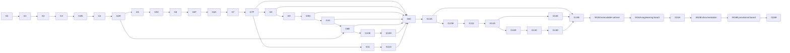

# Engineering validation matrix

> CassiFI implementation plan, Part 11. [Previous](./10-work-packages.md) · [Index](../README.md) · [Next](./12-decisions-deployment-and-completion.md)

## Engineering validation matrix

These are iterative engineering validation runs. Each check has a generated
input manifest, one driver, focused behavioral tests, raw artifacts, a
machine-readable result, and an independently recomputable evidence boundary.

The design, fixtures, metrics, and tolerances may improve during engineering.
Each completed run remains immutable as a record of the exact version it
executed. When a consumed subhash changes, the dependency graph reruns that
check and its affected descendants; unrelated prior evidence is retained under
its original identity and never relabeled.

One hashed machine-readable `cassi.qi-flow-dependency-manifest.v1` is the
authority for all work-package, gate, prose, Mermaid, artifact, and registry
nodes/edges. Every graph view is generated from that manifest or checked
against its recorded source-section hashes and manifest digest; a hand-edited
or stale graph is a gate failure.

Capability claims are uncertainty/null-thresholded causal consequences, not
rank or endpoint counts alone. Runtime observability remains no-peek;
paired-world discriminability and delayed influence are offline evidence, with
delayed influence represented only by ordinary residual packets and never by
persistent credit state.

Every validation receipt contains:

- `schema`, `gate_id`, `run_id`, `started_ns`, `finished_ns`, and status;
- source-tree identity, Python/Torch/device identity, composite profile hash,
  consumed semantic subhashes, operator/boundary/backend identities, and
  fixture hashes;
- exact command, arguments, environment allowlist, input hashes, and output
  hashes;
- expected invariants and tolerances copied from the current validation
  manifest;
- measured values, stop reason, failure classification, and every control
  result;
- hashes of consumed parent receipts and the receipt's own domain-separated
  self-hash.

`source-tree identity` is a canonical sorted file-map digest, not inferred git
state. It includes every live CassiQwen executable/config/test path and, for
W13C onward, every separately authorized CassiCosmos adapter, scene, fixture,
and default-off battery path named by the ownership brief. Each row carries
repository-relative path, byte count, SHA-256, and role. Changed files invalidate
only receipts that declare the changed identity as an input.

Capability checks retain all paired raw arms and current treatment/control
definitions so results can be debugged and reproduced. Development may improve
sample counts, statistics, horizons, and controls when they are weak. The
release-candidate manifest records the exact accepted versions used for that
release; no metric may be altered during a running check.

`u_numeric` is the maximum independently recomputed discrepancy across the
current exact-arithmetic, zero-effect, backend-parity, and decision-margin
fixtures. Every discrete action/text decision must clear its propagated
uncertainty guard band or abstain.
### G0 — Engineering manifest and dependency identity

**Work packages:** W0 and W1 for the first development snapshot; W0 thereafter;
W16A for a release-candidate snapshot.

**Driver and artifacts:** `run_cassi_qi_flow_manifest.py` atomically writes
`<run-root>/index.json`, the canonical
`<run-root>/run-spec/{manifest,profile,semantic-subhashes,
profile-projections,schema-registry,source-identity,raw-retention-policy,
capability-matrix,toolchain,command-inputs}.json` objects, the static
source-pinned `<run-root>/run-spec/oracle-fixtures/` corpus, and the single
hashed `<run-root>/run-spec/dependency-manifest.json` identified as
`cassi.qi-flow-dependency-manifest.v1`. G0 creates the run-spec namespace and
indexes the fixtures; W1/G1 subsequently construct and index
`<run-root>/run-spec/contract-root.json` from those retained inputs. The first
development invocation uses W1's complete `cassi-qi-flow-development.json`; a
candidate invocation uses W14B's selected `cassi-qi-flow.json`. Development
and candidate runs use distinct run IDs. W16A writes
`<candidate-root>/candidate/{engineering-board,candidate-result}.json`; W16B
writes only the provisional
`{provisional-release-board,provisional-release-result}.json` after
documentation verification. G15B alone writes final release objects. Gate-local
manifest/profile copies are forbidden.

**Exercise:**

1. Enumerate every current source, test, driver, config, schema, fixture,
   descriptor, validation path, command, resource/security limit, metric,
   tolerance, horizon, control, and expected artifact.
2. Record exact mathematical/operator conventions, importer/caller inventory,
   file/symbol ownership, profile/subprofile IDs, device-discovery rule, and
   every unresolved coefficient or implementation item.
3. Generate the external mandatory capability matrix and the complete schema
   and JSON-Pointer projection registries; register
   `cassi.qi-flow-dependency-manifest.v1` with its canonical node/edge,
   owner/consumer, artifact, source-section-hash, fixture, and byte-limit
   contract before emitting it.
4. Generate canonical dependency nodes/edges for every W/G package, gate,
   prose section, registry row, and artifact. Verify that all Mermaid diagrams,
   prose dependency lists, and registry cross-references are generated from or
   hash-checked against the one dependency manifest; no second graph is
   authoritative.
5. Verify the profile-to-run identity graph is acyclic: profiles contain
   schema/formula identities, while concrete run manifests consume profiles.
6. Verify canonical self-hashes, the root index,
   semantic-subhash/source/retention-policy objects, exact toolchain/command
   inputs, `cassi.qi-flow-contract-root.v1` binding, and independence from
   historical `_diag` output.
7. Reopen-verify W0's historical-v2 manifest, source/checkpoint indexes,
   wrapper/config, every indexed byte/count/digest, and the absence of
   unindexed executable history.

Development manifests may contain explicit `pending_owner` and
`blocking_reason` entries. A release candidate may not contain a pending item
required by its claimed capability surface.

**Controls:** mutate one source hash, consumed subhash, tolerance, profile byte,
fixture byte, parent hash, coefficient, dependency-manifest edge/hash,
generated Mermaid/prose/registry graph, historical index entry, historical
object byte, or historical wrapper/config digest. The consuming check must
reject the altered identity before execution.

**Pass condition:** the verifier reconstructs the root index, manifest,
dependency-manifest, semantic-subhash, projection, capability, schema, source,
raw-retention, toolchain, command, contract-root, and historical-snapshot
hashes; every required candidate identity and graph node/edge exists; every
Mermaid/prose/registry graph agrees with the manifest; no required capability
or historical entry is omitted or weakened; and every altered control is
rejected.

**Evidence scope:** the exact implementation/profile/artifact dependency graph
for this development or release candidate is known. G0 makes no intelligence or
field-flow claim and never locks future plan revisions.

### G1 — Profile, one-state rule, checkpoint, and receipt identity

**Work packages:** W1.

**Tests and driver:** `test_cassi_qi_profile.py`,
`test_cassi_qi_checkpoint.py`, `test_cassi_qi_receipts.py`, and
**Artifact:** `<run-root>/gates/g01-identity/identity.json`,
`<run-root>/run-spec/contract-root.json` as
`cassi.qi-flow-contract-root.v1`, plus `status.json`.
**Exercise:**
- construct/validate calibration and integrated profiles during development;
  for a release candidate, construct only the manifest-selected
  `profile_sha256` and reject a substituted composite hash or consumed subhash;
- open the contract root only through the fixed, source-pinned
  `cassi.qi-flow-contract-root-bootstrap.v1`; mutate the bootstrap
  source/toolchain/fixture identity and prove rejection before descendant-codec
  or profile interpretation;
- construct and validate the root, binding the bootstrap, descendant canonical
  codec, complete schema registry, projection registry, and materialized
  defaults in canonical order; a child identity mutation mints a new root;
- validate every shape, unit, coefficient, coordinate map, operator,
  descriptor, clock, action contract, retention law, queue/resource limit,
  stage spec, execution schedule, and stability envelope;
- prove runtime ownership of exactly one mutable adaptive tensor with shape
  `[S,9M,B]`, while topological-retention topology and all diagnostics remain derived;
- serialize/load/checkpoint on the same backend and prove exact state,
  profile, contract-root, state-contract, source, schedule, and topology
  identities;
- verify domain separation and parent-child closure for every schema-registry
  object, including standalone stage/space-scale/Hodge/retention/topology/
  backend receipts and the v3 journal/watermark/source-replay chain.

**Controls:** wrong schema version, wrong profile/operator/boundary/backend
hash, profile-selected or mutated bootstrap, descendant-codec self-
interpretation of the root, wrong contract-root child/hash/order, wrong tensor
shape/dtype/device, nonfinite element, truncated tensor, extra tensor, extra
adaptive map, altered scalar ledger, altered self-hash, and old v2
state/session/config payload.

**Pass condition:** the source-pinned bootstrap authenticates the exact root
before any descendant codec or profile semantics execute; same-backend
save/load bytes, `state_sha256`, `profile_sha256`, and contract-root hash are
exact; the root binds the bootstrap, descendant canonical codec, schema
registry, projection registry, and materialized defaults; the two restored
trajectories remain exact; every invalid, legacy, bootstrap-, child-, or
root-mismatched input fails before state mutation; live import inspection finds
no second adaptive owner.

**Evidence scope:** the endpoint has one authoritative state identity and
exact restart on the measured backend/profile.

### G2 — Exact coordinates, geometry, and operator identities

**Work packages:** W2.

**Tests and driver:** `test_cassi_qi_geometry.py` and
`run_cassi_qi_geometry.py`.

**Artifact:** `<run-root>/gates/g02-geometry/geometry.json` plus `status.json`.

**Exercise:**

- verify the `EY,EI <-> D,C` forward/inverse transforms over zeros, basis
  impulses, random finite fixtures, conjugate pairs, and amplitude extremes;
- verify the induced metric
  `|EY|^2+|EI|^2=|D|^2/(1+phi^2)+(1+phi^2)|C|^2` and its velocity counterpart;
- verify active-grid reshape/order, unitary FFT/IFFT, signed wave-number
  ordering, Nyquist handling, gradient, divergence, Laplacian, translation,
  rotation, restriction, prolongation, adjoints, and positive scalar remap;
- compare spectral derivatives with analytic constant, ramp-compatible,
  sinusoidal, Gaussian, and plane-wave fixtures at every scale.

**Controls:** transposed axes, reversed wave-number sign, nonunitary FFT
normalization, swapped Yang/Yin planes, one-cell coordinate permutation,
wrong prolongation scale, and complex remap applied incorrectly to
`epsilon2_ema`.

**Pass condition:** exact algebraic identities hold to dtype-specific
tolerance; adjoint inner products close; analytic derivative error remains
inside the versioned profile envelope; every altered operator changes its hash
and fails identity validation.

**Evidence scope:** the declared spatial sheet and derived coordinates are
implemented consistently. G2 does not establish live transport.

### G3 — Intrinsic transport, continuity, and hard-bound policy

**Work packages:** W3.

**Tests and driver:** `test_cassi_qi_transport.py` and
`run_cassi_qi_transport.py`.

**Artifact:** `<run-root>/gates/g03-transport/transport.json` plus `status.json`.

**Exercise:**

- run frozen zero state, uniform amplitude ramp, pure local phase rotation,
  standing wave, right/left/reflected packets, and two-packet interference;
- execute the exact hashed stage schedule and independently verify every stage
  read/write set, logical duration, dependency, work/charge row, and failure
  rule;
- measure phase/group velocity, amplitude motion, energy current, spatial
  current, continuity residual, admitted source work, and total closure;
- recompute each analytic spectral half-stage's exact damping work/charge
  quadrature and subtract it before assigning transport residual;
- recompute the intrinsic-W3 `QiStabilityEnvelope` and
  `QiNumericalCertificate` sections term-by-term, including transport
  nonlinearities, projection error, source admission, intermediate stages,
  and exact spectral-reference bounds. Composition, topological-retention, conversion, and
  scale-link sections are added by their later owning gates rather than
  pre-certified before those laws exist;
- run the mandatory source-free long horizon and drive below, exactly to, and
  above each admission/stability bound.

**Controls:** reverse momentum or wave number, zero transport, freeze velocity,
permute coordinates, alter one stage order/dependency/hash, omit damping
quadrature, mutate one curvature term, and inject oversized/nonfinite source.

**Pass condition:** traveling controls reverse current/velocity; standing and
frozen controls have zero net transport; stage, continuity, exact damping, and
work receipts close; the independently reconstructed stability inequality and
refinement bound pass; long-horizon state is finite; above-bound candidates
fail before commit with the predecessor unchanged and no clip/rescale/fallback.

**Evidence scope:** intrinsic Qi transport and its direction are measured by
the declared currents on the registered analytic fixtures.

### G3N — Independent numerical certificate and guard replay

**Work packages:** W3N.

**Tests and driver:** `test_cassi_qi_numerical_certificate.py` and
`run_cassi_qi_numerical_certificate.py`.

**Artifact:** `<run-root>/gates/g03n-numerical-certificate/` with
`QiNumericalCertificate`, immutable
`cassi.qi-flow-certificate-extension.v1` parent-linked extensions,
offline derivation/enclosure inputs, online-guard receipts, independent replay,
the final complete section inventory, controls, and `status.json`.

**Exercise:**

- derive the complete intrinsic-W3 stability, positivity, source-admission,
  and work-closure section with the registered high-precision/interval method,
  recording enclosure endpoints, rounding budget, profile/subhash identities,
  and raw fixtures;
- verify the canonical compositional certificate format that G4, G4R, G5V,
  and G6T later extend with completed law-specific sections; a missing required
  section is never a placeholder or implicit pass;
- append each later section only as an immutable parent-linked
  `cassi.qi-flow-certificate-extension.v1` record naming its parent hash,
  owning law/package/gate, consumed subhashes, and section hash; verify the
  final certificate's complete ordered section inventory;
- evaluate the cheap online guard against accepted, boundary, and rejected
  transport states, then independently replay each decision from raw state and
  receipts;
- verify that online guards never widen an offline enclosure, clip a state, or
  replace an independent recomputation.

**Controls:** mutate a coefficient, enclosure endpoint, rounding mode, dtype,
backend, guard result, raw-state byte, certificate parent/extension hash,
section inventory/order, or omit a required section.

**Pass condition:** the offline certificate and online guard have distinct
identities; every accepted/rejected decision matches independent replay; every
extension has an immutable valid parent and complete section hash; the final
certificate names every required section exactly once; and every mutated
identity is rejected before commit. A missing enclosure, broken chain,
incomplete inventory, or disagreement is `FAIL`, not a widened tolerance or
fallback. Changed parent/law identity reruns G3N and all dependent gates.
### G4 — Coherence carrier and composition-controlled steering

**Work packages:** W4.

**Tests and driver:** `test_cassi_qi_carrier.py` and
`run_cassi_qi_carrier.py`.

**Artifact:** `<run-root>/gates/g04-carrier/carrier.json` plus `status.json`.

**Exercise:**

- initialize matched `D` packets under distinct reciprocal `D,C` composition
  states and matched `C` packets under distinct `D` gradients;
- use the registered `composition-reversal-v1` pair with identical total
  position density, exact opposite imbalance, exact full energy, zero initial
  current, one declared velocity-basis/work class, and immutable raw-state
  hashes;
- measure both metric-gradient forces, their coordinate work rows,
  `Delta U_composition`, total coupled closure, trajectory separation, and
  reversal under that pair;
- exercise pure-`D`, pure-`C`, uniform, structured, potential-off, and
  scale-local variants.

**Controls:** negate one coordinate, apply `mathcal R_J`, set the composition
potential to zero, and replace the structured state with a phase-shuffled
equal-energy field. Coordinate negation is not called epsilon reversal.

**Pass condition:** potential-off trajectories coincide with the uncoupled
reference;
`W_D^composition+W_C^composition+Delta U_composition` closes under the
registered discrete split; the exact `+epsilon_0/-epsilon_0` pair reverses the
registered steering effect; equal-energy phase shuffle does not falsely
reproduce the structured trajectory.
The completed composition section of `QiNumericalCertificate` must reproduce
the same curvature and work bounds before G4 passes.

**Evidence scope:** the complementary coherence coordinate causally steers
the differential coordinate through a reciprocal, ledgered field coupling.

### G4R — topological-retention Hamiltonian/topology core installed before conversion

**Work packages:** W4R.

**Tests and driver:** `test_cassi_qi_retention_core.py` and
`run_cassi_qi_retention_core.py`.

**Artifacts:** `<run-root>/gates/g04r-retention-core/` with the
`QiTopologicalRetentionLaw` profile/core receipt, barrier/curvature certificate,
topology-algebra vectors, sector/reset receipts, conversion-path identity,
controls, and `status.json`.

**Exercise:**

- verify that W4R installs `topological-v1` after W4 and before any W5
  conversion step, over the existing slow-scale coordinates and the one field
  tensor;
- recompute `U_topo`, metric-gradient force, radial curvature, barrier lower
  endpoint, winding/circulation sector algebra, and sector/reset transitions;
- inspect Hamiltonian, stability, conversion, remap, reaction, checkpoint,
  backend, and work paths for the same topological-retention core and no added state;
- verify that within-sector analog flow and topological sector transitions are
  distinct receipts, leaving behavioral consolidation to W10R.

**Controls:** `U_topo=0`, fading-retention `fading-v1`, phase-scrambled equal energy,
matched-energy/opposite-current, below/above-barrier perturbation,
branch-margin, amplitude-floor, and unreceipted-sector mutation.

**Pass condition:** the topological-retention core is present before G5/W5, all core ledgers
  close, topology is field-derived, no extra adaptive state exists, and every
  altered law/path/receipt identity fails before conversion. Core absence or
  fading-retention substitution is `FAIL`.

### G5 — Yang/Yin conversion as an integrated exchange

**Work packages:** W5.

**Tests and driver:** `test_cassi_qi_conversion.py` and
`run_cassi_qi_conversion.py`.

**Artifact:** `<run-root>/gates/g05-conversion/conversion.json` plus `status.json`.

**Exercise:**

- evaluate balanced, matched-energy positive/negative-imbalance pairs,
  Yang-heavy, Yin-heavy, empty, near-capacity, heterogeneous, and multiscale
  cells inside the dimensionless `rho_ref` domain;
- compare the once-per-step frozen-`Q` exponential exchange against the exact
  analytic map and verify the separately receipted EMA update;
- recompute `W_conversion` from complete pre/post kinetic, gradient, local,
  composition, link, and `U_topo` energy.

**Controls:** `lambda=0`; joint `lambda=0,tau_epsilon=0`; duplicate invocation;
the exact positive/negative-imbalance pair; stale/mis-remapped EMA; a candidate
with `W_conversion` above the uncertainty guard; and one dissipative candidate
with negative work.

**Pass condition:** local total position density and positivity hold; transfer
and full-map ledger match the analytic law; one invocation is recorded;
`lambda=0` leaves Yang/Yin positions unchanged while normal EMA may update; the
joint zero control is exact; stale EMA, resolved-positive, and
zero-versus-source-ambiguous work intervals reject without mutation; resolved
negative work is recorded once as `Q_conversion=-W`, while the registered
numerical-zero class retains its signed row and adds no sink.

**Evidence scope:** Yang/Yin conversion is a live, bounded, local
position-density-conserving and full-energy-ledgered exchange inside each
accepted field step.

### G5V — Forward-viable conversion and physical EMA time

**Work packages:** W5V.

**Tests and driver:** `test_cassi_qi_conversion_viability.py` and
`run_cassi_qi_conversion_viability.py`.

**Artifact:** `<run-root>/gates/g05v-conversion-viability/` with
`conversion-viability.json`, frozen `epsilon_prog_min`, `D_prog`,
`D_neutral`, complete `D_conv`/`A_accepted` support-domain interval/analytic
proof, accepted/rejected domain intervals, fixture witness index,
unresolved-cell results, positive signed `D_prog` margins, bounded-transfer
`D_neutral` margins, exact balanced/zero no-op controls, physical
`epsilon_memory_time`, derived EMA coefficients, raw ledgers, certificate
extension parent/hash, controls, and `status.json`.

**Exercise:**

- freeze `epsilon_prog_min`, `D_prog`, `D_neutral`, `D_conv`, and
  `A_accepted` before observation; determine the forward-viable domain of the
  frozen-`Q` map over balanced, imbalanced, near-boundary, heterogeneous, and
  multiscale profiles;
- prove a complete production-domain interval/analytic result: every cell of
  the declared support maps into both `D_conv` and `A_accepted`, fixtures are
  witnesses only, and an unresolved cell is `FAIL` rather than omitted;
- prove a strictly positive signed progress margin for every `D_prog` cell,
  but use the bounded-transfer margin for `D_neutral` cells near
  `epsilon=0`; do not demand a uniform positive margin in `D_neutral`;
- verify exact balanced and zero-source controls remain no-ops while every
  admitted nonneutral cell preserves density and closes its signed
  energy/work ledger; retain exact rejected intervals;
- verify that the profile stores physical `epsilon_memory_time` and derives
  the per-step coefficient as `1-exp(-h/epsilon_memory_time)` for each declared
  `h`, with no timestep-dependent physical parameter;
- independently replay the map and require law revision when the frozen map
  cannot provide both predicates; repeated rejection normalization is not a
  pass. The support domain is frozen before observation and cannot shrink after
  outcomes are seen.

**Controls:** timestep mutation, stale EMA, `epsilon_memory_time` mutation,
`epsilon_prog_min` mutation, `D_prog`/`D_neutral` boundary mutation,
`D_conv`/`A_accepted` predicate mutation, map/domain mutation, duplicate
invocation, support-cell omission, post-observation support shrink,
unresolved-cell suppression, certificate-parent mutation, source-ambiguous
work, positive/negative-work controls, near-zero epsilon, and exact
balanced/zero no-op controls.

**Pass condition:** a nonempty, complete, documented, frozen production domain
exists; every support cell maps into both `D_conv` and `A_accepted`; physical-
time and derived-coefficient identities match; every `D_prog` cell has a
positive signed margin; every `D_neutral` cell has its bounded-transfer margin
without an unjustified uniform-positive requirement; exact balanced/zero
controls are no-ops; accepted and rejected intervals replay exactly; and no
normalized rejection, fallback, support shrink, or post-hoc state repair
occurs. The completed conversion section of `QiNumericalCertificate` must
reproduce the same predicates, domains, margins, and physical-time bounds
through an immutable parent-linked extension before G5V passes. Any failed/
changed support, predicate, margin, or parent reruns W5V/G5V and descendants.

### G6 — Continuous cross-scale circulation and field memory substrate

**Work packages:** W6.

**Tests and driver:** `test_cassi_qi_cross_scale.py` and

`run_cassi_qi_cross_scale.py`.

**Artifact:** `<run-root>/gates/g06-cross-scale/cross-scale.json` plus `status.json`.

**Exercise:**

- inject localized/distributed patterns at every scale and measure restriction,
  prolongation, link energy, reciprocal work, signed scale current
  `K_{Z,s->s+1}`, latency, retention, and return;
- use normalized coarse `y` and matched fine `x=P_s^\dagger y` for independent
  fine-to-coarse/coarse-to-fine arms with raw states;
- reconstruct the full space-scale continuity law and verify internal `K`
  cancellation when integrated over all scales;
- derive `L/T/H` Hodge components from spatial current on each periodic sheet
  and verify reconstruction, orthogonality, divergence, curl, zero-mode flux,
  and circulation;
- record every retained-subspace/nullspace contribution; no top cell is
  selected.

**Controls:** link-off, `mathcal R_J`, `mathcal R_P`, wrong metric transpose,
frozen scale, equal-energy phase shuffle, known nullspace, historical top-one
write, and a Hodge operator built with a mismatched derivative symbol.
`g_s` remains positive.

**Pass condition:** link-off exchange is zero; adjoint arms agree; every link
satisfies
`W^{link}_{Z,s}+W^{link}_{Z,s+1}+Delta E^{link}_{Z,s}=0` within uncertainty;
space-scale charge closes with internal `K` cancellation; Hodge identities
close; energy reaches every declared connected retained subspace; no
winner/hidden array/top-one path exists.

**Evidence scope:** continuous reciprocal space-scale transport and its derived
spatial/scale currents are separately measured; metric quadrature `W_s` is
never mislabeled as work.
### G6T — Explicit scale geometry and scattering work

**Work packages:** W6T.

**Tests and driver:** `test_cassi_qi_scattering.py` and
`run_cassi_qi_scattering.py`.

**Artifacts:** `<run-root>/gates/g06t-scale-scattering/` with the registered
comparison of `temporal-full-rank` versus `spatiotemporal-pyramid`,
`selected scale_geometry_mode`, the frozen selector/threshold receipt,
rank/conditioning/cross-talk/work/cost intervals,
`QiScatteringReceipt` objects, raw trajectories, periodic-sheet identity,
topology-codebook resolution evidence, mutation controls, and `status.json`.

**Exercise:**

- freeze the candidate set, exact profile, periodic FFT-sheet convention,
  controller grammar, physical horizon, source fixtures, endpoint probes,
  thresholds `(r_min,kappa_max,chi_max,w_max,c_max)`, and selector before
  running either candidate; future nonperiodic operators require distinct
  transform/metric/flux identities;
- run both scale-geometry candidates under identical source fixtures, horizons,
  nonnegative work budgets, and endpoint probes; report resolved intervals
  `r_m`, `kappa_m`, `chi_m`, `w_m`, and `c_m`;
- mark mode `m` feasible iff all intervals resolve and
  `r_m^- >= r_min`, `kappa_m^+ <= kappa_max`,
  `chi_m^+ <= chi_max`, `w_m^+ <= w_max`, and `c_m^+ <= c_max`;
- apply the frozen lexicographic selector
  `F(m)=(r_m^-, -kappa_m^+, -chi_m^+, -w_m^+, -c_m^+)`: choose greatest
  `F`; exact equality is resolved by canonical mode ID, while overlapping or
  otherwise undecidable intervals and an empty feasible set are deterministic
  `FAIL`, never a post-run threshold or selector change;
- recompute each scale and external-port `QiScatteringReceipt` from raw
  trajectories with incident, reflected, transmitted, and absorbed work,
  orientation, complete work partition, and closure residual;
- verify every selected topology codebook is realizable at the selected
  resolution, resolution-scaled, and preserved by zero-clock remaps; verify
  the completed link/scattering section of `QiNumericalCertificate`, no
  implicit rank loss, and no work counted twice.

**Controls:** omit or mutate `scale_geometry_mode`, threshold, selector,
candidate, periodic-sheet/FFT identity, controller grammar, horizon, work
budget, topology resolution, swap geometry, transpose a port, reverse
orientation, alter rank report, hide a scale, mutate a raw work row, and
change only schema-declared volatile telemetry.

**Pass condition:** exactly one mode is selected by the frozen function from
the registered feasible comparison; all intervals and thresholds are resolved;
every scattering receipt, topology-codebook check, and numerical-certificate
section closes under independent replay; and every control is rejected.
Implicit rank loss, unrealizable codebook, unresolved/overlapping tie,
unexplained work, changed periodic identity, or missing certificate section is
`FAIL`. A changed selector, threshold, candidate, or parent reruns W6T/G6T and
all descendants.

### G6A — Intrinsic reachability, observability, and dynamical capacity

**Work packages:** W6A.

**Tests and driver:** `test_cassi_qi_capacity_dynamics.py` and
`run_cassi_qi_capacity_dynamics.py`.

**Artifact:** `<run-root>/gates/g06a-capacity-dynamics/` with
`cassi.qi-flow-capacity-ladder.v1`, analytic source/readout bases,
coordinate/spatial/scale/topology impulse responses, rank/singular spectra,
nullspaces, growth/decay/retention/delay, uncertainty/null thresholds, exact
canonical trajectories, work ledgers, controls, and `status.json`.

**Exercise:** compute coordinate/spatial/scale/topology impulse-response
operators, effective rank and singular spectra, nullspaces, finite-time growth,
retention/decay, group delay, and actual state/workspace bytes using analytic
source/readout bases. Generate every claimed capacity rung only from exact
canonical `advance()` trajectories under the frozen controller grammar, exact
physical horizon, and nonnegative incident/source-work budget; classify
geometric, reachable, observable, usable, retained, and reusable capacity
separately.

**Controls:** disconnect one path, excite a known nullspace, collapse two
coordinates, alter controller grammar/horizon/work budget, count reset/startup
as acquisition, suppress a dark mode, inject an uncommitted proposal, and
replay with altered field/receipt bytes.

**Pass condition:** every intrinsically claimed mode is reachable and
observable over its horizon, dark modes are excluded, and each nongeometric
ladder rung has a canonical trajectory, fully known nonnegative single-charge
source budget, and uncertainty/null predicate. Geometric capacity is witnessed
rather than acquired; a newly acquired sector requires strictly positive
source work, while a registered source-free residence control may have exactly
zero external source work and a complete internal/damping ledger. Reset never
counts as acquisition; any conflated class, negative/unknown budget,
double-charge, or changed grammar/horizon is `FAIL` and reruns W6A/G6A plus
descendants. G6A makes no boundary/output claim.
### G6B — topological-retention metastable and topological retention

**Work packages:** W10R (consuming W6A/W6B ladder evidence).

**Tests and driver:** `test_cassi_qi_retention.py` and
`run_cassi_qi_retention.py`.

**Artifacts:** `<run-root>/gates/g06b-retention/retention.json`,
`cassi.qi-flow-capacity-ladder.v1`, `cassi.qi-flow-forgetting.v1`, indexed
topology/phase-slip/reset receipts, raw canonical trajectories, uncertainty/
null-thresholded retention and forgetting curves, and `status.json`.

**Exercise:** prove the nonzero topological-retention local minimum, positive radial
curvature, phase-slip barrier above the numerical guard, source-free sector
residence, below/above-barrier perturbation response, diverse
winding/circulation sectors, cue return, explicit reset, and exact restart.
Generate reachable/retained/reusable capacity only from exact canonical
`advance()` trajectories under the frozen controller grammar, exact physical
horizon, and nonnegative incident/source-work budget; distinguish geometric,
reachable, observable, usable, retained, and reusable classes. Measure topology
algebra, reachable-basin capacity, saturation, overwrite, interference,
recovery, and dynamical forgetting, with distinct within-sector analog versus
topological consolidation tiers on the one field tensor.

**Controls:** fading-retention `fading-v1`, `U_topo=0`, below-barrier equal work,
phase-scrambled equal energy, wrong cue, matched-energy/opposite-current state,
branch-margin and amplitude-floor violation, reset-before-run, reset-counted
acquisition, negative/unknown incident work, and noncanonical trajectory.

**Pass condition:** sector/topology is derived only from the field and remains
stable without an admitted phase slip. An ordinary transition may change the
full sector vector only through a receipted, work-funded `timed_phase_slip`
whose certified barrier lower endpoint clears `Delta_H_topo,min`; the sole
additional sector-changing path is an authenticated `retention_reset` edge
with its own signed energy and phase-impulse ledger. Within-sector analog
acquisition and topological consolidation remain distinct, no added state
exists, reset never counts as acquisition, and every ladder/forgetting result
has a fully known single-charge work classification, uncertainty/null
predicate, and raw trajectory. Newly acquired sectors and selective forgetting
require positive source work; source-free residence may prove zero external
source work only with its complete internal/damping ledger.
Topology algebra/capacity/saturation/overwrite/recovery measurements close with
raw controls. Every other change is `FAIL`; fading-retention substitution is `FAIL`, not
fallback. Changed grammar/horizon/work/topology identity reruns G6B/G6C and
descendants.

### G10E — Frozen field-experience plan

**Work packages:** W10E.

**Tests and driver:** `test_cassi_qi_experience_plan.py` and
`run_cassi_qi_experience_plan.py`.

**Artifact:** `<run-root>/gates/g10e-experience-plan/experience-plan.json`
with `QiFieldExperiencePlan`, exact byte/world stream hashes, timing/work
budgets, whole-episode split manifest, washout/stopping/checkpoint receipts,
mutation controls, and `status.json`.

**Exercise:**

- freeze deterministic byte and world streams, profile/clock identities,
  packet timing, admitted work budgets, whole-episode train/validation/
  held-out splits, washout, stopping, restart/interference phases, and the
  checkpoint-selection rule before any repeated experience;
- verify no packet-level leakage, post-hoc split/timing/budget edit, optimizer,
  replay, or hidden learning state enters the plan;
- independently replay plan selection and ensure W10A receives only the
  digest-bound plan and immutable raw inputs.

**Controls:** mutate one byte/world packet, split boundary, timing, work
budget, washout length, stopping rule, checkpoint candidate, or parent receipt.

**Pass condition:** the plan is byte-stable, whole-episode split, causally
  timed, budgeted, washout/stopping/checkpoint complete, and every mutation
  invalidates it before acquisition. A mutable or post-hoc plan is `FAIL`.

### G6C — Endpoint causal capacity and multimodal binding

**Work packages:** W6B (consuming W6A/W10R ladder and forgetting evidence).

**Tests and driver:** `test_cassi_qi_capacity_endpoints.py` and
`run_cassi_qi_capacity_endpoints.py`.

**Artifacts:** `<run-root>/gates/g06c-endpoint-capacity/`, including
`cassi.qi-flow-capacity-ladder.v1`, complete boundary-transfer and
multimodal-binding receipts, canonical trajectory/work indexes,
uncertainty/null-thresholded endpoint consequences, and `status.json`.

**Exercise:** enumerate every registered input coordinate and committed
output/text/action/applied-effect coordinate, compute finite-intervention
transfer, work, delay, uncertainty, rank/spectrum/nullspace, and run the
equal-work multimodal binding matrix at declared horizons. Every endpoint rung
must be generated by exact canonical `advance()` under the frozen controller
grammar, exact physical horizon, and nonnegative incident/source-work budget;
classify geometric/reachable/observable/usable/retained/reusable capacity
separately and consume W10R forgetting/recovery evidence.

**Controls:** source-suppressed, disconnected path, C-only/D-only optical
fixtures, modality-alone, shuffled/lagged/mirrored/permuted transfer,
phase-current reversal, fading retention, matched-energy/opposite-current, reset
counted as acquisition, negative/unknown work, and proposal-only effect.

**Pass condition:** every required endpoint is reachable and observable in the
complete system through a committed consequence, treatment beats registered
equal-work controls where binding is claimed, all capacity classes and
uncertainty/null thresholds are explicit, and no proposal/uncommitted event,
reset, or negative/unknown-work trajectory is counted. Dark coordinates are
reported and cannot inflate capacity. Changed ladder/grammar/horizon/work
identity reruns G6A/G6B/G6C and descendants.

### G7 — Boundary fidelity, rational clock, durable ingress, and passive egress

**Work packages:** W7.

**Tests and driver:** `test_cassi_qi_boundaries.py`, focused modality/clock/
journal tests, and `run_cassi_qi_boundaries.py`.

**Artifacts:** `<run-root>/gates/g07-boundaries/`, including boundary, clock,
antialias, watermark, journal/replay, passive-egress, and `status` receipts.

**Exercise:** round-trip registered fixtures through every invertible
boundary; verify forward/adjoint/work/unit identities; exercise all 260
symbols and actual optical/audio/proprio/motor geometry; reconstruct rational
multirate interval partition/LCM/ordering; verify antialias response; inject
crashes before/after Commit A and prove exact-once ingress; preflight text,
audio, and motor egress against the complete Hamiltonian.

**Controls:** future/overlapping/duplicate/skipped interval, wrong clock/source/
descriptor/profile/watermark, antialias hash mutation, replay-retention loss,
metric-adjoint or port-orientation mutation, malformed/oversize packet,
crashes immediately before/after Commit A, missing ingress acknowledgement,
insufficient-Hamiltonian egress, self-sensed output, and unregistered body or
modality geometry.

**Pass condition:** every registered invertible boundary closes its
forward/metric-adjoint identity within the frozen interval, every noninvertible
boundary reports its declared information loss, all rational intervals
partition exactly, and every accepted packet is durable exactly once before
field mutation. Restart/retry reproduces the same ingress head and field
successor; invalid or duplicate packets fail before mutation; passive egress
debits the complete Hamiltonian and never feeds output back as input. G7 owns
only the boundary-local Commit-A crash proof. Integrated Commit-B, world-CAS,
response, and two-caller crash semantics remain mandatory in G12M/G12A and
cannot be waived by this gate.
### G7P — Field-derived permeability and admitted/reflected/absorbed work

**Work packages:** W7P.

**Tests and driver:** `test_cassi_qi_boundary_permeability.py` and
`run_cassi_qi_boundary_permeability.py`.

**Artifacts:** `<run-root>/gates/g07p-boundary-permeability/` with
`QiBoundaryPermeabilityProfile`,
`cassi.qi-flow-sensory-openness.v1`, per-modality/scale
incident-work-normalized openness and recovery, admitted/reflected/absorbed
work, adjoint/reconstruction receipts, field-off/orientation controls, and
`status.json`.

**Exercise:**

- construct the immutable permeability profile from field geometry, metric,
  scale, descriptor, and port orientation for every mandatory sensory
  modality;
- replay sensory fixtures and independently recompute admitted, reflected, and
  absorbed work, matching the scale/port `QiScatteringReceipt` ledger;
- measure incident-work-normalized openness and recovery after field-off/
  closed-port intervals for every mandatory port, with declared uncertainty/
  null thresholds; permanent blindness is not an admissible result;
- verify forward/metric-adjoint work identities, bounded ranges, packet
  rejection-before-mutation, and no learned encoder/label/hidden boundary
  state.

**Controls:** field-off, scale isolation, orientation reversal, descriptor
mutation, caller-gain injection, label/metadata injection, work-row deletion,
duplicate packet, closed-port recovery, zero-incident-work, and mandatory-port
omission.

**Pass condition:** every mandatory port has positive incident-work-normalized
openness and bounded recovery under the registered controls; every accepted
packet has a field-derived permeability and accounted admitted/reflected/
absorbed work; rejected packets leave state/cursor unchanged; independent
replay and mutation controls agree. Missing, negative, unrecovered, or
unexplained openness/work is `FAIL`, and a changed field/port/recovery identity
reruns W7P/G7P and all dependent gates.

### G8 — Body frame, applied efference, and residual separation

**Work packages:** W8.

**Tests and driver:** `test_cassi_qi_body.py`,
`test_cassi_qi_body_frame.py`, and `run_cassi_qi_body_residual.py`.

**Artifact:** `<run-root>/gates/g08-body-efference/` with remap, prediction,
tick-ack, applied-efference, residual, and status receipts.

**Exercise:** run identity/inverse/round-trip guarded-periodic and
finite-aperture remaps; compare predicted and observed self-motion; consume only
terminal-applied exact values/ticks/body transitions; retain external object
motion/undeclared parallax as exafference; return residual through the adjoint
and measure next-horizon improvement; restart every Commit-A/Commit-B/efference
window.

**Controls:** proposal only, passive reaction only, accepted/started,
rejected/expired/timeout, duplicate original acknowledgement, absent/offset/
mirrored/lagged/permuted efference, wrong body frame, and `+e,-e`, zero,
orthogonal, phase-scrambled, equal-work residuals.

**Pass condition:** remap/work close; only registered terminal `applied` creates
`world_effect=true` and authorizes one remap/residual; proposal/reaction/
accepted/started never count as effect; correct efference removes registered
self-motion while external residual remains; restart consumes it exactly once.

### G9 — World-blind attention and continuous motor proposal

**Work packages:** W9.

**Tests and driver:** `test_cassi_qi_attention.py`,
`test_cassi_qi_motor.py`, and `run_cassi_qi_attention_action.py`.

**Artifact:** `<run-root>/gates/g09-attention-action/` with predictions,
proposals, motor reactions, command intents, applied efference, and status.

**Exercise:** provide only current committed state/input, fixed geometry/cost,
and one horizon; integrate continuous motor current; preflight passive reaction;
separate prediction/proposal/command/applied effect; propagate uncertainty; and
compare direct-flow, prediction-mediated, and combined steering.

**Controls:** candidate order/ID permutation, unseen world-consequence
permutation, geometry-only perturbation, `mathcal R_J`, `mathcal R_P`,
`mu_flow=0`, prediction frozen, direct-flow-only, null current, timeout,
duplicate, rejected, and applied acknowledgements.

**Pass condition:** unseen consequences cannot affect any candidate byte;
registered geometry changes only the predicted analytic term; uncertainty
holds/abstains; commands replay byte-identically; every proposal is paid by a
`world_effect=false` reaction; only the later applied-efference establishes
external causal ownership.

### G9O — No-peek finite-horizon observability improvement

**Work packages:** W9O.

**Tests and driver:** `test_cassi_qi_observability.py` and
`run_cassi_qi_observability.py`.

**Artifact:** `<run-root>/gates/g09o-observability/` with baseline/candidate
finite-horizon rank and conditioning, observability-improvement term,
`cassi.qi-flow-action-discriminability.v1` paired-world evidence,
uncertainty/null thresholds, no-peek access log, candidate receipts, controls,
and `status.json`.

**Exercise:**

- calculate gaze/action observability improvement from current committed
  field/input, fixed geometry, and one declared horizon; runtime scoring sees
  no candidate future consequence;
- compare baseline and candidate trajectory-response rank, conditioning,
  singular spectra, cross-talk, and uncertainty while permuting unseen world
  consequences;
- run paired worlds offline with the same committed predecessor/input and
  distinct authenticated world responses; record causal consequence intervals
  and require a positive lower margin beyond the preregistered null/uncertainty
  threshold before calling a discriminability claim;
- verify continuous motor proposal and passive `world_effect=false` reaction
  remain separate from terminal applied efference, and retain the no-peek
  import/call access log.

**Controls:** candidate-order/ID permutation, unseen-consequence permutation,
horizon/geometry mutation, field-current freeze, `mu_flow=0`, prediction
freeze, null current, paired-world authentication mutation, and no-peek
import/call-path inspection.

**Pass condition:** every finite-horizon term is enclosed strictly inside its
declared signed bound; a claimed observability/discriminability improvement has
a positive guarded lower bound beyond the null threshold, while candidates
with nonpositive upper bounds are penalized or correctly abstain. Unseen
consequences cannot affect candidate bytes, no proposal counts as effect, and
all controls replay identically. Future access, a nonfinite/out-of-bound term,
missing paired-world evidence, or a claim without positive margin is `FAIL`;
changed geometry/horizon/world identity reruns W9O/G9O and descendants.

### G10 — Fading trace, cue-causal recall, and successor signal

**Work packages:** W10.

**Tests and driver:** `test_cassi_qi_memory.py` and
`run_cassi_qi_memory.py`.

**Artifact:** `<run-root>/gates/g10-memory/memory.json` plus
`cassi.qi-flow-delayed-influence.v1`, raw trajectories, ordinary residual
packets, no-credit-state audit, and `status.json`.

**Exercise:** present timed episodes, remove sources, wait over fast/slow
delays, apply partial cues, measure future normalized successor residual,
separate passive trace detection from cue-caused restoration, and restart the
exact field state. Record delayed influence as offline evidence with lag,
direction, work normalization, and uncertainty/null threshold; transport only
ordinary residual packets at runtime.

**Controls:** links off, field frozen, zero state, current/phase shuffle, cue/
episode shuffle, wrong pose, EMA frozen/reset, matched-EMA/different-flow,
equal-energy unrelated field, fading-retention horizon overrun, delayed-credit injection,
and persistent eligibility/attribution-state injection.

**Pass condition:** cue-specific post-delay improvement requires the measured
slow-to-fast path and survives exact restart with no replay/cache/weights.
Delayed influence is evidence plus ordinary residual packets only: no
persistent credit, eligibility, attribution, or delayed-policy state exists.
This gate establishes fading-retention trace/recall only; it cannot satisfy G6B topological-retention
retention. Missing/non-causal evidence or any persistent credit state is
`FAIL`, and changed horizon/source/threshold identity reruns W10/G10/G10A.

### G10A — topological-retention experience acquisition and interference

**Work packages:** W10A and W10E.

**Tests and driver:** `test_cassi_qi_acquisition.py` and
`run_cassi_qi_experience.py`.

**Artifact:** `<run-root>/gates/g10a-acquisition/` with separate within-sector
analog and topological-consolidation learning curves, phase-slip/topology/
retention receipts, `cassi.qi-flow-delayed-influence.v1` evidence,
`cassi.qi-flow-forgetting.v1` reachability/forgetting curves, controls, and
status.

**Exercise:** run pre-exposure, repeated ordinary experience, neutral washout,
partial cue, held-out transfer, multi-delay, `A -> B -> A`, and restart in two
registered arms. Attribute admitted residual work, slow-to-fast return,
behavior change, transfer, interference, recovery, and dynamical forgetting in
both arms. The analog arm must preserve the complete valid sector while
changing the held-out causal response; the consolidation arm must additionally
prove barrier crossing and old/new sector identity. Delayed influence remains
offline evidence and ordinary residual packets, never persistent credit state.

**Controls:** equal-work one-shot, shuffled/mispaired/delayed residual,
equal-energy phase scramble, fading retention, links off, separately hashed
nonreciprocal return-off surgery with its residual, matched-EMA/different-flow,
wrong cue, matched-energy/opposite-current state, reset-counted acquisition,
negative/unknown work, and noncanonical trajectory.

**Pass condition:** repeated paired experience produces a guarded
within-sector analog acquisition that beats equal-work controls after washout
on a held-out prediction/emission/action with positive uncertainty/null margin,
and the designated durable arm produces a receipted topological-retention sector/basin
transition with the same causal advantage. Both survive restart and retain
measurable A after B; forgetting/recovery is dynamically reachable and
explicitly classified. Failure returns the field law to engineering and
authorizes no future unspecified mechanism, persistent credit state, or
fallback. Changed grammar/horizon/work/threshold identity reruns
W10A/G10/G10A and descendants.

### G11 — Reaction-feasible trajectory text ingress and passive emission

**Work packages:** W11 and W11D.

**Tests and driver:** `test_cassi_qi_text_flow.py`,
`test_cassi_field_language.py`, `measure_cassi_field_language_dependence.py`,
`run_cassi_qi_text_flow.py`, and W11D's dynamic-port driver.

**Artifacts:** `<run-root>/gates/g11-text/` with actual-`N_0` frame,
trajectory, raw/null, reaction-preflight, UTF-8 event/result,
`cassi.qi-flow-text-ownership.v1`,
`cassi.qi-flow-text-codebook-packing.v1`, and status receipts.

**Exercise:** consume every byte/control as a timed journaled packet; verify
the actual-`N_0` frame and temporal sampling/refinement; integrate signed work;
require terminal-positive outbound flow; reaction-preflight every raw-eligible
candidate; select a feasible winner against raw runner/null plus uncertainty;
commit through `port_reaction`; and exercise multibyte/tail flush, empty/max
event, loops, false positives, abstention, and restart. Run the
field-state-necessity intervention (intact field versus field-off/frozen/
phase-permuted same-packet controls) and the uncertainty-aware codebook
separation/packing check. The exact 260-symbol codec is a codec contract, not
an assumption about dynamic rank or alphabet capacity.

**Controls:** `mathcal R_J`, `mathcal R_P`, exact reverse orientation,
source-present/source-suppressed same-predecessor null, reversed event order,
shuffle/collapse probes, field freeze/off/phase permutation, coarse/short
window, static emit, self-sensed output, forced winner-reaction failure,
terminal-dark positive historical integral, codebook overlap/rank assumption,
and field-state-necessity intervention mutation.

**Pass condition:** a lone feasible candidate passes only against calibrated
null/raw-runner uncertainty; infeasible/dark candidates cannot win; text
ownership requires a positive field-state-necessity result; codebook packing
has separated intervals under its declared resolution; failed cycles emit/
flush no byte; committed bytes have identical stream/nonstream UTF-8 assembly
and passive full-Hamiltonian debit; null fixtures do not emit; at least one
designated fixture emits. Perpetual abstention is `FAIL`; missing or
uncertainty-overlapping ownership/packing evidence is `FAIL`, and changed
frame/intervention/codebook identity reruns G11/G11D.

### G11D — Dynamic port rank and exact reaction pruning

**Work packages:** W11D.

**Tests and driver:** `test_cassi_qi_dynamic_port.py` and
`run_cassi_qi_dynamic_port.py`.

**Artifacts:** `<run-root>/gates/g11d-dynamic-port/` with
`QiDynamicPortFrame`, actual-`N_0` trajectory-response rank/conditioning/
cross-talk report, interval certificates, exhaustive/pruned decision tables,
`cassi.qi-flow-text-ownership.v1`,
`cassi.qi-flow-text-codebook-packing.v1`, raw/null controls, and `status.json`.

**Exercise:**

- calibrate the dynamic port frame on actual `N_0`, declared temporal sampling,
  horizon, field profile, and `QiScatteringReceipt` work rows;
- measure trajectory-response rank, condition number, singular spectrum,
  cross-talk, uncertainty, and all interval bounds from raw trajectories; run
  field-state-necessity and codebook separation/packing interventions with the
  same no-peek runtime access;
- evaluate every reaction candidate both exhaustively and through exact
  interval-certified pruning, including ties, empty candidate sets, interval
  overlap, and abstention;
- independently compare candidate bytes, feasibility decisions, winner
  identity, and committed reaction across the two evaluations.

**Controls:** frame/probe permutation, interval endpoint mutation, reaction
inequality mutation, cross-talk injection, rank collapse, hidden candidate,
candidate-order permutation, uncertainty-bound mutation, field-off/frozen/
phase-permuted intervention, and codebook packing overlap.

**Pass condition:** frame metrics, field-state-necessity evidence, codebook
separation/packing, and interval certificates are present and independently
recomputable; rank is not presumed 260 or alphabet cardinality; pruned
evaluation is decision-equivalent to exhaustive evaluation for every control
and never changes a committed byte. Missing certification, overlapping
uncertainty, or any mismatch is `FAIL`; changed frame/intervention/packing
identity reruns G11D and G11.

### G12A — Validated runtime, atomic persistence, and concurrency

**Work packages:** W12A.

**Tests and drivers:** `test_cassi_conscious_chat.py`,
`test_cassi_persistent_provider.py`, `test_l21_provider_api.py`,
`test_l21_restart_lineage.py`, `test_l24_l25_provider_policy.py`,
`test_l26_provider_flow.py`, `test_cassi_qi_live_runtime.py`,
`run_cassi_qi_live_runtime.py`, `run_cassi_qi_outbox_recovery.py`,
`test_cassi_qi_artifact_cleanup.py`, and the exact cleanup
plan/apply/purge CLI grammar above, driven through an attached pseudo-terminal
inside a disposable fixture root.

**Artifact:** `<run-root>/gates/g12a-live-runtime/` with exact request/response/
SSE bytes, session/object/journal/outbox/efference chains,
`cassi.qi-flow-indeterminate-world-effect.v1`, crash/restart/concurrency
receipts, and `artifact-cleanup/{plan,result,purge}.json` plus status.

**Exercise:** drive fresh/restart/retry/concurrent/malformed/oversize/
cancellation/disconnect/shutdown paths; prove malformed requests fail before
session path/lock/field allocation; inject every ingress, stage, Commit A,
network, acknowledgement, and Commit B crash window; verify exact checkpoint,
stored response retry, journal cursor, one pending outbox, and applied-efference
consumption. Drive two competing callers through Commit A and Commit B CAS
interleavings and replay both callers. Exercise unknown external application
truth: it must seal an indeterminate lineage and cannot resume normal
continuation without an exact authenticated resolution. Verify response and
SSE bytes, `[DONE]`/success suppression on uncommitted cycles, terminal
`applied`-only efference, idempotency, orphan quarantine, and no duplicate or
dropped world effect. On a disposable confined fixture root, exercise cleanup
plan/quarantine/purge and independently verify its digest-exact receipt.
Consume and independently verify the `QiTransactionModelReceipt` and
`QiStateLineageForkReceipt`; runtime crash/replay and new-session fork behavior
must remain decision-equivalent to those bounded receipts.

**Controls**

- plan twice from the same index and require byte-identical plans;
- mutate one retained digest and require apply to refuse the stale plan;
- exercise missing/unparseable `cassi.qi-flow-raw-retention-policy.v1`, missing
  run index, digest mismatch, absent approval, and wildcard/path-expansion
  attempts;
- run plan and apply against a sandboxed artifact tree and prove every path
  outside the approved exact digest set remains byte-identical;
- race caller A/B with same and distinct idempotency keys, inject each crash
  point before/after Commit A/B, alter outbox/efference/response bytes, replay
  stale acknowledgements, and mutate authentication/resolution proofs;
- submit malformed/oversize/future/duplicate/disconnected requests and verify
  no state, cursor, allocation, response, or outbox mutation.

**Pass condition**

- runtime start, request validation, session locking, field allocation,
  response/SSE assembly, shutdown, and exact restart all match the declared
  schemas and hashes;
- every injected crash/restart window restores the authoritative predecessor
  or committed successor exactly, with no cursor/request/world-effect
  duplication, loss, or out-of-order acknowledgement;
- two competing callers have one authoritative CAS winner; loser/retry
  behavior is idempotent, Commit A/B invariants hold, and at most one
  terminal `applied` efference/world effect is consumed;
- committed responses and `[DONE]` bytes are replayed exactly, while every
  uncommitted, malformed, rejected, unknown, or indeterminate cycle emits no
  success/efference/world effect; unknown truth remains sealed until exact
  authenticated resolution;
- outbox recovery, orphan quarantine, journal/source replay, and response
  retention preserve exact hashes and never drop or invent an efference;
- cleanup emits a byte-stable plan and apply receipt naming the same exact
  digest set, requires explicit approval and a valid plan digest, confines
  every deletion to the approved indexed run root, and rejects wildcard or
  policy-only deletion.

Boundary-local crash gates (G7/G8 and their focused ingress/efference checks)
remain staged before integrated W12A behavior; a passing integrated exercise
cannot waive a boundary-local failure. Any runtime/crash/restart/concurrency/
outbox/efference/response/malformed-input/cleanup mismatch is `FAIL`, and the
owning W12M/W12A exercise plus all descendants rerun from the changed parent.

### G12E — Independent Qwen-zero process evidence

**Work packages:** W12E; W16A reruns the same frozen command after W15A.

**Driver:** `run_cassi_qi_process_evidence.py` plus independent
`verify_cassi_qi_process_evidence.py`.

**Artifact:** `<run-root>/gates/g12e-process-evidence/` with raw ETW/Win32
evidence, parser output, and status.

**Exercise:** trace terminal/provider startup, fresh request, restart, retry,
shutdown, module/file/socket/process ancestry, model/KV counters, and checkpoint
identity from before runtime import through exit.

**Controls:** forbidden module/file/socket fixtures, missing trace coverage,
altered source/toolchain/command identity, and parser/runtime-builder coupling.

**Pass condition:** raw evidence covers the declared process lifetime and the
independent parser reports zero live Qwen/GGUF/llama/native-KV/teacher/baseline
dependency. A release candidate uses only the post-W15A rerun; earlier evidence
is diagnostic.

### G13R — Deterministic grounded reference-world loop

**Work packages:** W13R.

**Tests and driver:** `test_cassi_qi_grounding.py`,
`test_cassi_qi_world.py`, and `run_cassi_qi_world_episode.py --world reference`.

**Artifacts:** `<run-root>/gates/g13r-reference-world/` with raw wire/frames,
provider text events, proposals/reactions/intents/acks/applied efference,
world-state snapshots/tick log, and status.

**Exercise:** run the exact registered sensing-plus-provider-text schedule
through observation, field, prediction, passive proposal, world consequence,
applied efference, next observation, residual, topological-retention recall/acquisition,
optical/audio/text, and actuator loops over held-out rendering, position,
order, occlusion, distractor, reconnect, duplicate, provider-only restart, and
full world restart.

**Controls:** no/wrong action, no-peek consequence permutation,
`mathcal R_J/P`, shuffled/lagged acknowledgement, label/future traps, modality
shuffle, wire/auth mutation, crash windows, and altered world seed/tick event.

**Pass condition:** identity/idempotency/clock invariants recompute; full world
restart restores the exact state/seed/tick-log hashes; provider-only restart is
labeled field-local; no action double-applies; held-out registered consequences
beat matched controls; no label/future consequence/hidden policy enters.

### G13C — CassiCosmos embodied multimodal loop

**Work packages:** W13C.

**Test, drivers, and artifacts:** `test_cassi_qi_world_adapter_contract.py`,
W13C's `run_cassi_qi_cassicosmos_baseline.py`, and the W13R-owned
`run_cassi_qi_world_episode.py --world cassicosmos` orchestrate the
authenticated windowed `verify_qi_world_adapter.tscn` and provider schedule.
The immutable pre-edit baseline lives under
`<run-root>/inputs/raw/g13c-pre-adapter/`; raw wire/frames/process receipts and
adapter-off comparison live under `<run-root>/gates/g13c-cassicosmos/`.

**Exercise:** run the same rational causal/text protocol through real optical,
audio, proprioceptive, text, and motor boundaries; then disable the adapter and
replay the exact W13C-owned pre-edit battery/trace/anchor command.

**Controls:** missing modality, wrong body frame, no-peek consequence
permutation, wire/auth/clock mutation, reconnect, duplicate intent, action
rejection, and adapter disabled.

**Pass condition:** the focused scene passes windowed; the applied loop uses
every required raw boundary without a second field; the provider text schedule
shares exact episode/tick causality; and every adapter-off deterministic
receipt, trace, anchor, battery-output, wire, and frame byte/hash is exactly
equal to the W13C-owned pre-edit baseline. Raw artifacts remain retained.
Only telemetry fields already declared volatile by schema may be compared
through the G13D deterministic projection and mutation-control contract. A
fresh 30/30, numerical similarity, or an unregistered projection is
insufficient.

### G13D — Adapter-off exact deterministic evidence

**Work packages:** W13C.

**Tests and driver:** `test_cassi_qi_adapter_off_identity.py` and
`run_cassi_qi_cassicosmos_baseline.py` with the independent
`verify_cassi_qi_adapter_off_identity.py` comparison.

**Artifacts:** `<run-root>/gates/g13d-adapter-off-equality/` with exact
pre-W13C and adapter-off raw receipt, trace, anchor, battery-output, wire,
frame, and process artifacts; the schema-declared volatile telemetry
projection manifest; mutation controls; and `status.json`.

**Exercise:**

- replay the frozen pre-W13C and post-W13C adapter-disabled command against
  identical inputs and compare exact deterministic artifacts byte-for-byte;
- permit a deterministic projection only for telemetry fields explicitly
  declared volatile by schema, recording projection version, input hashes, and
  proof that nonvolatile bytes remain exact;
- independently recompute the equality and mutate each deterministic byte,
  volatile declaration, projection rule, command, source, and fixture to prove
  a false equality cannot pass.

**Controls:** fresh 30/30-only similarity, numerical tolerance comparison,
changed wire/frame/receipt/anchor/battery byte, undeclared volatile field,
projection mutation, command/source/toolchain drift, and adapter enabled.

**Pass condition:** every deterministic artifact is exactly equal; only
  schema-declared volatile telemetry uses a deterministic projection whose
  mutation controls reject mismatches; the independent verifier agrees.
  Similarity, counts, or self-selected receipts cannot satisfy G13D.

### G14A — Operator/backend parity and decision margins

**Work packages:** W14A.

**Tests and driver:** `test_cassi_qi_backend.py` and operator-parity mode of
`profile_cassi_qi_flow.py`.

**Artifacts:** `<run-root>/gates/g14a-operator-parity/` with termwise
stage/stability/space-scale/Hodge/retention/topology/boundary/backend receipts.

**Exercise:** compare every prepared stage, ledger/charge term, topological-retention force
and sector transition, packet/remap/reaction, candidate branch, text/action
decision, checkpoint copy, and endpoint metric against CPU float64 on CPU and
ROCm float32. Validate batching, synchronization, allocation/copy counts, and
guard bands.

**Controls:** missing/wrong PCI device, operator/schedule cache mutation, hidden
CPU fallback, dtype promotion, unsynchronized read, hot allocation, topology
branch ambiguity, and deliberately near-margin decisions.

**Pass condition:** termwise parity and decisions pass; uncertain decisions
abstain/reject; topology does not round differently; no nonfinite/clipping/
fallback/unbounded allocation/unaccounted copy exists.

### G12M — Explicit Commit A/Commit B transaction model

**Work packages:** W12M.

**Tests and driver:** `test_cassi_qi_transaction_model.py` and
`run_cassi_qi_transaction_model.py`.

**Artifact:** `<run-root>/gates/g12m-transaction-model/transaction-model.json`
with `QiTransactionModelReceipt`,
`cassi.qi-flow-indeterminate-world-effect.v1`, bounded state/interleaving
inventory, two-caller CAS schedules, transition graph, invariants, replay/crash
controls, authentication/resolution proofs, and `status.json`.

**Exercise:**

- explore the bounded explicit state of predecessor head, ingress cursor,
  response, proposal, outbox, terminal acknowledgement, applied efference,
  retry/idempotency identity, quarantine marker, external-effect truth,
  authentication proof, and sealed indeterminate lineage;
- enumerate every declared Commit A/Commit B crash and replay interleaving,
  including two competing callers, same/different idempotency keys, process
  restart, network loss, duplicate tick/request, stale acknowledgement, and
  outbox recovery;
- independently recompute at-most-one terminal world effect, no dropped
  committed response, authoritative predecessor on failure, and exact cursor
  advancement from the model receipt;
- prove unknown external application truth seals an indeterminate lineage and
  cannot clear into normal continuation; only an exact authenticated resolution
  may resolve it, otherwise the seal and explicit indeterminate result persist.

**Controls:** omit a state component/interleaving, swap commit order, mutate
idempotency/cursor identity, race callers A/B, inject a crash at each boundary,
replay stale acknowledgement, alter authentication/resolution proof, and alter
the model parent hash.

**Pass condition:** the explicit bounded model covers every required
interleaving and caller/CAS schedule, its invariants hold,
runtime-independent replay agrees, unknown truth remains sealed until exact
authentication succeeds, and every mutation is rejected. Incomplete
exploration, normal continuation after unknown truth, or a duplicate/dropped
effect is `FAIL`; changed model/parent/interleaving identity reruns
G12M/G12A and descendants.

### G12L — Exact-byte state-lineage fork

**Work packages:** W12L.

**Tests and driver:** `test_cassi_qi_state_lineage.py` and
`run_cassi_qi_state_lineage.py`.

**Artifact:** `<run-root>/gates/g12l-state-lineage/lineage.json` with
`QiStateLineageForkReceipt`, parent/new-session identities, exact field-byte
hashes, profile-difference projection, compatibility proof, mutation controls,
and `status.json`.

**Exercise:**

- accept an explicit new-session fork only when profile differences do not
  reinterpret exact field bytes; verify state-contract, profile, operator,
  schema, source, and checkpoint identities;
- record parent head/session, exact field-state bytes/hash, differing profile
  leaves, fork reason, compatibility proof, and new-session identity;
- replay accepted/rejected forks independently and preserve the parent
  session read-only; no automatic conversion or in-place migration is allowed.

**Controls:** mutate one exact field byte, profile leaf, operator/schema/source
  hash, compatibility classification, fork reason, or parent session.

**Pass condition:** only explicitly authorized compatible profile differences
  produce a new-session fork; exact bytes are never reinterpreted, parent state
  is immutable, and every mutation fails before session creation/resume.

### G14B — Full-system capacity, cost, performance, and long horizon

**Work packages:** W14B.

**Drivers:** `benchmark_cassi_qi_flow.py` and full-system
`profile_cassi_qi_flow.py`.

**Artifacts:** `<run-root>/gates/g14b-full-system-capacity/` with capacity,
end-to-end cost, profiler, resource, retention, and status receipts.

**Exercise:** replay complete terminal/provider/reference-world/CassiCosmos
episodes at candidate capacities; measure packed and active field storage,
nonlinear/link/candidate workspaces, dense text probes, reaction preflights,
copies/synchronization, allocator calls, packet/event/journal/checkpoint bytes,
fsync/atomic commit, cold and warm request `p50/p95/max`, throughput,
backpressure, topological-retention horizon, and long-horizon stability. Recheck decisions
and restart at release capacity.

**Controls:** reduced/dark capacity, resource overflow, missing modality/world,
intrinsic-only timing mislabeled request timing, cold-only report, hidden sync/
copy, backend substitution, and long-horizon instability.

**Pass condition:** the complete request-cost identity closes; every required
endpoint/capability is measured at real capacity; resources/latency and topological-retention
horizon pass; no all-abstention, fallback, instability, or hot-path budget
violation remains.

### G15A — Frozen post-cutover engineering-candidate readiness

**Work packages:** W15A and W16A.

**Tests and drivers:** `test_cassi_qi_release.py`,
`run_cassi_qi_validation.py --mode release-candidate`,
`run_cassi_qi_release.py --stage candidate`, and independent
`verify_cassi_qi_flow.py`.

**Artifacts:** `candidate/engineering-board.json`,
`candidate/candidate-result.json`, frozen command/toolchain/source/profile/
contract-root/dependency-manifest/schema/fixture/capability identities, and
post-cutover evidence index. The machine result emits only
`engineering_ready=true` (or `false`/`BLOCKED`).

**Exercise:** freeze the W15A executable candidate; rerun every required
engineering gate through G14B, including G3N, G4R, G5V, G6T, G6A, G6B, G6C,
G7P, G9O, G10, G10E, G10A, G11, G11D, G12M, G12L, G12A, G12E, G13R, G13C,
and G13D, plus launch/process/import/performance/restart/security/world/backend
controls against it; verify raw parents/self-hashes,
topological-retention core and behavioral retention, exact callers, historical quarantine,
the hashed dependency-manifest graph, source graph, displacement/ownership
receipts, and every external capability-matrix row. README and other prose are
not frozen inputs unless also executable configuration. G15A closes
post-cutover engineering evidence only; it has no prerequisite on G15B and
does not perform the documentation audit.

**Controls:** reuse pre-cutover evidence, omit/weaken a capability row,
substitute a check/subhash/toolchain/command, retain a legacy caller/fallback/
model import, mutate historical `_diag`, mutate dependency graph/hash, or
include aspirational documentation as engineering evidence.

**Pass condition:** every required engineering row through G14B, every new
refinement gate, and the manifest-derived W/G/artifact dependency closure
passes from post-cutover artifacts; every caller has one disposition; the live
graph has one adaptive owner; and the independent verifier emits
`status=PASS` with `engineering_ready=true`. Any executable change invalidates
the candidate and its descendants. G15A emits no `documentation_ready` or
final-release claim; failure is `FAIL`/`BLOCKED` and returns to the owning
engineering package.

### G15B — Documentation verification and final release board
**Tests and driver:** `test_cassi_qi_release.py`,
`run_cassi_qi_release.py --stage final`,
`verify_cassi_qi_requirements_registry.py`, and independent
`verify_cassi_qi_flow.py`.

**Artifacts:**
`<run-root>/gates/g15b-release/readme-verification.json` as
`cassi.qi-flow-readme-verification.v1`,
`<run-root>/provisional-release-board.json` and
`<run-root>/provisional-release-result.json` as the W16B provisional
`cassi.qi-flow-release-{board,result}.v1` inputs, plus the distinct immutable
`<run-root>/release-board.json` as `cassi.qi-flow-release-board.v1` and
`<run-root>/release-result.json` as `cassi.qi-flow-release-result.v1`.

**Exercise:** after G15A has emitted `engineering_ready=true`, execute
documented commands; compare README/examples and the root navigation pointer
against the immutable G15A capability matrix and exact profile/source/world/
limit identities; hash the prose surface; verify
`CassiFI/13-requirements-registry.md` contains each QI-* ID exactly once and
maps it to an owner document, implementing package, consuming gate, primary
artifacts, and failure behavior; verify the schema registry indexes
`cassi.qi-flow-dependency-manifest.v1` and that its canonical
node/edge/owner/consumer/artifact/source-section-hash set agrees with every
indexed Mermaid, prose, and registry reference; verify every indexed CassiFI
document is covered by at least one registry owner/document link and every
listed package and gate is present. The final-stage driver consumes the
immutable engineering board, W16B's typed documentation receipt and
provisional release objects, then writes the distinct final board/result with
the G15B receipt/hash in the root index and `final_release_ready=true`. G15B
alone performs this prose/documentation audit and final-object write; it
cannot repair engineering evidence.

**Controls:** different command, executable/config/profile change after G15A,
overstatement, omitted limitation, under-declared topological-retention/world requirement,
missing/duplicate/extra QI-* registry row, orphaned indexed document,
unregistered package/gate, stale dependency-manifest graph/hash, provisional
board from another run, or an attempt by W16B to overwrite final objects.

**Pass condition:** documentation exactly matches observed behavior and all
commands work under the frozen engineering identity; the registry is exact,
unique, and manifest-consistent; and the G15B final-stage driver emits
`status=PASS` with `final_release_ready=true` in the distinct final objects. A
prose-only correction reruns W16B/G15B; an executable change returns to
W15A/G15A. Failure is `FAIL`/`BLOCKED`/`NOT_RUN` and emits no final-release
readiness.

**Evidence scope:** only capabilities marked ready on that board. It asserts no
consciousness, sentience, unrestricted grounding, human-level language, or
general intelligence without implemented evidence.

### Gate dependencies and engineering rerun rules

The arrows are generated from the hashed
`cassi.qi-flow-dependency-manifest.v1`; the checked manifest digest and source
section hashes must agree with this Mermaid view and every prose/registry
dependency list. They express consumed interfaces and rerun scope:

1. a failed check stops only dependent work, preserves its raw artifacts, and
   returns the owning mechanism to engineering;
2. a changed source/profile/operator/fixture reruns every check whose manifest
   consumed the changed subhash and their descendants;
3. independent branches may continue while a sibling is repaired;
4. controls start from fresh copies of the same predecessor;
5. no accepted candidate mutates state after a failed preflight;
6. raw states, packets, ledgers, actions, acknowledgements, wire frames,
   events, timings, and process evidence remain available for debugging;
7. `BLOCKED` is used only for a named unavailable external prerequisite after
   every reachable check finishes;
8. G15A reruns all required engineering evidence through G14B after W15A and
   W16A, freezes its executable inputs, and emits only `engineering_ready=true`;
   no pre-cutover result satisfies it and no G15B result is a prerequisite;
9. W15B/W16B may begin only from that immutable engineering board; G15B alone
   verifies prose/registry/documentation and emits final-release readiness;
10. a release candidate uses one exact current dependency/profile manifest,
    while future revisions create a new candidate instead of rewriting
    historical results;
11. G15B proves QI-DOC-001 by checking the registry's exact-once QI-* rows,
    owner-document links, W/G/artifact/failure mappings, and coverage of every
    indexed CassiFI document; no root-monolithic-plan prose can satisfy it.
