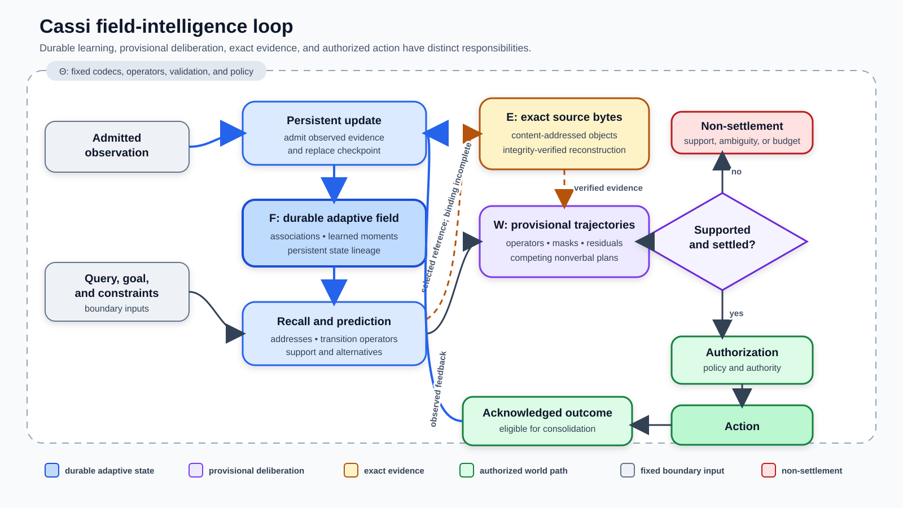

# Cassi Field Intelligence: Persistent Learning, Exact Evidence, and Transparent Nonverbal Deliberation

**Carina Gardner**  
Independent researcher  
Correspondence: [github.com/CassiTheOracle](https://github.com/CassiTheOracle)

**Version:** 0.1.0

**Keywords:** field intelligence; continual learning; associative memory; exact evidence; uncertainty; nonverbal reasoning; planning; interpretability; efficiency.

## Abstract

An intelligent agent must preserve experience, recover exact facts, recognize insufficient evidence, inspect its own decision process, and revise plans when the world changes. Cassi investigates an architecture in which these functions are organized around a persistent numerical field rather than reconstructed from scratch for every answer. Observations modify explicit field coordinates. Cue associations select separately preserved exact evidence. Learned forward and backward transition operators refine nonverbal trajectories between an observed state and a goal. Commitment depends on support, competing alternatives, residual error, constraint satisfaction, and stability, so a computation can terminate without forcing an answer. Because the field layout, operators, constraints, and state transitions are declared, internal traces can be tested by intervention rather than accepted as verbal rationales. The architecture could reduce repeated inference by retaining task-relevant state and reusing learned operators, but the current reference implementation has not demonstrated an efficiency advantage. Its experiments are small and bounded; they support causal participation of the field, persistence, correction, and constrained planning while exposing failures in unrestricted language and open-world generalization. This paper explains the mechanism and the architectural principles that survive changes in implementation.

## 1. The Architectural Question

Most AI systems treat learning, retrieval, reasoning, and action as separate subsystems. A language model supplies a pretrained transformer predictor [1]; a retrieval layer supplies documents; a prompt reconstructs task state; a chain of thought serializes intermediate steps; an agent loop executes tools; and an external store remembers what happened. Each component can work well, but their boundaries make six persistent problems difficult to solve together.

| Problem | Required capability | Cassi's response |
|---|---|---|
| Continual learning | Incorporate evidence without globally retraining or silently erasing prior behavior | Local field updates, multiple retention timescales, explicit interference and capacity |
| Exact factual recall | Recover the actual source, revision, quotation, or measurement | Associative cue-to-address selection plus a separate exact-evidence store |
| Recognizing uncertainty | Distinguish missing support, conflict, model mismatch, and exhausted search | Availability, margins, residuals, competing trajectories, and typed non-settlement |
| Internal transparency | Show which evidence and operations changed a decision | Declared coordinates, transition receipts, alternative plans, and causal interventions |
| Planning and revision | Anticipate consequences without expressing every intermediate state as prose | Forward/backward operators and constrained nonverbal trajectories |
| Efficiency | Preserve useful computation and spend new work on unresolved questions | Persistent state, local updates, reusable operators, and bounded deliberation |

These are architectural responses, not six completed performance claims. The central question is narrower:

> Can the adaptive consequences of experience, the provisional evolution of a thought, and the conditions for commitment be explicit parts of one persistent computation?

The useful unit is an episode:

\[
\text{observe}\rightarrow\text{learn}\rightarrow\text{recall}
\rightarrow\text{deliberate}\rightarrow\text{act}\rightarrow\text{observe}.
\]

An outcome returns to learning only after it has actually been observed. A predicted future remains provisional. A remembered association identifies possible evidence but does not manufacture the evidence. A supported action still requires authorization.

### 1.1 Four computational objects

Cassi separates four responsibilities:

\[
F_t:\text{ persistent adaptive field},\qquad
W_k:\text{ provisional thought},\qquad
E_t:\text{ exact evidence},\qquad
\Theta:\text{ fixed machinery and policy}.
\]

The field \(F_t\) contains experience-dependent persistent values. The workspace \(W_k\) holds a thought that may be revised or discarded. The evidence store \(E_t\) preserves source identity and bytes. Fixed codecs, update rules, validation, and authority policy belong to \(\Theta\).

\[
\begin{aligned}
F_{t+1}&=U_\Theta(F_t,o_t,r_t),\\
W_{k+1}&=T_\Theta(W_k;F_t,q,g,\mathcal C),\\
\hat a&=R_\Theta(W_k,F_t),\\
a_t&=\operatorname{Authorize}(\hat a,\pi_t).
\end{aligned}
\]

Here \(o_t\) is an admitted observation, \(r_t\) an acknowledged outcome, \(q\) a query, \(g\) a goal, \(\mathcal C\) constraints, and \(\pi_t\) authority policy.



**Figure 1.** Architectural responsibilities. Solid paths carry adaptive state and action; dashed paths select and verify exact evidence. The figure composes mechanisms. The current integrated local evaluation exercises a narrower agency path rather than every component shown.

This separation prevents three category errors:

1. a familiar association is not automatically a verified fact;
2. a predicted trajectory is not an observed event;
3. a supported action is not automatically an authorized action.

## 2. The Field as a Computational Medium

The native Qi reference stores a real tensor

\[
F\in\mathbb R^{S\times 9M\times B},
\]

with scales \(S\), modes \(M\), and batch dimension \(B\). Viewed as \([S,9,M,B]\), each scale contains two complex amplitudes, their complex velocities, and an imbalance statistic:

\[
(Y,\ I,\ V_Y,\ V_I,\ \bar\epsilon^2).
\]

The labels *Yang* and *Yin* name complementary amplitude sectors. Their meaning comes from the implemented coordinate transform and update laws; they are not claims that software cells are neurons or physical fields.

### 2.1 Differential and common coordinates

For a fixed positive coupling \(\phi\),

\[
D=Y-\phi I,\qquad C=\phi Y+I,
\]

with inverse

\[
Y=\frac{D+\phi C}{1+\phi^2},\qquad
I=\frac{C-\phi D}{1+\phi^2}.
\]

A write to \(D\) can therefore change the differential mode while preserving \(C\):

\[
\Delta Y=\frac{\Delta D}{1+\phi^2},\qquad
\Delta I=-\frac{\phi\Delta D}{1+\phi^2}.
\]

This gives sensing, correction, and intervention a declared direction. It does not make the field meaningful without a codec. A symbol codebook, cue encoder, relational representation, or transition observation determines what a coordinate means.

The reference oscillator advances each differential mode through a bounded damped nonlinear step,

\[
\begin{aligned}
V'_{D,s}&=e^{-\gamma_s\Delta t}V_{D,s}
-\Delta t\left(\omega_s^2D_s+\kappa|D_s|^2D_s\right),\\
D'_s&=D_s+\Delta t\,V'_{D,s}.
\end{aligned}
\]

Scales have different response rates. Writes enter a fast scale; consolidation can move supported content to slower coordinates. Read, write, and consolidation gates are separate, so field activity alone does not imply that a query is answerable.

The default implementation uses the golden ratio in its coordinate and scale schedule. This is a design choice. A special advantage over other schedules has not been established.

### 2.2 One owner, several operators

The persistent provider packs several components into one checkpoint:

\[
F_{\mathrm{owner}}
=F_{\Phi}\Vert F_{\mathrm{counterflow}}\Vert F_{\mathrm{mnemic}}.
\]

They share adaptive ownership and state lineage, not one universal update equation. The current code includes:

- native bounded field dynamics and phase-conjugate readout;
- harmonic context memory over fixed event codes;
- mnemic cue-to-address association;
- counterflow transition learning and planning;
- a narrow hashed feature/action controller used by the integrated local demonstration.

Fixed codecs and host control flow remain visible parts of the computation. They are not hidden learned intelligence, but they do constrain what the field can represent.

This is the durable architectural claim: experience-dependent state has an enumerable owner, provisional thought is distinguishable from learned memory, and every committed transition can identify its predecessor and successor. A tensor by itself would provide none of those properties.

## 3. Persistent Learning and Exact Evidence

### 3.1 A local associative update

Let \(q\in\mathbb R^C\) be a unit cue and \(b\in\{-1,+1\}^A\) the code of an exact source address. The mnemic controller interprets a slow field region as

\[
L\in\mathbb R^{A\times C}.
\]

It predicts \(p=Lq\) and deposits

\[
\Delta L=\eta(b-Lq)q^{\mathsf T}.
\]

For \(\eta=1\), ignoring clipping and multiscale transport,

\[
(L+\Delta L)q=b.
\]

The same equation exposes interference. For another cue \(q'\),

\[
\Delta Lq'=\eta(b-Lq)(q^{\mathsf T}q').
\]

Orthogonal cues do not interact in this idealized update; overlapping cues do. Continual learning is therefore not guaranteed by persistence. It depends on representation, load, retention, correction, and how overlapping updates affect earlier behavior [2,3].

The multiscale controller writes the correction to a fast bank and shifts it toward slower banks. For differential banks \(D_0,\ldots,D_{S-1}\),

\[
D'_0=0,\qquad
D'_s=D_{s-1},\qquad
D'_{S-1}=D_{S-2}+\lambda D_{S-1},
\]

followed by amplitude bounds. The parameter \(\lambda\) controls retention per update step. Revision can inhibit an old cue/address association and condense its replacement. Transition basins similarly support explicit outcomes—reinforce, separate, abstain, or report capacity—rather than requiring global retraining.

These operations make interference measurable and correction localizable. Capacity under realistic overlapping experience remains an empirical question.

### 3.2 Approximate relevance, exact bytes

“Factual recall” combines three different tasks:

1. select the relevant source and revision;
2. reconstruct exactly the bytes stored under that identity;
3. decide whether the source is trustworthy and applicable.

The field addresses the first. A content-addressed evidence store addresses the second. Neither settles the third.

The mnemic address is derived from a record ID, revision digest, byte span, and semantic kind:

\[
a=\operatorname{Trunc}_{128}
\left(\operatorname{SHA256}(\operatorname{Canonical}
(\mathrm{id},\mathrm{revision},\ell,r,\mathrm{kind}))\right).
\]

A deterministic cue codec maps normalized words, word pairs, and byte n-grams to \(q\). Given \(z=Lq\), candidate address \(b_j\) receives

\[
s_j=\frac{b_j^{\mathsf T}z}{\sqrt A\,\lVert z\rVert_2}.
\]

The controller returns an address only if absolute availability, best score, and best-versus-runner-up margin all pass their thresholds. It can therefore report no recall rather than return the least-bad candidate.

The address is a reference, not the fact itself. Exact ingress stores content-addressed chunks and verifies chunk hashes, byte count, and payload digest on reconstruction. This division allows a fallible relevance mechanism to point to immutable evidence instead of regenerating quotations, measurements, or identifiers approximately.

The current context path does not yet complete that composition: callers supply candidate manifests, and all revision/address bindings are not rederived against the exact store. The missing step is an authorized resolver that verifies the full identity, handles collisions and missing revisions, and returns the exact byte span. Until then, Cassi demonstrates associative address selection and exact ingress separately, not infallible end-to-end factual recall.

### 3.3 Continual revision

A revised source should not be averaged blindly with its predecessor. Its identity changes; policy determines whether the previous association remains historical, is inhibited, or should surface as a conflict. If two valid revisions remain unresolved, non-settlement is more informative than fluent synthesis.

This distinction also clarifies forgetting. Weakening an adaptive association, deleting source bytes, and proving erasure from backups are different operations. Field updates provide the first. Evidence retention and deletion remain storage-policy responsibilities.

## 4. Uncertainty and Nonverbal Planning

### 4.1 Uncertainty is a computational state

Uncertainty can arise from different failures:

| Condition | Observable signal |
|---|---|
| Missing learned support | Low availability or no eligible transition basin |
| Competing interpretations | Small margin or several valid trajectories |
| Model mismatch | Large prediction or constraint residual |
| Missing representation | Required distinction absent from the codec or candidate language |
| Exhausted search | No settlement within the declared refinement budget |
| Missing permission | Supported proposal rejected by authority policy |

These signals do not automatically choose the next action, but they identify whether the agent needs evidence, representation, computation, or permission.

The narrow agency controller illustrates support plus separation. Let \(s_{(1)}\) and \(s_{(2)}\) be its two highest action scores. It abstains when

\[
s_{(1)}\le 0
\quad\text{or}\quad
s_{(1)}-s_{(2)}<m_{\min}.
\]

This margin is not a probability. Neither are field coherence, energy balance, or plan entropy by themselves. Selective prediction and probabilistic calibration require separate evaluation [5,6].

### 4.2 Learning transitions

Counterflow learns from observed complex transitions \((x_i,y_i)\). A basin stores forward and backward moments,

\[
\begin{aligned}
G_f&=\mathbb E[xx^\dagger], & H_f&=\mathbb E[yx^\dagger],\\
G_b&=\mathbb E[yy^\dagger], & H_b&=\mathbb E[xy^\dagger],
\end{aligned}
\]

and reconstructs regularized operators

\[
A=H_f(G_f+\lambda I)^{-1},\qquad
B=H_b(G_b+\lambda I)^{-1}.
\]

The moments, support, and dispersion live in the field. \(A\) predicts forward; \(B\) constrains backward. They need not be exact inverses, particularly under partial observation or many-to-one dynamics.

### 4.3 Forward possibilities meet backward requirements

A plan is a trajectory

\[
X=(x_0,x_1,\ldots,x_H)
\]

with an observed start, a goal, and optional masked intermediate constraints. For candidate transition basin \(b\) on edge \(h\),

\[
r_{b,h}=
\frac12\left[
\operatorname{mean}|A_bx_h-x_{h+1}|^2+
\operatorname{mean}|B_bx_{h+1}-x_h|^2
\right].
\]

Candidates are weighted by \(\operatorname{softmax}(-\beta r)\). Forward operators ask what can follow the present state; backward operators ask what can precede a constrained future. Their disagreement identifies where a trajectory fails to satisfy both.

The provisional state contains numeric slot vectors, operators, masks, residuals, and competing plans. It need not render each refinement as language. This is the relevant contrast with explicit chain of thought [7]: language remains the interface and can present the final trace, while deliberation can retain simultaneous geometric and relational constraints.

Latent-reasoning systems also compute without emitting every intermediate token. Coconut recurs through hidden states [8], Latent Thought Flow samples variable-length continuous trajectories [9], and Latent Recurrent Thoughts iteratively refines proposed latents [10]. Cassi's distinctive goal is not “latent rather than verbal” alone. It is a persistent learned state plus an explicitly structured workspace whose operators, constraints, alternatives, and settlement tests are inspectable.

### 4.4 Refinement, settlement, and revision

Counterflow maintains ascending and descending lanes. A refinement step has the schematic form

\[
v^{k+1}=\mu_kv^k+\alpha(x_{\mathrm{target}}^k-x^k),
\qquad
x^{k+1}=\operatorname{Bound}(x^k+v^{k+1}).
\]

Host code also performs bounded exact or beam search over eligible transition basins. Field deliberation is therefore a combination of learned operators, provisional trajectories, residual-guided refinement, and explicit search—not an unconstrained physical relaxation that solves arbitrary planning.

A plan settles only when transition residuals and constraints pass, margins are adequate, trajectory change is small, the same plan remains stable, and search is not ambiguous. Otherwise it remains active, reports ambiguity, or exhausts its budget.

Persistent transition basins are checked not to change during provisional thought. Imagining a route therefore does not make that route learned evidence. After action, an acknowledged observation can reinforce a basin, separate a new regime, or leave an update unresolved. Revision often means discarding the old provisional trajectory, admitting the new state, and planning again.

This is a concrete alternative to rationalizing the first proposed plan. It remains bounded by the learned representation, candidate set, beam, horizon, and quality of observed transitions.

## 5. Transparency and Efficiency

### 5.1 From trace to causal account

Transparency has levels:

1. **Inspection:** read field values and diagnostics.
2. **Reconstruction:** recover inputs, operators, constraints, alternatives, and state transitions.
3. **Intervention:** remove or alter purported support and measure the effect.
4. **Semantic explanation:** explain why the relationship holds in the world and serves the user's objective.

Cassi directly targets the first three. A trace can expose candidate addresses, basin support, forward/backward predictions, residuals, margins, trajectory change, authorization, and state hashes. These quantities participate in the computation; they need not be invented afterward as a persuasive rationale. This matters because verbal chains of thought can omit influential factors or rationalize biased answers [11].

A receipt or heatmap is still not a causal explanation. The stronger test is a targeted counterfactual: remove the association supporting one source, lesion a necessary transition while preserving unrelated basins, change one constraint, or withhold an outcome acknowledgment. A matched unrelated intervention distinguishes specific support from general fragility.

Interpretability also depends on the codec. An address is interpretable through its source identity; a basin through its observed transitions; a harmonic coefficient through its codebook. If the representation omits a relevant variable, a fully inspectable computation can still be confidently wrong.

### 5.2 Where efficiency could come from

Efficiency belongs to the complete episode:

\[
C_{\mathrm{episode}}=
C_{\mathrm{encode}}+C_{\mathrm{retrieve}}+C_{\mathrm{deliberate}}
+C_{\mathrm{act}}+C_{\mathrm{learn}}+C_{\mathrm{persist}}.
\]

Field intelligence could save work in four concrete ways:

- persistent associations and operators need not be reconstructed from a full transcript;
- local outer-product and moment updates avoid global retraining;
- nonverbal trajectories avoid rendering every provisional state as prose;
- missing support or irresolvable ambiguity can terminate early.

These savings are hypotheses, not consequences of calling a tensor a field. The reference code also has substantial costs:

| Operation | Dominant cost |
|---|---|
| Dense native evolution | Linear in allocated field cells per step |
| Mnemic projection/update | \(O(AC)\) for address width \(A\) and cue width \(C\) |
| Candidate address comparison | \(O(JA)\) for \(J\) admitted addresses |
| Transition reconstruction | Dense \(d\times d\) inversion per basin |
| Planning | Operator applications plus exact or beam search; exhaustive paths can scale as \(K^H\) |
| Persistence and audit | State copying, validation, hashing, and checkpoint I/O |

The small retained resource comparison favored the simple baseline: both paths were correct on four cases, while the field path used 4,718,592 adaptive bytes and about 2.618 ms per case versus 180 bytes and 4.669 \(\mu\)s for nearest-neighbor storage. It was not a matched-capacity systems benchmark, but it rules out a measured efficiency claim from that experiment. Electrical energy and FLOPs were not measured.

Biological intelligence motivates persistent state, selective activity, multiple timescales, and reuse of learned structure [3,12]. It does not follow that a dense software field inherits the brain's efficiency. A credible comparison must measure equivalent adaptive tasks, error rates, storage, data movement, latency, and energy on real hardware.

## 6. What the Reference Implementation Establishes

The implementation is a set of field operators under one increasingly unified persistence boundary:

| Mechanism | Principal source |
|---|---|
| Native field state, sensing, bounded dynamics, readout, and consolidation | `cassi_qi_field.py` |
| Profile and transport conventions | `cassi_qi_profile.py`, `cassi_qi_transport.py` |
| Harmonic event memory | `cassi_phi_harmonic_language.py` |
| Cue-to-address association | `cassi_mnemic_condensation.py` |
| Transition basins and bidirectional refinement | `cassi_bilateral_counterflow.py` |
| Evidence-scoped planning and observed consolidation | `cassi_counterflow_runtime.py`, `cassi_counterflow_reasoner.py` |
| Finite typed abstraction | `cassi_generative_abstraction.py` |
| Persistent ownership, receipts, authorization, and recovery | `cassi_persistent_provider.py`, `cassi_canonical_runtime.py` |
| Exact ingress storage | `cassi_universal_data.py` |

The integrated local path performs:

```text
teach -> recall -> plan -> authorize -> execute
      -> observe -> correct -> restart
```

It uses a deterministic analytic world and a narrow hashed feature/action controller. Richer mnemic and counterflow mechanisms are implemented and evaluated separately. Packing them into one checkpoint does not show that all of them already cooperate in one general agent.

### 6.1 Preliminary observations

The retained experiments are deterministic bounded cases rather than population estimates:

| Observation | Result and interpretation |
|---|---|
| Sequential task gauntlet | 52/52 registered held-outs after sequential deposits; untrained field 0/52. Tasks used fixed representations and disjoint namespaces, so shared-capacity continual learning is not established. |
| Persistence and intervention | Exact tested CPU reload/replay; relevant lesions changed selected decisions while unrelated lesions preserved them. |
| Relational and program composition | Exact results in registered finite candidate spaces, including compatible-edge composition and bounded typed programs. Candidate languages and interpreters were supplied. |
| Natural continuation | 0/16 exact across compared paths; one autoregressive path falsely settled 16/16, while bounded paths abstained. No open-ended language capability is established. |
| Cross-view pairing | Registered JSON–raster and small paired-anchor tasks succeeded with shuffled controls. Broader semantic cross-view transfer remains unresolved. |
| Local action lifecycle | One observed effect and one field consolidation under the retained retry/recovery scenario; withholding observation left learned state unchanged. |
| Selective decision | Four known cases were correct and four unknown cases abstained in a tiny nonprobabilistic curve. This is not general calibration. |
| External integration | The authenticated live CassiFI–CassiCosmos adapter and windowed receipt are absent. |

The historical general-task readiness surface remains `not_ready`. The newer portable evaluation reports its own narrower results and retains two implementation blockers: matched resource telemetry and live external integration. Public-paper readiness is separate from general-system readiness.

### 6.2 Why the evidence still matters

The experiments do not demonstrate general intelligence. They answer a more basic question: does the declared adaptive field causally participate in the measured behavior?

Matched untrained states, field-zero controls, shuffled correspondences, lesions, withheld observations, exact reload, and restart receipts make that question testable. Negative results identify failures of representation or settlement rather than disappearing behind a fluent output.

## 7. What Remains Stable as the Design Evolves

Reference implementations become obsolete quickly. The useful content of this paper is therefore a set of invariants against which a successor can be tested:

1. **Adaptive ownership:** every learned persistent value has a declared owner.
2. **Evidence separation:** associative relevance and exact source recovery expose different guarantees.
3. **Provisional thought:** imagined states do not become evidence merely by being simulated.
4. **Bidirectional constraint:** planning can combine consequences from the present with requirements from the goal.
5. **Explicit settlement:** support, competition, residuals, and stability determine whether commitment occurs.
6. **Observed revision:** acknowledged outcomes, rather than predictions, update the durable model.
7. **Causal transparency:** a trace names quantities that can be intervened on.
8. **Measured efficiency:** resource claims include the whole adaptive episode and real hardware.

The next implementation can change the tensor layout, transport law, scheduler, world interface, or search strategy without changing these criteria.

The main unresolved tests are equally compact:

- capacity and interference under overlapping, recurring experience;
- an end-to-end verified context resolver from cue to authorized exact bytes;
- uncertainty and risk–coverage under realistic corruption and distribution shift;
- longer planning horizons, changing goals, failed actions, and uncertain models;
- explanation faithfulness under targeted interventions;
- matched time, memory, data-movement, and energy measurements;
- authenticated live interaction with an external field world.

### 7.1 Relation to prior work

Cassi combines established ideas rather than claiming each primitive as new. Recurrent and dynamical computation appear in neural fields, reservoir systems, and neural cellular automata [13–15]. Associative and distributed memory have precedents in Hopfield networks and vector-symbolic representations [16–19]. Retrieval-augmented generation separates model computation from evidence [4]; Titans studies test-time neural memory [20]. World models, active inference, and program synthesis connect latent state to planning [21–23]. ReAct and Toolformer connect reasoning to action [24,25].

The distinguishing research program is their composition under explicit state ownership: persistent learned coordinates, exact evidence, provisional nonverbal trajectories, typed non-settlement, and an observable action/learning loop.

## 8. Conclusion

Cassi treats intelligence as a persistent flow of constrained state rather than a sequence of isolated answers. Experience changes associative and transition structure. Exact evidence remains separately verifiable. Forward possibilities and backward requirements meet in provisional trajectories. Commitment occurs only when support, alternatives, constraints, and stability permit it. Observed outcomes then revise the state from which the next thought begins.

This makes six major AI problems parts of one inspectable computation: continual learning becomes controlled update and interference; factual recall combines relevance with exact source recovery; uncertainty appears in failed settlement; transparency becomes reconstructable and testable; planning becomes nonverbal and revisable; efficiency becomes preserved work rather than merely fewer displayed tokens.

The current implementation is bounded and sometimes inefficient. Its value is not a preliminary score, but a mechanism whose successes and failures can be located, measured, and replaced without losing the architectural question.

## Reproduction and Availability

Version 0.1.0 is bound to its source and release metadata. The corpus-free public release excludes private corpus bytes, trained and historical checkpoints, raw historical evidence, diagnostics, caches, and archived experiments. It contains the paper, rendered PDF, implementation source, fixed configuration, a synthetic public exchange, and verification receipts.

From the directory containing `prototype/`:

```powershell
python prototype/verification/public_release.py build --output cassifi-paper-public-1
python prototype/verification/public_release.py verify --root cassifi-paper-public-1
python prototype/verification/public_release.py smoke --root cassifi-paper-public-1
```

The smoke run uses no private corpus bytes and retains no generated checkpoint. `paper-version.json` and the manifests under `artifacts/portable-release/` bind the larger local evidence lineage. Each generated public release contains its exact inventory in *public-manifest.json*.

Source code and public metadata are licensed under Apache-2.0. The manuscript and original figure are licensed under CC BY 4.0. The intended repository is [github.com/CassiTheOracle/cassi](https://github.com/CassiTheOracle/cassi), under `CassiFI/prototype`.

## Author Declarations

**Author contributions:** Carina Gardner: conceptualization, methodology, software, investigation, visualization, writing—original draft, and writing—review and editing.

**Funding:** This work received no external funding.

**Competing interests:** The author declares no competing interests.

**Acknowledgments:** None.

**Data availability:** No private corpus bytes or corpus-derived trained checkpoints are included in the public release. The release records source identifiers, byte counts, and SHA-256 values so independently authorized users can bind lawfully obtained copies.

**Manuscript license:** CC BY 4.0. Copyright 2026 Carina Gardner. The manuscript and original figure may be shared and adapted with attribution under the [Creative Commons Attribution 4.0 International License](https://creativecommons.org/licenses/by/4.0/).

## References

[1] Vaswani, A., et al. (2017). **Attention Is All You Need.** [arXiv:1706.03762](https://arxiv.org/abs/1706.03762).

[2] Kirkpatrick, J., et al. (2017). **Overcoming catastrophic forgetting in neural networks.** *Proceedings of the National Academy of Sciences*. [doi:10.1073/pnas.1611835114](https://doi.org/10.1073/pnas.1611835114).

[3] McClelland, J. L., McNaughton, B. L., and O'Reilly, R. C. (1995). **Why there are complementary learning systems in the hippocampus and neocortex: Insights from the successes and failures of connectionist models of learning and memory.** *Psychological Review*. [doi:10.1037/0033-295X.102.3.419](https://doi.org/10.1037/0033-295X.102.3.419).

[4] Lewis, P., et al. (2020). **Retrieval-Augmented Generation for Knowledge-Intensive NLP Tasks.** [arXiv:2005.11401](https://arxiv.org/abs/2005.11401).

[5] Geifman, Y., and El-Yaniv, R. (2017). **Selective Classification for Deep Neural Networks.** [arXiv:1705.08500](https://arxiv.org/abs/1705.08500).

[6] Guo, C., Pleiss, G., Sun, Y., and Weinberger, K. Q. (2017). **On Calibration of Modern Neural Networks.** [arXiv:1706.04599](https://arxiv.org/abs/1706.04599).

[7] Wei, J., et al. (2022). **Chain-of-Thought Prompting Elicits Reasoning in Large Language Models.** [arXiv:2201.11903](https://arxiv.org/abs/2201.11903).

[8] Hao, S., et al. (2024). **Training Large Language Models to Reason in a Continuous Latent Space.** [arXiv:2412.06769](https://arxiv.org/abs/2412.06769).

[9] Zou, X., Huang, J., Li, J., and Zhou, P. (2026). **Latent Thought Flow: Efficient Latent Reasoning in Large Language Models.** [arXiv:2606.16222](https://arxiv.org/abs/2606.16222).

[10] Chen, Z., and Fu, J. (2026). **Latent Recurrent Thoughts: Recurrent Refinement of Proposed Latents for Reasoning with Frozen LLMs.** [arXiv:2609.01117](https://arxiv.org/abs/2609.01117).

[11] Turpin, M., Michael, J., Perez, E., and Bowman, S. R. (2023). **Language Models Don't Always Say What They Think: Unfaithful Explanations in Chain-of-Thought Prompting.** [arXiv:2305.04388](https://arxiv.org/abs/2305.04388).

[12] Attwell, D., and Laughlin, S. B. (2001). **An energy budget for signaling in the grey matter of the brain.** *Journal of Cerebral Blood Flow & Metabolism*. [doi:10.1097/00004647-200110000-00001](https://doi.org/10.1097/00004647-200110000-00001).

[13] Amari, S. (1977). **Dynamics of pattern formation in lateral-inhibition type neural fields.** *Biological Cybernetics*. [doi:10.1007/BF00337259](https://doi.org/10.1007/BF00337259).

[14] Maass, W., Natschläger, T., and Markram, H. (2002). **Real-time computing without stable states: A new framework for neural computation based on perturbations.** *Neural Computation*. [doi:10.1162/089976602760407955](https://doi.org/10.1162/089976602760407955).

[15] Mordvintsev, A., Randazzo, E., Niklasson, E., and Levin, M. (2020). **Growing Neural Cellular Automata.** *Distill*. [doi:10.23915/distill.00023](https://doi.org/10.23915/distill.00023).

[16] Hopfield, J. J. (1982). **Neural networks and physical systems with emergent collective computational abilities.** *Proceedings of the National Academy of Sciences*. [doi:10.1073/pnas.79.8.2554](https://doi.org/10.1073/pnas.79.8.2554).

[17] Ramsauer, H., et al. (2020). **Hopfield Networks is All You Need.** [arXiv:2008.02217](https://arxiv.org/abs/2008.02217).

[18] Plate, T. A. (1995). **Holographic reduced representations.** *IEEE Transactions on Neural Networks*. [doi:10.1109/72.377968](https://doi.org/10.1109/72.377968).

[19] Kanerva, P. (2009). **Hyperdimensional Computing: An Introduction to Computing in Distributed Representation with High-Dimensional Random Vectors.** *Cognitive Computation*. [doi:10.1007/s12559-009-9009-8](https://doi.org/10.1007/s12559-009-9009-8).

[20] Behrouz, A., Zhong, P., and Mirrokni, V. (2024/2025). **Titans: Learning to Memorize at Test Time.** [arXiv:2501.00663](https://arxiv.org/abs/2501.00663).

[21] Hafner, D., Lillicrap, T., Fischer, I., Villegas, R., Ha, D., Lee, H., and Davidson, J. (2019). **Learning Latent Dynamics for Planning from Pixels.** [arXiv:1809.01999](https://arxiv.org/abs/1809.01999).

[22] Friston, K., et al. (2017). **Active Inference: A Process Theory.** *Neural Computation*. [doi:10.1162/NECO_a_00912](https://doi.org/10.1162/NECO_a_00912).

[23] Ellis, K., et al. (2021). **DreamCoder: Bootstrapping inductive program synthesis with wake-sleep library learning.** *Proceedings of the ACM SIGPLAN Conference on Programming Language Design and Implementation*. [doi:10.1145/3453483.3454080](https://doi.org/10.1145/3453483.3454080).

[24] Yao, S., et al. (2022). **ReAct: Synergizing Reasoning and Acting in Language Models.** [arXiv:2210.03629](https://arxiv.org/abs/2210.03629).

[25] Schick, T., et al. (2023). **Toolformer: Language Models Can Teach Themselves to Use Tools.** [arXiv:2302.04761](https://arxiv.org/abs/2302.04761).
