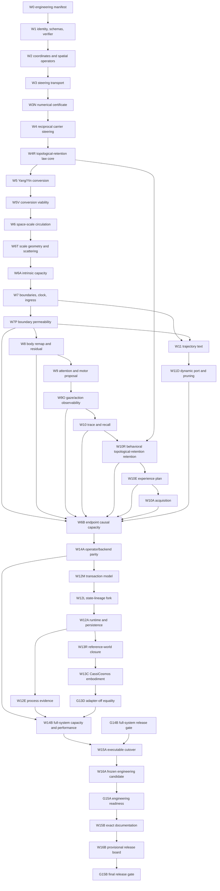

### Mandatory work packages and dependency graph

> CassiFI implementation plan, Part 10. [Previous](./09-backends-receipts-and-verification.md) · [Index](README.md) · [Next](./11-validation-gates.md)

## Mandatory work packages and dependency graph

Every work package is required. A failed validation may stop expensive
dependent execution, but it does not delete the package, redefine the endpoint,
or authorize a static substitute. The owning mechanism returns to engineering
until its required behavior works.

Shared-file integration is serialized, not negotiated during parallel work.
W1 is the primary integration owner for `cassi_qi_field.py`,
`cassi_qi_receipts.py`, and `verify_cassi_qi_flow.py`. W2-W6, W3N, W4R,
W5V, W6T, W7P, W9O, W10E, W11D, W12L, and W12M own only their explicitly
named operator/schema blocks and focused drivers/tests. W10R owns behavioral
retention and consolidation after the topological-retention core is installed by W4R.
W6A, W6B, and W10A supply versioned metric manifests, raw artifacts, and exact
verifier-extension inputs to W1; they do not edit the verifier. W12A is the
primary integration owner for `cassi_qi_flow.py` and serving composition;
W8-W10A own only named body/action/recall/acquisition symbol blocks. W13R is
the sole owner of `cassi_qi_world.py` and `run_cassi_qi_world_episode.py`;
W13C supplies fixed adapter configuration/fixture inputs and owns only the
separately authorized CassiCosmos adapter paths. W9 and W9O supply the
versioned action descriptor/scorer and no-peek observability interfaces both
world packages integrate. W16A/W16B consume the verifier read-only. W0 names
exact symbols and one primary owner for every shared path; concurrent packages
never edit the same file.

The Mermaid view is generated from the W0-owned hashed
`cassi.qi-flow-dependency-manifest.v1`; its source-section hashes must agree
with every package prose dependency and registry owner/consumer edge. No
second or hand-edited graph is authoritative.

### W0 — Map current truth and maintain the engineering manifest

**Owns:** the normative `CassiFI/` document-set index and cross-document
integration (`README.md`, `00-foundations.md` through
`13-requirements-registry.md`) plus the root
`CASSI-QI-FLOW-INTELLIGENCE-IMPLEMENTATION-PLAN.md` navigation pointer. The
root file is non-normative: it links to the split set and cannot define or
supersede a CassiFI requirement. Per-document prose remains with its named
owner (including W15B for README); W0 owns the set-level inventory and closure
map. W0 also owns `run_cassi_qi_flow_manifest.py`, the single hashed
`cassi.qi-flow-dependency-manifest.v1` object materialized as
`run-spec/dependency-manifest.json`, each selected run's exact
`<run-root>/index.json`,
`run-spec/{manifest,profile,semantic-subhashes,profile-projections,
schema-registry,source-identity,raw-retention-policy,capability-matrix,
toolchain,command-inputs}.json`, `historical/qi-v2/manifest.json`,
`historical/qi-v2/source-index.json`,
`historical/qi-v2/checkpoint-index.json`,
`historical/qi-v2/cassi-qi-language.json`,
`historical/qi-v2/run_cassi_qi_behavior_demo.py`, and the immutable
`historical/qi-v2/{source,checkpoints}/` trees. The dependency manifest is the
sole machine-readable authority for W/G/prose/registry nodes and edges:
Mermaid diagrams, prose dependency lists, and registry cross-references are
generated from it or checked against its hash.

**Work:**

- perform a read-only enumeration and hash of every current canonical caller,
  importer, test, config, checkpoint schema, profile/operator identity, old
  probe, and retained offline comparator;
- record the current target filenames, public symbols, schema strings, state
  layout, geometry/sign/normalization conventions, test/driver/artifact paths,
  fixtures, backend list, queue/resource budgets, and acceptance tree;
- classify every current `QiFieldController` caller as canonical migration,
  current flow development, historical/offline, or retired diagnostic;
- before W1 or any implementation package mutates a current source, config, or
  checkpoint, run the W0-owned manifest driver's `historical-bootstrap` phase
  against that reviewed exact inventory under the snapshot lock; copy every
  pre-cutover source/importer to
  `historical/qi-v2/source/<original-root-relative-path>` and write a
  canonically sorted `cassi.qi-flow-historical-v2-source-index.v1` entry
  `{original_path,historical_path,sha256,byte_count}` for each file;
- copy each checkpoint reachable from the frozen historical config/call graph
  byte-for-byte to `historical/qi-v2/checkpoints/<sha256>.bin` and write a
  canonically sorted `cassi.qi-flow-historical-v2-checkpoint-index.v1` entry
  `{original_path,historical_path,sha256,byte_count}` for each object;
- preserve the exact old config bytes at
  `historical/qi-v2/cassi-qi-language.json`, add the explicit historical
  wrapper, and bind the wrapper, config, both indexes, complete entry count,
  old command, required environment identity, and bootstrap-source hash into
  `cassi.qi-flow-historical-v2-manifest.v1`; reopen-verify every copied byte
  before releasing the lock. Once the snapshot exists, bootstrap mode becomes
  verify-only and cannot rewrite it;
- emit the dependency manifest before any package/gate run, with canonical
  node kinds (`work_package`, `gate`, `prose`, `registry`, `artifact`),
  ordered dependency edges, owner/consumer edges, and hashes of the source
  sections used to generate every graph view; reject a hand-edited Mermaid or
  prose/registry graph whose checked hash differs;
- maintain a source-file ownership map so core, boundary, runtime, receipt,
  serving, profiler, and verifier mutations do not overlap accidentally;
- record unresolved numerical coefficients as explicit engineering work, never
  as deployable zero/placeholders;
- regenerate a manifest diff whenever the design changes and migrate every
  affected profile, caller, test, and receipt in the same clean cutover;
- maintain `CassiFI/13-requirements-registry.md` as an index, not a second
  specification: each stable `QI-*` ID appears exactly once and names its owner
  document, implementing package, consuming gate, primary artifacts, and
  failure behavior; the W0/G15B documentation audit must cover every indexed
  CassiFI document and reject duplicate, missing, extra, or orphaned entries;
- keep the root monolithic plan as a navigation pointer only and reject any
  requirement, package, gate, or completion claim that exists there without a
  corresponding normative CassiFI document/registry entry.

**Dependencies:** none.

**Failure:** a missing or digest-invalid historical snapshot blocks W1 rather
than capturing already modified bytes. A missing, stale, or hand-edited
dependency graph blocks the affected graph-consuming gate. A later mismatched
source/profile/fixture hash invalidates only artifacts that consumed it. The
plan remains editable, and a manifest is regenerated deliberately rather than
rewritten automatically or treated as a scientific contract.

### W1 — Identity, profile, state, receipt, and verifier foundation

**Owns:** new `cassi_qi_profile.py`, `cassi_qi_receipts.py`,
`verify_cassi_qi_flow.py`, `cassi-qi-flow-development.json`, new
`test_cassi_qi_profile.py`, `test_cassi_qi_receipts.py`,
`test_cassi_qi_checkpoint.py`, migrated `test_cassi_qi_field.py`,
`run_cassi_qi_identity.py`, and v3 identity portions of `cassi_qi_field.py`.
W1 also owns the fixed
`cassi.qi-flow-contract-root-bootstrap.v1` parser/fixtures and the
`cassi.qi-flow-contract-root.v1` builder/validator and receipt inputs.

**Work:**

- implement and source-pin the non-profile-selectable root bootstrap framing,
  parser, byte/size limits, source/toolchain identity, and adversarial
  cross-language fixtures before any profile-selected codec is loaded;
- materialize and hash the descendant canonical codec identity, complete
  schema registry, projection registry, and all profile defaults before
  deriving the composite profile hash; bind the bootstrap plus those four
  identities and their ordered bytes into one
  `cassi.qi-flow-contract-root.v1` contract root;
- implement physical-grid maps, active/inactive declarations, DFT descriptors,
  `P/P†`, boundary registry, body/action/resource/backend descriptors, and
  derived stability validation;
- implement v3 raw state/hash/checkpoint schemas and v1/v2 hard rejection;
- implement domain-separated receipt builders/validators and independent
  verifier skeleton before runtime metrics;
- implement the state/lifetime inventory as import and checkpoint audits;
- make all state load paths validate finite values and hard budgets;
- make every profile, receipt, run manifest, and gate artifact carry the
  contract-root hash and reject a missing, reordered, or substituted codec,
  schema, projection, or materialized-default identity.

**Caller migration:** constructors can load the new profile for tests, but the
live terminal/provider does not cut over until W12A/W12E and W15A.

**Dependencies:** W0.

**Failure:** prior committed state remains unchanged; unknown/mismatched
identity or contract root is `PROFILE_MISMATCH`, never a fresh-state fallback.
The root cannot be repaired by changing a child hash in place; W1 mints a new
root and reruns G1 plus every consumer of the changed identity.

### W2 — Exact coordinates and spatial operators

**Owns:** coordinate/geometry helpers in `cassi_qi_field.py`,
new `test_cassi_qi_geometry.py`, and
`run_cassi_qi_geometry.py`.

**Work:**

- implement exact `Y/I/VY/VI <-> D/C/V_D/V_C` conversions and induced metric;
- implement physical active-sheet gather/scatter with zero spatial derivatives
  for declared inactive sites;
- implement unitary FFT/IFFT, `grad_x`, `grad_y`, Laplacian, cell-volume inner
  products, DC/Nyquist handling, and fixed translation;
- implement positive conservative scalar remap for `epsilon2_ema`;
- implement weighted restriction/prolongation and adjoint checks;
- expose no public state mutation.

**Dependencies:** W1.

**Failure:** shape/map/round-trip/adjoint/positivity error rejects profile or
operator construction before a field step.

### W3 — Steering-field transport and truthful diagnostics

**Owns:** split integrator, source admission, hard-bound policy,
`QiFlowDiagnostics`, and `QiFlowLedger` in `cassi_qi_field.py`;
new `test_cassi_qi_transport.py`; `run_cassi_qi_transport.py`.

**Work:**

- implement the analytic per-mode damped propagator, exact branch handling,
  symmetric split order, and velocity-Verlet local forces for `D,V_D`;
- implement the weighted projected-pseudospectral nonlinear operator and prove
  discrete potential/force consistency;
- derive the intrinsic transport envelope from the spectral symbol, nonlinear
  curvature, projection error, source budget, and intermediate split stages;
- replace `_bounded_parts()` with validate-before-commit failure;
- compute amplitude rate, phase rate, phase current, energy flux, centroid,
  divergence, local/global work closure, and bound counters;
- calibrate `mathcal R_J`, `mathcal R_P`, velocity-negation, reflection, and
  known traveling/standing-wave controls;
- remove `j_temporal`, `j_scale`, and readout-RMS interpretations from live
  flow evidence;
- keep boundary measurement unavailable until W7 rather than fabricating it.

**Dependencies:** W2.

**Failure:** any nonfinite, cap crossing, stability breach, or ledger residual
above the versioned tolerance retains the predecessor state and emits a failure
receipt.

### W3N — Offline numerical certificate and online guard

**Owns:** `QiNumericalCertificate` derivation/replay inputs in the W1 receipt
schema, `test_cassi_qi_numerical_certificate.py`, and
`run_cassi_qi_numerical_certificate.py`; W3N supplies the certificate and
guard fixtures to W1 without editing the independent verifier.

**Work:**

- establish the canonical `QiNumericalCertificate` section format and derive
  the complete intrinsic-W3 stability, positivity, source-admission, and
  work-closure enclosures offline from the registered transport law;
- make certification compositional without placeholders: W4, W4R, W5V, and
  W6T publish their completed composition, retention/barrier, conversion, and
  link/scattering sections only after owning laws exist, and every consumer
  rejects a certificate missing its required section;
- serialize expensive derivations separately from cheap online guard
  evaluations, including enclosure endpoints, rounding budget, and consumed
  subhashes;
- replay every accepted and rejected candidate independently from raw state
  and receipt inputs; online guards may reject before commit but may not
  replace the offline derivation, widen an interval, or silently clip a value;
- mutation-test coefficients, interval endpoints, dtype/backend, and guard
  decisions so the certificate's failure boundary is observable.
- extend the certificate only through immutable parent-linked
  `cassi.qi-flow-certificate-extension.v1` records; each extension names its
  parent certificate hash, owning law/package/gate, consumed subhashes, and
  completed section hash, and the final certificate carries a complete ordered
  section inventory with no implicit or placeholder section;

**Dependencies:** W3 and W1's receipt/schema foundation.

**Failure:** missing enclosure provenance, an online guard that disagrees with
the independent replay, a broken parent-linked extension chain, an incomplete
final section inventory, or an accepted out-of-bound/nonfinite state returns
the owning numerical law to engineering; no tolerance widening, fallback, or
post-hoc decision repair is allowed. A changed parent or law mints a new
extension chain and reruns G3N plus every dependent section/gate.

### W4 — Coherence carrier and differential steering

**Owns:** `C,V_C` propagation and composition-dependent steering in
`cassi_qi_field.py`; new `test_cassi_qi_carrier.py`;
`run_cassi_qi_carrier.py`.

**Work:**

- activate carrier position/velocity through the same state tensor and metric;
- implement the one reciprocal `U_composition(D,C,epsilon)` and both of its
  metric-gradient forces with no one-way coefficient-frequency surrogate;
- account for `W_D^composition+W_C^composition+Delta U_composition` explicitly;
- publish the completed composition-curvature/work section consumed by the
  shared `QiNumericalCertificate`; W3N owns its canonical container, not this
  law-specific derivation;
- run D-only, C-only, D+C, potential-off, imbalance-reversed, and zero controls;
- prove a matched directional imbalance changes carrier prediction before
  claiming steering.

**Dependencies:** W3N.

**Failure:** carrier remains implemented and inspectable. A missing directional
effect sends the composition law, coefficient range, or fixture back through
engineering revision; no unchanged carrier-steering claim proceeds downstream.
### W4R — topological-retention Hamiltonian and topology core

**Owns:** the topological-retention law core in `cassi_qi_field.py` (including
`QiTopologicalRetentionLaw`), its retention/topology profile fields and core receipts,
`test_cassi_qi_retention_core.py`, and `run_cassi_qi_retention_core.py`.
W4R is the sole installer of the topological-retention Hamiltonian/topology core; W10R owns
later behavioral retention and consolidation.

**Work:**

- install production `topological-v1` over the existing slow-scale
  `psi_topo,chi_topo` coordinates immediately after W4 and before conversion;
  topology is derived from the one `[S,9M,B]` field and adds no state;
- implement `U_topo`, its metric-gradient force, positive radial
  curvature/barrier certificate, winding/circulation sector algebra, and
  deterministic sector/reset receipt schema;
- include `U_topo` in the Hamiltonian, stability envelope, conversion, remap,
  passive reaction, backend, checkpoint, and work ledgers before W5 consumes
  them;
- establish the two memory tiers without a second state: within-sector analog
  acquisition remains field amplitude/phase flow, while topological
  consolidation is a receipted sector transition owned behaviorally by W10R;
- exercise zero/one-sector, phase-scrambled, matched-energy/opposite-current,
  barrier, branch-margin, and reset controls before conversion integration.

**Dependencies:** W4 and W3N.

**Failure:** undefined topology algebra, missing barrier/curvature, an
unreceipted sector/reset edge, an added adaptive tensor, or a topological-retention core that
is absent from conversion/work paths blocks W5 and returns the law to
engineering; fading-retention fading is diagnostic only.

### W5 — Integrated Yang/Yin conversion

**Owns:** conversion sub-operator and EMA semantics in
`cassi_qi_field.py`; new `test_cassi_qi_conversion.py`;
`run_cassi_qi_conversion.py`.

**Work:**

- replace public caller-supplied `convert_balance(rate,time_step)` with the
  profile-owned symmetric conversion substep;
- use the exact frozen-`Q` density relaxation:

  \[
  \alpha=e^{-(1+\phi)\lambda(1-Q)h},
  \qquad
  T=\frac{\epsilon}{1+\phi}(1-\alpha),
  \]

  \[
  \mathcal E_Y'=\mathcal E_Y-T,
  \qquad
  \mathcal E_I'=\mathcal E_I+T;
  \]

- preserve complex phases while rescaling amplitudes; if one sector is zero,
  use the nonzero sector's declared phase, and if both are zero remain zero;
- update `epsilon2_ema` once per complete field step, not once per half-step;
- report density transfer, full conversion-map wave/gradient/composition/link
  energy delta, and the single `W_conversion` row without duplicate internal
  composition/link work;
- remove capacity clipping/projection from nominal conversion.

**Dependencies:** W4R.

**Failure:** negative density, phase ambiguity outside the versioned rule, work
nonclosure, or more/less than the declared conversion count per field interval
rejects the candidate.

### W5V — Forward-viable conversion domain and physical memory time

**Owns:** conversion-domain and EMA-parameter fixtures,
`test_cassi_qi_conversion_viability.py`, and
`run_cassi_qi_conversion_viability.py`; W5V supplies the versioned viability
receipt to W1.

**Work:**

- map the accepted forward-viable domain of the frozen-`Q` conversion on
  balanced, imbalanced, near-boundary, heterogeneous, and multiscale states;
- freeze `epsilon_prog_min`, the `D_prog` and `D_neutral` subdomains, and the
  accepted `D_conv`/`A_accepted` predicates in the profile before any
  observation; prove every declared support cell maps into both `D_conv` and
  `A_accepted`;
- on `D_prog` prove a strictly positive signed progress margin; on
  `D_neutral` prove the bounded-transfer margin appropriate to the near-zero
  regime rather than imposing a uniform positive margin; exact balanced and
  zero-source controls remain exact no-ops;
- prove full density/energy/work closure for every admitted cell and retain
  the exact rejected intervals; if a cell cannot satisfy both predicates,
  revise the law/domain identity rather than normalizing repeated rejection;
- store physical `epsilon_memory_time` in the profile and derive the per-step
  EMA coefficient exactly as `1-exp(-h/epsilon_memory_time)`; do not persist a
  timestep-dependent coefficient as the physical parameter;
- retain raw accepted/rejected intervals, source/work ledgers, and mutation
  controls for map, timestep, memory time, EMA ordering, support boundaries,
  and unresolved-cell handling;
- bind the complete support-domain proof and its closed-domain hash into the
  `cassi.qi-flow-certificate-extension.v1` section consumed by G5V;
- prohibit support-domain shrinkage after observing outcomes: a narrower
  post-observation support is a new failed identity, not a passing repair;
- publish the completed conversion-domain/physical-time section consumed by
  the shared `QiNumericalCertificate`;

**Dependencies:** W4R and W5.

**Failure:** an empty, incomplete, or unexplained forward domain, a support
cell that fails `D_conv` or `A_accepted`, missing frozen
`epsilon_prog_min`/`D_prog`/`D_neutral`, absent positive signed margin on
`D_prog`, absent bounded-transfer margin on `D_neutral`, or broken exact
balanced/zero no-op control blocks conversion and returns the law to
engineering. Unresolved support, post-observation shrink, normalized
rejection, timestep-dependent physical memory, stale EMA, or non-equivalent
replay also fails; no fallback domain or uniform-positive-near-zero demand is
declared. A changed proof/predicate/support identity reruns W5V/G5V and all
descendants.

### W6 — Continuous space-scale circulation and truthful current diagnostics

**Owns:** link-force/operator blocks in `cassi_qi_field.py`;
`test_cassi_qi_cross_scale.py`; `run_cassi_qi_cross_scale.py`; and raw
space-scale/Hodge receipt inputs handed to W1.

**Work:**

- implement paired retained-subspace `P/P†` forces and link energy for `D` and
  the declared carrier link under the induced metric;
- compute signed phase-charge exchange `K_{Z,s->s+1}` and verify the discrete
  space-scale continuity law, internal cancellation, and separation from link
  energy/work;
- implement derived periodic-sheet Hodge `L/T/H` diagnostics with
  reconstruction, orthogonality, divergence, curl, flux, and circulation
  receipts;
- include cell-volume weights, source/target/link work, scale-local damping,
  link-off, exact `mathcal R_J`, `mathcal R_P`, and active-subspace adjoint
  impulse controls; the positive `g_s` is never sign-flipped;
- remove top-one `consolidate()`, strongest-symbol writes, and unavailable
  scale-agreement defaults.

**Dependencies:** W5V.

**Failure:** an unpaired gain, wrong adjoint sign, noncancelling charge/work,
decorative Hodge statistic, or top-one/static binding blocks this package.

### W6T — Scale geometry selection and scattering receipts

**Owns:** `scale_geometry_mode` comparison/selection fixtures,
`QiScatteringReceipt`, topology/codebook resolution fixtures,
`test_cassi_qi_scattering.py`, and `run_cassi_qi_scattering.py`; W6T supplies
scale/port receipt extensions to W1.

**Work:**

- run the registered like-for-like comparison of
  `temporal-full-rank` and `spatiotemporal-pyramid` under the same profile
  budget, horizons, source fixtures, endpoint probes, and periodic-sheet FFT
  convention; release sheets are explicitly periodic, while a future
  nonperiodic operator family requires distinct transform, metric, flux, and
  receipt identities;
- freeze the selection function and thresholds before either candidate runs.
  For mode `m`, with intervals for effective rank `r_m`, conditioning
  `kappa_m`, cross-talk `chi_m`, work `w_m`, and cost `c_m`, profile data fixes
  `(r_min,kappa_max,chi_max,w_max,c_max)` and
  `F(m)=(r_m^-,kappa_m^+,chi_m^+,w_m^+,c_m^+)`. A mode is feasible only when
  `r_m^- >= r_min`, `kappa_m^+ <= kappa_max`,
  `chi_m^+ <= chi_max`, `w_m^+ <= w_max`, `c_m^+ <= c_max`, and every
  required interval is resolved. Select the lexicographically greatest
  `r_m^-` then least `kappa_m^+`, `chi_m^+`, `w_m^+`, and `c_m^+`; an exact
  tie is resolved by the canonical mode ID, while overlapping/undecidable
  intervals or no feasible mode are deterministic `FAIL`, never post-run
  threshold tuning or folklore selection;
- record the frozen function, thresholds, both candidate results, selected
  mode, and decision identity in the scale-geometry comparison receipt; rank
  is measured evidence, never an assumption that capacity is 260 or the
  alphabet size;
- require every topology codebook used by the selected mode to be realizable
  at that resolution, resolution-scaled with the profile's active sheet, and
  preserved by zero-clock remaps; an unrealizable, unscaled, or remap-changing
  codebook is not a capacity witness;
- emit `QiScatteringReceipt` rows for incident, reflected, transmitted, and
  absorbed work at every scale and external port, with orientation, source/
  target identities, closure residual, and the complete work partition;
- publish the completed scale-link/scattering section consumed by the shared
  `QiNumericalCertificate`, making the production certificate complete before
  W6A;
- independently recompute selection and scattering from raw boundary/field
  trajectories and mutation-test mode, thresholds, orientation, port,
  topology resolution, and volatile telemetry fields.

**Dependencies:** W6 and W3N.

**Failure:** absent/ambiguous or post-hoc mode selection, a threshold-violating
or unresolved candidate, an undecidable tie, unregistered rank loss,
unrealizable topology codebook, non-positive or nonclosing scattering work,
double-counted port energy, or receipt replay mismatch blocks scale/port
integration and keeps all dependent capacity and boundary packages in
engineering. A changed selector, threshold, periodic operator, or comparison
parent reruns W6T/G6T and every descendant.

### W6A — Intrinsic reachability, observability, and dynamical capacity

**Owns:** `cassi.qi-flow-capacity-ladder.v1`,
`test_cassi_qi_capacity_dynamics.py`, `run_cassi_qi_capacity_dynamics.py`, and
versioned raw metric/fixture manifests supplied to W1's verifier integration;
W6A does not edit `verify_cassi_qi_flow.py`.

**Work:**

- audit the intrinsic state/operator system before any endpoint is assumed:
  coordinate, spatial-mode, fast-to-slow, slow-to-fast, and topology-to-fast
  impulse responses under analytic source/readout bases;
- compute effective controllability/observability rank, singular spectra,
  scale-link nullspaces, active/inactive leakage, group delay, perturbation
  growth, decay, retention, and discrimination;
- generate the capacity ladder only from exact canonical `advance()` trajectories
  under the frozen controller grammar, exact physical horizon, and
  nonnegative incident/source-work budget; reset, startup, and failed steps
  never count as acquisition;
- distinguish geometric allocated capacity, reachable capacity, observable
  capacity, usable capacity, retained capacity, and reusable capacity in the
  ladder, retaining the predicate, uncertainty/null threshold, predecessor,
  trajectory, and work receipt for every claimed rung;
- identify intrinsically dark or unstable modes and repair geometry, links,
  retention coefficients, or capacity before boundary/serving infrastructure;
- estimate state and workspace capacity from actual per-scale sizes and
  operators, never one nominal `N`; publish the ladder and raw witnesses for
  G6A/G6B/G6C consumers.

**Dependencies:** W6T.

**Failure:** an intrinsically unreachable, unobservable, numerically dark, or
unstable state; a capacity rung not generated by canonical `advance()`; a
negative/unknown work budget; reset counted as acquisition; or conflated
capacity classes is redesigned or removed from the capability surface. This
package cannot claim boundary-to-boundary usefulness. Changed grammar,
horizon, budget, or selector identity reruns W6A/G6A and all descendants.

### W7 — Fixed boundaries, rational clock, durable ingress, and passive egress

**Owns:** new `cassi_qi_boundary.py`, `cassi_qi_clock.py`,
`test_cassi_qi_boundaries.py`, modality/clock/journal-focused tests, and
`run_cassi_qi_boundaries.py`.

**Work:**

- implement strict optical, audio, text, proprioceptive, and actuator
  descriptors and packets with exact rational multirate intervals;
- implement the LCM-bounded causal clock, antialias profiles/receipts,
  half-open admission order, watermark, durable ingress journal or source-replay
  contract, and consume-after-Commit-A semantics;
- implement forward/metric-adjoint transforms, reconstruction, source work,
  common passive-egress preflight, physical ranges, collision, invalid/blank,
  orientation reversal, and equal-work controls;
- migrate fixed text codebook construction out of mutable core logic;
- reject labels, engineered/adaptive features, arbitrary caller gains,
  undeclared resampling, malformed/future/oversize packets, and host-time
  causality.

**Dependencies:** W6A and W6T.

**Failure:** packet rejection leaves state/cursor unchanged. Missing replay
retention, boundary collision, unexplained decoder ownership, or passive-work
failure blocks the affected boundary and never authorizes a learned encoder.

### W7P — Field-derived boundary permeability

**Owns:** `QiBoundaryPermeabilityProfile` integration in
`cassi_qi_boundary.py`, `cassi.qi-flow-sensory-openness.v1`, its fixed
modality/scale fixtures, `test_cassi_qi_boundary_permeability.py`, and
`run_cassi_qi_boundary_permeability.py`.

**Work:**

- define passive sensory coupling from declared field geometry, local metric,
  scale, and port orientation; the profile contains no learned encoder,
  labels, adaptive table, or hidden boundary state;
- calculate admitted, reflected, and absorbed work for each optical/audio/text/
  proprioceptive sensory packet and connect those rows to the
  `QiScatteringReceipt` scale/port ledger;
- publish `cassi.qi-flow-sensory-openness.v1` with incident-work-normalized
  openness, recovery after a closed/field-off interval, modality/scale
  coverage, uncertainty/null thresholds, and the exact packet trajectory;
- require every mandatory port to have positive incident-work-normalized
  openness and bounded recovery under the preregistered field-off,
  orientation-reversal, scale-isolation, equal-work, and closed-port controls;
  a port that remains blind cannot be cleared by permanent blindness or by a
  caller gain;
- verify forward/adjoint permeability, work closure, bounded ranges, and exact
  replay under field-off, orientation-reversal, scale-isolation, and
  equal-work controls;
- reject packets or profiles whose permeability would silently discard,
  duplicate, or invent work; no boundary may compensate with caller gains.

**Dependencies:** W7 and W6T.

**Failure:** missing field derivation, absent/negative normalized openness,
unrecovered mandatory port, unexplained admitted/reflected/absorbed work,
adjoint mismatch, hidden state/label path, or replay drift blocks the affected
boundary and all dependent action/text/world claims. A changed openness,
recovery, or port identity reruns W7P/G7P and descendants; no permanent-blind
exception is permitted.

### W8 — Body frame, prediction, applied efference, and residual return

**Owns:** new `cassi_qi_body.py`,
`cassi_qi_flow.py::QiBodyIntegrationHooks`, `test_cassi_qi_body.py`,
`test_cassi_qi_body_frame.py`, and `run_cassi_qi_body_residual.py`.

**Work:**

- implement body registration, guarded-periodic or finite-aperture remaps,
  transient predictions, applied-efference consumption, observed-successor
  timing, metric-adjoint residual return, and pre-correction metrics;
- scope exact self-motion cancellation to valid geometry and leave undeclared
  3-D parallax as exafferent residual;
- provide fixed `cassi.qi-flow-tick-ack.v1`
  applied/rejected/absent/offset/lagged fixtures with no world dependency; only
  terminal `applied` may produce the W8 efference/remap fixture;
- compare correct, absent, offset, mirrored, lagged, permuted, and reversed
  frames and `+e,-e`, zero, orthogonal, phase-scrambled, equal-work residuals;
- prove no pose, prediction, or residual tensor persists; only bounded
  identity required for exact restart may persist.

**Dependencies:** W7 and W7P.

**Failure:** missing successor context after restart produces an explicit
expired/failed chain; it never reconstructs prediction from transcript,
proposal, or a prior command.

### W9 — Field-owned attention and continuous motor proposal

**Owns:** `cassi_qi_flow.py::QiActionPlanner`, the action
descriptor/scorer/no-peek interface consumed by W13R/W13C,
`test_cassi_qi_attention.py`, `test_cassi_qi_motor.py`, and
`run_cassi_qi_attention_action.py`.

**Work:**

- implement finite geometry/cost candidates over one shared horizon,
  action-specific latency/slew, transient branches, uncertainty-aware hold, and
  the fixed world-blind `B_{r,a}` operator;
- implement continuous outgoing motor-current integration, full-Hamiltonian
  passive motor-port reaction with `world_effect=false`, transient
  `QiActionPrediction`, durable `QiActionProposal`, exact command intent, and
  separately committed `QiAppliedEfference`;
- enforce no-peek in API/import/call graphs and the unseen-consequence
  permutation fixture;
- run candidate-order, margin, `mathcal R_J`, `mathcal R_P`, `mu_flow=0`,
  prediction-frozen, direct-flow-only, null-current, timeout, duplicate,
  rejected, and applied controls.

**Dependencies:** W8 and W7P.

**Failure:** no valid candidate produces abstention; an unresolvable world
effect blocks advancement. A proposal counted as effect or any no-peek
violation rejects the action claim.

### W9O — No-peek finite-horizon gaze/action observability

**Owns:** the no-peek observability term and its receipt/fixtures in
`cassi_qi_flow.py::QiActionPlanner`, the
`cassi.qi-flow-action-discriminability.v1` offline evidence,
`test_cassi_qi_observability.py`, and `run_cassi_qi_observability.py`.

**Work:**

- add a finite-horizon observability-improvement term to gaze/action scoring:
  the term is computed from current committed field/input, fixed geometry, and
  the declared horizon, never from a candidate's future consequence;
- measure baseline and candidate trajectory-response rank, conditioning,
  uncertainty, and information gain with an explicit `no_peek` access log;
- evaluate paired worlds offline (same committed predecessor/input, distinct
  authenticated world response) and publish uncertainty/null-thresholded
  causal consequences in `cassi.qi-flow-action-discriminability.v1`; this
  receipt is evidence, not a runtime world channel;
- preserve the existing continuous motor proposal, passive reaction, and
  applied-efference separation while exposing the observability term as a
  deterministic scored component;
- mutation-test candidate order, consequence permutation, horizon, geometry,
  field-current, and no-peek call/import paths.

**Dependencies:** W9 and W7P.

**Failure:** an absent, nonfinite, or out-of-contract observability term,
future-consequence access, candidate-order dependence, unresolvable
uncertainty/null threshold, missing paired-world evidence, or a proposal
counted as world effect rejects the action/gaze path and every dependent
endpoint gate. A finite negative candidate term is a penalty, not by itself a
gate failure. Runtime telemetry never substitutes for the offline receipt;
changed geometry/horizon/thresholds rerun W9O/G9O and descendants.

### W10 — Field trace and cue-causal recall

**Owns:** `cassi_qi_flow.py::QiRecallCoordinator`,
`cassi.qi-flow-delayed-influence.v1`, `test_cassi_qi_memory.py`, and
`run_cassi_qi_memory.py`.

**Work:**

- distinguish fading trace, cue-causal recall, and checkpoint persistence;
- define initial horizons from slow frequencies/damping and measured reciprocal
  transfer without yet claiming topological-retention retention;
- implement cue-as-boundary, no-input continuation, predicted successor,
  residual return, and exact restart through W1's field-state fixture;
- measure delayed influence as offline evidence plus ordinary residual packets:
  publish lag, uncertainty/null threshold, direction, and work-normalized
  consequence in `cassi.qi-flow-delayed-influence.v1`, but persist no credit,
  eligibility, attribution, or other delayed-influence state;
- verify slow persistence, fast decay, slow-to-fast prediction, held-out
  successor closure, and shuffled/frozen/link-off/wrong-cue controls;
- audit checkpoint/import graphs for absence of KV, replay, matrices,
  transcript ingestion, and auxiliary EMA.

**Dependencies:** W6A, W8, and W9O.

**Failure:** missing or non-causal delayed-influence evidence, any persistent
credit/eligibility state, or missing recall returns field/link/horizon design to
engineering; no static memory module is added and a fading-retention result is labeled
fading retention. Changed horizon, evidence threshold, or source identity reruns
W10/G10/G10A and descendants.

### W10R — Behavioral topological-retention retention and consolidation

**Owns:** the behavioral retention/consolidation controller paths around
`QiTopologicalRetentionLaw`, `cassi.qi-flow-capacity-ladder.v1`,
`cassi.qi-flow-forgetting.v1`, `test_cassi_qi_retention.py`, and
`run_cassi_qi_retention.py`; receipt/verifier inputs are handed to W1.
W4R remains the sole owner of the topological-retention Hamiltonian/topology core installed
before W5.

**Work:**

- keep frozen fading-retention `fading-v1` as the comparator and exercise production
  topological-retention `topological-v1` behavior over the existing slow-scale
  `psi_topo,chi_topo` coordinates;
- generate topological-retention reachable capacity only from exact canonical `advance()`
  trajectories under the frozen controller grammar, exact physical horizon,
  and nonnegative incident/source-work budget; reset never counts as
  acquisition;
- separate geometric, reachable, observable, usable, retained, and reusable
  capacity, retaining the predicate, uncertainty/null threshold, predecessor,
  trajectory, and work receipt for every claimed rung;
- separate within-sector analog acquisition (continuous field amplitude/phase
  flow) from topological consolidation (receipted sector/basin transition);
  both tiers use the one field tensor and add no buffer, key, replay, matrix,
  optimizer, or other adaptive state;
- require admitted residual work, a certified phase slip/basin transition,
  source-free residence, reciprocal slow-to-fast return, exact restart, and
  controller-only `retention_reset`; publish dynamical reachability and
  forgetting/recovery curves in `cassi.qi-flow-forgetting.v1`;
- measure topology algebra, reachable basin capacity, saturation, overwrite,
  interference, and recovery, plus winding/circulation diversity and
  below/above-barrier perturbations;
- compare equal-work fading-retention, phase-scrambled, matched-energy/opposite-current,
  wrong-cue, links-off, branch-margin, amplitude-floor, and reset controls;
- fail rather than fall back to fading retention when behavioral topological-retention
  retention or consolidation is unavailable.

**Dependencies:** W10 and W4R.

**Failure:** absent selective acquisition, a rung not reachable on an exact
  canonical trajectory, negative/unknown incident work, reset counted as
  acquisition, conflated capacity class, unreceipted sector change, hidden
  basin selector, unmeasured capacity/saturation/overwrite/recovery, broken
  forgetting evidence, or fading-retention substitution blocks the endpoint and returns
  the behavior to engineering. A changed grammar/horizon/budget/topology
  identity reruns W10R/G6B/G6C and all descendants.

### W10E — Frozen field-experience plan

**Owns:** `QiFieldExperiencePlan`, `test_cassi_qi_experience_plan.py`, and
`run_cassi_qi_experience_plan.py`; W10E supplies the immutable experiment plan
and checkpoint-selection receipt to W1/W10A.

**Work:**

- freeze exact byte streams and deterministic world streams, profile/clock
  identities, packet timing, admitted work budgets, and causal port schedules;
- define whole-episode (never per-packet) train/validation/held-out splits,
  pre-exposure, washout, stopping rule, restart/interference phases, and
  checkpoint-selection rule before experience runs;
- bind the plan to raw input hashes, horizon/delay counts, fading-retention controls,
  topological-retention topology controls, and the selected field checkpoint without adding
  learning state or an optimizer;
- reject post-hoc split, timing, budget, stopping, or checkpoint changes by
  digest and retain every plan mutation as a failed receipt.

**Dependencies:** W10R.

**Failure:** mutable streams/timing/budgets, packet-level leakage, absent
washout/stopping/checkpoint rule, or a plan that can be rewritten after seeing
held-out outcomes blocks acquisition and invalidates all descendants.

### W10A — Field experience, acquisition, and interference

**Owns:** `run_cassi_qi_experience.py`,
`test_cassi_qi_acquisition.py`, and versioned acquisition metrics/raw inputs
supplied to W1; W10A does not edit `verify_cassi_qi_flow.py`.

- implement pre-exposure, ordinary repeated experience, washout, partial cue,
  held-out transfer, `A -> B -> A`, delay, and restart phases with separately
  registered within-sector analog and topological-consolidation arms;
- require admitted residual work and reciprocal slow-to-fast causal return for
  every claimed acquisition; classify a valid unchanged-sector effect as
  within-sector analog acquisition, and require a receipted topological-retention phase
  slip/basin transition only for the designated durable-consolidation arm;
- measure next-event curves, work-normalized improvement, analog retention,
  topological-retention residence, consolidation, generalization, interference, and
  recovery;
- compare equal-work one-shot, shuffled, mispaired residual,
  phase-scrambled, fading-retention, link-off, diagnostic return-off, wrong-cue, and
  matched-energy/opposite-current controls.

**Dependencies:** W8, W9O, W10, W10R, and W10E.

**Failure:** trace/recall without selective acquisition is a failed endpoint.
No future unspecified mechanism, optimizer, learned matrix, replay, template,
or fading-retention fallback is attached.

### W11 — Trajectory-owned text boundary

**Owns:** `cassi_field_language.py`, `test_cassi_qi_text_flow.py`,
`test_cassi_field_language.py`,
`measure_cassi_field_language_dependence.py`, and
`run_cassi_qi_text_flow.py`.

**Work:**

- retain the exact 260-symbol codec and calibrate its overcomplete probe frame
  on the selected `N_0`, including Gram/rank/frame-bound/collision/cross-talk
  receipts and temporal sampling/refinement bounds;
- migrate source symbols to timed, journaled boundary packets;
- implement integrated signed outflow, terminal-positive trajectory gates,
  reaction-feasible candidate selection, calibrated raw-runner/null margin,
  full-Hamiltonian passive reaction, and orientation controls;
- implement fixture-local immutable text event/result chains, canonical UTF-8
  tail flush, controls, and failed-cycle no-byte semantics; W12A alone owns
  session persistence, API response, restart, and streaming;
- remove static `emit()`, direct tensor reaction, self-sensed output, and
  reaction-failed winner selection from the live call graph.

**Dependencies:** W7 and W7P.

**Failure:** unavailable or uncertain flow abstains. All-abstention is a null
capability result; invalid UTF-8 follows the one codec rule and neither path
falls back.

### W11D — Dynamic port frame and exact reaction pruning

**Owns:** `QiDynamicPortFrame` calibration/receipt inputs,
`cassi.qi-flow-text-ownership.v1`,
`cassi.qi-flow-text-codebook-packing.v1`,
`test_cassi_qi_dynamic_port.py`, and `run_cassi_qi_dynamic_port.py`; W11D
supplies frame, interval-certification, field-state-necessity, and codebook
packing artifacts to W1 and does not edit the runtime verifier.

**Work:**

- measure trajectory-response rank, conditioning, singular spectrum, and
  cross-talk of the actual text port at the selected `N_0`, horizon, sampling
  schedule, and field profile;
- bind frame probes to timed boundary packets and `QiScatteringReceipt`
  incident/reflected/transmitted/absorbed work, retaining raw trajectories and
  null/control arms;
- run the field-state-necessity intervention with the same boundary packets
  and frozen controller: intact `QiFieldState.field` versus field-off/frozen/
  phase-permuted controls, with no learned embedding, neural layer, optimizer,
  replay, sidecar state, or Qwen fallback; publish the intervention and
  ownership decision in `cassi.qi-flow-text-ownership.v1`;
- pack the selected text codebook only after uncertainty-aware rank,
  separation, conditioning, cross-talk, and resolution checks; publish
  `cassi.qi-flow-text-codebook-packing.v1`. Rank is measured evidence and is
  neither automatically 260 nor automatically the alphabet cardinality;
- implement exact interval-certified reaction pruning over each candidate's
  feasibility inequalities; certify that pruned evaluation is
  decision-equivalent to exhaustive evaluation, including ties, empty sets,
  interval overlap, and uncertainty abstention;
- mutation-test frame order, intervals, reaction bounds, cross-talk,
  field-state intervention, codebook packing, and candidate permutations; a
  pruning shortcut may not alter a committed byte.

**Dependencies:** W11, W3N, W6T, and W7P.

**Failure:** rank/conditioning/cross-talk is unmeasured or outside the
declared envelope, field-state necessity is not demonstrated against its
controls, codebook separation/packing has overlapping uncertainty, interval
certification is absent, or pruned and exhaustive decisions differ; text
returns to engineering and no heuristic, alphabet/rank assumption, or
unbounded exhaustive fallback is silently accepted. A changed frame,
intervention, or codebook identity reruns W11D/G11/G11D and descendants.

### W6B — Endpoint causal capacity and multimodal closure

**Owns:** `cassi.qi-flow-capacity-ladder.v1`,
`test_cassi_qi_capacity_endpoints.py`, `run_cassi_qi_capacity_endpoints.py`,
boundary-transfer/multimodal-binding raw artifacts, and verifier-extension
inputs handed to W1.

**Work:**

- audit the complete nonlinear boundary-to-boundary, boundary-to-text,
  boundary-to-action, topology-to-boundary, and applied-effect paths at
  declared horizons;
- emit the complete finite-intervention transfer table, per-coordinate
  reachability/observability, ranks/spectra/nullspaces, work, delays, and
  propagated uncertainty;
- add endpoint capacity rungs only from exact canonical `advance()` trajectories
  under the frozen controller grammar, exact physical horizon, and nonnegative
  incident/source-work budget; reset and uncommitted proposals never count;
- preserve separate geometric, reachable, observable, usable, retained, and
  reusable labels and their uncertainty/null predicates; a geometric rung
  without a reachable committed consequence is not an endpoint capability;
- require equal-work multimodal binding improvements against modality-alone,
  shuffled, lagged, mirrored, transfer-permuted, phase-current-reversed,
  fading-retention, and matched-energy/opposite-current controls;
- reject allocated but dark modes, unobservable topological sectors, negative
  or unknown-work trajectories, and effects that stop at a proposal or
  uncommitted event.

**Dependencies:** W7, W7P, W8, W9, W9O, W10, W10R, W10E, W10A, W11, and W11D.

**Failure:** any required causal surface that lacks an observable committed
consequence, any noncanonical/reset-counted capacity rung, or any conflated
capacity class returns its owning boundary/law/capacity to engineering before
backend and serving work. Changed grammar/horizon/work/selector identity
reruns W6B/G6B/G6C and descendants.

### W12M — Explicit transaction-model exploration

**Owns:** `QiTransactionModelReceipt`,
`cassi.qi-flow-indeterminate-world-effect.v1`, the bounded model explorer,
`test_cassi_qi_transaction_model.py`, and
`run_cassi_qi_transaction_model.py`; W12M supplies the Commit A/Commit B model
and crash/replay evidence consumed by W12A and W1.

**Work:**

- enumerate the bounded explicit state of predecessor head, ingress cursor,
  response, proposal, outbox, terminal acknowledgement, applied efference,
  retry key, quarantine marker, external-effect truth, authentication proof,
  and sealed-indeterminate lineage;
- explore every declared crash/replay interleaving around Commit A and Commit B
  with two competing callers (including caller A/Caller B CAS races), duplicate
  request/tick, process restart, network loss, stale acknowledgement, and
  outbox recovery;
- model unknown external application truth as a sealed indeterminate lineage:
  it cannot be cleared into normal continuation, and only an exact
  authenticated resolution receipt may resolve it without changing lineage;
- emit `QiTransactionModelReceipt` plus
  `cassi.qi-flow-indeterminate-world-effect.v1` transitions, invariants,
  resolution proof, terminal effects, and replay classes independently
  recomputable from model inputs; prove at most one applied world effect and no
  dropped committed response;
- mutation-test commit ordering, idempotency identity, cursor advancement,
  caller interleaving, crash point, authentication proof, and replay input; no
  runtime implementation may weaken a model transition to make the receipt
  pass.

**Dependencies:** W14A.

**Failure:** incomplete state bounds, unexplored crash/replay/CAS class,
unknown truth incorrectly resumed, missing exact authentication, duplicate or
dropped terminal effect, non-authoritative predecessor, or receipt/runtime
disagreement blocks W12A and all world/provider release claims. A changed
transaction state, caller schedule, or resolution rule mints a new artifact
and reruns W12M/G12M/G12A and descendants.

### W12L — State-lineage fork receipt

**Owns:** `QiStateLineageForkReceipt`, lineage/profile compatibility fixtures,
`test_cassi_qi_state_lineage.py`, and `run_cassi_qi_state_lineage.py`; W12L
supplies the fork evidence consumed by W12A and W1.

**Work:**

- permit an explicit new-session fork only when profile differences do not
  reinterpret the exact field bytes; compare `state_contract_sha256`, the
  complete ordered registry-declared state-consuming subhash set, layout/
  operator/schema/backend identities, the source-profile contract, and the
  checkpoint bytes/hash exactly. The complete `profile_sha256` is expected to
  differ and is never substituted for those semantic comparisons;
- record parent session/head, exact field-state bytes/hash, every differing
  non-state-consuming profile leaf, compatibility proof, fork reason, and
  new-session identity in a `QiStateLineageForkReceipt`;
- reject in-place reinterpretation, silent migration, automatic state
  conversion, profile drift, or a fork that changes the meaning of any exact
  field byte; preserve the parent session read-only;
- replay accepted and rejected forks independently and mutation-test every
  state/profile/source identity used by the compatibility proof.

**Dependencies:** W12M and W14A.

**Failure:** any ambiguous profile difference, missing exact-byte proof, silent
  fork, parent mutation, or mismatched replay blocks session creation/resume
  and returns lineage handling to engineering.

### W12A — Unified flow runtime, terminal, provider, and persistence

**Owns:** `cassi_qi_flow.py`, `cassi_conscious_chat.py`,
`run_cassi_conscious_chat.py`, `cassi_persistent_provider.py`,
`conscious-chat.json`, `run_cassi_qi_artifact_cleanup.py`,
`test_cassi_qi_artifact_cleanup.py`, `test_cassi_conscious_chat.py`,
`test_cassi_persistent_provider.py`, `test_l21_provider_api.py`,
`test_l21_restart_lineage.py`, `test_l24_l25_provider_policy.py`,
`test_l26_provider_flow.py`, `test_cassi_qi_live_runtime.py`,
`run_cassi_qi_live_runtime.py`, and `run_cassi_qi_outbox_recovery.py`.

**Work:**

- implement lock-free bounded request/path/session validation, immutable
  prepared requests, and state-dependent create/resume/idempotency CAS only
  after acquiring the exact session lock;
- implement durable ingress journal/source-replay consumption and the two
  transaction protocol: Commit A publishes successor/cursors/response/proposal
  and at most one outbox; Commit B publishes terminal tick acknowledgement and
  applied efference;
- consume the bounded `QiTransactionModelReceipt` and
  `cassi.qi-flow-indeterminate-world-effect.v1` before enabling Commit A/B;
  runtime crash injection and replay must remain inside the explored state
  space and preserve terminal-effect and lineage-seal invariants;
- exercise two competing callers through Commit A and Commit B CAS
  interleavings; only one predecessor can commit, and retry/replay of either
  caller is idempotent;
- when external application truth is unknown, seal the indeterminate lineage
  and stop normal continuation; clear/resume is permitted only after the exact
  authenticated resolution receipt validates, otherwise preserve the seal and
  return an explicit indeterminate result;
- consume `QiStateLineageForkReceipt` for every new-session fork; only the
  receipt's explicit non-reinterpretation proof may authorize a profile
  difference, and the parent field bytes remain immutable;
- persist only bounded source/world/body/prediction identities needed for exact
  restart, enforce source identity and root ACL/quota/retention, and release the
  lock before blocking I/O;
- migrate terminal/provider completion and exact precommitted SSE to stored
  W11 events under `cassi.qi-flow-openai-api.v1`;
- implement request/tick idempotency, applied-efference consumption markers,
  candidate/save/assign semantics, crash injection, outbox recovery, and
  orphan quarantine; terminal efference is emitted only for `applied`, never
  proposal/rejection/unknown;
- implement digest-exact cleanup planning, operator-approved quarantine/purge,
  confinement/drift rejection, and immutable cleanup receipts;
- enforce loopback, HTTP/session/resource schemas and expose exact health,
  profile, source, world, head, backend, ownership, and failure identities;
- remove live baseline/Qwen-displacement imports and smoke fresh, restart,
  retry, concurrent, malformed, crash-window, and stream/nonstream paths.

**Dependencies:** W14A, W12M, and W12L.

**Failure:** Commit A remains all-or-nothing, the prior head/cursor stays
authoritative on failure, no success or `[DONE]` is sent for an uncommitted
cycle, and no outbox/efference is dropped, invented, or replaced. Unknown
external truth always yields a sealed
`cassi.qi-flow-indeterminate-world-effect.v1` lineage; an unauthenticated or
missing resolution cannot resume it. A two-caller CAS mismatch, crash/restart
divergence, response/outbox loss, malformed-input mutation, or cleanup
confinement drift blocks W12A/G12A and reruns W12M plus the affected runtime
exercise.

### W12E — Independent process and source evidence

**Owns:** `run_cassi_qi_process_evidence.py`,
`verify_cassi_qi_process_evidence.py`, `cassi-qi-flow-etw.wprp`, and raw
Qwen-zero source/process evidence.

**Work:**

- independently verify live imports/modules/file reads/process ancestry,
  sockets, model/GGUF/Qwen/KV counters, checkpoint identity, and trace coverage;
- start tracing before runtime import and retain bounded raw evidence;
- measure terminal/provider startup, fresh request, restart, retry, and
  shutdown on the current executable composition;
- keep this verifier outside the runtime and receipt builder;
- provide the same frozen commands for mandatory post-W15A rerun by W16A.

**Dependencies:** W12A.

**Failure:** missing coverage blocks process-evidence and release claims until
repaired; earlier field mechanics remain attributable only to their own
receipts.

### W13R — Deterministic reference-world closure

**Owns:** `cassi_qi_world.py`, `test_cassi_qi_world.py`,
`test_cassi_qi_grounding.py`, `run_cassi_qi_world_episode.py`, and
`QiWorldTransportServer`.

**Work:**

- implement the analytic bounded reference world with canonical optical/audio/
  proprioceptive truth, finite actions, distractors, occlusion, exact state
  seed/snapshot/tick-log identity, and no labels visible to runtime;
- implement the kind-specific authenticated world wire, rational multirate
  schedule, mandatory null/action intents, replayable terminal acknowledgement,
  reconnect, backpressure, and retained idempotency truth;
- run the identical provider text schedule with the episode/session/tick
  identity alongside sensing, proposal, applied effect, successor prediction,
  efference, residual, topological-retention retention/acquisition, and actuator consequence;
- distinguish field-local provider restart from full world restart and require
  exact world-state replay for the latter;
- verify held-out rendering/position/order/occlusion, object motion, reconnect,
  duplicate tick, rejected/applied command, and no-peek consequence permutation.

**Dependencies:** W12A.

**Failure:** broken transaction or causal closure returns the owning mechanism
to engineering. The world never supplies labels, policy, candidate
consequences, or future observations.

### W13C — CassiCosmos multimodal embodiment

**Owns:** CassiQwen-side `CASSI-QI-WORLD-ADAPTER-BRIEF.json`,
`test_cassi_qi_world_adapter_contract.py`,
`test_cassi_qi_adapter_off_identity.py`,
`verify_cassi_qi_adapter_off_identity.py`,
`run_cassi_qi_cassicosmos_baseline.py`, and fixed adapter configuration and
fixture inputs consumed by the W13R-owned `run_cassi_qi_world_episode.py`; and,
only under the separately authorized brief,
`../CassiCosmos/scripts/cassi_qi_world_adapter.gd`,
`../CassiCosmos/scenes/qi_world_adapter.tscn`, and
`../CassiCosmos/scenes/verify_qi_world_adapter.tscn`.

**Work:**

- implement the default-off adapter for raw viewport/audio/pose capture and
  bounded camera/body action application without another Qi field;
- use the same clock, tick intent, kind-specific wire, descriptor, passive
  proposal, applied-efference, body-frame, no-peek, and text schedule as W13R;
- run the exact CassiQwen orchestration driver against the focused windowed
  Godot scene and retain both process/wire artifact trees;
- before any adapter source edit, run
  `run_cassi_qi_cassicosmos_baseline.py` and freeze the exact command, raw
  battery logs, receipt, trace, anchor, battery-output bytes, and digest index
  under `<run-root>/inputs/raw/g13c-pre-adapter/`; require byte-for-byte equality
  after W13C with the adapter disabled.
- emit the adapter-off equality inputs for G13D as exact deterministic
  artifacts (raw receipt, trace, anchor, battery output, and wire bytes);
  only schema-declared volatile telemetry may use a deterministic projection,
  whose mutation controls must prove it cannot hide an adapter difference.

**Dependencies:** W13R plus the path-level cross-repository ownership brief
before any CassiCosmos edit.

**Failure:** missing authorization/hardware is `BLOCKED`; an adapter defect is
repaired. The reference world cannot substitute for this required endpoint,
and a merely green/numerically similar disabled battery is insufficient.

### W14A — Operator/backend parity and decision margins

**Owns:** `cassi_qi_backend.py`, `test_cassi_qi_backend.py`, the complete
`profile_cassi_qi_flow.py` implementation and CLI (operator-parity and
full-system modes), calibration/integrated capacity profiles, and backend
receipt artifacts.

**Work:**

- after W6B freezes every operator and decision interface, implement prepared
  operators, preallocation, canonical state copies, batching, allocation/
  synchronization receipts, and both frozen profiler modes;
- verify CPU float64 reference, CPU float32, and ROCm float32 parity for every
  stage, stability envelope, retention/topology transition, boundary/reaction,
  action score, text decision, and endpoint metric;
- validate batched candidates against independent trajectories and derive
  guard bands from measured backend error;
- prohibit silent fallback, backend-dependent topology rounding, and
  backend-uncertain discrete decisions.

**Dependencies:** W6B, W7P, W8, W9, W9O, W10A, W10E, W11, and W11D.

**Failure:** missing ROCm execution, unbounded allocation, parity error, or
uncertain decision returns its operator/profile to engineering before serving.

### W14B — Full-system capacity, performance, and long horizon

**Owns:** `benchmark_cassi_qi_flow.py`, `cassi-qi-flow.json`, final
capacity-selection/performance artifacts, and the compiled-code decision
receipt. It invokes `profile_cassi_qi_flow.py` read-only through W14A's frozen
full-system CLI; any profiler change returns to W14A.

**Work:**

- profile the complete terminal/provider/reference-world/CassiCosmos system at
  measured candidate capacities;
- rerun endpoint capacity, topological-retention horizon, CPU/ROCm parity, request-level cold
  and warm `p50/p95/max`, allocation/copy/sync, packet/event bytes, checkpoint
  durability, long-horizon stability, and queue-pressure checks;
- select the release capacity from actual collision, causal reachability,
  retention, resource, and throughput evidence;
- make the compiled-code decision without weakening any law or ownership gate.

**Dependencies:** W14A, W12E, W13C, and G13D.

**Failure:** a budget miss, all-abstention endpoint, dark capacity, unstable
long horizon, missing required backend, or failed/missing adapter-off equality
is repaired before a release profile can be selected; G13D cannot be deferred
or replaced by a numerical-similarity claim.

### W15A — Executable clean cutover and caller migration

**Owns:** every executable caller/config/test identified in W0 and the source
removals required by the clean cutover. It consumes but never modifies W0's
immutable `historical/qi-v2/` snapshot. It does not edit `README.md`.

**Work:**

- migrate every canonical caller to profile/packet/advance/decision APIs and
  the one W12A persistence owner;
- remove old live `evolve`, `convert_balance`, `consolidate`, `cycle(learn)`,
  static `emit`, pre-flow aliases, hidden overrides, and baseline startup;
- quarantine historical/offline callers behind versioned no-live-import
  boundaries;
- treat old `_diag` bytes as immutable historical evidence: write a new
  content-addressed quarantine/index receipt without renaming, deleting, or
  mutating those old artifacts;
- before migrating a caller, reopen-verify W0's historical manifest, both
  indexes, exact wrapper/config, every source copy, and every checkpoint object;
  any drift blocks cutover and never causes the snapshot to be refreshed from
  already modified live bytes;
- keep the historical wrapper executable only against manifest-named frozen
  sources/config/checkpoints in its explicit historical environment;
- verify one adaptive tensor/flow owner and no legacy/learned/native/Qwen
  alternative, then freeze exact documentation facts for W15B.

**Dependencies:** W14B, G14B, and W0's immutable historical snapshot.

**Failure:** a stale caller, alias, fallback, incompatible loader, competing
adaptive owner, executable config drift, or historical-snapshot mismatch blocks
candidate creation.

### W15B — Exact release documentation

**Owns:** `README.md` and non-executable examples only.

**Work:** after W16A emits `status=PASS` with
`engineering_ready=true`, update commands, profile IDs, limits,
capability/unsupported surfaces, topological-retention retention, world startup, and
evidence locations to exactly that candidate. Any executable/config/profile/
fixture change returns to W15A and creates a new candidate. W15B does not
emit engineering readiness and cannot clear a failed or unrun engineering
gate.

**Dependencies:** W16A and G15A.

**Failure:** stale, aspirational, or under-declared documentation, or a
documentation change that alters executable identity, blocks W16B; executable
changes return to W15A/W16A rather than being hidden in prose.

### W16A — Independent frozen engineering-candidate board

**Owns:** `test_cassi_qi_release.py`, `run_cassi_qi_release.py`,
`run_cassi_qi_validation.py`, candidate manifests, post-cutover evidence index,
and `candidate/engineering-board.json`. `verify_cassi_qi_flow.py` remains
W1-owned and read-only.

**Work:**

- after W15A, freeze one candidate identity over the complete executable source
  map, live configs, profile/projection/subhashes, contract-root,
  dependency-manifest hash, schema registry, capability matrix, fixtures,
  authorized cross-repo paths, backend/toolchain, environment allowlist, exact
  commands/arguments, and raw-retention policy;
- exclude README/non-executable prose from this engineering freeze, except any
  documentation byte that is also a live config/input;
- rerun every required gate and all launch/process/import/performance/restart/
  security evidence against this post-cutover candidate; pre-W15A evidence may
  guide debugging but cannot satisfy the candidate;
- independently verify graph closure against the hashed dependency manifest,
  controls, topological-retention receipts, checkpoints, caller cutover, Qwen-zero evidence,
  world effects, resources, and every external capability-matrix row;
- on failure return the owning package and invalidate every changed descendant;
  emit machine `status=PASS` with `engineering_ready=true` only for an
  internally consistent candidate; otherwise emit `status=FAIL` or
  `status=BLOCKED` with `engineering_ready=false`. This board makes no
  documentation claim.

**Dependencies:** W15A.

**Failure:** any required row not `PASS`, or any frozen-input drift, prevents
engineering readiness and cannot be waived by the candidate; it does not
pretend to certify prose.

### W16B — Provisional documentation release board

**Owns:** `verify_cassi_qi_requirements_registry.py`, the typed
`<run-root>/gates/g15b-release/readme-verification.json`,
`<run-root>/provisional-release-board.json`, and
`<run-root>/provisional-release-result.json` objects.

**Work:** after W15B, verify every documented command/path/profile/limit and
capability against W16A's immutable engineering board, hash the documentation
surface, and emit `cassi.qi-flow-readme-verification.v1`,
`cassi.qi-flow-release-board.v1`, and
`cassi.qi-flow-release-result.v1` with registered parents, fixtures, limits,
and object-index entries. The two release objects are explicitly provisional:
they have `final_release_ready=false` and cannot be overwritten after G15B.
If only prose is corrected, rerun this board; if executable identity changes,
return to W15A/W16A.

**Dependencies:** W15B.

**Readiness rule:** every required capability-matrix row and mechanical check
is `PASS`; unavailable required hardware/authorization is `BLOCKED`; unrun is
`NOT_RUN`; either blocks provisional release. W16B never writes final release
status. Optional rows may remain explicitly unsupported. The provisional board
is an immutable input to G15B, not a lock on future engineering.

## Post-cutover research campaigns (not mandatory work packages)

These six cards are runnable only after G15B has emitted final release
readiness. Each card starts from an immutable release-candidate
`contract-root`/dependency-manifest pair, runs in an offline child process, and
records a new research run root with the card inputs, exact command/config,
field-state hashes, raw trajectories, controls, result, and rerun parent.
During a card the sole adaptive object remains
`QiFieldState.field` `[S,9M,B]`; there is no learned embedding, neural layer,
optimizer, replay buffer, sidecar state, Qwen fallback, live policy, or
mutation of the released profile. A failed, blocked, or unrun card cannot
change, delay, weaken, or reopen G15 release, and no card result is a runtime
fallback. Every card uses the same incident/source-work accounting and
uncertainty/null thresholds as the released profile.

### Field-selected practice

- **Frozen inputs and run:** choose a preregistered finite practice set,
  profile/contract-root, field checkpoint, canonical controller grammar,
  physical horizon, and nonnegative incident-work budget before execution;
  select practice order only from the frozen field-derived selector and run
  held-out sequences with exact `advance()` trajectories.
- **Controls and evidence:** compare equal-work shuffled order, phase-scrambled
  field, fading-retention fading, wrong-cue, reset-before-run, and source-replay arms;
  retain field hashes, work ledger, trajectory-response rank, retention,
  transfer, and uncertainty/null-thresholded held-out outcomes.
- **Result and rerun:** PASS means the preregistered improvement and
  reciprocal slow-to-fast consequence exceed its positive margin without a
  reset/acquisition violation; null or unresolved evidence is FAIL/INDETERMINATE.
  Any changed sequence, budget, grammar, horizon, or checkpoint mints a new
  research run and reruns from the same immutable parent.

### Body-model adaptation

- **Frozen inputs and run:** freeze one released body geometry/frame, rational
  clock, perturbation schedule, sensor/actuator ports, and held-out body
  trajectories; adapt only the field through canonical boundary work while
  recording exact body-frame and residual packets.
- **Controls and evidence:** use no-adaptation, mirrored-frame,
  time-shuffled, phase-scrambled, equal-work, and held-out geometry controls;
  preserve no-peek access logs, applied-only efference, body residuals, and
  field hashes. No body parameter, pose history, or predictor may become
  persistent state.
- **Result and rerun:** PASS means preregistered residual reduction and
  reciprocal field-to-body consequence remain above positive
  uncertainty/null margins on held-out geometry; otherwise FAIL/INDETERMINATE.
  A changed body/profile/clock identity reruns from the unchanged released
  checkpoint and never alters the live body adapter.

### Source-free rest/consolidation

- **Frozen inputs and run:** select a completed incident-work practice episode,
  then execute a fixed source-free residence and recall horizon with no
  boundary/source packets; use only the field and declared topological-retention law. The
  controller-only retention reset is a separately hashed control and never
  occurs in the production rest trajectory.
- **Controls and evidence:** compare fading-retention fading, phase-scrambled,
  matched-energy/opposite-current, link-off, reset-before-rest, and wrong-cue
  arms; record sector/basin identity, winding/phase, decay, zero external
  incident/source work, the complete internal/damping energy ledger, and
  reciprocal slow-to-fast return.
- **Result and rerun:** PASS means the preregistered retained/reusable
  consequence survives source-free rest and is recoverable with positive
  uncertainty-aware margins without counting reset as acquisition; otherwise
  FAIL/INDETERMINATE. A changed residence/horizon/grammar reruns the isolated
  card and cannot add persistence to the release runtime.

### Causal lesion atlas

- **Frozen inputs and run:** enumerate a preregistered Cartesian set of
  field-coordinate, scale-link, boundary-port, and topology lesions; for each,
  clone the release checkpoint, apply exactly one declared field/operator
  intervention, and run the same canonical trajectory and physical horizon.
- **Controls and evidence:** include sham lesions, all-zero/field-off,
  orientation reversal, equal-work, phase permutation, and lesion-order
  controls; record paired-world offline discriminability, reachability/
  observability, work, delay, and uncertainty/null intervals without exposing
  lesion identity to runtime scoring.
- **Result and rerun:** PASS means every atlas cell is resolved or explicitly
  FAIL/INDETERMINATE with a causal consequence and no-peek log; unresolved
  cells cannot be silently omitted. A changed lesion set, resolution, or
  threshold reruns all affected cells from the same parent; no lesion is a
  production fallback or permanent mutation.

### Factorized composition

- **Frozen inputs and run:** freeze a factorial design over declared field
  geometry, modality, scale, topology, and timing factors, with equal-work
  source budgets and held-out combinations; execute each cell through the
  canonical field-only `advance()` path.
- **Controls and evidence:** include modality-alone, factor-shuffled,
  lagged/mirrored, phase-current-reversed, fading-retention, matched-energy, and
  zero-factor controls; publish main effects, interaction contrasts, causal
  delays, work ledgers, rank/conditioning, and propagated uncertainty.
- **Result and rerun:** PASS means preregistered interaction contrasts exceed
  positive uncertainty/null margins on held-out combinations and remain
  attributable to committed field trajectories; otherwise FAIL/INDETERMINATE.
  Any factorial level, schedule, or budget change reruns the affected matrix
  and does not create a learned factor table or runtime composition policy.

### Cross-profile scaling laws

- **Frozen inputs and run:** choose at least three released, contract-rooted
  profiles spanning preregistered resolutions/scales, freeze each codec/schema/
  projection/default identity, controller grammar, physical horizon, and
  normalized work budget, and generate every rung from exact canonical
  `advance()` trajectories.
- **Controls and evidence:** use resolution refinement, zero-clock remap,
  periodic-sheet, fading-retention, matched-work, and held-out-profile controls; fit
  only the preregistered analytic scaling family to raw capacity, rank,
  conditioning, delay, retention, openness, and cost intervals. Rank is not
  assumed to be 260 or alphabet size.
- **Result and rerun:** PASS means the selected law predicts held-out
  profiles within its preregistered uncertainty/null and resource margins;
  unresolved or nonperiodic-family cases are FAIL/INDETERMINATE and require a
  distinct transform/metric/flux identity. A changed profile/resolution/
  scaling family reruns from unchanged roots, never tunes a release profile or
  inserts live fallback/state.

