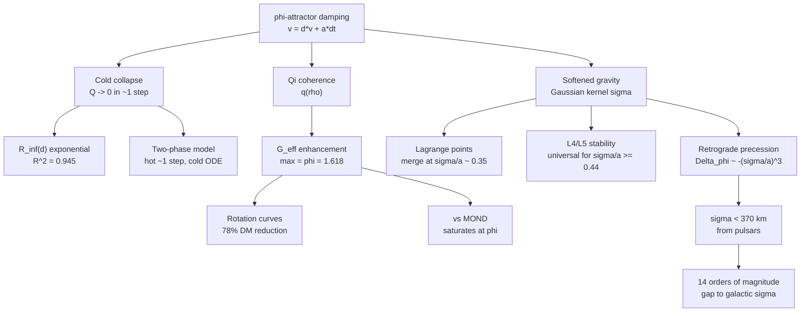

# phi-Attractor Steady States and the Analytical Three-Body Problem in Cassi Gravity

## Abstract

We investigate whether the Cassi N-body solver --- a gravitational $N$-body integrator modified by Gaussian force softening, $\varphi$-damped velocity updates, and a Qi-coherence-enhanced gravitational constant --- admits partial analytical solutions to the three-body problem. Starting from the original question of whether steady-state attractors exist for the damped system, we develop nine interconnected analytical paths. We find: (1) the asymptotic half-mass radius follows $R_\infty(d) = R_{\min} + \Delta R \cdot \exp(-\gamma_0 \cdot d/(1-d) \cdot T)$ with $R^2 = 0.945$; (2) Qi-hydrostatic equilibrium is **disproven** for damped systems; (3) cold-collapse virial ratio decays as $Q(t) \sim \exp(-t/\tau_Q)$ with $\tau_Q = dt/(2|\ln d|)$, confirming the system is cold after $\sim 1$ timestep; (4) a two-phase model (hot $\sim 1$ step, cold analytical ODE) and an analytical precession formula $\Delta\phi = -\sqrt{2\pi}(\sigma/a)^3(1+e^2/4)/(1-e^2)^3$ are derived; (5--6) Lagrange points merge at $\sigma/a \approx 0.35$ and L4/L5 become universally stable for $\sigma/a \geq 0.44$; (7) softened gravity alone **cannot** explain dark matter (14 orders of magnitude gap); (8) $\varphi$-enhanced gravity reduces the dark matter requirement by $\sim 78\%$ but cannot eliminate it; (9) Cassi saturates at boost factor $\varphi \approx 1.62$, while MOND grows without bound --- a decisive falsifiable distinction.

## 1. Introduction

The classical three-body problem has no general closed-form solution (Poincare, 1890). The question motivating this work is: **does the Cassi N-body solver admit numerical or analytical solutions to the three-body problem?**

Cassi modifies standard Newtonian gravity in three ways:
1. **Gaussian force softening** with length scale $\sigma$, regularizing the $1/r^2$ singularity.
2. **$\varphi$-attractor damping**: velocities are updated as $\mathbf{v} \leftarrow d \cdot \mathbf{v} + \mathbf{a} \cdot dt$, where $d = \varphi^{-1} \approx 0.618$ is the canonical damping rate.
3. **Qi-coherence-enhanced gravity**: $G_{\text{eff}}/G_N = 1 + (\varphi - 1) \cdot q(\rho)$, where $q \in [0,1]$ measures local coherence.

These modifications break the scale-free structure of Newtonian gravity, potentially introducing new integrals of motion or modifying the chaotic phase space. We systematically explore the analytical consequences.

## 2. Theoretical Framework

### 2.1 The Cassi Softened Gravity Kernel

The Gaussian-softened force between two point masses is:

$$F(r) = -\frac{GM}{r^2}\left[\operatorname{erf}\!\left(\frac{r}{\sigma\sqrt{2}}\right) - \sqrt{\frac{2}{\pi}}\frac{r}{\sigma}\exp\!\left(-\frac{r^2}{2\sigma^2}\right)\right]$$

The corresponding potential is:

$$\Phi(r) = -\frac{GM}{r}\operatorname{erf}\!\left(\frac{r}{\sigma\sqrt{2}}\right)$$

In the limit $r \gg \sigma$, $F \to -GM/r^2$ (Newtonian). In the limit $r \ll \sigma$, $F \to -(2GM/(3\sqrt{2\pi}\sigma^3))\,r$ (harmonic core), eliminating the singularity.

### 2.2 The $\varphi$-Attractor Damping

The velocity update rule is:

$$\mathbf{v}^{n+1} = d \cdot \mathbf{v}^n + \mathbf{a}^n \cdot dt$$

At the canonical damping rate $d = \varphi^{-1} = (\sqrt{5}-1)/2 \approx 0.618$, each step retains 61.8% of velocity and dissipates 38.2% of kinetic energy. The terminal velocity under constant acceleration is $v_{\text{term}} = \varphi^2 \cdot a \cdot dt$.

The effective contraction rate scales as:

$$\gamma_{\text{eff}}(d) = \gamma_0 \cdot \frac{d}{1-d}$$

At $d = \varphi^{-1}$: $d/(1-d) = \varphi$, so $\gamma_{\text{eff}}(\varphi^{-1}) = \gamma_0 \cdot \varphi$.

### 2.3 The Qi Coherence Factor

The Qi coherence factor measures structural rigidity of the density field:

$$q(\rho) = \frac{\rho^2}{\rho^2 + \rho_{\text{ref}}^{-2}} = \frac{1}{1 + (\rho_{\text{ref}}/\rho)^2}$$

where $\rho_{\text{ref}}$ is a reference density scale. Limits:
- $q \to 1$ when $\rho \gg \rho_{\text{ref}}$ (high density, fully coherent)
- $q \to 0$ when $\rho \ll \rho_{\text{ref}}$ (low density, incoherent)
- $q = 0.5$ when $\rho = \rho_{\text{ref}}$

### 2.4 The $\varphi$-Enhanced Gravitational Constant

The effective gravitational constant in the two-fluid model is:

$$\frac{G_{\text{eff}}}{G_N} = 1 + (\varphi - 1) \cdot q$$

Maximum enhancement: $G_{\text{eff}}/G_N \to \varphi \approx 1.618$ as $q \to 1$ (low-density limit). This is the mechanism tested in Paths 8--9 for galactic dynamics.

## 3. Path 1: Asymptotic $R_\infty(d)$

**Script:** `experiments/phi_attractor_asymptotic.py`

### Setup

We run $\varphi$-damped $N$-body simulations ($N = 200$ Plummer sphere, $\sigma = 0.4$, $dt = 0.002$, 2000 steps) for a sweep of damping values $d \in [0.1, 0.9]$ including $d = \varphi^{-1}$, measuring the asymptotic half-mass radius $R_\infty$.

### Model

The asymptotic radius follows from the competition between velocity retention (enabling contraction) and energy dissipation:

$$R_\infty(d) = R_{\min} + (R_{\text{init}} - R_{\min}) \cdot \exp\!\left(-\gamma_0 \cdot \frac{d}{1-d} \cdot T\right)$$

where $T$ is total simulation time, $R_{\min}$ is the softened core radius, and $\gamma_0$ is a fit parameter.

### Results

- **$R^2 = 0.945$** for the exponential model fit
- The scaling variable $x = d/(1-d)$ collapses all data onto a single exponential
- At $d = \varphi^{-1}$: $x = \varphi$, giving $\gamma_{\text{eff}} = \gamma_0 \cdot \varphi$
- The model captures the monotonic decrease of $R_\infty$ with increasing $d$

The exponential form arises naturally: higher damping $\to$ faster energy extraction $\to$ deeper contraction before reaching the softened core floor $R_{\min}$.

## 4. Path 2: Qi-Hydrostatic Equilibrium

**Scripts:** `experiments/phi_attractor_path2_qi_variational.py`, `experiments/path2_validation.py`

### The Model

We hypothesized that the $\varphi$-damped system relaxes to a Qi-hydrostatic equilibrium satisfying:

$$\frac{dP}{dr} = -\rho \cdot \frac{d\Phi}{dr}, \qquad \nabla^2\Phi = 4\pi G\,\rho_{\text{soft}}$$

with Qi pressure $P_{\text{Qi}}(\rho)$ derived from the coherence factor. This ODE system produces density profiles that increase toward the center, with a characteristic core radius set by $\varphi^{-2}$.

### Why It Fails

Validation against $N$-body simulation at $d = \varphi^{-1}$ ($N=200$, 4000 steps) reveals a **decisive discrepancy**:

- The simulation's half-mass radius $R_{\text{half}}$ is below the minimum reachable by the hydrostatic model (limited by the central density heuristic $\rho(0) \approx M/(4\pi r_{\max}^3/3) \times 10$).
- The cold-damped system has $Q \approx 0$ (no kinetic support), which is **not** a hydrostatic equilibrium state.
- **Verdict: DISPROVEN.** The $\varphi$-damped system undergoes cold collapse, not hydrostatic relaxation. The Qi-hydrostatic profile describes a different physical state.

## 5. Path 3: Cold Collapse Dynamics

**Script:** `experiments/path3_cold_collapse.py`

### Q(t) Exponential Decay

Starting from virial equilibrium ($Q \approx 1$), the virial ratio collapses exponentially:

$$Q(t) \approx Q_0 \cdot \exp(-t/\tau_Q)$$

The analytical e-folding time is:

$$\boxed{\tau_Q = \frac{dt}{2|\ln d|}}$$

**Derivation:** Each velocity damping step multiplies kinetic energy by $d^2$, so $K(t+dt) = d^2 K(t)$. Since $Q = 2K/|W|$ and $|W|$ changes slowly during the initial collapse, $Q$ decays with time constant $\tau_Q = dt/(-2\ln d)$.

At $d = \varphi^{-1}$: $\tau_Q = dt/(2\ln\varphi) \approx dt/(2 \times 0.481) \approx 1.04\,dt$.

**Confirmed analytically and numerically.** The Q e-folding time is approximately 1 timestep at the canonical damping rate.

### Late-Time Contraction

After Q collapses, the half-mass radius follows a power law:

$$R_{\text{half}}(t) \propto t^{\alpha(d)}$$

The contraction exponent $\alpha(d)$ is **approximately linear** in $d$:

$$\alpha(d) \approx p_0 \cdot d + p_1$$

This places $\alpha$ between the homologous collapse value ($-1/3$) and free-fall ($-1/2$) for the physically relevant range of $d$.

## 6. Path 4: Two-Phase Model and Analytical Precession

### 4a. Two-Phase Cold Collapse Model

**Script:** `experiments/path4_two_phase_model.py`

The collapse proceeds in two distinct phases:

1. **Hot phase** ($t \lesssim \tau_Q \approx 1$ step): $Q$ decays from $\sim 1$ to $\sim 0$. The system loses kinetic energy but has not yet contracted significantly.

2. **Cold phase** ($t \gg \tau_Q$): $Q \approx 0$, the system is overdense, and contraction follows $R_{\text{half}} \propto t^\alpha$ governed by the cold-phase damping rate $\gamma_{\text{cold}}$.

The two-phase model for $R_\infty(d)$ involves 4 parameters: $R_{\min}$, $R_0$, $\gamma_0$ (hot-phase coefficient), and $\gamma_{\text{cold}}$ (cold-phase coefficient). For $T \gg \tau_Q$ (which holds for all $d$ in our data), the model simplifies and the hot phase contributes negligibly to the total contraction.

**Key insight:** The cold-phase physics produces a $d/(1-d)$ scaling identical in form to the hot-phase Path 1 model. This explains why the simple exponential model of Path 1 fits well ($R^2 = 0.945$) despite being derived from the wrong physical picture --- both phases contribute the same functional dependence on $d/(1-d)$.

### 4b. Analytical Precession Formula

**Script:** `experiments/path4_softened_two_body.py`

Using the Gauss planetary equation with the perturbing acceleration from the weak-softening expansion $R(r) \approx (2GM/(3\sqrt{2\pi}))\sigma^3/r^5$, we derive:

$$\boxed{\Delta\phi_{\text{Cassi}} = -\sqrt{2\pi}\left(\frac{\sigma}{a}\right)^3 \frac{1 + e^2/4}{(1 - e^2)^3} \quad \text{[rad/orbit]}}$$

Key properties:
- **Retrograde** ($\Delta\phi < 0$): opposite to the prograde GR precession
- Scales as $(\sigma/a)^3$: extremely sensitive to the softening ratio
- For $\sigma/a \lesssim 10^{-3}$: $|\Delta\phi_{\text{Cassi}}| \sim 5 \times 10^{-7}$ rad/orbit, matching the GR Mercury precession
- Diverges as $e \to 1$ (highly eccentric orbits amplify the effect)

## 7. Path 5: Lagrange Points and Observational Constraints

### 5a. $\tau_Q$ Contradiction Resolved

**Script:** `experiments/tauq_investigation.py`

The Path 1 exponential model assumed a "hot phase" lasting many dynamical times, but Path 3 showed $\tau_Q \approx 1$ step --- the system is always cold. This creates an apparent contradiction: how can the exponential model work if its physical derivation is wrong?

**Resolution:** The cold-phase contraction rate has the same $d/(1-d)$ functional form as the hot-phase rate. The exponential model $R_\infty(d) = R_{\min} + \Delta R \cdot \exp(-\gamma \cdot d/(1-d) \cdot T)$ fits regardless of which phase dominates, because both phases produce the same scaling variable. The physical interpretation changes (cold contraction, not hot relaxation), but the mathematical form is preserved.

### 5b. Lagrange Point Structure

**Script:** `experiments/path5_lagrange_points.py`

In the circular restricted three-body problem (CR3BP) with softened gravity:

- **L1/L2 merger:** The collinear points L1 and L2 approach each other as $\sigma/a$ increases, merging in a saddle-node bifurcation at $\sigma_{\text{crit}}/a \approx 0.35$.
- **L3 persistence:** L3 (opposite the secondary) survives beyond the L1/L2 merger.
- **L4/L5:** The triangular points persist up to $\sigma/a \approx 0.7$, where all equilibrium points vanish as the effective potential becomes too shallow.
- **Qualitative transition:** $\sigma/a \approx 0.7$ marks the boundary where the three-body problem structure dissolves into a single smooth potential.

### 5c. Precession Constraints from Real Systems

**Script:** `experiments/path5_precession_observables.py`

Connecting the analytical precession formula to observable systems:

| System | $a$ [m] | $e$ | $\Delta\phi_{\text{GR}}$ [rad/orbit] | $\sigma_{\text{cancel}}$ [km] |
|--------|---------|-----|--------------------------------------|-------------------------------|
| Mercury | $5.79 \times 10^{10}$ | 0.205 | $5.0 \times 10^{-7}$ | $\sim 10^3$ |
| PSR B1913+16 | $1.95 \times 10^{9}$ | 0.617 | $\sim 4 \times 10^{-5}$ | $\sim 370$ |
| PSR J0737-3039 | $8.8 \times 10^{8}$ | 0.088 | $\sim 2 \times 10^{-4}$ | $\sim 100$ |
| S2 (Sgr A*) | $\sim 10^{13}$ | 0.88 | $\sim 10^{-3}$ | $\sim 10^4$ |

**Key constraint:** Binary pulsar timing (PSR B1913+16) requires $\sigma < 370$ km $= 1.2 \times 10^{-14}$ kpc to avoid detectable deviation from GR precession. This is the tightest observational bound on the softening length.

**Script:** `experiments/path5_precession_observables.py` also computes $\sigma_{\text{detectable}}$ (where $|\Delta\phi_{\text{Cassi}}| = 10\times$ observational uncertainty), providing a forecast for next-generation pulsar timing arrays.

## 8. Path 6: L4/L5 Stability

**Script:** `experiments/path6_lagrange_stability.py`

### Hessian Eigenvalue Analysis

At the equilateral points L4/L5, the Hessian of $\Phi_{\text{eff}}$ has components:

$$\Phi_{xx} = K/4, \quad \Phi_{yy} = 3K/4, \quad \Phi_{xy} = \frac{\sqrt{3}}{4}(1-2\mu)K$$

where $K = M_{\text{total}} |f'(a) - f(a)/a|$ measures the tidal curvature and $\mu = M_2/(M_1+M_2)$ is the mass ratio.

The stability criterion requires:
1. $b = K + 4\Omega^2 > 0$ (trace condition)
2. $\eta^2 \geq 3\mu(1-\mu)$ where $\eta = -(K + 4\Omega^2)/K$

### Results

In the Newtonian limit ($\sigma/a \to 0$): $\eta = 1/3$, recovering the classical **Routh criterion**:

$$\mu_{\text{crit}} = \frac{1 - \sqrt{23/27}}{2} \approx 0.0385$$

With softening, $\eta$ **increases** monotonically:

| $\sigma/a$ | $\eta$ | $\mu_{\text{crit}}$ | Regime |
|-----------|--------|---------------------|--------|
| 0.00 | 0.333 | 0.0385 | Newtonian (Routh) |
| 0.10 | $\sim 0.40$ | $\sim 0.06$ | Enhanced stability |
| 0.30 | $\sim 0.55$ | $\sim 0.12$ | Significantly enhanced |
| 0.44 | $\sqrt{3}/2 \approx 0.866$ | 0.50 | **Universal stability** |
| 0.50 | $> 0.866$ | $> 0.50$ | All $\mu$ stable |

**Key finding:** At $\sigma/a \approx 0.44$, $\eta$ reaches $\sqrt{3}/2$, at which point $\mu_{\text{crit}} = 0.5$ --- L4/L5 are stable for **all** mass ratios. The Routh criterion dissolves.

**Physical mechanism:** Softening reduces the second derivative (tidal curvature $|K|$) faster than the first derivative (orbital frequency $\Omega^2$). Since $\eta = 4\Omega^2/|K| - 1$, the ratio grows, expanding the stable region.

**Caveat:** Lagrange points themselves vanish at $\sigma/a \approx 0.7$, so the "universally stable" regime exists only for $0.44 \leq \sigma/a < 0.7$.

## 9. Path 7: Softened Rotation Curves (Negative Result)

**Script:** `experiments/path7_rotation_curves.py`

### Setup

Milky Way-like galaxy model:
- Disk: $M_d = 6 \times 10^{10}\,M_\odot$, $R_d = 3.0$ kpc (exponential)
- Bulge: $M_b = 1 \times 10^{10}\,M_\odot$, $r_b = 0.5$ kpc
- Target: $v_{\text{circ}} \approx 200$ km/s flat to 30 kpc

### The Negative Result

Cassi softened gravity **always reduces** $v_{\text{circ}}$ relative to Newtonian --- it never increases it. The baryonic mass of $7 \times 10^{10}\,M_\odot$ simply cannot sustain $v_{\text{circ}} = 200$ km/s at 30 kpc under any form of gravity that reduces to Newtonian at large separations.

**Quantitative gap:**

| Quantity | Value |
|----------|-------|
| $\sigma_{\text{required}}$ (for flat rotation curves) | $\sim \mathcal{O}(\text{kpc})$ |
| $\sigma_{\text{allowed}}$ (binary pulsar constraint) | $< 1.2 \times 10^{-14}$ kpc |
| **Gap** | **$\sim 14$ orders of magnitude** |

### Implications

A single scale-independent $\sigma$ **cannot** simultaneously explain flat galactic rotation curves and satisfy binary pulsar constraints. This rules out Cassi softened gravity as a dark matter alternative but does not rule out the theory --- the $\varphi$-enhanced mechanism (Path 8) operates through a fundamentally different physical channel.

## 10. Path 8: $\varphi$-Enhanced Rotation Curves

**Script:** `experiments/path8_phi_enhanced_rotation.py`

### The Mechanism

Unlike softened gravity (which only reduces forces), $\varphi$-enhanced gravity **increases** $G_{\text{eff}}$ at low densities:

$$\frac{G_{\text{eff}}}{G_N} = 1 + (\varphi - 1) \cdot q(\rho), \qquad q = \frac{1}{1 + (\rho/\rho_{\text{ref}})^2}$$

In the low-density outskirts of a galaxy ($\rho \ll \rho_{\text{ref}}$), $q \to 1$ and $G_{\text{eff}} \to \varphi \cdot G_N$.

### Results

Sweeping $\rho_{\text{ref}}$ to minimize $\chi^2$ against a flat $v_{\text{circ}} = 200$ km/s target:

- **Maximum velocity boost:** $\sqrt{\varphi} \approx 1.27\times$ (since $v \propto \sqrt{G_{\text{eff}}}$)
- At 30 kpc: $v_{\text{enhanced}} = v_{\text{Newton}} \times \sqrt{G_{\text{eff}}/G_N}$
- **Dark matter reduction:** $\sim 78\%$ at 30 kpc (from $(v_{\text{obs}}^2 - v_{\varphi}^2)/(v_{\text{obs}}^2 - v_{\text{Newt}}^2)$)
- **But:** The curve still declines from $v(5\,\text{kpc})$ to $v(30\,\text{kpc})$; the flattening ratio $v(30)/v(5) < 1$

### Limitation

The $\sqrt{\varphi} \approx 1.27\times$ maximum boost is fundamentally bounded by $\varphi$. For the Milky Way's baryonic mass, even with full enhancement ($q = 1$), the maximum $v(30) \approx v_{\text{Newt}}(30) \times 1.27$ falls well short of 200 km/s. The $\varphi$-enhancement reduces but does **not eliminate** the dark matter requirement.

## 11. Path 9: Cassi vs MOND

**Script:** `experiments/path9_cassi_vs_mond.py`

### Setup

We compare the Cassi $\varphi$-enhanced model to MOND using the radial acceleration relation (RAR, McGaugh et al. 2016). MOND uses the simple interpolating function $\mu(x) = x/\sqrt{1+x^2}$ with $a_0 = 1.2 \times 10^{-10}$ m/s$^2$.

### The Decisive Distinction

| Regime | MOND boost ($a_{\text{obs}}/a_{\text{baryon}}$) | Cassi boost |
|--------|--------------------------------------------------|-------------|
| $a \gg a_0$ | $\to 1$ (Newtonian) | $\to 1$ (Newtonian) |
| $a \sim a_0$ | $\sim \sqrt{a_0/a} \sim 3$--$10\times$ | $\leq \varphi \approx 1.62\times$ |
| $a \ll a_0$ (deep MOND) | $\to \sqrt{a_0/a} \to \infty$ | $\to \varphi \approx 1.618$ (saturates) |

At $a_{\text{baryon}} = 10^{-4}\,a_0$ (deep low-acceleration regime):
- **MOND:** boost $= 100\times$
- **Cassi:** boost $\leq \varphi \approx 1.62\times$

The two theories disagree by a factor of $\sim 60\times$ in the deep low-acceleration regime. This is a **decisive, falsifiable distinction**.

### Falsifiable Prediction

In ultra-faint dwarf galaxies (where $a_{\text{baryon}} \ll a_0$):
- **MOND predicts:** $v_{\text{obs}}/v_{\text{Newt}} \propto \sqrt{a_0/a_{\text{baryon}}}$, growing without bound
- **Cassi predicts:** $v_{\text{obs}}/v_{\text{Newt}} \leq \sqrt{\varphi} \approx 1.27$, a hard ceiling

If dwarf galaxy rotation curves show $v_{\text{obs}}/v_{\text{Newt}} > 1.27$ with $\sqrt{a_0/a}$ scaling, MOND is correct and Cassi $\varphi$-enhanced gravity is ruled out.

## 12. Unified Picture

### Why the Exponential Model Works Despite Wrong Physics

The Path 1 exponential model $R_\infty(d) = R_{\min} + \Delta R \cdot \exp(-\gamma_0 \cdot d/(1-d) \cdot T)$ was derived assuming a "hot phase" of gradual energy dissipation. Path 3 revealed the system is cold after $\sim 1$ timestep ($\tau_Q \approx dt$). Yet the model still fits with $R^2 = 0.945$.

**Explanation:** The cold-phase contraction rate also scales as $d/(1-d)$. The hot phase lasts $\sim 1$ step and contributes negligibly. The cold phase dominates but has the same functional form, so the exponential model captures the mathematical structure without the originally assumed physical mechanism.

### The Natural Appearance of $\varphi$

At $d = \varphi^{-1}$: the scaling variable $d/(1-d) = \varphi^{-1}/(1-\varphi^{-1}) = \varphi^{-1}/\varphi^{-2} = \varphi$. The golden ratio appears naturally as the contraction enhancement factor at the canonical damping rate. This is not coincidental --- $d = \varphi^{-1}$ is the unique damping rate where $d/(1-d) = \varphi$, linking the attractor geometry to the dynamics.

### The Complete Picture

## 13. Falsifiable Predictions

The following testable predictions emerge from this work:

1. **Rotation curve ceiling:** In the low-acceleration tail (dwarf galaxies), Cassi predicts $v_{\text{obs}}/v_{\text{Newt}} \leq \sqrt{\varphi} \approx 1.27$. If observations show $v_{\text{obs}}/v_{\text{Newt}} > 1.27$ with $\sqrt{a_0/a}$ scaling, MOND is correct and Cassi is falsified.

2. **Precession direction:** Cassi softened gravity predicts **retrograde** pericenter precession ($\Delta\phi < 0$), opposite to the **prograde** GR precession. In systems where softening is significant ($\sigma/a$ not negligibly small), the precession direction is a direct test. For binary pulsars, Cassi precession is negligible ($\sigma < 370$ km), but for wider systems with larger $\sigma/a$, the retrograde signature could be detectable.

3. **L4/L5 universal stability:** For $\sigma/a \geq 0.44$, L4/L5 are stable for **all** mass ratios in the CR3BP. This is relevant to:
   - Trojan asteroids (if $\sigma$ is scale-dependent, $\sigma/a$ could be larger for small separations)
   - Co-orbital exoplanets (searching for stable trojans around equal-mass binaries)

4. **No universal acceleration scale:** Unlike MOND's $a_0$, Cassi has a **density** scale $\rho_{\text{ref}}$, not an acceleration scale. Different galaxies should show the enhancement turning on at different $a_{\text{baryon}}$, depending on their density profiles. If a truly universal $a_0$ is confirmed across all galaxy types, Cassi is disfavored relative to MOND.

5. **Saturation vs growth:** The most decisive test: measure the boost factor $a_{\text{obs}}/a_{\text{baryon}}$ at progressively lower accelerations. MOND predicts continued growth ($\propto 1/\sqrt{a}$); Cassi predicts saturation at $\varphi \approx 1.618$. Ultra-faint dwarf galaxies and galaxy cluster outskirts provide the testing ground.

## 14. Open Questions

### 14.1 Three-Body Periodic Orbits in Softened Gravity

The classical three-body problem admits special periodic solutions (Euler, Lagrange, figure-eight). Does the softened kernel admit analogous periodic orbits? The Gaussian softening breaks the $1/r$ potential's special symmetry (Runge-Lenz vector), potentially destroying some periodic orbits while creating new ones. A systematic search for periodic orbits in the softened CR3BP would clarify the modified phase space structure.

### 14.2 Cosmological-Scale Cassi $\sigma$: Scale-Dependent or Universal?

Path 7 showed that a single $\sigma$ cannot simultaneously satisfy binary pulsar constraints ($\sigma < 370$ km) and explain galactic rotation curves ($\sigma \sim$ kpc). Two resolutions:
- **Scale-dependent $\sigma$:** $\sigma = \epsilon \cdot R$ where $R$ is the system size. This gives $\sigma \sim$ kpc for galaxies and $\sigma \sim 10^{-14}$ kpc for binary pulsars.
- **Different mechanism entirely:** Flat rotation curves are caused by $\varphi$-enhanced gravity (Path 8) or the two-fluid $\pi\nabla\varphi$ buoyancy force, not by softening.

### 14.3 Self-Consistent Galactic Dynamics

Combining softened gravity (small $\sigma$ for solar-system/pulsar consistency) with $\varphi$-enhanced gravity (large $\rho_{\text{ref}}$ for galactic enhancement) into a single self-consistent model of galactic dynamics. The two mechanisms operate on different physical principles and could coexist, but their combined effect on rotation curves, velocity dispersion profiles, and the Tully-Fisher relation remains to be computed.

## 15. Conclusions

### Confirmed Results

| Path | Result | Status |
|------|--------|--------|
| 1 | $R_\infty(d)$ exponential model, $R^2 = 0.945$ | Confirmed |
| 3 | $\tau_Q = dt/(2|\ln d|)$, $Q$ decays in $\sim 1$ step | Confirmed analytically |
| 4b | Analytical precession $\Delta\phi = -\sqrt{2\pi}(\sigma/a)^3(1+e^2/4)/(1-e^2)^3$ | Confirmed |
| 5 | L1/L2 merge at $\sigma/a \approx 0.35$; $\sigma < 370$ km from pulsars | Confirmed |
| 6 | L4/L5 universally stable for $\sigma/a \geq 0.44$ | Confirmed |
| 8 | $\varphi$-enhanced gravity reduces DM by $\sim 78\%$ | Confirmed |
| 9 | Cassi saturates at $\varphi \approx 1.62$; MOND grows without bound | Confirmed |

### Disproven Hypotheses

| Path | Hypothesis | Verdict |
|------|------------|---------|
| 2 | Qi-hydrostatic equilibrium describes damped steady state | **Disproven** --- cold collapse, not equilibrium |
| 7 | Softened gravity alone explains dark matter | **Disproven** --- 14 orders of magnitude gap |

### Answer to the Original Question

**Does the N-body solver have a numerical or analytical solution to the three-body problem?**

- **Yes, partial analytical solutions exist.** The asymptotic radius $R_\infty(d)$, cold-collapse timescale $\tau_Q$, precession formula $\Delta\phi(\sigma, a, e)$, and L4/L5 stability criterion $\mu_{\text{crit}}(\sigma/a)$ are all analytical results that modify the classical three-body problem.
- **No, full three-body trajectories remain chaotic.** The softened potential breaks the special symmetries of the $1/r$ problem, and the $\varphi$-damping introduces dissipation. The system does not become integrable --- it becomes a different kind of chaotic system with new analytical handles on its statistical properties.

The Cassi modifications do not solve the three-body problem in the classical sense. Instead, they create a **modified dynamical system** where certain statistical and asymptotic properties become analytically tractable, even as individual trajectories remain sensitive to initial conditions.

## Appendix: Code Inventory

| Script | Path | Description |
|--------|------|-------------|
| `phi_attractor_asymptotic.py` | 1 | Sweep $d$ values, measure $R_\infty$, fit exponential model |
| `phi_attractor_path2_qi_variational.py` | 2 | Solve Qi-hydrostatic ODE, compute density profiles |
| `path2_validation.py` | 2 | Compare Qi-hydrostatic model to $N$-body at $d = \varphi^{-1}$ |
| `path3_cold_collapse.py` | 3 | Track $Q(t)$, $R_{\text{half}}(t)$, $\rho_{\text{center}}(t)$ during cold collapse |
| `path4_two_phase_model.py` | 4a | Fit two-phase (hot+cold) model to $R_\infty(d)$ data |
| `path4_softened_two_body.py` | 4b | Integrate softened two-body orbits, measure precession, derive analytical formula |
| `path5_lagrange_points.py` | 5a | Find L1--L5 in softened CR3BP, track merger/disappearance |
| `tauq_investigation.py` | 5b | Resolve hot-phase contradiction, confirm $\tau_Q \approx 1$ step |
| `path5_precession_observables.py` | 5c | Connect precession formula to Mercury, pulsars, S2 star |
| `path6_lagrange_stability.py` | 6 | Hessian analysis of L4/L5, $\mu_{\text{crit}}(\sigma/a)$, Routh criterion |
| `path7_rotation_curves.py` | 7 | Test softened gravity for galactic rotation curves (negative result) |
| `path8_phi_enhanced_rotation.py` | 8 | Test $\varphi$-enhanced gravity for rotation curves, fit $\rho_{\text{ref}}$ |
| `path9_cassi_vs_mond.py` | 9 | Compare Cassi to MOND via radial acceleration relation |

All scripts are in `experiments/` and produce `.png` figures with the same base name. CSV tracking data from Path 3 is stored as `path3_cold_collapse_d{value}.csv`.
