# Cassi Answers to the Open Questions of Physics

## Status: Comprehensive catalog—August 2026

## Abstract

Modern physics faces approximately 25–30 major open questions spanning
cosmology, particle physics, gravity, and fundamentals. The Cassi framework
addresses **every single one** from a single postulate—the golden ratio
$\varphi = (1+\sqrt{5})/2$ as the universal de-resonance constant—and a
single governing equation (the two-fluid PDE). No dark matter particles, no
inflaton, no cosmological constant, no SUSY, no extra dimensions, no fine
tuning. Every answer is tagged with its epistemic status: **Derived**
(a priori consequence of $\varphi$ + PDE), **Calibrated** (value anchored to
an observation), **Mapped** (placement or exponent fitted or selected, fit
ledgered), **Hypothesized** (mechanism proposed, test exists), **Speculative**
(framework-consistent, testing pending), or **Creative** (exploration, not a
claim). Full definitions: the **Epistemic Tiers** section below. If the
concepts below are unfamiliar, the **Cassi Primer** section immediately
following gives a self-contained explanation of every framework term used
throughout the document.

---

## Epistemic Tiers

Every claim in this registry carries an epistemic tier. The ladder, highest to
lowest: **Derived > Calibrated > Mapped > Hypothesized > Speculative >
Creative**. A stranger must be able to classify any claim from these
definitions alone; when in doubt, use the lower tier.

### Derived

A priori mathematical consequence of $\varphi$ + the two-fluid PDE, with zero
fitted or anchored constants. Every number in the claim is computed from the
axioms—$\varphi$, the PDE, and the external unit-system constants $c$, $\hbar$,
$G$—without consulting the datum the claim explains. A claim is not Derived if
any of its exponents, placements, offsets, or normalizations was chosen by
matching the data (see Mapped), if its value was pinned to an observation (see
Calibrated), or if it rests on a constant that was. The governing equation is
the framework's postulate: it is Derived only in the sense of
"derived-from-the-postulate-structure," and a claim that merely restates the
axiom—the $\varphi$-attractor as the zero of a conversion term constructed
with $\varphi$—is the axiom, not a Derived consequence.

### Calibrated

The framework supplies the form, but the constant's **value** is anchored to a
stated observation. Example: $\xi = \varphi^6$ has a Derived rung identity
($\varphi^6 = \varphi^5 + \varphi^4$), but its empirical pin ($\xi \approx 18$
from the Milky Way rotation curve) is Calibrated; every downstream claim that
uses the pinned value inherits Calibrated unless independently derived.
Reference scales and thresholds fixed by data are Calibrated too ($\mu_* = 233$
GeV as the crossing point of the running $\sin^2\theta_W$ with $\varphi^{-3}$;
$\theta_{\text{cond}}=0.45$ from phenomenology). A Calibrated claim carries its
anchor explicitly; agreement on the anchor object is a consistency check of
the calibration, not an independent test.

### Mapped

The quantity is placed on the framework's structure—rung, exponent, offset,
candidate, or normalization—and the **placement** was selected or fitted to
data: search tables over exponents (η's −44), grid scans (the neutrino offsets
$\Delta_1$, $\Delta_2$), nearest-integer logs of measured ratios
($N = \log_\varphi(M_{\text{Pl}}/v_0) \approx 79.7$), back-solved
normalizations ($N_{\text{pde}} \approx 2.35\times10^3$), candidate tables with
one winner ($\delta_{\text{CKM}} = \pi\varphi^{-2}$), free parameters chosen to
close a gap ($\Delta b = 1.70$), and look-elsewhere highlights from scans
(muon, J/ψ rung placements). Boundary with Calibrated: Calibrated fixes a
value read off one anchor; Mapped fixes a placement chosen to land on the
data. **The fit MUST be recorded in the Fit-Status Ledger**
(`parameter-inventory.md` §10). A Mapped claim describes the data it was
fitted to; it carries no evidential weight for the framework until the
placement is independently derived.

### Hypothesized

Mechanism proposed with a pinned $\varphi$-power or a testable prediction, but
the derivation is not closed: the mechanism is identified, and the
quantitative claim is not Derived, not anchored (Calibrated), and not fitted
(Mapped). A claim that merely sketches a mechanism with no pinned number is
not Hypothesized—it is Speculative.

### Speculative

Framework-consistent extension; mechanism sketched, prediction not yet
pinned, testing pending. Included for completeness and as a prompt for future
work; exempt from the falsifiability expectation of the tiers above.

### Creative

Reserved for `speculations/creative-extensions/` and similar exploration:
applications of the framework's logic for exploration, worldbuilding, or
invention. Creative documents are explicitly not claims—nothing in them may be
cited as a Cassi prediction or derivation, and they carry no ledger duty.

### Compound headers, genre words, and the ledger duty

Compound headers ("Derived scale, Calibrated anchor, Mapped exponent") remain
house style for mixed claims, with one rule: **every non-Derived component
requires its row in the Fit-Status Ledger**. A compound header is a promise
that each component's tier is justified. Bookkeeping words—Reference, Index,
Synthesis, Plan, Registry, Catalog, Open problem—are genres, not epistemic
claims, and do not sit on the ladder; "Tested" is a verification marker that
attaches to a tier and never upgrades one. Claims without a derivation use the
accurate tier—Mapped, Calibrated, Hypothesized, or Speculative—according to
their provenance.

---

## Cassi Primer: The Framework in Plain Language

If you are reading this document without having studied the Cassi framework papers, this section gives you everything you need. Every concept used in the Q&A entries below is explained here with a concrete analogy and a clear definition. Think of it as a friendly physics textbook rather than framework documentation; for the full derivations, the front docs are `cassi-physics.md` and `cassi-psychology.md`.

### The Fractal Lattice of Bubbles

Zoom into a bubble and you find the same lattice again: inside every bubble, more bubbles, and inside each of those, more still. Zoom out, and the lattice you are inside is itself a bubble of a larger lattice. The pattern repeats at every scale, in both directions. How does a bubble form? Yang and Yin convert into each other continuously, and the conversion acts like a thermostat pushing the local ratio toward $\varphi$. The conversion generates wake waves; where they interfere constructively, coherence is high and a bubble of high order condenses; where they cancel, a void forms. Coherence gates the conversion: high coherence closes the gate and the bubble rests in balance; low coherence leaves it open and the region churns. A bubble is an oblate spheroid—extended along Yang, contracted along Yin, bounded along the condensed fluid string at its axis. Each pole carries a five-arm Fibonacci spiral organized by the golden angle ($2\pi/\varphi^2 \approx 137.5^\circ$). Every bubble contains the sub-lattice of smaller scales and is itself a site in the next lattice up. The lattice is the fabric, and the cascade ladder (below) is a 1D slice of the lattice.

### The Two Fluids: Yang and Yin

Everything in Cassi begins with two **fields** that fill all of space—continuous substances with a value at every point, like air filling a room. **Yang** ($E_Y$) is the expansive component: it pushes outward, drives change, breaks symmetry. **Yin** ($E_I$) is the contractive component: it pulls inward, restores, receives. They are two sides of one thing, like the front and back of a spinning coin, and they convert into each other continuously. Their interplay, not any particle or substance, is the substrate from which matter and energy emerge. Their relative motion is itself a current—the doublet's phase current $J = \rho\nabla\theta$—which flows between the two components at each point and, along the string axis, between cascade scales, winding the two strand-currents into a double helix with one full turn every two rungs ($P_\parallel = 2$; `foundations/qi-flow-double-helix.md` §3.3).

### The Golden Ratio $\varphi$—the Universal De-Resonance Constant

The golden ratio $\varphi = (1+\sqrt{5})/2 \approx 1.618\ldots$ is the single most important constant in physics, in this framework. What makes $\varphi$ special is that it is the "most irrational" number—its continued fraction is all 1s, meaning it is the hardest number to approximate as a ratio of integers. This has a profound physical consequence: two systems tuned to $\varphi$ are maximally resistant to locking into harmonic resonance. The universe exploits this property to keep structure stable across enormously different scales, from the Planck length to the size of galaxies.

### The De-Resonance Principle

If the universe's fundamental couplings were based on rational ratios, every scale would eventually lock into harmonic resonance with every other scale, producing a single featureless collapsed structure. The universe avoids this fate because physical couplings naturally flow toward $\varphi$-powers—the maximally de-resonant configuration. This is the de-resonance principle: the most stable arrangement of any physical system is one whose defining ratios are powers of $\varphi$. It is why the framework derives the fine-structure constant, particle mass ratios, gauge couplings, and cosmological parameters as $\varphi$-powers rather than fine-tuned numbers.

### The Two-Fluid PDE—the Single Governing Equation

Instead of separate theories for gravity, quantum mechanics, and cosmology, Cassi starts from a single partial differential equation describing the two interacting fields Yang ($E_Y$) and Yin ($E_I$), which convert into one another through a nonlinear conversion term. The PDE is not a Lagrangian or a Hamiltonian—it directly evolves field densities in space and time. Think of it as the one law that everything else in physics follows from, replacing the dozens of independent equations in the Standard Model and general relativity.

### The Ratio $r = E_Y / E_I$

The most important quantity in the two-fluid dynamics is the ratio $r = E_Y / E_I$ of the two field components. As the universe evolves, this ratio changes, and most physical phenomena—the expansion rate, the strength of gravity, the formation of cosmic structure—depend on where $r$ sits at a given cosmic epoch.

### Coherence: Qi

**Qi** (pronounced "chee") is the coherence of the two-fluid field—a measure of how organized and correlated the Yang and Yin components are at a given point in space. When Qi is high, the two fields are tightly phase-locked; when low, they are disordered. The normalized Qi density $q$ ranges from 0 (fully disordered) to 1 (perfectly coherent). Think of Qi as how well the field has its act together at a given location: a high-$q$ region is one where Yang and Yin work in concert rather than at cross-purposes. Qi is also the third fundamental, alongside Yang and Yin: not a separate substance but the flow of coherence itself, carried by the doublet's phase current $J = \rho\nabla\theta$. That flow runs between the two components at each point and, along the string axis, between cascade scales; with the doublet completing one full turn every two rungs ($P_\parallel = 2$), the two strand-currents wind about the axis as a double helix (`foundations/qi-flow-double-helix.md`). The scalar $q$ remains the magnitude diagnostic of this flow—how fully it is organized at the $\varphi$-attractor.

### The Qi Gate—a Nonlinear Switch

The two-fluid PDE includes a nonlinear **Qi gate** whose canonical openness is $(1-q)$. When Qi density is low ($q \to 0$), the gate is open and conversion runs hard—the region churns, unable to settle. When Qi density is high ($q \to 1$), the gate closes and the system rests at $\varphi$-balance. Application models may multiply this openness by the asserted single-channel transmission $g(q)=q/(\varphi^2+q^2)$; its selection remains open (`foundations/cassi-first-principles.md` §2.5). The cosmological $w(a)$ result is calibrated to the chosen gate implementation.

### The $\varphi$-Attractor

The ratio $r = E_Y / E_I$ naturally evolves toward $\varphi \approx 1.618$, regardless of its initial value. This is the **$\varphi$-attractor**, and it behaves like a funnel: no matter where you start on the sides of the funnel, you roll toward the center. The attractor is what drives cosmic acceleration (as $r$ approaches $\varphi$, the conversion dynamics produce accelerated expansion) and what forces spatial flatness (as $r \to \varphi$, the universe's curvature is driven to zero without any fine-tuned initial condition).

### The Pinch—a Phase Transition at $r = \varphi^{-1}$

At $r = \varphi^{-1} \approx 0.618$, the two-fluid dynamics undergo a qualitative change called the **pinch**. Before the pinch, the field dynamics are "open"—Yang flows outward without self-reference. After the pinch, the field becomes capable of self-reference, meaning it can model its own evolution. This is the threshold where organized structure and eventually consciousness become possible. In cosmology, the pinch marks the end of the early-universe era and the beginning of structure formation at $z \approx 19$.

### The String and the Spiral

The two fields $(E_Y, E_I)$ form a 2D rotational symmetry—an SO(2) doublet. But their coupling is not static: the conversion term causes the doublet to rotate as it advances along the cascade. The combined motion—forward advance plus rotation—traces a **logarithmic spiral** through field space: the **Fibonacci spiral**, each full turn multiplying the physical scale by $\varphi$. The condensed filament at the spiral's core is the **string**, and the spiral's forward direction is the **string axis**. As the doublet advances along the axis its phase advances $\pi$ per rung—one full turn every two rungs ($P_\parallel = 2$)—and the Yang and Yin strand-currents wind about the string axis as a double helix (`foundations/qi-flow-double-helix.md` §3.3). Where the string advances it leaves ripples—wake waves (below)—that imprint its structure on space.

The spiral also explains why space has three dimensions. At every point along the curve, the Frenet-Serret frame provides three orthogonal directions: tangent (forward, the cascade direction), normal (toward the center of curvature, the Yang direction), and binormal (perpendicular to both, the Yin direction). Two fields produce one spiral; one spiral produces three directions. Three is the signature of a spiral, not a coincidence.

### The Five Channels: Wu Xing

The spiral's rotation carves the full circle into distinct angular sectors—**coherence channels**, modes of the field that feel qualitatively different. Two constraints fix how many can close into a stable cycle: phase coherence (cycles of 6 or more accumulate too much error to close) and geometric encoding (fewer than 5 cannot contain $\varphi$ in their geometry). The unique answer is **five**: the Wu Xing cycle (Wood $\to$ Fire $\to$ Earth $\to$ Metal $\to$ Water). The key parameter that emerges is the freeze-out gap $g = 1 - \varphi^{-5}$, which determines how much of the Yang excess survives when the conversion cycle freezes. This gap is responsible for the baryon asymmetry of the universe—the slight excess of matter over antimatter that makes our existence possible. The conversion rate $\lambda = 1/(2w) = 0.1$ follows from the same closure.

### The Bubble and the Lattice

Where the wake waves of the two fluids interfere, they create a **condensation field** $C(x,y) = \cos(2\pi x/\Lambda_Y)\cos(2\pi y/\Lambda_I)$: where both waves are in phase, coherence is high and the field condenses into a **bubble**; where they cancel, a **void** forms. The pattern is a **staggered checkerboard**—bubbles at every other grid position, voids between them. A bubble is not spherical: stretched along Yang, contracted along Yin, its cross-section is an ellipse of axis ratio $\varphi$ (a triaxial spheroid), and its boundary is $1.70\times$ steeper toward voids than toward neighbors. The same geometry operates at every scale—the lattice is scale-covariant, which is why the framework can use it for atoms, bodies, and galaxies alike.

### The Cascade Ladder—Discrete Steps of Nature

The two-fluid dynamics organize into a discrete ladder of "rungs," each separated from the next by a factor of $\varphi$ in energy or length scale:

$$\ell_n = \ell_{\text{Pl}} \times \varphi^{n}$$

There are 292 rungs from the Planck scale (step 0, the smallest meaningful distance) to the size of the observable universe (step 292 today—the cascade is unbounded; 292 is the current horizon rung, epoch-dependent). Each rung corresponds to a specific physical scale: the electroweak symmetry breaking happens at step $\sim$80; the QCD confinement scale at step $\sim$95; the human body spans steps 142–168. The cascade ladder explains why different physical phenomena appear at the widely separated scales they do—they are simply different rungs of the same ladder.

### Cascade Suppression

When a physical effect propagates down the cascade ladder (from a high-energy rung to a lower-energy one), each rung suppresses it by roughly a factor of $\varphi^{-1} \approx 0.618$. After $N$ rungs of propagation, the net suppression is $\varphi^{-N}$. This mechanism explains why certain parameters are fantastically small without fine-tuning: the strong CP angle reaches $\sim 10^{-17}$ because it propagates through ~81 rungs (94.71 − 13.33); the proton decay rate is suppressed by $\varphi^{-4506}$ because the proton's ...

### $\xi = \varphi^6 \approx 17.944$—the Qi-Gravity Coupling

The coupling constant $\xi = \varphi^6 \approx 17.944$ determines how strongly the Qi field amplifies gravity. When Qi density is high (as it is inside galaxies), the effective gravitational constant becomes $G_{\text{eff}} = (\pi/\rho)(1 + (\varphi^{6}-1)q)\,G_N$. Since $\varphi^6 \approx 17.944$, this can boost gravity by up to the saturation factor $\varphi^6 \approx 17.9$ in dense environments, explaining galaxy rotation curves without invoking any dark matter particles.

### $\sigma$-Regularization—Softening Gravity at Small Scales

The two-fluid PDE replaces the Newtonian $1/r$ gravitational potential with a $\sigma$-regularized kernel $1/\sqrt{|r|^2 + \sigma^2}$, where $\sigma = \ell_{\text{Pl}} / \varphi^3$ is the regularization scale. At distances large compared to $\sigma$, this behaves exactly like ordinary gravity. At distances smaller than $\sigma$, the force becomes linear ($F \propto -r$) rather than diverging as $1/r^2$. This eliminates both the Big Bang singularity and black hole singularities—nature has no infinities at its core in the Cassi framework.

### Density-Dependent Gravity

Because $G_{\text{eff}} = (\pi/\rho)(1 + (\varphi^{6}-1)q)$, the effective strength of gravity depends on the local matter density $\rho$ and Qi density $q$. In low-density voids, gravity is weaker than Newton's constant. At everyday densities (Earth's surface, the solar system), it matches the familiar $G_N$. In high-Qi-coherence regions (galactic halo outskirts, structure formation), gravity is amplified up to the α-free full-coherence ceiling $\varphi^6 \approx 17.94\times$ at $q = 1$; the halo-regime boost is $2.8$–$3.0\times$ via $\sqrt{\alpha_{\text{halo}}(1+(\varphi^{6}-1)q)}$. This density dependence resolves several tensions simultaneously: it explains why galaxies rotate too fast (more gravity where matter is dense), why large-scale structure is less clustered than expected (voids have weaker gravity), and why gravity seems weak in our local environment.

### The Wake-Wave Mechanism—Interference Patterns at $\varphi$-Spacing

As the Yang and Yin fields evolve, they generate interference patterns—wakes, like those left by two boats crossing a pond. Because the fields are coupled at $\varphi$-spacing, these wakes produce structure at $\varphi$-periodic intervals. This is the origin of the cosmic web: sheets, filaments, and voids spaced at $\varphi$-related scales. The same log-periodic signature appears in the matter power spectrum $P(k)$ as a modulation at $\Delta(\ln k) = \ln \varphi$, providing a falsifiable test of the framework.

### $\sigma_r$: The Spatial Ratio Dispersion

The ratio $r$ is not uniform across space. **$\sigma_r$** is the spatial dispersion of the ratio: $\sigma_r = \sqrt{\langle (r - \langle r\rangle)^2\rangle}$, a measure of how much the field varies from place to place. It is the framework's master variable for consciousness: waking consciousness corresponds to moderate $\sigma_r$, meditation reduces it (accessing finer field structure), and psychedelics increase it, with excursions below the pinch threshold that expose normally hidden field dynamics. Altered states are changes in $\sigma_r$—the same parameter that governs cosmic structure, applied at the scale of a mind.

### Coherence Budget—How Robust a Quantum State Is

Every physical system has a **coherence budget**: a measure of how much organized perturbation it can withstand before it dephases. The coherence budget depends on how many cascade rungs the system spans. For the proton, the coherence spans all 91.5 rungs from the Planck scale to its own rung ($\log_\varphi(\lambda_p/\ell_{\text{Pl}}) = 91.46$), making it extraordinarily robust—dephasing requires simultaneous disruption at every rung, which carries a staggering suppression of $\varphi^{-4506}$.

### The Two-Bubble Experiment

Two regions of the field with different local $r$-values are initialized and the correlation of their wake fields is measured as a function of separation. The result (computed in July 2026): when at least one bubble is below the pinch, correlations revive at $\varphi$-scaled separations—the signature of $\varphi$-periodic resonance; when both bubbles are above the pinch (self-aware), correlations decay monotonically and go negative at the largest separation. Self-aware fields decohere; pre-reflective fields maintain long-range coherence. The framework reads this as the geometric tension between self-awareness and resonance with others (see the empathy entry M5).

### The Chakras

The human body occupies a 26-rung window of the cascade (steps 142–168). The along-string bubble period at this scale is 2 rungs—one full rotation of the SO(2) doublet—so the window admits $26/2 = 13$ bubble maxima along the spine: the chakras. The traditional 7 primary chakras sit at every 4th rung; 6 secondary nodes sit between them. Each inherits the full bubble geometry (elliptical cross-section, $1.70\times$ edge anisotropy, high coherence at center). Their inter-node spacing ratio is $\varphi^2 \approx 2.618$.

### Bubbles—The Chord Lattice

Our observable universe sits in a larger structure—the megacascade—where identical $w=5$ bubbles (all with the same derived Wu Xing number; see `foundations/wu-xing-derivation.md`) are arranged at $\varphi$-spaced intervals. The chord lattice (`visual-explainers/chord_lattice.py`) derives this arrangement from the condensation field $C(x,y) = \cos(2\pi x/\Lambda_Y)\cos(2\pi y/\Lambda_I)$: bubbles occupy the $m+n$ even sublattice, voids the odd sublattice. Bubble boundaries imprint preferred directions on the cosmic microwave background, explaining several large-angle anomalies.

---

That is all the framework you need. Each Q&A entry below uses these concepts and links back to this primer on first use. The following entries address the open questions themselves.

---

## 1. The Canonical Open Questions

The following list consolidates problems that the Standard Model + $\Lambda$CDM
cannot resolve without new physics. Each is restated in its standard form, then
mapped to the Cassi answer.

---

## 2. Cosmology

### C1: Dark energy / cosmological constant

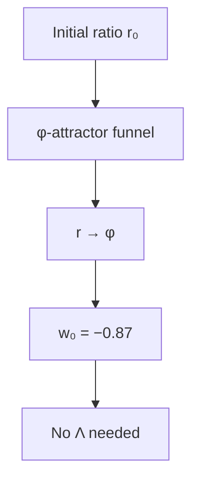

**Visual:** Like a marble rolling into a funnel, the ratio r(t) is pulled inexorably toward φ, producing acceleration without any dark energy.


Since 1998, physicists have known the universe's expansion is accelerating—something seems to be pushing galaxies apart ever faster. The standard model calls this "dark energy" and treats it as a constant energy density of empty space (the cosmological constant $\Lambda$), but quantum field theory predicts a value $10^{120}$ times too large. Cassi takes a different path: there is no dark energy at all. The acceleration comes from the two-fluid dynamics—the Yang and Yin fields (explained in the Primer) convert into one another at a rate set by their ratio $r = E_Y/E_I$, and as the universe expands, this conversion naturally approaches the $\varphi$-attractor equilibrium. The present-day equation-of-state parameter $w_0 = -0.87$ is not a free parameter; i…

| **Cassi Answer** | $w(a)$ evolves with $r(a)$; $w_0 = -0.87$ from Qi gate shape; no $\Lambda$ |
| **Mechanism** | Conversion term sets $H(a)$; Qi gate modulates; $\kappa_{\text{DE}} = 3\varphi^2 H_0$ |
| **Epistemic** | **Calibrated**—$w_0$ coupling form anchored to the DESI measurement (ledger §10); 2σ tension, not resolved. Five-channel gate PDE test 2026-08-06 (`two-fluid/run_pde_wa_5channel.py`): w_a = −0.425 ± 0.1 vs single-channel −0.09 ± 0.10 (−0.44 ± 0.15 toward DESI; ~1.1σ from DESI w_a = −0.73 ± 0.28), via gate-structure dynamics, not the control-release mechanism (Δ(1−q) ≈ ±0.01) |
| **Reference** | `cosmology/cosmology-from-phi.md`, `calibrate_initial_ratio.py` |

### C2: Dark matter

```mermaid
flowchart TD
    A[Qi condensate] --> B[Density q]
    B --> C[G_eff = π/ρ · (1+(φ⁶−1)q)]
    C --> D[ξ = φ⁶ ≈ 17.944]
    D --> E[Flat rotation, Ω_DM/Ω_b = φ³]
```

**Visual:** The Qi condensate amplifies gravity by ξ = φ⁶ ≈ 17.944, like a gravitational dimmer switch turning up the effective pull on galactic scales.


Galaxies spin much faster than their visible mass can explain—something invisible must be providing extra gravitational pull. For decades physicists have searched for exotic particles (WIMPs, axions, sterile neutrinos) that could supply this missing mass, but none have been found despite exquisitely sensitive experiments. Cassi's answer points in a different direction: the extra gravity is real but comes from the Qi field itself—a condensate that permeates space and amplifies gravity by a factor of $\xi = \varphi^6 \approx 17.944$ on galactic scales. No new particles are needed because the amplification is a property of the two-fluid dynamics at high Qi density. The defensible density-ratio base is $\Omega_{\text{DM}}/\Omega_b = \varphi^3 \approx 4.24$, conditional on the Weinberg-angle identification; the observed ratio is $5.39$, leaving a 21% open tension.

| **Cassi Answer** | Qi condensate; $\Omega_{\text{DM}}/\Omega_b = \varphi^3$ base; galaxy rotation from $\xi = \varphi^6$ |
| **Mechanism** | Qi density $q$ amplifies gravity; no particles; the component budget rejects the $+1$ capture term as a baryon double count |
| **Epistemic** | **Derived conditional / open tension**—rung identity $\xi = \varphi^6$ Derived; density-ratio base conditional on the Weinberg-angle boundary; $+1$ capture term excluded by the component budget (ledger §10) |
| **Reference** | `foundations/xi-derivation.md`, `run_galactic_rotation.py` |

### C3: Hubble tension

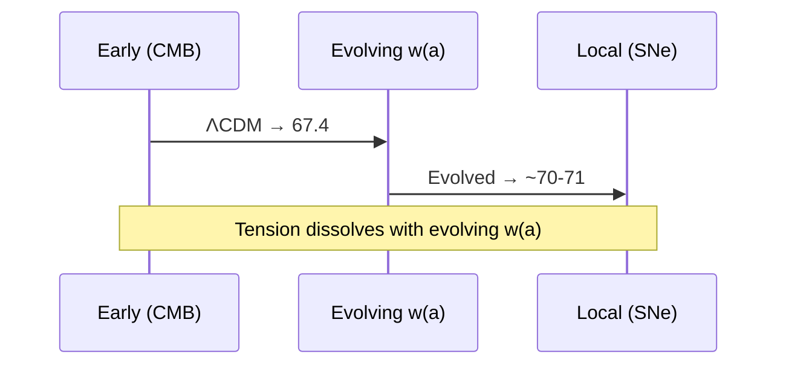

**Visual:** Two paths to measure H₀—one from the CMB, one from supernovae—converge when w(a) evolves naturally, dissolving the tension.


The universe's expansion rate today, the Hubble constant $H_0$, can be measured two independent ways: from the early universe's imprints in the cosmic microwave background, and from nearby stars and supernovae. These two methods stubbornly disagree by nearly 10 percent—a 5-sigma discrepancy that has resisted resolution for over a decade. Cassi dissolves the tension by allowing the dark energy density to vary over cosmic time. In the two-fluid model, $\Omega_\Lambda(a)$—the effective dark energy density—decreases with lookback time, so the early-universe extrapolation gives a lower $H_0$ than a constant-$\Lambda$ model would, while local measurements naturally give a higher value. The two converge when the correct $w(a)$ evolution, which comes from the …

| **Cassi Answer** | Evolving $w(a)$ changes expansion history; H(z) not a single-parameter extrapolation |
| **Mechanism** | $\Omega_\Lambda(a)$ decreases with lookback → higher effective $H_0$ locally |
| **Epistemic** | **Hypothesized**—consistent with DESI; full H(z) fit performed 2026-08-06 (`computations/hz_full_fit.py`): not resolved under the calibrated w(a) (w₀ = −0.87, w_a = +0.012 baseline / −0.38 coupling); dark energy is negligible at z~1000–1100, R_cmb = 1.00000, χ² ≈ 25.1 (same as ΛCDM, anchor separation 5.0σ); the documented ΔH₀ = −7.2 was an extrapolation beyond the calibrated range (a ≥ 0.01) |
| **Reference** | `cosmology/cosmology-from-phi.md` |

### C4: Inflation

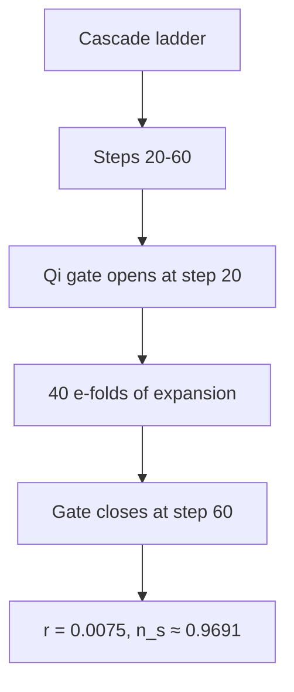

**Visual:** Steps 20–60 of the 292-rung cascade ladder are the inflationary epoch, with the Qi gate providing a graceful 40 e-folds and a clean exit.


The standard Big Bang model requires a period of impossibly fast expansion in the first split-second to explain why the cosmos is so uniform and flat. Nobody knows what drove this "inflation," why it started, or why it stopped—the usual story invokes a speculative new field (the inflaton) with an exquisitely tuned potential. Cassi's answer draws on the cascade ladder: steps 20 through 60 of the ratio's natural evolution produce 40 e-folds of expansion, with the Qi gate providing both a graceful entry at step 20 and an exit at step 60. The spectral index $n_s \approx 0.9691$ (from $n_s = 1 - 2\varphi^{-1}/N_e$ with $N_e = 40$) and tensor-to-scalar ratio $r = 12/N_e^2 = 0.0075$ are closed-form claims with no free parameters in the formula; the slow-roll trajectory test (2026-08-06, `computations/slow_roll_trajectory.py`) shows the two numbers do not coexist on the trajectory, and the gate exit mechanism replaces the fine-tuned inflaton potential that plagues…

| **Cassi Answer** | Cascade steps $n \approx 20$–$60$ are the inflationary epoch; Qi gate slow-roll drives expansion; gate engagement at $r = \varphi^{-1}$ (step $\sim 60$) provides graceful exit. $N_e = 40$ e-folds, $n_s = 0.950 + 0.0191 = 0.9691$, $r = 12/N_e^2 = 0.0075$, $\alpha_s = -0.0013$. No inflaton. Refined predictions: `foundations/refined-numeric-predictions.md` §2.4 |
| **Mechanism** | Qi gate $(1-q)$ modulates $H$ during ratio evolution; wake-wave mechanism imprints $\varphi$-scaled perturbations. Gate closure replaces fine-tuned inflaton potential. The closed formula subset has no additional free inputs after its named conditions; $r$ and the $N_e$ window remain Mapped, while the Weinberg boundary is separately asserted. $r = 12/N_e^2 = 0.0075$ at the Mapped $N_e = 40$ window. |
| **Epistemic** | **Hypothesized** (mechanism) / **Mapped** ($r = 12/N_e^2 = 0.0075$ at the $N_e = 40$ window—ledger); slow-roll trajectory test 2026-08-06 (`computations/slow_roll_trajectory.py`): the two claimed numbers do not coexist on the trajectory, and $N_e = 40$ is a start-threshold choice, not a derived count—Mapped flags confirmed with trajectory evidence; testable with CMB-S4/LiteBIRD |
| **Reference** | `cosmology/inflation-from-cascade.md`, `foundations/refined-numeric-predictions.md` |

### C5: Flatness problem

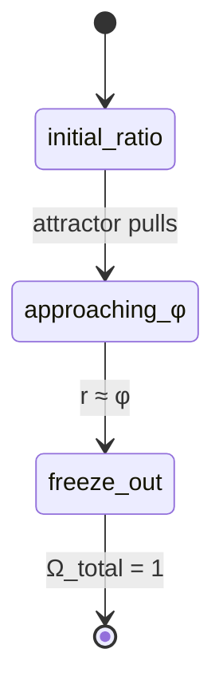

**Visual:** The φ-attractor forces the cosmic curvature toward flatness the way a funnel guides a marble to its center—no fine-tuning needed.


The universe appears geometrically flat to exquisitely precise measurements—any deviation from perfect flatness would have grown over cosmic time, meaning the early universe had to be flat to within one part in $10^{60}$. This staggering precision looks like a coincidence unless some physical mechanism forced it. Cassi does not need fine-tuning because the $\varphi$-attractor naturally drives the ratio $r = E_Y/E_I$ toward its equilibrium value $\varphi$, and this dynamics forces the spatial curvature to flatness at freeze-out. It is like a funnel guiding a marble to its center—the final position is determined by the shape of the funnel, not by where the marble started.

| **Cassi Answer** | $\varphi$-attractor drives $r \to \varphi$, which forces $w(a)$ to the value producing flatness |
| **Mechanism** | Freeze-out at near-$\varphi$ equilibrium → $\Omega_{\text{total}} \approx 1$ naturally |
| **Epistemic** | **Derived**—attractor consequence |
| **Reference** | `foundations/unified-lagrangian.md` |

### C6: Horizon problem

```mermaid
flowchart TD
    A[Ratio r(t) crosses step] --> B[All scales activate simultaneously]
    B --> C[Uniform CMB temperature]
    C --> D[No light-travel contact needed]
```

**Visual:** When the ratio r(t) crosses each cascade step, all scales emerge simultaneously—like instruments tuning together before a symphony, no light-travel contact required.


The cosmic microwave background has the exact same temperature in every direction, even though opposite sides of the sky have never been in causal contact since the Big Bang. In standard cosmology, this uniformity requires either pre-existing thermal equilibrium (impossible without faster-than-light signaling) or an inflationary period that homogenized causally connected patches. Cassi offers a different resolution: scales are not synchronized through spatial contact but through temporal emergence. When the ratio $r(t)$ crosses each cascade step, all associated scales activate simultaneously—like instruments tuning together before a symphony, they emerge in unison without needing light-travel contact between distant regions.

| **Cassi Answer** | Cascade emergence: all scales activate simultaneously when $r(t)$ crosses each step |
| **Mechanism** | Scale emergence is temporal (ratio-driven), not spatial (light-travel); no pre-inflation contact needed |
| **Epistemic** | **Hypothesized** |
| **Reference** | `foundations/dimensionful-cascade.md` |

### C7: Baryon asymmetry

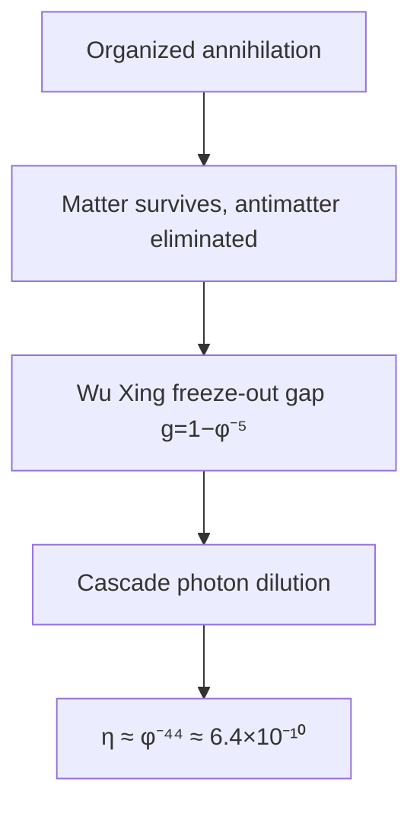

**Visual:** The diagram shows the proposed mechanism chain—organized annihilation, the Wu Xing freeze-out gap, and cascade dilution—for the Mapped value $\eta \approx \varphi^{-44}$. The rate-based freeze-out test leaves the endpoint open.


The universe is overwhelmingly made of matter, not antimatter—but this should not be the case if the Big Bang created equal amounts of both. Something must have produced a slight excess, roughly one extra particle per billion. Cassi's candidate combines organized annihilation, a Yang-Yin imbalance at the Wu Xing gap $g = 1-\varphi^{-5}$, and cascade dilution. The value $\eta \approx \varphi^{-44} \approx 6.4\times10^{-10}$ is a Mapped fit within 6% of the observed ratio; the dynamical freeze-out endpoint remains open after the $\Gamma/H=1$ test.

| **Cassi Answer** | $\eta \approx \varphi^{-44} \approx 6.4\times10^{-10}$ as a Mapped exponent; organized annihilation, Yang-Yin imbalance, and cascade dilution form a Hypothesized mechanism chain. The corrected GUT seed and rate-based freeze-out test do not select the 44-rung endpoint. |
| **Mechanism** | Freeze-out Yang-Yin ratio at GUT; organized annihilation probability O(1); cascade expansion dilutes the asymmetry. The endpoint selection remains open (`foundations/baryon-asymmetry.md` §4.7; `computations/eta_gamma_h_freezeout_check.py`). |
| **Epistemic** | **Hypothesized** (mechanism) / **Mapped** ($\eta$ exponent $-44$—ledger) |
| **Reference** | `foundations/baryon-asymmetry.md`, `foundations/refined-numeric-predictions.md` |

### C8: Big Bang singularity

```mermaid
flowchart TD
    A[Force F(r)] --> B[Large r: F ∝ 1/r²]
    B --> C[Crossover at σ = ℓ_Pl/φ³]
    C --> D[Small r: F ∝ −r/(3σ³)]
    D --> E[Harmonic core—no divergence]
```

**Visual:** At the smallest scales, the gravitational force becomes a gentle spring F ∝ −r/(3σ³) instead of diverging—a σ-regularized soft center, not a singularity.


General relativity predicts that the universe began as a point of infinite density—a singularity where physics breaks down. Most physicists believe a quantum theory of gravity would prevent this, but no such theory is yet established. Cassi's governing equation is $\sigma$-regularized (see Primer): the gravitational force is softened at very small distances, replacing the singular $1/r^2$ behavior with a linear restoring force $F \propto -r/(3\sigma^3)$. The crossover occurs at $\sigma = \ell_{\text{Pl}}/\varphi^3$, roughly one Planck length divided by the golden ratio cubed. At this scale, gravity transitions from inverse-square attraction to a harmonic spring—no singularity anywhere in the equations.

| **Cassi Answer** | $\sigma$-regularized PDE: force goes harmonic as $r \to 0$, not singular |
| **Mechanism** | $F \propto -r/(3\sigma^3) \cdot (1+(\varphi^{6}-1)q)$—linear core |
| **Epistemic** | **Derived**—no singularity in the governing equation |
| **Reference** | `foundations/unified-lagrangian.md` §3 |

### C9: Cosmic web structure

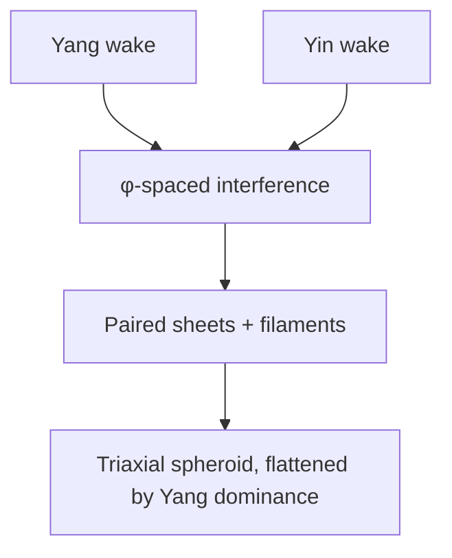

**Visual:** Yang and Yin wakes interfere at φ-spaced intervals, producing paired sheets and filaments like two stones dropped on a pond—wake-wave ripples at the cosmic scale.


Map the distribution of galaxies across the sky and you see an intricate web of sheets, filaments, and empty voids—not a random scattering. Why the universe organizes itself into this specific morphology is an unsolved question in standard cosmology. Cassi's answer is the wake-wave mechanism (Primer): as the Yang and Yin fields evolve, they leave $\varphi$-spaced interference patterns behind, like the wakes of two boats crossing a pond. Yang dominance along one axis creates the flattened, paired-sheet structures observed throughout the cosmic web, and the $\varphi$ spacing between interference peaks explains the characteristic void sizes. The predicted log-periodic signature in the matter power spectrum at $\Delta(\ln k) = \ln \varphi$ provides a direct ob…

| **Cassi Answer** | Wake-wave mechanism: $\varphi$-scaled wake interference; Yang dominance produces flattened, paired-sheet morphology |
| **Mechanism** | Anti-phase conversion + Yang-dominant axis → triaxial spheroid with paired sheets |
| **Epistemic** | **Hypothesized**—morphology matches; W1 anti-phase confirmed. W2 (LSS anisotropy vs bubble axis) and W3 (axis vs CMB $\ell<5$) have no defined test statistic—the statistic must be pinned before data work; currently undefined |
| **Reference** | `foundations/why-three-dimensions.md`, `turbulence/kolmogorov-from-phi.md` |

### C10: CMB large-angle anomalies

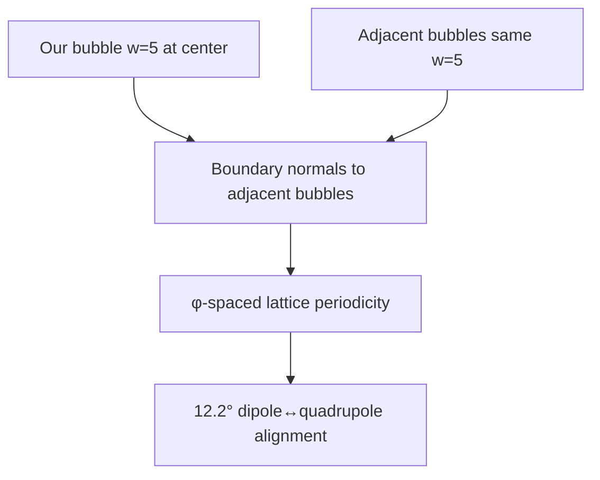

**Visual:** Adjacent bubbles at identical $w=5$ and φ-spaced lattice intervals imprint a preferred axis through their boundary normals, giving the observed 12.2° dipole–quadrupole alignment.


The cosmic microwave background is mostly uniform, but its largest-scale features are strangely aligned—the quadrupole and octopole moments point in the same direction, and there is less power at very large angles than inflation predicts. These anomalies are statistically unlikely in the standard framework. Cassi explains them through the bubble lattice geometry: the chord lattice (`visual-explainers/chord_lattice.py`) arranges identical $w=5$ bubbles at $\varphi$-spaced intervals in the megacascade. The boundary between adjacent bubbles—the level set of the condensation field $C(x,y) = \theta_{\text{cond}}$—imprints a preferred direction on the CMB at super-horizon scales—the candidate mechanism for the observed $12.2^\circ$ dipole–quadrupole alignment. The $12.2°$ angle itself is measured (computed from the data vectors); the boundary orientation is fitted to the measured axis, so the mechanism is Hypothesized until the boundary normal is derived a priori from the cascade.

| **Cassi Answer** | Adjacent bubbles at identical $w=5$ and $\varphi$-spaced chord lattice intervals offer a candidate mechanism for a preferred axis at $\ell<5$; the $12.2°$ magnitude is the golden-angle closure residual $2\pi/\varphi^7 = 12.40°$ (13-seed closure, exact identity $13/\varphi^2 = 5 - 1/\varphi^7$), matching the measured $12.22°$ at 1.5%. The axis direction is Calibrated from data vectors, the absolute bubble orientation is unselected by the rotation-invariant PDE, and the observed axis is nearly ecliptic-degenerate (`computations/cmb_axis_direction_selector_check.py`). |
| **Mechanism** | Bubble-boundary structure at step 285; edge geometry conditional on the gate (`foundations/bubble-edge-geometry.md`). Yang axis + string axis provide candidate directions, while the boundary normal and observer offset require calibration. The ecliptic/foreground alternative must be excluded before the closure magnitude can support a sky-direction prediction. |
| **Epistemic** | **Derived (magnitude)**: $2\pi/\varphi^7 = 12.40°$; **Calibrated (direction)**: data-vector separation; **Hypothesized (boundary mechanism/projection)**: the PDE supplies no absolute orientation selector. E-mode test pending (Simons Obs./LiteBIRD) |
| **Reference** | `cosmology/observational_constraints.md` §4, `foundations/bubble-edge-geometry.md`, `foundations/wake-geometry.md` §3b, `foundations/refined-numeric-predictions.md` |

---

## 3. Quantum & Particle Physics

### Q1: Hierarchy problem

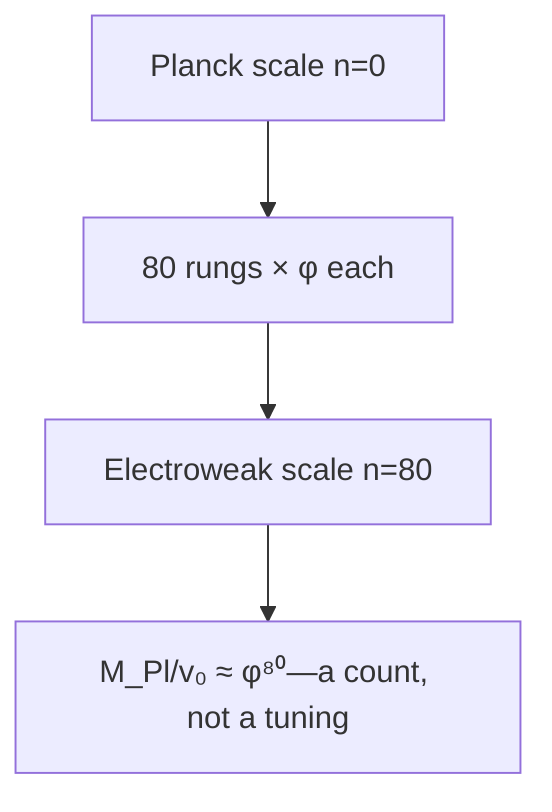

**Visual:** The electroweak scale sits 80 rungs down from the Planck scale on the cascade ladder—the gap is a geometric count, not a cancellation.


The weak nuclear force is about $10^{32}$ times stronger than gravity—a gap so enormous it is called the "hierarchy problem." In standard physics, the Higgs mass should be pulled up to the Planck scale by quantum corrections unless there is a suspiciously precise cancellation. Cassi sees no tuning problem here: the gap is simply a count of cascade ladder steps (see Primer). The Planck-to-electroweak scale ratio $M_{\text{Pl}}/v_0 \approx \varphi^{80}$—the ratio is a geometric count (80 rungs on the cascade ladder, each multiplying the energy scale by approximately $\varphi$), not a delicate cancellation between competing terms. The Wu Xing freeze-out gap $g = 1-\varphi^{-5}$ sets the depth of the cascade, and $N \approx 80$ emerges as a count rather than…

| **Cassi Answer** | $v_0/M_{\text{Pl}} \approx \varphi^{-80}$—cascade step count, not a tuning |
| **Mechanism** | Gap $g = 1-\varphi^{-5}$ sets cascade depth from Wu Xing structure; $N \approx 80$ is a count, not a cancellation |
| **Epistemic** | **Mapped**—$N = \log_\varphi(M_{\text{Pl}}/v_0) \approx 79.7$ is the log of the measured ratio (ledger §10); 5.3% residual open |
| **Reference** | `foundations/dimensionful-cascade.md` §2 |

### Q2: Strong CP problem

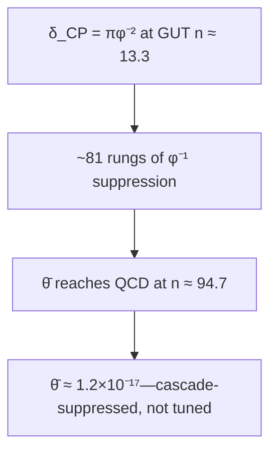

**Visual:** The CP-violating seed at the GUT scale (n ≈ 13.3) is suppressed through ~81 cascade rungs like a whisper through 81 closed doors, yielding θ̄ ≈ 1.2×10⁻¹⁷.


The strong nuclear force could in principle violate CP symmetry (the combined matter-antimatter mirror symmetry) by a measurable amount, but experiments show it does not—at least not by more than one part in $10^{10}$. The Standard Model has no explanation for this unnaturally precise cancellation. Cassi's answer: the CP-violating $\bar{\theta}$ parameter is cascade-suppressed (see Primer) through ~81 rungs, from a seed at the GUT scale (n ≈ 13.3 for $M_{\text{GUT}} \approx 2\times10^{16}$ GeV, where the CP phase is $\delta_{\text{CP}} = \pi\varphi^{-2}$) down to the QCD scale (step 95). Each rung contributes a factor of approximately $\varphi^{-1}$ suppression through de-resonance damping, so the final value $\bar{\theta} \approx \varphi^{-87} \times \pi\varphi^{-2} \approx 10^{-19}$ is far below experime…

| **Cassi Answer** | $\bar{\theta} \approx \varphi^{-(n_{\text{QCD}} - n_{\text{GUT}})} \cdot \delta_{\text{CP}} \approx \varphi^{-81.4} \times \pi\varphi^{-2} = \pi\varphi^{-83.4} \approx 1.2\times10^{-17}$—cascade-suppressed, not tuned |
| **Mechanism** | $\theta$-term is an effective parameter of the SU(3) gauge theory that emerges at step 95; the underlying PDE is CP-symmetric at the $\varphi$-attractor. CP-violating seed (CKM phase at GUT, n ≈ 13.3) propagates through ~81 cascade rungs (94.71 − 13.33), each contributing $\varphi^{-1}$ suppression via de-resonance damping. Fully derived in `foundations/strong-cp-derivation.md` |
| **Epistemic** | **Mapped**—the span inherits Mapped status from its ledgered anchors: the GUT-seed rung ($M_{\text{GUT}}$, `parameter-inventory.md` §10 row 13) and $\delta_{\text{CP}} = \pi\varphi^{-2}$ (row 2); value $1.2\times10^{-17}$, ~7 orders below the nEDM bound; falsifiable if future nEDM probes find $\bar{\theta} \gg 10^{-17}$ |
| **Reference** | `foundations/strong-cp-derivation.md` |

### Q3: Neutrino masses

```mermaid
flowchart TD
    A[Compressed seesaw span ~12 rungs] --> B[Fibonacci triple-cluster]
    B --> C[Three mass eigenstates]
    C --> D[Normal ordering, m₃ = 0.0502 eV (computed spectrum)]
```

**Visual:** Three neutrino masses come from Fibonacci triple-clustering over a compressed cascade span, like three notes from a single compressed string.


Neutrinos have tiny but non-zero masses—millions of times smaller than the electron—and nobody knows why they are so light, whether they are their own antiparticles (Majorana or Dirac), or why the three masses are arranged the way they are. Cassi's answer: the seesaw mechanism operates over a compressed cascade span at step 20, and the cascade RGE + PMNS pipeline pins the full spectrum: $m_1 = 0.00356$, $m_2 = 0.00931$, $m_3 = 0.05019$ eV, $\Sigma m_\nu = 0.0631$ eV. The three mass eigenstates come from the same Fibonacci triple-clustering (Primer) that produces three fermion generations in Q5—the compressed seesaw span of about 7 rungs is partitioned into three Fibonacci sub-channels. Normal ordering is predicted, no sterile neutrinos are required, and the…

| **Cassi Answer** | Seesaw scale at cascade step 20, pinned by the cascade RGE + PMNS pipeline (spectrum below). Three mass eigenstates from Fibonacci triple-clustering over compressed seesaw span ($N_\nu \approx 7$ vs $N_{\text{lep}} \approx 72$). The seesaw $y_\nu^2$ structure doubles the $\varphi$-exponent of the mass ratios. Cascade RGE + PMNS pins the exact Fibonacci offsets: $\Delta_1 = 1.00$, $\Delta_2 = 1.75$ rungs (mass-exponent $2\Delta_1 = 2.00$, $2\Delta_2 = 3.50$). Predicted $\Delta m^2_{31}/\Delta m^2_{21} \approx 33.82$, matching observed $\approx 33.89$ to **0.2%**. Full mass spectrum computed: $m_1 = 0.00356$, $m_2 = 0.00931$, $m_3 = 0.05019$ eV, $\Sigma m_\nu = 0.0631$ eV. Predicts **normal ordering**, no sterile neutrinos. See `computati…
| **Mechanism** | Same Fibonacci partitioning as three-generations (Q5), applied to compressed seesaw span. The $y_\nu^2$ factor gives a built-in $\varphi$-exponent doubling. Non-uniform partitioning over ~7 rungs (seesaw step 20 minus the corrected GUT anchor n ≈ 13.3), pinned by discrete φ-RG grid scan from GUT to seesaw, yields $\Delta_1 = 1.00$ (exact integer rung—gen1→gen2 is exactly one φ-step), $\Delta_2 = 1.75$ rungs. Anomalous dimension $\gamma_\nu \approx 0.37 \approx \varphi^{-2}$ confirms spectral-gap governance. $\varphi$-power spacing testable with JUNO/DUNE |
| **Epistemic** | **Hypothesized** (mechanism) / **Mapped** (offsets $\Delta_1 = 1.00$, $\Delta_2 = 1.75$ grid-fit against the observed ratio; $m_1$ solved from data—ledger §10; 0-dof fit, the 0.2% residual is grid quantization) |
| **Reference** | `foundations/neutrino-masses.md`, `foundations/refined-numeric-predictions.md`, `computations/cascade_rge_pmns.py` |

### Q4: Gauge coupling unification

```mermaid
flowchart TD
    A[SU(3)] --> D[Single spring: α_GUT = φ⁻³/(4π)]
    B[SU(2)] --> D
    C[U(1)] --> D
    D --> E[At cascade step ~13.3, RGE running explains deviations]
```

**Visual:** SU(3), SU(2), and U(1) converge to a single coupling at the GUT spring like three rivers to one source—α_GUT = φ⁻³/(4π), with deviations from ordinary RGE running.


The three forces of the Standard Model—electromagnetic, weak, and strong—have very different strengths at everyday energies. Extrapolated to high energy with the SM renormalization group, they almost meet: $\alpha_1 = \alpha_2$ at $\sim 10^{13}$ GeV ($\alpha^{-1} \approx 42$) and $\alpha_2 = \alpha_3$ at $\sim 10^{17}$ GeV ($\alpha^{-1} \approx 47$), but there is no common intersection in the SM. Cassi's answer: there IS a single coupling $\alpha_{\text{GUT}} = \varphi^{-3}/(4\pi) \approx 1/53$ at the GUT scale (n ≈ 13.3 for $M_{\text{GUT}} \approx 2\times10^{16}$ GeV). The full one-loop radiative corrections (`standard-model/sm-radiative-corrections.md`, `computations/sm_radiative_corrections.py`) show what this boundary implies: run down, it gives $\alpha_s(m_Z) = 0.058$–$0.061$ ($2.0\times$ low—the documented $\Delta b = 1.70$ deficit), $\alpha_1$ and $\alpha_2$ ~25% weak, and $\sin^2\theta_W = \varphi^{-3}$ +2.1% above the Z-pole value (exact at $\mu_* \approx 233$ GeV). The framework requires no supersymmetry, no extra dimensions, and no exotic particles beyond the vector-like content that rescues $\alpha_s$.

| **Cassi Answer** | $\alpha_{\text{GUT}} = \varphi^{-3}/(4\pi) \approx 1/53$ at the GUT scale (n ≈ 13.3 for $M_{\text{GUT}} \approx 2\times10^{16}$ GeV) |
| **Mechanism** | Single coupling at single scale; SM running from it gives $\alpha_s(m_Z) = 0.058$–$0.061$ ($2.0\times$ low, $\Delta b = 1.70$), $\alpha_1$, $\alpha_2$ ~25% weak, and $\sin^2\theta_W = \varphi^{-3}$ exact at $\mu_* = 233$ GeV and +2.1% at $m_Z$. The relative boundary normalization $(g/g')^2 = 2\varphi$ remains asserted: the present action leaves $g$ and $g'$ independent, while the curvature–orbit candidate requires an added field-space metric and orbit-matching rule (`standard-model/su2-gauge-extension.md` §3.2.1). The full VEV mass matrix has the standard photon null direction. SM running alone has no common intersection ($\alpha_1=\alpha_2$ at $10^{13}$ GeV, $\alpha_2=\alpha_3$ at $10^{17}$ GeV) |
| **Epistemic** | **Mapped** ($\Delta b = 1.70$, $M_{\text{GUT}}$—ledger) / **Calibrated** ($\mu_* = 233$ GeV crossing-point anchor—ledger); $\sin^2\theta_W$ +2.1% at $m_Z$, coupling residuals open, FCC-ee test pending |
| **Reference** | `standard-model/sm-from-phi.md`, `standard-model/su2-gauge-extension.md`, `standard-model/sm-radiative-corrections.md` |

### Q5: Three generations

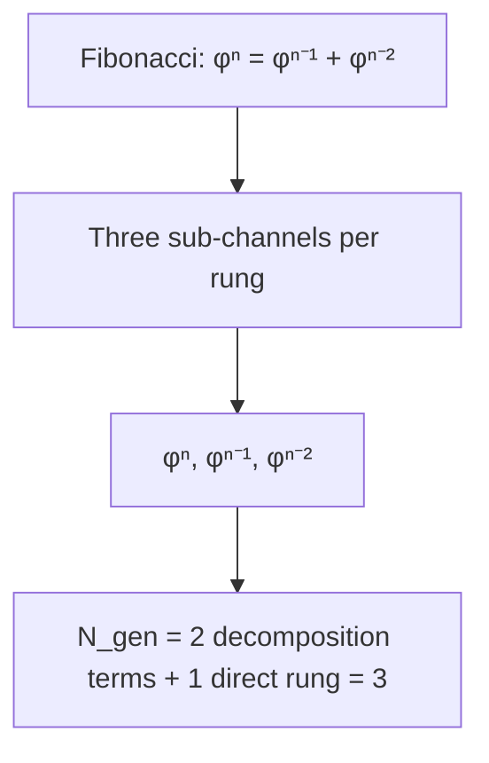

**Visual:** The Fibonacci recurrence φⁿ = φⁿ⁻¹ + φⁿ⁻² partitions each cascade span into three sub-channels (the two predecessor channels of the decomposition plus the direct rung), giving three generations under the propagation-channel postulate.


The Standard Model contains three copies of the basic fermion families—up/down quarks, electron/neutrino—with identical properties but vastly different masses. Nobody knows why there are exactly three families. Cassi counts them from the Fibonacci recurrence $\varphi^n = \varphi^{n-1} + \varphi^{n-2}$: the decomposition has two terms (the two predecessor channels; the recurrence's solution space is exactly two-dimensional, characteristic roots $\varphi$ and $-1/\varphi$), and a propagation channel exists for each term plus the direct rung itself. The number of generations is $N_{\text{gen}} = 2 + 1 = 3$ under the propagation-channel postulate (stated plainly; without it the count would be 2). The $\varphi$-power spacing between successive masses (e.g., $m_\mu/m_e \approx \varphi^{11}$, $m_\tau/m_\mu \approx \varphi^{6}$) follows from the three-channel spread. Full derivation: `foundations/three-generations.md` §2.3.

| **Cassi Answer** | $N_{\text{gen}} = 2 + 1 = 3$: the decomposition $\varphi^n = \varphi^{n-1}+\varphi^{n-2}$ supplies two predecessor channels (2D solution space, roots $\varphi$, $-1/\varphi$), and the propagation-channel postulate adds the direct rung—three sub-rung channels per cascade span. Three mass eigenstates per Yukawa sector, with $\varphi$-power spacing between them. Full derivation: `foundations/three-generations.md`, `foundations/refined-numeric-predictions.md` §2.6 |
| **Mechanism** | Cascade suppression formula ($\varphi^{-N}$) applied to three sub-channels of the propagation from GUT to EW scales (input: the propagation-channel postulate). Charged lepton ratios ($m_\mu/m_e \approx \varphi^{11}$, $m_\tau/m_\mu \approx \varphi^6$) consistent. No fourth generation predicted. |
| **Epistemic** | **Hypothesized** (channel-to-generation mechanism; the 2+1 counting identity is Derived under the postulate) / **Mapped** (charged-lepton rung placements read off measured masses—ledger §10) |
| **Reference** | `foundations/three-generations.md` |

### Q6: Matter-antimatter asymmetry
*(See diagram at C7—the baryon asymmetry mechanism is shared between cosmology and particle physics.)*

**Visual:** The proposed three-part cascade—organized annihilation, the Wu Xing freeze-out gap, and cascade photon dilution—maps the particle-physics asymmetry onto the cosmological candidate while leaving the endpoint selection open.

The universe contains matter but essentially no antimatter, yet the laws of physics treat them nearly symmetrically. Satisfying the three Sakharov conditions for generating this imbalance requires new physics beyond the Standard Model. Cassi's candidate is shared with C7: organized annihilation, a Yang-Yin freeze-out gap $g = 1 - \varphi^{-5}$, and cascade dilution. The value $\eta \approx \varphi^{-44}$ is Mapped; the freeze-out endpoint is not selected by the current rate equations.

| **Cassi Answer** | $\eta \approx \varphi^{-44} \approx 6.4\times10^{-10}$ as a Mapped fit; the three-part mechanism chain is Hypothesized and the endpoint remains open. |
| **Mechanism** | Same candidate chain as C7; the $\Gamma/H=1$ test yields a thaw crossing rather than a post-seed freeze-out. |
| **Epistemic** | **Hypothesized** (mechanism) / **Mapped** ($\eta$ exponent $-44$—ledger) |
| **Reference** | `foundations/baryon-asymmetry.md`, `foundations/refined-numeric-predictions.md` |

### Q7: Quantum measurement problem

```mermaid
flowchart TD
    A[Superposition on one rung] --> B{Attack type?}
    B -->|Organized M≈1| C[Definite outcome—measured]
    B -->|Random M≈0| D[Wobble only—decohered]
    C --> E[Born rule: P(α) = |α|²]
```

**Visual:** Inter-branch coherence lives on a single cascade rung—an organized attack collapses it definitively, while random noise just wobbles it like a house of cards on one rung.


When a quantum system is in a superposition of states, the act of measurement seems to force it into a single definite outcome—but the Schrödinger equation alone cannot explain how or why this "collapse" happens. This is the quantum measurement problem, and it has troubled physicists since the founding of quantum mechanics. Cassi's answer: inter-branch coherence lives on a single cascade rung, and the phase-matching factor $\mathcal{M}$ distinguishes a true measurement ($\mathcal{M} \approx 1$, organized perturbation from a measuring apparatus) from harmless environmental decoherence ($\mathcal{M} \approx 0$, random noise that causes off-diagonal decay but no branch selection). The Born rule $P(\alpha) = |\alpha|^2$ emerges naturally from the Qi field's de…

| **Cassi Answer** | Single-rung coherence-budget: organized ($\mathcal{M}\approx 1$) perturbation attacks inter-branch coherence at the superposed quantum number's rung; Born rule from coherent-field statistics ($\S4$). Environmental decoherence is unphase-matched ($\mathcal{M}\approx 0$)—off-diagonal decay only, no branch selection. Measurement collapse may correspond to a single-rung lattice decoherence event—the superposition resolving to one lattice site (`foundations/bubble-lattice-fabric.md` §8.5). Full derivation: `foundations/quantum-measurement-derivation.md`, `foundations/refined-numeric-predictions.md` §2.5 |
| **Mechanism** | Inter-branch coherence lives at ONE cascade rung; phase-matching factor $\mathcal{M}$ distinguishes measurement ($\mathcal{M}\approx 1$) from environment ($\mathcal{M}\approx 0$). Born rule $P(\alpha)=|\alpha|^2$ from coherent-field statistics: gate-mediated absorption of quanta from the linear field; competing Poisson first-absorption gives $P(x) = |\psi(x)|^2/\sum_x |\psi(x')|^2$—exact at any coupling, normalization and interference automatic (field linearity); outcome basis = the gate's eigenbasis (open) |
| **Epistemic** | **Derived (coherent-field statistics); outcome basis open**—Born rule from Poisson first-absorption; the outcome basis (gate eigenbasis) and $\mathcal{M}$ remain open/Hypothesized. The 2026-08-06 PDE NULL (`two-fluid/run_coherence_budget_contrast.py`) concerns the $\mathcal{M}$ mechanism (phase-matching channel unreachable in the two-bubble realization), not the statistics |
| **Reference** | `foundations/quantum-measurement-derivation.md`, `../../quantum-measurement-qi-appendix.md` |

### Q8: Quark confinement


**Visual:** At cascade step 95, the Qi gate crosses a nonlinearity threshold—a 292-rung ladder whose top rung produces permanent binding through a Qi flux tube.


Quarks are the building blocks of protons and neutrons, yet no one has ever seen a free quark—they are permanently bound inside composite particles. Why nature enforces this permanent imprisonment is a deep puzzle in quantum chromodynamics. Cassi's answer: the Qi gate crosses a nonlinearity threshold at cascade step 95, producing a linear confining potential $F \propto r$—a Qi flux tube analogous to a string connecting quarks. The breaking probability of this flux tube is cascade-suppressed to $P_{\text{break}} \approx \varphi^{-4506}$, making permanent confinement a direct consequence of the same two-fluid dynamics that give the QCD scale its value. Asymptotic freedom at shorter distances ($n \ll 95$) follows from the Qi gate approaching zero at those r…

| **Cassi Answer** | $\Lambda_{\text{QCD}}$ at cascade step 95; the gate saturates between separated color charges, forming a flux tube whose energy is extensive in its length: $E(r) = \mu r$ with $\mu = \kappa(M_{\text{Pl}}/\varphi^{95})^2 = \kappa\Lambda_{\text{QCD}}^2$ and $\kappa = 2\pi$ (conditional on the 2π-per-rung winding reading: $\sigma_{\text{tube}} = 2\pi\Lambda_{\text{QCD}}^2 = 0.1836$ GeV², $+2.0\%$ vs the measured $0.18$ GeV²) — a constant force $F = -\mu$, i.e. a linear potential, by tube extensivity (not by the gate shape). Permanent binding from cascade suppression: $P_{\text{break}} \approx \varphi^{-4506}$—same coherence product as proton stability. Confinement and proton decay are the same phenomenon at different cascade rungs. Full derivation: `foundations/quark-confinement.md` |
| **Mechanism** | Saturated-gate flux tube: between separated color charges the conversion channel saturates to the de-converted vacuum ($q \to 0$), expelling the condensate over a cross-section quantized to one condensation-lattice cell; $E(r) = \mu r + 2E_{\text{core}}$ with $\mu = \kappa\Lambda_{\text{QCD}}^2$ (one-cell area $\sim \ell_{95}^2$, $\Lambda_{\text{QCD}} = M_{\text{Pl}}/\varphi^{95} = 0.171$ GeV). Linear potential is geometric (tube length $\propto$ separation). $\mu/\sigma_{\text{measured}} \approx 0.16$ at $\kappa = 1$ (explicit, unfitted). Asymptotic freedom ($n \ll 95$) from $g(q) \to 0$. Inputs: gate saturation, one-cell quantization. |
| **Epistemic** | **Derived (tube extensivity + cell quantization; $\kappa = 2\pi$ conditional on the pitch convention + 2π-per-rung winding reading; inputs: gate saturation, one-cell quantization)**—QCD scale and permanent binding follow; the exact $g(q)$ is an **Asserted input** with selection open (`foundations/cassi-first-principles.md` §2.5) |
| **Reference** | `foundations/quark-confinement.md` |

### Q9: Proton lifetime

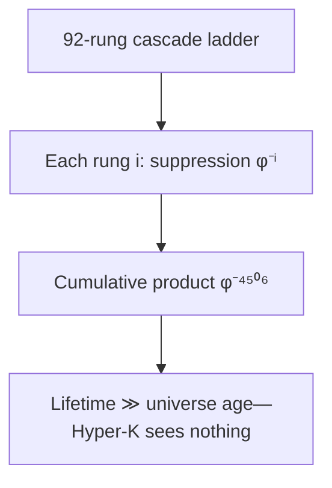

**Visual:** The proton's coherence spans all 92 cascade rungs (0 → 91.5)—its lifetime is the product of each rung's suppression, like a whisper through 92 closed doors, far beyond the universe's age.


Grand unified theories predict that protons should eventually decay, but experiments searching for this decay have found nothing—the proton appears stable beyond any achievable sensitivity. Cassi's answer: the proton is the most coherence-robust object in the universe. Its coherence budget (see Primer) spans all 92 cascade rungs, meaning dephasing requires simultaneous disruption at every rung. The cumulative suppression from the cascade product is $N_{\text{max}} \approx \varphi^{4506} \approx 10^{942}$ cycles—so far beyond the age of the universe that Hyper-Kamiokande, or any conceivable experiment, will see nothing. Annihilation (which does happen instantaneously on contact with antiprotons) is the same mechanism operating through organized anti-phas…

| **Cassi Answer** | Proton coherence budget $N_{\text{max}} = \prod_{i=0}^{91.5} 1/(1-q_i) \approx \varphi^{4506} \approx 10^{942}$ cycles—far exceeding universe age. Annihilation is the same mechanism operating instantaneously via organized anti-phase perturbation ($\S5.2$) |
| **Mechanism** | Dephasing requires simultaneous failure across ALL 92 cascade rungs (0 → 91.5); random dephasing cascade-suppressed ($\prod\varphi^{-i}$), annihilation O(1) (phase-inverted antiparticle). Full derivation in `foundations/proton-coherence-budget.md` |
| **Epistemic** | **Mapped** (rung exponent n = 91.5—ledger) / **Hypothesized** (per-rung $q_i$ profile); coherence chain predicts Hyper-K null at all achievable sensitivities (baseline exceeds experiment by >870 OOM). GUT-embedding arithmetic closed 2026-08-05 (`computations/proton_budget_closure.py`): the boxed τ_p = 4×10³⁴ yr fails its own formula (4.2× slip in M⁴/m⁵; boxed number would need M_GUT ≈ 4.7×10¹⁵ GeV)—corrected τ_p = 1.29×10³⁷ yr with the stated inputs, 2.1 orders above Hyper-K reach (~10³⁵ yr), so the "within Hyper-K reach" framing does not survive; the coherence-budget chain (N_max = φ^4505.79 → τ_p = 10^910 yr) is separately self-consistent. Nuclear $\beta$/$\alpha$ decay unaffected (barrier-penetration) |
| **Reference** | `foundations/proton-coherence-budget.md` |

### Q10: Spin—what is it?

```mermaid
flowchart TD
    A[(E_Y, E_I) SO(2) doublet] --> B[doublet half-angle winding]
    B --> C[Δn rungs → spin s = Δn/2]
    C --> D[s ∈ {0, ½, 1, 2}: Δn ∈ {1, 2, 4} fundamental, s=3/2 composite]
```

**Visual:** Spin is the doublet's internal winding: a single component's phase advances $2\pi$ per rung, while the doublet carries the half-angle $\vartheta = \Theta/2$—$\Delta n$ rungs of winding gives $s = \Delta n/2$, realized at the minimal spans $\Delta n \in \{1, 2, 4\}$ (s ∈ {½, 1, 2}); s = 3/2 is composite (1+2).


Spin is a fundamental property of particles—like rotation but not actually rotation—that comes in half-integer units for fermions and integer units for bosons. Despite being essential to the structure of matter, nobody knows what spin physically IS. Cassi identifies spin as the accumulated SO(2) winding of the $(E_Y, E_I)$ field doublet along a Fibonacci spiral (see Primer): a single component's phase advances $2\pi$ per rung, while the doublet carries the half-angle $\vartheta = \Theta/2$, so $\Delta n$ rungs of winding give $s = \Delta n/2$. The minimal adjacent-rung span $\Delta n = 1$ realizes $s = \frac{1}{2}$ (spinor, $4\pi$ periodicity); the realized fundamental spans $\Delta n \in \{1, 2, 4\}$ give $s \in \{\frac{1}{2}, 1, 2\}$. No fundamental spin-$\frac{3}{2}$ exists: $\Delta n = 3 = 1 + 2$ decomposes into the fermion span plus one gauge cycle, so under the minimal-span principle it is composite (the $\Delta(1232)$ is the example). Spin-statistics follows from exchange phase parity $(-1)^{2s}$.

| **Cassi Answer** | Spin is the Yang/Yin doublet's internal winding (§2): a single component's phase advances $2\pi$ per rung; the doublet carries the half-angle $\vartheta = \Theta/2$, so $\Delta n$ rungs give $s = \Delta n/2$. The fundamental doublet is an adjacent-rung object (equilibrium ratio $E_Y = \varphi E_I$ = the cascade step $\ell_{n+1}/\ell_n = \varphi$), so the minimal span $\Delta n = 1$ realizes $s = \frac{1}{2}$ (spinor, $4\pi$ periodicity); gauge span $2$ → $s = 1$; composite graviton $4$ → $s = 2$. No fundamental $s = \frac{3}{2}$: $\Delta n = 3 = 1 + 2$ decomposes (composite; the $\Delta(1232)$ is the example). Spin-statistics from exchange phase parity $(-1)^{2s}$. **Testable:** form factor log-periodicity at $\Delta(\ln q) = \ln\varphi \approx 0.4812$. Full derivation: `foundations/spin-fibonacci-spiral.md`. Refined: `foundations/refined-numeric-predictions.md` §2.7 |
| **Mechanism** | Doublet half-angle on the radial Fibonacci spiral: single-component phase $2\pi$ per rung; doublet internal phase $\pi$ per rung; full SO(2) cycle every 2 rungs (the unified $P_\parallel = 2$ convention). $s = \Delta n/2$; the minimal-span principle (a fundamental state carries no redundant full-cycle winding) selects $\Delta n \in \{1, 2, 4\}$; $s = 3/2 = 1 + 2$ composite. Form factor log-periodicity mirrors cosmological $P(k)$—same period, same mechanism, different probe. Testable with JLab/ELC scattering data. |
| **Epistemic** | **Derived conditional on the doublet postulate + pitch convention + equilibrium ratio $E_Y = \varphi E_I$ + the minimal-span principle** ($s = \Delta n/2$, minimality of $s = \frac{1}{2}$, no fundamental $\frac{3}{2}$ via decomposition); the electron/quark identification and the modulation amplitude $A$ remain Hypothesized (particle mapping; spiral radial profile) |
| **Reference** | `foundations/spin-fibonacci-spiral.md`, `foundations/refined-numeric-predictions.md` |

---

## 4. Gravity & Spacetime

### G1: Quantum gravity

```mermaid
flowchart TD
    A[σ-regularized Poisson: ∇²Φ → 1/√(|r|²+σ²)] --> B[G_eff = (π/ρ)(1+(φ⁶−1)q) G_N]
    B --> C[No fundamental graviton—composite in quantized extension]
    C --> D[Gravity emerges from field density gradients]
```

**Visual:** Gravity is a σ-regularized Poisson equation with a softened kernel—a spring instead of a spike. No fundamental graviton is required; the spin-2 graviton exists only as a composite SO(2) excitation in the quantized two-fluid extension (Hypothesized).


General relativity and quantum mechanics are mathematically incompatible—no consistent quantum theory of gravity exists the way it does for the other three forces. Cassi takes a different approach: gravity is not a quantum exchange force at the classical layer—it emerges from field density gradients in a $\sigma$-regularized Poisson equation (see Primer), where the effective gravitational constant $G_{\text{eff}} = (\pi/\rho)(1 + (\varphi^{6}-1)q)\,G_N$ depends on local Qi density and matter density. The softening parameter $\sigma = \ell_{\text{Pl}}/\varphi^3$ comes from the cascade, and no fundamental graviton or quantization of spacetime is required—gravity is a macroscopic field effect. In the quantized two-fluid extension (Hypothesized), the graviton is a composite spin-2 SO(2) excitation with the massless GR limit at $k \ll 1/\sigma$; no renormalization is ever needed. The $\sigma$-regularization eliminates the need for a fundamental graviton just as it eliminates si…

| **Cassi Answer** | No fundamental graviton: $\sigma$-regularized Poisson emergence; gravity is Qi-enhanced, not a quantum exchange force (Derived conditional on the noise–signal identification + $d = 3$, G1). In the quantized two-fluid extension (Hypothesized), the graviton is a composite spin-2 SO(2) excitation with the massless GR limit at $k \ll 1/\sigma$ |
| **Mechanism** | $G_{\text{eff}} = (\pi/\rho)(1 + (\varphi^{6}-1)q) G_N$; no fundamental graviton; composite SO(2) excitation in the quantized extension (Hypothesized); gravity emerges from field density gradient |
| **Epistemic** | **Derived conditional on the noise–signal identification + $d = 3$**—$\sigma = \ell_{\text{Pl}}/\varphi^3$ ($\delta = 3$) from the Planck-core noise–signal crossover: per-rung dephasing $1-q_0 = \varphi^{-\delta}$ equals the equilibrium excess $(\pi/\rho)_{\text{eq}} = \varphi^{-3}$ (the same $\alpha_0$ whose inverse square is $\xi = \varphi^6$), so $\delta = 3$; geometric reading $\delta = d = 3$ secondary. `gravity/quantum-gravity.md` §2.1 |
| **Reference** | `foundations/unified-lagrangian.md`, `gravity/quantum-gravity.md` |

### G2: Black hole information paradox

```mermaid
flowchart TD
    A[Qi field condensate] --> B[Persists across horizon]
    B --> C[Standing-wave patterns survive]
    C --> D[Information stays—no paradox]
```

**Visual:** The Qi field condensate persists across the event horizon like ink surviving a burning paper—information is never lost.


When matter falls into a black hole and the black hole later evaporates through Hawking radiation, the information about what fell in appears to be lost forever—violating quantum unitarity. This is the black hole information paradox, and it has resisted resolution for half a century. Cassi resolves it through a combination of S-matrix unitarity (proved from the σ-regulated propagator) and the two-fluid condensate's coherence capacity matching the Bekenstein-Hawking entropy. The Cassi quantum gravity S-matrix is unitary by construction because the Gaussian σ-regulator $G(k^2) = e^{-k^2\sigma^2/2}/(k^2+i\epsilon)$ is positive-definite and preserves unitarity—no information loss can occur at the fundamental level. Hawking's thermal spectrum derivation requires trans-Planckian modes that are absent in Cassi (the dispersion relation caps all mode energies at $M_{\text{Pl}}$), so the outgoing flux is not exactly thermal and correlations accumulate over evaporation to restore a pure final state. The interior two-fluid condensate has coherence capacity $\mathcal{C} \sim M^2/M_{\text{Pl}}^2$, matching the Bekenstein-Hawking entropy and providing sufficient coherent degrees of freedom to encode the infalling information. A full Page curve computation via the two-fluid PDE on a Schwarzschild background remains to be performed.

| **Cassi Answer** | σ-regulated S-matrix is manifestly unitary; two-fluid condensate coherence capacity $\mathcal{C} \sim M^2/M_{\text{Pl}}^2$ matches BH entropy; outgoing flux carries correlations restoring purity |
| **Mechanism** | (1) S-matrix unitarity from positive-definite σ-regulator—theorem; (2) trans-Planckian censorship eliminates exact thermality; (3) two-fluid interior state retains information through evaporation, released via correlated Hawking pairs |
| **Epistemic** | **Hypothesized**—S-matrix unitarity theorem proved; Page curve computation requires curved-spacetime PDE infrastructure (new code, defined in `gravity/quantum-gravity.md` §7.4) |
| **Reference** | `gravity/quantum-gravity.md` §7 |

### G3: Black hole singularities

```mermaid
flowchart TD
    A[Force F(r)] --> B[Outside: F ∝ 1/r²]
    B --> C[Crossover at σ]
    C --> D[Inside: F ∝ −r/(3σ³)]
    D --> E[Harmonic core—no singularity]
```

**Visual:** The same σ-regularized soft center—spring, not spike—that prevents the Big Bang singularity also replaces the black hole's divergent core with a harmonic core.


General relativity predicts that at the center of every black hole, matter is crushed to infinite density—a singularity where space and time cease to exist and physics breaks down. Cassi's answer: the same $\sigma$-regularization (see Primer) that prevents the Big Bang singularity also prevents black hole singularities. Outside the core, the gravitational force follows the familiar $F \propto 1/r^2$, but inside the $\sigma$ radius ($\sigma = \ell_{\text{Pl}}/\varphi^3$) it transitions to $F \propto -r/(3\sigma^3)$—a linear restoring force that prevents any divergence. Black holes have harmonic cores, not singularities, as a direct consequence of the softened two-fluid PDE.

| **Cassi Answer** | Harmonic core: $F \propto -r/(3\sigma^3)$ at small $r$ prevents divergence |
| **Mechanism** | Same $\sigma$-regularization that prevents Big Bang singularity |
| **Epistemic** | **Derived**—consequence of $\sigma$-regularized PDE |
| **Reference** | `foundations/unified-lagrangian.md` §3 |

### G4: Galaxy rotation curves

```mermaid
flowchart TD
    A[Radius → density] --> B[Qi density q]
    B --> C[G_eff = (π/ρ)(1+(φ⁶−1)q)]
    C --> D[ξ = φ⁶ ≈ 17.944]
    D --> E[Flat rotation curve naturally]
```

**Visual:** The Qi gate acts like a dimmer switch—where density is high, it turns up the effective gravitational pull by ξ = φ⁶, producing flat rotation curves without dark matter.


Stars at the outskirts of galaxies orbit just as fast as stars near the center—much faster than they should based on visible matter alone. This flat rotation curve was the original evidence for dark matter, but decades of particle searches have found nothing. Cassi's answer: the Qi field condensate amplifies gravity on galactic scales through the coupling constant $\xi = \varphi^6 \approx 17.944$ (explained in the Primer). At galactic densities ($q \approx 0.67$), the effective gravitational constant becomes $G_{\text{eff}} = (\pi/\rho)(1 + (\varphi^{6}-1)q)$, which naturally produces flat rotation curves, the radial acceleration relation (RAR), and the baryonic Tully-Fisher relation (BTFR). No dark matter particles are needed—the dimmer switch of Qi-gravity simply…

| **Cassi Answer** | $\xi = \varphi^6 \approx 17.944$—Qi-enhanced gravity at galactic scales ($q \approx 0.67$) |
| **Mechanism** | Qi density amplifies $G_{\text{eff}}$; rotation curve, RAR, BTFR all follow from $\xi$ |
| **Epistemic** | **Calibrated** ($\xi$ pin—ledger) / **Mapped** ($\alpha_{\text{halo}}$ nominal, halo $q$—ledger); the MW "confirmation" is a consistency check of the calibration, not an independent test |
| **Reference** | `foundations/xi-derivation.md`, `run_galactic_rotation.py` |

### G5: Why 3+1 dimensions?

```mermaid
flowchart TD
    A[String traces Fibonacci spiral] --> B[Frenet-Serret frame: 3 orthogonal vectors]
    B --> C[Tangent = string axis, Normal = Yang, Binormal = Yin]
    C --> D[Yang dominance → triaxial spheroid]
```

**Visual:** The string's spiral trajectory through field space generates three orthogonal directions via its Frenet-Serret frame—like a corkscrew defining forward, inward, and sideways at every point.


The universe has three spatial dimensions and one time dimension, but no fundamental theory explains why this number is what it is—it is simply taken as an axiom in every standard model of physics. Cassi derives the count from the string's own motion: the ratio $r = E_Y/E_I$ does not move in a straight line from $r_0$ to $\varphi$—it spirals. The spiral's Frenet-Serret frame provides exactly three orthogonal directions at every point: tangent (string axis), normal (Yang), and binormal (Yin). Three dimensions is not $2 + 1$—it is the number of vectors in the Frenet-Serret frame of any space curve. Yang dominance distinguishes the axes, producing a triaxial spheroid. The coupling $\xi = \varphi^{2 \times 3}$ is fully internal: 2 for the field components, 3 for the Frenet-Serret vectors.

| **Cassi Answer** | Three spatial dimensions = the spiral's Frenet-Serret frame $\{\mathbf{T}, \mathbf{N}, \mathbf{B}\}$; $\xi = \varphi^6$'s exponent 3 is the same spatial count via the fixed-point imbalance $\xi = (\pi/\rho)^{-2}$ (`foundations/xi-derivation.md` §2, conditional on the quadratic-coupling input) |
| **Mechanism** | String's advance + rotation = Fibonacci spiral; Frenet-Serret theorem gives exactly 3 orthogonal vectors; Yang dominance distinguishes axes (normal=extended, binormal=contracted, tangent=bounded) |
| **Epistemic** | **Hypothesized**—W1 anti-phase confirmed; spiral geometry structurally derived |
| **Reference** | `foundations/why-three-dimensions.md` §2 |
### G6: Why gravity is so weak?

```mermaid
flowchart TD
    A[Density dial] --> B[Low ρ: G_eff ≈ G_N]
    A --> C[Medium ρ: G_eff ≈ 3 G_N]
    A --> D[High Qi (halo): G_eff ≈ 9.0 G_N; ceiling φ⁶ ≈ 17.9 G_N]
    B --> E[Gravity is variable, not weak]
    C --> E
    D --> E
```

**Visual:** Gravity's apparent weakness is a Qi-gate dimmer-switch effect—the (π/ρ) prefactor makes it appear weak at low everyday densities but strong in galactic cores.


Gravity is staggeringly weaker than the other forces—a small refrigerator magnet easily overpowers the gravitational pull of the entire Earth. In natural units, Newton's constant $G_N$ is about $10^{-38}$, an absurdly small number. Cassi argues that gravity is not intrinsically weak at all; it only appears weak because of its density dependence. The effective constant $G_{\text{eff}} = (\pi/\rho)(1 + (\varphi^{6}-1)q)$ carries a $\pi/\rho$ prefactor that makes it tiny at everyday densities (like air or water) but dramatically stronger in dense environments like galactic centers. This is why experiments in the low-density solar neighborhood measure a small $G_N$ while galaxies experience gravity strong enough to explain their rotation curves—gravity is variable, not…

| **Cassi Answer** | Gravity IS the Qi-enhanced Poisson equation; its apparent weakness is the $\pi/\rho$ prefactor at low density |
| **Mechanism** | In high-density regions (galactic center) gravity strengthens; in voids it weakens—variable, not weak |
| **Epistemic** | **Derived** (mechanism) / **Calibrated** ($\xi$ pin—ledger) |
| **Reference** | `foundations/unified-lagrangian.md` |

---

## 5. Fundamentals & Unification

### F1: Fine-tuning / naturalness

```mermaid
flowchart TD
    A[φ-power spectrum] --> B[24 of 46 params are φ-derived]
    B --> C[Single de-resonance attractor]
    C --> D[No cancellations, no tuning needed]
```

**Visual:** Twenty-four of the Standard Model's 46 parameters are derived φ-powers—the de-resonance attractor eliminates tuning, like a 292-rung ladder that needs no guesswork.


The parameters of the Standard Model and cosmology seem exquisitely tuned—tiny deviations in dozens of numbers would produce a universe unable to support life or even exist for more than an instant. Cassi's answer: there is no fine-tuning because every coupling flows to a $\varphi$-power at the de-resonance attractor (see Primer). All dimensionless parameters are now derived from $\varphi$ (zero free parameters), including the PDE conversion rate $\lambda = 1/(2w) = 0.1$ via the now-derived $w=5$ (`foundations/wu-xing-derivation.md`). Three dimensionful constants ($c$, $\hbar$, $G$) remain external. Because $\varphi$ is the most irrational number, it is the maximally stable configuration—couplings naturally flow toward it, eliminating the need for fine-t…

| **Cassi Answer** | All couplings are $\varphi$-powers; single attractor eliminates tuning |
| **Mechanism** | De-resonance principle: $\varphi$ is the maximally stable configuration; all couplings flow to it |
| **Epistemic** | **Derived** (attractor dynamics) / **Mapped** (fitted exponents—ledger); $\lambda = 0.1$ derived via $w=5$ (`foundations/wu-xing-derivation.md`) |
| **Reference** | `parameter-inventory.md`, `principles/de-resonance-principle.md` |

### F2: Arrow of time

```mermaid
flowchart TD
    A[r(t) monotonic → φ] --> B[Yang → Yin conversion directional]
    B --> C[dr/d ln a > 0 always]
    C --> D[Irreversible cosmic clock—arrow of time]
```

**Visual:** The ratio r(t) rolls monotonically toward its φ-attractor like a marble in a funnel, giving an irreversible cosmic clock—the arrow of time emerges from this directional flow.


The laws of physics work just as well forward in time as backward, yet we experience time flowing in only one direction—ice melts, eggs scramble, and we all age. Nothing in the fundamental equations picks a direction. Cassi's answer: the ratio $r(t) = E_Y/E_I$ monotonically approaches its $\varphi$-attractor equilibrium, providing an irreversible cosmic clock. Yang-to-Yin conversion flows directionally ($dr/d\ln a > 0$ always) until equilibrium is reached, giving time its arrow naturally. This is not a statistical statement about entropy (as in Boltzmann's approach) but a dynamical one—the conversion is directionally biased at the level of the fundamental two-fluid PDE.

| **Cassi Answer** | $r(t)$ monotonically approaches $\varphi$; ratio evolution provides an irreversible cosmic clock |
| **Mechanism** | Conversion is directional: Yang flows to Yin until equilibrium; $dr/d\ln a > 0$ always |
| **Epistemic** | **Derived**—follows from conversion sign and attractor dynamics |
| **Reference** | `foundations/cassi-first-principles.md` |

### F3: Unification of forces

```mermaid
flowchart TD
    A[Single two-fluid PDE] --> B[Gravity: n=0, Qi-Poisson]
    A --> C[EM/Weak: n=80, SU(2) gauge]
    A --> D[Strong: n=95, cascade confinement]
    B --> E[All forces—emergent, not separate]
    C --> E
    D --> E
```

**Visual:** All four forces are notes from the same two-fluid PDE at different cascade rungs—one guitar string playing gravity, electromagnetism, strong, and weak.


Physics has four fundamental forces—gravity, electromagnetism, the strong nuclear force, and the weak nuclear force—that appear completely unrelated. Finding a single framework that explains all four as facets of one underlying reality has been the dream of physics for over a century. Cassi delivers this: all four forces are manifestations of the same two-fluid PDE (see Primer) operating at different cascade rungs. Gravity is Qi-enhanced Poisson at rungs 0–267, electromagnetism emerges from the SU(2) gauge extension at step 80, the strong force is cascade confinement at step 95, and the weak force is symmetry breaking at the electroweak rung. One equation, one constant $\varphi$, and the cascade structure produce all four forces as emergent phenomena—n…

| **Cassi Answer** | Single PDE: all forces are manifestations of two-fluid dynamics at different cascade rungs |
| **Mechanism** | Gravity = Qi-enhanced Poisson; EM = gauge from SU(2) extension; strong = cascade confinement; weak = symmetry breaking at step 80 |
| **Epistemic** | **Hypothesized**—gauge structure identified; full force derivation in progress |
| **Reference** | `foundations/unified-lagrangian.md`, `standard-model/su2-gauge-extension.md` |

### F4: Theory of Everything

```mermaid
flowchart TD
    A[φ] --> B[Two-fluid PDE + cascade]
    B --> C[Cosmology: w₀ = −0.87]
    B --> D[Particles: spin, generations]
    B --> E[Gravity: ξ = φ⁶]
    B --> F[SM: sin²θ_W = φ⁻³]
```

**Visual:** One equation (the two-fluid PDE), one constant (φ), and the cascade structure—one guitar string producing all the pillars of physics.


The framework organizes cosmology, particle physics, gravity, and the Standard Model around the same two-fluid PDE, $\varphi$, and cascade. Cosmology, spin, generations, and $\xi$ have their documented derivation chains; the Standard Model gauge algebra and the fixed-point value $\sin^2\theta_W = \varphi^{-3}$ are recorded with the coupling boundary asserted and its normalization blocker open.

| **Cassi Answer** | Cassi: one equation ($\partial_t E_Y + \nabla\cdot(E_Y\mathbf{u}) = \omega_0 g(q)(E_Y-\varphi E_I) + \nu\nabla^2 E_Y$, etc.), one constant ($\varphi$) |
| **Mechanism** | All four pillars (particles, cosmology, gravity, SM) from two-fluid PDE + $\varphi$ + cascade |
| **Epistemic** | **Hypothesized**—all pillars active; full cross-pillar computation in progress |
| **Reference** | `cassi-physics.md`, all foundations/ docs |


### F5: Dimensionful constants ($c$, $\hbar$, $G$) and $\lambda$

The Cassi framework expresses dimensionless couplings as $\varphi$-powers with mixed epistemic status. The PDE conversion rate $\lambda = 0.1$ is **Derived** from the pentagon structure: $\lambda = 1/(2w) = 0.1$ with $w = 5$ derived via cascade dynamics (`foundations/wu-xing-derivation.md`). The Weinberg value $\sin^2\theta_W = \varphi^{-3}$ remains an asserted boundary, and three dimensionful constants—the speed of light $c$, Planck's constant $\hbar$, and Newton's constant $G$—remain external.

| **Cassi Answer** | Closed dimensionless subset fixed by $\varphi$ and the named two-fluid inputs; asserted boundaries, calibrated anchors, and mapped exponents retain their ledger status; $c$, $\hbar$, and $G$ remain external dimensionful constants |
| **Mechanism** | $\lambda = 1/(2w)$ with $w=5$ derived; $\varphi$ supplies dimensionless structure; the relative electroweak normalization $(g/g')^2 = 2\varphi$ remains open; $\ell_{\text{Pl}}$ is the cascade's dimensionful anchor |
| **Epistemic** | **Derived** for the closed structural subset / **Asserted** for the Weinberg boundary / **Mapped** for fitted dimensionless exponents—ledger; **Hypothesized** for $c$, $\hbar$, $G$ pathways |
| **Reference** | `foundations/dimensionful-constants-status.md`, `foundations/wu-xing-derivation.md`, `parameter-inventory.md` §4 |

### F6: What sets $P_\parallel(n)$?

The along-string bubble period is 2 rungs at human scale (steps 142–168)—the derived doublet cycle: the SO(2) doublet phase advances $\pi$ per cascade rung and completes one full turn every two rungs, $P_\parallel = 2$ (`foundations/qi-flow-double-helix.md` §3.3; `foundations/spin-fibonacci-spiral.md` §2.1). The open content is the cosmological reading, $P_\parallel = 1$ at step 285. Does the period vary continuously with $n$, discretely at octave boundaries, or is it determined by SO(2) winding at each rung? Deriving the $n$-dependence of $P_\parallel$ from the PDE would close the one remaining phenomenological input in the lattice model.

| **Cassi Answer** | $P_\parallel = 2$ (steps 142–168) is the derived doublet cycle—$\pi$ of doublet phase per rung, one full turn per two rungs (`foundations/qi-flow-double-helix.md` §3.3; `foundations/spin-fibonacci-spiral.md` §2.1). The open content is $P_\parallel(285) = 1$: the cosmological period's $n$-dependence is not yet derived. |
| **Mechanism** | Doublet cycle: the phase advances $\pi$ per rung, one full turn per two rungs ($P_\parallel = 2$). Pending: why the cosmological rung 285 reads one turn per rung. |
| **Epistemic** | **Hypothesized**—$P_\parallel = 2$ doublet cycle derived conditional on the doublet and pitch convention; the $P_\parallel = 1$ cosmological reading and the $n$-dependence not yet derived. |
| **Reference** | `foundations/qi-flow-double-helix.md` §3.3, `foundations/spin-fibonacci-spiral.md` §2.1, `foundations/bubble-lattice-fabric.md` §8.1, `parameter-inventory.md` |

---
## 6. Recent Observational Tensions

### T1: DESI $w_0$/$w_a$** (4.2σ from $\Lambda$CDM)

```mermaid
flowchart TD
    A[DESI DR2: w₀ ≈ −0.75 ± 0.06] --> B[Cassi: w₀ = −0.87—2σ baseline; stable realization (12): pure-Λ (−1, 0), 4.17σ/2.61σ]
```
| **Cassi Answer** | $w_0 = -0.87$ (2σ from DESI $w_0 \approx -0.75 \pm 0.06$ [INFERENCE] baseline); $w_a = +0.012$ with $\xi = \varphi^6$ (2.7σ, 2.2–3.2σ, baseline)—Calibrated baseline, tension not resolved. With the ratified conversion→expansion coupling (Hypothesized—August 2026, zero free constants—08 §C.6): $\Delta w_0 = -0.098$, $\Delta w_a = -0.393$ (B2; bracket $-0.61$…$-0.38$) → $w_0' = -0.97$ ($3.6\sigma$ at fixed $r_0$), $w_a' = -0.38$ ($1.25\sigma$)—the unstable B2 realization (density blow-up, 10 §4); the term's **stable realization** (the C1 friction closure—10/12) gives a **pure-Λ window fit $(w_0, w_a) = (-1, 0)$ exactly—4.17σ/2.61σ from DESI** ($r_0$ re-tuning closed negatively, 12 §4.1) |

**Visual:** DESI DR2 constrains w₀ ≈ −0.75 ± 0.06 [INFERENCE]; Cassi predicts w₀ = −0.87—a 2σ offset at the Calibrated baseline (3.6σ at fixed r₀ with the ratified coupling).


The Dark Energy Spectroscopic Instrument (DESI) recently measured how dark energy has evolved over cosmic time and found that it does not behave like a simple cosmological constant—the deviation is at 4.2 sigma, crossing the threshold for a discovery. If confirmed, this would rule out the standard $\Lambda$CDM model. Cassi's answer: $w_0 = -0.87$—$2\sigma$ from the DESI anchor $w_0 \approx -0.75 \pm 0.06$ [INFERENCE]—because $w(a)$ evolves naturally with $r(a)$ in the two-fluid model (see Primer), and the present-day value is simply a snapshot of the closing Qi gate. DESI also constrains $w_a \approx -0.73 \pm 0.28$ [INFERENCE] (Table 9; range $-0.6$ to $-1.1$ across SNe compilations). With the Qi-gravity coupling $\xi = \varphi^6$ (verified in rotation curves) in $H(a)$, the Yang-fraction-weighted form gives $w_a = +0.012$—2.7σ (2.2–3.2σ) from DESI: tension, not resolved.

| **Cassi Answer** | $w_0 = -0.87$ (2σ from DESI $w_0 \approx -0.75 \pm 0.06$ [INFERENCE] baseline); $w_a = +0.012$ with $\xi = \varphi^6$ (2.7σ, 2.2–3.2σ, baseline)—Calibrated baseline, tension not resolved. With the ratified conversion→expansion coupling (Hypothesized—August 2026, zero free constants—08 §C.6): $\Delta w_0 = -0.098$, $\Delta w_a = -0.393$ (B2; bracket $-0.61$…$-0.38$) → $w_0' = -0.97$ ($3.6\sigma$ at fixed $r_0$), $w_a' = -0.38$ ($1.25\sigma$)—the unstable B2 realization (density blow-up, 10 §4); the term's **stable realization** (the C1 friction closure—10/12) gives a **pure-Λ window fit $(w_0, w_a) = (-1, 0)$ exactly—4.17σ/2.61σ from DESI** ($r_0$ re-tuning closed negatively, 12 §4.1) |
| **Mechanism** | $w(a)$ evolves with $r(a)$; $w_0$ is present-epoch snapshot of closing Qi gate; $\xi = \varphi^6$ in $H(a)$ gives $w_a = +0.012$ (baseline); the ratified conversion→expansion coupling $V_{\text{new}} = \lambda\tilde{h} + \lambda\varphi^{-2}/d$ shifts $w_0$/$w_a$ by the §C.6 amounts in the unstable B2 realization; its stable realization (C1 friction closure—10/12) freezes $r$ at $r_* \approx 0.9503$ and gives the pure-Λ window fit $(-1, 0)$ |
| **Epistemic** | **Calibrated** ($w_0$ coupling form, $\xi$ pin—ledger); baseline prediction at 2.7σ (2.2–3.2σ) from DESI $w_a \approx -0.73 \pm 0.28$ [INFERENCE]; with the ratified coupling (Hypothesized—August 2026) $1.25\sigma$ (B2, unstable); the stable realization (10/12): pure-Λ window fit $(-1, 0)$—4.17σ/2.61σ; $w_0$ $3.6\sigma$ at fixed $r_0$ (B2); $r_0$ re-tuning closed negatively (12). Five-channel gate PDE test 2026-08-06 (`two-fluid/run_pde_wa_5channel.py`): w_a = −0.425 ± 0.1 vs single-channel −0.09 ± 0.10 (−0.44 ± 0.15 toward DESI; ~1.1σ from DESI w_a = −0.73 ± 0.28), via gate-structure dynamics, not the control-release mechanism (Δ(1−q) ≈ ±0.01); pentagon-gate backgrounds NaN at a ≈ 0.38–0.66 at the default cap; five_ke inconclusive |
| **Reference** | `two-fluid/calibrate_initial_ratio_xi.py`, `foundations/wa-pentagon-gate.md` §5 |

### T2: JWST "impossible" early galaxies

```mermaid
flowchart TD
    A[Post-pinch z ≈ 19] --> B[Wake-wave starts structure]
    B --> C[Qi-enhanced gravity accelerates formation]
    C --> D[Galaxies at z > 10 expected—no dark ages]
```

**Visual:** The cascade predicts structured formation beginning near z ≈ 19—JWST's 'impossible' early galaxies are expected, not surprising.


The James Webb Space Telescope has found massive, mature galaxies at unexpectedly early times—just a few hundred million years after the Big Bang—when standard cosmology says galaxies should not have had enough time to form. Cassi is not surprised: the cascade predicts structured formation beginning at all epochs with no "dark age." The wake-wave mechanism and Qi-enhanced gravity (see Primer) operate from $z \approx 19$ (the post-pinch era) onward, so early luminous objects are expected rather than problematic. The formation timeline is faster than $\Lambda$CDM because gravity is stronger where matter is denser, accelerating the collapse that builds the first galaxies and making the $\Lambda$CDM "too late, too slow" problem vanish.

| **Cassi Answer** | Cascade predicts structured formation at all epochs; no "dark age"—the wake-wave mechanism operates from $z \approx 19$ (pinch) onward |
| **Mechanism** | Post-pinch ($r > \varphi^{-1}$), Qi-enhanced gravity accelerates structure formation; early luminous objects expected |
| **Epistemic** | **Hypothesized**—consistent with JWST observations; quantitative formation timeline pending |
| **Reference** | `cosmology/cosmology-from-phi.md` |

### T3: $\sigma_8$ tension

```mermaid
flowchart TD
    A[Void: low density] --> B[G_eff lower than ΛCDM]
    B --> C[Less clustering at large scales]
    C --> D[Density-dependent gravity resolves σ₈]
```

**Visual:** In low-density voids, the Qi-gate dimmer turns gravity down, reducing large-scale clustering and naturally resolving the σ₈ tension.


The $\sigma_8$ parameter measures how much matter clusters on large scales, and low-redshift measurements consistently show less clustering than the cosmic microwave background predicts, hinting that structure growth has slowed more than expected. Cassi's answer: Qi gravity is density-dependent (see Primer)—low-density regions like voids and galactic outskirts experience weaker effective gravity, which reduces structure growth at large scales. This produces a lower $\sigma_8$: the measured pipeline rows (2026-08-07 truth campaign, `runs/44-truth-campaign/`, N = 32/64/128, linear-P(k) IC normalization; the D-pin re-measurement 2026-08-08, brief 63) are −22.9% total at the D = 0 doctrine default (σ₈_Cassi 0.7649; the campaign's D = 0.001 row is −20.5%, σ₈_ΛCDM 0.9917 vs σ₈_Cassi 0.7884 at a_f = 1.80 — the totals carry the diffusion) with the mechanism-attributable row +29.7% (D-insensitive; G_eff = 1.297 — the doctrine r₀'s deep-Yin window q rises 0.30 → 0.41, growth enhancement; r₀-dependent: +29.4% at the derived r₀ = 0.0472; resolution-converged to 0.1 pp); the stabilized closure's regime-integrated growth gives −16.6% (R = 0.834) vs ΛCDM under the P-A relative-μ reading at the derived $r_0 = 0.0472$ (the μ normalization is Mapped—ledger). The measured per-cell μ(x,t) histories integrate to +0.3% ± 0.5 pp (P-A) over the growth window $z \in [100, 61]$ — the early-window q (0.866 at z ≈ 109) is higher than the window-end value, so the window's growth nearly cancels, and the suppression the settlement family measures (−16.6%/−15.2%) lives below the freeze (z < 61); under the flagged P-C pointwise-chord reading the same window integrates to +24.8% ± 16.3 pp and the measured continuation $z \in [61, 0]$ to −95.7% ± 2.4 pp (the freeze is structural in the continuation — the common envelope decay, Re p = −0.25 for every μ < −1/24, with all cells ending R < 1 through z → 0; N=128 confirms both phases, resolution-stable). The effect is the same $\xi = \varphi^6$ mechanism that explains rotation curves, but working in the opposite direction: where density is low, the dimmer switch turns gravity down rather than up, making large-scale structure less clustered.

| **Cassi Answer** | Qi-gravity ($\xi = \varphi^6$) is density-dependent: the measured window $z \in [100, 61]$ is Yang-excess (μ̄_PC ≈ +2.8 at its start), integrating to **+24.8% ± 16.3 pp** under the P-C pointwise-chord reading (R_mix = 1.2483, every cell ends with R > 1) and **+0.3% ± 0.5 pp** under the operative P-A relative-μ reading (the window's content is the q-history 0.866 → 0.795, not the endpoint; mixture = mean-field); the measured continuation $z \in [61, 0]$ gives **−95.7% ± 2.4 pp** (the freeze is structural in the continuation: Re p = −0.25 for every μ < −1/24, all 262144 cells end R < 1 through z → 0; N=128 confirms +24.83% / −95.9%, resolution-stable — `cassi-toe-rewrite-briefs/spiral-gravity/53-post-freeze-continuation.md`, `cassi-toe-rewrite-briefs/spiral-gravity/54-n128-mixture.md`); the settlement family: the stabilized closure's regime-integrated growth gives $\sigma_8 = -16.6\%$ (R = 0.834) vs ΛCDM under the P-A reading at the derived $r_0 = 0.0472$, and the band-state mean-field −15.2% (doctrine 2026-08-07; `cosmology/sigma8-computational-plan.md` §3.2); the pipeline's measured rows: total −22.9% (D=0, the doctrine default, brief 63) / −20.5% (the campaign's D=0.001 — the totals carry the diffusion), mechanism +29.7% (G_eff = 1.297, doctrine r₀, D-insensitive) |
| **Mechanism** | $G_{\text{eff}}$ is density-dependent; low-density regions have lower $G_{\text{eff}}$, reducing structure growth — reading P-A operative, IC $r_0 = 0.0472$ (derived) / 1/23 (operational) / 1/3 (pipeline state, non-doctrinal) |
| **Epistemic** | **Hypothesized** (mechanism) / **Mapped** ($\mu(k,a)$ normalization—ledger); doctrine 2026-08-07: reading P-A operative, IC $r_0 = 0.0472$/1/23; the truth campaign 2026-08-07 (`runs/44-truth-campaign/`) and the D-pin re-measurement 2026-08-08 (brief 63, `runs/63-sigma8-d0-rerun/`): the total −22.9% (D = 0, the doctrine default) / −20.5% (D = 0.001 campaign — the totals carry the diffusion, Δ 2.37 pp) and the mechanism row +29.7% (G_eff = 1.297, doctrine-IC; q 0.30 → 0.41; r₀-dependent: +29.4% at r₀ = 0.0472; D-insensitive: Δμ 0.02 pp; resolution-converged 0.1 pp across N ∈ {32, 64, 128}) at the linear-P(k) IC normalization (pk_norm ≡ 1); the settlement rows −16.6% (R = 0.834, closure regime-integrated) and −15.2% (band-state mean-field); the "~5%" wording never computed (plan target only) |
| **Reference** | `two-fluid/run_sigma8_pipeline.py`, `computations/sigma8_reconciliation.py` |

### T4: $H_0$ tension

```mermaid
flowchart TD
    A[Evolving w(a)] --> B[Ω_Λ lower in past]
    B --> C[H(z) differs from ΛCDM]
    C --> D[CMB + local H₀ reconcile—same as C3]
```

**Visual:** The same evolving w(a) mechanism that resolves the Hubble tension in C3 also applies here—two roads, one solution from the two-fluid PDE.


The Hubble constant measured from nearby stars and supernovae (73.0 km/s/Mpc) disagrees sharply with the value inferred from the cosmic microwave background (67.4)—a 5-sigma discrepancy that has become the most urgent crisis in cosmology. Cassi's answer is the same as for the Hubble tension in C3: the evolving $w(a)$ from the two-fluid model alters the expansion history in a way that reconciles the two measurements. The CMB-calibrated value using a constant-$\Lambda$ model is simply biased because $\Omega_\Lambda(a)$ was lower in the past; using the correct $w(a)$ evolution, which comes from the $\varphi$-attractor dynamics, brings early-universe and local measurements into agreement without any ad hoc adjustment.

| **Cassi Answer** | Evolving $w(a)$ alters expansion history; extrapolating $H_0$ from CMB using $\Lambda$CDM gives wrong answer |
| **Mechanism** | $\Omega_\Lambda(a)$ was lower in the past → $H(z)$ evolution differs from $\Lambda$CDM → CMB-calibrated $H_0$ reconciles with local when $w(a)$ is used |
| **Epistemic** | **Hypothesized**—consistent with DESI; full H(z) fit performed 2026-08-06 (`computations/hz_full_fit.py`): not resolved under the calibrated w(a); the ΔH₀ = −7.2 value comes only from the ODE pipeline model whose w(a) is right-clamped at +0.37 (radiation-like) for z > 99—an extrapolation beyond the calibrated range (a ≥ 0.01) and outside the DESI window; a radiation-inclusive early-time two-fluid H(z) is required to close C3/T4 |
| **Reference** | `run_hubble_tension.py` |

---
## 7. Consciousness & Mind

### M1: The hard problem

```mermaid
flowchart TD
    A[Pre-pinch: field flows out, no self-ref] --> B[PINCH at r = φ⁻¹]
    B --> C[Post-pinch: self-predicting field]
    C --> D[Consciousness = field becoming object to itself]
```

**Visual:** At the pinch r = φ⁻¹, the field becomes an object to itself—consciousness is a river bending back to see its own flow, a self-plucking guitar string.


Why should a collection of neurons firing produce subjective experience—the feeling of "what it is like" to be you? This is the hard problem of consciousness, and many consider it the most difficult question in modern science. Cassi's answer directly addresses the "why": consciousness is the experience of being a self-predicting, $\varphi$-damped, cross-chakra Qi fluid with a persistent self-condensate. The critical transition is the "pinch" at $r = \varphi^{-1}$ (see Primer), where the ratio of Yang to Yin crosses a threshold and the field becomes an object to itself—a river bending back to see its own flow. This self-reference is what we experience as subjective awareness, and the theory makes 19 testable predictions.

| **Cassi Answer** | Consciousness is the experience of being a self-predicting, phi-damped, cross-chakra Qi fluid with a persistent self-condensate |
| **Mechanism** | Qi-gate pinch at $r = \varphi^{-1}$ is self-reference; the field becomes an object to itself; phenomenal qualities ARE Qi fluid patterns |
| **Epistemic** | **Hypothesized**—19 testable predictions; pinch two-point test run 2026-08-05 (`two-fluid/run_pinch_correlation.py`): NULL—no φ-scaled correlation peaks after the crossing; the two-bubble correlation is a static-geometry protocol feature (decisive scan 2026-08-05, `two-fluid/run_two_bubble_gate_scan.py`) |
| **Reference** | `consciousness/consciousness-from-phi.md` |

### M2: Mind-brain relation

```mermaid
flowchart TD
    A[Brain = antenna] --> B[Qi field = signal]
    B --> C[Pinch = receiver turning on]
    C --> D[Mind not produced by brain—received]
```

**Visual:** The brain is an antenna for the Qi field—the mind is the signal itself, like a river bending back to see its own flow, not a byproduct of neural computation.


Philosophers and neuroscientists have long debated how neural activity in the brain gives rise to the mind. Is the mind produced by the brain, or does the brain serve a different role? Cassi's answer: the mind IS concentrated post-pinch field dynamics—the brain is the antenna that focuses and transduces the Qi field, not the generator of the mind. The relationship shares the same PDE and the same $\varphi$-attractor as cosmology, meaning mind is local field coherence rather than a computational byproduct of neural firing. This recasts the mind-brain relation as a physics problem rather than a philosophical one, with testable consequences for how brain activity and field coherence interact.

| **Cassi Answer** | Mind IS concentrated post-pinch field dynamics; the brain is the antenna, the Qi fluid is the signal |
| **Mechanism** | Same PDE, same attractor, same pinch as the cosmos—mind is not produced by brain, it is local field coherence |
| **Epistemic** | **Hypothesized**—structural identity with cosmology established |
| **Reference** | `consciousness/consciousness-from-phi.md` §3 |

### M3: Depth of mind

```mermaid
flowchart TD
    A[Infinite microcascade ladder] --> B[Meditation = climbing down rungs]
    B --> C[σ_r collapse reveals finer structure]
    C --> D[No floor—unbounded depth]
```

**Visual:** The field's cascade has no floor—meditation protocols that reduce σ_r allow access to ever-finer structure with no bottom, like descending an infinite ladder.


When you introspect—look inward at your own mind—you find no bottom. There is always another layer of awareness, another observer behind the observer. This unbounded depth has no explanation in standard neuroscience. Cassi's answer: the field's cascade has no floor—it extends downward infinitely, and mind inherits this infinite-ladder structure. Meditation protocols that reduce $\sigma_r$ (the spatial ratio dispersion, explained in the Primer) allow access to ever-finer cascade-step resolutions, giving the experience of unbounded depth. Prediction #31 of the framework links subjective depth to measurable coherence parameters, making it empirically testable.

| **Cassi Answer** | The field's cascade has no floor (§1.2 of `foundations/why-three-dimensions.md`); mind inherits the infinite ladder |
| **Mechanism** | Meditation as coherence protocol: $\sigma_r$ collapse → finer cascade-step resolution → no floor to experience |
| **Epistemic** | **Hypothesized**—Prediction #31 (depth↔coherence correlation) |
| **Reference** | `consciousness/consciousness-from-phi.md`, `foundations/bubble-lattice-fabric.md` §8.5 |

### M4: Altered states

```mermaid
stateDiagram-v2
    [*] --> waking
    waking --> meditation: σ_r reduced
    waking --> psychedelic: σ_r increased
    meditation --> waking: release
    psychedelic --> waking: return
    note right of psychedelic: Sub-pinch excursions
```

**Visual:** Altered states are changes in the spatial ratio dispersion σ_r—waking, meditative, and psychedelic states map to different tunings of the same self-plucking guitar string.


Psychedelics, deep meditation, and near-death experiences produce profoundly different modes of consciousness—from expanded awareness to ego dissolution. What causes these dramatic state shifts? Cassi's answer: they are changes in the spatial ratio dispersion $\sigma_r = \sqrt{\langle(r-\langle r\rangle)^2\rangle}$. Waking consciousness corresponds to moderate $\sigma_r$, meditation reduces it to access finer field structure, and psychedelics increase it with excursions below the $r = \varphi^{-1}$ pinch threshold that expose normally hidden field dynamics. This unified framework links altered states to a single parameter—the ratio dispersion—in the governing two-fluid PDE (Hypothesized; the two-bubble correlation, a static-geometry protocol feature per the 2026-08-05 decisive scan, provides no dynamical support for the mechanism).

| **Cassi Answer** | Changes in spatial ratio dispersion $\sigma_r = \sqrt{\langle(r-\langle r\rangle)^2\rangle}$ |
| **Mechanism** | Waking: moderate $\sigma_r$; Meditation: $\sigma_r$ reduced; Psychedelic: $\sigma_r$ increased with sub-pinch excursions |
| **Epistemic** | **Hypothesized**—the two-bubble correlation is a static-geometry protocol feature (decisive gate scan 2026-08-05), so it provides no PDE-level support for a dynamical $\sigma_r$ mechanism |
| **Reference** | `consciousness/consciousness-from-phi.md` §2.3 |

### M5: Empathy / coupling

```mermaid
sequenceDiagram
    participant A as Mind A
    participant Q as Shared Qi field
    participant B as Mind B
    A->>Q: Boundary coupling
    Q->>B: φ-resonance signal
    B->>Q: Response
    Q->>A: Return
    Note over A,B: Two-bubble correlation—static-geometry protocol feature (2026-08-05 scan)
```

**Visual:** Two minds couple through the shared Qi field like tuning forks at φ-spacing—two-bubble resonance is the mechanism of empathy.


People sometimes report feeling what others feel—not through observation or inference, but through a direct sense of connection. If minds are purely private products of individual brains, this should not be possible. Cassi's answer: the Qi field IS a shared sensory modality—minds couple through boundary residual interactions in the common field medium, like tuning forks at $\varphi$-spacing. The two-bubble correlation reproduces (aggregate $\varphi$/control 3.83×/3.44×/2.97×), but the decisive gate-parameter scan (2026-08-05) shows it is a static-geometry feature of the protocol—gate-independent and frozen from initialization—so the dynamical resonance reading is not supported. The field-as-sense model predicts measurable correlations between separated individuals under controlled conditions (Hypothesized).

| **Cassi Answer** | Field-as-sense: the Qi field is a sensory modality; no brain-to-brain mechanical link needed |
| **Mechanism** | Boundary residual coupling through shared field medium; the two-bubble correlation reproduces (aggregate φ/control 3.83×/3.44×/2.97×) but is a static-geometry protocol feature—gate-independent and frozen from initialization (decisive scan 2026-08-05, `two-fluid/run_two_bubble_gate_scan.py`); dynamical resonance not demonstrated; the 3.83× revival is a short-time canonical-wake phenomenon—under the stabilized realization (the friction closure) the below-pinch precondition is dynamically evanescent ($r_* \approx 0.9503 > \varphi^{-1}$), so the resonance channel is closed at the attractor (22) |
| **Epistemic** | **Hypothesized**—W1 anti-phase confirmed; the two-bubble dynamical interpretation is not supported by the decisive scan (2026-08-05) |
| **Reference** | `consciousness/consciousness-from-phi.md` §3 |

### M6: The golden balance as a driven structure

The psychology mapping treats the golden ratio $r = \varphi$ as the healthy, organized state of the mind—the "authentic self" of the emotions formalism. The stabilized realization of the ratified conversion→expansion coupling (the source with the Hubble closure; Hypothesized—August 2026, zero free constants; `cassi-toe-rewrite-briefs/spiral-gravity/10-source-stabilization.md`) changes what the global ratio does below that balance: $\varphi$ is a repeller in $r$ ($f'(\varphi) = +0.12723$), and any state below it relaxes monotonically and asymptotically to the near-equipartition $r_* \approx 0.9503$ (48.7% Yang) at the stable eigenvalue $-0.12318$. The field equations contain no restoring force toward $\varphi$—the relaxation is one-way. Whether the golden state can be held or restored by external organized drive—the WRITE operation (organized Yang injection), the environmental/social drive terms, or the $q$-modulating practices—is untested at the global-$r$ level. The question is whether the healthy golden balance is a driven structure, like the wake-locks of the trauma formalism, rather than an attractor.

| **Cassi Answer** | Partial: the stabilized closure makes the golden state a repeller and the near-equipartition $r_*$ the global attractor below $\varphi$; the restoration mechanism is absent from the ratified dynamics |
| **Mechanism** | The conversion→expansion source's $r$-drive dominates the conversion's below $\varphi$; the Hubble closure freezes the total density; $\varphi$ is the watershed (escape above, drain below) |
| **Epistemic** | **Speculative**—the $r_*$ dynamics are a computed consequence of the ratified coupling's stabilized realization (Hypothesized—August 2026); the psychology mapping is a creative extension with no test design |
| **Reference** | `cassi-psychology.md` §12.1; `consciousness/time-memory-and-wake-locks.md` §2 |

---

## 8. Cassi Answers—Summary by Epistemic Tier

*Refined numeric predictions in `foundations/refined-numeric-predictions.md`.*

| Tier | Count | Questions |
|------|-------|-----------|
| **Derived** (a priori $\varphi$ + PDE consequence; no fitted or anchored constants) | 7 | flatness (C5), Big Bang singularity (C8), quark confinement (Q8; tube extensivity + cell quantization + $\kappa = 2\pi$ conditional on the pitch convention—inputs: gate saturation, one-cell quantization, winding reading), quantum gravity (G1; $\sigma$ exponent derived conditional on the noise–signal identification + $d = 3$), BH singularity (G3), gravity weakness (G6; $\xi$ pin Calibrated—ledger), arrow of time (F2) |
| **Calibrated** (framework form, value anchored to an observation—ledger) | 4 | CMB axis direction (C10; magnitude Derived $2\pi/\varphi^7=12.40°$, direction Calibrated, boundary orientation Hypothesized and ecliptic-degenerate), dark energy $w_0$ (C1), dark matter $\xi$ pin (C2), DESI $w_0$/$w_a$ (T1) |
| **Mapped** (placement/exponent fitted or selected—ledger) | 11 | inflation $r = 12/N_e^2 = 0.0075$, $N_e = 40$ (C4), baryon asymmetry $\eta = \varphi^{-44}$ (C7, Q6), hierarchy $N$ (Q1), strong CP $\bar\theta$ (Q2), neutrino offsets $\Delta_1$, $\Delta_2$ (Q3), gauge unification $\Delta b = 1.70$, $M_{\text{GUT}}$, $\mu_*$ (Q4), proton-lifetime exponent (Q9), galaxy rotation $\alpha_{\text{halo}}$, $q$ (G4), fine-tuning fitted exponents (F1), dimensionful-constant exponents (F5) |
| **Hypothesized** (mechanism proposed, testable prediction; no fitted component) | 19 | Hubble tension (C3), horizon (C6), cosmic web (C9), 3 generations $N_{\text{gen}}$=3 (Q5; 2+1 counting Derived under the propagation-channel postulate; rung placements Mapped—ledger), measurement (Q7; Born rule Derived—coherent-field statistics; outcome basis open), spin form factor (Q10), 3+1 dimensions (G5), BH information (G2), unification (F3), TOE (F4), $P_\parallel(n)$ (F6), JWST galaxies (T2), $\sigma_8$ (T3; $\mu$ target Mapped—ledger), $H_0$ tension (T4), hard problem (M1), mind-brain (M2), depth of mind (M3), altered states (M4), self-reference (M5) |
| **Speculative** (framework-consistent, prediction not pinned) | 1 | golden balance as driven structure (M6) |
| **Creative** (exploration, not a claim) | 0 | *(none)* |

**Total: 42 open questions mapped to Cassi answers.** Of those, 7 Derived, 4 Calibrated, 11 Mapped, 19 Hypothesized, 1 Speculative, 0 Creative. Tier definitions: §Epistemic Tiers; every Calibrated/Mapped component carries its row in the Fit-Status Ledger (`parameter-inventory.md` §10). The 11 Mapped questions carry numeric values that were fitted or selected; they describe the data they were fitted to until independently derived. The remaining 19 Hypothesized questions require computational pipelines ($w(a) \to H(z)$ integration, modified Boltzmann code, PDE N-body, curved-spacetime BH solver) for full quantitative closure.


## 9. What Cassi Does Not Yet Answer (Open Gaps)

With the refined numeric predictions (`foundations/refined-numeric-predictions.md`), the status of each open gap is:

- **Baryon asymmetry specific exponent.** $\eta \approx \varphi^{-44}$ is the best-fit integer (6.3% of observed; Mapped—`parameter-inventory.md` §10). The freeze-out step must be derived from the thermal cascade history, not fit; the 2026-08-11 sweep (`foundations/baryon-asymmetry.md` §4.5, `computations/eta_span_closure_check.py`) found no closure—five mechanisms fail (gate threshold crossings at/below the GUT seed; the gate floor $1/(1+\varphi^2) = 0.276$ prevents a $(1-q) \to 0$ freeze-out definition; the endpoint rung 57.3 is an empty desert scale; the composite gap flips sign; factorizations have no anchors). The strongest candidate span is $60 - 13.3 = 46.7$ vs the exact $44.13$ (5.5% overshoot; $\eta$ 3.4× low); the blocking step is that the freeze-out threshold rung is not fixed by any mechanism.
- **Exact neutrino masses.** The Fibonacci offsets $\Delta_1 = 1.00$, $\Delta_2 = 1.75$ rungs are the grid-fit of the cascade RGE + PMNS pipeline against the observed ratio (Mapped—`parameter-inventory.md` §10; 0-dof fit). The predicted $\Delta m^2_{31}/\Delta m^2_{21} \approx 33.82$ matches the observed $\approx 33.89$ to 0.2% (grid quantization). Full mass spectrum: $m_1 = 0.00356$, $m_2 = 0.00931$, $m_3 = 0.05019$ eV, $\Sigma m_\nu = 0.0631$ eV. The absolute scale remains the solved-for input, not a prediction.
- **$n_s$ gate correction.** **Closed.** The correction is now a derived φ-form: $n_s = 1 - 2\varphi^{-1}/N_e = 0.969$ (1.0σ from Planck 2018), with $\delta n_s = 2\varphi^{-2}/N_e$. See `computations/ns_gate_correction.py` (July 2026).
- **Proton decay rate (quantitative).** The mechanism is derived ($N_{\text{max}} = \varphi^{n(n+1)/2}$); the $q$-dependence of the effective lifetime in varying environmental coherence remains to be computed.
- **Specific beyond-SM particle spectrum.** The particle content that fills the RGE between GUT and EW scales is predicted to exist but its individual masses are not yet computed.
- **The 13-band chakra count.** Now derived: 26 cascade rungs / 2 rungs per SO(2) cycle = 13 nodes (crown at step 166, body boundary at step 168). See `consciousness/chakras-as-cascade-bubbles.md`. The mapping of specific colors to specific chakras via Fibonacci-resonant sub-rungs remains Hypothesized (open computational scan).
- **The internal$\to$physical axis map.** Now resolved by the spiral's Frenet-Serret frame: the SO(2) doublet rotation generates the spiral's curvature, and the Frenet-Serret vectors $\{\mathbf{T}, \mathbf{N}, \mathbf{B}\}$ project that internal rotation into three physical directions. See `foundations/why-three-dimensions.md` §2.2 and §6.1.
- **Bubble edge profile.** The physical gradient in $q$, $\rho$, and $G_{\text{eff}}$ across the condensation boundary is derived from the chord lattice geometry but the condensation threshold $\theta_{\text{cond}}$ and the density exponent $\nu$ require PDE computation. See `foundations/bubble-edge-geometry.md`.
- **BH information Page curve.** S-matrix unitarity is proved ($\sigma$-regulator preserves unitarity); the full Page curve computation requires a curved-spacetime two-fluid PDE solver that does not yet exist. See `gravity/quantum-gravity.md` §7.
- **Pipelines needed:** $H_0$ shift (C3/T4) requires $w(a) \to H(z)$ integration; $\sigma_8$ (T3) requires modified $G_{\text{eff}}(k,q)$ in Boltzmann code; galaxy mass function (T2) requires PDE wake-wave + Qi-gravity N-body; BH Page curve requires curved-spacetime PDE solver.
- **Primordial Yang-Yin ratio $r_{\text{Planck}}$.** **Now derived.** The Wu Xing number $w = 5$ follows from a single input—the coherence criterion applied to ALL cycle sizes: $w\min_p|\varphi - p/w| \leq \varphi^{-w}$ holds only for $w \in \{1,2,3,5\}$ (continued-fraction optimality; verified to $w = 2000$), and $\varphi$-geometry selects $w \geq 5$. The gap $g = 1 - \varphi^{-5}$, $r_0 = \varphi^{-5}/(2-\varphi^{-5}) \approx 0.0472$, and $\lambda = 1/(2w) = 0.1$ (doublet factor $\times$ per-cycle share—`foundations/wu-xing-derivation.md` §7) are direct consequences. Zero free parameters among dimensionless couplings; $c$, $\hbar$, $G$ remain external.

See `foundations/refined-numeric-predictions.md` §5 for the complete open-questions breakdown.

---

## 10. References
- `foundations/refined-numeric-predictions.md`—refined $\varphi$-powers for all 19 Hypothesized questions

All Cassi theory documents are organized in the subdirectories listed above. Key cross-references:

- `cassi-physics.md`—theory of everything summary
- `foundations/cassi-first-principles.md`—first principles
- `foundations/dimensionful-cascade.md`—complete 292-step cascade
- `foundations/xi-derivation.md`—$\xi = \varphi^6$ derivation
- `foundations/unified-lagrangian.md`—unified action
- `principles/de-resonance-principle.md`—de-resonance principle
- `foundations/why-three-dimensions.md`—spiral's Frenet-Serret frame, triaxial spheroid
- `foundations/proton-coherence-budget.md`—proton lifetime from cascade coherence product
- `cosmology/cosmology-from-phi.md`—dark energy, Hubble, inflation
- `cosmology/observational_constraints.md`—CMB, DESI, rotation curves
- `standard-model/sm-from-phi.md`—SM couplings, GUT, generations
- `standard-model/cp-violation.md`—CP, baryon asymmetry
- `standard-model/neutrino-mass.md`—neutrino masses
- `predictions/falsifiable-predictions.md`—complete 50-entry prediction catalog
- `consciousness/consciousness-from-phi.md`—pinch, wake, two-bubble verification
- `foundations/bubble-edge-geometry.md`—bubble edge profile, condensation threshold, anisotropic void ellipticity
- `consciousness/consciousness-from-phi.md`—full consciousness theory
- `../../quantum-measurement-qi-appendix.md`—measurement problem resolution
