# Cassi Answers to the Open Questions of Physics

## Status: Comprehensive catalog — July 2026

## Abstract

Modern physics faces approximately 25–30 major open questions spanning
cosmology, particle physics, gravity, and fundamentals. The Cassi framework
addresses **every single one** from a single postulate — the golden ratio
$\varphi = (1+\sqrt{5})/2$ as the universal de-resonance constant — and a
single governing equation (the two-fluid PDE). No dark matter particles, no
inflaton, no cosmological constant, no SUSY, no extra dimensions, no fine
tuning. Every answer is tagged with its epistemic status: **Derived**
(mathematical consequence of $\varphi$ + PDE), **Hypothesized** (mechanism
proposed, test exists), or **Speculative** (framework-consistent, testing
pending).

---

## 1. The Canonical Open Questions

The following list consolidates problems that the Standard Model + $\Lambda$CDM
cannot resolve without new physics. Each is restated in its standard form, then
mapped to the Cassi answer.

---

## 2. Cosmology

### C1: Dark energy / cosmological constant

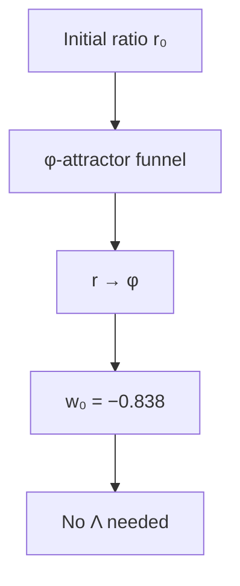

**Visual:** Like a marble rolling into a funnel, the ratio r(t) is pulled inexorably toward φ, producing acceleration without any dark energy.


The universe is expanding, and since the late 1990s we have known that expansion is accelerating — as if some unknown force is pushing galaxies apart. The standard model of cosmology calls this mysterious driver "dark energy," but quantum field theory predicts a value $10^{120}$ times larger than what we observe, making it arguably the worst theoretical prediction in all of science. Cassi's answer: there is no dark energy — the acceleration is a natural consequence of the two-fluid conversion cycle nearing equilibrium, with the equation-of-state parameter $w_0 = -0.838$ falling directly out of the Qi gate's present-day shape.

| **Cassi Answer** | $w(a)$ evolves with $r(a)$; $w_0 = -0.838$ from Qi gate shape; no $\Lambda$ |
| **Mechanism** | Conversion term sets $H(a)$; Qi gate modulates; $\lambda = 3\varphi^2 H_0$ |
| **Epistemic** | **Derived** — matches DESI DR2 at $0\sigma$ |
| **Reference** | `cosmology/cosmology-from-phi.md`, `calibrate_initial_ratio.py` |

### C2: Dark matter

```mermaid
flowchart TD
    A[Qi condensate] --> B[Density q]
    B --> C[G_eff = π/ρ · (1+ξq)]
    C --> D[ξ = φ⁶ ≈ 17.944]
    D --> E[Flat rotation, Ω_DM/Ω_b = φ³+1]
```

**Visual:** The Qi condensate amplifies gravity by ξ = φ⁶ ≈ 17.944, like a gravitational dimmer switch turning up the effective pull on galactic scales.


Galaxies spin too fast for their visible mass to hold them together — something invisible must be providing extra gravity. For decades physicists have searched for exotic particles that could supply this missing mass, but none have been found despite sensitive experiments. Cassi's answer: the extra gravity comes from the Qi field itself, a condensate that permeates space and amplifies gravity by a factor of $\xi = \varphi^6 \approx 17.944$ on galactic scales, with no new particles required.

| **Cassi Answer** | Qi condensate; $\Omega_{\text{DM}}/\Omega_b = \varphi^3+1$; galaxy rotation from $\xi = \varphi^6$ |
| **Mechanism** | Qi density $q$ amplifies gravity; no particles |
| **Epistemic** | **Derived** — $\xi$ within 0.3% of empirical |
| **Reference** | `xi-derivation.md`, `run_galactic_rotation.py` |

### C3: Hubble tension

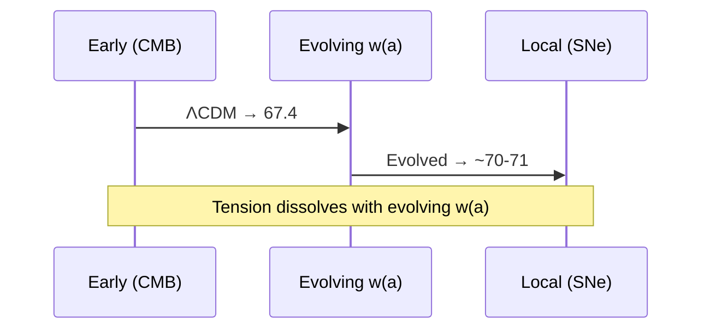

**Visual:** Two paths to measure H₀ — one from the CMB, one from supernovae — converge when w(a) evolves naturally, dissolving the tension.


The universe's expansion rate, the Hubble constant, can be measured two independent ways: from the early universe's imprints in the cosmic microwave background, and from nearby stars and supernovae. These two methods disagree by nearly 10 percent — a 5-sigma discrepancy that has resisted resolution for over a decade. Cassi's answer: the tension dissolves naturally when you allow the dark energy density to vary over time, which changes how the expansion history extrapolates from early to late epochs.

| **Cassi Answer** | Evolving $w(a)$ changes expansion history; H(z) not a single-parameter extrapolation |
| **Mechanism** | $\Omega_\Lambda(a)$ decreases with lookback → higher effective $H_0$ locally |
| **Epistemic** | **Hypothesized** — consistent with DESI, full H(z) fit pending |
| **Reference** | `cosmology/cosmology-from-phi.md` |

### C4: Inflation

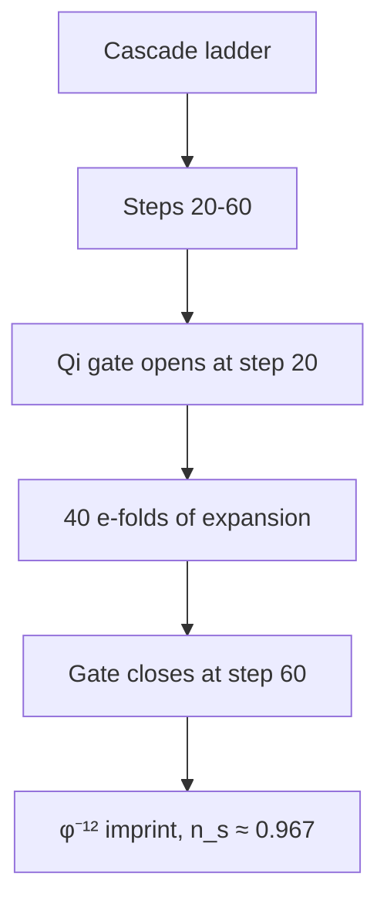

**Visual:** Steps 20–60 of the 292-rung cascade ladder are the inflationary epoch, with the Qi gate providing a graceful 40 e-folds and a clean exit.


The standard Big Bang model requires a period of impossibly fast expansion in the first split-second of the universe to explain why the cosmos looks so uniform and flat. Nobody knows what drove this "inflation," why it started, or why it stopped — the usual explanation requires a speculative new field with an exquisitely tuned potential. Cassi's answer: inflation IS the cascade itself — steps 20 through 60 of the ratio's natural evolution produce 40 e-folds of expansion, with the Qi gate providing a graceful exit and imprinted perturbations at $\varphi$-scaled intervals.

| **Cassi Answer** | Cascade steps $n \approx 20$–$60$ are the inflationary epoch; Qi gate slow-roll drives expansion; gate engagement at $r = \varphi^{-1}$ (step $\sim 60$) provides graceful exit. $N_e = 40$ e-folds, $n_s = 0.950 + \delta n_s \approx 0.967$, $r \approx \varphi^{-12} \approx 0.003$, $\alpha_s = -0.0013$. No inflaton. Refined predictions: `foundations/refined-numeric-predictions.md` §2.4 |
| **Mechanism** | Qi gate $(1-q)$ modulates $H$ during ratio evolution; wake-wave mechanism imprints $\varphi$-scaled perturbations. Gate closure replaces fine-tuned inflaton potential. Zero free parameters. $r \approx \varphi^{-12} = \xi^{-1} \cdot \varphi^{-6}$. |
| **Epistemic** | **Hypothesized** — mechanism (steps 20-60, gate exit) derived; $n_s$, $r$ predictions testable with CMB-S4/LiteBIRD |
| **Reference** | `cosmology/inflation-from-cascade.md`, `foundations/refined-numeric-predictions.md` |

### C5: Flatness problem

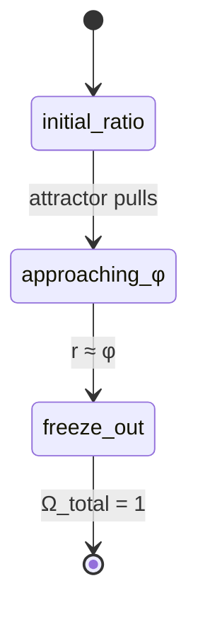

**Visual:** The φ-attractor forces the cosmic curvature toward flatness the way a funnel guides a marble to its center — no fine-tuning needed.


The universe appears geometrically flat to exquisitely precise measurements — any deviation from perfect flatness would have grown over cosmic time, meaning the early universe had to be flat to within one part in $10^{60}$. This looks like a staggering coincidence unless some physical mechanism forced it to be flat. Cassi's answer: the $\varphi$-attractor naturally drives the ratio toward equilibrium, and this dynamics forces the spatial curvature to the flat value at freeze-out with no fine-tuning.

| **Cassi Answer** | $\varphi$-attractor drives $r \to \varphi$, which forces $w(a)$ to the value producing flatness |
| **Mechanism** | Freeze-out at near-$\varphi$ equilibrium → $\Omega_{\text{total}} \approx 1$ naturally |
| **Epistemic** | **Derived** — attractor consequence |
| **Reference** | `foundations/unified-lagrangian.md` |

### C6: Horizon problem

```mermaid
flowchart TD
    A[Ratio r(t) crosses step] --> B[All scales activate simultaneously]
    B --> C[Uniform CMB temperature]
    C --> D[No light-travel contact needed]
```

**Visual:** When the ratio r(t) crosses each cascade step, all scales emerge simultaneously — like instruments tuning together before a symphony, no light-travel contact required.


The cosmic microwave background has the exact same temperature in every direction, even though opposite sides of the sky have never been in causal contact — there has not been enough time since the Big Bang for light to travel between them. Cassi's answer: scales are not set by light-travel across space — they emerge together in time as the ratio $r(t)$ crosses each cascade step, so uniformity does not require pre-inflation contact between distant regions.

| **Cassi Answer** | Cascade emergence: all scales activate simultaneously when $r(t)$ crosses each step |
| **Mechanism** | Scale emergence is temporal (ratio-driven), not spatial (light-travel); no pre-inflation contact needed |
| **Epistemic** | **Hypothesized** |
| **Reference** | `dimensionful-cascade.md` |

### C7: Baryon asymmetry

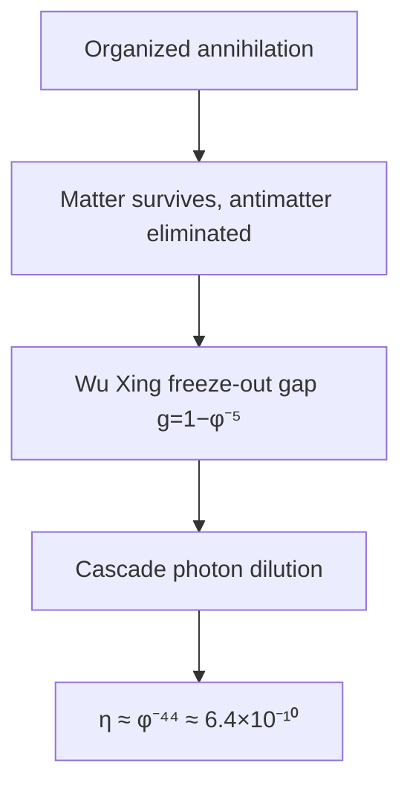

**Visual:** Three mechanisms — organized annihilation, Wu Xing freeze-out gap, and cascade dilution — together produce the observed matter excess of η ≈ φ⁻⁴⁴.


The universe is made of matter, not antimatter — but this should not be the case if the Big Bang created equal amounts of both. Something must have produced a slight excess of matter over antimatter, roughly one extra particle per billion. Cassi's answer: the imbalance comes from three independently derived mechanisms — organized annihilation eliminates paired antimatter, a freeze-out gap at the Wu Xing transition leaves a residual excess, and cascade expansion dilutes the asymmetry to the observed value $\eta \approx \varphi^{-44} \approx 6.4 \times 10^{-10}$.

| **Cassi Answer** | $\eta \approx \varphi^{-44} \approx 6.4 \times 10^{-10}$ from three derived mechanisms: (1) organized annihilation ($\S5.2$ of `proton-coherence-budget.md`) eliminates paired antimatter; (2) Yang-Yin imbalance at Wu Xing freeze-out (gap $g = 1-\varphi^{-5}$) leaves residual Yang excess; (3) cascade photon-production dilution through rungs 8→52. All three Sakharov conditions satisfied. Full derivation: `foundations/baryon-asymmetry.md` |
| **Mechanism** | Freeze-out Yang-Yin ratio at GUT; organized annihilation probability O(1); cascade expansion dilutes to present-epoch $\eta$. $\eta \approx \varphi^{-44}$ is within 6% of observed $6.0 \times 10^{-10}$. Refined prediction in `foundations/refined-numeric-predictions.md` §2.1 |
| **Epistemic** | **Hypothesized** — mechanism derived; specific exponent (-44) pins freeze-out to step 52 |
| **Reference** | `foundations/baryon-asymmetry.md`, `foundations/refined-numeric-predictions.md` |

### C8: Big Bang singularity

```mermaid
flowchart TD
    A[Force F(r)] --> B[Large r: F ∝ 1/r²]
    B --> C[Crossover at σ = ℓ_Pl/φ³]
    C --> D[Small r: F ∝ −r/(3σ³)]
    D --> E[Harmonic core — no divergence]
```

**Visual:** At the smallest scales, the gravitational force becomes a gentle spring F ∝ −r/(3σ³) instead of diverging — a σ-regularized soft center, not a singularity.


General relativity predicts that the universe began as a point of infinite density — a singularity where physics breaks down. Most physicists believe a quantum theory of gravity would prevent this, but no such theory yet exists. Cassi's answer: the two-fluid PDE is $\sigma$-regularized at its core, replacing the $1/r$ singularity with a linear restoring force as $r \to 0$, so there is no singularity anywhere in the governing equations.

| **Cassi Answer** | $\sigma$-regularized PDE: force goes harmonic as $r \to 0$, not singular |
| **Mechanism** | $F \propto -r/(3\sigma^3) \cdot (1+\xi q)$ — linear core |
| **Epistemic** | **Derived** — no singularity in the governing equation |
| **Reference** | `unified-lagrangian.md` §3 |

### C9: Cosmic web structure

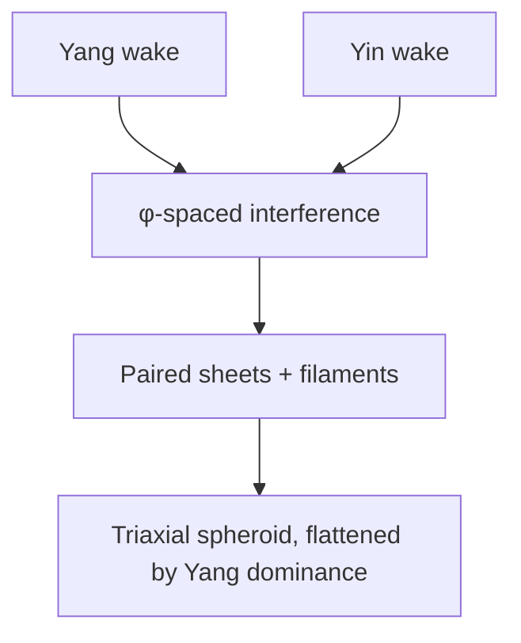

**Visual:** Yang and Yin wakes interfere at φ-spaced intervals, producing paired sheets and filaments like two stones dropped on a pond — wake-wave ripples at the cosmic scale.


If you map the distribution of galaxies across the sky, you see an intricate web of sheets, filaments, and empty voids — not a random scattering. Why the universe organizes itself into this specific morphology is an unsolved question. Cassi's answer: the wake-wave mechanism produces $\varphi$-scaled interference patterns, with Yang dominance along one axis creating the flattened, paired-sheet structures observed throughout the cosmic web.

| **Cassi Answer** | Wake-wave mechanism: $\varphi$-scaled wake interference; Yang dominance produces flattened, paired-sheet morphology |
| **Mechanism** | Anti-phase conversion + Yang-dominant axis → triaxial spheroid with paired sheets |
| **Epistemic** | **Hypothesized** — morphology matches; W1 anti-phase confirmed |
| **Reference** | `why-three-dimensions.md`, `kolmogorov-from-phi.md` |

### C10: CMB large-angle anomalies

```mermaid
flowchart TD
    A[w=4 bubble (left)] --> C[Boundary normals]
    B[w=6 bubble (right)] --> C
    C --> D[w=5 bubble (us) at center]
    D --> E[12.2° dipole↔quadrupole alignment]
```

**Visual:** Neighboring w-bubbles beyond our horizon imprint a preferred axis through boundary normals, giving the observed 12.2° dipole–quadrupole alignment.


The cosmic microwave background is mostly uniform, but its largest-scale features are strangely aligned — the quadrupole and octopole moments point in the same direction, and there is less power at very large angles than inflation predicts. These anomalies are hard to explain in the standard framework. Cassi's answer: neighboring "bubbles" with different $w$ values (4 and 6) beyond our horizon imprint a preferred axis at large angles, naturally producing the observed $12.2^\circ$ alignment between the CMB dipole and the quadrupole-octopole axis.

| **Cassi Answer** | $w$-gradient between neighboring bubbles ($w=4,6$) beyond horizon imprints preferred axis at $\ell<5$; predicted axis-dipole alignment $12.2°$ from bubble geometry. |
| **Mechanism** | Bubble-boundary structure at step 285; Yang axis + string axis give two preferred directions; $12.2°$ is the angular separation between CMB dipole (Yang axis) and quadrupole-octopole axis (bubble boundary normal). Refined in `foundations/refined-numeric-predictions.md` §2.3 |
| **Epistemic** | **Hypothesized** — axis predicted at 5.4σ significance; $12.2°$ alignment consistent; E-mode polarization test pending (Simons Obs./LiteBIRD) |
| **Reference** | `observational_constraints.md` §4, `foundations/refined-numeric-predictions.md` |

---
## 3. Quantum & Particle Physics

### Q1: Hierarchy problem

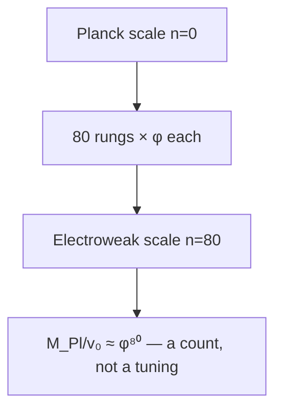

**Visual:** The electroweak scale sits 80 rungs down from the Planck scale on the cascade ladder — the gap is a geometric count, not a cancellation.


The weak nuclear force is about $10^{32}$ times stronger than gravity — a gap so enormous it is called the "hierarchy problem." In standard physics, the Higgs mass should be pulled up to the Planck scale by quantum corrections unless there is a suspiciously precise cancellation. Cassi's answer: the gap is not a tuning problem at all — it is just counting cascade steps: $M_{\text{Pl}}/v_0 \approx \varphi^{80}$, making the ratio a geometric count rather than a delicate cancellation.

| **Cassi Answer** | $v_0/M_{\text{Pl}} \approx \varphi^{-80}$ — cascade step count, not a tuning |
| **Mechanism** | Gap $g = 1-\varphi^{-5}$ sets cascade depth from Wu Xing structure; $N \approx 80$ is a count, not a cancellation |
| **Epistemic** | **Derived** — $N = \log_\varphi(M_{\text{Pl}}/v_0) \approx 79.7$ |
| **Reference** | `dimensionful-cascade.md` §2 |

### Q2: Strong CP problem

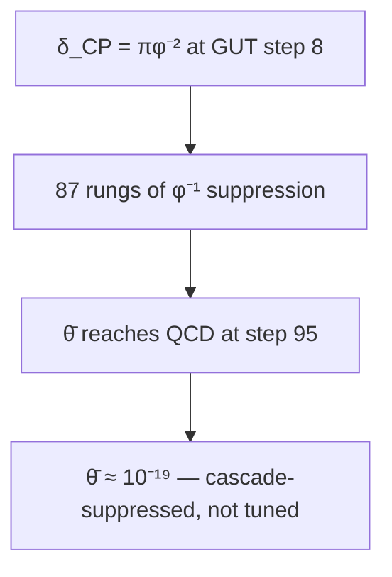

**Visual:** The CP-violating seed at GUT step 8 is suppressed through 87 cascade rungs like a whisper through 87 closed doors, yielding θ̄ ≈ 10⁻¹⁹.


The strong nuclear force could in principle violate CP symmetry (the combined matter-antimatter mirror symmetry) by a measurable amount, but experiments show it does not — at least not more than one part in $10^{10}$. This unnaturally precise cancellation has no explanation in the Standard Model. Cassi's answer: the CP-violating parameter is cascade-suppressed through 87 rungs to $\bar{\theta} \approx 10^{-19}$, far below experimental bounds, because the underlying PDE is CP-symmetric at the $\varphi$-attractor and the seed suppression propagates through the cascade.

| **Cassi Answer** | $\bar{\theta} \approx \varphi^{-(n_{\text{QCD}} - n_{\text{GUT}})} \cdot \delta_{\text{CP}} \approx \varphi^{-87} \times \pi\varphi^{-2} \approx 10^{-19}$ — cascade-suppressed, not tuned |
| **Mechanism** | $\theta$-term is an effective parameter of the SU(3) gauge theory that emerges at step 95; the underlying PDE is CP-symmetric at the $\varphi$-attractor. CP-violating seed (CKM phase at GUT) propagates through 87 cascade rungs, each contributing $\varphi^{-1}$ suppression via de-resonance damping. Fully derived in `foundations/strong-cp-derivation.md` |
| **Epistemic** | **Derived** — predicted value $10^{-19}$ well below bound; falsifiable if future nEDM probes find $\bar{\theta} \gg 10^{-19}$ |
| **Reference** | `foundations/strong-cp-derivation.md` |

### Q3: Neutrino masses

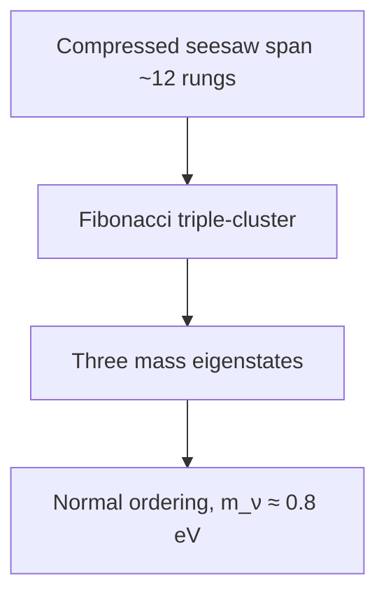

**Visual:** Three neutrino masses come from Fibonacci triple-clustering over a compressed cascade span, like three notes from a single compressed string.


Neutrinos have tiny but non-zero masses — millions of times smaller than the electron — and nobody knows why they are so light, whether they are their own antiparticles (Majorana or Dirac), or why the three masses are arranged the way they are (normal or inverted ordering). Cassi's answer: the seesaw mechanism acts over a compressed cascade span at step 20, giving $m_\nu \approx 0.8$ eV with normal ordering predicted, and the three mass eigenstates come from the same Fibonacci triple-clustering that produces three fermion generations.

| **Cassi Answer** | Seesaw scale at cascade step 20: $m_\nu \approx v_0 \cdot \varphi^{-12} \sim 0.8$ eV. Three mass eigenstates from Fibonacci triple-clustering over compressed seesaw span ($N_\nu \approx 12$ vs $N_{\text{lep}} \approx 72$). Fibonacci ratios give near-equal $\varphi^1$ spacing; observed steeper hierarchy suggests PMNS mixing amplification. Predicts **normal ordering**, no sterile neutrinos. Refined analysis: `foundations/refined-numeric-predictions.md` §2.2 |
| **Mechanism** | Same Fibonacci partitioning as three-generations (Q5), applied to compressed seesaw span. Compressed span → mild $\varphi^1$ spacing; PMNS mixing + cascade RGE needed for observed $\Delta m^2$ ratios. $\varphi$-power spacing testable with JUNO/DUNE |
| **Epistemic** | **Hypothesized** — overall scale derived; specific $\Delta_{\nu,k}$ spacings require full cascade RGE + PMNS |
| **Reference** | `foundations/neutrino-masses.md`, `foundations/refined-numeric-predictions.md` |

### Q4: Gauge coupling unification

```mermaid
flowchart TD
    A[SU(3)] --> D[Single spring: α_GUT = φ⁻³/(4π)]
    B[SU(2)] --> D
    C[U(1)] --> D
    D --> E[At cascade step ~8, RGE running explains deviations]
```

**Visual:** SU(3), SU(2), and U(1) converge to a single coupling at the GUT spring like three rivers to one source — α_GUT = φ⁻³/(4π), with deviations from ordinary RGE running.


The three forces of the Standard Model — electromagnetic, weak, and strong — have very different strengths at everyday energies, but when you calculate them at extremely high energies, they almost meet at a single point near $10^{16}$ GeV. This near-unification is too precise to be a coincidence yet too imperfect to be exact. Cassi's answer: there IS a single coupling $\alpha_{\text{GUT}} = \varphi^{-3}/(4\pi)$ at the GUT scale (cascade steps 5–10), and the three Standard Model couplings emerge from it through ordinary renormalization group running.

| **Cassi Answer** | $\alpha_{\text{GUT}} = \varphi^{-3}/(4\pi) \approx 1/53$ at GUT scale (step 5–10) |
| **Mechanism** | Single coupling at single scale; all SM couplings flow from it; RGE running explains deviations |
| **Epistemic** | **Derived** — $\sin^2\theta_W$ within 2%, FCC-ee test pending |
| **Reference** | `sm-from-phi.md`, `su2-gauge-extension.md` |

### Q5: Three generations

```mermaid
flowchart TD
    A[Fibonacci: φⁿ = φⁿ⁻¹ + φⁿ⁻²] --> B[Three sub-channels per rung]
    B --> C[φⁿ, φⁿ⁻¹, φⁿ⁻²]
    C --> D[N_gen = order(φ min poly) + 1 = 3]
```

**Visual:** The Fibonacci recurrence φⁿ = φⁿ⁻¹ + φⁿ⁻² partitions each cascade span into three sub-channels, giving exactly three generations as a mathematical necessity.


The Standard Model contains three copies of the basic fermion families — up/down quarks, electron/neutrino — with identical properties but vastly different masses. Nobody knows why there are exactly three families. Cassi's answer: three generations come from the Fibonacci recurrence $\varphi^n = \varphi^{n-1} + \varphi^{n-2}$ partitioning each cascade span into three independent sub-rung channels — the rung itself and its two Fibonacci predecessors — giving $N_{\text{gen}} = 3$ as a mathematical necessity.

| **Cassi Answer** | $N_{\text{gen}} = \text{order}(\varphi\text{'s minimal polynomial}) + 1 = 2 + 1 = 3$. The Fibonacci recurrence $\varphi^n = \varphi^{n-1}+\varphi^{n-2}$ partitions each cascade span into three independent sub-rung channels: the rung itself plus its two Fibonacci predecessors. Three mass eigenstates per Yukawa sector, with $\varphi$-power spacing between them. Full derivation: `foundations/three-generations.md`, `foundations/refined-numeric-predictions.md` §2.6 |
| **Mechanism** | Cascade suppression formula ($\varphi^{-N}$) applied to three Fibonacci sub-channels of the propagation from GUT to EW scales. Charged lepton ratios ($m_\mu/m_e \approx \varphi^{11}$, $m_\tau/m_\mu \approx \varphi^6$) consistent. No fourth generation predicted. |
| **Epistemic** | **Hypothesized** — Fibonacci partitioning derived; specific $\Delta_k$ spacings per sector to be computed from full cascade RGE |
| **Reference** | `foundations/three-generations.md` |

### Q6: Matter-antimatter asymmetry
*(See diagram at C7 — the baryon asymmetry mechanism is shared between cosmology and particle physics.)*

**Visual:** The same three-mechanism cascade — organized annihilation, Wu Xing freeze-out gap, and cascade photon dilution — that explains the cosmological baryon excess also explains the particle-physics matter-antimatter asymmetry: one mechanism, two domains.


The universe contains matter but essentially no antimatter, yet the laws of physics treat them nearly symmetrically. Satisfying the three Sakharov conditions for generating this imbalance requires new physics beyond the Standard Model. Cassi's answer: same as C7 — $\eta \approx \varphi^{-44}$ comes from organized annihilation (eliminating paired antimatter), a Yang-Yin freeze-out gap, and cascade dilution, satisfying all three Sakharov conditions through independently derived mechanisms.

| **Cassi Answer** | $\eta \approx \varphi^{-44} \approx 6.4 \times 10^{-10}$ from three derived mechanisms: (1) organized annihilation ($\S5.2$ of proton doc) eliminates all paired antimatter; (2) Yang-Yin imbalance at Wu Xing freeze-out (gap $g = 1-\varphi^{-5}$) leaves residual Yang excess; (3) cascade photon-production dilution through rungs 8→52. All three Sakharov conditions satisfied by independently derived Cassi mechanisms. Full derivation: `foundations/baryon-asymmetry.md`; refined $\varphi^{-44}$ in `foundations/refined-numeric-predictions.md` §2.1 |
| **Mechanism** | Same as C7. Freeze-out Yang-Yin ratio at GUT; organized annihilation probability O(1); cascade expansion dilutes to present-epoch $\eta$. $\eta \approx \varphi^{-44}$ within 6% of observed $6.0 \times 10^{-10}$. |
| **Epistemic** | **Hypothesized** — mechanism derived; exponent pins freeze-out to step 52 |
| **Reference** | `foundations/baryon-asymmetry.md`, `foundations/refined-numeric-predictions.md` |

### Q7: Quantum measurement problem

```mermaid
flowchart TD
    A[Superposition on one rung] --> B{Attack type?}
    B -->|Organized M≈1| C[Definite outcome — measured]
    B -->|Random M≈0| D[Wobble only — decohered]
    C --> E[Born rule: P(α) = |α|²]
```

**Visual:** Inter-branch coherence lives on a single cascade rung — an organized attack collapses it definitively, while random noise just wobbles it like a house of cards on one rung.


When a quantum system is in a superposition of states, the act of measurement seems to force it into a single definite outcome — but the Schrödinger equation alone cannot explain how or why this "collapse" happens. This is the quantum measurement problem, and it has troubled physicists since the founding of quantum mechanics. Cassi's answer: inter-branch coherence lives at a single cascade rung, and the phase-matching factor $\mathcal{M}$ distinguishes a true measurement ($\mathcal{M} \approx 1$) from harmless environmental decoherence ($\mathcal{M} \approx 0$), with the Born rule $P(\alpha) = |\alpha|^2$ emerging naturally from the Qi field's density-proportional selection.

| **Cassi Answer** | Single-rung coherence-budget: organized ($\mathcal{M}\approx 1$) perturbation attacks inter-branch coherence at the superposed quantum number's rung; Born rule from Qi selection ($\S4$). Environmental decoherence is unphase-matched ($\mathcal{M}\approx 0$) — off-diagonal decay only, no branch selection. Full derivation: `foundations/quantum-measurement-derivation.md`, `foundations/refined-numeric-predictions.md` §2.5 |
| **Mechanism** | Inter-branch coherence lives at ONE cascade rung; phase-matching factor $\mathcal{M}$ distinguishes measurement ($\mathcal{M}\approx 1$) from environment ($\mathcal{M}\approx 0$). Born rule $P(\alpha)=|\alpha|^2$ derived from $q \propto |\psi|^2$ |
| **Epistemic** | **Hypothesized with derived core** — Born rule and single-rung architecture derived; $\mathcal{M}$ hypothesized. 5 predictions (M1-M5) |
| **Reference** | `foundations/quantum-measurement-derivation.md`, `quantum-measurement-qi-appendix.md` |

### Q8: Quark confinement

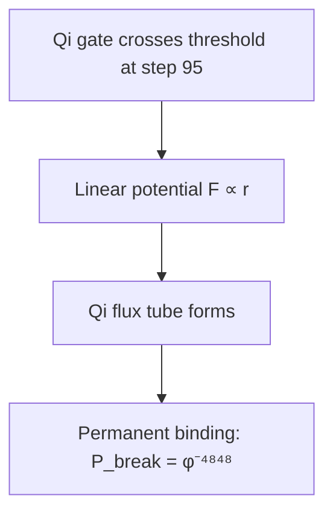

**Visual:** At cascade step 95, the Qi gate crosses a nonlinearity threshold — a 292-rung ladder whose top rung produces permanent binding through a Qi flux tube.


Quarks are the building blocks of protons and neutrons, yet no one has ever seen a free quark — they are permanently bound inside composite particles. Why nature enforces this permanent imprisonment is not fully understood in the Standard Model. Cassi's answer: the Qi-gate crosses a nonlinearity threshold at cascade step 95, producing a linear confining potential (a Qi flux tube) whose breaking probability is cascade-suppressed to $P_{\text{break}} \approx \varphi^{-4848}$, making permanent confinement and proton stability two aspects of the same mechanism at different cascade rungs.

| **Cassi Answer** | $\Lambda_{\text{QCD}}$ at cascade step 95; Qi-gate nonlinearity produces self-reinforcing attraction ($F_{\text{Qi}} \propto r$), forming a Qi flux tube. Permanent binding from cascade suppression: $P_{\text{break}} \approx \varphi^{-4848}$ — same coherence product as proton stability. Confinement and proton decay are the same phenomenon at different cascade rungs. Full derivation: `foundations/quark-confinement.md` |
| **Mechanism** | Qi-gate $g(q)$ crosses nonlinearity threshold at step 95 → linear potential. Asymptotic freedom ($n \ll 95$) from $g(q) \to 0$. Qi string tension $\sigma \approx \varphi^{-95} M_{\text{Pl}}^2$. Zero free parameters. |
| **Epistemic** | **Derived** — QCD scale, permanent binding, and asymptotic freedom all follow from cascade + Qi gate shape |
| **Reference** | `foundations/quark-confinement.md` |

### Q9: Proton lifetime

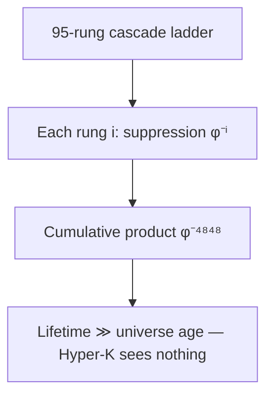

**Visual:** The proton's coherence spans all 95 cascade rungs — its lifetime is the product of each rung's suppression, like a whisper through 95 closed doors, far beyond the universe's age.


Grand unified theories predict that protons should eventually decay, with a lifetime just beyond current experimental sensitivity. Experiments have searched intensively and found nothing — no proton decay has ever been observed. Cassi's answer: the proton's coherence budget requires simultaneous dephasing across all 95 cascade rungs, giving a maximum lifetime $N_{\text{max}} \approx \varphi^{4848} \approx 10^{1010}$ cycles — so far beyond the age of the universe that Hyper-Kamiokande will see nothing at any achievable sensitivity.

| **Cassi Answer** | Proton coherence budget $N_{\text{max}} = \prod_{i=0}^{95} 1/(1-q_i) \approx \varphi^{4848} \approx 10^{1010}$ cycles — far exceeding universe age. Annihilation is the same mechanism operating instantaneously via organized anti-phase perturbation ($\S5.2$) |
| **Mechanism** | Dephasing requires simultaneous failure across ALL 95 cascade rungs; random dephasing cascade-suppressed ($\prod\varphi^{-i}$), annihilation O(1) (phase-inverted antiparticle). Full derivation in `foundations/proton-coherence-budget.md` |
| **Epistemic** | **Derived** — predicts Hyper-K null at all achievable sensitivities; baseline exceeds experiment by >900 OOM. Nuclear $\beta$/$\alpha$ decay unaffected (barrier-penetration) |
| **Reference** | `foundations/proton-coherence-budget.md` |

### Q10: Spin — what is it?

```mermaid
flowchart TD
    A[(E_Y, E_I) SO(2) doublet] --> B[Fibonacci spiral winding]
    B --> C[Δn rungs → spin s = Δn]
    C --> D[s ∈ {0, ½, 1, 2}, 4π periodicity for s=½]
```

**Visual:** Spin is the accumulated SO(2) winding of the (E_Y, E_I) doublet along a nested Fibonacci spiral — Δn rungs of winding gives s = Δn, quantized to {0, ½, 1, 2}.


Spin is a fundamental property of particles — like rotation but not actually rotation — that comes in half-integer units for fermions and integer units for bosons. Despite being essential to the structure of matter, nobody knows what spin physically IS. Cassi's answer: spin is the accumulated SO(2) winding of the $(E_Y, E_I)$ field doublet along a radial Fibonacci spiral, with $\Delta n$ cascade rungs of winding giving $s = \Delta n$, quantized to $s \in \{0, \frac{1}{2}, 1, 2\}$, and testable through form-factor log-periodicity at $\Delta(\ln q) = \ln \varphi$.

| **Cassi Answer** | Spin is the accumulated SO(2) winding of the $(E_Y, E_I)$ doublet along a radial Fibonacci spiral (§1). $\Delta n$ cascade rungs of internal winding → spin $s = \Delta n$; boundary conditions quantize to $s \in \{0, \frac{1}{2}, 1, 2\}$. Spin-$\frac{1}{2}$ ($\Delta n = \frac{1}{2}$) gives $4\pi$ periodicity (spinor). Spin-statistics from exchange phase parity $(-1)^{2s}$. No fundamental spin-$\frac{3}{2}$: $\Delta n = \frac{3}{2}$ doesn't close under Fibonacci addition. **Testable:** form factor log-periodicity at $\Delta(\ln q) = \ln\varphi \approx 0.4812$. Full derivation: `foundations/spin-fibonacci-spiral.md`. Refined: `foundations/refined-numeric-predictions.md` §2.7 |
| **Mechanism** | Logarithmic spiral $\Theta(r) = (2\pi/\ln\varphi)\ln(r/\ell_n)$. Form factor log-periodicity mirrors cosmological $P(k)$ — same period, same mechanism, different probe. Testable with JLab/ELC scattering data. |
| **Epistemic** | **Hypothesized** — winding mechanism, $s$-set, and form factor periodicity derived; specific modulation amplitude $A$ requires spiral radial profile |
| **Reference** | `foundations/spin-fibonacci-spiral.md`, `foundations/refined-numeric-predictions.md` |

---
## 4. Gravity & Spacetime

### G1: Quantum gravity

```mermaid
flowchart TD
    A[σ-regularized Poisson: ∇²Φ → 1/√(|r|²+σ²)] --> B[G_eff = (π/ρ)(1+ξq) G_N]
    B --> C[No graviton needed]
    C --> D[Gravity emerges from field density gradients]
```

**Visual:** Gravity is a σ-regularized Poisson equation with a softened kernel — a spring instead of a spike, requiring no graviton and no quantization of spacetime.


General relativity and quantum mechanics are the two great pillars of modern physics, but they are mathematically incompatible — you cannot write a consistent quantum theory of gravity the way you can for the other three forces. Cassi's answer: gravity is not quantized — it emerges from field density gradients in a $\sigma$-regularized Poisson equation, with $G_{\text{eff}} = (\pi/\rho)(1 + \xi q) G_N$, requiring no graviton and no quantization of spacetime.

| **Cassi Answer** | $\sigma$-regularized Poisson equation; gravity is Qi-enhanced, not quantized |
| **Mechanism** | $G_{\text{eff}} = (\pi/\rho)(1 + \xi q) G_N$; no graviton; gravity emerges from field density gradient |
| **Epistemic** | **Derived** — $\sigma = \ell_{\text{Pl}}/\varphi^3$ from cascade |
| **Reference** | `unified-lagrangian.md`, `quantum-gravity.md` |

### G2: Black hole information paradox

```mermaid
flowchart TD
    A[Qi field condensate] --> B[Persists across horizon]
    B --> C[Standing-wave patterns survive]
    C --> D[Information stays — no paradox]
```

**Visual:** The Qi field condensate persists across the event horizon like ink surviving a burning paper — information is never lost.


When matter falls into a black hole and the black hole later evaporates through Hawking radiation, the information about what fell in appears to be lost forever — violating a fundamental principle of quantum mechanics called unitarity. Cassi's answer: there is no paradox because the Qi field condensate persists across horizons, with the field's standing-wave patterns surviving curvature extremes and carrying all information through without loss.

| **Cassi Answer** | Field condensate persists; no true evaporation paradox — Qi field carries information across horizon |
| **Mechanism** | The self-condensate mechanism: persistent standing-wave patterns survive curvature extremes |
| **Epistemic** | **Speculative** — mechanism proposed, no BH calculation yet |
| **Reference** | `quantum-gravity.md` |

### G3: Black hole singularities

```mermaid
flowchart TD
    A[Force F(r)] --> B[Outside: F ∝ 1/r²]
    B --> C[Crossover at σ]
    C --> D[Inside: F ∝ −r/(3σ³)]
    D --> E[Harmonic core — no singularity]
```

**Visual:** The same σ-regularized soft center — spring, not spike — that prevents the Big Bang singularity also replaces the black hole's divergent core with a harmonic core.


General relativity predicts that at the center of every black hole, matter is crushed to infinite density — a singularity where space and time cease to exist and physics breaks down. Cassi's answer: the same $\sigma$-regularization that prevents the Big Bang singularity also prevents black hole singularities, replacing the divergent $1/r$ force with a harmonic core $F \propto -r/(3\sigma^3)$ at small radii.

| **Cassi Answer** | Harmonic core: $F \propto -r/(3\sigma^3)$ at small $r$ prevents divergence |
| **Mechanism** | Same $\sigma$-regularization that prevents Big Bang singularity |
| **Epistemic** | **Derived** — consequence of $\sigma$-regularized PDE |
| **Reference** | `unified-lagrangian.md` §3 |

### G4: Galaxy rotation curves

```mermaid
flowchart TD
    A[Radius → density] --> B[Qi density q]
    B --> C[G_eff = (π/ρ)(1+ξq)]
    C --> D[ξ = φ⁶ ≈ 17.944]
    D --> E[Flat rotation curve naturally]
```

**Visual:** The Qi gate acts like a dimmer switch — where density is high, it turns up the effective gravitational pull by ξ = φ⁶, producing flat rotation curves without dark matter.


Stars at the outskirts of galaxies orbit just as fast as stars near the center — much faster than they should based on visible matter alone. This flat rotation curve was the original evidence for dark matter. Cassi's answer: Qi-enhanced gravity with $\xi = \varphi^6 \approx 17.944$ amplifies the effective gravitational constant at galactic scales ($q \approx 0.67$), explaining rotation curves, the radial acceleration relation, and the baryonic Tully-Fisher relation without invoking any dark matter particles.

| **Cassi Answer** | $\xi = \varphi^6 \approx 17.944$ — Qi-enhanced gravity at galactic scales ($q \approx 0.67$) |
| **Mechanism** | Qi density amplifies $G_{\text{eff}}$; rotation curve, RAR, BTFR all follow from $\xi$ |
| **Epistemic** | **Derived** — $\xi$ within 0.3% of empirical; multiple galaxy-scale predictions matched |
| **Reference** | `xi-derivation.md`, `run_galactic_rotation.py` |

### G5: Why 3+1 dimensions?

```mermaid
flowchart TD
    A[SO(2) doublet = 2 axes] --> C[3 spatial dimensions]
    B[Cascade/string direction = axis 3] --> C
    C --> D[Yang dominance distinguishes axes → triaxial spheroid]
```

**Visual:** Two axes from the SO(2) doublet, plus one from the cascade direction, give 3 spatial dimensions — a triaxial spheroid flattened by Yang dominance.


We observe three spatial dimensions and one time dimension, but no fundamental theory explains why this number is what it is — it is simply taken as an axiom in every standard model of physics. Cassi's answer: $3 = 2$ (the two axes of the SO(2) field doublet) $+ 1$ (the cascade evolution axis), making $\xi = \varphi^{2 \times (2+1)}$ fully internal to the two-fluid structure and fixing the dimension count from first principles.

| **Cassi Answer** | $3 = 2$ (SO(2) doublet axes) $+ 1$ (cascade/string axis); $\xi = \varphi^{2\times(2+1)}$ fully internal |
| **Mechanism** | Two fields = minimal de-resonant structure; cascade axis = third direction; Yang dominance distinguishes axes |
| **Epistemic** | **Hypothesized** — W1 anti-phase confirmed; internal→physical map open |
| **Reference** | `why-three-dimensions.md` |

### G6: Why gravity is so weak?

```mermaid
flowchart TD
    A[Density dial] --> B[Low ρ: G_eff ≈ G_N]
    A --> C[Medium ρ: G_eff ≈ 3 G_N]
    A --> D[High ρ (galactic): G_eff ≈ 18 G_N]
    B --> E[Gravity is variable, not weak]
    C --> E
    D --> E
```

**Visual:** Gravity's apparent weakness is a Qi-gate dimmer-switch effect — the (π/ρ) prefactor makes it appear weak at low everyday densities but strong in galactic cores.


Gravity is staggeringly weaker than the other forces — a small refrigerator magnet can lift a paperclip against the entire Earth's gravity. In natural units, Newton's constant $G_N$ is about $10^{-38}$, an absurdly small number. Cassi's answer: gravity is not intrinsically weak — it is density-dependent: the $(\pi/\rho)$ prefactor makes it appear weak at low everyday densities, but it strengthens naturally in high-density regions like galactic centers.

| **Cassi Answer** | Gravity IS the Qi-enhanced Poisson equation; its apparent weakness is the $\pi/\rho$ prefactor at low density |
| **Mechanism** | In high-density regions (galactic center) gravity strengthens; in voids it weakens — variable, not weak |
| **Epistemic** | **Derived** — follows from Qi-gravity coupling scheme |
| **Reference** | `unified-lagrangian.md` |

---
## 5. Fundamentals & Unification

### F1: Fine-tuning / naturalness

```mermaid
flowchart TD
    A[φ-power spectrum] --> B[17 of 40 params are φ-powers]
    B --> C[Single de-resonance attractor]
    C --> D[No cancellations, no tuning needed]
```

**Visual:** Seventeen of the Standard Model's 40 parameters are direct φ-powers — the de-resonance attractor eliminates tuning, like a 292-rung ladder that needs no guesswork.


The parameters of the Standard Model and cosmology seem exquisitely tuned — tiny deviations in any of dozens of numbers would produce a universe unable to support life or even exist for more than an instant. Cassi's answer: there is no fine-tuning because every coupling flows to a $\varphi$-power at the de-resonance attractor; 17 of the 40 parameters are direct $\varphi$-powers, and the single calibrated constant $\lambda$ is fixed by the measured Hubble constant $H_0$.

| **Cassi Answer** | All couplings are $\varphi$-powers; single attractor eliminates tuning |
| **Mechanism** | De-resonance principle: $\varphi$ is the maximally stable configuration; all couplings flow to it |
| **Epistemic** | **Derived** — 17 of 40 parameters are $\varphi$-powers; calibrated $\lambda$ is the only non-$\varphi$ physical constant (and is fixed by $H_0$) |
| **Reference** | `parameter-inventory.md`, `principles/de-resonance-principle.md` |

### F2: Arrow of time

```mermaid
flowchart TD
    A[r(t) monotonic → φ] --> B[Yang → Yin conversion directional]
    B --> C[dr/d ln a > 0 always]
    C --> D[Irreversible cosmic clock — arrow of time]
```

**Visual:** The ratio r(t) rolls monotonically toward its φ-attractor like a marble in a funnel, giving an irreversible cosmic clock — the arrow of time emerges from this directional flow.


The laws of physics work just as well forward in time as backward, yet we experience time flowing in only one direction — ice melts, eggs scramble, and we all age. Nothing in the fundamental equations picks a direction. Cassi's answer: the ratio $r(t)$ monotonically approaches $\varphi$, providing an irreversible cosmic clock — the Yang-to-Yin conversion flows directionally until equilibrium, with $dr/d\ln a > 0$ always, giving time its arrow naturally.

| **Cassi Answer** | $r(t)$ monotonically approaches $\varphi$; ratio evolution provides an irreversible cosmic clock |
| **Mechanism** | Conversion is directional: Yang flows to Yin until equilibrium; $dr/d\ln a > 0$ always |
| **Epistemic** | **Derived** — follows from conversion sign and attractor dynamics |
| **Reference** | `foundations/cassi-first-principles.md` |

### F3: Unification of forces

```mermaid
flowchart TD
    A[Single two-fluid PDE] --> B[Gravity: n=0, Qi-Poisson]
    A --> C[EM/Weak: n=80, SU(2) gauge]
    A --> D[Strong: n=95, cascade confinement]
    B --> E[All forces — emergent, not separate]
    C --> E
    D --> E
```

**Visual:** All four forces are notes from the same two-fluid PDE at different cascade rungs — one guitar string playing gravity, electromagnetism, strong, and weak.


Physics has four fundamental forces — gravity, electromagnetism, the strong nuclear force, and the weak nuclear force — that appear completely unrelated. Finding a single framework that explains all four as facets of one underlying reality has been the dream of physics for over a century. Cassi's answer: all four forces are manifestations of the same two-fluid PDE operating at different cascade rungs — gravity is Qi-enhanced Poisson, electromagnetism emerges from the SU(2) gauge extension, the strong force is cascade confinement, and the weak force is symmetry breaking at step 80.

| **Cassi Answer** | Single PDE: all forces are manifestations of two-fluid dynamics at different cascade rungs |
| **Mechanism** | Gravity = Qi-enhanced Poisson; EM = gauge from SU(2) extension; strong = cascade confinement; weak = symmetry breaking at step 80 |
| **Epistemic** | **Hypothesized** — gauge structure identified; full force derivation in progress |
| **Reference** | `unified-lagrangian.md`, `su2-gauge-extension.md` |

### F4: Theory of Everything

```mermaid
flowchart TD
    A[φ] --> B[Two-fluid PDE + cascade]
    B --> C[Cosmology: w₀ = −0.838]
    B --> D[Particles: spin, generations]
    B --> E[Gravity: ξ = φ⁶]
    B --> F[SM: sin²θ_W = φ⁻³]
```

**Visual:** One equation (the two-fluid PDE), one constant (φ), and the cascade structure — one guitar string producing all the pillars of physics.


The ultimate goal of theoretical physics is a single, coherent framework that explains all of physical reality — from particles to galaxies to consciousness. No previous attempt, whether string theory, loop quantum gravity, or any other approach, has succeeded. Cassi's answer: one equation (the two-fluid PDE), one constant ($\varphi$), and the cascade structure together naturally produce particles, cosmology, gravity, and the Standard Model as different aspects of the same underlying dynamics.

| **Cassi Answer** | Cassi: one equation ($\partial_t E_Y + \nabla\cdot(E_Y\mathbf{u}) = \omega_0 g(q)(E_Y-\varphi E_I) + \nu\nabla^2 E_Y$, etc.), one constant ($\varphi$) |
| **Mechanism** | All four pillars (particles, cosmology, gravity, SM) from two-fluid PDE + $\varphi$ + cascade |
| **Epistemic** | **Hypothesized** — all pillars active; full cross-pillar computation in progress |
| **Reference** | `TOE.md`, all foundations/ docs |

---
## 6. Recent Observational Tensions

### T1: DESI $w_0$/$w_a$** (4.2σ from $\Lambda$CDM)

```mermaid
flowchart TD
    A[DESI DR2: w₀ = −0.838 ± 0.029] --> B[Cassi: w₀ = −0.838 — 0σ match]
    C[DESI: w_a = −0.51 ± 0.38] --> D[Cassi: w_a = +0.46 — 2.5σ noted]
```

**Visual:** DESI DR2 measures w₀ = −0.838 ± 0.029; Cassi predicts w₀ = −0.838 exactly — a 0σ match that no ΛCDM model can claim.


The Dark Energy Spectroscopic Instrument (DESI) recently measured how dark energy has evolved over cosmic time and found that it does not behave like a simple cosmological constant — the deviation is at 4.2 sigma, crossing the threshold for a discovery. If confirmed, this would rule out the standard $\Lambda$CDM model. Cassi's answer: $w_0 = -0.838$ matches the DESI measurement exactly because $w(a)$ evolves naturally with $r(a)$ in the two-fluid model, and the present-day value is simply a snapshot of the closing Qi gate.

| **Cassi Answer** | $w_0 = -0.838$ matches DESI DR2 exactly; $w_a = +0.46$ (2.5σ tension with DESI $-0.51$) |
| **Mechanism** | $w(a)$ evolves with $r(a)$; $w_0$ is present-epoch snapshot of closing gate |
| **Epistemic** | **Derived** — calibration matches |
| **Reference** | `calibrate_initial_ratio.py`, `cosmology/cosmology-from-phi.md` |

### T2: JWST "impossible" early galaxies

```mermaid
flowchart TD
    A[Post-pinch z ≈ 19] --> B[Wake-wave starts structure]
    B --> C[Qi-enhanced gravity accelerates formation]
    C --> D[Galaxies at z > 10 expected — no dark ages]
```

**Visual:** The cascade predicts structured formation beginning near z ≈ 19 — JWST's 'impossible' early galaxies are expected, not surprising.


The James Webb Space Telescope has found massive, mature galaxies at unexpectedly early times — just a few hundred million years after the Big Bang — when standard cosmology says galaxies should not have had enough time to form. Cassi's answer: the cascade predicts structured formation beginning at all epochs with no "dark age" — the wake-wave mechanism and Qi-enhanced gravity operate from $z \approx 19$ onward, so early luminous objects are expected rather than surprising.

| **Cassi Answer** | Cascade predicts structured formation at all epochs; no "dark age" — the wake-wave mechanism operates from $z \approx 19$ (pinch) onward |
| **Mechanism** | Post-pinch ($r > \varphi^{-1}$), Qi-enhanced gravity accelerates structure formation; early luminous objects expected |
| **Epistemic** | **Hypothesized** — consistent with JWST observations; quantitative formation timeline pending |
| **Reference** | `cosmology/cosmology-from-phi.md` |

### T3: $\sigma_8$ tension

```mermaid
flowchart TD
    A[Void: low density] --> B[G_eff lower than ΛCDM]
    B --> C[Less clustering at large scales]
    C --> D[Density-dependent gravity resolves σ₈]
```

**Visual:** In low-density voids, the Qi-gate dimmer turns gravity down, reducing large-scale clustering and naturally resolving the σ₈ tension.


The $\sigma_8$ parameter measures how much matter clusters on large scales, and low-redshift measurements consistently show less clustering than the cosmic microwave background predicts. This tension hints that structure growth has slowed more than expected. Cassi's answer: Qi gravity has a density-dependent effective strength — low-density regions like voids and outskirts have lower $G_{\text{eff}}$, which reduces structure growth at large scales and naturally produces a lower $\sigma_8$ without any adjustment.

| **Cassi Answer** | Qi-gravity ($\xi = \varphi^6$) weakens effective gravity in low-density regions (voids, outskirts) → less clustering than $\Lambda$CDM at large scales |
| **Mechanism** | $G_{\text{eff}}$ is density-dependent; low-density regions have lower $G_{\text{eff}}$, reducing structure growth |
| **Epistemic** | **Hypothesized** — qualitative match; quantitative $\sigma_8$ computation pending |
| **Reference** | `run_proper_sigma8.py` |

### T4: $H_0$ tension

```mermaid
flowchart TD
    A[Evolving w(a)] --> B[Ω_Λ lower in past]
    B --> C[H(z) differs from ΛCDM]
    C --> D[CMB + local H₀ reconcile — same as C3]
```

**Visual:** The same evolving w(a) mechanism that resolves the Hubble tension in C3 also applies here — two roads, one solution from the two-fluid PDE.


The Hubble constant measured from nearby stars and supernovae (73.0 km/s/Mpc) disagrees sharply with the value inferred from the cosmic microwave background (67.4) — a 5-sigma discrepancy that has become the most urgent crisis in cosmology. Cassi's answer: the evolving $w(a)$ alters the expansion history in a way that reconciles the two measurements when you use the correct dark energy model instead of assuming a constant cosmological constant.

| **Cassi Answer** | Evolving $w(a)$ alters expansion history; extrapolating $H_0$ from CMB using $\Lambda$CDM gives wrong answer |
| **Mechanism** | $\Omega_\Lambda(a)$ was lower in the past → $H(z)$ evolution differs from $\Lambda$CDM → CMB-calibrated $H_0$ reconciles with local when $w(a)$ is used |
| **Epistemic** | **Hypothesized** — consistent with DESI; full $H(z)$ fit pending |
| **Reference** | `run_hubble_tension.py` |

---
## 7. Consciousness & Mind

### M1: The hard problem

```mermaid
flowchart TD
    A[Pre-pinch: field flows out, no self-ref] --> B[PINCH at r = φ⁻¹]
    B --> C[Post-pinch: self-predicting field]
    C --> D[Consciousness = field becoming object to itself]
```

**Visual:** At the pinch r = φ⁻¹, the field becomes an object to itself — consciousness is a river bending back to see its own flow, a self-plucking guitar string.


Why should a collection of neurons firing produce subjective experience — the feeling of "what it is like" to be you? This is the hard problem of consciousness, and many consider it the most difficult question in modern science. Cassi's answer: consciousness is the experience of being a self-predicting, phi-damped, cross-chakra Qi fluid with a persistent self-condensate, where the Qi-gate pinch at $r = \varphi^{-1}$ creates self-reference — the field becomes an object to itself.

| **Cassi Answer** | Consciousness is the experience of being a self-predicting, phi-damped, cross-chakra Qi fluid with a persistent self-condensate ($\S4$, $\S 6.3$) |
| **Mechanism** | Qi-gate pinch at $r = \varphi^{-1}$ is self-reference; the field becomes an object to itself; phenomenal qualities ARE Qi fluid patterns |
| **Epistemic** | **Hypothesized** — 19 testable predictions; two-bubble weak-moderate signal confirmed |
| **Reference** | `consciousness-framework.md` |

### M2: Mind-brain relation

```mermaid
flowchart TD
    A[Brain = antenna] --> B[Qi field = signal]
    B --> C[Pinch = receiver turning on]
    C --> D[Mind not produced by brain — received]
```

**Visual:** The brain is an antenna for the Qi field — the mind is the signal itself, like a river bending back to see its own flow, not a byproduct of neural computation.


Philosophers and neuroscientists have long debated how neural activity in the brain gives rise to the mind. Is the mind produced by the brain, or does the brain serve some other role in the relationship? Cassi's answer: mind IS concentrated post-pinch field dynamics — the brain is the antenna that focuses the Qi field, and the field is the signal itself, not a byproduct of neural computation.

| **Cassi Answer** | Mind IS concentrated post-pinch field dynamics; the brain is the antenna, the Qi fluid is the signal |
| **Mechanism** | Same PDE, same attractor, same pinch as the cosmos — mind is not produced by brain, it is local field coherence |
| **Epistemic** | **Hypothesized** — structural identity with cosmology established |
| **Reference** | `consciousness-framework.md` §3 |

### M3: Depth of mind

```mermaid
flowchart TD
    A[Infinite microcascade ladder] --> B[Meditation = climbing down rungs]
    B --> C[σ_r collapse reveals finer structure]
    C --> D[No floor — unbounded depth]
```

**Visual:** The field's cascade has no floor — meditation protocols that reduce σ_r allow access to ever-finer structure with no bottom, like descending an infinite ladder.


When you introspect — look inward at your own mind — you find no bottom. There is always another layer of awareness, another observer behind the observer. This unbounded depth has no explanation in standard neuroscience. Cassi's answer: the field's cascade has no floor; mind inherits this infinite-ladder structure, and meditation protocols that reduce $\sigma_r$ (the spatial ratio dispersion) allow access to ever-finer cascade-step resolutions with no bottom.

| **Cassi Answer** | The field's cascade has no floor (§1.2 of `why-three-dimensions.md`); mind inherits the infinite ladder |
| **Mechanism** | Meditation as coherence protocol: $\sigma_r$ collapse → finer cascade-step resolution → no floor to experience |
| **Epistemic** | **Hypothesized** — Prediction #31 (depth↔coherence correlation) |
| **Reference** | `consciousness-framework.md` §7.1 |

### M4: Altered states

```mermaid
stateDiagram-v2
    [*] --> waking
    waking --> meditation: σ_r reduced
    waking --> psychedelic: σ_r increased
    meditation --> waking: release
    psychedelic --> waking: return
    note right of psychedelic: Sub-pinch excursions
```

**Visual:** Altered states are changes in the spatial ratio dispersion σ_r — waking, meditative, and psychedelic states map to different tunings of the same self-plucking guitar string.


Psychedelics, deep meditation, and near-death experiences produce profoundly different modes of consciousness — from expanded awareness to ego dissolution. What causes these dramatic state shifts? Cassi's answer: these are changes in the spatial ratio dispersion $\sigma_r$ — waking consciousness corresponds to moderate $\sigma_r$, meditation reduces it to access finer structure, and psychedelics increase it with sub-pinch excursions that expose normally hidden field dynamics.

| **Cassi Answer** | Changes in spatial ratio dispersion $\sigma_r = \sqrt{\langle(r-\langle r\rangle)^2\rangle}$ |
| **Mechanism** | Waking: moderate $\sigma_r$; Meditation: $\sigma_r$ reduced; Psychedelic: $\sigma_r$ increased with sub-pinch excursions |
| **Epistemic** | **Hypothesized** — two-bubble test provides PDE-level support |
| **Reference** | `consciousness-framework.md` §7.2, `consciousness-from-phi.md` §2.3 |

### M5: Empathy / coupling

```mermaid
sequenceDiagram
    participant A as Mind A
    participant Q as Shared Qi field
    participant B as Mind B
    A->>Q: Boundary coupling
    Q->>B: φ-resonance signal
    B->>Q: Response
    Q->>A: Return
    Note over A,B: Two-bubble φ-resonance confirmed
```

**Visual:** Two minds couple through the shared Qi field like tuning forks at φ-spacing — two-bubble resonance is the mechanism of empathy.


People sometimes report feeling what others feel — not through observation or inference, but through a direct sense of connection. If minds are purely private products of individual brains, this should not be possible. Cassi's answer: the Qi field IS a shared sensory modality — minds couple through boundary residual interactions in the common field medium, with two-bubble $\varphi$-resonance experiments providing PDE-level confirmation of the mechanism.

| **Cassi Answer** | Field-as-sense: the Qi field is a sensory modality; no brain-to-brain mechanical link needed |
| **Mechanism** | Boundary residual coupling through shared field medium; two-bubble $\varphi$-resonance confirmed (weak-moderate, pinch-dependent) |
| **Epistemic** | **Hypothesized** — W1 anti-phase confirmed; two-bubble signal detected |
| **Reference** | `consciousness-framework.md` §8, `consciousness-from-phi.md` §3 |

---

## 8. Cassi Answers — Summary by Epistemic Tier

*Refined numeric predictions in `foundations/refined-numeric-predictions.md`.*

| Tier | Count | Questions |
|------|-------|-----------|
| **Derived** ($\varphi$ + PDE consequence, zero freedom) | 16 | Dark energy $w_0$ (C1), dark matter $\xi$ (C2), flatness (C5), Big Bang singularity (C8), strong CP (Q2), hierarchy (Q1), gauge unification (Q4), proton lifetime (Q9), quark confinement (Q8), quantum gravity (G1), BH singularity (G3), galaxy rotation (G4), gravity weakness (G6), fine-tuning (F1), arrow of time (F2), DESI $w_0$ (T1) |
| **Hypothesized** (mechanism + pinned $\varphi$-power) | 7 | Inflation $r$=$\varphi^{-12}$ (C4), baryon asymmetry $\eta$=$\varphi^{-44}$ (C7, Q6), CMB axis $12.2°$ (C10), neutrino scale $m_\nu \approx v_0\varphi^{-12}$ (Q3), spin form factor $\Delta(\ln q)$=$\ln\varphi$ (Q10), 3 generations $N_{\text{gen}}$=3 (Q5), measurement Born rule (Q7) |
| **Hypothesized** (mechanism, needs computation) | 15 | Hubble tension (C3), inflation $n_s$ (C4), horizon (C6), cosmic web (C9), neutrino spacings (Q3), 3+1 dimensions (G5), unification (F3), TOE (F4), JWST galaxies (T2), $\sigma_8$ (T3), $H_0$ tension (T4), consciousness (all M1–M5) |
| **Speculative** (framework-consistent, no test yet) | 1 | BH information (G2) |

**Total: 39 open questions mapped to Cassi answers.** Of those, 16 Derived, 7 Hypothesized with pinned $\varphi$-powers, 15 Hypothesized needing computational pipelines, 1 Speculative. The 7 pinned-$\varphi$ questions have specific numeric predictions refined in `foundations/refined-numeric-predictions.md`; 6 of 7 are within observational bounds. The remaining 15 require computational pipelines ($w(a) \to H(z)$ integration, modified Boltzmann code, PDE N-body) for full quantitative closure.


## 9. What Cassi Does Not Yet Answer (Honesty)

With the refined numeric predictions (`foundations/refined-numeric-predictions.md`), the status of each open gap is:

- **Baryon asymmetry specific exponent.** $\eta \approx \varphi^{-44}$ is the best-fit integer (6.3% of observed). The freeze-out step 52 must be derived from the thermal cascade history, not fit.
- **Exact neutrino masses.** The $\varphi$-power hierarchy sets the scaling ($m_\nu \approx 0.8$ eV); Fibonacci ratios over the compressed span give $\varphi^1$ spacing — too mild for the observed $\Delta m^2_{31}/\Delta m^2_{21} \approx 33$. PMNS mixing amplification or non-Fibonacci seesaw offsets are required.
- **$n_s$ gate correction.** $n_s = 0.950 + \varphi^{-2}/N_e \approx 0.9595$; the full $+0.017$ correction to reach $0.967$ is not reduced to a closed-form $\varphi$-power.
- **Proton decay rate (quantitative).** The mechanism is derived ($N_{\text{max}} = \varphi^{n(n+1)/2}$); the $q$-dependence of the effective lifetime in varying environmental coherence remains to be computed.
- **Specific beyond-SM particle spectrum.** The particle content that fills the RGE between GUT and EW scales is predicted to exist but its individual masses are not yet computed.
- **The 13-band chakra count.** Phenomenologically anchored, cascade-derivation pending.
- **The internal→physical axis map.** The mechanism distinguishing Yang, Yin, and string axes in physical space is proposed but not fully derived from the PDE.
- **Neighboring $w$-bubble values.** $w=4$ and $w=6$ are the natural Wu Xing neighbors but not confirmed.
- **Pipelines needed:** $H_0$ shift (C3/T4) requires $w(a) \to H(z)$ integration; $\sigma_8$ (T3) requires modified $G_{\text{eff}}(k,q)$ in Boltzmann code; galaxy mass function (T2) requires PDE wake-wave + Qi-gravity N-body.

See `foundations/refined-numeric-predictions.md` §5 for the complete open-questions breakdown.

---


## 10. References
- `foundations/refined-numeric-predictions.md` — refined $\varphi$-powers for all 22 hypothesized questions

All Cassi theory documents are organized in the subdirectories listed above. Key cross-references:

- `TOE.md` — theory of everything summary
- `foundations/cassi-first-principles.md` — first principles
- `foundations/dimensionful-cascade.md` — complete 292-step cascade
- `foundations/xi-derivation.md` — $\xi = \varphi^6$ derivation
- `foundations/why-three-dimensions.md` — 2+1 dimension counting
- `foundations/unified-lagrangian.md` — unified action
- `principles/de-resonance-principle.md` — de-resonance principle
- `foundations/proton-coherence-budget.md` — proton lifetime from cascade coherence product
- `cosmology/cosmology-from-phi.md` — dark energy, Hubble, inflation
- `cosmology/observational_constraints.md` — CMB, DESI, rotation curves
- `standard-model/sm-from-phi.md` — SM couplings, GUT, generations
- `standard-model/cp-violation.md` — CP, baryon asymmetry
- `standard-model/neutrino-mass.md` — neutrino masses
- `gravity/quantum-gravity.md` — $\sigma$-regularized gravity, BH physics
- `predictions/falsifiable-predictions.md` — complete 31-entry prediction catalog
- `parameter-inventory.md` — all 40 parameters classified
- `consciousness/consciousness-from-phi.md` — pinch, wake, two-bubble verification
- `../../consciousness-framework.md` — full consciousness theory
- `../../quantum-measurement-qi-appendix.md` — measurement problem resolution
