# Cassi Answers to the Open Questions of Physics

## Status: Comprehensive catalog—September 2026

## Abstract

Modern physics faces approximately 25–30 major open questions spanning
cosmology, particle physics, gravity, and fundamentals. The Cassi framework
supplies candidate mechanisms and conditional analyses for selected questions,
using the golden ratio $\varphi = (1+\sqrt{5})/2$ as a Derived arithmetic
de-resonance datum and a Hypothesized physical mapping, together with a
governing two-fluid PDE.
The registries record named solver normalizations, asserted boundaries,
calibrated anchors, mapped placements, and external constants; quantitative claims retain mixed-input accounting and their
epistemic status. Continuum construction, regulator-independent limits,
physical identification, and several observational closures remain open where
the evidence does not supply them. Current constructions omit dark matter
particles, an inflaton, a cosmological constant, SUSY, and extra dimensions.
Every answer is tagged with one of five evidential statuses: **Derived**
(a priori consequence of $\varphi$ + PDE), **Calibrated** (value anchored to
an observation), **Mapped** (placement or exponent fitted or selected, fit
ledgered), **Hypothesized** (mechanism proposed, test exists), or **Speculative**
(framework-consistent, testing pending). **Creative** is reserved for
exploration and carries no claim status. Full definitions are in the
**Epistemic Tiers** section below. If the
concepts below are unfamiliar, the **Cassi Primer** section immediately
following gives a self-contained explanation of every framework term used
throughout the document.

---

## Epistemic Tiers

Every claim in this registry carries one of five evidential tiers. The ladder,
highest to lowest, is **Derived > Calibrated > Mapped > Hypothesized >
Speculative**. **Creative** is an exploratory category outside this ladder. A
stranger must be able to classify any claim from these definitions alone; when
in doubt, use the lower tier.

### Derived

A priori mathematical consequence of $\varphi$ + the two-fluid PDE, with zero
fitted or anchored constants. Every number in the claim is computed from the
axioms—$\varphi$, the PDE, and the external unit-system constants $c$, $\hbar$,
$G$—without consulting the datum the claim explains. A claim is not Derived if
any of its exponents, placements, offsets, or normalizations was chosen by
matching the data (see Mapped), if its value was pinned to an observation (see
Calibrated), or if it rests on a constant that was. The governing equation is
the framework's postulate: it is Derived only in the sense of
"derived-from-the-postulate-structure," and a claim that merely restates the
axiom—the $\varphi$-attractor as the zero of a conversion term constructed
with $\varphi$—is the axiom, not a Derived consequence.

### Calibrated

The framework supplies the form, but the constant's **value** is anchored to a
stated observation. Example: $\xi = \varphi^6$ has a Derived algebraic identity
($\varphi^6 = \varphi^5 + \varphi^4$), but its empirical pin ($\xi \approx 18$
from the Milky Way rotation curve) is Calibrated; every downstream claim that
uses the pinned value inherits Calibrated unless independently derived.
Reference scales and thresholds fixed by data are Calibrated too ($\mu_* = 233$
GeV as the crossing point of the running $\sin^2\theta_W$ with $\varphi^{-3}$;
$\theta_{\text{cond}}=0.45$ from phenomenology). A Calibrated claim carries its
anchor explicitly; agreement on the anchor object is a consistency check of
the calibration, not an independent test.

### Mapped

The quantity is placed on the framework's structure—cascade step, exponent,
offset, candidate, or normalization—and the **placement** was selected or fitted to
data: search tables over exponents (η's −44), grid scans (the neutrino offsets
$\Delta_1$, $\Delta_2$), nearest-integer logs of measured ratios
($N_{\mathrm{raw}}=\log_\varphi(M_{\text{Pl}}/v_0)\approx79.89$), and the
gap-adjusted cascade placement
($N_{\mathrm{gap}}=\log_\varphi(gM_{\text{Pl}}/v_0)\approx79.7$ for
$g=1-\varphi^{-5}$), back-solved
normalizations ($N_{\text{pde}} \approx 2.35\times10^3$), candidate tables with
one winner ($\delta_{\text{CKM}} = \pi\varphi^{-2}$), free parameters chosen to
close a gap ($\Delta b = 1.70$), and look-elsewhere highlights from scans
(muon, J/ψ cascade-step placements). Boundary with Calibrated: Calibrated fixes a
value read off one anchor; Mapped fixes a placement chosen to land on the
data. **The fit MUST be recorded in the Fit-Status Ledger**
(`parameter-inventory.md` §10). A Mapped claim describes the data it was
fitted to; it carries no evidential weight for the framework until the
placement is independently derived.

### Hypothesized

Mechanism proposed with a pinned $\varphi$-power or a testable prediction, but
the derivation is not closed: the mechanism is identified, and the
quantitative claim is not Derived, not anchored (Calibrated), and not fitted
(Mapped). A claim that merely sketches a mechanism with no pinned number is
not Hypothesized—it is Speculative.

### Speculative

Framework-consistent extension; mechanism sketched, prediction not yet
pinned, testing pending. Included for completeness and as a prompt for future
work; exempt from the falsifiability expectation of the tiers above.

### Creative

Reserved for `speculations/creative-extensions/` and similar exploration:
applications of the framework's logic for exploration, worldbuilding, or
invention. Creative documents are explicitly not claims—nothing in them may be
cited as a Cassi prediction or derivation, and they carry no ledger duty.

### Compound headers, genre words, and the ledger duty

Compound headers ("Derived scale, Calibrated anchor, Mapped exponent") remain
house style for mixed claims, with one rule: **every non-Derived component
requires its row in the Fit-Status Ledger**. A compound header is a promise
that each component's tier is justified. Bookkeeping words—Reference, Index,
Synthesis, Plan, Registry, Catalog, Open problem—are genres, not epistemic
claims, and do not sit on the ladder; "Tested" is a verification marker that
attaches to a tier and never upgrades one. Claims without a derivation use the
accurate tier—Mapped, Calibrated, Hypothesized, or Speculative—according to
their provenance.

---

## Cassi Primer: The Framework in Plain Language

If you are reading this document without having studied the Cassi framework papers, this section gives you everything you need. Every concept used in the Q&A entries below is explained here with a concrete analogy and a clear definition. Think of it as a friendly physics textbook rather than framework documentation; for the full derivations, the front docs are `cassi-physics.md` and `cassi-psychology.md`.

### The Fractal Lattice of Bubbles

Zoom into the declared geometric bubble construction and the same lattice
coordinates recur at smaller scales; zoom out and the current lattice is a
site in the next geometric lattice. The tested Cassi dynamics does not
generate the construction's multiplicative radial ring ladder. Yang and Yin
convert continuously, with the canonical conversion relaxing their local
ratio toward $\varphi$. Supplied adjacent-rung wave carriers have exact
phase-staggered beat antinodes and nodes with additive radial spacing. Mapping
those coordinates to high or low $q$ and to physical bubbles or voids remains
**Hypothesized**: the live second-order shader computes
$q=E_Y^2+E_I^2$ as a field-norm diagnostic after update, and its wave pass
contains no node-to-$q$ or node-to-link feedback. The conditional wave evidence
is recorded in `field-experience/phase-staggered-scale-gap-report.md`.
Coherence gates the separate canonical conversion law: high coherence closes
the gate and low coherence leaves it open. In the optional geometric
realization, a bubble is represented as an oblate spheroid—extended along
Yang, contracted along Yin, bounded along
the condensed fluid string at its axis. Each pole carries a five-arm Fibonacci
spiral as a Hypothesized coordinate construction organized by the golden angle
($2\pi/\varphi^2\approx137.5^\circ$). The bubble sub-lattice remains a
geometric coordinate proposal; the cascade ladder below is a one-dimensional
slice of that proposal.

### The Two Fluids: Yang and Yin

Everything in Cassi begins with two **real density components** that fill all of space—continuous values at every point, like air filling a room. Canonically, Yang ($E_Y$) and Yin ($E_I$) are neutral component names. In phenomenological or coordinate readings, Yang may be described as expansive/outward and Yin as contractive/inward; an optional constitutive mapping can assign those roles, but the canonical equations do not make them intrinsic transport directions. Their local amplitude doublet $(\Psi_0,\Psi_1)$ carries the amplitude phase $\theta_\Psi=\operatorname{atan2}(\Psi_1,\Psi_0)$ and foundational phase current $J_\Psi=\rho\nabla\theta_\Psi$; the density-plane angle $\theta_d=\operatorname{atan2}(E_I,E_Y)$ provides a separate lattice diagnostic. Their interplay, not any particle or substance, is the substrate from which matter and energy emerge.

### The Golden Ratio $\varphi$—the Universal De-Resonance Constant

The golden ratio $\varphi = (1+\sqrt{5})/2 \approx 1.618\ldots$ is a central structural constant in this framework. Its continued fraction is $[1;1,1,\ldots]$, and the sharp Hurwitz/Lagrange approximation property identifies it, within the standard integer fractional-linear equivalence class, as the conventional positive representative of the worst-approximable class. These are **Derived** number-theory facts. Cassi uses that arithmetic property to motivate a physical proposal: ratios near $\varphi$ may resist simple harmonic locking, subject to specified dynamics and observables.

### The De-Resonance Principle

Cassi's physical de-resonance mapping remains **Hypothesized**. The canonical
density-conversion target is the declared model input
$r_\star=E_Y/E_I=\varphi$. Under additional counteroriented compact-phase
currents, equal mobilities, zero net current, and adiabatic adjustment, the
selected homogeneous conversion law conditionally transfers that target to
$\theta_I'/\theta_Y'\to\varphi$; the frozen PC1–PC7 computation verifies the
algebra, transient, controls, and Fibonacci record near-closures. A continuous
nonzero scalar amplitude on $S^1$ exactly conserves integer winding, so a
finite compact sector can follow the evolving target only through a phase
slip or altered boundary, topology, or bundle structure. The frozen passive
complex-amplitude candidate $M_0$ passes sampled energy descent and returns
zero $\varphi$-band final counteroriented sectors in both the $N=64$ and
$N=96$ arms, giving the prescribed $\mathrm{REJECT}\ M_0$ verdict. The
framework retains no derived compact phases, current closure, phase-slip law,
or suppression of physical phase locking. Its $\varphi$-power coupling and
mass baselines remain a mapped structural program with each input retaining
its ledger status.

### The Two-Fluid PDE—the canonical local law

The canonical local evolution law is a single partial differential equation for the two interacting real density components Yang ($E_Y$) and Yin ($E_I$), which convert into one another through a nonlinear conversion term. The PDE is not a Lagrangian or a Hamiltonian—it directly evolves field densities in space and time. Gravity, quantum mechanics, cosmology, and other sectors require their own mappings or extensions with stated closures; they are not automatic consequences of the local density equation.

### The Ratio $r = E_Y / E_I$

In application mappings, the ratio $r = E_Y / E_I$ is a central state variable. The expansion rate, any effective gravitational coupling, and spatial-structure observables may be parameterized by $r$ in their respective closures; the canonical PDE does not assign those interpretations by itself.

### Coherence: Qi

**Qi** (pronounced "chee") is a bounded local coherence diagnostic of the two-fluid density state. The scalar $q$ is the Qi diagnostic; its rational form and bare $\varphi^{-2}$ floor are a **C / Asserted** canonical constitutive definition under the model's dimensionless/reference normalization, not a derivation from $\varphi$ and the PDE. The lift phase-current $\mathbf{J}_\Psi$ is a separate coordinate diagnostic, so Qi has no independent substance or canonical transport current. With $\varepsilon=E_Y-\varphi E_I$, $\rho=E_Y+E_I$, and $s=\pi/\rho$ for $\pi=E_Y-E_I$, the density identity $\varepsilon/\rho=(\varphi^2s-\varphi^{-1})/2$ gives
$$q(\rho,s)=\left[1+\left(\frac{\varphi^2s-\varphi^{-1}}{2}\right)^2+\frac{\varphi^{-2}}{\rho^2}\right]^{-1}.$$
Thus $q$ depends on both density and signed composition: $q\to0$ is a low-density limit, while $q\to1$ requires the joint limit $s\to\varphi^{-3}$ and $\rho\to\infty$. At the reference attractor state, $q_{\mathrm{eq}}\approx0.873$.

### The Qi Gate—a Nonlinear Switch

The two-fluid PDE includes a nonlinear **Qi gate** whose canonical openness is $(1-q)$. Small $q$ leaves conversion more open and large $q$ suppresses conversion; phenomenological application language may describe these regimes as churning and settling. Gate closure requires both the balance $\varepsilon\to0$ and high density $\rho\gg\varphi^{-1}$ under the current normalization. Application models may multiply this openness by the asserted single-channel transmission $g(q)=q/(\varphi^2+q^2)$; its selection remains open (`foundations/cassi-first-principles.md` §2.5). The cosmological $w(a)$ result is calibrated to the chosen gate implementation.

### The $\varphi$-Attractor

Under homogeneous conversion-only dynamics with advection, diffusion, and other closures held out, the ratio $r = E_Y / E_I$ approaches $\varphi \approx 1.618$. This is the conditional $\varphi$-attractor. Cosmic acceleration and spatial flatness are separate model mappings applied to the attractor; each requires its own dynamical and observational closure.

### The Pinch—A Hypothesized Threshold at $r = \varphi^{-1}$

At $r = \varphi^{-1} \approx 0.618$, the framework specifies a **Hypothesized** pinch threshold in a phenomenological/coordinate mapping. The Yang-outward role label, self-reference, and consciousness interpretation are Hypothesized closures; the cosmological association with $z \approx 19$ is a mapped/conditional application claim. The canonical conversion supplies relaxation toward its fixed ratio, while a qualitative phase-transition reading requires additional closure.

### The String and the Spiral

The canonical state is the real density pair $(E_Y,E_I)$. An optional positive-root lift $\Psi^{(+)}=(\Psi_0,\Psi_1)=(\sqrt{E_Y},\sqrt{E_I})$ supplies a coordinate diagnostic; conditional on that lift, $\theta_\Psi=\operatorname{atan2}(\Psi_1,\Psi_0)$, $\theta_d=\operatorname{atan2}(E_I,E_Y)$, and $\Theta_S=\operatorname{atan2}(2\Psi_0\Psi_1,E_Y-E_I)=2\theta_\Psi\pmod{2\pi}$. The canonical conversion is a rank-one density-plane relaxation that conserves $\rho=E_Y+E_I$ and has eigenvalues $0$ and $-\lambda(1-q)(1+\varphi)$; its generator is a relaxation operator with no $SO(2)$ rotation term. A coordinate spiral that combines a phase coordinate with cascade-scale advance is a Hypothesized mapping. The condensed filament at the coordinate spiral's core is the **string**, and its forward direction is the **string axis**.

A non-degenerate curve carries a Frenet-Serret frame with three orthogonal directions: tangent (forward along the chosen coordinate curve), normal (toward the center of curvature), and binormal (perpendicular to both). Identifying those geometric directions with physical spatial dimensions is the Hypothesized G5 route; W1 anti-phase morphology is supported by the measured branch.

### The Five Channels: Wu Xing

Under a stipulated phase-coherence and geometric-encoding closure, the admissible stable-cycle count is **Derived conditional on that closure** as five: cycles of 6 or more exceed the phase-closure bound, while fewer than 5 fail the geometric-encoding bound. The physical phase sectors and the Wu Xing cycle assignment are Hypothesized coordinate/phenomenological structure. Under this conditional five-channel construction, the freeze-out gap $g=1-\varphi^{-5}$ is the derived algebraic parameter that determines the modeled Yang excess at cycle freeze-out.

### The Bubble and the Lattice

Under an optional spatial wake-wave realization, interference of the two density components is represented by a **condensation field** $C(x,y) = \cos(2\pi x/\Lambda_Y)\cos(2\pi y/\Lambda_I)$: where both waves are in phase, coherence is high and the field condenses into a **bubble**; where they cancel, a **void** forms. The pattern is a **staggered checkerboard**—bubbles at every other grid position, voids between them. In the model's coordinate reading, a bubble is not spherical: it is stretched along Yang, contracted along Yin, its cross-section is an ellipse of axis ratio $\varphi$ (a triaxial spheroid); identifying these axes with physical spatial dimensions remains Hypothesized. Its boundary slope comparison is the conditional directional proxy $R(\theta)=\frac{\sqrt{1+\varphi^2}}{2}\sqrt{\frac{1+\theta}{\theta}}$, which equals $1.7072\times$ only after selecting $\theta_{\mathrm{cond}}=0.45$ and varies with $\theta$. No $C=0.45$ edge survives the fixed-step PDE endpoint, and the cosmological boundary receipt is null; biological and cosmological uses therefore require independently identified boundaries and remain proxy mappings, not universal, zero-parameter, canonical, or PDE outputs. The same geometry is proposed at every scale only as a conditional mapping—not as evidence that the framework operates for atoms, bodies, and galaxies alike.

### The Cascade Ladder—Discrete Steps of Nature

The two-fluid dynamics organize into a discrete ladder of "rungs," each separated from the next by a factor of $\varphi$ in energy or length scale:

$$\ell_n = \ell_{\text{Pl}} \times \varphi^{n}$$

There are approximately 292 coordinate steps from the external Planck anchor (step 0) to today's horizon scale (step 291.54, catalogued as 292). The formal coordinate $n\in\mathbb Z$ is unbounded; physical fields beyond the observed catalogue, including the microcascade and megacascade, remain Hypothesized. Each registered step corresponds to a status-qualified physical scale: electroweak symmetry breaking near step 80, QCD confinement near step 95, and the mapped human-body window at steps 142–168. The scale parameterization organizes these widely separated phenomena while retaining the provenance of each assignment.

### Cascade Suppression

When a physical effect is assigned a cascade attenuation from a high-energy rung to a lower-energy rung, each declared rung contributes a factor of $\varphi^{-1}\approx0.618$ and an $N$-rung span gives $\varphi^{-N}$. Under the current Mapped placements, the strong-CP construction uses the $81.4$-rung span from $n_{\mathrm{EW}}\approx13.3$ to $n_{\mathrm{QCD}}\approx94.7$, giving $\bar\theta\approx1.2\times10^{-17}$; the optional proton-coherence construction uses $N_p\approx91.46$ with a Hypothesized per-rung profile, giving a conditional suppression near $\varphi^{-4506}$. These are application-specific constructions, not consequences of the bare two-fluid PDE.

### $\xi = \varphi^6 \approx 17.944$—the Qi-Gravity Coupling

The coupling constant $\xi = \varphi^6 \approx 17.944$ sets the amplitude of an optional Qi-gravity coupling. At fixed $\pi/\rho$, the formal $q\to1$ endpoint multiplies the bracket by $\varphi^6$, but the canonical two-density state ties $q$ to both $\rho$ and $\pi/\rho$ through the diagnostic above; it is not a free gate dial at fixed composition. The finite reference-attractor value is $G_{\mathrm{eff}}/G\approx3.73$ for $\pi/\rho=\varphi^{-3}$ and $q_{\mathrm{eq}}\approx0.873$. The halo interpretation remains **Hypothesized** and does not follow from the canonical PDE.

### $\sigma$-Regularization—Softening Gravity at Small Scales

The two-fluid PDE uses an optional $\sigma$-regularized kernel $1/\sqrt{|r|^2+\sigma^2}$, where $\sigma=\ell_{\mathrm{Pl}}/\varphi^3$ is the regularization scale. At distances large compared with $\sigma$, the kernel magnitude approaches the inverse-square form. At distances smaller than $\sigma$, the force magnitude becomes linear in $r$; the displayed direction follows the optional $+\nabla\Phi$ convention, while an attractive branch is a separate **Hypothesized** sign-changing extension. The regularization claim is conditional on the stated kernel and noise–signal identification.

### Density-Dependent Gravity

Because $G_{\mathrm{eff}}=(\pi/\rho)[1+(\varphi^6-1)q]G_N$ is an optional coupling map, its magnitude depends on both density and composition. Formal endpoint ratios such as $\varphi^6$ hold only at fixed $\pi/\rho$ while taking $q\to1$; in the canonical state, $q(\rho,\pi/\rho)$ changes with both variables. The reference attractor gives $G_{\mathrm{eff}}/G_N\approx3.73$ under the stated normalization. Halo-regime values such as $q\approx0.67$ and the $2.8$–$3.0\times$ velocity boost are source-specific mapped inputs, not canonical dynamics. No canonical attractive-force, rotation-curve, or clustering result follows from this coupling map alone.

### The Wake-Wave Mechanism—Interference Patterns at $\varphi$-Spacing

Under the optional wake-wave spatial realization, the Yang and Yin fields can generate interference patterns—wakes, like those left by two boats crossing a pond. If a realization couples the fields at $\varphi$-spaced scales, it can produce structure at $\varphi$-periodic intervals. The proposed cosmic-web mapping—sheets, filaments, and voids at $\varphi$-related scales—and the corresponding log-periodic signature in the matter power spectrum, $\Delta(\ln k) = \ln \varphi$, are Hypothesized and provide falsifiable tests rather than canonical PDE consequences.

### $\sigma_r$: The Spatial Ratio Dispersion

In the consciousness mapping, $\sigma_r$ is treated as a spatial dispersion of the ratio: $\sigma_r = \sqrt{\langle (r - \langle r\rangle)^2\rangle}$. The proposed interpretation assigns waking consciousness to moderate $\sigma_r$, meditation to reduced dispersion, and psychedelics to increased dispersion with excursions below the pinch threshold; these are Hypothesized applications, not canonical field dynamics. Altered-state claims therefore require their own observables and closure.

### Coherence Budget—How Robust a Quantum State Is

Every physical system has a **coherence budget**: a measure of how much organized perturbation it can withstand before it dephases. The coherence budget depends on how many cascade rungs the system spans. For the proton, the coherence spans all 91.5 rungs from the Planck scale to its own rung ($\log_\varphi(\lambda_p/\ell_{\text{Pl}}) = 91.46$), making it extraordinarily robust—dephasing requires simultaneous disruption at every rung, which carries a staggering suppression of $\varphi^{-4506}$.

### The Two-Bubble Experiment

Two regions of the field with different local $r$-values are initialized and the correlation of their wake fields is measured as a function of separation. The two-bubble probe (2026-07-19; decisive gate-parameter scan 2026-08-05, `two-fluid/run_two_bubble_gate_scan.py`; its run record is not retained in this checkout) reproduces the aggregate $\varphi$/control ratios (3.83×/3.44×/2.97×), including the above-above correlation −0.004 at nominal $d=37$, but the revival structure is gate-independent (maximum per-separation delta 0.0003) and frozen from initialization ($\operatorname{corr}(t=0)=\operatorname{corr}(t=1000)$). Periodic-boundary wrapping maps nominal separations $\{31,34,37\}$ to physical $\{17,14,11\}$; the distance-matched comparison is 1.1–1.7×, consistent with a static-geometry/protocol feature. The result provides no dynamic support for $\varphi$-periodic resonance or self-aware decoherence, and the empathy interpretation remains unsubstantiated.

### The Chakras

The human body occupies a 26-rung window of the cascade (steps 142–168). The along-string bubble period is used as a Hypothesized 2-rung coordinate cycle at this scale—the $P_\parallel=2$ convention—so the window admits $26/2=13$ bubble maxima along the spine: the chakras. The traditional 7 primary chakras sit at every 4th rung; 6 secondary nodes sit between them. Each inherits the full bubble geometry (elliptical cross-section, with the conditional directional boundary proxy $R(\theta)=\frac{\sqrt{1+\varphi^2}}{2}\sqrt{\frac{1+\theta}{\theta}}$ rather than a fixed $1.70\times$ value; it equals $1.7072\times$ only at the selected $\theta_{\mathrm{cond}}=0.45$ and varies with $\theta$). No $C=0.45$ edge survives the fixed-step PDE endpoint and the cosmological boundary receipt is null, so any body-boundary comparison requires an independently identified anatomical boundary and is a proxy mapping, not observational support or a canonical/PDE output. Their inter-node spacing ratio is $\varphi^2$; the phase-to-rung mapping and fixed per-rung phase/pitch remain Hypothesized.

### Bubbles—The Chord Lattice

An optional coordinate realization places identical $w=5$ bubbles (with $w=5$ derived under its stated coherence and geometry inputs) at $\varphi$-spaced intervals in a larger megacascade. The chord lattice (`visual-explainers/chord_lattice.py`) derives this proposed arrangement from the condensation field $C(x,y) = \cos(2\pi x/\Lambda_Y)\cos(2\pi y/\Lambda_I)$: bubbles occupy the $m+n$ even sublattice, voids the odd sublattice. Preferred directions imprinted on the cosmic microwave background are a Hypothesized mapping of this coordinate construction, not a canonical prediction.

---

That is all the framework you need. Each Q&A entry below uses these concepts and links back to this primer on first use. The following entries address the open questions themselves.

---

## 1. The Canonical Open Questions

The following list consolidates problems that the Standard Model + $\Lambda$CDM
cannot resolve without new physics. Each is restated in its standard form, then
mapped to the Cassi answer.

---

## 2. Cosmology

### C1: Dark energy / cosmological constant

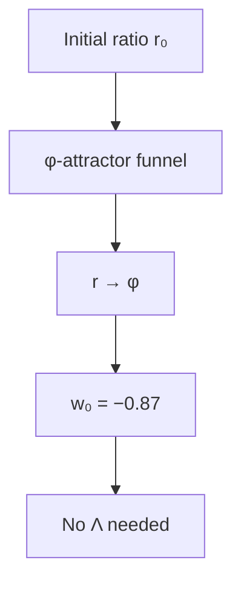

**Visual:** An optional cosmology closure illustrates $r(t)$ approaching $\varphi$; the canonical density PDE does not by itself derive cosmic acceleration or eliminate $\Lambda$.


Since 1998, observations have established accelerated expansion, while the physical source remains under study. Cassi evaluates an optional cosmology closure in which the two-fluid ratio $r=E_Y/E_I$ relaxes toward the declared $\varphi$ target and a separate expansion model supplies $w(a)$. The canonical density PDE supplies local conversion and relaxation under stated conditions; it does not by itself define $H(a)$, $w(a)$, or a dark-energy replacement. In the calibrated closure, $w_0=-0.87$ is anchored to DESI, while the coupling and no-$\Lambda$ interpretation remain Hypothesized and the tension is unresolved.

| **Cassi Answer** | Optional cosmology closure: $w(a)$ evolves with $r(a)$ and the calibrated baseline uses $w_0=-0.87$; a no-$\Lambda$ interpretation remains Hypothesized |
| **Mechanism** | The optional closure maps the conversion state and Qi diagnostic into $H(a)$ and $w(a)$; $\kappa_{\text{DE}}=3\varphi^2H_0$ is a named closure input, not a canonical PDE coefficient |
| **Epistemic** | **Calibrated**—$w_0$ coupling form anchored to the DESI measurement (ledger §10); 2σ tension, not resolved. Five-channel gate PDE test 2026-08-06 (`two-fluid/run_pde_wa_5channel.py`): w_a = −0.425 ± 0.1 vs single-channel −0.09 ± 0.10 (−0.44 ± 0.15 toward DESI; ~1.1σ from DESI w_a = −0.73 ± 0.28), via gate-structure dynamics, not the control-release mechanism (Δ(1−q) ≈ ±0.01) |
| **Reference** | `cosmology/cosmology-from-phi.md`, `two-fluid/calibrate_initial_ratio.py` |

### C2: Dark matter

```mermaid
flowchart TD
    A[Qi condensate] --> B[Density q]
    B --> C[G_eff = π/ρ · (1+(φ⁶−1)q)]
    C --> D[ξ = φ⁶ ≈ 17.944]
    D --> E[Flat rotation, Ω_DM/Ω_b = φ³]
```

**Visual:** An optional Qi-gravity closure maps the diagnostic $q$ to an effective coupling; its galactic interpretation remains Hypothesized.


Galaxies rotate faster than their visible mass predicts, motivating tests of alternatives to particle dark matter. Cassi evaluates an optional Qi-gravity coupling map in which $q$ modifies an effective gravitational strength by the factor $\xi=\varphi^6\approx17.944$. The canonical $q$ diagnostic does not itself amplify gravity, and no canonical rotation-curve or clustering result follows from it. The density-ratio base $\Omega_{\text{DM}}/\Omega_b=\varphi^3\approx4.24$ is conditional on the stated Weinberg-angle boundary; the absence of a dark-matter particle is a framework choice under test.

| **Cassi Answer** | Optional Qi-gravity coupling; $\Omega_{\text{DM}}/\Omega_b=\varphi^3$ is a conditional base and $\xi=\varphi^6$ is a derived rung identity, while the galaxy-rotation mapping remains Hypothesized |
| **Mechanism** | An optional coupling map uses $q$ to modify effective gravity; the component budget rejects the $+1$ capture term as a baryon double count, but the canonical PDE supplies no halo dynamics |
| **Epistemic** | **Derived conditional / open tension**—rung identity $\xi = \varphi^6$ Derived; density-ratio base conditional on the Weinberg-angle boundary; $+1$ capture term excluded by the component budget (ledger §10) |
| **Reference** | `foundations/xi-derivation.md`, `experiments/phi_attractor_paths/path8_phi_enhanced_rotation.py` |

### C3: Hubble tension

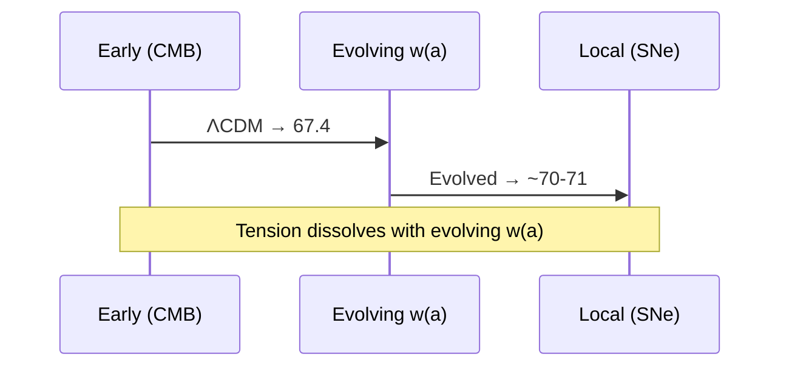

**Visual:** An optional evolving-$w(a)$ closure tests whether early and local expansion inferences can converge; the current fit does not establish a resolution.


The Hubble tension compares early-universe and local inferences of $H_0$. Cassi tests an optional evolving-$w(a)$ expansion closure in which $\Omega_\Lambda(a)$ changes with lookback time. The closure changes the extrapolation, but the full H(z) fit does not resolve the tension under the calibrated inputs; the canonical density PDE does not by itself define $\Omega_\Lambda(a)$ or $H(z)$.

| **Cassi Answer** | Optional evolving-$w(a)$ closure changes the expansion history; the current fit does not resolve the Hubble tension |
| **Mechanism** | The optional closure maps $\Omega_\Lambda(a)$ and $w(a)$ into $H(z)$; the canonical PDE supplies no single-parameter Hubble extrapolation |
| **Epistemic** | **Hypothesized**—consistent with DESI; full H(z) fit performed 2026-08-06 (`computations/hz_full_fit.py`): not resolved under the calibrated w(a) (w₀ = −0.87, w_a = +0.012 baseline / −0.38 coupling); dark energy is negligible at z~1000–1100, R_cmb = 1.00000, χ² ≈ 25.1 (same as ΛCDM, anchor separation 5.0σ); the documented ΔH₀ = −7.2 was an extrapolation beyond the calibrated range (a ≥ 0.01) |
| **Reference** | `cosmology/cosmology-from-phi.md` |

### C4: Inflation

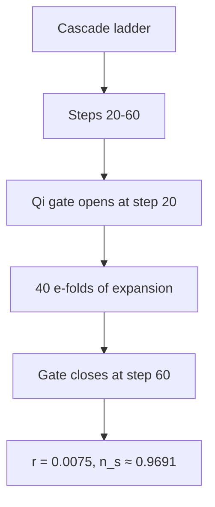

**Visual:** An optional inflation closure assigns a candidate cascade window and Qi-gate trajectory; the window and perturbation outputs remain Mapped or Hypothesized.


Inflation is a proposed early-universe expansion phase whose field content and dynamics remain open. Cassi evaluates an optional cascade/Qi-gate closure with a candidate window near steps 20–60 and a named $N_e=40$ input. The resulting $n_s$, $r$, and $\alpha_s$ expressions are conditional calculations; the trajectory test does not establish the claimed pair of outputs, and no canonical inflation dynamics follows from the density PDE.

| **Cassi Answer** | Optional cascade/Qi-gate inflation candidate near steps $n\approx20$–$60$ with $N_e=40$; $n_s$, $r$, and $\alpha_s$ retain their stated Mapped or Hypothesized status |
| **Mechanism** | An optional Qi-gate closure maps the ratio trajectory into $H$ and perturbations; the wake-wave interpretation is optional, and the closed formula subset is conditional on its named inputs |
| **Epistemic** | **Hypothesized** (mechanism) / **Mapped** ($r = 12/N_e^2 = 0.0075$ at the $N_e = 40$ window—ledger); slow-roll trajectory test 2026-08-06 (`computations/slow_roll_trajectory.py`): the two claimed numbers do not coexist on the trajectory, and $N_e = 40$ is a start-threshold choice, not a derived count—Mapped flags confirmed with trajectory evidence; testable with CMB-S4/LiteBIRD |
| **Reference** | `cosmology/inflation-from-cascade.md`, `foundations/refined-numeric-predictions.md` |

### C5: Flatness problem

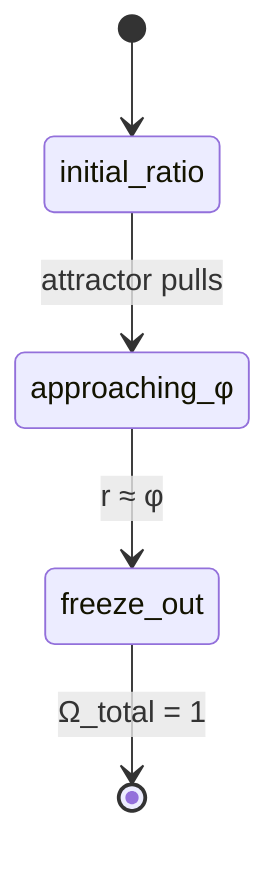

**Visual:** An optional cosmology closure maps the $\varphi$ attractor into a candidate curvature history; the canonical density relaxation does not by itself force spatial flatness.


The observed near-flat spatial geometry motivates a test of an optional cosmology closure. That closure maps relaxation of $r=E_Y/E_I$ toward $\varphi$ into a candidate equation of state and curvature history, but the canonical two-fluid PDE does not contain a spatial-curvature evolution law. Flatness therefore remains a Hypothesized closure result rather than an attractor consequence of the canonical equations.

| **Cassi Answer** | Optional $\varphi$-attractor cosmology closure may map $r\to\varphi$ into a near-flat curvature history; the canonical PDE does not derive $\Omega_{\text{total}}=1$ |
| **Mechanism** | The optional closure maps near-$\varphi$ freeze-out into $\Omega_{\text{total}}\approx1$; the curvature relation is an additional input |
| **Epistemic** | **Hypothesized**—conditional cosmology closure; the density attractor alone does not derive spatial flatness |
| **Reference** | `foundations/unified-lagrangian.md` |

### C6: Horizon problem

```mermaid
flowchart TD
    A[Ratio r(t) crosses step] --> B[All scales activate simultaneously]
    B --> C[Uniform CMB temperature]
    C --> D[No light-travel contact needed]
```

**Visual:** An optional temporal-emergence mapping tests whether ratio crossings can correlate scales without a spatial-contact mechanism; it is not a canonical PDE result.


The horizon problem concerns the uniformity of widely separated regions. Cassi proposes an optional temporal-emergence mapping in which a ratio crossing activates associated scale labels together. This mapping is Hypothesized and does not follow from the canonical density PDE; a causal cosmology and testable observables remain to be specified.

| **Cassi Answer** | Optional temporal-emergence mapping: ratio crossings may activate associated scale labels without a spatial-contact claim |
| **Mechanism** | The optional mapping treats scale activation as ratio-driven rather than spatial propagation; it does not replace a causal cosmology |
| **Epistemic** | **Hypothesized** |
| **Reference** | `foundations/dimensionful-cascade.md` |

### C7: Baryon asymmetry

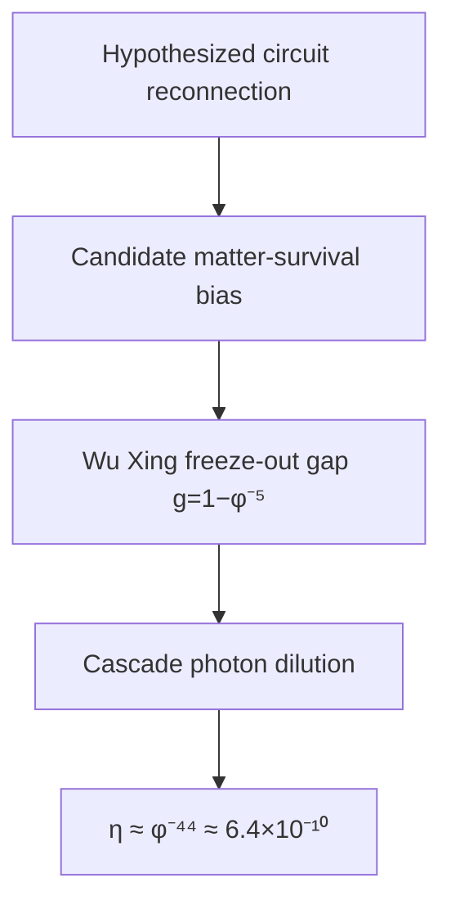

**Visual:** The diagram shows Cassi's candidate circuit-reconnection branch,
the Wu Xing freeze-out gap, and cascade dilution for the Mapped value
$\eta\approx\varphi^{-44}$. A resolved-flavour two-singlet comparator closes
one empirical history. Its exact CP-conjugate branches carry opposite
asymmetries, and the registered Cassi data select neither branch.

The universe is overwhelmingly made of matter, although standard
early-universe production is nearly symmetric. Cassi's candidate combines an
unselected particle/antiparticle circuit interaction, a Yang-Yin imbalance at
the Wu Xing gap $g=1-\varphi^{-5}$, and cascade dilution. The value
$\eta\approx\varphi^{-44}\approx6.4\times10^{-10}$ is a Mapped fit within
$6\%$ of the observed ratio; the current equations select neither the
circuit interaction nor the post-seed freeze-out endpoint.

In the empirical comparator, calibrating the resolved-flavour two-singlet
benchmark gives
$M_1=5.774318838589164\times10^{10}\ {\rm GeV}$ and
$|\eta_B|=6.100000000002\times10^{-10}$. Coarse whole-bubble abundance and
inherited-$B-L$ differences wash out, but $z$ and $z^*$ give equal and
opposite yields with identical registered Cassi inputs. The optional
phase-bearing extension contains a CP-odd spatial helicity, while its
positive-coefficient homogeneous action gives equal energy to both signs and
no negative linear mode. Its rank-two light-neutrino matrix also has one
exactly massless state and cannot equal the separate Mapped
three-nonzero-mass spectrum.

| **Cassi Answer** | $\eta\approx\varphi^{-44}\approx6.4\times10^{-10}$ is a Mapped exponent. The resolved-flavour comparator closes a conditional empirical history after calibrating one heavy scale. A phase-bearing whole field can carry CP-odd helicity, but the registered action does not select its sign; CP selection returns `DOES NOT EMERGE`. |
| **Mechanism** | Cassi candidate: circuit reconnection, freeze-out Yang-Yin ratio and cascade dilution, with no selected rate or endpoint. Empirical comparator: thermal $N_1$ decay with $\{e+\mu,\tau\}$ washout, sphaleron transfer and QCD survival. Exact conjugation reverses $\eta_B$; the phase-current extension supplies equal-energy opposite-helicity states without a baryon-production coupling (`foundations/baryon-asymmetry.md` §§6–7). |
| **Epistemic** | **Hypothesized** (Cassi mechanism, nonlinear handed-domain formation and microscopic coupling) / **Mapped** ($\eta$ exponent $-44$—ledger) / **Calibrated** (resolved-flavour two-singlet $M_1$—ledger) / **Tested** (whole-bubble robustness, CP-conjugate boundary and homogeneous handedness nonselection) |
| **Reference** | `foundations/baryon-asymmetry.md`, `computations/qcd-whole-bubble-cp-selection-prereg.md`, `computations/whole-bubble-handedness-selector-prereg.md`, `computations/matter-formation-continuum-report.md` §§83–86 |

### C8: Big Bang singularity

```mermaid
flowchart TD
    A[Force F(r)] --> B[Large r: F ∝ 1/r²]
    B --> C[Crossover at σ = ℓ_Pl/φ³]
    C --> D[Small r: F ∝ −r/(3σ³)]
    D --> E[Harmonic core—no divergence]
```

**Visual:** Under an optional $\sigma$-regularized gravitational kernel, the short-distance force has a finite harmonic core rather than a singular inverse-square form.


General relativity's singularity problem motivates regularized-gravity tests. Under the optional kernel $1/\sqrt{|r|^2+\sigma^2}$ with $\sigma=\ell_{\text{Pl}}/\varphi^3$, the force is finite and linear as $r\to0$ under the stated sign convention. This is a conditional property of that kernel; the canonical density PDE does not by itself select the kernel, its sign, or a cosmological singularity resolution.

| **Cassi Answer** | Optional $\sigma$-regularized kernel with a finite linear core as $r\to0$ |
| **Mechanism** | Under the stated optional kernel, $F\propto-r/(3\sigma^3)$ near the origin; kernel choice and attractive sign remain additional closure inputs |
| **Epistemic** | **Derived conditional**—finite-core behavior follows from the stated optional kernel; selecting that kernel as a physical gravity law remains Hypothesized |
| **Reference** | `foundations/unified-lagrangian.md` §3 |

### C9: Cosmic web structure

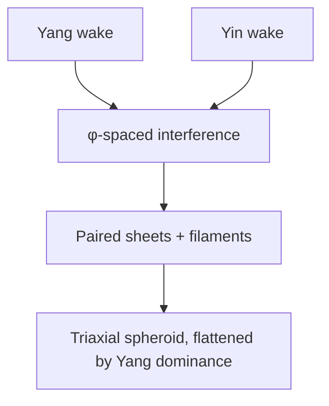

**Visual:** An optional wake-wave spatial realization maps $\varphi$-spaced interference into candidate sheets, filaments, and voids; it is not a canonical PDE prediction.


The cosmic web contains sheets, filaments, and voids whose origin remains an open cosmology question. Cassi evaluates an optional wake-wave realization in which Yang and Yin interference is mapped to $\varphi$-spaced structure and a log-periodic matter-power-spectrum signature at $\Delta(\ln k)=\ln\varphi$. The morphology and axis interpretation are Hypothesized; the canonical density PDE does not itself produce wakes, spatial interference, or the claimed spectrum.

| **Cassi Answer** | Optional wake-wave mapping: $\varphi$-scaled interference is a candidate explanation for flattened, paired-sheet morphology |
| **Mechanism** | An optional spatial realization maps anti-phase conversion and a Yang-dominant axis into a triaxial morphology; the mapping remains Hypothesized |
| **Epistemic** | **Hypothesized**—morphology matches; W1 anti-phase morphology is supported by the measured branch. W2 (LSS anisotropy vs bubble axis) and W3 (axis vs CMB $\ell<5$) have no defined test statistic—the statistic must be pinned before data work; currently undefined |
| **Reference** | `foundations/why-three-dimensions.md`, `turbulence/kolmogorov-from-phi.md` |

### C10: CMB large-angle anomalies

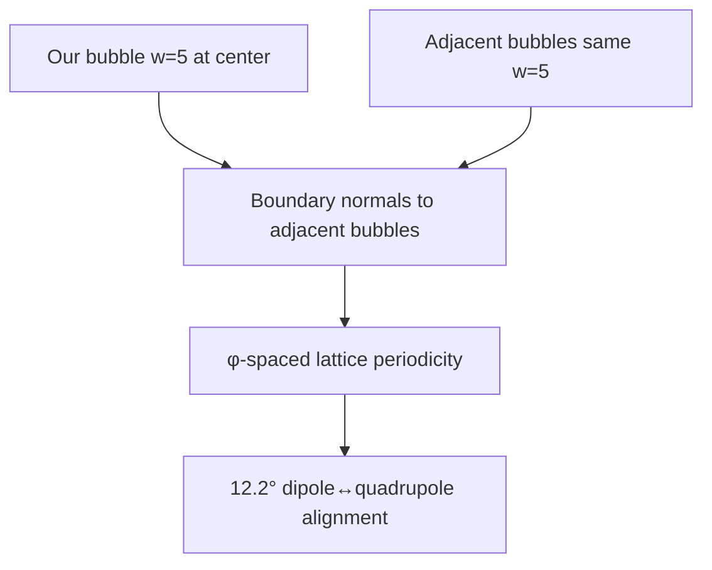

**Visual:** An optional bubble-lattice construction maps adjacent $w=5$ cells and boundary normals to a candidate preferred axis; the measured $12.2^\circ$ magnitude and fitted direction retain separate provenance.


The CMB's large-angle alignments motivate an optional bubble-lattice mapping. In that construction, the chord lattice arranges $w=5$ cells at $\varphi$-spaced intervals and a condensation-field boundary supplies a candidate preferred axis. The $12.2^\circ$ angle is measured from data vectors; the boundary orientation is fitted, so the mechanism remains Hypothesized until an a priori boundary-normal selector is derived.

| **Cassi Answer** | Adjacent bubbles at identical $w=5$ and $\varphi$-spaced chord lattice intervals offer a candidate mechanism for a preferred axis at $\ell<5$; the $12.2°$ magnitude is the golden-angle closure residual $2\pi/\varphi^7 = 12.40°$ (13-seed closure, exact identity $13/\varphi^2 = 5 - 1/\varphi^7$), matching the measured $12.22°$ at 1.5%. The axis direction is Calibrated from data vectors, the absolute bubble orientation is unselected by the rotation-invariant PDE, and the observed axis is nearly ecliptic-degenerate (`computations/cmb_axis_direction_selector_check.py`). |
| **Mechanism** | Bubble-boundary structure at step 285; edge geometry conditional on the gate (`foundations/bubble-edge-geometry.md`). Yang axis + string axis provide candidate directions, while the boundary normal and observer offset require calibration. The ecliptic/foreground alternative must be excluded before the closure magnitude can support a sky-direction prediction. |
| **Epistemic** | **Derived (magnitude)**: $2\pi/\varphi^7 = 12.40°$; **Calibrated (direction)**: data-vector separation; **Hypothesized (boundary mechanism/projection)**: the PDE supplies no absolute orientation selector. E-mode test pending (Simons Obs./LiteBIRD) |
| **Reference** | `cosmology/observational_constraints.md` §4, `foundations/bubble-edge-geometry.md`, `foundations/wake-geometry.md` §3b, `foundations/refined-numeric-predictions.md` |

---

## 3. Quantum & Particle Physics

### Q1: Hierarchy problem

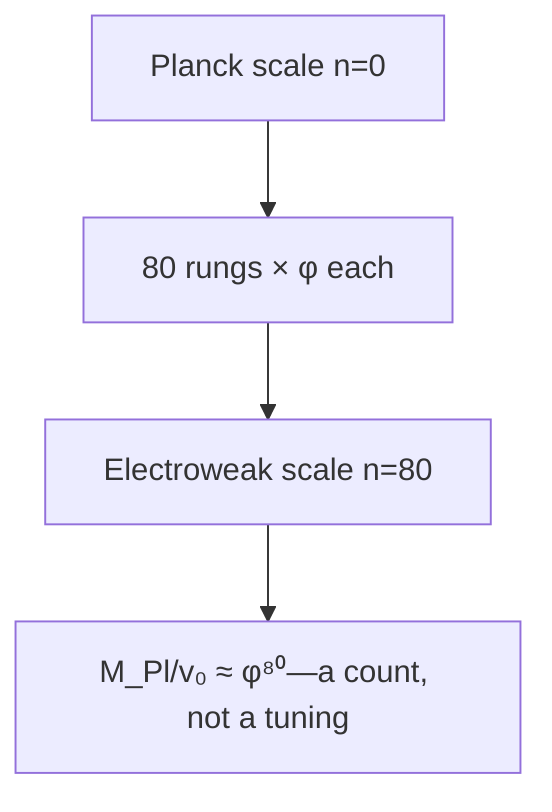

**Visual:** The electroweak scale sits 80 rungs down from the Planck scale on the cascade ladder—the gap is a geometric count, not a cancellation.


The weak nuclear force is about $10^{32}$ times stronger than gravity—a gap so enormous it is called the "hierarchy problem." In standard physics, the Higgs mass should be pulled up to the Planck scale by quantum corrections unless there is a suspiciously precise cancellation. Cassi sees no tuning problem here: the gap is a count of cascade ladder steps (see Primer). The direct measured ratio has $N_{\mathrm{raw}}\approx79.89$, which selects the nearest integer rung 80; with the Wu Xing freeze-out gap $g = 1-\varphi^{-5}$, the cascade coordinate is $N_{\mathrm{gap}}\approx79.7$. The Planck-to-electroweak placement is therefore a geometric count near 80 rungs, not a delicate cancellation between competing terms.
| **Cassi Answer** | $v_0/M_{\text{Pl}} \approx \varphi^{-80}$—nearest-rung cascade placement, not a tuning |
| **Mechanism** | Gap $g = 1-\varphi^{-5}$ sets the cascade coordinate; $N_{\mathrm{gap}}\approx79.7$ and the direct measured-ratio placement $N_{\mathrm{raw}}\approx79.89$ both select rung 80 |
| **Epistemic** | **Mapped**—the two placements use the measured ratio and the stated gap convention (ledger §10); 5.3% residual open |
| **Reference** | `foundations/dimensionful-cascade.md` §2 |

The conditional compact-ring calculation supplies a Fibonacci near-closure
branch but leaves topology and constitutive mass selection open: 1,163 stable
primitive modes remain across the scanned cells and the low-winding
coefficient-sensitivity gate fails (`foundations/qi-loop-mass-cascade.md` §5).
The three-dimensional toroidal V5 campaign closes G1–G4, Q1–Q5, and
independent verification, then fails all registered survival gates
(`field-experience/toroidal-coherence-survival-report.md`). The supplied seed
unwinds, contracts to radius ratio `0.4468592782418393`, and retains
`0.3459793652013782` of its initial helical order by `t=4`. This verified
finite-time `DOES NOT EMERGE` result leaves Q1's Mapped tier unchanged.

The frozen-field spectral diagnosis in
`field-experience/toroidal-multiscale-transfer-report.md` finds endpoint
increases of `0.4700353507626928` in fine modal-mass fraction and
`0.7565406294842472` in fine kinetic fraction for the primary torus, while
the no-gravity control preserves both to floating precision. Its Q3–Q5 and
independent-verification gates fail, so the registered result is
`INCONCLUSIVE—DIAGNOSTIC QUALITY`. The calculation contains one periodic
domain and one physical hierarchy level; it leaves Q1's Mapped tier
unchanged.

The connected campaign in
`field-experience/toroidal-connected-hierarchy-report.md` evolves compact,
loop, and envelope Yang/Yin pairs through a symmetric gravitational graph.
All initialization and numerical gates pass, independent re-evolution
verifies the receipt, and the full graph has exchange amplitude
`1.2025553100905404` against `1.1863354081760941e-9` in the decoupled
control. The registered result is
`EMERGES—CONNECTED SCALE-ENERGY REDISTRIBUTION`. The three scale species,
their mass shares, and their graph are supplied protocol variables, so Q1
remains Mapped.

### Q2: Strong CP problem

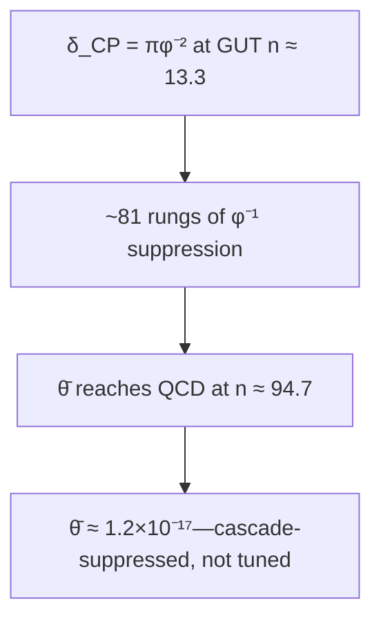

**Visual:** An optional cascade-suppression mapping treats a GUT-scale CP seed as a candidate source of the small QCD-scale $\bar{\theta}$ value; the exponent and seed remain Mapped inputs.


The strong nuclear force could permit CP violation, while experiments constrain the QCD angle to be very small. Cassi evaluates an optional cascade-suppression mapping from a GUT-scale seed at $n\approx13.3$ to the QCD scale near step 95. The candidate uses $\delta_{\text{CP}}=\pi\varphi^{-2}$ and per-rung $\varphi^{-1}$ damping to obtain a Mapped estimate near $\bar{\theta}\approx1.2\times10^{-17}$; this mechanism is not a consequence of the canonical density PDE.

| **Cassi Answer** | Optional cascade-suppression mapping: $\bar{\theta}$ is estimated from the Mapped GUT seed, QCD rung, and damping span; the value remains conditional on those inputs |
| **Mechanism** | The optional particle/cascade extension maps a CP seed through an approximately 81-rung span; the underlying density PDE does not supply the SU(3) $\theta$ term or its damping law |
| **Epistemic** | **Mapped**—the span inherits Mapped status from its ledgered anchors: the GUT-seed rung ($M_{\text{GUT}}$, `parameter-inventory.md` §10 row 13) and $\delta_{\text{CP}} = \pi\varphi^{-2}$ (row 2); value $1.2\times10^{-17}$, ~7 orders below the nEDM bound; falsifiable if future nEDM probes find $\bar{\theta} \gg 10^{-17}$ |
| **Reference** | `foundations/strong-cp-derivation.md` |

### Q3: Neutrino masses

```mermaid
flowchart TD
    A[Compressed seesaw span ~12 rungs] --> B[Fibonacci triple-cluster]
    B --> C[Three mass eigenstates]
    C --> D[Normal ordering, m₃ = 0.0502 eV (computed spectrum)]
```

**Visual:** An optional seesaw/cascade extension maps a compressed span into three candidate neutrino masses; the spectrum and ordering retain Mapped or Hypothesized status.


Neutrinos have tiny non-zero masses, but their origin, ordering, and Majorana or Dirac character remain open. Cassi evaluates an optional seesaw/cascade extension whose named pipeline returns $m_1=0.00356$, $m_2=0.00931$, and $m_3=0.05019$ eV with $\Sigma m_\nu=0.0631$ eV. The Fibonacci partition and normal ordering are Hypothesized or Mapped application choices; these outputs are not canonical consequences of the real-density PDE.

| **Cassi Answer** | Optional seesaw/cascade extension with a compressed span near step 20; the listed spectrum is a pipeline output, with offsets and ordering retaining Mapped or Hypothesized status |
| **Mechanism** | An optional Fibonacci partition and $y_\nu^2$ seesaw mapping are applied to the compressed span; the pipeline output is conditional on its grid and external inputs |
| **Epistemic** | **Hypothesized** (mechanism) / **Mapped** (offsets $\Delta_1 = 1.00$, $\Delta_2 = 1.75$ grid-fit against the observed ratio; $m_1$ solved from data—ledger §10; 0-dof fit, the 0.2% residual is grid quantization) |
| **Reference** | `foundations/neutrino-masses.md`, `foundations/refined-numeric-predictions.md`, `computations/cascade_rge_pmns.py` |

### Q4: Gauge coupling unification

```mermaid
flowchart TD
    A[SU(3)] --> D[Single spring: α_GUT = φ⁻³/(4π)]
    B[SU(2)] --> D
    C[U(1)] --> D
    D --> E[At cascade step ~13.3, RGE running explains deviations]
```

**Visual:** SU(3), SU(2), and U(1) converge to a single coupling at the GUT spring like three rivers to one source—α_GUT = φ⁻³/(4π), with deviations from ordinary RGE running.


The three forces of the Standard Model—electromagnetic, weak, and strong—have very different strengths at everyday energies. Extrapolated to high energy with the SM renormalization group, they almost meet: $\alpha_1 = \alpha_2$ at $\sim 10^{13}$ GeV ($\alpha^{-1} \approx 42$) and $\alpha_2 = \alpha_3$ at $\sim 10^{17}$ GeV ($\alpha^{-1} \approx 47$), but there is no common intersection in the SM. Cassi's answer: there IS a single coupling $\alpha_{\text{GUT}} = \varphi^{-3}/(4\pi) \approx 1/53$ at the GUT scale (n ≈ 13.3 for $M_{\text{GUT}} \approx 2\times10^{16}$ GeV). The full one-loop radiative corrections (`standard-model/sm-radiative-corrections.md`, `computations/sm_radiative_corrections.py`) show what this boundary implies: run down, it gives $\alpha_s(m_Z) = 0.058$–$0.061$ ($2.0\times$ low—the documented $\Delta b = 1.70$ deficit), $\alpha_1$ and $\alpha_2$ ~25% weak, and $\sin^2\theta_W = \varphi^{-3}$ +2.1% above the Z-pole value (exact at $\mu_* \approx 233$ GeV). The framework requires no supersymmetry, no extra dimensions, and no exotic particles beyond the vector-like content that rescues $\alpha_s$.

| **Cassi Answer** | $\alpha_{\text{GUT}} = \varphi^{-3}/(4\pi) \approx 1/53$ at the GUT scale (n ≈ 13.3 for $M_{\text{GUT}} \approx 2\times10^{16}$ GeV) |
| **Mechanism** | Single coupling at single scale; SM running from it gives $\alpha_s(m_Z) = 0.058$–$0.061$ ($2.0\times$ low, $\Delta b = 1.70$), $\alpha_1$, $\alpha_2$ ~25% weak, and $\sin^2\theta_W = \varphi^{-3}$ exact at $\mu_* = 233$ GeV and +2.1% at $m_Z$. The relative boundary normalization $(g/g')^2 = 2\varphi$ remains asserted: the present action leaves $g$ and $g'$ independent, while the curvature–orbit candidate requires an added field-space metric and orbit-matching rule (`standard-model/su2-gauge-extension.md` §3.2.1). The full VEV mass matrix has the standard photon null direction. SM running alone has no common intersection ($\alpha_1=\alpha_2$ at $10^{13}$ GeV, $\alpha_2=\alpha_3$ at $10^{17}$ GeV) |
| **Epistemic** | **Mapped** ($\Delta b = 1.70$, $M_{\text{GUT}}$—ledger) / **Calibrated** ($\mu_* = 233$ GeV crossing-point anchor—ledger); $\sin^2\theta_W$ +2.1% at $m_Z$, coupling residuals open, FCC-ee test pending |
| **Reference** | `standard-model/sm-from-phi.md`, `standard-model/su2-gauge-extension.md`, `standard-model/sm-radiative-corrections.md` |

### Q5: Three generations

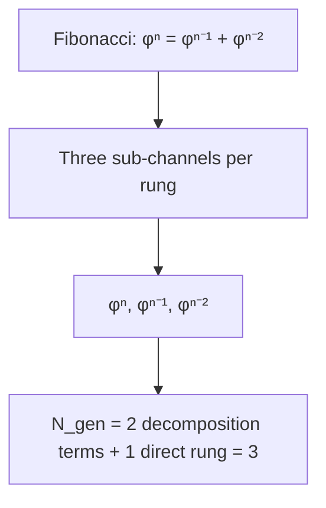

**Visual:** The Fibonacci recurrence φⁿ = φⁿ⁻¹ + φⁿ⁻² partitions each cascade span into three sub-channels (the two predecessor channels of the decomposition plus the direct rung), giving three generations under the propagation-channel postulate.


The Standard Model contains three copies of the basic fermion families—up/down quarks, electron/neutrino—with identical properties but vastly different masses. Nobody knows why there are exactly three families. Cassi counts them from the Fibonacci recurrence $\varphi^n = \varphi^{n-1} + \varphi^{n-2}$: the decomposition has two terms (the two predecessor channels; the recurrence's solution space is exactly two-dimensional, characteristic roots $\varphi$ and $-1/\varphi$), and a propagation channel exists for each term plus the direct rung itself. The number of generations is $N_{\text{gen}} = 2 + 1 = 3$ under the propagation-channel postulate (stated plainly; without it the count would be 2). The $\varphi$-power spacing between successive masses (e.g., $m_\mu/m_e \approx \varphi^{11}$, $m_\tau/m_\mu \approx \varphi^{6}$) follows from the three-channel spread. Full derivation: `foundations/three-generations.md` §2.3.

| **Cassi Answer** | $N_{\text{gen}} = 2 + 1 = 3$: the decomposition $\varphi^n = \varphi^{n-1}+\varphi^{n-2}$ supplies two predecessor channels (2D solution space, roots $\varphi$, $-1/\varphi$), and the propagation-channel postulate adds the direct rung—three sub-rung channels per cascade span. Three mass eigenstates per Yukawa sector, with $\varphi$-power spacing between them. Full derivation: `foundations/three-generations.md`, `foundations/refined-numeric-predictions.md` §2.6 |
| **Mechanism** | Cascade suppression formula ($\varphi^{-N}$) applied to three sub-channels of the propagation from GUT to EW scales (input: the propagation-channel postulate). Charged lepton ratios ($m_\mu/m_e \approx \varphi^{11}$, $m_\tau/m_\mu \approx \varphi^6$) consistent. The Hypothesized channel construction contains no fourth-generation channel. |
| **Epistemic** | **Hypothesized** (channel-to-generation mechanism; the 2+1 counting identity is Derived under the postulate) / **Mapped** (charged-lepton rung placements read off measured masses—ledger §10) |
| **Reference** | `foundations/three-generations.md` |

### Q6: Matter-antimatter asymmetry
*(See diagram at C7—the baryon asymmetry mechanism is shared between cosmology and particle physics.)*

**Visual:** The Cassi cascade candidate maps circuit reconnection, the Wu Xing
freeze-out gap and photon dilution onto a possible asymmetry. The
resolved-flavour empirical comparator reaches the observed magnitude under
supplied inputs, while its exact CP pair proves that the registered real
Cassi data select no sign.

The universe contains matter but essentially no antimatter. Cassi's candidate
is shared with C7: an unselected particle/antiparticle circuit interaction, a
Yang-Yin freeze-out gap $g=1-\varphi^{-5}$, and cascade dilution. The value
$\eta\approx\varphi^{-44}$ is Mapped; the current equations select neither
the reconnection rate nor the freeze-out endpoint. A fixed two-singlet
benchmark reproduces the observed magnitude at the Calibrated
$M_1=5.774318838589164\times10^{10}\ {\rm GeV}$ and carries the conserved
yield through the QCD epoch. The exact conjugate texture gives the opposite
sign. The optional phase-current state has CP-odd helicity, but the registered
positive action leaves its two signs degenerate.

| **Cassi Answer** | $\eta\approx\varphi^{-44}\approx6.4\times10^{-10}$ is a Mapped Cassi fit. The empirical comparator closes a conditional history after one heavy-scale calibration. Exact conjugation and the homogeneous phase-current calculation establish `DOES NOT EMERGE` for sign selection by the registered action. |
| **Mechanism** | Cassi candidate: the C7 circuit-reconnection chain, whose $\Gamma/H=1$ test yields a thaw rather than post-seed freeze-out. Empirical comparator: resolved-flavour $N_1$ decay, washout, sphaleron conversion and QCD transfer. The phase-bearing extension supplies a CP-odd helicity observable, but its sign requires a CP-odd coefficient, asymmetric state or nonlinear selection rule and a microscopic baryon-production coupling. |
| **Epistemic** | **Hypothesized** (Cassi mechanism, handed-domain formation and CP coupling) / **Mapped** ($\eta$ exponent $-44$—ledger) / **Calibrated** (two-singlet $M_1$—ledger) / **Tested** (whole-bubble initial state, CP conjugation and homogeneous handedness nonselection) |
| **Reference** | `foundations/baryon-asymmetry.md`, `computations/qcd-whole-bubble-cp-selection-prereg.md`, `computations/whole-bubble-handedness-selector-prereg.md`, `computations/matter-formation-continuum-report.md` §§83–86 |

### Q7: Quantum measurement problem

```mermaid
flowchart TD
    A[Regulated CassiFI configuration Q plus wavefunctional Ψ] --> B[Interaction terms couple subsystem coordinates]
    B --> C[Joint Qi flow 𝔉Ψ becomes nonfactorizable]
    C --> D[Disjoint retained topological record sectors Ωₖ]
    D --> E[Actual configuration enters one Ωₖ]
    E --> F[Effective conditional collapse]
    D --> G[QF4 postulate: quantum equilibrium ρ=|Ψ|²]
    G --> H[Born frequencies Pₖ=⟨Ψ|Pₖ|Ψ⟩]
```

**Visual:** CassiFI interactions create nonfactorizable joint
configuration-space Qi flow. One actual field configuration enters one
retained apparatus sector, and quantum equilibrium supplies the branch
frequencies.

For $Q=(Q_A,Q_B)$, the quantum Qi-flow object is

$$
\mathfrak F_\Psi=(|\Psi|^2,J_A,J_B).
$$

A product state obeys
$|\Psi|^2=\rho_A\rho_B$,
$J_A=\rho_BJ_A^{(A)}$, and
$J_B=\rho_AJ_B^{(B)}$. On connected nonnodal product support, entanglement is
equivalent to failure of this global product-flow law. Schmidt rank or
reduced-state purity supplies the exact global criterion across disconnected
support. The reciprocal CassiFI link
$w_Zg_{Z,s}\|Z_{s+1}-P_sZ_s\|_{W_{s+1}}^2/2$ supplies a concrete
interaction after quantization; the nonzero metric-aware singular directions
of $P_s$ enumerate its directly coupled mode pairs. The signed classical link current
measures the semiclassical exchange quadrature, while Schmidt coefficients,
reduced purity, and entanglement entropy measure entanglement.

The CassiFI field law supplies the finite metric-bearing Hamiltonian
configuration and topological retention. Four declared quantum-sector
postulates add the configuration Hilbert space, canonical quantization, one
actual guided field configuration, and quantum equilibrium. Their consequences
include linear Schrödinger evolution, tensor-product entanglement,
configuration-space nonlocal guidance, operational no-signalling in
equilibrium, effective collapse, and Born frequencies.

The frozen DQ1–DQ9 canonical-to-quantum audit yields `REJECT` for promotion
of the physical-field identification to Derived. The canonical real-density
state does not determine the complex phase fibre or symplectic configuration,
the Qi law does not determine a configuration-space Fisher ensemble term,
and equivariance does not select guidance or equilibrium preparation.
Physical-sector maps, an interacting continuum limit, and a Cassi-specific
discriminator remain absent. Reverse-Madelung linearization and
tensor-product Bell/no-signalling algebra pass under their declared quantum
premises.

The frozen GQ1–GQ7 geometric campaign interprets the real density pair as a
candidate moment-map image of the complex CassiFI configuration. The
$\varphi$ attractor fixes the Bloch latitude
$n_z=\varphi^{-3}=0.236067977500$ while leaving the relative-phase longitude
free. Fibre causality passes and finite Kähler compatibility passes
conditionally; symmetry reduction, microscopic projection, cotangent
reconstruction, physical-sector geometry, and Cassi-specific holonomy fail. The
campaign `ADOPT`s this architecture as a Hypothesized research direction and
retains `REJECT` for promotion of the physical identification.

The projective shell construction in
`foundations/string-bubble-projective-map.md` executes the finite geometric
part of that direction. It maps the complex doublet through
$\mathbb{CP}^1\simeq S^2$ onto the selected quadratic bubble shell, proves the
conjugated $U(1)$ action is an isometry of the pullback shell metric, and maps
canonical conversion to meridional flow at fixed total density. SB1–SB5 pass
independently. This promotes the finite map, affine group action, and
conversion-only meridional flow to **Derived conditional** while leaving
microscopic projection, physical shell identification, phase dynamics, and
spontaneous fivefold selection open; the GQ `REJECT` verdict on
physical-identification promotion is unchanged.

The frozen QC1–QC9 closure campaign `ADOPT`s the finite carrier reservoir as
Hypothesized microphysics and its carrier-to-mesoscopic projection as Derived
conditional mathematics. The fixed verifier passes the finite instrument,
carrier positivity and conservation, conversion drift, binomial fluctuation,
transport-noise, and operational-equivalence checks. The QF1 complex-field
density and the carrier-projected density remain independent in the additive
model; their physical state map is Open. This preserves the DQ and GQ rejection
of physical-identification promotion.

The finite carrier reservoir uses unsaturated occupation-shift operators.
Ordinary bilinear Bose/Fermi transfers agree with its drift for one carrier
but acquire stimulation or blocking at higher occupation. In particular,
two fully occupied fermionic modes cannot follow the unrestricted canonical
drift, even with its gate. Independent algebra and trajectories qualify
this restriction; additional modes or a different reservoir require a
specified microscopic state map
(`computations/matter-formation-continuum-report.md` §38).

The shared-support loop completion in
`foundations/loop-to-bubble-projection-theorem.md` realizes the four carrier
labels as Yang and Yin populations in both orientations of one closed loop.
Its complete-loop zero mode reproduces the canonical PDE under common gate and
transport assumptions. Phase-bearing lifts fill the affine coherence ball,
with rank-one states on the projective shell, and the frozen internal
generator has an explicit spectral gap. LB1–LB7 pass. The physical
QF1-to-carrier state map, phase dynamics, scale ratio, and quantum statistics
remain open, so the DQ and GQ physical-identification verdicts are unchanged.

The separate pure-gauge comparison in that document, §§9.4–9.23, uses the
supplied quantum $SU(2)$ lattice Hilbert space and Hamiltonian. It gives an
exact regulated electric-loop threshold $3g^2/(2a)$ and shows that the
projective bubble coordinate discards a phase required by Wilson magnetic
energy. Yarotsky's theorem gives a volume-uniform interacting gap at
sufficiently strong bare coupling, and a finite-depth unitary retains full
holonomies with an exact local quadratic remainder. The exact ground-state
transform identifies the finite regulated gap with the gauge-invariant
Poincaré rate of the true vacuum measure. A conditional full-holonomy block
theorem reduces sufficient cutoff-directed control to exact-vacuum fibre
rates, tensorization and cover estimates. Fixed calculations exclude an
equal-weight one-plaquette exact vacuum, conditional gaps alone as a
volume-uniform argument and static pure configuration marginalization as an
exact quantum reduction.

A seven-link two-plaquette cutoff study makes two of these statements exact
inside a finite regulator. With a tree exterior, every block-integrated
conditional moment is constant on the gauge orbit of the boundary data, so
the sampled boundary slice carries no information about the fibre rate and a
boundary-uniform comparison needs an exterior loop. At the smallest cutoff
the projected Ritz ground vector changes sign on the block, so that cutoff
measure's unrestricted conditional gap vanishes while the retained test space
reports $0.864465200076$, which leaves the exact-vacuum fibre rate as a
separate obligation. A twelve-row path family over cutoffs $1$–$3$ returns
`NODAL_CONFINED`: the sign change is present at strong coupling for every
sampled cutoff and absent along the sampled paths at $x=1/4$ and at the
weak-coupling rows of the higher cutoffs, so the surrogate's zero-gap region
is not uniform in the cutoff and the sampled paths certify nothing in the
positive direction. A two-parameter family over a $33\times33$ block grid
returns the same boundary with `WITNESS_CONFINED`, so the confinement is not
an artifact of a single path family.

The loop-carrying exterior test in
`computations/yang-mills-bowtie-fibre-prereg.md` uses an eight-link bowtie
whose exterior plaquette shares one vertex with the block and carries a
conjugacy-class holonomy. Its 108 source-bound rows cover
$J=1,2,3$, $x\in\{1/4,1,4,16\}$ and nine angles. All seven analytic controls
pass, and every one of the twelve $(J,x)$ blocks shows finite boundary
sensitivity; at $J=1$, $x=1$, the conditional partition ranges from
$0.9160251472$ to $2.3613249509$. The retained-rate qualification is
`INCONCLUSIVE` for all rows because the full-space residual or nested
restriction-rank rule fails. The exact-vacuum fibre rate, transport score,
cutoff removal, uniform interacting recovery, thermodynamic limit and
continuum construction remain open.

An exact normalized-Haar path-holonomy pullback preserves endpoint gauge
covariance and compresses the electric Casimir with
$g_c^2=b^2g_f^2$. A genuine $2\times2$ refinement has four missing
plaquette characters and $\|Qh_fJ1\|_2=2x_f$, excluding full-Hamiltonian
intertwining by that bare cylindrical map. With all eight outer links fixed
in the fundamental representation, Clebsch–Gordan constraints give an exact
14-state internal Gauss fibre for $j_{\max}\geq1$ and conditional electric
spacing $2g^2/a$. Fundamental plaquette multiplication changes the outer
representation sector, so the fixed fibre is not dynamically closed. Pure
graph subdivision has no leakage, so path length alone does not determine
the block dynamics.

The isolated-square class-function operator has an exact energy-dependent
Feshbach pencil, a positive Stieltjes self-energy and fixed-window isolation.
For every fixed low level, the bare character cutoff converges with vanishing
discarded mass exactly when
$N/x^{1/4}\longrightarrow\infty$, equivalently
$gN\longrightarrow\infty$. Fixed and finite-$N/x^{1/4}$ schedules fail as
bare weak-coupling limits; the exact Feshbach reduction remains valid at the
scaled cutoff. The source-bound version-3 campaign preserves the five
schedule functions while using $q(N)=\min\{3,N+1\}$. Its 62 primary and 20
independent checks reconstruct all 88 requested cutoff eigenvalues across 30
rows. These finite measurements support the implemented controls and do not
establish the limiting theorem.

The recovered open $3\times2\times2$ Hamiltonian construction uses complete
binary-tree intertwiner bases of dimensions 868 and 955835 at character
cutoffs $C=1,2$. Its spectator-channel firing witness restricts an edge-only
80-state candidate column to five states and reduces the normalized squared
norm from $16$ to $1$. The primary source passes 226/226 finite-construction
checks, and an independent reconstruction passes 256/256 checks while matching
the ordered basis hashes, plaquette hashes, Wilson extrema, Ritz energies and
shell norms. All eight scheduled ground energies are nonnegative. Every
aggregate character-tail qualification is `INCONCLUSIVE`, so these finite
spectra supply no cutoff-removal or continuum theorem.

The Poincaré-geometry analysis separates spatial and link three-spheres. A
closed simply connected spatial slice is topologically $S^3$, and a round
radius-$R$ regulator has free Maxwell/linearized coexact frequency $2/R$,
which vanishes as $R\to\infty$ and is not the interacting Hamiltonian gap.
Each $SU(2)$ link instead has the fixed Casimir metric selected by
$i\sigma_A/2$, character spectrum $n(n+2)/4$, and an auxiliary one-link
Bakry–Émery bound $(2-\beta)/4$ for $0\leq\beta<2$. The pointwise proof
loses positivity at $\beta=2$. No identification of this $\beta$ with the
Hamiltonian coupling, $x=2/g^4$, or an exact vacuum conditional measure is
assumed. The finite unreduced space is $SU(2)^E$, while its gauge quotient is
stratified; compactness gives no regulator-uniform orbit-space bound.

For an exact factor-two path block, orthogonal horizontal and fibre
derivatives carry electric coefficients $2$ and $1/2$. Disintegration of the
true vacuum along the corresponding Haar-preserving connection gives

$$
\lambda_f\geq C_*^{-1},\qquad
C_*=\lambda_{\max}
\begin{pmatrix}
(2\lambda_c)^{-1}&
\kappa/(\lambda_c\sqrt{\lambda_{\mathrm{fib}}})\\
\kappa/(\lambda_c\sqrt{\lambda_{\mathrm{fib}}})&
\dfrac{2}{\lambda_{\mathrm{fib}}}
\left(1+\dfrac{\kappa^2}{\lambda_c}\right)
\end{pmatrix}.
$$

Here $\lambda_f$ is the all-function fine-measure rate and
$\lambda_{\mathrm{gi}}\geq\lambda_f$ for the physical sector.
The exact coarse-marginal rate is $\lambda_c$,
$\lambda_{\mathrm{fib}}$ is the uniform conditional fibre rate and
$\kappa$ is the transported conditional-score covariance. The score retains
all interactions generated by exact marginalization. At $\kappa=0$ the
bound is
$\lambda_f\geq\min\{2\lambda_c,\lambda_{\mathrm{fib}}/2\}$.
For the physical target
$r_f=2a_fm_*/g_f^2$ and factor-two matching
$r_c=r_f/2$, any nonzero score requires a strict coarse-rate margin when
$\lambda_c$ otherwise saturates $r_c$. The 118-check primary receipt and
90-check implementation-independent receipt audit pass. The latter
re-evaluates the fixed primary schedule rather than generating independent
samples.

The conditional Poisson refinement measures the score by its minimum vertical
transport cost

$$
\vartheta^2
=
\operatorname*{ess\,sup}_{V,|\xi|=1}
\langle s_{V,\xi},\mathcal L_V^{-1}s_{V,\xi}\rangle.
$$

It yields $\lambda_f\geq C_{-1}^{-1}$ and is no weaker than the covariance
bound because
$\vartheta^2\leq\kappa^2/\lambda_{\mathrm{fib}}$. In margin coordinates,
the exact recurrence criterion is

$$
\delta_c,\delta_v\geq\delta_f,
\qquad
\vartheta^2
\leq
\frac{(\delta_c-\delta_f)(\delta_v-\delta_f)}
{4(1+\delta_f)(1+\delta_v)}.
$$

The 86-check primary and 32-check independent schedule reconstructions pass.
The strict Gaussian fixture improves the certified bound from
$0.737912651870$ to $0.961295942106$ against exact rate $1$. All 10
even/odd chain rows instead saturate the covariance relaxation; the massless
coarse rate decreases while the fibre rate tends to $2$ and
$\vartheta\to1$. Thus the refinement preserves the free infrared obstruction
and identifies an explicit transport field as the next interacting object.

For weighted exterior conditionals on centered physical functions, define
$R_B=I-\mathbb E(\,\cdot\mid\mathcal F_B)$ and
$\mathscr R=\sum_Bw_BR_B$. Its lower spectrum is exactly the missing
approximate-tensorization quantity:

$$
A_{\mathrm{AT}}^{\mathrm{opt}}=\gamma_{\mathrm{rec}}^{-1},
\qquad
\lambda_{\mathrm{gi}}
\geq
\frac{\gamma_{\mathrm{rec}}\lambda_{\mathrm{loc}}}{\rho}.
$$

This residual Gramian acts on physical functions. The transported-score
operator acts on coarse tangent directions and enters the recurrence as an
upper penalty. The product Gaussian has zero score Gramian and positive
global rate; near-parallel residual projections have trivial kernels with
$\gamma_{\mathrm{rec}}\to0$. The massless open Gaussian chain has the same
finite-rigidity versus uniform-recovery separation. The 58-check primary and
30-check independent controls pass.

A scale-uniform recovery floor $\gamma_*>0$, a uniform lower bound for
$\lambda_{\mathrm{fib}}$, a vertical field solving the exact-vacuum score
transport equation with the required $H^{-1}$ upper bound, a strict
coarse-rate margin, the thermodynamic and four-dimensional continuum limits,
a regulator-independent mass gap and carrier-state identification remain
open. The older $L^2$ route through $\kappa$ remains sufficient. The
QF/DQ/GQ classifications remain unchanged.

The completion ansatz in
`foundations/geometric-manifold-completion.md` places these finite layers in
one stratified bundle: the canonical pair is the diagonal of a positive
Hermitian cone, the loop Gram state supplies its Bloch-ball section, the
projective shell is its rank-one boundary, and the affine bubble is an
observation image. A cross-glued two-rail metric graph supplies the compact
internal scale circuit. Its minimal positivity-preserving two-jump conversion
lift reproduces canonical population relaxation exactly; with state-dependent
$q$, the nonlinear flow reparametrizes a fixed linear GKSL flow. The integrated
closure in `foundations/yin-yang-qi-dynamical-geometry.md` derives the exact
finite-state $q<1$ bound, $\gamma_c=\gamma_\varepsilon/2$, strict undriven
finite-density decay of nonzero $c$, and the stationary coherence-support
budget. DG1–DG7 pass. Charged coherent and one-way open endpoint realizations
supply conditional scale-vertex closure. The full coherence fibre
is contractible, the smooth object base has no first-Chern sector, and the
minimal endpoint completion has no finite Derrick radius. Point-core flux and
an auxiliary adjoint $SU(2)_Q$ branch supply a conditional smooth local core.
The registered fundamental condensate removes the isolated magnetic sector and
confines flux. A neutral core carrier supplies one conditional reduced
separation under explicit support, retention, and matching inequalities.
Direct local gauging of the first-order Yang/Yin time term is source-free
Gauss-obstructed; the separate action in
`foundations/particle-stationary-action-closure.md` supplies the second-order
charged temporal branch, Gauss constraint, fixed-$Q_C$ equations, and first
variational class. One coefficient point is tested, but all twelve arms fail
Q2. The physical carrier map, reservoir, scale metric, endpoint normalization,
coefficient calibration, qualified transverse carrier mode, stationary
solution, observation map, quantum numbers, and fluctuation spectrum remain
open, so the DQ and GQ physical-identification verdicts are unchanged.

Record distinguishability is

$$
\gamma_{jk}=\langle A_kE_k|A_jE_j\rangle,
\qquad
\mathcal M_{jk}=1-|\gamma_{jk}|^2.
$$

A coherent phase interaction can preserve path overlap
($\mathcal M_{jk}\simeq0$), while amplification into orthogonal retained
records gives $\mathcal M_{jk}\simeq1$. The apparatus Hamiltonian and its
topological sectors define the measured basis. The canonical scalar $q$
measures local Yang/Yin coherence; $\mathfrak F_\Psi$ carries the joint
quantum-flow structure.

| | |
|---|---|
| **Cassi Answer** | Under QF1–QF4, a regulated CassiFI configuration is canonically quantized as a linear wavefunctional on configuration space. On connected nonnodal product support, entanglement is equivalent to nonfactorizable conserved Qi density-current organization $\mathfrak F_\Psi=(|\Psi|^2,J_A,J_B)$; Schmidt rank or reduced-state purity supplies the exact global criterion across disconnected support. One actual guided field configuration produces one retained apparatus record; conditioning on it gives effective collapse. The equivariant density $\rho_Q=|\Psi|^2$ is the unique normalized density local in $|\Psi|^2$ that shares the selected guidance flow, and QF4 yields $P(k)=\langle\Psi|P_k|\Psi\rangle$. Finite carrier processes project separately to the canonical two-fluid drift and fluctuation law; one shared-loop realization also supplies the coherence-ball completion and internal spectrum. |
| **Mechanism** | CassiFI interaction terms can make the joint flow nonfactorizable. Reciprocal links directly couple the singular modes of the scale map $P$; their quantized cross terms can generate intersheet entanglement. System-apparatus correlation creates disjoint topological record sectors, and the actual configuration enters one sector. Passive reflection, transmission, and absorption remain channels of an enlarged unitary scattering map. Conservative carrier conversion and lattice jumps generate the carrier-projected mesoscopic density law; direction-preserving populations on a shared closed loop give one exact zero-mode realization under the stated closure assumptions. |
| **Epistemic** | **Derived conditional** on QF1–QF4, the declared subsystem split, and the finite self-adjoint CassiFI Hamiltonian. The DQ1–DQ9 promotion campaign is **`REJECT`**: DQ3 and DQ6 pass conditionally; DQ1, DQ2, DQ4, DQ5, DQ7, DQ8, and DQ9 fail. The GQ1–GQ7 campaign **`ADOPT`s** a moment-map/Kähler projection architecture as a **Hypothesized research direction** while retaining `REJECT` for physical-identification promotion. QC1–QC9 **`ADOPT`s** a finite carrier reservoir as **Hypothesized microphysics** and its carrier-to-mesoscopic law as **Derived conditional**. LB1–LB7 verify one shared-loop carrier realization and its coherence geometry as **Derived conditional**; the QF1-to-carrier state map remains **Open**. Quantum equilibrium remains an irreducible statistical postulate. The 2026 sodium-nanoparticle result constrains additional collapse and agrees with the bridge's $R_\ell=1$ limit. |
| **Reference** | `foundations/quantum-measurement-derivation.md` §§4.5, 8.1, 8.3–8.4; `foundations/loop-to-bubble-projection-theorem.md` §§2–11; `computations/loop-to-bubble-projection-pre-registration.md`; `computations/verify_loop_to_bubble_projection.py`; `computations/quantum-closure-pre-registration.md`; `computations/verify_quantum_closure.py`; `computations/quantum-geometric-bridge-pre-registration.md`; `computations/verify_quantum_geometric_bridge.py`; `computations/quantum-configuration-bridge-pre-registration.md`; `computations/verify_quantum_configuration_bridge.py`; `computations/qi-flow-entanglement-pre-registration.md`; `computations/verify_qi_flow_entanglement.py`; `computations/cassifi-quantum-bridge-pre-registration.md`; `computations/verify_cassifi_quantum_bridge.py` |

### Q8: Quark confinement


**Visual:** An optional flux-tube closure maps a gate threshold near step 95 into a candidate linear confining potential; the canonical density PDE does not by itself establish confinement.


Quarks are confined in observed hadrons, while the mechanism behind confinement remains a quantum-chromodynamics problem. Cassi evaluates an optional gate/flux-tube closure in which a threshold near cascade step 95 yields a candidate linear potential and a flux-tube energy proportional to separation. The breaking estimate near $\varphi^{-4506}$ is conditional on the cell quantization, gate, and phase-to-rung inputs; these claims are not canonical consequences of the real-density PDE.

| **Cassi Answer** | Optional flux-tube closure at the QCD-scale rung; linear confinement and the breaking estimate remain conditional on the named geometric and gate inputs |
| **Mechanism** | Within the optional closure, gate saturation and one-cell quantization produce $E(r)=\mu r$; the canonical density PDE does not supply a QCD color sector |
| **Epistemic** | **Derived conditional** (tube extensivity under the optional closure and cell quantization); the gate input, QCD identification, and phase-to-rung mapping remain Asserted, Mapped, or Hypothesized as ledgered |
| **Reference** | `foundations/quark-confinement.md` |

### Q9: Proton lifetime

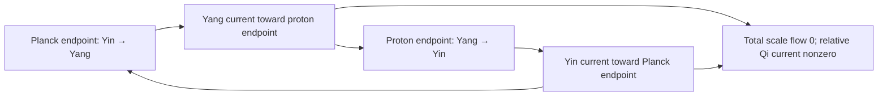

**Visual:** The candidate scale circuit sends Yang outward from the Planck endpoint and Yin back from the proton endpoint. Equal-and-opposite number currents close the scale window while their relative current can source mixed curvature.

Grand unified theories motivate proton-lifetime searches. Cassi has two conditional descriptions. The coherence-budget extension assigns a Hypothesized independent failure probability to each scale step and yields the arithmetic cycle count $\varphi^{4506}$; conversion to a lifetime remains conditional. The interscale-current extension places the Mapped proton coordinate at $\mathfrak s_p=91.4616$ and admits a closed two-rail current with $J_{\mathfrak s}=0$ and $J_Q\ne0$. Coherent and one-way endpoint closures are explicit. Point flux, an auxiliary adjoint core and a neutral carrier supply conditional reduced support, while the fundamental condensate confines flux. The source-free temporal action supplies a Gauss-compatible fixed-charge problem. Its first-order neutral carrier preserves an exactly empty closed sector. At the selected coupling, the stored Cartesian branch has a matched finite-grid low spectrum but fails the smooth-carrier diagnostic. Independent continuum calculations support static scalar binding at prepared $Q_C\in\{16,256\}$; smooth $Q_C=16$ constrained spatial stability is INCONCLUSIVE. The measured charge-dependent lumps establish no preferred particle size. Production, physical normalization, proton quantum numbers and lifetime remain open (`computations/matter-formation-continuum-report.md`).

| **Cassi Answer** | The Planck-to-proton relative-current circuit, endpoint equations, point-flux coefficient, auxiliary core and reduced neutral-carrier support are conditional constructions. The separate first-order particle action preserves an empty carrier sector. Its Cartesian branch is ultraviolet-dominated; separate smooth scalar binding at prepared population is independently reproduced, with INCONCLUSIVE fixed-population constrained spatial stability. A Hypothesized positive-inertia carrier parent has verified Gaussian pair correspondence and positive finite-grid radial fixed-signed-charge curvature in all 24 frozen embeddings. Nine of twelve radial comparisons pass; aggregate radial-domain qualification remains INCONCLUSIVE because the three population-16 domain comparisons fail. All four selected population-256 grids support the angular and phase sectors, but seven of eight spatial comparisons pass: the dipole nonsymmetry gap fails its domain comparison, leaving combined scalar-parent spatial qualification INCONCLUSIVE. A separate normalization campaign measures a conditional three-$a_C$ family with common imposed $0.511$ MeV scalar mass, $c$ and one internal scalar $U(1)$ generator unit but distinct $\ell_Q$ values; physical electron and electromagnetic-charge identification remain open. A separately supplied real scalar mass-source model has independently verified finite-mode fermion pair excitation and reciprocal semiclassical feedback. Its sudden-source continuum excitation is ultraviolet divergent, and $B=0.00165786399054<1$ excludes two-body binding in its leading nonrelativistic reduction. The specified local static one-loop scalar energy has positive reference curvature but no global lower bound. An added normalized complex doublet and compact chiral action give a Mapped conditional colour-neutral baryon benchmark: a finite-domain degree-one radial soliton, conservative relaxation of prepared $B=1$ data, two-mass calibration and supplied nucleon/Delta spin and charge rules. Four absolute out-of-fit nucleon observables miss the frozen precision threshold. The separate massive chiral comparison has a Mapped three-mass calibration, six target-bearing out-of-fit contradictions, a simply connected finite-site regulator and no resolved degree-opposite pair through $T=4$. The mapped step-95 size assignment misses the empirical isoscalar radius by $50.1099\%$ and is rejected; its qualified conditional root predicts nucleon and Delta masses that miss observation by $58.2132\%$ and $44.3648\%$. Canonical particle identity, quantum-state selection, continuum formation and proton lifetime remain open |
| **Mechanism** | Yang flows from the Planck endpoint toward the proton coordinate and Yin returns, so total scale-number flow vanishes while relative current remains nonzero. Imposed point flux contributes $\mathcal B_G/R$. The auxiliary adjoint branch regularizes its local core, the fundamental condensate confines flux, and the neutral carrier contributes $A_C/L$. Direct first-order local gauging is Gauss-obstructed by the nonzero condensate; the separate second-order charged-field branch gives a Gauss-compatible static sector and stationary functional $E_P-\hbar\omega_CQ_C$. In the optional positive-inertia carrier parent, minimizing temporal energy at fixed signed Noether charge adds a positive rank-one population penalty to the unprojected stationary-action radial amplitude Hessian. Angular and phase curvatures retain $\omega_C=\omega+a\omega^2$; their continuum positivity identities require exact nodelessness, monotonicity and boundary assumptions. Sampled finite-box profiles do not establish these assumptions. The surviving charged-field common phase is physically real, but the qualified source-free relative-equilibrium calculation in `computations/matter-formation-continuum-report.md` §41 forces $\omega_N=0$ and then $\mathcal A_0=0$ under its smooth finite-energy $\mathbb R^3$, positive-coefficient, zero-boundary-work and no-external-source assumptions. At $\chi_C=0$, fixed nonzero common-number momentum $P_N$ has a Gaussian constrained initial-data sequence with $E_R\to0$ as $R\to\infty$ and no zero-energy minimizer; this is a variational spreading result, not a dispersal trajectory or universal metastability theorem. $P_N/\hbar$ is a number normalization, while $P_N$ remains distinct from the first-order density excess $\delta Q_N$ and neutral-carrier number $Q_C$. The separate real scalar Yukawa model evolves a specified fermionic vacuum unitarily, with reciprocal mean-field force and scalar, vacuum-polarization and excitation energy accounting; its physical identification and continuum renormalization remain unselected. The added baryon comparison uses a normalized complex doublet lifted to $SU(2)$, a two- plus four-derivative chiral action, integer degree, a supplied odd-degree Finkelstein–Rubinstein character and $Q=I_3+B/2$ |
| **Epistemic** | **Mapped** proton coordinate, selected $h_C$, conditional baryon coefficients $e_B,f_B$ fixed by the nucleon/Delta masses, massive three-mass calibration and rejected step-95 radius assignment / **Derived conditional** current, endpoint, flux, reduced support, gauge, Gauss and stationary identities, empty-sector invariant, trivial-sector scalar reduction, parent charge, vacuum, dilation, fixed-signed-charge Hessian, scalar spatial-form identities, continuum charged attainment and nonlinear orbital stability of the real-mediator/complex-carrier minimizer set, one-mass normalization nonuniqueness, scalar core-cell exclusion, chiral-current and closed-population identities, the specified massive conversion lift's stationary and positive-energy boundaries, the declared Yukawa model's fermionic overlap, charge, energy, continuum asymptote, static subtraction, initial-overlap, two-body bound and local static energy unboundedness identities, and the added baryon model's degree and collective-coordinate formulas / **Tested** Cartesian finite-grid low spectrum and ultraviolet obstruction; independently reproduced prepared smooth scalar binding and INCONCLUSIVE fixed-population constrained spatial stability; Gaussian parent correspondence and finite-grid radial fixed-signed-charge support in 24 embeddings, with INCONCLUSIVE aggregate radial-domain qualification; angular/phase support on four population-256 grids, with INCONCLUSIVE combined scalar-parent spatial qualification; independent numerical consistency checks of normalization, identification and spinor-closure identities; finite-mode fermion pair excitation and energy-accounted semiclassical feedback with 1,185 independent checks; continuum and nonrelativistic binding restrictions with 645 independent comparisons; the specified local static scalar-vacuum restriction with 16 algebraic checks; conditional baryon stationarity, six-gate radial relaxation and $78/78$ independent checks; massive-profile stationarity, six out-of-fit contradictions, finite-site topology and degree-zero pair nonemergence; qualified step-95 conditional profile root and independent verdict reproduction; deterministic complete-mechanism adjudication `FAIL` / **Hypothesized/Open** canonical physical carrier and scalar/fermion/baryon selection, microscopic matching, physical endpoint normalization, dynamical renormalization, full nonlocal spatial energy, metastability, relativistic and cooperative many-body localization, infinite-domain and nonradial stability of formed clouds and additional field sectors, degree-zero production, proton identity and decay rate |
| **Reference** | `foundations/proton-coherence-budget.md` §10; `foundations/interscale-current-soliton.md` §4.5; `foundations/endpoint-link-and-localization-boundary.md`; `foundations/point-core-flux-sector.md`; `foundations/nonabelian-magnetic-core-boundary.md`; `foundations/core-trapped-charge-support.md`; `foundations/particle-stationary-action-closure.md` §§8.10–8.15; `foundations/matter-completion-boundary.md` §§14, 22; `foundations/unified-lagrangian.md` §§2.2–2.5, 5.2, 6; `foundations/sector-coupling-derivation.md` §§1.5–1.10; `computations/particle-carrier-direct-coordinate-report.md`; `computations/particle-carrier-resolution-recovery-report.md`; `computations/particle-physical-hessian-precision-v2-report.md`; `computations/particle-localized-physical-hessian-report.md`; `computations/matter-formation-continuum-report.md` §§10–41, 77; `computations/matter-formation-spinor-closure-prereg.md`; `computations/matter_formation_spinor_closure.py`; `computations/verify_matter_formation_spinor_closure.py`; `computations/matter-formation-fermion-production-prereg.md`; `computations/matter_formation_fermion_production.py`; `computations/verify_matter_formation_fermion_production.py`; `computations/matter-formation-continuum-admissibility-prereg.md`; `computations/matter_formation_continuum_admissibility.py`; `computations/verify_matter_formation_continuum_admissibility.py`; `computations/matter-formation-scalar-vacuum-prereg.md`; `computations/verify_matter_formation_scalar_vacuum.py`; `computations/matter-formation-conditional-baryon-prereg.md`; `computations/matter_formation_conditional_baryon.py`; `computations/verify_matter_formation_conditional_baryon.py`; `computations/matter-formation-cascade-size-log-coordinate-prereg.md`; `computations/matter_formation_cascade_size.py`; `computations/verify_matter_formation_cascade_size.py`; `computations/adjudicate_matter_formation_completion.py` |

An optional positive-inertia carrier parent supplies a signed global charge
and a conditional Gaussian particle–antiparticle channel. Its 31 frozen
prescribed-background trajectories reproduce the exact scalar mass-quench
correspondence with independent raw-array verification. The parent remains
Hypothesized: its temporal coefficient and action normalization are
unselected, and its scalar excitations establish no proton assignment.
Its conserved charge also differs from the prepared spatial population, so
the existing fixed-population stability result does not close its dynamics
(`foundations/particle-stationary-action-closure.md` §8.8;
`computations/matter-formation-continuum-report.md` §8).
The same scalar parent has an exact classical vacuum-potential condition
and a dilation obstruction to an energetically stable, regular,
three-dimensional single-frequency lump with zero signed charge.
The gauge-singlet carrier need not have zero signed charge. Charged states,
multi-frequency dynamics and additional field sectors require their own
analysis; no proton conclusion follows from this restricted obstruction
(`foundations/particle-stationary-action-closure.md` §8.9).
The parent's fixed-signed-charge radial calculation supports finite-grid
energetic stability in all 24 frozen embeddings. Independent banded spectra
and inertia brackets agree. Nine of twelve domain/resolution comparisons
pass; the three population-16 domain failures leave aggregate radial-domain
qualification `INCONCLUSIVE`. This conditional scalar result supplies no
proton assignment or production history
(`foundations/particle-stationary-action-closure.md` §8.10;
`computations/matter-formation-continuum-report.md` §10).
The selected population-256 subset also supports the angular and phase
sectors on four finite grids, with all 96 eigenvalues independently matched.
Seven of eight spatial comparisons pass; the dipole nonsymmetry gap fails
its domain comparison, so the combined scalar-parent spatial verdict is
`INCONCLUSIVE` (`foundations/particle-stationary-action-closure.md` §8.11;
`computations/matter-formation-continuum-report.md` §11).
The normalization nonuniqueness is **Derived conditional**, with numerical consistency checks:
three $a_C\in\{1/64,1/32,1/16\}$ witnesses share the imposed external
vacuum scalar mass $0.511$ MeV, propagation speed $c$ and one internal scalar
$U(1)$ generator unit while retaining distinct $\ell_Q$ values. This is
conditional normalization nonuniqueness, not an electron identity or
electromagnetic charge assignment. The attempted scalar core-cell assignment
is `CONTRADICTS`: $\ell_Q=\lambda_*$ has no positive root, and the allowed
minimum $\ell_Q=6.7893919382\times10^{-13}$ m lies above the mapped
electron-cell upper endpoint. The proposed Dirac density/action map also
remains obstructed: $B_R=L^\dagger R$, $B_L=R^\dagger L=B_R^*$, so real
nonnegative bilinears force equality and cannot realize a nonzero $\varphi$
ratio; its $M^3$/$M^2$ mismatch and generically non-Hermitian ordinary-square
and linear-projection interactions are not repaired by normalization
(`foundations/particle-stationary-action-closure.md` §8.12;
`foundations/unified-lagrangian.md` §§2.2–2.4, 5.2, 6;
`computations/matter-formation-continuum-report.md` §12).

The separate positive spinor component map yields chiral-current densities,
but its closed Dirac evolution retains relative coherence and fails the
canonical population conversion law. Even a stationary positive-energy rest
spinor has equal chiral densities, where the canonical conversion source is
nonzero. The specified minimal chiral conversion jumps, combined with a
Dirac mass, change the golden population fixed point and permit transitions
out of the positive-energy one-particle subspace. These are **Derived
conditional** boundaries; reservoir, Fock-space and proton identifications
remain open (`foundations/sector-coupling-derivation.md` §§1.5–1.6).

A supplied real scalar mass source also excites fermion pairs with
reciprocal semiclassical feedback in a homogeneous finite-mode model.
Independent full-covariance and Bloch-vector calculations pass all 1,185
checks across 32 analytic rows and six trajectories. The finest closed
trajectory reaches occupation $0.5729566253$ per spin with relative
energy error $5.6211\times10^{-5}$ and second-order time convergence.
This conditional result leaves the source, fermion field, coefficients
and reference subtraction as assumptions. Physical proton identification,
continuum renormalization and localized formation remain open
(`computations/matter-formation-continuum-report.md` §14).

The continuum calculation excludes ultraviolet-finite sudden-source
completion and two-body binding in the stated nonrelativistic
approximation. Static subtraction and initial-overlap identities are
verified; they leave the renormalized spatial state, its formation
channel and physical proton identification open. The prepared
scalar carrier charge and fermion number remain distinct
(`computations/matter-formation-continuum-report.md` §§15.1–15.5).

The collective local-density extension has no state below the
separated-particle threshold on its mass-depleting $|m|\le1$ branch, including
the specified local one-loop sea energy. It is a conditional restriction of the
benchmark model; renormalized spatial formation, many-body dynamics and
physical matching remain open
(`computations/matter-formation-continuum-report.md` §§15.6–15.7).

The specified local static one-loop scalar energy has no global
lower bound, despite positive reference curvature. A negative
bulk-energy witness and finite-energy spatial trial family pass
16 algebraic checks. The full nonlocal quantum energy and
metastable charged configurations require separate qualification;
this result supplies no proton decay rate
(`computations/matter-formation-continuum-report.md` §16).
An independently supplied compact $SU(2)_{\rm top}$ field gives a
conditional comparison model. Its shifted-angle calculation supports finite-domain
stationarity and radial energetic qualification, with positive finite radial
eigenvalues, while the direct-angle solve remains `INCONCLUSIVE`. The compact
field's degree is not generated by a smooth pointwise bridge from the two
canonical real densities. A continuous bridge on the entire qualified
contractible density domain also has zero degree when its reference maps
to the target vacuum. A compact target, its production channel and its
quantum statistics remain additional Hypothesized inputs
(`computations/matter-formation-continuum-report.md` §§18.1–18.7).

The phase-bearing gauge extension supplies a physical relative $S^2$ at fixed
nonzero fundamental and adjoint norms. Joint gauge rotation can cancel a pure
gauge representative while leaving the invariant relative field constant; this
is distinct from screening a nonconstant relative texture. The induced
four-derivative scale gives a conditional lower bound on the screening ratio in
the declared truncation. The registered unit-Hopf trial with
$p=1/8$, $q=1/2$, $\gamma=1/2$, $t=4/5$ and
$w=(1+\varphi)^2/2$ has negative connection-amplitude curvature, a
shape-specific result rather than a general Hopf theorem
(`computations/matter-formation-continuum-report.md` §§19.1–19.9).

The same charged-field action retains a physical common phase, measured
by the invariant $\mathcal O_N=\Psi^T i\sigma^2(\Phi^a\sigma^a)\Psi$.
Its phase is the relative sphere's azimuth. The full connection
projection and linear Gauss constraint give a gapless branch
$\omega^2=(J_x/J_t)k^2+O(k^4)$, with
$J_x/J_t=0.8649109511178478$ at the supplied model-unit witness.
Independent observable algebra, spectra and linear-wave evolution
qualify with `PASS`. Fixing the asymptotic phase or total common-number
charge allows local phase fluctuations. The temporal-support calculation
shows that, for smooth finite-energy fields on $\mathbb R^3$ with
unit scale measure, zero boundary work, positive coefficients and no
external charges, voltage or reservoir, the relative-equilibrium ansatz
forces $\omega_N=0$ and the homogeneous Gauss identity forces
$\mathcal A_0=0$, including a bounded core where both charged fields
vanish. Thus the surviving common phase does not provide stationary
gauge-electric support in this isolated sector. Separately, at
$\chi_C=0$, fixed nonzero $P_N$ has a constrained Gaussian sequence with
$E_R\to0$ as $R\to\infty$ and no zero-energy minimizer; this is a
variational initial-data sequence, not a dispersal trajectory or a
universal metastability theorem. $P_N/\hbar$ is a number normalization,
and $P_N$ is distinct from $\delta Q_N$ and $Q_C$. The reconciliation verdict
is **SUPPORTS-conditional temporal support obstruction**. These are
Derived conditional restrictions on stationary support and fixed-charge
minimization. General time-dependent and multifrequency solutions, changed
vacuum or boundary data, and quantum bound states require separate analysis.
Quantum state, particle statistics and a localized forming trajectory remain open
(`foundations/particle-stationary-action-closure.md` §§4.3–4.4;
`computations/matter-formation-continuum-report.md` §§40–41).

The complete soft-adjoint variation calculation supports all six algebraic
groups, with $59/59$ exact identities and $8/8$ predicates. In the stated
fixed-fundamental, positive-coefficient action, every exact unit-adjoint
nonzero-Hopf field has a strictly negative first amplitude variation, and the
included hard-norm Faddeev–Hopf loops contract in the soft-adjoint domain.
This excludes exact hard-norm nonzero-Hopf stationarity in that domain and the
included hard-loop homotopy character; amplitude-relaxed metastability,
production, normalization and physical identification remain open
(`computations/matter-formation-continuum-report.md` §20).

The added compact chiral benchmark provides the strongest current
proton-like comparison. Its finite-domain $B=1$ hedgehog is stationary, and
a broadened prepared degree-one profile relaxes toward it while conserving
energy and degree within the frozen bounds. The nucleon and Delta masses map
$e_B=5.416264578979231$ and
$f_B=64.29440244394192\ \mathrm{MeV}$. Supplied
Finkelstein–Rubinstein and two-flavour charge rules assign nucleon/Delta spin
and proton/neutron charge. The magnetic-moment magnitude ratio and
pion–nucleon coupling support their tolerances; the absolute isoscalar radius,
both magnetic moments and $g_A$ contradict the 10-percent criterion. The
independent implementation passes all 78 checks. Because the field, action,
quantum rules and degree-one initial sector are additional inputs, the
six-requirement completion gate returns `FAIL`; no proton-lifetime conclusion
follows (`foundations/particle-stationary-action-closure.md` §8.15;
`computations/matter-formation-continuum-report.md` §§30–31).

The separate massive chiral comparison places an added $O(4)$ orientation field
on the periodic bubble-lattice geometry. Its pion, nucleon and Delta inputs
define a **Mapped** three-mass calibration with
$e_B=4.842429173417474$ and
$f_B=54.126511603191005\ \mathrm{MeV}$. All six target-bearing out-of-fit
diagnostics contradict their specified tolerances. Its finite-site
configuration space $(S^3)^{N_s}$ is simply connected, so the specified
regulator supplies no protected continuum degree or odd
Finkelstein–Rubinstein exchange character. Canonical stress exchange,
interacting quantum-state selection, renormalization and particle identity
remain open. The degree-zero excitation returns `DOES NOT EMERGE` through
$T=4$ under the qualified signed-preimage calculation. All geometric controls,
admissibility, net-degree conservation and numerical comparisons pass, but no
retained sample contains a resolved pair for all 16 regular values. The
verdict is confined to the supplied action, impulse and sampled interval
(`foundations/matter-completion-boundary.md` §14;
`computations/matter-formation-continuum-report.md` §32.7).

The mapped step-95 QCD length fails as a size-first normalization of this
massive comparison. The exact cascade value
$\ell_{95}=1.1543452099944254\ \mathrm{fm}$ differs from the empirical
isoscalar radius by $50.1099\%$. Imposing it yields one qualified conditional
root at $\mu_*=1.0552867338537264$, while the withheld nucleon and Delta masses
miss their observations by $58.2132\%$ and $44.3648\%$. The frozen assignment
verdict is `REJECT`; step 95 supplies no physical proton size or formation
mechanism
(`foundations/matter-completion-boundary.md` §22;
`computations/matter-formation-continuum-report.md` §77).

The supplied scalar interface has a normal-bound carrier mode and a
surface-growth threshold $a_{\rm wall}=0.2722637330$ below the nonnegative
bulk-potential boundary $a_{\rm vac}=0.3142233130$. Exact algebra and 36
independent finite-difference eigenpairs qualify these conditional criteria.
The common complex field direction gives the same signed wall a negative
energetic eigenvalue $-u_\rho/2=-2$, while surface carrier growth is fastest
at zero tangential wave number. This construction supplies no stable finite
bubble, selected small-bubble pattern, capture rate or particle cluster.
The canonical positive-root domain excludes its negative-$f$ boundary
(`foundations/matter-completion-boundary.md` §15;
`computations/matter-formation-continuum-report.md` §33).

A populated scalar phase and the exterior vacuum have a separately
qualified coexistence interface at $a=1/16$. Independent stationary
calculations agree on its positive dimensionless surface cost
$\sigma=0.8738238914$, and its unpinned finite-grid scalar Hessians meet
the frozen energetic criteria. Large-charge thin-interface energetics
give $R\propto|\mathcal Q_a|^{1/3}$ and a positive
$|\mathcal Q_a|^{2/3}$ surface correction, favoring combination of large
same-sign droplets at fixed total charge. Its stationary scope is given in
`foundations/matter-completion-boundary.md` §16 and
`computations/matter-formation-continuum-report.md` §34.

Diffuse supplied-charge clouds also form depleted mediator cores in this
scalar parent. At signed charge $\mathcal Q_a=256$, widths $4$ and $8$
retain mean core fractions $0.7476513$ and $0.5637353$ in independent
radial evolution, compared with $0.0545181$ and $0.1537575$ under disabled
mediator coupling. Both widths pass the frozen retention and depletion
conditions at every sampled time in $32\le t\le48$ across all five
numerical schedules. The joint verdict is
`EMERGES-conditional finite-charge radial condensation`.
This is finite-time localization of initial charge in a supplied action.
Nonspherical and mediator-phase stability, quantum production, proton
identity, physical charge and a proton lifetime remain open
(`foundations/matter-completion-boundary.md` §17;
`computations/matter-formation-continuum-report.md` §35).

The supplied real-mediator/complex-carrier action also has a nonempty
continuum minimizer set at signed charge $Q=256$. The fixed comparison
profile gives $I(256)/256\le8.2839304633<\sqrt{76}$ and certifies binding
for every $Q>149.3602250815$. Compactness and the global conservative
energy-space flow imply nonlinear orbital stability of the entire
minimizer set, including nonradial and nearby-charge perturbations in
these exact fields. The proof does not place the simulated radiating
clouds near that set and assigns no proton quantum numbers or lifetime.
The result is **Derived conditional**, with the same inherited **Mapped**
$h_C$ and no additional fit
(`computations/matter-formation-continuum-report.md` §36;
`foundations/matter-completion-boundary.md` §18).


### Q10: Spin—what is it?

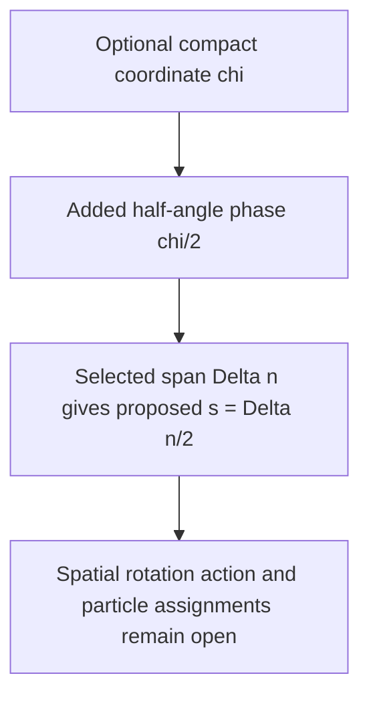

**Visual:** The proposed spin label uses an added compact phase and a selected scale span. The canonical real-density pair and its positive-root lift supply coordinate diagnostics.


Spin is an observed property of particles. The positive-root angle
$\operatorname{atan2}(\sqrt{E_I},\sqrt{E_Y})\in[0,\pi/2]$ has no independent
compact winding. Cassi's optional spin construction adds a compact coordinate
$\chi$, a phase $\vartheta=\chi/2$ and the assignment
$\Delta\chi=2\pi\Delta n$, giving the proposed label $s=\Delta n/2$.
The selected spans and their particle interpretation remain Hypothesized.
The half-angle scalar operator on the full two-component state space fails
the spatial angular-momentum algebra; a physical spin representation requires
rotation operators about all three axes. Exact matrix and finite-occupation
calculations qualify these distinctions in
`computations/matter-formation-continuum-report.md` §38.

| **Cassi Answer** | Optional compact-phase extension with a Hypothesized scale-span assignment $s=\Delta n/2$; physical spatial spin and particle identification remain open |
| **Mechanism** | The supplied half-angle ansatz changes sign under a $2\pi$ coordinate advance. Full spatial rotation, exchange statistics, the minimal-span rule and form-factor modulation require separate physical inputs |
| **Epistemic** | **Hypothesized** compact-phase, minimal-span and particle assignments; **Derived conditional** sign arithmetic and the obstruction to identifying the scalar phase operator with full spatial spin |
| **Reference** | `foundations/spin-fibonacci-spiral.md`, `foundations/refined-numeric-predictions.md` |

The measured smooth density-trap branch supplies a scalar amplitude profile
and a rotating global carrier phase at selected prepared population. It has
no derivation of half-integer spatial spin or exchange statistics. Its
creation, discretization and stability boundaries are recorded in
`computations/matter-formation-continuum-report.md`; this conditional
self-binding result leaves the Q10 particle identification Hypothesized.

---

## 4. Gravity & Spacetime

### G1: Quantum gravity

```mermaid
flowchart TD
    A[σ-regularized Poisson: ∇²Φ → 1/√(|r|²+σ²)] --> B[G_eff = (π/ρ)(1+(φ⁶−1)q) G_N]
    B --> C[Quantized extension: composite spin-2 remains Hypothesized]
    C --> D[Gravity emerges from field density gradients]
```

**Visual:** Gravity follows a $\sigma$-regularized Poisson equation with a softened kernel—a spring instead of a spike. The classical field is density-gradient driven; a quantized two-fluid extension may contain a composite spin-2 excitation, while its dispersion and GR limit remain open.

The classical gravitational field follows from density gradients in a $\sigma$-regularized Poisson equation (see Primer), with $G_{\text{eff}} = (\pi/\rho)(1 + (\varphi^{6}-1)q)\,G_N$ depending on local Qi density and matter density. The softening parameter $\sigma = \ell_{\text{Pl}}/\varphi^3$ comes from the cascade. A quantized two-fluid extension (Hypothesized) may contain a composite spin-2 excitation assembled from the two real Yang/Yin component fields; its dispersion and relation to the low-energy GR limit require an interacting quantization and remain open.

The published Quantum Galileo Interferometer
([doi:10.1126/sciadv.aec8045](https://doi.org/10.1126/sciadv.aec8045))
fixes a low-energy correspondence
boundary. The conditional centre-of-mass Schrödinger sector reproduces
$\Delta\phi=-m_g^2g^2T^3/(3\hbar m_i)$ after a uniform Earth potential is
supplied. This checks quantum matter in an external weak field; it does not
measure Cassi $q$, probe the $\sigma$ regulator, or test a composite graviton.
Those inferences require an atomic state map and a completed source/response
gravity branch.
The Gaussian physical-covariance interpretation has a sharper boundary:
for $\sigma>0$, $G_E(x)=e^{-\sigma^2x/2}/x$ cannot admit the standard
unsubtracted nonnegative scalar spectral measure, because $xG_E(x)$
decreases rather than being nondecreasing. This is a **Derived conditional
obstruction**, not a general interacting-unitarity theorem. A regulator or
auxiliary interpretation requires separately qualified physical observables
(`gravity/quantum-gravity.md` §3.1). The material, gravity, clock, apparatus
and interacting-quantum requirements are catalogued in
`foundations/quantum-free-fall-correspondence.md` §11.


| **Cassi Answer** | At the classical field level, gravity follows $\sigma$-regularized Poisson emergence and Qi enhancement (Derived conditional on the noise–signal identification, G1). A quantized two-fluid extension (Hypothesized) may contain a composite spin-2 excitation; its dispersion and GR limit remain open |
| **Mechanism** | $G_{\text{eff}}=(\pi/\rho)(1+(\varphi^{6}-1)q)G_N$; the classical field emerges from density gradients, while the quantized extension and its low-energy response require additional structure |
| **Epistemic** | **Derived conditional on the noise–signal identification**—$\sigma=\ell_{\text{Pl}}/\varphi^3$ ($\delta=3$) from the Planck-core noise–signal crossover: per-rung dephasing $1-q_0=\varphi^{-\delta}$ equals the equilibrium excess $(\pi/\rho)_{\text{eq}}=\varphi^{-3}$ (the same $\alpha_0$ whose inverse square is $\xi=\varphi^6$), so $\delta=3$; the geometric reading $\delta=d=3$ is conditional and Hypothesized. The composite excitation, dispersion, and GR limit remain Hypothesized; a complete interacting treatment remains open. `gravity/quantum-gravity.md` §2.1 |
| **Reference** | `foundations/unified-lagrangian.md`, `foundations/quantum-free-fall-correspondence.md`, `gravity/quantum-gravity.md` |

### G2: Black hole information paradox

```mermaid
flowchart TD
    A[Gaussian free Euclidean kernel] --> B[UV damping and no extra finite poles]
    A --> C[Standard positive physical covariance excluded at nonzero sigma]
    B --> D[Physical sector and interacting completion required]
    C --> D
    D --> E[Horizon state and backreaction calculation]
    E --> F[Page curve remains open]
```

**Visual:** The Gaussian suppresses high Euclidean momentum, while its
standard unsubtracted positive physical-covariance interpretation fails.
A physical quantum sector and a covariant horizon calculation must precede
an information-retention conclusion.

Black-hole information retention requires a defined state, observable
algebra, interaction and evaporation dynamics. The supplied free kernel
$G_E(x)=e^{-\sigma^2x/2}/x$ adds no finite-momentum poles but fails the
positive scalar spectral monotonicity condition for $\sigma>0$. This
obstruction applies under the assumptions of
`gravity/quantum-gravity.md` §3.1. A gauge-fixed auxiliary line or
intermediate regulator may have a different interpretation; neither
supplies positivity or unitarity of physical observables by itself.
The optical theorem, causal Lorentzian response, horizon state, renormalized
stress, backreaction and entropy calculation remain open.

| **Cassi Answer** | UV damping is a free Euclidean result. Physical quantum-gravity completion and information retention remain open; the standard positive physical-covariance interpretation is excluded at nonzero $\sigma$ |
| **Mechanism** | The Gaussian adds no finite-momentum poles, but $xG_E(x)$ decreases, excluding an unsubtracted nonnegative scalar spectral measure. Alternative physical/auxiliary interpretations require a separate observable-sector construction before interacting and horizon claims |
| **Epistemic** | **Derived conditional obstruction / Hypothesized interacting completion**—the obstruction has the precise physical-covariance assumptions in §3.1; it is not a general interacting nonunitarity theorem. No physical information-retention mechanism is selected; Page-curve and curved-spacetime completion remain open |
| **Reference** | `gravity/quantum-gravity.md` §§3.1,7; `foundations/quantum-free-fall-correspondence.md` §11.5 |

### G3: Black hole singularities

```mermaid
flowchart TD
    A[Optional regularized kernel] --> B[Outside: F ∝ 1/r²]
    B --> C[Crossover at σ]
    C --> D[Inside: F ∝ +r/(3σ³) under +∇Φ]
    D --> E[Finite harmonic core]
```

**Visual:** Under the stated $\sigma$-regularized kernel, the local force has a finite harmonic-core form. Connecting that form to an attractive black-hole interior requires the separate Hypothesized sign-changing extension.


General relativity predicts that at the center of every black hole, matter is crushed to infinite density—a singularity where space and time cease to exist and physics breaks down. Cassi's optional $\sigma$-regularization (see Primer) replaces the divergent kernel with a finite core: outside the core the force magnitude follows the inverse-square form, while inside the $\sigma$ radius ($\sigma=\ell_{\text{Pl}}/\varphi^3$) it transitions to $F\propto +r/(3\sigma^3)$ under the displayed $+\nabla\Phi$ convention. An attractive GR-like branch requires a separate **Hypothesized** sign-changing extension; the regularized core remains conditional on the stated kernel.

| **Cassi Answer** | Finite harmonic core: $F\propto +r/(3\sigma^3)$ at small $r$ under the displayed convention |
| **Mechanism** | Same $\sigma$-regularization that prevents Big Bang singularity |
| **Epistemic** | **Derived conditional** on the stated $\sigma$-regularized kernel and noise–signal identification; an attractive physical black-hole interpretation is **Hypothesized** |
| **Reference** | `foundations/unified-lagrangian.md` §3 |

### G4: Galaxy rotation curves

```mermaid
flowchart TD
    A[Radius → density] --> B[Optional Qi density q]
    B --> C[Optional coupling map: G_eff = (π/ρ)(1+(φ⁶−1)q)]
    C --> D[ξ = φ⁶ ≈ 17.944]
    D --> E[Candidate flat-rotation comparison]
```

**Visual:** The optional Qi gate changes the coupling magnitude through $\xi=\varphi^6$; the sign follows the displayed force convention, and an attractive rotation-curve branch is a separate **Hypothesized** extension.


Stars at the outskirts of galaxies orbit just as fast as stars near the center—much faster than they should based on visible matter alone. Cassi's optional answer is a Qi-field coupling map with $\xi=\varphi^6\approx17.944$ (explained in the Primer). The halo values $q\approx0.67$ and $\alpha_{\text{halo}}$ are source-specific mapped inputs; they vary $q$ and $\pi/\rho$ independently of the canonical $q(\rho,\pi/\rho)$ relation. The resulting rotation-curve, radial-acceleration, and baryonic Tully-Fisher comparisons belong to an attractive **Hypothesized** branch and do not follow from the canonical PDE.

| **Cassi Answer** | Optional Qi-gravity coupling map with $\xi=\varphi^6\approx17.944$; halo $q\approx0.67$ is a mapped input outside the canonical density-only sweep |
| **Mechanism** | Conditional coupling magnitude; rotation-curve, RAR, and BTFR interpretations require the separate attractive branch |
| **Epistemic** | **Calibrated** ($\xi$ pin—ledger) / **Mapped** ($\alpha_{\text{halo}}$ nominal, halo $q$—ledger) / **Hypothesized** (attractive interpretation); the MW "confirmation" is a consistency check of the calibration, not an independent test |
| **Reference** | `foundations/xi-derivation.md`, `experiments/phi_attractor_paths/path8_phi_enhanced_rotation.py` |

### G5: Why 3+1 dimensions?

```mermaid
flowchart TD
    A[Coordinate string traces Fibonacci spiral] --> B[Frenet-Serret frame: 3 orthogonal vectors]
    B --> C[Candidate frame: tangent = string axis, normal = Yang, binormal = Yin]
    C --> D[Conditional Yang-dominant geometry → triaxial spheroid]
```

**Visual:** A conditional geometric route follows the coordinate string trajectory through a Fibonacci spiral; its Frenet-Serret frame supplies three orthogonal directions—tangent, normal, and binormal—while the physical dimension identification remains Hypothesized.


The observed universe has three spatial dimensions and one time dimension; that empirical fact is separate from G5's proposed identification of internal coordinates. A non-degenerate coordinate curve carries a Frenet-Serret frame with tangent, normal, and binormal directions; G5 proposes that these three directions may correspond to physical spatial dimensions. The coupling $\xi=\varphi^6$ has exponent 3 from the fixed-point imbalance $\xi=(\pi/\rho)^{-2}$ conditional on the quadratic-coupling input; this geometric correspondence remains Hypothesized.

| **Cassi Answer** | The Frenet-Serret frame $\{\mathbf{T},\mathbf{N},\mathbf{B}\}$ supplies a candidate for three spatial directions; the physical identification remains Hypothesized. The exponent 3 in $\xi=\varphi^6$ follows from the fixed-point imbalance $\xi=(\pi/\rho)^{-2}$ under the quadratic-coupling input (`foundations/xi-derivation.md` §2) |
| **Mechanism** | A coordinate curve supplies a candidate string axis, normal, and binormal; the Yang-dominant geometry may distinguish their extents (normal extended, binormal contracted, tangent bounded), subject to the G5 geometric hypothesis. This is a candidate coordinate projection, not an extra spacetime dimension |
| **Epistemic** | **Hypothesized**—W1 anti-phase morphology is supported by the measured branch; the Frenet-Serret route and its physical dimension identification remain conditional |
| **Reference** | `foundations/why-three-dimensions.md` §2 |
### G6: Why gravity is so weak?

```mermaid
flowchart TD
    A[Density and composition inputs] --> B[Optional coupling-magnitude diagnostic]
    A --> C[Reference point: G_C ≈ 3.73]
    A --> D[Dilute and high-density formal endpoints]
    B --> E[Physical gravity map remains open]
    C --> E
    D --> E
```

**Visual:** The optional coupling map varies with density and composition. The formal $\varphi^6$ ratio holds only when $\pi/\rho$ is held fixed while $q\to1$; the canonical state changes both through $q(\rho,\pi/\rho)$.


Gravity is staggeringly weaker than the other forces: a small refrigerator magnet easily overpowers the gravitational pull of the entire Earth. In natural units, Newton's constant $G_N$ is about $10^{-38}$. Cassi's optional coupling-magnitude diagnostic $\mathcal G_C=(\pi/\rho)[1+(\varphi^6-1)q]$ depends on density and composition. The composition attractor is the full $\varepsilon=0$ line, where $\pi/\rho=\varphi^{-3}$; $q\to0$ is only its dilute endpoint. At the registered reference-density point, $q=\varphi^2/3\approx0.873$ and $\mathcal G_C=5\sqrt5/3\approx3.73$. Neither point establishes variable physical gravity, an attractive force, or a laboratory matter response.

For nonnegative canonical densities at fixed $\rho>0$ and
$\rho_\star>0$, composition is bounded:
$-\varphi\rho\leq\varepsilon\leq\rho$. Thus
$q\geq\rho^2/[(1+\varphi^2)\rho^2+\varphi^{-2}\rho_\star^2]>0$;
composition changes alone cannot reach $q=0$. Equal $q$ can also have
opposite signs of $\pi/\rho$ and $\mathcal G_C$, and $q$ does not commute
with spatial averaging. QFC1–QFC3 are independently verified conditional
identities, not measured body-response laws
(`foundations/quantum-free-fall-correspondence.md` §§9.1,12).

| **Cassi Answer** | Optional Qi-gravity coupling map with a finite reference-attractor value; endpoint ratios are formal external comparisons |
| **Mechanism** | Density/composition-dependent coupling magnitude; attractive or observational interpretations require a separate **Hypothesized** branch |
| **Epistemic** | **Derived conditional** on the constitutive coupling and canonical $q$ / **Calibrated** ($\xi$ pin—ledger) / **Hypothesized** (physical gravity interpretation) |
| **Reference** | `foundations/unified-lagrangian.md`, `foundations/quantum-free-fall-correspondence.md` |

---

## 5. Fundamentals & Unification

### F1: Fine-tuning / naturalness

```mermaid
flowchart TD
    A[φ-power spectrum] --> B[24 of 46 Standard Model params are φ-structured in the ledger]
    B --> C[De-resonance organizes structural subset]
    C --> D[Mixed inputs retain ledger status]
```

**Visual:** Twenty-four of the Standard Model's 46 parameters are listed as $\varphi$-structured in the parameter inventory; the remaining entries retain asserted, calibrated, mapped, or external status. The de-resonance attractor organizes this structural subset while named inputs retain their ledger status.


The parameters of the Standard Model and cosmology seem exquisitely tuned—tiny deviations in dozens of numbers would produce a universe unable to support life or even exist for more than an instant. Cassi's answer: the de-resonance attractor organizes a substantial subset as $\varphi$-powers. The dimensionless accounting is mixed: the named C-class/framework convention $\lambda=0.1$ is Asserted as a timescale/normalization, the implementation class default is $\lambda=0.02$, and $\lambda=1/(2w)$ is a Hypothesized Wu Xing linkage requiring independent cycle-time and dynamical closure. Other inputs retain their asserted, calibrated, mapped, or external status, and $c$, $\hbar$, and $G$ remain external dimensionful constants.

| **Cassi Answer** | The de-resonance attractor organizes a subset of couplings as $\varphi$-powers; named inputs retain their ledger status |
| **Mechanism** | De-resonance supplies structural $\varphi$-power forms where applicable; asserted normalizations, calibrated anchors, mapped placements, and external inputs remain explicit |
| **Epistemic** | **Derived** (attractor dynamics) / **Mapped** (fitted exponents—ledger); named $\lambda=0.1$ C-class/framework convention **Asserted** solver normalization; implementation class default $\lambda=0.02$; $\lambda=1/(2w)$ **Hypothesized** Wu Xing linkage |
| **Reference** | `parameter-inventory.md`, `principles/de-resonance-principle.md` |

### F2: Arrow and candidate physical time

The isolated canonical conversion subflow gives both an exact internal clock
and an arrow:

$$
d\tau_F=(1-q)\,dt,\qquad
\frac{d}{dt}\frac{\varepsilon^2}{2}
=-(1+\varphi)\lambda(1-q)\varepsilon^2\leq0.
$$

The parameter-free candidate physical time promotes the derived relative
conversion-clock rate to a common local lapse,

$$
\frac{d\tau_{\mathrm{phys}}(x)}{d\tau_\star}
=\frac{1-q(x)}{1-q_\star}.
$$

Conversion alone fixes only the product of lapse and intrinsic kinetic gate,
$K(q)N(q)=1-q$. The candidate selects $K=1$ and $N=1-q$ by treating
$\lambda$ as the intrinsic relaxation rate per unit physical time. A
uniform-time kinetic gate, $K=1-q$ and $N=1$, gives the same conversion
trajectory, so independent clocks must decide between them.

For a constant common lapse, the ideal matter-wave phase expressed in the
same physical clock is unchanged: the coordinate factor $N^3$ is absorbed by
the physical half-duration $\mathcal T=NT$. The published Quantum Galileo
Interferometer
([doi:10.1126/sciadv.aec8045](https://doi.org/10.1126/sciadv.aec8045))
contains no resolved $q$ contrast or independent clock sectors, so it is a
gravity correspondence check rather than a CT-2 test.

| | |
|---|---|
| **Cassi Answer** | Canonical inter-fluid conversion supplies an openness-weighted worldline age and monotone arrow; the same openness ratio is the candidate physical-time lapse |
| **Mechanism** | $d\tau_F=(1-q)dt$ exactly on the isolated conversion subflow; candidate universality requires one common lapse in every independent clock sector |
| **Epistemic** | **Derived conditional** for the conversion age, relative rate, and imbalance arrow / **Hypothesized** for candidate physical time as a universal common lapse |
| **Falsifier** | CT-2: a resolved independent clock-rate ratio that disagrees with $(1-q)/(1-q_\star)$ while the conversion receipt remains valid |
| **Reference** | `foundations/cassi-first-principles.md` §2.6; `foundations/unified-lagrangian.md` §1.7; `foundations/quantum-free-fall-correspondence.md` §8; `predictions/falsifiable-predictions.md` CT-2; `hypotheses/scalar-time-reparameterization-applications.md` |

### F3: Unification of forces

```mermaid
flowchart TD
    A[Canonical two-fluid densities and cascade] --> B[Candidate sector bookkeeping and common vocabulary]
    B --> C[Gravity: incomplete Qi-gravity algebraic ansatz]
    B --> D[GR and SM: established external physics]
    B --> E[Scale associations: Mapped or Hypothesized]
    B --> G[Interscale current: one Hypothesized action]
    B --> H[Geometric completion: stratified metric-graph bundle]
    H --> F
    C --> F[Microscopic action and P1 to P2 matching remain open]
    D --> F
    E --> F
    G --> F
```

**Visual:** The canonical variables provide common vocabulary across sectors. The geometric completion ansatz combines the canonical density subcone, coherence ball, projective shell, and interscale circuit in one stratified bundle. The interscale stress branch adds an exact momentum-window ledger and separates reciprocal stress transfer from routed attenuation. General relativity and Standard Model gauge dynamics remain established external physics, Qi-gravity remains an incomplete algebraic ansatz, and no current action matches all four interactions to the canonical solver.

The bounded fluid analysis in `turbulence/cassi-fluid-feasibility.md` derives
pressure, counterflow momentum flux and quantum stress from the ungauged
first-order action with a supplied carrier mass. The canonical density
equations separately support a nonnegativity argument and mathematical
relative entropy under stated transport assumptions. The actual projected
solver passes 246 checks across 28 native trajectories, including
conditional Navier–Stokes controls, but its self-sourced force generates
periodic mean acceleration. The fixed control gives **CONTRADICTS** for a
closed internal-force interpretation; the bounded schedule gives **REJECT**
for promotion to a physical ordinary-fluid replacement.
Material normalization remains open. The phase-current reduction in
`turbulence/cassi-fluid-phase-current-hydrodynamics.md` derives local
Mermin–Ho vorticity, a full-doublet Hopf-helicity sector, and a two-scale-band
periodic Beltrami class. Its 227-check schedule supports exact viscous decay
when scalar diffusion acts on the fixed-winding Beltrami composition modes.
A nonzero phase-geometry commutator gives **CONTRADICTS** for the general
identification of scalar diffusion with vector viscosity. The separate
84-check helical-spread analysis derives the critical residual
$$
\omega-\frac{\langle u,\omega\rangle}{\|u\|_2^2}u.
$$
Its finite squared $L^3$ time integral controls Navier–Stokes enstrophy and
the earlier radial positive-production condition. An explicit smooth
one-band positive doublet keeps the complete first-order phase energy bounded
while its enstrophy and instantaneous critical residual diverge. This gives
**CONTRADICTS** for static first-order phase-energy coercivity. A microscopic
positive viscosity coefficient, arbitrary-flow projection and a whole-bubble
dynamical bound on the critical residual remain **UNESTABLISHED**. No
concentration-arrest trajectory is run.

The second-order analysis in
`turbulence/navier-stokes-second-order-field-energy.md` establishes a
nonnegative weighted Hamiltonian for a continuous-time continuum Yang/Yin
family associated with the live shader's source-free coupling. The runtime
uses a unit-coefficient finite-difference operator and does not carry an exact
time-step conservation claim. A connection-sector restriction maps a
nonnegative source-free $SU(2)$
functional to a multiple of
$\|u_t\|_2^2+c^2\|\omega\|_2^2$ on an Abelian one-color,
temporal-gauge, charge-free, scale-flat slice. Evaluated along the original
unforced Navier–Stokes evolution, this quantity has an exact balance and gives
the sufficient continuation condition

$$
\omega-\sigma_c c^{-1}u_t\in L^2(0,T;L^3),
$$

where $\sigma_c$ chooses the pointwise closer sign. Its critical exponent uses
the Euclidean or rescaled-domain dimensional line; the fixed normalized torus
has no exact continuous scaling symmetry. A smooth shear heat family shows
that kinetic energy alone does not control the static time–curl residual.
The audit-qualified reproducible verifier passes **110 of 110 checks**. The
uniform fixed-$c$ estimate over every bounded mean-zero $H^3$ data ball remains
**UNESTABLISHED**, so arbitrary-data global regularity remains open.

The adaptive analysis in
`turbulence/navier-stokes-adaptive-metric.md` derives scalar, material,
terminal-adjoint and forward-parabolic SPD metrics which cancel
vortex-stretching production in weighted enstrophy exactly. The forward metric
$G$ obeys
$$
\int\omega^{\mathsf T}G\omega\,dx
+2\nu\int_0^t\mathcal D_G\,ds
=\|\omega_0\|_2^2,
$$
and its unscaled determinant is at least one through every smooth interval.
The two source-bound symbolic schedules pass **32 of 32** and **16 of 16**
checks. The fixed extensional and covariance controls give **CONTRADICTS** for
coercivity inferred from metric positivity or determinant alone; they do not
classify a bound using the coupled Navier–Stokes dynamics. Set active
distortion to one for the zero solution. For nonzero vorticity, the uniform
bound
$$
\sup_{t<\min(T,T_*)}
\frac{\|\omega(t)\|_2^2}
{\int\omega^{\mathsf T}G\omega\,dx}
\le C_G(\nu,T,\|u_0\|_{H^3})
$$
would continue the original unforced solution. Deriving this bound uniformly
over bounded initial-$H^3$ data remains **UNESTABLISHED**, so the adaptive
metric result is a conditional reduction rather than an arbitrary-data
regularity theorem.

The forward-deformation refinement in
`turbulence/navier-stokes-deformation-covariance.md` generates
$C=\mathbb E[FF^{\mathsf T}]$ from the Constantin–Iyer stochastic flow and
uses $G_C=C^{-1}$. Under the stated compact-interval stochastic assumptions it
satisfies

$$
\int\omega^{\mathsf T}G_C\omega\,dx
+2\nu\int_0^t\mathcal D_C\,ds
:=\|\omega_0\|_2^2,
$$

with $\mathcal D_C$ an exact nonnegative covariant square. Orthogonal
projection identifies the weighted term as retained sampled
initial-vorticity energy and the dissipation as the endpoint regression
residual. Its audit-rechecked source-bound verifier passes **40 of 40 exact
symbolic and fixed-control checks**, including the citation-derived
Stratonovich–Itô conversion. Stochastic-flow and Navier–Stokes trajectory
integration lie outside that executable schedule. The finite-ensemble
projection and inverse-Jensen gate is **SUPPORTS**; two separate checks are
synthetic scalar prototypes for the analytic endpoint bridge. The exact
controls give **CONTRADICTS** for coercivity inferred from positivity,
determinant, or unrestricted deformation algebra alone. For nonzero vorticity,
define

$$
\mathfrak A_C(t)=
\frac{\|\omega(t)\|_2^2}
{\int\omega^{\mathsf T}G_C\omega\,dx}.
$$

A uniform bound on $\mathfrak A_C$ over every mean-zero, divergence-free
initial-$H^3$ data ball would continue the original solution. That estimate
remains **UNESTABLISHED**.

The vorticity-seeded refinement in
`turbulence/navier-stokes-active-deformation-occupation.md` evolves
$M=\mathbb E[(FV)(FV)^{\mathsf T}]$ from
$M(0)=\omega_0\omega_0^{\mathsf T}$. It obeys the closed common-noise law
$\mathcal L_uM=LM+ML^{\mathsf T}$ and gives the exact envelope
$\|\omega(t)\|_2^2\le\int\operatorname{tr}M\,dx$. The normalized trace is an
exponential directional-strain occupation selected by the initial-vorticity
distribution; its logarithmic rate is the strain alignment of the anisotropic
part of that occupied orientation ensemble. A reachable-direction
Khasminskii bound and a summable positive active dose would continue the
original solution. The source-bound 40-check schedule covers general
polynomial components, finite fixtures, local controls and exponent
arithmetic; the stochastic-flow, heat-kernel, Khasminskii and restart
arguments remain analytical. The energy-class strain norm alone gives
**CONTRADICTS** for a uniform generic scalar-potential occupation bound, and
geometric cascade spacing alone gives **CONTRADICTS** as a source of
summable dose. The uniform active-dose estimate over every bounded
initial-$H^3$ data ball remains **UNESTABLISHED**, as does arbitrary-data
Navier–Stokes regularity.

The independent-replica refinement in
`turbulence/navier-stokes-replica-coherence.md` gives the viscosity loss a
second, exact interpretation. If $Y$ and $\widetilde Y$ are independent
stochastic Cauchy replicas, then

$$
\int\mathbb E[Y\cdot\widetilde Y]\,dx=\|\omega(t)\|_2^2,
\qquad
\frac12\int\mathbb E|Y-\widetilde Y|^2dx
=\int\operatorname{tr}R\,dx.
$$

The centred covariance $R$ is forced by $2\nu Q_\omega$, so the disagreement
is a retarded palinstrophy occupation with every source propagated through
its later deformation history. The global coherence
$c=\|\omega\|_2^2/\mathcal E_M$ obeys an exact replicator-diffusion equation.
Volume preservation and the arithmetic-geometric mean inequality give the
instantaneous-source envelope

$$
\|\omega(t)\|_2^2
\le
\mathcal G(t)
:=
\mathcal E_M(t)
-6\nu\int_0^t\int(\det Q_\omega)^{1/3}dx\,ds.
$$

Applying the concave determinant root to the accumulated covariance defines

$$
\mathcal K(t)=3\int(\det R)^{1/3}dx,
\qquad
\mathcal H(t)=\mathcal E_M(t)-\mathcal K(t),
\qquad
\|\omega(t)\|_2^2\le\mathcal H(t)\le\mathcal G(t).
$$

The accumulated determinant is nondecreasing and satisfies
$\mathcal K(t)-\mathcal K(s)\ge6\nu\int_s^tJ(r)dr$. An exact rank-two
periodic Beltrami heat flow has $J=0$ while $\det R>0$ on an open set at
positive time, so source histories can complete one another after
accumulation. Periodic shear retains a common missing direction and excludes
a uniform positive recovery floor over every datum.

The source-bound verifier passes **60 of 60** symbolic and exact-control
checks; it does not integrate a generic Navier–Stokes trajectory or Brownian
paths. The sufficient all-data target

$$
\sup_{\substack{\nabla\cdot u_0=0,\ \int u_0=0\\
\|u_0\|_{H^3}\le R}}
\sup_{0\le t<\min(T,T_*)}\mathcal H(t)
<\infty
$$

remains **UNESTABLISHED**, as do the production-relative rank-recovery
inequality, the data-controlled signed shell-stretching estimate, and
arbitrary-data Navier–Stokes regularity.

The selected constant-density thermal model in §7 has a variational
capillary stress with closed momentum and energy budgets, nonnegative
entropy production and exact homogeneous canonical conversion. Smooth
continuum solutions preserve the interior composition interval and a
positive temperature comparison bound. Its separate schedule passes
395 checks across 27 model trajectories, with an independent
differentiation-matrix reference and capillary release from rest.
This **SUPPORTS** the selected constitutive closure. It supplies the form of a
heat and entropy ledger that a phase-current completion could use; no
source-derived counterflow-to-heat coupling has been established. Microscopic
viscosity, physical-fluid replacement, whole-field dynamical concentration
control and arbitrary-data global regularity remain **UNESTABLISHED**. The
native density/Poisson solver is unchanged.

The radiative construction spans two conditional branches.
`turbulence/cassi-radiative-material-closure.md` couples the selected thermal
material to established LTE photon transfer. Piecewise-gray M1 moments carry
photon energy and momentum, while the covariant interaction source gives the
material an equal-and-opposite four-momentum increment. The comprehensive
schedule passes 33 of 34 checks and rejects its $\Delta t=0.01$ source-accuracy
target; a separate 9-check qualification supports $\Delta t=0.001$
subcycling.

`turbulence/compressible-radiative-plasma-closure.md` adds mass continuity,
conservative compressible momentum and energy, pressure work, shocks, finite
species and level populations, line and continuum coefficients, finite
gravitational, accretion and nuclear energy sources, and multi-angle transfer
for crossing beams. Its source-snapshotted schedule passes **70 of 70 checks**,
and its separate integrity qualification passes **36 of 36 checks** across
the species-level mass constraint, defensive state construction,
thermodynamic identities, physical-frequency Doppler normalization, rejection
boundaries, matter–radiation exchange cancellation, stellar and nuclear
ledgers, and missing-prerequisite classification. Together the branches close
simulation equations once constitutive data are supplied. The physical
$(E_Y,E_I,q)$-to-baryonic-state map, chemical identity, evaluated atomic and
nuclear tables, initial source history and production CassiCosmos
implementation remain open.

The registered interscale-current construction consists of a separately
normalized scale-coordinate Yang/Yin doublet with exact total and relative
continuity identities, equal-and-opposite rail transport on the Mapped
Planck-to-proton interval, two endpoint-closure alternatives, explicit
point-core support conditions, one auxiliary confinement route, and one
conditional neutral-carrier support route. The coherent endpoint action is
gauge invariant under local $U(1)_Q$ when the endpoint section carries charge
$-g_Q$; under the Hypothesized species-port trace identification, its frozen
rail-rail Hessian is the gauge-covariant Hermitian Robin matrix
$\Lambda_{\mathrm{link}}=2\kappa uM(\alpha)$ with an exact unitary Cayley
response. A dressed quarter-turn phase and selected coupling ratio realize the
declared golden matrix at one $k_\star$, while simultaneous unbiased current
capacity and positive fixed-amplitude phase stiffness give the conditional
lower bound $k_\star>0.0964640362$. First-order source-action elimination gives
the constant-frame-covariant Nambu Schur form
$\mathbb\Lambda_{\mathrm{eff}}^R
=\mathbb\Lambda_0-\mathcal C^\dagger(\mathcal K^R)^{-1}\mathcal C
=\mathbb\Lambda_0+\mathcal C^\dagger(\mathcal D^R)^{-1}\mathcal C$.
Independent source-action checks reproduce the displayed covariance, pole, and
Schur-response algebra. A separate dynamical-response implementation remains
`FAIL` because its endpoint block carries the opposite source-action sign (AR1–AR6; DR5).
Every closed homogeneous conservative time-harmonic endpoint extremum has zero
coherent conversion current. At the symmetric zero background, the eliminated
source action begins at quartic rail order with a positive coefficient when
$\mu_{v,0}:=W_v'(0)>0$; physical energy, stress, inertial mass, and stability
signs remain open.
The endpoint spatial stiffness also gives the exact balance
$\partial_t|\Upsilon_v|^2+\nabla\cdot\mathbf J_{\Upsilon,v}
=\Gamma_v=-\mathcal I_{\mathrm{link},v}/2$. A stationary closed endpoint
domain has zero integrated $\Gamma_v$ at each scale vertex. Zero-mean local
source-and-sink patterns have an inverse-Laplacian phase reconstruction. For
$K_v>0$ and $u_v>0$, every nonzero such pattern has a strictly positive
endpoint gradient cost. A uniform nonzero circuit source requires boundary
flux or additional endpoint transport.
A separately declared Wilson-dressed endpoint hopping term supplies one
conservative inter-vertex channel. It is relative-gauge invariant, carries
equal-and-opposite endpoint number current, closes the homogeneous circuit when
$I_{-\to+}=\mathcal J_Q$, and has fixed-amplitude capacity
$I_c=2t_\Upsilon u_-u_+/\hbar$. Its scale-edge charge current completes the
local relative-charge ledger. Independent evaluation at one normalized point
reproduces its covariance, conservation, circuit closure, and capacity (IT1–IT6).
The endpoint potential, nonzero-current background, matching
point, trace normalization, dressed phase, damping mechanism, temporal
relative-gauge connection, physical origin and value of $t_\Upsilon$, local
scale-bulk completion, doubled port-flux law, full coupled spectrum, and
physical port map remain unselected. A directed Lindblad alternative closes
the one-way
population circuit with $\gamma_-/\gamma_+=\varphi$ and predicts decoherence at
half the rate sum. Positive smooth local amplitude-gradient and core-potential
energies cannot support a shrinking endpoint core. A persistent point defect
requires fixed topological flux or an equally explicit positive exterior term.
A compact $U(1)_G$ connection supplies
$E_G(R)=\mathcal B_G/R$ with
$\mathcal B_G=2\pi N_G^2\int d\mathfrak s/e_{\mathfrak s}^2>0$ and point-core
condition $\mathcal B_G>D$; a separately labeled neutral massive adjoint can
reduce the exterior coefficient to $\mathcal B_Ge^{-2m_GR}$. A local
fundamental Yang/Yin condensate removes the isolated magnetic sector by
forcing $N_G=0$, so this mechanism requires an auxiliary gauge completion.
A distinct bulk-gapped neutral carrier $\chi$ supplies $E_C=A_C/R$
conditionally through the exact Noether number $Q_C$, with reduced support
$D<A_C<D+D_{\max}$ and retention inequality $\Omega_b<\mu_C$. Its physical
identity, normalization, mass, endpoint amplitude, and matching boundary
remain open.

At the Mapped coupling $h_C=2.9598260763447164$, the source-free fixed-charge
action realizes this carrier as a localized, nodeless, retained stationary
field across $N=17,21,25,29$ same-domain grids and one larger-domain
comparison. Adjacent energies, carrier radii, core lengths, and frequencies
satisfy the frozen tolerances, and the absolute energy differences decrease
twice. This establishes a resolution-consistent finite-grid branch inside the
declared action. A continuum solution, physical carrier identification,
energetic stability, and real-time formation remain open.

A bounded two-domain coherence interface supplies one explicit transverse
source realization. The enlarged interior/exterior state remains positive when
its normalized cross block is contractive; independent relative frames require
a two-sided bimodule transformation; and reciprocal Hamiltonian exchange
closes total number and relative charge. One-sided and symmetric golden routed
port assignments give distinct $\varphi^{-N/2}$ and $\varphi^{-N}$
cross-coherence attenuation laws. Independent finite checks reproduce positivity,
covariance, exchange conservation, and both routed exponents (EC1–EC7). The exterior dynamics,
interface coupling, physical port factors, reservoir, and stress map remain
unselected.

The nine-part matter boundary derives the minimal complementary-space meaning of
the exterior, the allowed reciprocal bilinear interface, the one-sided routed
single-carrier law, canonical single-mode power normalization, a
repeated-interaction support equation, the closed-action Ward identity, the
constant-$G$ backreaction branch, and the Gram/Cartan map into the fixed-charge
particle action. These conditional results leave the physical carrier,
coefficients, reservoir action, explicit reservoir stress, and gravity
selection open.

The particle calculation has an exact production boundary and separate
static evidence. Its first-order carrier preserves an exactly empty closed
sector. At the Mapped coupling, the stored Cartesian localized sequence has
a matched finite-grid low spectrum but fails the smooth-carrier diagnostic.
A continuum-consistent scalar reduction supports prepared $Q_C\in\{16,256\}$
binding, independently reproduced by collocation. Smooth $Q_C=16$
constrained spatial stability remains INCONCLUSIVE. Physical production,
normalization, quantum content and cross-sector matching remain open
(`computations/matter-formation-continuum-report.md`).

| **Cassi Answer** | One explicit open dynamical-geometry closure with exact canonical reduction, conditional positive-coherence and endpoint ledgers, a bounded cross-domain coherence-source interface, a conditional interscale momentum ledger, and a nine-part conditional boundary from exterior dilation to the fixed-charge fluctuation problem; matching to the four established interactions remains open |
| **Mechanism** | The positive Hermitian Yang/Yin fibre carries the canonical populations and optional transverse coherence. A nonlinear two-jump conversion flow factorizes into a nonnegative $q$-dependent rate and a fixed GKSL generator, reproduces the canonical diagonal PDE, and strictly damps undriven finite-density $c$ when $\lambda>0$. A positive enlarged interior/exterior state with cross block $\mathsf C_{\rm io}$ and reciprocal coupling $V$ gives $S_c^{\rm ext}=(\mathcal S_{\rm in})_{IY}$ and closes enlarged number and relative charge. The mathematical exterior is the complementary Stinespring output of the selected channel. The lowest-order reciprocal interface is bilinear and Hermitian under the declared premises. Closed transport remains unitary; one selected routed forward carrier gives $\|K_N\|_F/\|K_0\|_F=\varphi^{-N/2}$ and quadratic power $\varphi^{-N}$. A repeated-interaction return channel supplies the conditional half-rate coherence law. A local closed dilation action supplies conserved total Hilbert stress, and the constant-$G$ Einstein–Hilbert branch can use that source. Relative-$U(1)_Q$ currents, endpoint sources, Wilson transport, and mixed-stress boundary flux retain their conditional ledgers. DG1–DG7, EC1–EC7, and MCC1–MCC9 pass. Physical carrier selection, microscopic coefficients, multimode flux normalization, reservoir action, explicit reservoir stress, gravity selection, and cross-sector calibration remain open |
| **Epistemic** | **Hypothesized open-system, geometric, constitutive, exterior, and Wilson-link ansätze / Derived finite-state $q$ bound, exact canonical reduction, positive-cone preservation, conditional local and cross-domain fibre geometry, coherence-decay and support boundary, independent-frame covariance, reciprocal interface exchange, routed transport exponents from declared port factors, single-mode power normalization, repeated-interaction support equation, closed-action Ward identity, constant-$G$ source compatibility, Gram/Cartan particle map, source-capacity bound, endpoint and relative-charge ledgers, momentum-window conservation, frozen-link and first-order source-action responses, stationary spatial-flux boundary, Wilson transport and capacity, and source-action order/sign boundary**—physical realization and cross-sector matching remain open |
| **Reference** | `foundations/yin-yang-qi-dynamical-geometry.md`; `foundations/matter-completion-boundary.md`; `computations/matter_completion_boundary_report.md`; `computations/dynamical_geometry_closure_report.md`; `computations/cross_scale_coherence_interface_report.md`; `foundations/geometric-manifold-completion.md`; `foundations/physical-becoming-hierarchy.md` §7.2, §7.3; `foundations/unified-lagrangian.md`; `foundations/interscale-current-soliton.md`; `foundations/endpoint-link-and-localization-boundary.md` §§3.6–3.11; `foundations/interscale-stress-attenuation-boundary.md`; `computations/endpoint_dynamical_response_report.md`; `computations/endpoint_action_response_report.md`; `computations/endpoint_spatial_flux_report.md`; `computations/endpoint_intervertex_transport_report.md`; `computations/particle-stationary-precision-v5-report.md`; `computations/particle-physical-hessian-precision-v2-report.md`; `computations/particle-carrier-resolution-recovery-report.md`; `computations/particle-localized-physical-hessian-report.md` |

### F4: Theory of Everything

```mermaid
flowchart TD
    A[φ and canonical two-fluid notation] --> B[Cross-sector index and organization]
    B --> C[Cosmology: mapped or hypothesized realizations]
    B --> D[Particles: mapped or hypothesized structures]
    B --> E[Gravity: Qi-gravity ansatz and covariant completion open]
    B --> F[SM: established gauge structure and asserted boundary]
    B --> H[Open dynamical geometry: Hypothesized effective closure]
    H --> I[Exact canonical reduction and conditional ledgers]
    I --> J[Bounded two-domain source interface: conditional]
    J --> K[Nine-part matter boundary: conditional]
    K --> G[Conditional particle evidence: ultraviolet Cartesian branch and prepared smooth scalar binding]
    G --> L[Microscopic production, full stability and physical identity open]
```

**Visual:** Shared $\varphi$ and two-fluid notation organize mixed-tier sector claims. Conditional dynamical geometry and the matter boundary connect coherence, interfaces, stress and stationary equations. The particle evidence separates the ultraviolet Cartesian branch from independently reproduced prepared scalar binding, homogeneous fermion excitation and conditional scalar parametric growth. Exact empty-sector invariance, unresolved continuum localization and a many-to-one microscopic projection leave physical matter formation open.

The open dynamical geometry supplies a positive Hermitian fibre, a conditional relative-$U(1)_Q$ graph sector, exact canonical diagonal reduction and endpoint/Wilson ledgers. A bounded enlarged interior/exterior state supplies one conditional coherence source. The nine-part matter boundary identifies the complementary dilation output, reciprocal interface, routed-carrier law, single-mode power, repeated-interaction support, conserved total stress, constant-$G$ branch, coherence-to-doublet map and fixed-charge fluctuation problem. Point flux, an auxiliary core and a neutral carrier supply conditional support sectors. Their physical coefficients, microscopic interactions, reservoir stress, gravity selection and particle identification remain open.
| **Cassi Answer** | Mixed-tier sector organization with an explicit conditional open dynamical geometry and matter boundary. The first-order particle action preserves an empty carrier sector. Its Cartesian branch has an ultraviolet obstruction; separate prepared smooth scalar binding is reproduced independently, with INCONCLUSIVE fixed-population constrained spatial stability. A Hypothesized positive-inertia carrier parent has verified Gaussian pair correspondence and positive finite-grid radial fixed-signed-charge curvature in all 24 frozen embeddings. Nine of twelve radial comparisons pass; aggregate radial-domain qualification remains INCONCLUSIVE because the three population-16 domain comparisons fail. All four selected population-256 grids support the angular and phase sectors, but seven of eight spatial comparisons pass: the dipole nonsymmetry gap fails its domain comparison, leaving combined scalar-parent spatial qualification INCONCLUSIVE. The normalization family carries a common imposed $0.511$ MeV scalar mass, light speed and internal scalar $U(1)$ generator unit across three distinct $a_C$ choices, but distinct $\ell_Q$ values; normalization is therefore nonunique and physical mass remains open. A separately supplied real scalar mass-source model has independently verified finite-mode fermion pair excitation and reciprocal semiclassical feedback. Its sudden-source continuum excitation is ultraviolet divergent, and $B=0.00165786399054<1$ excludes two-body binding in its leading nonrelativistic reduction. The specified local static one-loop scalar energy has positive reference curvature but no global lower bound. The supplied scalar temporal parent admits exact periodic mediator parametric growth, an independently reproduced mediator spatial instability and local separation of prepared opposite carrier charge with zero total charge. The frozen nonlinear mediator/carrier comparison is INCONCLUSIVE because its prescribed observable fails; a post-hoc period-sampled diagnostic identifies phase aliasing while leaving that verdict unchanged. Scalar and Dirac microscopic parents share the registered slow carrier equation while carrying different spin and statistics, proving the measured inverse map many-to-one. An added normalized complex doublet and compact chiral action yield a Mapped conditional colour-neutral baryon benchmark with a stationary finite-domain degree-one soliton, conservative relaxation of prepared $B=1$ data, a two-mass coefficient map and supplied nucleon/Delta spin and charge rules. Four absolute out-of-fit observables miss the 10-percent criterion. The QCD-anchored normalized-chiral action has a generic inverse-distance topology-change energy divergence; its code cutoff has a different leading coefficient, and QZO5 returns `CONTRADICTS`. Unified microscopic production, a selected quantum state, full nonlocal quantum energy, metastability, renormalized localized dynamics, physical normalization and canonical particle identity remain open |
| **Mechanism** | The open matrix balance connects canonical populations and $q$, optional transverse coherence, relative-phase transport, scale currents, and endpoint channels. Its conversion flow preserves the positive cone and fixes the finite-density coherence-support boundary. The enlarged interior/exterior fibre and reciprocal cross block supply a conditional source. The matter-completion boundary adds the complementary-space exterior, bilinear interface, routed single-carrier exponent, stress-flux normalization, repeated-interaction support law, conserved total stress, constant-$G$ backreaction, Gram/Cartan particle map, and constrained energetic and mixed dynamical operators. The auxiliary adjoint core regularizes local flux, the registered condensate confines it, and the neutral carrier supplies conditional inverse-length support. The particle action supplies local $SU(2)_Q$, Gauss's law, and the fixed-$Q_C$ stationary functional. Its optional positive-inertia carrier parent fixes signed Noether charge; temporal-energy minimization adds a positive rank-one population penalty to the radial amplitude Hessian. Angular and phase curvatures retain $\omega_C=\omega+a\omega^2$, with continuum positivity conditional on exact nodelessness, monotonicity and boundary assumptions. A separate real scalar Yukawa candidate evolves fermionic covariances with reciprocal mean-field force and a fixed-reference energy ledger. Its excited mediator has Hill/Floquet carrier modes, its spatial perturbations obey a quartic dispersion relation and its complex carrier supports a local Noether continuity law. Scalar and Dirac microscopic parents occupy one common slow-carrier observable class, so an external action, state, normalization and particle discriminator are required to choose between them. The added baryon comparison uses a normalized complex doublet lifted to $SU(2)$, a two- plus four-derivative chiral action, integer degree, a supplied odd-degree Finkelstein–Rubinstein character and $Q=I_3+B/2$. At a generic zero of the QCD-anchored linear chiral field, the normalized quartic action has an inverse-distance divergence; the numerical max-normalization changes its coefficient. A regular completion must retain fields and conserved baryon current through the zero. Conservative, exterior, reservoir, gravity, Standard Model, and particle realizations retain distinct source status |
| **Epistemic** | **Hypothesized** integrated open-system, exterior and geometric realization and physical carrier, scalar/fermion and compact chiral models / **Derived conditional** finite-state coherence bounds, canonical reduction, positivity and covariance, reciprocal and routed transport, flux normalization, reservoir support, conserved-stress compatibility, Gram/Cartan map, endpoint and auxiliary-support identities, temporal gauge/Gauss and stationary equations, empty-sector invariant, scalar reduction, fluctuation operators, parent charge, vacuum, dilation, fixed-signed-charge Hessian, scalar spatial-form identities, continuum charged attainment and nonlinear orbital stability of the real-mediator/complex-carrier minimizer set, one-mass normalization nonuniqueness, scalar core-cell exclusion, chiral-current and closed-population identities, the specified massive conversion lift's stationary and positive-energy boundaries, the declared Yukawa model's fermionic overlap, charge, energy, continuum asymptote, static subtraction, initial-overlap, two-body bound and local static energy unboundedness identities, periodic Hill/Floquet reduction, mediator spatial dispersion, local signed-charge continuity, exact empty-sector invariance, scalar/Dirac low-sector non-identifiability, compact-baryon degree and collective-coordinate formulas, and generic normalized-chiral zero energy divergence and degree-current transport law / **Mapped** selected density-depletion coupling and conditional baryon coefficients fixed by two measured masses / **Tested** finite algebraic closures, Cartesian finite-grid low spectrum and ultraviolet obstruction, independently reproduced prepared smooth scalar binding and INCONCLUSIVE fixed-population constrained spatial stability; Gaussian parent correspondence and finite-grid radial fixed-signed-charge support in 24 embeddings, with INCONCLUSIVE aggregate radial-domain qualification; angular/phase support on four population-256 grids, with INCONCLUSIVE combined scalar-parent spatial qualification; independent numerical consistency checks of normalization, identification and spinor-closure identities; finite-mode fermion pair excitation and energy-accounted semiclassical feedback with 1,185 independent checks; continuum and nonrelativistic binding restrictions with 645 independent comparisons; the specified local static scalar-vacuum restriction with 16 algebraic checks; exact periodic carrier amplification, independently reproduced spatial mediator instability and prepared local charge separation; INCONCLUSIVE nonlinear competition with a post-hoc phase-aliasing diagnosis; conditional baryon stationarity, six-gate radial relaxation and $78/78$ independent checks; QCD-chiral zero obstruction with 175 independent receipt checks and QZO5 `CONTRADICTS`; complete-mechanism gate `FAIL` / physical microscopic matching, state selection, normalization, reservoir and gravity selection, dynamical renormalization, full nonlocal spatial energy, metastability, relativistic and cooperative many-body localization, degree-zero localized formation, nonradial and infinite-time stability of formed clouds and additional field sectors, and canonical particle identity remain open |
| **Reference** | `foundations/yin-yang-qi-dynamical-geometry.md`; `foundations/matter-completion-boundary.md`; `computations/matter_completion_boundary_report.md`; `computations/dynamical_geometry_closure_report.md`; `computations/cross_scale_coherence_interface_report.md`; `foundations/geometric-manifold-completion.md`; `foundations/endpoint-link-and-localization-boundary.md`; `foundations/point-core-flux-sector.md`; `foundations/nonabelian-magnetic-core-boundary.md`; `foundations/core-trapped-charge-support.md`; `foundations/particle-stationary-action-closure.md` §§8.10–8.15; `foundations/physical-becoming-hierarchy.md` §7.1, §7.2; `foundations/unified-lagrangian.md`; `foundations/interscale-current-soliton.md`; `foundations/sector-coupling-derivation.md` §§1.5–1.10; `computations/particle-carrier-direct-coordinate-report.md`; `computations/particle-carrier-resolution-recovery-report.md`; `computations/particle-physical-hessian-precision-v2-report.md`; `computations/particle-localized-physical-hessian-report.md`; `computations/matter-formation-continuum-report.md` §§10–31, 78; `computations/matter-formation-spinor-closure-prereg.md`; `computations/matter_formation_spinor_closure.py`; `computations/verify_matter_formation_spinor_closure.py`; `computations/matter-formation-fermion-production-prereg.md`; `computations/matter_formation_fermion_production.py`; `computations/verify_matter_formation_fermion_production.py`; `computations/matter-formation-continuum-admissibility-prereg.md`; `computations/matter_formation_continuum_admissibility.py`; `computations/verify_matter_formation_continuum_admissibility.py`; `computations/matter-formation-scalar-vacuum-prereg.md`; `computations/verify_matter_formation_scalar_vacuum.py`; `computations/matter-formation-conditional-baryon-prereg.md`; `computations/matter_formation_conditional_baryon.py`; `computations/verify_matter_formation_conditional_baryon.py`; `computations/qcd-chiral-zero-obstruction-prereg.md`; `computations/qcd_chiral_zero_obstruction.py`; `computations/verify_qcd_chiral_zero_obstruction.py`; `computations/adjudicate_matter_formation_completion.py`; `cassi-physics.md` |

The carrier-production boundary is exact under the supplied first-order
action: an initially empty, closed carrier sector remains empty.
The stored Cartesian localized sequence is parity-concentrated and fails
the frozen smooth-carrier interpretation. A continuum-consistent scalar
reduction at the same selected coupling gives prepared static binding at
$Q_C=16$ and $256$ with independent collocation agreement; $Q_C=4$ spreads
in the tested basins and $Q_C=64$ misses its residual tolerance. The smooth
$Q_C=16$ constrained spatial calculation has no resolved negative mode
on its tested grids and an `INCONCLUSIVE` combined stability verdict.
These results leave physical production, microscopic quantum content and
normalization open (`computations/matter-formation-continuum-report.md`).

The supplied positive-inertia scalar parent also has independently qualified
finite-time radial formation dynamics. Diffuse clouds with signed charge
$\mathcal Q_a=256$ at widths $w=4,8$ create a depleted mediator core and
retain mean core charge fractions 0.7476513 and 0.5637353 over
$32\le t\le48$, versus 0.0545181 and 0.1537575 in matched uncoupled
controls. The joint verdict is
`EMERGES-conditional finite-charge radial condensation`.
Microscopic action selection, quantum state and creation, physical
normalization, all-sector stability and particle identity remain open
(`computations/matter-formation-continuum-report.md` §35;
`foundations/matter-completion-boundary.md` §17).

A separate fixed-charge Q=256 incoming-packet calculation varies $k\in\{0.25,0.5,1.0\}$ at packet centres $\zeta=\pm12$. All 18 primary rows are numerically qualified and the independent RK4 reconstruction, conservation checks, raw archives and rejection controls pass. Two spatial stable-observable comparisons fail, leaving no fully compared coupled arm; the source-bound verdict is `INCONCLUSIVE` (`computations/matter-formation-continuum-report.md` §97). Incoming-wave capture remains unqualified while radial condensation and continuum fixed-charge minimizer results retain their declared scopes. Physical matter formation remains **Hypothesized/Open**.

For that same action, strict continuum binding is certified at $Q=256$
and at every $Q>149.3602250815$. The full real-mediator/complex-carrier
energy space has a global continuous conservative flow; its fixed-charge
minimizing sequences are compact modulo translations, and the entire
minimizer set is nonlinearly orbitally stable under arbitrary small
perturbations in those fields, including nearby charges. This is a
**Derived conditional** existence and stability theorem. It supplies no
capture theorem for the formed radiating clouds, complex-mediator or gauge
stability, microscopic action selection, quantum creation or particle
assignment (`computations/matter-formation-continuum-report.md` §36;
`foundations/matter-completion-boundary.md` §18).

The conservative interscale action has a **Derived conditional**
collective-response reduction. Eliminating density fluctuations gives
positive phase inertia; admissible variation of the longitudinal
connection leaves one propagating bulk mode with zero frequency at zero
spatial and scale wave number. Eliminating a surrounding scale region
gives causal memory and forcing set by its initial population and
correlations. A finite scale-boundary gap therefore depends on supplied
boundary data and coefficients. These results constrain a local
formation model without selecting the scalar carrier parent, quantum
state, formation epoch or microscopic particle identity
(`foundations/interscale-current-soliton.md` §12;
`computations/matter-formation-continuum-report.md` §37).

A positive-inertia temporal parent provides one Hypothesized extension with
signed charge. Its normalized quadratic quantum theory passes a 31-trajectory
prescribed-background correspondence check against the exact scalar
pair-production formula. The unselected parent coefficient changes the
occupations. Physical normalization, the interacting quantum state,
mediator backreaction, localized formation and fermionic matter remain
open (`foundations/particle-stationary-action-closure.md` §8.8).
Within that parent's classical scalar sector, nonnegative homogeneous
potential requires
$h_C-e_C-1/(4a)\le\sqrt{u_\rho u_C/2}$.
A regular finite-energy single-frequency state with zero signed charge
cannot be an energetic local minimum in three dimensions, by spatial
dilation. This conditional restriction leaves charged, multi-frequency,
quantum and additional topological matter mechanisms unclosed
(`foundations/particle-stationary-action-closure.md` §8.9).
At fixed signed parent charge, minimizing over temporal velocities adds a
positive rank-one population penalty to the radial amplitude Hessian.
All 24 frozen embeddings have independently verified positive finite-grid
curvature. Nine of twelve radial domain/resolution comparisons pass, with
aggregate qualification `INCONCLUSIVE` because all population-16 domain
comparisons fail. Population 256 meets its measured radial comparisons;
all-sector stability, interacting creation and physical particle identity
remain open (`foundations/particle-stationary-action-closure.md` §8.10;
`computations/matter-formation-continuum-report.md` §10).
All four selected population-256 grids also support the measured angular
and phase sectors, with independent agreement on 96 eigenvalues.
Seven of eight spatial comparisons pass; the dipole nonsymmetry gap fails
its domain comparison. Combined scalar-parent spatial qualification
therefore remains `INCONCLUSIVE`, independently of the radial-domain result
(`foundations/particle-stationary-action-closure.md` §8.11;
`computations/matter-formation-continuum-report.md` §11).
The normalization nonuniqueness is **Derived conditional**. Its numerical
consistency check uses three $a_C$ choices sharing the imposed external
vacuum scalar mass $0.511$ MeV, $c$ and one internal scalar $U(1)$ generator
unit while retaining distinct $\ell_Q$ values. The mapped scalar core-cell assignment
is `CONTRADICTS`, and the Dirac density/action construction remains blocked
by $B_R=L^\dagger R$, $B_L=B_R^*$ (real nonnegative values force equality),
the $M^3$/$M^2$ mismatch and generically non-Hermitian ordinary-square and
linear-projection interactions. No fermion identity, electromagnetic charge,
physical operator, equilibration or production claim follows
(`foundations/particle-stationary-action-closure.md` §8.12;
`foundations/unified-lagrangian.md` §§2.2–2.4, 5.2, 6;
`computations/matter-formation-continuum-report.md` §12).

The nonnegative Dirac component observables have a **Derived conditional**
chiral-current interpretation. Their closed evolution depends on relative
coherence and fails the canonical two-density closure. A positive-energy
rest state also gives a direct stationary-state obstruction. The minimal
chiral conversion lift, when combined with a nonzero Dirac mass, shifts the
golden population fixed point and permits amplitude-space transitions out of
the positive-energy one-particle subspace. A physical reservoir, fermionic
occupation law and controlled coarse-graining remain unselected
(`foundations/sector-coupling-derivation.md` §§1.5–1.6).

The separately specified real scalar mass-source model has verified
finite-mode fermionic pair excitation and reciprocal semiclassical
feedback. All 1,185 independent checks pass, covering 32 analytic rows,
six trajectories and 1,494,186 raw scalar comparisons. Its finest closed
trajectory has relative energy error $5.6211\times10^{-5}$ and
second-order time convergence. The homogeneous state remains
translation invariant. Physical field identification, continuum
renormalization, localized formation and the canonical density
reduction remain open (`computations/matter-formation-continuum-report.md` §14).

The continuum restriction is independently verified: sudden-source
excitation is ultraviolet divergent, while the specified static
subtraction and initial-state overlap identities pass. A sufficient
trace bound excludes two-body binding at the stated nonrelativistic
Yukawa parameters. Combining production with stable localized
fermionic states still requires a renormalized spatial model and
physical matching (`computations/matter-formation-continuum-report.md` §§15.1–15.5).

The collective local-density extension has no state below the
separated-particle threshold on its mass-depleting $|m|\le1$ branch, including
the specified local one-loop sea energy. This conditional benchmark restriction leaves
renormalized spatial formation, many-body dynamics and physical matching
open (`computations/matter-formation-continuum-report.md` §§15.6–15.7).

The specified local static one-loop scalar energy has positive
reference curvature but no global lower bound. Sixteen algebraic
checks verify a negative bulk-energy witness and the spatial
volume argument. A complete physical energy, metastable localized
states and formation dynamics remain open
(`computations/matter-formation-continuum-report.md` §16).

The independently supplied compact $SU(2)_{\rm top}$ comparison qualifies
finite-domain stationary and radial energetic behavior only. Its degree is an
additional field datum: the canonical real-density bridge and the qualified
contractible density domains do not supply a nontrivial degree. The relative
gauge sector instead has a physical $S^2$ at fixed nonzero norms. Joint gauge
cancellation and nonconstant relative screening are separate questions; the
registered unit-Hopf trial is unstable in its connection-amplitude direction.
These conditional comparisons add no density-to-particle bridge, normalization,
production history or quantum-statistics assignment
(`computations/matter-formation-continuum-report.md` §§18–19).

The full spatial-variation calculation passes $59/59$ exact identities and
$8/8$ predicates. Within the stated fixed-fundamental positive-coefficient
soft action, every exact unit-adjoint nonzero-Hopf configuration has negative
first amplitude variation, while the included hard Faddeev–Hopf loops contract
in that soft domain. The result excludes the corresponding exact hard-norm
stationarity and included hard-loop homotopy character; amplitude-relaxed
metastability remains open. Physical matter formation and identification remain
Hypothesized (`computations/matter-formation-continuum-report.md` §20).

Within the same supplied scalar parent, an excited periodic mediator orbit
has an exact Floquet instability in the carrier sector and exchanges energy
reciprocally with a seeded carrier. This is conditional amplification of
prepared carrier data. The exactly empty carrier sector remains invariant, so
the calculation supplies no source-independent classical production process
(`computations/matter-formation-continuum-report.md` §§25–26).

The mediator background is independently spatially unstable at the retained
comparison wave number, with accepted growth exponent $0.3620371209$, about
$210.3$ times the carrier exponent. Prepared complex carrier data also
separate into opposite local signed densities while preserving zero total
charge. Both effects start from supplied perturbations and remain
dimensionless; finite-energy localization and physical charge identification
remain open (`computations/matter-formation-continuum-report.md` §27).

The frozen nonlinear mediator/carrier comparison is `INCONCLUSIVE` in both
implementations. The prescribed raw carrier observable crosses first, while
its mediator slope fit fails. A reproducible post-hoc period-sampled
diagnostic recovers the two accepted Floquet rates and places mediator entry
first, identifying phase aliasing in the frozen observable without altering
the verdict. The retained trajectories are plane-symmetric and carrier-seeded
(`computations/matter-formation-continuum-report.md` §28).

The microscopic completion cannot be inferred uniquely from these registered
observables. Complex scalar and Dirac parents reduce to the same slow
Schrödinger carrier equation while retaining different spin and statistics;
state selection and physical normalization introduce further independent
choices. A complete mechanism therefore still requires a selected canonical
action, state rule, physical calibration, continuum localization and stability
proof, localized forming evolution and particle discriminator
(`computations/matter-formation-continuum-report.md` §29;
`foundations/matter-completion-boundary.md` §12).

An added normalized complex doublet and leading compact chiral action provide
a conditional colour-neutral baryon benchmark. Its finite-domain degree-one
hedgehog is stationary, and a broadened prepared $B=1$ profile relaxes toward
it under the frozen conservative radial evolution. Two measured masses map
$e_B=5.416264578979231$ and
$f_B=64.29440244394192\ \mathrm{MeV}$; supplied
Finkelstein–Rubinstein and charge rules give conditional nucleon/Delta
spin/statistics and proton/neutron charge assignments. Two out-of-fit
comparisons support their thresholds and four absolute observables contradict
the 10-percent criterion. Independent reconstruction passes all 78 checks.
Because the construction adds the field, action, state rules and degree-one
initial sector, the six-requirement complete-mechanism gate returns `FAIL`.
This benchmark does not select the microscopic theory or establish formation
from the canonical degree-zero vacuum
(`computations/matter-formation-continuum-report.md` §§30–31).

The QCD-anchored normalized-chiral quench has an additional continuum
obstruction. A generic winding-changing zero of its linear $O(4)$ field gives
$E_4(\tau,R)\sim3\pi^2/(4|\tau|)$ and an inverse-radius zero-time energy with
coefficient at least $2\pi$. The code's max-normalization gives the distinct
coefficient $4\pi/\epsilon$, so a fixed cutoff changes the local action.
Independent calculations pass QZO1–QZO4 and agree exactly; QZO5 returns
`CONTRADICTS`, while the physical-completion gate QZO6 returns `FAIL`.
The result excludes this selected generic continuum topology-change route,
while leaving QCD, prepared textures and regular microscopic fields that
transport baryon current through a chiral zero open
(`computations/matter-formation-continuum-report.md` §78;
`foundations/matter-completion-boundary.md` §23).

The empirical two-flavour quark–meson comparison keeps explicit Dirac quarks
and the exact conserved baryon current regular through the chiral zero. Three
occupied colours give a fermionic $B=1$ sector. A vanishing-Wilson-regulator
sequence and independent two-sided shooting agree on a localized nodeless
valence level near $42.7444\ \mathrm{MeV}$. Within the fixed hedgehog family,
the continuum-qualified branch has more than $291\ \mathrm{MeV}$ of qualified
binding and a conservative reduced static barrier of
$18.2800415\ \mathrm{MeV}$. QMQ1=`PASS`, QMQ2=`SUPPORTS` and
QMQ3=`SUPPORTS`; the accepted frozen QMC2 spectral verdict remains `FAIL`.
The cosmological ledger treats this $B=1$ sector as asymmetry inherited before
the QCD transition.

The full empirical history extends an asymmetry through a
resolved-flavour two-singlet benchmark and the QCD crossover. With
$z=\pi/4+i/2$ and $M_2/M_1=10$ supplied, the Calibrated
$M_1=5.774318838589164\times10^{10}\ {\rm GeV}$ reproduces
$|\eta_B|=6.10\times10^{-10}$. Independent Radau integration agrees in mass
to $1.49\times10^{-12}$ relative and in yield to
$1.18\times10^{-12}$ relative. Coarse whole-bubble abundance and
inherited-charge differences wash out. Exact CP conjugation reverses the
yield with all registered Cassi inputs unchanged, so CP selection returns
`DOES NOT EMERGE`. The rank-two benchmark also cannot realize the separate
Mapped three-nonzero-mass neutrino spectrum. The empirical route is complete
under supplied microphysics and thermal initial conditions; Cassi-origin
completion remains open
(`computations/matter-formation-continuum-report.md` §§83–86).

The optional phase-bearing whole field has a CP-odd integrated spatial
helicity. Its positive homogeneous action leaves opposite signs degenerate
and has no negative density, longitudinal or transverse mode. Homogeneous
handedness selection therefore returns `DOES NOT EMERGE`; nonlinear
far-from-equilibrium domain formation and a microscopic baryon-production
coupling remain open.

The active finite-cutoff chromodielectric completion defines the interacting
two-flavour sea and preserves local $SU(3)_C$. Its zero-dielectric exterior
gives every nonzero total Cartan charge infinite energy in infinite volume,
while a color-neutral three-arm flux network has finite positive minimized
tension. Independent calculations give RCF1–RCF4=`PASS` and RCF5=`ADOPT`.

The first joint valence-plus-field minimization produces a compact node-free
three-colour state, but it fails stationarity, exterior-tail, virial and
low-dielectric formation criteria. A lower topological boundary branch blocks
a ground-state interpretation. Independent reconstruction confirms
ICB1=`PASS`, ICB2–ICB4=`FAIL`, ICB5=`CONTRADICTS`, and ICB6=`FAIL`.
Removing the profile family does not qualify this radial action: its first
bounded independent-cell trial loses every positive nodeless occupied state.
QURB2 and QURB8 return `FAIL`, QURB7=`REJECT`, and all fifteen independent
checks pass. Within the active finite-cutoff carrier, the lower topological
branch, unconstrained nonradial baryon formation and a qualified spectrum
remain open. The separate Standard Model route supplies thermal production,
observable nucleons and baryogenesis conditionally. Cassi supplies no
derivation of QCD, the seesaw action or a CP-odd selector. QMQ4, QMC6, RCF6,
ICB6, QURB8, FCP6 and FCP7 return `FAIL`, and physical Cassi matter formation
remains Hypothesized/Open
(`computations/matter-formation-continuum-report.md` §§79, 81–86;
`foundations/matter-completion-boundary.md` §§24, 26–30).

A separate unnormalized polynomial Gram stabilizer remains finite when its
chiral field crosses zero. Exact positivity and independent Cartesian
reconstruction pass, but no frozen radial grid reaches stationarity, the
finest-grid energy shift is $26.95\%$, and the finite collapse path has zero
barrier. RPS3–RPS5 return `FAIL` and RPS6 returns `REJECT`. The result applies
only to the supplied operator and protocol; the explicit-quark carrier
remains the active microscopic branch
(`computations/matter-formation-continuum-report.md` §80;
`foundations/matter-completion-boundary.md` §25).


### F5: Dimensionful constants ($c$, $\hbar$, $G$) and $\lambda$

The Cassi framework expresses dimensionless couplings as $\varphi$-powers with mixed epistemic status. The named C-class/framework convention is $\lambda=0.1$, an **Asserted** solver normalization/timescale; the implementation class default is $\lambda=0.02$. The relation $\lambda=1/(2w)$ is a **Hypothesized** Wu Xing linkage requiring independent cycle-time and dynamical closure. The Weinberg value $\sin^2\theta_W = \varphi^{-3}$ remains an asserted boundary, and three dimensionful constants—the speed of light $c$, Planck's constant $\hbar$, and Newton's constant $G$—remain external.

| **Cassi Answer** | Closed dimensionless subset fixed by $\varphi$ and the named two-fluid inputs; asserted boundaries, calibrated anchors, and mapped exponents retain their ledger status; $c$, $\hbar$, and $G$ remain external dimensionful constants |
| **Mechanism** | Named $\lambda=0.1$ is an Asserted C-class/framework solver normalization/timescale (implementation default $\lambda=0.02$); $\lambda=1/(2w)$ is a Hypothesized Wu Xing linkage requiring independent cycle-time and dynamical closure; $\varphi$ supplies dimensionless structure; the relative electroweak normalization $(g/g')^2 = 2\varphi$ remains open; $\ell_{\text{Pl}}$ is the cascade's dimensionful anchor |
| **Epistemic** | **Derived** for the closed structural subset / **Asserted** for named $\lambda=0.1$ and the Weinberg boundary / **Mapped** for fitted dimensionless exponents—ledger / **Hypothesized** for the $\lambda=1/(2w)$ linkage and $c$, $\hbar$, $G$ pathways |
| **Reference** | `foundations/dimensionful-constants-status.md`, `foundations/wu-xing-derivation.md`, `parameter-inventory.md` §4 |

### F6: What sets $p_\parallel(n)$ and $P_\parallel^{(n)}$?

The along-string bubble period is represented by the dimensionless coordinate-rung count $p_\parallel(n)=2$ at human scale (steps 142–168), with associated physical period $P_\parallel^{(n)}=2\ell_n$. The optional Hypothesized doublet phase convention assigns $\Delta\theta_\Psi=\pi$ and $\Delta\Theta_S=2\pi$ per coordinate rung. The cosmological reading is $p_\parallel(285)=1$ with $P_\parallel^{(285)}=\ell_{285}$. Whether $p_\parallel(n)$ varies continuously with $n$, discretely at octave boundaries, or is selected by a coordinate convention at each rung remains open. Deriving its $n$-dependence from the PDE would close the remaining phenomenological input in the lattice model.

| **Cassi Answer** | The allowed dimensionless rung-count set $p_\parallel(n)\in\{1,2\}$ is **Derived** (structural, `foundations/bubble-lattice-fabric.md` §8.1), while the associated physical period is $P_\parallel^{(n)}=p_\parallel(n)\ell_n$. At human scale, $p_\parallel=2$ records two coordinate-rung intervals. Under the optional doublet convention, each coordinate rung carries $\Delta\theta_\Psi=\pi$ and $\Delta\Theta_S=2\pi$ (`foundations/qi-flow-double-helix.md` §3.3; `foundations/spin-fibonacci-spiral.md` §2.1). The $n$-dependence and the cosmological selection $p_\parallel(285)=1$ remain Hypothesized. |
| **Mechanism** | Hypothesized geometric convention: $p_\parallel(n)$ is a dimensionless coordinate-rung count and $P_\parallel^{(n)}=p_\parallel(n)\ell_n$ is its physical period; human-scale $p_\parallel=2$ records two rung intervals. The optional doublet phase convention assigns $\Delta\theta_\Psi=\pi$ and $\Delta\Theta_S=2\pi$ per coordinate rung. The fixed phase/pitch, the $n$-dependence, and the cosmological $p_\parallel(285)=1$ reading remain open. |
| **Epistemic** | **Hypothesized**—the allowed set $p_\parallel(n)\in\{1,2\}$ is **Derived** (structural, `foundations/bubble-lattice-fabric.md` §8.1); the geometric assignments $p_\parallel=2$ and $p_\parallel(285)=1$ and the optional phase-to-rung convention remain Hypothesized. The $n$-dependence remains Hypothesized. |
| **Reference** | `foundations/qi-flow-double-helix.md` §3.3, `foundations/spin-fibonacci-spiral.md` §2.1, `foundations/bubble-lattice-fabric.md` §8.1, `parameter-inventory.md` |

---
## 6. Recent Observational Tensions

### T1: DESI $w_0$/$w_a$** (4.2σ from $\Lambda$CDM)

```mermaid
flowchart TD
    A[DESI DR2: w₀ ≈ −0.75 ± 0.06] --> B[Cassi: w₀ = −0.87—2σ baseline; stable realization (12): pure-Λ (−1, 0), 4.17σ/2.61σ]
```

**Visual:** DESI DR2 constrains w₀ ≈ −0.75 ± 0.06 [INFERENCE]; Cassi predicts w₀ = −0.87—a 2σ offset at the Calibrated baseline (3.6σ at fixed r₀ with the ratified coupling).


The Dark Energy Spectroscopic Instrument (DESI) recently measured how dark energy has evolved over cosmic time and found that it does not behave like a simple cosmological constant—the deviation is at 4.2 sigma, crossing the threshold for a discovery. If confirmed, this would rule out the standard $\Lambda$CDM model. Cassi's answer: $w_0 = -0.87$—$2\sigma$ from the DESI anchor $w_0 \approx -0.75 \pm 0.06$ [INFERENCE]—because $w(a)$ evolves naturally with $r(a)$ in the two-fluid model (see Primer), and the present-day value is simply a snapshot of the closing Qi gate. DESI also constrains $w_a \approx -0.73 \pm 0.28$ [INFERENCE] (Table 9; range $-0.6$ to $-1.1$ across SNe compilations). With the Qi-gravity coupling $\xi = \varphi^6$ (verified in rotation curves) in $H(a)$, the Yang-fraction-weighted form gives $w_a = +0.012$—2.7σ (2.2–3.2σ) from DESI: tension, not resolved.

| **Cassi Answer** | Optional evolving-$w(a)$ closure: the calibrated baseline uses $w_0=-0.87$ and $w_a=+0.012$; the current tension remains unresolved, while alternate couplings are Hypothesized and unstable or window-specific |
| **Mechanism** | $w(a)$ evolves with $r(a)$; $w_0$ is present-epoch snapshot of closing Qi gate; $\xi = \varphi^6$ in $H(a)$ gives $w_a = +0.012$ (baseline); the ratified conversion→expansion coupling $V_{\text{new}} = \lambda\tilde{h} + \lambda\varphi^{-2}/d$ uses the named $\lambda$ normalization and the assumed isotropic $d=3$ kinematic input—physical dimension identification remains Hypothesized—the named C-class/framework convention $\lambda=0.1$ is Asserted and the implementation class default is $\lambda=0.02$, while $\lambda=1/(2w)$ remains a Hypothesized linkage—and shifts $w_0$/$w_a$ by the §C.6 amounts in the unstable B2 realization; its stable realization (C1 friction closure—10/12) freezes $r$ at $r_* \approx 0.9503$ and gives the pure-Λ window fit $(-1, 0)$ |
| **Epistemic** | **Calibrated** ($w_0$ coupling form, $\xi$ pin—ledger); baseline prediction at 2.7σ (2.2–3.2σ) from DESI $w_a \approx -0.73 \pm 0.28$ [INFERENCE]; with the ratified coupling (Hypothesized—August 2026) $1.25\sigma$ (B2, unstable); the stable realization (10/12): pure-Λ window fit $(-1, 0)$—4.17σ/2.61σ; $w_0$ $3.6\sigma$ at fixed $r_0$ (B2); $r_0$ re-tuning closed negatively (12). Five-channel gate PDE test 2026-08-06 (`two-fluid/run_pde_wa_5channel.py`): w_a = −0.425 ± 0.1 vs single-channel −0.09 ± 0.10 (−0.44 ± 0.15 toward DESI; ~1.1σ from DESI w_a = −0.73 ± 0.28), via gate-structure dynamics, not the control-release mechanism (Δ(1−q) ≈ ±0.01); pentagon-gate backgrounds NaN at a ≈ 0.38–0.66 at the default cap; five_ke inconclusive |
| **Reference** | `two-fluid/calibrate_initial_ratio_xi.py`, `foundations/wa-pentagon-gate.md` §5 |

### T2: JWST "impossible" early galaxies

```mermaid
flowchart TD
    A[Post-pinch z ≈ 19] --> B[Wake-wave starts structure]
    B --> C[Qi-enhanced gravity accelerates formation]
    C --> D[Galaxies at z > 10: test of the mechanism]
```

**Visual:** The proposed cascade mechanism places a structure-formation channel from $z \approx 19$; its quantitative timing and comparison with JWST remain open.


The James Webb Space Telescope has found massive, mature galaxies at unexpectedly early times—just a few hundred million years after the Big Bang—when standard cosmology says galaxies should not have had enough time to form. Cassi treats these objects as a test of an optional cascade mapping: the proposed wake-wave mechanism and Qi-enhanced gravity (see Primer) could operate from $z \approx 19$ (the post-pinch era) onward. Quantitative formation times and object-by-object comparison with $\Lambda$CDM remain open.

| **Cassi Answer** | Optional wake-wave/Qi-gravity formation mechanism from $z \approx 19$; quantitative timing remains open |
| **Mechanism** | Post-pinch ($r > \varphi^{-1}$), Qi-enhanced gravity may accelerate structure formation; early luminous objects are a test of the mapping |
| **Epistemic** | **Hypothesized**—consistent with JWST observations; quantitative formation timeline pending |
| **Reference** | `cosmology/cosmology-from-phi.md` |

### T3: $\sigma_8$ tension

```mermaid
flowchart TD
    A[Void: low density] --> B[G_eff lower than ΛCDM]
    B --> C[Less clustering at large scales]
    C --> D[Density-dependent gravity tests sigma8]
```

**Visual:** The proposed Qi-gate response lowers gravity in low-density regions; the measured pipeline separates mechanism and total growth, so the $\sigma_8$ effect remains a test.


The $\sigma_8$ parameter measures how much matter clusters on large scales, and low-redshift measurements consistently show less clustering than the cosmic microwave background predicts, hinting that structure growth has slowed more than expected. Cassi's answer: Qi gravity is density-dependent (see Primer)—low-density regions like voids and galactic outskirts experience weaker effective gravity, which could reduce structure growth at large scales. The hypothesis therefore predicts lower $\sigma_8$ in the relevant low-density regime, while the measured pipeline rows (2026-08-07 truth campaign, `runs/44-truth-campaign/`, N = 32/64/128, linear-P(k) IC normalization; the D-pin re-measurement 2026-08-08, brief 63) are −22.9% total at the D = 0 doctrine default (σ₈_Cassi 0.7649; the campaign's D = 0.001 row is −20.5%, σ₈_ΛCDM 0.9917 vs σ₈_Cassi 0.7884 at a_f = 1.80—the totals carry the diffusion) with the mechanism-attributable row +29.7% (D-insensitive; G_eff = 1.297—the doctrine r₀'s deep-Yin window q rises 0.30 → 0.41, growth enhancement; r₀-dependent: +29.4% at the derived r₀ = 0.0472; resolution-converged to 0.1 pp); the stabilized closure's regime-integrated growth gives −16.6% (R = 0.834) vs ΛCDM under the P-A relative-μ reading at the derived $r_0 = 0.0472$ (the μ normalization is Mapped—ledger). The measured per-cell μ(x,t) histories integrate to +0.3% ± 0.5 pp (P-A) over the growth window $z \in [100, 61]$—the early-window q (0.866 at z ≈ 109) is higher than the window-end value, so the window's growth nearly cancels, and the suppression the settlement family measures (−16.6%/−15.2%) lives below the freeze (z < 61); under the flagged P-C pointwise-chord reading the same window integrates to +24.8% ± 16.3 pp and the measured continuation $z \in [61, 0]$ to −95.7% ± 2.4 pp (the freeze is structural in the continuation—the common envelope decay, Re p = −0.25 for every μ < −1/24, with all cells ending R < 1 through z → 0; N=128 confirms both phases, resolution-stable). The same $\xi = \varphi^6$ coupling is used in the proposed rotation-curve mapping; its large-scale effect remains conditional on the density history, closure, and diffusion settings.

| **Cassi Answer** | Qi-gravity ($\xi = \varphi^6$) is density-dependent: the measured window $z \in [100, 61]$ is Yang-excess (μ̄_PC ≈ +2.8 at its start), integrating to **+24.8% ± 16.3 pp** under the P-C pointwise-chord reading (R_mix = 1.2483, every cell ends with R > 1) and **+0.3% ± 0.5 pp** under the operative P-A relative-μ reading (the window's content is the q-history 0.866 → 0.795, not the endpoint; mixture = mean-field); the measured continuation $z \in [61, 0]$ gives **−95.7% ± 2.4 pp** (the freeze is structural in the continuation: Re p = −0.25 for every μ < −1/24, all 262144 cells end R < 1 through z → 0; N=128 confirms +24.83% / −95.9%, resolution-stable—`cassi-toe-rewrite-briefs/spiral-gravity/53-post-freeze-continuation.md`, `cassi-toe-rewrite-briefs/spiral-gravity/54-n128-mixture.md`); the settlement family: the stabilized closure's regime-integrated growth gives $\sigma_8 = -16.6\%$ (R = 0.834) vs ΛCDM under the P-A reading at the derived $r_0 = 0.0472$, and the band-state mean-field −15.2% (doctrine 2026-08-07; `cosmology/sigma8-computational-plan.md` §3.2); the pipeline's measured rows: total −22.9% (D=0, the doctrine default, brief 63) / −20.5% (the campaign's D=0.001—the totals carry the diffusion), mechanism +29.7% (G_eff = 1.297, doctrine r₀, D-insensitive) |
| **Mechanism** | $G_{\text{eff}}$ is density-dependent; low-density regions have lower $G_{\text{eff}}$, reducing structure growth—reading P-A operative, IC $r_0 = 0.0472$ (derived) / 1/23 (operational) / 1/3 (pipeline state, non-doctrinal) |
| **Epistemic** | **Hypothesized** (mechanism) / **Mapped** ($\mu(k,a)$ normalization—ledger); doctrine 2026-08-07: reading P-A operative, IC $r_0 = 0.0472$/1/23; the truth campaign 2026-08-07 (`runs/44-truth-campaign/`) and the D-pin re-measurement 2026-08-08 (brief 63, `runs/63-sigma8-d0-rerun/`): the total −22.9% (D = 0, the doctrine default) / −20.5% (D = 0.001 campaign—the totals carry the diffusion, Δ 2.37 pp) and the mechanism row +29.7% (G_eff = 1.297, doctrine-IC; q 0.30 → 0.41; r₀-dependent: +29.4% at r₀ = 0.0472; D-insensitive: Δμ 0.02 pp; resolution-converged 0.1 pp across N ∈ {32, 64, 128}) at the linear-P(k) IC normalization (pk_norm ≡ 1); the settlement rows −16.6% (R = 0.834, closure regime-integrated) and −15.2% (band-state mean-field); the "~5%" wording never computed (plan target only) |
| **Reference** | `two-fluid/run_sigma8_pipeline.py`, `computations/sigma8_reconciliation.py` |

### T4: $H_0$ tension

```mermaid
flowchart TD
    A[Evolving w(a)] --> B[Ω_Λ lower in past]
    B --> C[H(z) differs from ΛCDM]
    C --> D[CMB + local H₀ reconcile—same as C3]
```

**Visual:** The evolving $w(a)$ closure tests whether the CMB and local $H_0$ inferences can converge; the calibrated fit remains unresolved.


The Hubble constant measured from nearby stars and supernovae (73.0 km/s/Mpc) disagrees sharply with the value inferred from the cosmic microwave background (67.4)—a 5-sigma discrepancy that has become the most urgent crisis in cosmology. Cassi applies the optional evolving $w(a)$ closure tested in C3; it changes the extrapolated expansion history, but the calibrated full H(z) fit remains unresolved. The documented $\Delta H_0 = -7.2$ comes from an ODE pipeline with $w(a)$ right-clamped at +0.37 for $z > 99$, outside the calibrated range; a radiation-inclusive early-time two-fluid $H(z)$ fit is required.

| **Cassi Answer** | Optional evolving $w(a)$ closure changes the expansion history; the calibrated full H(z) fit does not resolve the tension |
| **Mechanism** | The optional closure maps $\Omega_\Lambda(a)$ and $w(a)$ into $H(z)$; the canonical PDE supplies no single-parameter Hubble extrapolation |
| **Epistemic** | **Hypothesized**—consistent with DESI; full H(z) fit performed 2026-08-06 (`computations/hz_full_fit.py`): not resolved under the calibrated w(a); the ΔH₀ = −7.2 value comes only from the ODE pipeline model whose w(a) is right-clamped at +0.37 (radiation-like) for z > 99—an extrapolation beyond the calibrated range (a ≥ 0.01) and outside the DESI window; a radiation-inclusive early-time two-fluid H(z) is required to close C3/T4 |
| **Reference** | `computations/hubble_tension_pipeline.py` |

---
## 7. Consciousness & Mind

### M1: The hard problem

```mermaid
flowchart TD
    A[Maintained embodied field] --> B[Ordered history and present self/world state]
    B --> C[Action-conditioned future flows]
    C --> D[Attention and commitment]
    D --> E[Action and observed consequence]
    E --> F[Prediction-error learning]
    F --> B
    D --> G[Access-conscious content]
    G -. bridge principle open .-> H[Phenomenal experience]
```

**Visual:** A physical system carries several possible futures into its present dynamics, commits one through a finite attention bottleneck, and changes its later steering from the prediction error.

Cassi supplies an operational candidate for access consciousness: selected content becomes available to action competition, report, ordered memory, and learned control inside a maintained body. This causal loop makes self-modeling and prospective agency experimentally tractable. The phenomenal question—why or whether the loop is accompanied by subjective experience—requires a separate bridge principle and discriminating evidence. The scalar $q$ diagnostic and the proposed pinch at $r=\varphi^{-1}$ provide candidate field coordinates; they do not derive phenomenal qualities.

| **Cassi Answer** | Access consciousness is a bounded physical-becoming loop in which embodied history and action-conditioned futures guide present commitment and prediction-error learning; phenomenal experience remains an open bridge problem |
| **Mechanism** | Maintained body and reserve $\rightarrow$ boundary sensing $\rightarrow$ ordered history $\rightarrow$ shadow futures $\rightarrow$ finite attention and commitment $\rightarrow$ resource-debited action $\rightarrow$ prediction-error update |
| **Epistemic** | **Hypothesized architecture / Derived canonical reduction**—the two-fluid conversion has an exact gradient-flow embedding; embodiment, branch causality, debit, learning, and access-conscious integration await the registered gates in `foundations/physical-becoming-hierarchy.md`; the pinch two-point test is NULL and the two-bubble correlation is a static-geometry protocol feature |
| **Reference** | `foundations/physical-becoming-hierarchy.md` §§3–9; `consciousness/consciousness-from-phi.md` |

### M2: Mind-brain relation

```mermaid
flowchart TD
    A[Brain-body physical state] --> B[Boundary-localized sensing and action]
    B --> C[Embodied history and self/world coordinates]
    C --> D[Action-conditioned internal model]
    D --> E[Commitment and behavior]
    E --> A
    F[Candidate Cassi field sector] <--> A
```

**Visual:** Brain, body, environment, history, and prospective control form one coupled causal system; interventions determine which field variables add explanatory and predictive power.

Cassi models the mind-brain relation as a hierarchy of physical and coarse-grained states. Neural and bodily dynamics provide the measured boundary, sensorimotor ports, reserve, and fast state variables. Ordered history, self/world coordinates, and action-conditioned forecasts are candidate reaction coordinates that must close on held-out trajectories and causally affect behavior. A Cassi two-fluid sector may serve as substrate, auxiliary physical field, or effective coordinate if it improves prediction and survives interventions beyond established neural dynamics. The antenna interpretation remains an unverified physical alternative requiring a separately measured field, source, transduction law, and direction-of-causation test.

| **Cassi Answer** | Mind is the causally closed hierarchy of embodied state, ordered history, prospective modeling, attention, commitment, and learning realized by the brain-body-environment system; a Cassi field contribution is a testable physical hypothesis |
| **Mechanism** | Microscopic and mesoscopic brain-body dynamics coarse-grain into reaction coordinates whose closure and causal efficacy are tested by lesions, perturbations, and energy accounting; any additional field couples through explicit source and transduction ports |
| **Epistemic** | **Hypothesized**—the state hierarchy and tests are defined; no Cassi field has yet been independently measured in neural tissue, and the micro-to-brain coarse-graining remains open |
| **Reference** | `foundations/physical-becoming-hierarchy.md` §§2, 6–9; `consciousness/two-strand-qi-neuroscience.md` |

### M3: Depth of mind

```mermaid
flowchart TD
    A[Embodied neural state] --> B[Self-model and metacognition]
    B --> C[Successive levels of description]
    C --> B
    D[Formal scale coordinate] -. physical link requires evidence .-> C
    E[Measured interscale state and current] --> D
```

**Visual:** Recursive self-modeling can produce successive levels of introspection. A physical microcascade contribution requires an independently measured scale-resolved state and current.

Reports of apparently unbounded introspective depth are compatible with recursive metacognition and repeated coarse-graining in a finite brain-body system. Cassi's formal coordinate $\ell_n=\ell_{\mathrm{Pl}}\varphi^n$ extends to every integer $n$, while physical field states at negative steps remain Hypothesized. Meditation has no established mechanism for moving a state through that coordinate. Such a mechanism would require a normalized field $\Psi(\mathbf x,\mathfrak s,t)$, a measured interscale current, causal intervention, and a closed energy account.

| **Cassi Answer** | Depth of mind is modeled as recursive self-modeling across embodied levels of description; a physical microcascade contribution is an additional testable hypothesis |
| **Mechanism** | Neural and bodily states support repeated coarse-graining and metacognitive feedback; any scale-sector extension must couple through an explicit state, current, and transduction law |
| **Epistemic** | **Hypothesized**—the formal negative-step coordinate is exact, while physical microcascade states and meditation access are unmeasured; no depth-specific prediction is registered in `predictions/falsifiable-predictions.md` |
| **Reference** | `foundations/physical-becoming-hierarchy.md`; `foundations/microcascade-mirror.md`; `foundations/interscale-current-soliton.md` |

### M4: Altered states

```mermaid
stateDiagram-v2
    [*] --> waking
    waking --> meditation: σ_r reduced
    waking --> psychedelic: σ_r increased
    meditation --> waking: release
    psychedelic --> waking: return
    note right of psychedelic: Sub-pinch excursions
```

**Visual:** Altered states are changes in the spatial ratio dispersion σ_r—waking, meditative, and psychedelic states map to different tunings of the same self-plucking guitar string.


Psychedelics, deep meditation, and near-death experiences produce profoundly different modes of consciousness—from expanded awareness to ego dissolution. What causes these dramatic state shifts? Cassi's answer: they are changes in the spatial ratio dispersion $\sigma_r = \sqrt{\langle(r-\langle r\rangle)^2\rangle}$. Waking consciousness corresponds to moderate $\sigma_r$, meditation reduces it to access finer field structure, and psychedelics increase it with excursions below the $r = \varphi^{-1}$ pinch threshold that expose normally hidden field dynamics. This unified framework links altered states to a single parameter—the ratio dispersion—in the governing two-fluid PDE (Hypothesized; the two-bubble correlation, a static-geometry protocol feature per the 2026-08-05 decisive scan, provides no dynamical support for the mechanism).

| **Cassi Answer** | Changes in spatial ratio dispersion $\sigma_r = \sqrt{\langle(r-\langle r\rangle)^2\rangle}$ |
| **Mechanism** | Waking: moderate $\sigma_r$; Meditation: $\sigma_r$ reduced; Psychedelic: $\sigma_r$ increased with sub-pinch excursions |
| **Epistemic** | **Hypothesized**—the two-bubble correlation is a static-geometry protocol feature (decisive gate scan 2026-08-05), so it provides no PDE-level support for a dynamical $\sigma_r$ mechanism |
| **Reference** | `consciousness/consciousness-from-phi.md` §2.3 |

### M5: Empathy / coupling

```mermaid
sequenceDiagram
    participant A as Mind A
    participant Q as Shared Qi field
    participant B as Mind B
    A->>Q: Boundary coupling
    Q->>B: φ-resonance signal
    B->>Q: Response
    Q->>A: Return
    Note over A,B: Two-bubble correlation—static-geometry protocol feature (2026-08-05 scan)
```

**Visual:** Two minds are hypothesized to couple through the shared Qi field like tuning forks at $\varphi$-spacing; the two-bubble scan is a static-geometry protocol feature, so dynamical resonance as empathy's mechanism remains unsupported by the decisive scan.


People sometimes report feeling what others feel—not through observation or inference, but through a direct sense of connection. If minds are purely private products of individual brains, this should not be possible. Cassi's answer: the Qi field IS a shared sensory modality—minds couple through boundary residual interactions in the common field medium, like tuning forks at $\varphi$-spacing. The two-bubble correlation reproduces (aggregate $\varphi$/control 3.83×/3.44×/2.97×), but the decisive gate-parameter scan (2026-08-05) shows it is a static-geometry feature of the protocol—gate-independent and frozen from initialization—so the dynamical resonance reading is not supported. The field-as-sense model predicts measurable correlations between separated individuals under controlled conditions (Hypothesized).

| **Cassi Answer** | Field-as-sense: the Qi field is a sensory modality; no brain-to-brain mechanical link needed |
| **Mechanism** | Boundary residual coupling through shared field medium; the two-bubble correlation reproduces (aggregate φ/control 3.83×/3.44×/2.97×) but is a static-geometry protocol feature—gate-independent and frozen from initialization (decisive scan 2026-08-05, `two-fluid/run_two_bubble_gate_scan.py`); no dynamical revival or wake mechanism is established. Under the stabilized realization (the friction closure), the below-pinch precondition is dynamically evanescent ($r_* \approx 0.9503 > \varphi^{-1}$), so the resonance channel is closed at the attractor (22) |
| **Epistemic** | **Hypothesized**—W1 anti-phase morphology is supported by the measured branch; the two-bubble dynamical interpretation is not supported by the decisive scan (2026-08-05) |
| **Reference** | `consciousness/consciousness-from-phi.md` §3 |

### M6: The golden balance as a driven structure

The psychology mapping treats the golden ratio $r = \varphi$ as the healthy, organized state of the mind—the "authentic self" of the emotions formalism. The stabilized realization of the ratified conversion→expansion coupling (the source with the Hubble closure; Hypothesized—August 2026, with named normalization and coupling inputs; `cassi-toe-rewrite-briefs/spiral-gravity/10-source-stabilization.md`) changes what the global ratio does below that balance: $\varphi$ is a repeller in $r$ ($f'(\varphi) = +0.12723$), and any state below it relaxes monotonically and asymptotically to the near-equipartition $r_* \approx 0.9503$ (48.7% Yang) at the stable eigenvalue $-0.12318$. The field equations contain no restoring force toward $\varphi$—the relaxation is one-way. Whether the golden balance can be held or restored by external organized drive—the WRITE operation (organized Yang injection), environmental/social drive terms, or the §6-modulating practices—is untested at the global $r$'s level. The question is whether the healthy golden balance is a driven structure, like the wake-locks of the trauma formalism, rather than an attractor.

| **Cassi Answer** | Partial: the stabilized closure makes the golden state a repeller and the near-equipartition $r_*$ the global attractor below $\varphi$; the restoration mechanism is absent from the ratified dynamics |
| **Mechanism** | The conversion→expansion source's $r$-drive dominates the conversion's below $\varphi$; the Hubble closure freezes the total density; $\varphi$ is the watershed (escape above, drain below) |
| **Epistemic** | **Speculative**—the $r_*$ dynamics are a computed consequence of the ratified coupling's stabilized realization (Hypothesized—August 2026); the psychology mapping is a creative extension with no test design |
| **Reference** | `cassi-psychology.md` §12.1; `consciousness/time-memory-and-wake-locks.md` §2 |

---

## 8. Cassi Answers—Summary by Epistemic Tier

*Refined numeric predictions in `foundations/refined-numeric-predictions.md`.*

| Tier | Count | Questions |
|------|-------|-----------|
| **Derived** (a priori $\varphi$ + PDE consequence; named inputs retain their ledger status) | 7 | flatness (C5), Big Bang singularity (C8), quark confinement (Q8; tube extensivity + cell quantization + $\kappa = 2\pi$ conditional on the phase-to-rung coordinate mapping—inputs: gate saturation, one-cell quantization), quantum gravity (G1; $\sigma$ exponent derived conditional on the noise–signal identification), BH singularity (G3), gravity weakness (G6; $\xi$ pin Calibrated—ledger), arrow of time (F2) |
| **Calibrated** (framework form, value anchored to an observation—ledger) | 4 | CMB axis direction (C10; magnitude Derived $2\pi/\varphi^7=12.40°$, direction Calibrated, boundary orientation Hypothesized and ecliptic-degenerate), dark energy $w_0$ (C1), dark matter $\xi$ pin (C2), DESI $w_0$/$w_a$ (T1) |
| **Mapped** (placement/exponent fitted or selected—ledger) | 11 | inflation $r = 12/N_e^2 = 0.0075$, $N_e = 40$ (C4), baryon asymmetry $\eta = \varphi^{-44}$ (C7, Q6), hierarchy $N$ (Q1), strong CP $\bar\theta$ (Q2), neutrino offsets $\Delta_1$, $\Delta_2$ (Q3), gauge unification $\Delta b = 1.70$, $M_{\text{GUT}}$, $\mu_*$ (Q4), proton-lifetime exponent (Q9), galaxy rotation $\alpha_{\text{halo}}$, $q$ (G4), fine-tuning fitted exponents (F1), dimensionful-constant exponents (F5) |
| **Hypothesized** (mechanism proposed with named inputs and mapped components retained in the ledger; testable prediction) | 19 | Hubble tension (C3), horizon (C6), cosmic web (C9), 3 generations $N_{\text{gen}}$=3 (Q5; 2+1 counting Derived under the propagation-channel postulate; rung placements Mapped—ledger), measurement (Q7; regulated quantum mechanics Derived conditional, with quantum equilibrium postulated and CassiFI physical identification Hypothesized), spin form factor (Q10), 3+1 dimensions (G5), BH information (G2), unification (F3), TOE (F4), $P_\parallel(n)$ (M4), biological and consciousness mappings, and other entries whose physical mechanism remains unclosed |
| **Speculative** (framework-consistent, prediction not pinned) | 1 | golden balance as driven structure (M6) |
| **Creative** (exploration, not a claim) | 0 | *(none)* |

**Total: 42 open questions mapped to Cassi answers.** Of those, 7 Derived, 4 Calibrated, 11 Mapped, 19 Hypothesized, 1 Speculative, 0 Creative. Tier definitions: §Epistemic Tiers; every Calibrated/Mapped component carries its row in the Fit-Status Ledger (`parameter-inventory.md` §10). The 11 Mapped questions carry numeric values that were fitted or selected; they describe the data they were fitted to until independently derived. The remaining 19 Hypothesized questions require computational pipelines ($w(a) \to H(z)$ integration, modified Boltzmann code, PDE N-body, curved-spacetime BH solver) for full quantitative closure.


## 9. What Cassi Does Not Yet Answer (Open Gaps)

With the refined numeric predictions (`foundations/refined-numeric-predictions.md`), the status of each open gap is:

- **Baryon asymmetry mechanism.** $\eta\approx\varphi^{-44}$ remains a Mapped integer fit, $6.3\%$ from observation. The Cassi rate test yields a thaw, the gate floor prevents a vanishing-$(1-q)$ endpoint, and no interaction fixes the dilution span. A resolved-flavour two-singlet comparator calibrates $M_1=5.774318838589164\times10^{10}\ {\rm GeV}$ to the observed $|\eta_B|$ and completes a supplied empirical route through QCD. Whole-bubble abundance and inherited-$B-L$ changes wash out, while exact CP conjugation reverses the asymmetry with identical registered Cassi data. CP selection therefore `DOES NOT EMERGE`; an explicit CP-odd microscopic ingredient is required (`foundations/baryon-asymmetry.md` §§6–7; `computations/matter-formation-continuum-report.md` §§83–84).
- **Exact neutrino masses.** The Fibonacci offsets $\Delta_1=1.00$, $\Delta_2=1.75$ are a zero-degree-of-freedom grid fit against the observed mass-squared ratio (Mapped—`parameter-inventory.md` §10). The displayed three-nonzero-mass spectrum is $m_1=0.00356$, $m_2=0.00931$, $m_3=0.05019\ {\rm eV}$ and $\Sigma m_\nu=0.0631\ {\rm eV}$; its absolute scale is solved from data. The minimal two-singlet matter-history comparator has rank at most two and therefore $m_1=0$. A unified completion must supply another mass-generating degree of freedom, revise the Mapped absolute spectrum, or replace that minimal action.
- **$n_s$ gate form.** The present formula is a derived φ-form: $n_s = 1 - 2\varphi^{-1}/N_e = 0.969$ (1.0σ from Planck 2018), with $\delta n_s = 2\varphi^{-2}/N_e$. See `computations/ns_gate_correction.py` (July 2026).
- **Proton decay rate and localized sector.** The Mapped proton coordinate and conditional circuit arithmetic do not determine a lifetime. Endpoint, point-flux, auxiliary-core and reduced neutral-carrier constructions have explicit conditional equations. The separate particle action preserves an empty closed carrier sector. Its stored Cartesian localized fields fail the smooth-carrier diagnostic. A continuum-consistent scalar reduction independently reproduces prepared static binding, with INCONCLUSIVE smooth constrained spatial stability. Microscopic production, physical normalization, proton quantum numbers, full dynamics and a decay channel remain open (`computations/matter-formation-continuum-report.md`).
- **Specific beyond-SM particle spectrum.** The particle content that fills the RGE between GUT and EW scales is predicted to exist but its individual masses are not yet computed.
- **The 13-band chakra count.** The count uses a 26-rung window / 2-rung $P_\parallel=2$ coordinate cycle = 13 nodes (crown at step 166, body boundary at step 168). The coordinate-cycle mapping is Hypothesized; the mapping of specific colors to specific chakras via Fibonacci-resonant sub-rungs remains Hypothesized (open computational scan). See `consciousness/chakras-as-cascade-bubbles.md`.
- **The internal$\to$physical axis map.** A coordinate spiral's Frenet-Serret vectors $\{\mathbf{T}, \mathbf{N}, \mathbf{B}\}$ provide a candidate projection into three physical directions; the physical identification remains Hypothesized. See `foundations/why-three-dimensions.md` §2.2 and §6.1.
- **Bubble edge profile.** The physical gradient in $q$, $\rho$, and $G_{\text{eff}}$ across the condensation boundary is derived from the chord lattice geometry but the condensation threshold $\theta_{\text{cond}}$ and the density exponent $\nu$ require PDE computation. See `foundations/bubble-edge-geometry.md`.
- **BH information Page curve.** The free Gaussian supplies Euclidean UV damping but fails the standard unsubtracted positive physical-covariance interpretation at nonzero $\sigma$. A physical-sector construction and interacting, curved-spacetime evaporation calculation are required before a Page curve is defined. See `gravity/quantum-gravity.md` §§3.1,7 and `foundations/quantum-free-fall-correspondence.md` §11.5.
- **Interacting Yang–Mills fibre and continuum mass gap.** Finite regulated
  theory has an exact vacuum-measure gap identity and conditional recurrence
  criteria. The seven-link tree-exterior study makes the sampled boundary axis
  orbit-independent, while the eight-link bowtie study finds loop-holonomy
  boundary sensitivity but no qualified retained fibre rate. The recovered
  $3\times2\times2$ Hamiltonian construction passes 226/226 primary and
  256/256 independent finite checks with nonnegative scheduled spectra.
  Every aggregate character-tail qualification is `INCONCLUSIVE`. A uniform
  exact-vacuum fibre rate, transported score, character-cutoff theorem,
  spatial-volume uniformity, thermodynamic construction, OS reconstruction
  and regulator-independent physical mass gap remain open. See
  `foundations/loop-to-bubble-projection-theorem.md` §§9.23–9.24 and §11 and
  `field-experience/probe-outcome-ledger.md` §§30,34.
- **Quantum-field-to-carrier state map.** The regulated QF1 complex field and
  the finite carrier occupations form independent factors in the adopted
  additive completion. A physical identification requires an admissible state
  map or constrained state space that reproduces both the CassiFI Hamiltonian
  and the carrier jump generator without duplicating the density sector. The
  carrier-to-mesoscopic projection is Derived conditional; this preceding map
  remains Open.
- **Quantum-free-fall state and response map.** The supplied external-potential
  centre-of-mass sector reproduces the ideal Quantum Galileo Interferometer
  phase. A Cassi-specific prediction still requires a normalized atomic
  projection to $(E_Y,E_I,\rho_\star,\text{carrier data})$, a selected
  covariant or direct-charge gravity branch, and a differential response
  fixed before the apparatus data are examined. See
  `foundations/quantum-free-fall-correspondence.md`.
- **Pipelines needed:** $H_0$ shift (C3/T4) requires $w(a) \to H(z)$ integration; $\sigma_8$ (T3) requires modified $G_{\text{eff}}(k,q)$ in Boltzmann code; galaxy mass function (T2) requires PDE wake-wave + Qi-gravity N-body; BH Page curve requires curved-spacetime PDE solver.
- **Primordial Yang-Yin ratio $r_{\text{Planck}}$.** **Derived.** The Wu Xing number $w = 5$ follows from a single input—the coherence criterion applied to ALL cycle sizes: $w\min_p|\varphi - p/w| \leq \varphi^{-w}$ holds only for $w \in \{1,2,3,5\}$ (continued-fraction optimality; verified to $w = 2000$), and $\varphi$-geometry selects $w \geq 5$. The gap $g = 1 - \varphi^{-5}$ and $r_0 = \varphi^{-5}/(2-\varphi^{-5}) \approx 0.0472$ follow from this input. The named C-class/framework convention $\lambda=0.1$ is Asserted, the implementation class default is $\lambda=0.02$, and the relation $\lambda=1/(2w)$ is a Hypothesized Wu Xing linkage requiring independent cycle-time and dynamical closure. Dimensionless quantities retain mixed accounting—Derived structural forms alongside asserted normalizations, calibrated anchors, mapped exponents, and external constants; $c$, $\hbar$, and $G$ remain external.

See `foundations/refined-numeric-predictions.md` §5 for the complete open-questions breakdown.

---

## 10. References
- `foundations/refined-numeric-predictions.md`—refined $\varphi$-powers for all 19 Hypothesized questions

All Cassi theory documents are organized in the subdirectories listed above. Key cross-references:

- `cassi-physics.md`—theory of everything summary
- `foundations/cassi-first-principles.md`—first principles
- `foundations/dimensionful-cascade.md`—complete 292-step cascade
- `foundations/xi-derivation.md`—$\xi = \varphi^6$ derivation
- `foundations/unified-lagrangian.md`—unified action
- `principles/de-resonance-principle.md`—de-resonance principle
- `foundations/why-three-dimensions.md`—spiral's Frenet-Serret frame, triaxial spheroid
- `foundations/proton-coherence-budget.md`—conditional proton coherence budget and scale-current circuit
- `foundations/endpoint-link-and-localization-boundary.md`—gauge-covariant
  endpoint closure, invariant classification, and smooth-sector localization
  boundary
- `cosmology/cosmology-from-phi.md`—dark energy, Hubble, inflation
- `cosmology/observational_constraints.md`—CMB, DESI, rotation curves
- `standard-model/sm-from-phi.md`—SM couplings, GUT, generations
- `standard-model/cp-violation.md`—CP, baryon asymmetry
- `standard-model/neutrino-mass.md`—neutrino masses
- `predictions/falsifiable-predictions.md`—complete 56-entry prediction catalog
- `consciousness/consciousness-from-phi.md`—pinch, wake, two-bubble verification
- `foundations/bubble-edge-geometry.md`—bubble edge profile, condensation threshold, anisotropic void ellipticity
- `consciousness/consciousness-from-phi.md`—full consciousness theory
- `foundations/quantum-measurement-derivation.md`—measurement problem resolution
- `foundations/quantum-free-fall-correspondence.md`—ideal matter-wave free-fall correspondence, source/test separation, and Cassi state-map boundary
